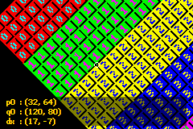

# 12. Affine backgrounds

<!-- toc -->

## Introduction {#sec-intro}

This section covers <dfn>affine backgrounds</dfn>: the ones on which you can perform an affine transformation via the **P** matrix. And that's all it does. If you haven't read – and understood! – the [sprite/bg overview](objbg.html) and the sections on [regular backgrounds](regbg.html) and the [affine transformation matrix](affine.html), do so before continuing.

If you know how to build a regular background and have understood the concepts behind the affine matrix, you should have little problems here. The theory behind an affine backgrounds are the same as for regular ones, the practice can be different at a number of very crucial points. For example, you use different registers for positioning and both the map-layout and their format are different.

Of the four backgrounds the GBA has, only the last two can be used as affine backgrounds, and only in specific video modes (see {@tbl:bg-types}). The sizes are also different for affine backgrounds. You can find a list of sizes in {@tbl:bga-size}.

<div class="cblock">
  <table>
    <tr>
      <td>
        <table id="tbl:bg-types" border=1 cellpadding=2 cellspacing=0 width=128>
          <caption align="bottom"><b>{*@tbl:bg-types}</b>: video modes and background type</caption>
          <tbody align="center">
            <tr>
              <th>mode</th>
              <th>0</th>
              <th>1</th>
              <th>2</th>
            </tr>
            <tr>
              <th>bg0</th>
              <td>reg</td>
              <td>reg</td>
              <td>-</td>
            </tr>
            <tr>
              <th>bg1</th>
              <td>reg</td>
              <td>reg</td>
              <td>-</td>
            </tr>
            <tr>
              <th>bg2</th>
              <td>reg</td>
              <td>aff</td>
              <td>aff</td>
            </tr>
            <tr>
              <th>bg3</th>
              <td>reg</td>
              <td>-</td>
              <td>aff</td>
            </tr>
          </tbody>
        </table>
      </td>
      <td width="10%"></td>
      <td>
        <table id="tbl:bga-size" border=1 cellpadding=2 cellspacing=0 width=144>
          <caption align="bottom"><b>{*@tbl:bga-size}</b>: affine bg sizes</caption>
          <col>
          <col class="def">
          <tbody align="center">
            <tr>
              <th>Sz</th>
              <th>define</th>
              <th>(tiles)</th>
              <th>(pixels)</th>
            </tr>
            <tr>
              <td>00</td>
              <td>BG_AFF_16x16</td>
              <td>16x16</td>
              <td>128x128</td>
            </tr>
            <tr>
              <td>01</td>
              <td>BG_AFF_32x32</td>
              <td>32x32</td>
              <td>256x256</td>
            </tr>
            <tr>
              <td>10</td>
              <td>BG_AFF_64x64</td>
              <td>64x64</td>
              <td>512x512</td>
            </tr>
            <tr>
              <td>11</td>
              <td>BG_AFF_128x128</td>
              <td>128x128</td>
              <td>1024x1024</td>
            </tr>
          </tbody>
        </table>
      </td>
    </tr>
  </table>
</div>

## Affine background registers {#sec-regs}

Like their regular counterparts, the primary control for affine backgrounds is `REG_BGxCNT`. If you've forgotten what it does, you can read a description [here](regbg.html#tbl-reg-bgxcnt). The differences with regular backgrounds are the sizes, and that `BG_WRAP` actually does something now. The other important registers are the <dfn>displacement vector</dfn> **dx** (`REG_BGxX` and `REG_BGxY`), and the <dfn>affine matrix</dfn> **P** (`REG_BGxPA`-`REG_BGxPD`). You can find their addresses in {@tbl:aff-regs}.

<div class="lblock">
  <table id="tbl:aff-regs" border=1 cellpadding=2 cellspacing=0>
    <caption align="bottom"><b>{*@tbl:aff-regs}</b>: Affine background register addresses. Note that <i>x</i> is 2 or 3 only!</caption>
    <col span=2 align="right">
    <tr>
      <th>Register</th>
      <th>length</th>
      <th>address</th>
    </tr>
    <tr>
      <th>REG_BGxCNT</th>
      <td>2</td>
      <td>0400:0008h + 2·x</td>
    </tr>
    <tr>
      <th>REG_BGxPA-PD</th>
      <td>2</td>
      <td>0400:0020h + 10h·(x-2)</td>
    </tr>
    <tr>
      <th>REG_BGxX</th>
      <td>4</td>
      <td>0400:0028h + 10h·(x-2)</td>
    </tr>
    <tr>
      <th>REG_BGxY</th>
      <td>4</td>
      <td>0400:002ch + 10h·(x-2)</td>
    </tr>
  </table>
</div>

There are a couple of things to take note of when it comes to displacement and transformation of affine backgrounds. First, the displacement *dx* uses different registers than regular backgrounds: `REG_BGxX` and `REG_BGxY` instead of `REG_BGxHOFS` and `REG_BGxVOFS`. A second point here is that they are 24.8 fixed numbers rather than pixel offsets. (Actually, they are 20.8 fixed numbers but that's not important right now.)

I usually use the affine parameters via BG_AFFINE struct instead of `REG_BGxPA`, etc. The memory map in *tonc_memmap.h* contains a `REG_BG_AFFINE` for this purpose. Setting the registers this way is advantageous at times because you'll usually have a BG_AFFINE struct set up already, which you can then copy to the registers with a single assignment. An example of this is given below.

The elements of the affine transformation matrix **P** works exactly like they do for affine sprites: 8.8 fixed point numbers that describe the transformation from screen to texture space. However for affine backgrounds they are stored consecutively (2 byte offset), whereas those of sprites are at an 8 byte offset. You can use the `bg_aff_foo` functions from *tonc_bg_affine.c* to set them to the transformation you want.

<div id="cd-bga-types">

```c
typedef struct tagBG_AFFINE
{
    s16 pa, pb;
    s16 pc, pd;
    s32 dx, dy
} ALIGN4 BG_AFFINE;

//! BG affine params array
#define REG_BG_AFFINE   ((BG_AFFINE*)(REG_BASE+0x0000))
```
</div>

```c
// Default BG_AFFINE data (tonc_core.c)
const BG_AFFINE bg_aff_default= { 256, 0, 0, 256, 0, 0 };

// Initialize affine registers for bg 2
REG_BG_AFFINE[2] = bg_aff_default;
```

<div class="note">
  <div class="nhcare">Regular vs affine tilemap scrolling</div>

  Affine tilemaps use **different** scrolling registers! Instead of REG_BG*x*HOFS and REG_BG*x*VOFS, they use REG_BG*x*X and REG_BG*x*Y. Also, these are 32bit fixed point numbers, not halfwords.
</div>

## Positioning and transforming affine backgrounds {#sec-aff-ofs}

Now that we know what the displacement and transformation registers are, now let's look at what they do. This is actually a lot trickier subject that you might think, so pay attention. Warning: this is gonna get mathematical again.

The displacement vector **dx** works the same as for regular backgrounds: **dx** contains the background-coordinates that are mapped to the screen origin. (And *not* the other way around!) However, this time **dx** is in fixed number notation. Likewise, the affine transformation matrix **P** works the same as for affine sprites: **P** describes the transformation from screen space to texture space. To put it mathematically, if we define

<table id="eq:defs">
  <tr>
    <td class="eqnrcell">({!@eq:defs}a)</td>
    <td class="eqcell">
      <i>T</i>(<b>dx</b>)<b>p</b> <b>:=</b> <b>p</b> + <b>dx</b><br>
      <i>T</i><sup>&minus;1</sup>(<b>dx</b>) = <i>T</i>(&minus;<b>dx</b>)
    </td>
  </tr>
  <tr>
    <td class="eqnrcell">({!@eq:defs}b)</td>
    <td class="eqcell"><b>P = A</b><sup>&minus;1</sup></td>
  </tr>
</table>

then

<table id="eq:aff-defs">
  <tr>
    <td class="eqnrcell">({!@eq:aff-defs}a)</td>
    <td class="eqcell"><i>T</i>(<b>dx</b>)<b>q</b> = <b>p</b></td>
  </tr>
  <tr>
    <td class="eqnrcell">({!@eq:aff-defs}b)</td>
    <td class="eqcell"><b>P &middot; q</b> = <b>p</b></td>
  </tr>
</table>

where

<table cellpadding=1 cellspacing=0>
  <tr>
    <th>p</th>
    <td>is a point in texture space,</td>
  </tr>
  <tr>
    <th>q</th>
    <td>is a point in screen space,</td>
  </tr>
  <tr>
    <th>dx</th>
    <td>is the displacement vector (<code>REG_BGxX</code> and <code>REG_BGxY</code>).</td>
  </tr>
  <tr>
    <th>A</th>
    <td>is the transformation from texture to screen space,</td>
  </tr>
  <tr>
    <th>P</th>
    <td>is the transformation screen from to texture space, (<code>REG_BGxPA</code>-<code>REG_BGxPD</code>).</td>
  </tr>
</table>
<br>

The problem with {@eq:aff-defs} is that these only describe what happens if you use either a displacement or a transformation. So what happens if you want to use both? This is an important question because the order of transformation matters (like we have seen in the [affine sprite demo](affobj.html#sec-demo)), and this is true for the order of transformation and displacement as well. As it happens, translation goes first:

<table id="eq:ofs">
  <tr>
    <td class="eqnrcell">({!@eq:ofs})</td>
    <td class="eqcell">
      <table class="eqtbl" cellpadding=2 cellspacing=0>
        <col align="right">
        <col align="center">
        <col align="left">
        <tr>
          <td><b>q</b></td>
          <td>=</td>
          <td><b>A</b> &middot; T(&minus;<b>dx</b>) <b>p</b></td>
        </tr>
        <tr>
          <td>T(<b>dx</b>) <b>P</b> &middot; <b>q</b></td>
          <td>=</td>
          <td><b>p</b></td>
        </tr>
        <tr>
          <td><b>dx</b> + <b>P</b> &middot; <b>q</b></td>
          <td>=</td>
          <td><b>p</b></td>
        </tr>
      </table>
    </td>
  </tr>
</table>

Another way to say this is that the transformation always uses the top left of the screen as its origin and the displacement tells which background pixels is put there. Of course, this arrangement doesn't help very much if you want to, say, rotate around some other point on the screen. To do that you'll have to pull a few tricks. To cover them all in one swoop, we'll combine {@eq:ofs} and the general coordinate transformation equation:

<table id="eq:aff-ofs">
  <tr>
    <td class="eqnrcell">({!@eq:aff-ofs})</td>
    <td class="eqcell">
      <table class="eqtbl" cellpadding=2 cellspacing=0>
        <col align="right">
        <col align="center">
        <col align="left">
        <tr>
          <td><b>dx + P &middot; q</b></td>
          <td>=</td>
          <td><b>p</b></td>
        </tr>
        <tr>
          <td class="bdrB"><b>P</b> &middot; (<b>q &minus; q</b><sub>0</sub>)</td>
          <td class="bdrB">=</td>
          <td class="bdrB"><b>p &minus; p</b><sub>0</sub></td>
          <td class="bdrB">&minus;</td>
        </tr>
        <tr>
          <td><b>dx + P &middot; q</b><sub>0</sub></td>
          <td>=</td>
          <td><b>p</b><sub>0</sub></td>
        </tr>
        <tr>
          <td><b>dx</b></td>
          <td>=</td>
          <td><b>p</b><sub>0</sub> &minus; <b>P &middot; q</b><sub>0</sub></td>
        </tr>
      </table>
    </td>
  </tr>
</table>

So what the hell does *that* mean? It means that if you use this **dx** for your displacement vector, you perform your transformation around texture point **p**<sub>0</sub>, which then ends up at screen point **q**<sub>0</sub>; the **P**·**q**<sub>0</sub> term is the correction in texture-space you have to perform to have the rotation point at **q**<sub>0</sub> instead of (0,0). So what the hell does *that* mean? It means that before you try to use this stuff you should think about which effect you are actually trying to pull off and that you have *two* coordinate systems to work with, not one. When you do, the meaning of {@eq:aff-ofs} will become apparent. In any case, the function I use for this is `bg_rotscale_ex()`, which basically looks like this:

```c
typedef struct tagAFF_SRC_EX
{
    s32 tex_x, tex_y;   // vector p0: origin in texture space (24.8f)
    s16 scr_x, scr_y;   // vector q0: origin in screen space (16.0f)
    s16 sx, sy;         // scales (8.8f)
    u16 alpha;          // CCW angle ( integer in [0,0xFFFF] )
} ALIGN4 AFF_SRC_EX;

void bg_rotscale_ex(BG_AFFINE *bgaff, const AFF_SRC_EX *asx)
{
    int sx= asx->sx, sy= asx->sy;
    int sina= lu_sin(asx->alpha), cosa= lu_cos(asx->alpha);

    FIXED pa, pb, pc, pd;
    pa=  sx*cosa>>12;   pb=-sx*sina>>12;    // .8f
    pc=  sy*sina>>12;   pd= sy*cosa>>12;    // .8f

    bgaff->pa= pa;  bgaff->pb= pb;
    bgaff->pc= pc;  bgaff->pd= pd;

    bgaff->dx= asx->tex_x - (pa*asx->scr_x + pb*asx->scr_y);
    bgaff->dy= asx->tex_y - (pc*asx->scr_x + pd*asx->scr_y);
}
```

This is very similar to the `obj_rotscale_ex()` function covered in the [off-center object transformation](affobj.html#sec-combo) section. The math is identical, but the terms have been reshuffled a bit. The background version is actually simpler because the affine offset correction can be done in texture space instead of screen space, which means no messing about with **P**'s inverse matrix. Or with sprite-size corrections, thank IPU. For the record, yes you can apply the function directly to `REG_BG_AFFINE`.

### Internal reference point registers {#ssec-bga-refpts}

There's one more important thing left to mention about the displacement and transformation registers. Quoting directly from [GBATEK](https://problemkaputt.de/gbatek.htm#lcdiobgrotationscaling) (except the bracketed parts):

> The above reference points \[the displacement registers\] are automatically copied to internal registers during each vblank, specifying the origin for the first scanline. The internal registers are then incremented by dmx \[`REG_BGxPB`\] and dmy \[`REG_BGxPD`\] after each scanline.
> Caution: Writing to a reference point register by software outside of the Vblank period does immediately copy the new value to the corresponding internal register, that means: in the current frame, the new value specifies the origin of the *current* scanline (instead of the topmost scanline).

Normally this won't matter to you, but if you try to write to `REG_BGxY` during an HBlank things, might not go as expected. As I learned the hard way when I tried to get my Mode 7 stuff working. This only affects affine backgrounds, though; regular ones use other registers.

## Mapping format {#sec-map}

Both the map layout and screen entries for affine backgrounds are very different from those of regular backgrounds. Ironically, they are also a lot simpler. While regular backgrounds divide the full map into quadrants (each using one full screenblock), the affine backgrounds use a flat map, meaning that the normal equation for getting a screenentry-number *n* works, making things a whole lot easier.

<table id="eq:aff-sid">
  <tr>
    <td class="eqnrcell">{!@eq:aff-sid}</td>
    <td class="eqcell"><i>n</i> = <i>tx</i> + <i>ty</i>·<i>tw</i></td>
  </tr>
</table>

The screen entries themselves are also different from those of regular backgrounds as well. In affine maps, they are *1 byte long* and only contain the index of the tile to use. Additionally, you can *only* use 256 color tiles. This gives you access to all the tiles in the base charblock, but not the one(s) after it.

And that's about it, really. No, wait there's one more issue: you have to be careful when filling or changing the map because *VRAM can only be accessed 16 or 32 bits at a time*. So if you have your map stored in an array of bytes, you'll have to cast it to `u16` or `u32` first. Or use [DMA](dma.html). OK, now I'm done.

<div class="note">
  <div class="nhcare">Regular vs affine tilemap mapping differences</div>

  There are two important differences between regular and affine map formats. First, affine screen entries are merely one-byte tile indices. Secondly, the maps use a linear layout, rather than the division into 32x32t maps that bigger regular maps use.
</div>

## *sbb_aff* demo {#sec-demo}

<div class="cpt_fr" style="width:240px">
  
  <b>{*@fig:sbb-aff}</b>: <i>sbb_aff</i> demo.
</div>

*sbb_aff* is to affine backgrounds what *sbb_reg* was to regular ones, with a number of extras. The demo uses a 64x64 tile affine background, shown in {@fig:sbb-aff}. This is divided into 16 parts of 256 bytes, each of which is filled with tiles of one color and the number of that part on it. Now, if the map-layout for affine backgrounds was the same as regular ones, each part would form a 16x16t square. If it is a flat memory layout, each part would be a 64x16t strip. As you can see in {@fig:sbb-aff}, it is the latter. You can also see that, unlike regular backgrounds, this map doesn't wrap around automatically at the edges.

The most interesting thing about the demo are the little black and white crosshairs. The white crosshairs indicates the rotation point (the anchor). As I said earlier, you cannot simply pick a map-point **p**<sub>0</sub> and say that that is ‘the’ rotation point. Well you could, but it wouldn't give the desired effect. Simply using a map-point will give you a rotating map around that point, but on screen it'll always be in the top-left corner. To move the map anchor to a specific location on the screen, you need an anchor there as well. This is **q**<sub>0</sub>. Fill both into {@eq:aff-ofs} to find the displacement vector you need: **dx** = **p**<sub>0</sub>−**P·q**<sub>0</sub>. This **dx** is going to be quite different from both **p**<sub>0</sub> and **q**<sub>0</sub>. Its path is indicated by the black crosshairs.

The demo lets you control both **p**<sub>0</sub> and **q**<sub>0</sub>. And rotation and scaling, of course. The full list of controls is.

<div class="lblock">
  <table cellpadding=1 cellspacing=0>
    <tr>
      <th>D-pad</th>
      <td>move map rotation point, <b>p</b><sub>0</sub></td>
    </tr>
    <tr>
      <th>D-pad + A</th>
      <td>move screen rotation point, <b>q</b><sub>0</sub></td>
    </tr>
    <tr>
      <th>L,R</th>
      <td>rotate the background.</td>
    </tr>
    <tr>
      <th>B(+Se)</th>
      <td>scale up and down.</td>
    </tr>
    <tr>
      <th>St</th>
      <td>Toggle wrapping flag.</td>
    </tr>
    <tr>
      <th>St+Se</th>
      <td>Reset anchors and <b>P</b></td>
    </tr>
  </table>
</div>

<div id="cd=sbb-aff">

```c
#include <stdio.h>
#include <tonc.h>
#include "nums.h"

#define MAP_AFF_SIZE 0x0100

// --------------------------------------------------------------------
// GLOBALS
// --------------------------------------------------------------------

OBJ_ATTR *obj_cross= &oam_mem[0];
OBJ_ATTR *obj_disp= &oam_mem[1];

BG_AFFINE bgaff;

// --------------------------------------------------------------------
// FUNCTIONS
// --------------------------------------------------------------------

void win_textbox(int bgnr, int left, int top, int right, int bottom, int bldy)
{
    REG_WIN0H= left<<8 | right;
    REG_WIN0V=  top<<8 | bottom;
    REG_WIN0CNT= WIN_ALL | WIN_BLD;
    REG_WINOUTCNT= WIN_ALL;

    REG_BLDCNT= (BLD_ALL&~BIT(bgnr)) | BLD_BLACK;
    REG_BLDY= bldy;

    REG_DISPCNT |= DCNT_WIN0;

    tte_set_margins(left, top, right, bottom);
}

void init_cross()
{
    TILE cross=
    {{
        0x00011100, 0x00100010, 0x01022201, 0x01021201,
        0x01022201, 0x00100010, 0x00011100, 0x00000000,
    }};
    tile_mem[4][1]= cross;

    pal_obj_mem[0x01]= pal_obj_mem[0x12]= CLR_WHITE;
    pal_obj_mem[0x02]= pal_obj_mem[0x11]= CLR_BLACK;

    obj_cross->attr2= 0x0001;
    obj_disp->attr2= 0x1001;
}

void init_map()
{
    int ii;

    memcpy32(&tile8_mem[0][1], nums8Tiles, nums8TilesLen/4);
    memcpy32(pal_bg_mem, numsPal, numsPalLen/4);

    REG_BG2CNT= BG_CBB(0) | BG_SBB(8) | BG_AFF_64x64;
    bgaff= bg_aff_default;

    // fill per 256 screen entries (=32x4 bands)
    u32 *pse= (u32*)se_mem[8];
    u32 ses= 0x01010101;
    for(ii=0; ii<16; ii++)
    {
        memset32(pse, ses, MAP_AFF_SIZE/4);
        pse += MAP_AFF_SIZE/4;
        ses += 0x01010101;
    }
}

void sbb_aff()
{
    AFF_SRC_EX asx=
    {
        32<<8, 64<<8,           // Map coords.
        120, 80,                // Screen coords.
        0x0100, 0x0100, 0       // Scales and angle.
    };

    const int DX=256;
    FIXED ss= 0x0100;

    while(1)
    {
        vid_vsync();
        key_poll();

        // dir + A : move map in screen coords
        if(key_is_down(KEY_A))
        {
            asx.scr_x += key_tri_horz();
            asx.scr_y += key_tri_vert();
        }
        else    // dir : move map in map coords
        {
            asx.tex_x -= DX*key_tri_horz();
            asx.tex_y -= DX*key_tri_vert();
        }
        // rotate
        asx.alpha -= 128*key_tri_shoulder();


        // B: scale up ; B+Se : scale down
        if(key_is_down(KEY_B))
            ss += (key_is_down(KEY_SELECT) ? -1 : 1);

        // St+Se : reset
        // St : toggle wrapping flag.
        if(key_hit(KEY_START))
        {
            if(key_is_down(KEY_SELECT))
            {
                asx.tex_x= asx.tex_y= 0;
                asx.scr_x= asx.scr_y= 0;
                asx.alpha= 0;
                ss= 1<<8;
            }
            else
                REG_BG2CNT ^= BG_WRAP;
        }

        asx.sx= asx.sy= (1<<16)/ss;

        bg_rotscale_ex(&bgaff, &asx);
        REG_BG_AFFINE[2]= bgaff;

        // the cross indicates the rotation point
        // (== p in map-space; q in screen-space)
        obj_set_pos(obj_cross, asx.scr_x-3, (asx.scr_y-3));
        obj_set_pos(obj_disp, (bgaff.dx>>8)-3, (bgaff.dy>>8)-3);

        tte_printf("#{es;P}p0\t: (%d, %d)\nq0\t: (%d, %d)\ndx\t: (%d, %d)",
            asx.tex_x>>8, asx.tex_y>>8, asx.scr_x, asx.scr_y,
            bgaff.dx>>8, bgaff.dy>>8);
    }
}

int main()
{
    init_map();
    init_cross();

    REG_DISPCNT= DCNT_MODE1 | DCNT_BG0 | DCNT_BG2 | DCNT_OBJ;

    tte_init_chr4_b4_default(0, BG_CBB(2)|BG_SBB(28));
    tte_init_con();
    win_textbox(0, 8, 120, 232, 156, 8);

    sbb_aff();

    return 0;
}
```
</div>
