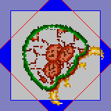
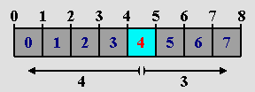
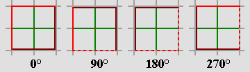
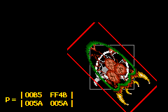
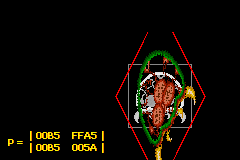
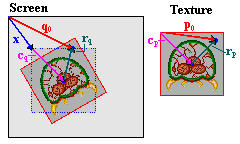
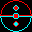
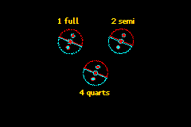

Title: 11. Affine sprites
Date: 2003-09-01
Modified: 2023-09-10
Authors: Cearn

# 11. Affine sprites {#ch-}

<!-- toc -->

## Affine sprite introduction {#sec-intro}

Essentially, <dfn>affine sprites</dfn> are still sprites. The difference with regular sprites is that you can perform an affine transformation (hence the name) on them before the rendering stage by setting the right bits in the object attributes and filling in the **P** matrix. You can read about affine transformations and the **P** matrix [here](affine.html). It is required reading for this section, as are the [sprite and background overview](objbg.html) and the [regular sprite](regobj.html) page.

You may wonder whether this is really worth a separate section. The short answer is yes. A longer answer is yes, because using affine sprites involves a lot more math than regular sprites and I didn't want to freak out the, erm, ‘mathematically challenged’. The section on [regular sprites](regobj.html) can stand on its own and you can use it in blissful ignorance of the nasty math that it required for affine sprites.

In this chapter we'll see how to set-up object to use affine transformations. This in itself is rather easy. Also discussed are a number of potential graphical problems you might run into sooner or later –one of them almost immediately, actually– and how to correct the sprite's position to make it seem like the transformation's origin is at an arbitrary point. And, as usual, there will be demo-code illustrating the various topics raised in this chapter.

## Affine sprite initialization {#sec-init}

To turn a regular sprite into an affine sprite you need to do two things. First, set `OBJ_ATTR.attr0{8}` to indicate this is a affine sprite. Second, put a number between 0 and 31 into `OBJ_ATTR.attr1{8-C}`. This number indicates which of the 32 Object Affine Matrices (`OBJ_AFFINE` structures) should be used. In case you've forgotten, the `OBJ_AFFINE` looks like this:

```c
typedef struct OBJ_AFFINE
{
    u16 fill0[3];
    s16 pa;
    u16 fill1[3];
    s16 pb;
    u16 fill2[3];
    s16 pc;
    u16 fill3[3];
    s16 pd;
} ALIGN4 OBJ_AFFINE;
```

The *signed* 16-bit members `pa`, `pb`, `pc` and `pd` are 8.8 fixed point numbers that form the actual matrix, which I will refer to as **P**, in correspondence with the elements' names. For more information about this matrix, go to the [affine matrix](affine.html) section. Do so now if you haven't already, because I'm not going to repeat it here. If all you are after is a simple scale-then-rotate matrix, try this: for a zoom by s<sub>x</sub> and s<sub>y</sub> followed by a counter-clockwise rotation by α, the correct matrix is this:
<!--
\vb{P} =
\begin{bmatrix}
p_{a} & p_{b} \\
p_{c} & p_{d}
\end{bmatrix} =
\begin{bmatrix}
\cos(\alpha)/s_{x} & -\sin(\alpha)/s_{x} \\
-\sin(\alpha)/s_{y} & \cos(\alpha)/s_{y}
\end{bmatrix}
-->
<math xmlns="http://www.w3.org/1998/Math/MathML" display="block">
  <mstyle displaystyle="true" scriptlevel="0">
    <mrow data-mjx-texclass="ORD">
      <mtable rowspacing=".5em" columnspacing="1em" displaystyle="true">
        <mtr>
          <mtd>
            <mi mathvariant="bold">P</mi>
            <mo>=</mo>
            <mrow data-mjx-texclass="INNER">
              <mo data-mjx-texclass="OPEN">[</mo>
              <mtable columnspacing="1em" rowspacing="4pt">
                <mtr>
                  <mtd>
                    <msub>
                      <mi>p</mi>
                      <mrow data-mjx-texclass="ORD">
                        <mi>a</mi>
                      </mrow>
                    </msub>
                  </mtd>
                  <mtd>
                    <msub>
                      <mi>p</mi>
                      <mrow data-mjx-texclass="ORD">
                        <mi>b</mi>
                      </mrow>
                    </msub>
                  </mtd>
                </mtr>
                <mtr>
                  <mtd>
                    <msub>
                      <mi>p</mi>
                      <mrow data-mjx-texclass="ORD">
                        <mi>c</mi>
                      </mrow>
                    </msub>
                  </mtd>
                  <mtd>
                    <msub>
                      <mi>p</mi>
                      <mrow data-mjx-texclass="ORD">
                        <mi>d</mi>
                      </mrow>
                    </msub>
                  </mtd>
                </mtr>
              </mtable>
              <mo data-mjx-texclass="CLOSE">]</mo>
            </mrow>
            <mo>=</mo>
            <mrow data-mjx-texclass="INNER">
              <mo data-mjx-texclass="OPEN">[</mo>
              <mtable columnspacing="1em" rowspacing="4pt">
                <mtr>
                  <mtd>
                    <mi>cos</mi>
                    <mo data-mjx-texclass="NONE">&#x2061;</mo>
                    <mrow>
                      <mo data-mjx-texclass="OPEN">(</mo>
                      <mi>&#x3B1;</mi>
                      <mo data-mjx-texclass="CLOSE">)</mo>
                    </mrow>
                    <mrow data-mjx-texclass="ORD">
                      <mo>/</mo>
                    </mrow>
                    <msub>
                      <mi>s</mi>
                      <mrow data-mjx-texclass="ORD">
                        <mi>x</mi>
                      </mrow>
                    </msub>
                  </mtd>
                  <mtd>
                    <mo>&#x2212;</mo>
                    <mi>sin</mi>
                    <mo data-mjx-texclass="NONE">&#x2061;</mo>
                    <mrow>
                      <mo data-mjx-texclass="OPEN">(</mo>
                      <mi>&#x3B1;</mi>
                      <mo data-mjx-texclass="CLOSE">)</mo>
                    </mrow>
                    <mrow data-mjx-texclass="ORD">
                      <mo>/</mo>
                    </mrow>
                    <msub>
                      <mi>s</mi>
                      <mrow data-mjx-texclass="ORD">
                        <mi>x</mi>
                      </mrow>
                    </msub>
                  </mtd>
                </mtr>
                <mtr>
                  <mtd>
                    <mo>&#x2212;</mo>
                    <mi>sin</mi>
                    <mo data-mjx-texclass="NONE">&#x2061;</mo>
                    <mrow>
                      <mo data-mjx-texclass="OPEN">(</mo>
                      <mi>&#x3B1;</mi>
                      <mo data-mjx-texclass="CLOSE">)</mo>
                    </mrow>
                    <mrow data-mjx-texclass="ORD">
                      <mo>/</mo>
                    </mrow>
                    <msub>
                      <mi>s</mi>
                      <mrow data-mjx-texclass="ORD">
                        <mi>y</mi>
                      </mrow>
                    </msub>
                  </mtd>
                  <mtd>
                    <mi>cos</mi>
                    <mo data-mjx-texclass="NONE">&#x2061;</mo>
                    <mrow>
                      <mo data-mjx-texclass="OPEN">(</mo>
                      <mi>&#x3B1;</mi>
                      <mo data-mjx-texclass="CLOSE">)</mo>
                    </mrow>
                    <mrow data-mjx-texclass="ORD">
                      <mo>/</mo>
                    </mrow>
                    <msub>
                      <mi>s</mi>
                      <mrow data-mjx-texclass="ORD">
                        <mi>y</mi>
                      </mrow>
                    </msub>
                  </mtd>
                </mtr>
              </mtable>
              <mo data-mjx-texclass="CLOSE">]</mo>
            </mrow>
          </mtd>
        </mtr>
      </mtable>
    </mrow>
  </mstyle>
</math>

Note that the origin of the transformation is *center* of the sprite, not the top-left corner. This is worth remembering if you want to align your sprite with other objects, which we'll do later.

<div class="note">
<div class="nhgood">
Essential affine sprite steps
</div>

-   Set-up an object as usual: load graphics and palette, set `REG_DISPCNT`, set-up an OAM entry.
-   Set bit 8 of attribute 0 to enable affinity for that object, and choose an object affine matrix to use (attribute 1, bits 8-12).
-   Set that obj affine matrix to something other than all zeroes, for example the identity matrix.
</div>

## Graphical artifacts {#sec-artifact}

### The clipping and discretization artifacts {#ssec-clip}

The procedure that the GBA uses for drawing sprites is as follows: the sprite forms a rectangle on the screen defined by its size. To paint the screen pixels in that area (**q**) uses texture-pixel **p**, which is calculated via:

<!--
\vb{p} - \vb{p}_{0} = \vb{P} \cdot (\vb{q} - \vb{q}_0)
-->
<table id="eq:aff-ofs">
<tr>
  <td class="eqnrcell">({!@eq:aff-ofs})
  <td class="eqcell">
<math xmlns="http://www.w3.org/1998/Math/MathML" display="block">
  <mstyle displaystyle="true" scriptlevel="0">
    <mrow data-mjx-texclass="ORD">
      <mtable rowspacing=".5em" columnspacing="1em" displaystyle="true">
        <mtr>
          <mtd>
            <mi mathvariant="bold">p</mi>
            <mo>&#x2212;</mo>
            <msub>
              <mi mathvariant="bold">p</mi>
              <mrow data-mjx-texclass="ORD">
                <mn>0</mn>
              </mrow>
            </msub>
            <mo>=</mo>
            <mi mathvariant="bold">P</mi>
            <mo>&#x22C5;</mo>
            <mo stretchy="false">(</mo>
            <mi mathvariant="bold">q</mi>
            <mo>&#x2212;</mo>
            <msub>
              <mi mathvariant="bold">q</mi>
              <mn>0</mn>
            </msub>
            <mo stretchy="false">)</mo>
          </mtd>
        </mtr>
      </mtable>
    </mrow>
  </mstyle>
</math>
</table>

where **p**<sub>0</sub> and **q**<sub>0</sub> are the centers of the sprite in texture and screen space, respectively. The code below is essentially what the hardware does; it scans the screen-rectangle between plus and minus the half-width and half-height (half-sizes because the center is the reference point), calculates the texture-pixel and plots that color.

```c
// pseudocode for affine objects
hwidth= width/2;   // half-width of object screen canvas
hheight= hheight/2;   // half-height of object screen canvas
for(iy=-hheight; iy<hheight; iy++)
{
    for(ix=-hwidth; ix<hwidth; ix++)
    {
        px= (pa*ix + pb*iy)>>8;    // get x texture coordinate
        py= (pc*ix + pd*iy)>>8;    // get y texture coordinate
        color= GetPixel(px0+px, py0+py);   // get color from (px,py)
        SetPixel(qx0+ix, qy0+iy, color);     // set color to (qx, qy)
    }
}
```

This has two main consequences, the clipping artifact and a discretization artifact.

<div class="cpt_fr" style="width:160px;">
<br>
<b>{*@fig:metr-clip}</b>: a partially defanged metroid, 
since the parts outside the blue square are clipped off.
</div>

The <dfn>clipping artifact</dfn> is caused by scanning only over the rectangle **on-screen**. But almost all transformations will cause the texture pixels to exceed that rectangle, and the pixels outside the rectangle will not be rendered. {*@fig:metr-clip} shows the screen rect (grey, blue border) and a rotated object (inside the red border). The parts that extend the blue borderlines will not be cut off.

As this is an obvious flaw, there is of course a way around it: set the sprite's affine mode to **double-sized affine** (`ATTR0_AFF_DBL`, `OBJ_ATTR.attr0{8,9}`). This will double the screen range of valid **q** coordinates, so you'd have + and − the width and height to play with instead of the half-sizes. This double (well quadruple, really) area means that you can safely rotate a sprite as the maximum distance from the center is ½√2 ≈ 0.707. Of course, you can still get the clipping artifact if you scale up beyond the doubled ranges. Also, note that the sprites' origin is shifted to the center of this rectangle, so that **q**<sub>0</sub> is now one full sprite-size away from the top-left corner.

The double-size flag also has a second use. Or perhaps I should say misuse. If you set it for a regular sprite, it will be hidden. This is an alternative way to hide unused sprites.

The second artifact, if you can call it that, is a <dfn>discretization</dfn> artifact. This is a more subtle point than the clipping artifact and you might not even ever notice it. The problem here is that the transformation doesn't actually take place at the center of the object, but at the **center pixel**, rounded up. As an example, look at {@fig:numline}. Here we have a number-line from 0 to 8; and in between them 8 pixels from 0 to 7. The number at the center is 4, of course. The central pixel is 4 as well, however its location is actually halfway between numbers 4 and 5. This creates an unbalance between the number of pixels on the left and on the right.

The center pixel is the reference point of the transformation algorithm, which has indices (ix, iy) = (0, 0). Fill that into the equations and you'll see that this is invariant under the transformation, even though mathematically it should not be. This has consequences for the offsets, which are calculated from the pixel, not the position. In {@fig:numline}, there are 4 pixels on the left, but only 3 on the right. A mirroring operation that would center on pixel 4 would effectively move the sprite one pixel to the right.

{*@fig:aff-algor} shows how this affects rotations. It displays lines every grey gridlines every 8 pixels and a 16×16 sprite of a box. Note that at the start the right and left sides do not lie on the gridlines, because the sprite's width and height is 16, not 17. The other figures are rotations in increments of 90°, which gives nice round numbers in the matrix. When rotating, the center pixel (the red dot in the middle) stays in the same position, and the rest rotate around it, and this process will carry the edges out of the designated 16×16 box of the sprite (the dashed lines).

<div class="cblock">
<table>
<tbody valign="top">
<tr>
  <td>
  <div class="cpt_fr" style="width:288px;">
  <br>
  <b>{*@fig:numline}</b>: pixels are between, 
    not on, coordinates.
  </div></td>
  <td>
  <div class="cpt_fr" style="width:320px;">
  <br>
  <b>{*@fig:aff-algor}</b>: Rotations in 90&deg; 
    increments.
  </div></td>
</tr>
</tbody>
</table>
</div>

<div class="note">
<div class="nhcare">
The offsets measure distance from the center pixel, not center position.
</div>

The offsets that are calculated from the affine matrix use the distances from the center pixel (*w*/2, *h*/2), not the center point. As such, there is a half a pixel deviation from the mathematical transformation, which may result in a ±pixel offset for the sprite as a whole and lost texture edges.
</div>

### The wrapping artifact {#ssec-wrap}

Apart from the clipping artifact, there seems to be another; one that I have actually never seen mentioned anywhere. It's what I call the wrapping artifact. As you know, the position for sprites is given in a 9-bit *x*-value and an 8-bit *y*-value, which values wrap around the screen. For *x*, you can just interpret this as having the \[-256, 255\] range. For *y* values, you can't really do that because the top value for a signed 8-bit integer is 127, which would mean that you'd never be able to put a sprite at the bottom 32 lines. But since the values wrap around, it all works out in the end anyway. With one exception.

There's never any trouble with regular sprites, and hardly any for affine sprites; the one exception is when you have a 64×64 or 32×64 affine sprite with the double size flag switched on. Such a sprite has a bounding box of 128×128. Now there are three different ways of interpreting the meaning of *y* \> 128:

1.  Full-wrap: the top of the sprite would show at the bottom of the screen, and vice versa.
2.  Positive precedence: consider the \[128, 159\] range as indicative of the bottom of the screen, and forget the wrap.
3.  Negative precedence: if *y* value would make the sprite appear partially at the top, consider it to be negative, again neglecting the wrap.

As it happens, the GBA uses the third interpretation. In other words, it uses

```c
// pseudo code
if(oam.y + bbox_height > 256)
    oam.y -= 256;
```

Note, by the way, that some older emulators (VBA and BoycottAdvance) both use interpretation #2, which may seem more logical, but is incorrect. As you can tell, it can only happen with a 32×64 or 64×64, double-sized sprite, and even then you'll only notice it under very specific conditions, namely if the transformed sprite has visible pixels inside the top 32 lines of the bounding box. In the case that you have this problem, as far as I can tell the only way to get the sprite showing at the bottom of the screen is if you reduce the height to 32 for the time being.

## A very (af)fine demo {#sec-demo}

I have a really interesting demo for you this time called *obj_aff*. It features a normal (boxed) metroid, which can be scaled, rotated and scaled. Because these transformations are applied to the *current* state of the matrix, you can end up with every kind of affine matrix possible by concatenating the different matrices. The controls are as follows:

<div class="lblock">

- L and R Buttons  
  Rotates the sprite counterclockwise and clockwise, respectively.
- Control Pad  
  Shears the sprite.
- Control Pad + Select Button  
  Moves sprite around.
- A and B Buttons  
  Expand horizontally or vertically, respectively.
- A and B Buttons + Select Button  
  Shrinks horizontally or vertically, respectively. (I ran out of buttons, so had to do it like this.)
- Start Button  
  Toggles double-size flag. Note that a) the corners of a rotated sprite are no longer clipped and b) the position shifts by 1/2 sprite size.
- Start+Select Buttons  
  Resets **P** to normal.
- Select Button  
  Modifier button (see A, B and Start).

</div>

The interesting point of seeing the transformations back to back is that you can actually see the difference between, for example, a scaling followed by a rotation (**A**=**S**·**R**), and a rotate-then-scale (**A**=**R**·**S**). {*@fig:obj-aff-rs} and {@fig:obj-aff-sr} show this difference for a 45° rotation and a 2× vertical scale. Also, note that the corners are cut off here: the clipping artifact at work – even though I've already set the double-size flag here.

<div class="cblock">
<table>
<tr>
<td>
<div class="cpt_fr" style="width:240px;">
<br>
<b>{*@fig:obj-aff-rs}</b>: 
  <tt>obj_aff</tt>, via <b>S</b>(1,2), then <b>R</b>(45&deg;)
</div>
<td>
<div class="cpt_fr" style="width:240px;">
<br>
<b>{*@fig:obj-aff-sr}</b>: 
  <tt>obj_aff</tt>, via <b>R</b>(45&deg;), then <b>S</b>(1,2)
</div>
</table>
</div>

The full source code for the *obj_aff* demo is given below. It's quite long, mostly because of the amount of code necessary for managing the different affine states that can be applied. The functions that actually deal with affine sprites are `init_metr()`, `get_aff_new()` and part of the game loop in `objaff_test()`; the rest is essentially fluff required to making the whole thing work.

<div id="cd-obj-aff">

```c
// obj_aff.c

#include <tonc.h>
#include <stdio.h>

#include "metr.h"

OBJ_ATTR obj_buffer[128];
OBJ_AFFINE *obj_aff_buffer= (OBJ_AFFINE*)obj_buffer;


// affine transformation constants and variables
enum eAffState
{
    AFF_NULL=0, AFF_ROTATE, AFF_SCALE_X, AFF_SCALE_Y, 
    AFF_SHEAR_X, AFF_SHEAR_Y, AFF_COUNT
};

// 'speeds' of transformations
const int aff_diffs[AFF_COUNT]= { 0, 128, 4, 4, 4, 4 };
// keys for transformation direction
const int aff_keys[AFF_COUNT]=
{ 0, KEY_L, KEY_SELECT, KEY_SELECT, KEY_RIGHT, KEY_UP };
int aff_state= AFF_NULL, aff_value= 0;


void init_metr()
{
    // Places the tiles of a 4bpp metroid sprite into LOW obj VRAM
    memcpy32(tile_mem[4], metr_boxTiles, metr_boxTilesLen/4);
    memcpy32(pal_obj_mem, metrPal, metrPalLen/4);

    // Set up main metroid
    obj_set_attr(obj_buffer, 
        ATTR0_SQUARE | ATTR0_AFF,          // Square affine sprite
        ATTR1_SIZE_64 | ATTR1_AFF_ID(0),   // 64x64, using obj_aff[0]
        0 | 0);                            // palbank 0, tile 0
    obj_set_pos(obj_buffer, 96, 32);
    obj_aff_identity(&obj_aff_buffer[0]);

    // Set up shadow metroid
    obj_set_attr(&obj_buffer[1], 
        ATTR0_SQUARE | ATTR0_AFF,           // Square affine sprite
        ATTR1_SIZE_64 | ATTR1_AFF_ID(31),   // 64x64, using obj_aff[0]
        ATTR2_PALBANK(1) | 0);              // palbank 1, tile 0
    obj_set_pos(&obj_buffer[1], 96, 32);
    obj_aff_identity(&obj_aff_buffer[31]);

    oam_update_all();
}

int get_aff_state()
{
    if(key_is_down(KEY_L | KEY_R))
        return AFF_ROTATE;
    if(key_is_down(KEY_A))
        return AFF_SCALE_X;
    if(key_is_down(KEY_B))
        return AFF_SCALE_Y;
    if(key_is_down(KEY_LEFT | KEY_RIGHT))
        return AFF_SHEAR_X;
    if(key_is_down(KEY_UP | KEY_DOWN))
        return AFF_SHEAR_Y;
    return AFF_NULL;
}

void get_aff_new(OBJ_AFFINE *oa)
{
    int diff= aff_diffs[aff_state];
    aff_value += (key_is_down(aff_keys[aff_state]) ? diff : -diff);

    switch(aff_state)
    {
    case AFF_ROTATE:    // L rotates left, R rotates right
        aff_value &= SIN_MASK;
        obj_aff_rotate(oa, aff_value);
        break;
    case AFF_SCALE_X:   // A scales x, +SELECT scales down
        obj_aff_scale_inv(oa, (1<<8)-aff_value, 1<<8);
        break;
    case AFF_SCALE_Y:   // B scales y, +SELECT scales down
        obj_aff_scale_inv(oa, 1<<8, (1<<8)-aff_value);
        break;
    case AFF_SHEAR_X:   // shear left and right
        obj_aff_shearx(oa, aff_value);
        break;
    case AFF_SHEAR_Y:   // shear up and down
        obj_aff_sheary(oa, aff_value);
        break;
    default:            // shouldn't happen
        obj_aff_identity(oa);
    }
}

void objaff_test()
{
    OBJ_ATTR *metr= &obj_buffer[0], *shadow= &obj_buffer[1];
    OBJ_AFFINE *oaff_curr= &obj_aff_buffer[0]; 
    OBJ_AFFINE *oaff_base= &obj_aff_buffer[1]; 
    OBJ_AFFINE *oaff_new=  &obj_aff_buffer[2];

    int x=96, y=32;
    int new_state;

    // oaff_curr = oaff_base * oaff_new
    // oaff_base changes when the aff-state changes
    // oaff_new is updated when it doesn't
    obj_aff_identity(oaff_curr);
    obj_aff_identity(oaff_base);
    obj_aff_identity(oaff_new);

    while(1)
    {
        key_poll();

        // move sprite around
        if( key_is_down(KEY_SELECT) && key_is_down(KEY_DIR) )
        {
            // move
            x += 2*key_tri_horz();
            y += 2*key_tri_vert();

            obj_set_pos(metr, x, y);
            obj_set_pos(shadow, x, y);
            new_state= AFF_NULL;
        }
        else    // or do an affine transformation
            new_state= get_aff_state();

        if(new_state != AFF_NULL)   // no change
        {
            if(new_state == aff_state)  // increase current transformation
            {
                get_aff_new(oaff_new);
                obj_aff_copy(oaff_curr, obj_aff_base, 1);
                obj_aff_postmul(oaff_curr, oaff_new);
            }
            else        // switch to different transformation type
            {
                obj_aff_copy(oaff_base, oaff_curr, 1);
                obj_aff_identity(oaff_new);
                aff_value= 0;
            }
            aff_state= new_state;
        }

        // START: toggles double-size flag
        // START+SELECT: resets obj_aff to identity
        if(key_hit(KEY_START))
        {
            if(key_is_down(KEY_SELECT))
            {
                obj_aff_identity(oaff_curr);
                obj_aff_identity(oaff_base);
                obj_aff_identity(oaff_new);
                aff_value= 0;
            }
            else
            {
                metr->attr0 ^= ATTR0_DBL_BIT;
                shadow->attr0 ^= ATTR0_DBL_BIT;
            }
        }

        vid_vsync();

        // we only have one OBJ_ATTR, so update that
        obj_copy(obj_mem, obj_buffer, 2);

        // we have 3 OBJ_AFFINEs, update these separately
        obj_aff_copy(obj_aff_mem, obj_aff_buffer, 3);

        // Display the current matrix
        tte_printf("#{es;P:8,136}P =  "
            "#{y:-7;Ps}| %04X\t%04X#{Pr;x:72}|"
            "#{Pr;y:12}| %04X\t%04X#{Pr;p:72,12}|", 
            (u16)oaff_curr->pa, (u16)oaff_curr->pb, 
            (u16)oaff_curr->pc, (u16)oaff_curr->pd);
    }
}

int main()
{
    REG_DISPCNT= DCNT_BG0 | DCNT_OBJ | DCNT_OBJ_1D;
    oam_init(obj_buffer, 128);
    init_metr();

    tte_init_chr4_b4_default(0, BG_CBB(2)|BG_SBB(28));
    tte_init_con();
    tte_set_margins(8, 128, 232, 160);

    objaff_test();

    return 0;
}
```
</div>

Making the metroid an affine sprite is all done inside `init_metr()`. As you've seen how bits are set a number of times by now, it should be understandable. That said, do note that I am filling the first `OBJ_AFFINE` (the one that the sprite uses) to the identity matrix **I**. If you keep this fully zeroed-out, you'll just end up with a 64×64-pixel rectangle of uniform color. Remember that **P** contains pixel offsets; if they're all zero, there is no offset and the origin's color is used for the whole thing. In essence, the sprite is scaled up to infinity.

To be frank though, calling `obj_aff_identity()` isn't necessary after a call to `oam_init()`, as that initializes the matrices as well. Still, you need to be aware of potential problems.

That's the set-up, now for how the demo does what it does. At any given time, you will have some transformation matrix, **P**. By pressing a button (or not), a small transformation of the current state will be performed, via matrix multiplication.

<!--
\vb{P}_\text{new} = \vb{P}_{old} \cdot \vb{D}^{-1}
-->
<table>
<tr>
  <td class="fill">&nbsp;
  <td class="eqcell">
<math xmlns="http://www.w3.org/1998/Math/MathML" display="block">
  <mstyle displaystyle="true" scriptlevel="0">
    <mrow data-mjx-texclass="ORD">
      <mtable rowspacing=".5em" columnspacing="1em" displaystyle="true">
        <mtr>
          <mtd>
            <msub>
              <mi mathvariant="bold">P</mi>
              <mtext>new</mtext>
            </msub>
            <mo>=</mo>
            <msub>
              <mi mathvariant="bold">P</mi>
              <mtext>old</mtext>
            </msub>
            <mo>&#x22C5;</mo>
            <msup>
              <mi mathvariant="bold">D</mi>
              <mrow data-mjx-texclass="ORD">
                <mo>&#x2212;</mo>
                <mn>1</mn>
              </mrow>
            </msup>
          </mtd>
        </mtr>
      </mtable>
    </mrow>
  </mstyle>
</math>
</table>

where **D** is either a small rotation (**R**), scaling (**S**) or shear (**H**). Or a no-op (**I**). However, there is a little hitch here. This would work nice in theory, but in *practice*, it won't work well because the fixed point matrix multiplications will result in unacceptable round-off errors very very quickly. Fortunately, all these transformations have the convenient property that
<!--
\vb{D}(a)\cdot\vb{D}(b) = \vb{D}(c)
-->
<table>
<tr>
  <td class="fill">&nbsp;
  <td class="eqcell">
<math xmlns="http://www.w3.org/1998/Math/MathML" display="block">
  <mstyle displaystyle="true" scriptlevel="0">
    <mrow data-mjx-texclass="ORD">
      <mtable rowspacing=".5em" columnspacing="1em" displaystyle="true">
        <mtr>
          <mtd>
            <mi mathvariant="bold">D</mi>
            <mo stretchy="false">(</mo>
            <mi>a</mi>
            <mo stretchy="false">)</mo>
            <mo>&#x22C5;</mo>
            <mi mathvariant="bold">D</mi>
            <mo stretchy="false">(</mo>
            <mi>b</mi>
            <mo stretchy="false">)</mo>
            <mo>=</mo>
            <mi mathvariant="bold">D</mi>
            <mo stretchy="false">(</mo>
            <mi>c</mi>
            <mo stretchy="false">)</mo>
          </mtd>
        </mtr>
      </mtable>
    </mrow>
  </mstyle>
</math>
</table>

That is to say, multiple small transformations work as one big one. All you have to do is keep track of the current chosen transformation (the variable `aff_state`, in `get_aff_state()`), modify the state variable (`aff_value`), then calculate full transformation matrix (`get_aff_new()`) and apply that (with `obj_aff_postmul()`). When a different transformation type is chosen, the current matrix is saved, the state value is reset and the whole thing continues with that state until yet another is picked. The majority of the code is for keeping track of these changes; it's not pretty, but it gets the job done.

## Off-center reference points and object combos {#sec-combo}

<div class="cpt_fr" style="width:240px;">
<br>
<b>{*@fig:rot-ofs}</b>: rotation of object around an 
  off-center point.
</div>

As mentioned earlier, affine sprites always use their centers as affine origins, but there are times when one might want to use something else to rotate around – to use another point as the reference point. Now, you can't actually do this, but you can make it *look* as if you can. To do this, I need to explain a few things about what I like to call anchoring. The <dfn>anchor</dfn> is the position that is supposed to remain ‘fixed’; the spot where the texture (in this case the object) is anchored to the screen.

For anchoring, you actually need one set of coordinates for each coordinate-space you're using. In this case, that's two: the texture space and the screen space. Let's call these points **p**<sub>0</sub> and **q**<sub>0</sub>, respectively. Where these actually point *from* is largely immaterial, but for convenience' sake let's use the screen and texture origins for this. These points are only the start. In total, there are *seven* vectors that we need to take into account for the full procedure, and they are all depicted in {@fig:rot-ofs}. Their meanings are explained in the table below.

<div class="lblock">

<table border=0 cellpadding=1 cellspacing=0>
<colgroup>
    <col span="1" style="width: 14%;">
    <col span="1" style="width: 86%;">
</colgroup>
<tbody valign="top">
<tr align="left"> <th width=48>point</th>		<th>description</th> </tr>
<tr>
  <td> <b>p</b><sub>0</sub>, <b>q</b><sub>0</sub> </td>
  <td> Anchors in texture and screen space. </td>
</tr>
<tr>
  <td> <b>c</b><sub>p</sub>, <b>c</b><sub>q</sub> </td>
  <td> 
    Object centers in texture and screen space. With the 
    object sizes, <b>s</b>=(w,h), we have
    <b>c</b><sub>p</sub>=&frac12;<b>s</b> and 
	<b>c</b><sub>q</sub>=<i>m</i><b>s</b>, where <i>m</i> is 
	  &frac12; or 1, depending on the double-size flag.
  </td>
</tr>
<tr>
  <td> <b>r</b><sub>p</sub>, <b>r</b><sub>q</sub> </td>
  <td> Distances between object centers and anchors. By definition, 
	<b>r</b><sub>p</sub> = <b>P</b>·<b>r</b><sub>q</sub></td>
</tr>
<tr>
  <td> <b>x</b> </td>	<td>Desired object coordinates.</td>
</tr>
</tbody>
</table>
</div>

Yes, it is a whole lot of vectors, but funnily enough, most are already known. The center points (**c**<sub>p</sub> and **c**<sub>q</sub>) can be derived from the objects size and double-size status, the anchors are known in advance because those are the input values, and **r**<sub>p</sub> and **r**<sub>q</sub> fit the general equation for the affine transformation, {@eq:aff-ex-base}, so this links the two spaces. All that's left now is to write down and solve the set of equations.
<!--
\begin{matrix}
\vb{x} + \vb{c}_{q} + \vb{r}_{q} & = & \vb{q}_{0} \\
\vb{c}_{p} + \vb{r}_{p} & = & \vb{p}_{0} \\
\vb{r}_{p} & = & \vb{P} \cdot\ \vb{r}_{q} \\
\end{matrix}
-->
<table id="eq:aff-ex-base">
<tr>
  <td class="eqnrcell">({!@eq:aff-ex-base})</td>
  <td class="eqcell">
<math xmlns="http://www.w3.org/1998/Math/MathML" display="block">
  <mstyle displaystyle="true" scriptlevel="0">
    <mrow data-mjx-texclass="ORD">
      <mtable rowspacing=".5em" columnspacing="1em" displaystyle="true">
        <mtr>
          <mtd>
            <mtable columnspacing="1em" rowspacing="4pt">
              <mtr>
                <mtd>
                  <mi mathvariant="bold">x</mi>
                  <mo>+</mo>
                  <msub>
                    <mi mathvariant="bold">c</mi>
                    <mrow data-mjx-texclass="ORD">
                      <mi>q</mi>
                    </mrow>
                  </msub>
                  <mo>+</mo>
                  <msub>
                    <mi mathvariant="bold">r</mi>
                    <mrow data-mjx-texclass="ORD">
                      <mi>q</mi>
                    </mrow>
                  </msub>
                </mtd>
                <mtd>
                  <mo>=</mo>
                </mtd>
                <mtd>
                  <msub>
                    <mi mathvariant="bold">q</mi>
                    <mrow data-mjx-texclass="ORD">
                      <mn>0</mn>
                    </mrow>
                  </msub>
                </mtd>
              </mtr>
              <mtr>
                <mtd>
                  <msub>
                    <mi mathvariant="bold">c</mi>
                    <mrow data-mjx-texclass="ORD">
                      <mi>p</mi>
                    </mrow>
                  </msub>
                  <mo>+</mo>
                  <msub>
                    <mi mathvariant="bold">r</mi>
                    <mrow data-mjx-texclass="ORD">
                      <mi>p</mi>
                    </mrow>
                  </msub>
                </mtd>
                <mtd>
                  <mo>=</mo>
                </mtd>
                <mtd>
                  <msub>
                    <mi mathvariant="bold">p</mi>
                    <mrow data-mjx-texclass="ORD">
                      <mn>0</mn>
                    </mrow>
                  </msub>
                </mtd>
              </mtr>
              <mtr>
                <mtd>
                  <msub>
                    <mi mathvariant="bold">r</mi>
                    <mrow data-mjx-texclass="ORD">
                      <mi>p</mi>
                    </mrow>
                  </msub>
                </mtd>
                <mtd>
                  <mo>=</mo>
                </mtd>
                <mtd>
                  <mi mathvariant="bold">P</mi>
                  <mo>&#x22C5;</mo>
                  <mtext>&#xA0;</mtext>
                  <msub>
                    <mi mathvariant="bold">r</mi>
                    <mrow data-mjx-texclass="ORD">
                      <mi>q</mi>
                    </mrow>
                  </msub>
                </mtd>
              </mtr>
            </mtable>
          </mtd>
        </mtr>
      </mtable>
    </mrow>
  </mstyle>
</math>
  </td>
</tr>
</table>

Three equations with three unknowns, means it is solvable. I won't post the entire derivation because that's not all that difficult; what you see in {@eq:aff-ex} is the end result in the most usable form.
<!--
\vb{x} = \vb{q}_{0} - m\vb{s} - \vb{P}^{-1} \cdot (\vb{p}_{0} - \tfrac{1}{2} s)
-->
<table id="eq:aff-ex">
<tr>
  <td class="eqnrcell">({!@eq:aff-ex})
  <td class="eqcell">
<math xmlns="http://www.w3.org/1998/Math/MathML" display="block">
  <mstyle displaystyle="true" scriptlevel="0">
    <mrow data-mjx-texclass="ORD">
      <mtable rowspacing=".5em" columnspacing="1em" displaystyle="true">
        <mtr>
          <mtd>
            <mi mathvariant="bold">x</mi>
            <mo>=</mo>
            <msub>
              <mi mathvariant="bold">q</mi>
              <mrow data-mjx-texclass="ORD">
                <mn>0</mn>
              </mrow>
            </msub>
            <mo>&#x2212;</mo>
            <mi>m</mi>
            <mi mathvariant="bold">s</mi>
            <mo>&#x2212;</mo>
            <msup>
              <mi mathvariant="bold">P</mi>
              <mrow data-mjx-texclass="ORD">
                <mo>&#x2212;</mo>
                <mn>1</mn>
              </mrow>
            </msup>
            <mo>&#x22C5;</mo>
            <mo stretchy="false">(</mo>
            <msub>
              <mi mathvariant="bold">p</mi>
              <mrow data-mjx-texclass="ORD">
                <mn>0</mn>
              </mrow>
            </msub>
            <mo>&#x2212;</mo>
            <mstyle displaystyle="false" scriptlevel="0">
              <mfrac>
                <mn>1</mn>
                <mn>2</mn>
              </mfrac>
            </mstyle>
            <mi>s</mi>
            <mo stretchy="false">)</mo>
          </mtd>
        </mtr>
      </mtable>
    </mrow>
  </mstyle>
</math>
</table>

The right-hand side here has three separate vectors, two of which are part of the input, a scaling flag for the double-size mode, and the inverted affine matrix. Yes, I did say inverted. This is here because the translations to position the object correctly mostly take place in screen-space. The whole term using it is merely **r**<sub>q</sub>, the transformed difference between anchor and center in texture space, which you need for the final correction.

Now, this matrix inversion means two things. First, that you will likely have to set up *two* matrices: the affine matrix itself, and its inverse. For general matrices, this might take a while, especially when considering that if you want scaling, you will have to do a division somewhere. Secondly, because you only have 16 bits for the matrix elements, the inverse won't be the *exact* inverse, meaning that aligning the objects exactly will be difficult, if not actually impossible. This is pretty much guaranteed by the hardware itself and I'll return to this point later on. For now, let's look at a function implementing {@eq:aff-ex} in the case of a 2-way scaling followed by a rotation.

<div id="cd-oe-rs-ex">

```c
// === in tonc_types.h ===

// This is the same struct that's used in BgAffineSet, 
// where it is called BGAffineSource, even though its uses go 
// beyond just backgrounds.
typedef struct tagAFF_SRC_EX
{
    s32 tex_x, tex_y;   // vector p0: anchor in texture space (.8f)
    s16 scr_x, src_y;   // vector q0: anchor in screen space (.0f)
    s16 sx, sy;         // scales (Q.8)
    u16 alpha;          // CCW angle ( integer in [0,0xFFFF] )
} AFF_SRC_EX;

// === in tonc_core.c === 
// Usage: oam_sizes[shape][size] is (w,h)
const u8 oam_sizes[3][4][2]=
{
    { { 8, 8}, {16,16}, {32,32}, {64,64} }, 
    { {16, 8}, {32, 8}, {32,16}, {64,32} },
    { { 8,16}, { 8,32}, {16,32}, {32,64} },
};

// === in tonc_obj_affine.c ===
void obj_rotscale_ex(OBJ_ATTR *obj, OBJ_AFFINE *oa, AFF_SRC_EX *asx)
{
    int sx= asx->sx, sy= asx->sy;
    int sina= lu_sin(asx->alpha)>>4, cosa= lu_cos(asx->alpha)>>4;

    // (1) calculate P
    oa->pa= sx*cosa>>8;     oa->pb= -sx*sina>>8;
    oa->pc= sy*sina>>8;     oa->pd=  sy*cosa>>8;

    // (2) set-up and calculate A= P^-1
    // sx = 1/sx, sy = 1/sy (.12f)
    sx= Div(1<<20, sx);
    if(sx != sy)
        sy= Div(1<<20, sy);
    else
        sy= sx;
    FIXED aa, ab, ac, ad;   // .8f
    aa=  sx*cosa>>12;   ab= sy*sina>>12;
    ac= -sx*sina>>12;   ad= sy*cosa>>12;

    // (3) get object size
    sx= oam_sizes[obj->attr0>>14][obj->attr1>>14][0];
    sy= oam_sizes[obj->attr0>>14][obj->attr1>>14][1];

    // (4) calculate dx =  q0 - ms - A*(p0-s/2)
    int dx= asx->src_x, dy= asx->src_y;   // .0f
    if(obj->attr0&ATTR0_DBL_BIT)
    {   dx -= sx;       dy -=sy;        }
    else
    {   dx -= sx>>1;    dy -= sy>>1;    }

    sx= asx->tex_x - (sx<<7);      // .8f
    sy= asx->tex_y - (sy<<7);      // .8f
    dx -= (aa*sx + ab*sy)>>16;      // .0 - (.8f*.8f/.16f)
    dy -= (ac*sx + ad*sy)>>16;      // .0 - (.8f*.8f/.16f)

    // (5) update OBJ_ATTR
    obj_set_pos(obj, dx, dy);
}
```
</div>

The `AFF_SRC_EX` struct and `oam_sizes` arrays are supporting entities of the function that does the positioning, which is `obj_rotscale_ex()`. This creates the affine matrix (`pa-pd`), and carries out all the necessary steps for {@eq:aff-ex}, namely create the inverse matrix **A** (`aa-ad`), calculate all the offsets and correcting for the sizes, and finally updating the `OBJ_ATTR`. Note that the fixed point accuracy varies a lot, so it is important to comment often on this

As I said, this is not a particularly fast function; it takes roughly a scanline worth of cycles. If you need more speed, I also have a Thumb assembly version which is about 40% faster.

### Affine object combo demo {#ssec-combo-demo}

<div class="cpt_fr" style="width:64px;">
<br>
<b>{*@fig:oac-orb}</b>: object for <tt>oacombo</tt>.
</div>

The demo for this section, *oacombo*, will display three versions of essentially the same object, namely the circle of {@fig:oac-orb}. The difference between them is in how they are constructed

0.  1 32×32p object, full circle.
1.  2 32×16p objects, two semi-circles.
2.  4 16×16p objects, four quarter-circles.

The point of this demo will be to rotate them and position the components of the combined sprites (<dfn>object combos</dfn>) as if they were a single sprite. This requires off-center anchors and therefore ties in nicely with the subject of this section. To manage the combos, I make use of the following struct.

```c
typedef struct OACOMBO
{
    OBJ_ATTR *sub_obj; // obj pointer for sub-objects
    POINT *sub_pos;     // Local sub-object coords (.8f)
    int sub_count;      // Number of sub-objects
    POINT pos;          // Global position (.8f)
    POINT anchor;       // Local anchor (.8f)
    s16 sx, sy;         // scales (.8f)
    u16 alpha;          // CCW angle
} OACOMBO;
```

Each combo is composed of `sub_count` objects; `sub_oe` is a pointer to the array storing these objects, and `sub_pos` is a pointer to the list of (top-left) coordinates of these objects, relative to the top-left of the full sprite. This global position is in `pos`. The anchor (in `anchor`) is also relative to this position. The global screen-anchor would be at `pos+anchor`, and the texture-anchor of sub-object *ii* at `anchor-sub_pos[ii]`.

The rotation will take place around the center of the circle, so that's an anchor of (16,16). Or, rather (16,16)\*256 because they're .8 fixed point numbers, but that's not important right now. For the full circle, this will be the center of the object, but it'll still need to be corrected for the double-size flag. For the other combos, the anchor will *not* be at the center of their sub-objects.

Because the sub-objects share the same **P** matrix, it'd be a waste to recalculate it the whole time, so I'm using a modified version of it especially tailored to `OACOMBO` structs called `oac_rotscale()`. The code is basically the same though. The `oacs[]` array forms the three combos, which are initialized at definition because that makes things so much easier. The full circle is at (16,20), the semis at (80,20) and the one composed of quarter circles is at (48,60). The `obj_data[]` array contains the data for our seven objects, and is copied to `obj_buffer` in the initialization function. While it is generally true that magic numbers (such as using hex for OAM attributes) are evil, it is also true that they really aren't central to this story and to spend a lot of space on initializing all of them in the ‘proper’ fashion may actually do more harm than good … this time. I am still using `#define`s for the anchor and a reference point though, because they appear multiple times in the rest of the code.

<div id="cd-oacombo">

```c
// oacombo.c

#include <stdio.h>
#include <tonc.h>


#include "oac_gfx.h"

#define AX   (16<<8)     // X-anchor
#define AY   (16<<8)     // Y-anchor
#define X0    120        // base X
#define Y0    36         // base Y

// === GLOBALS ========================================================

OBJ_ATTR obj_buffer[128];
OBJ_AFFINE *obj_aff_buffer= (OBJ_AFFINE*)obj_buffer;

// Obj templates
const OBJ_ATTR obj_data[7]=
{
    // obj[0]  , oaff[0]: 1 full 32x32p double-affine circle
    { 0x0300, 0x8200, 0x0000, 0x0000 }, 
    // obj[1-2], oaff[1]: 2 32x16p double-affine semi-circles 
    { 0x4300, 0x8200, 0x0000, 0x0000 }, 
    { 0x4300, 0x8200, 0x0008, 0x0000 }, 
    // obj[3-7], oaff[1]: 4 16x16p double-affine quarter-circles
    { 0x0300, 0x4400, 0x0010, 0x0000 }, 
    { 0x0300, 0x4400, 0x0014, 0x0000 }, 
    { 0x0300, 0x4400, 0x0018, 0x0000 }, 
    { 0x0300, 0x4400, 0x001C, 0x0000 }, 
};

POINT sub_pos[7]=
{
    {0,0},
    {0,0},{0,AY}, 
    {0,0},{AX,0}, {0,AY},{AX,AY}, 
};

OACOMBO oacs[3]=
{
    // full 32x32p double-affine circle
    { &obj_buffer[0], &sub_pos[0], 1, 
        {(X0-48)<<8, Y0<<8}, {AX, AY}, 256, 256, 0 },
    // 2 32x16p double-affine semi-circles
    { &obj_buffer[1], &sub_pos[1], 2, 
        {(X0+16)<<8, Y0<<8}, {AX, AY}, 256, 256, 0 },
    // 4 16x16p double-affine quarter-circles
    { &obj_buffer[3], &sub_pos[3], 4, 
        {(X0-16)<<8, (Y0+40)<<8}, {AX, AY}, 256, 256, 0 },
};

void oac_rotscale(OACOMBO *oac)
{
    int alpha= oac->alpha;
    int sx= oac->sx, sy= oac->sy;
    int sina= lu_sin(alpha)>>4, cosa= lu_cos(alpha)>>4;

    // --- create P ---
    OBJ_AFFINE *oaff= 
        &obj_aff_buffer[BF_GET(oac->sub_obj->attr1, ATTR1_AFF_ID)];
    oaff->pa=  cosa*sx>>8;    oaff->pb= -sina*sx>>8;
    oaff->pc=  sina*sy>>8;    oaff->pd=  cosa*sy>>8;

    // --- create A ---
    // sx = 1/sx, sy = 1/sy (.12f)
    sx= Div(1<<20, sx);
    if(sx != sy)
        sy= Div(1<<20, sy);
    else
        sy= sx;
    FIXED aa, ab, ac, ad;
    aa=  sx*cosa>>12;   ab= sy*sina>>12;    // .8f
    ac= -sx*sina>>12;   ad= sy*cosa>>12;    // .8f

    int ii;
    OBJ_ATTR *obj= oac->sub_obj;
    POINT *pt= oac->sub_pos;
    // --- place each sub-object ---
    for(ii=0; ii<oac->sub_count; ii++)
    {
        int dx, dy;     // all .8f
        sx= oam_sizes[obj->attr0>>14][obj->attr1>>14][0]<<7;
        sy= oam_sizes[obj->attr0>>14][obj->attr1>>14][1]<<7;

        dx= oac->pos.x+oac->anchor.x - sx;  // .8f
        dy= oac->pos.y+oac->anchor.y - sy;  // .8f

        if(obj->attr0&ATTR0_DBL_BIT)
        {   dx -= sx;   dy -= sy;   }

        sx= oac->anchor.x - pt->x - sx;
        sy= oac->anchor.y - pt->y - sy;

        dx -= (aa*sx + ab*sy)>>8;       // .8f
        dy -= (ac*sx + ad*sy)>>8;       // .8f      
        BF_SET(obj->attr0, dy>>8, ATTR0_Y);
        BF_SET(obj->attr1, dx>>8, ATTR1_X);

        obj++;   pt++;
    }
}

void init_main()
{
    memcpy32(pal_obj_mem, oac_gfxPal, oac_gfxPalLen/4);
    memcpy32(tile_mem[4], oac_gfxTiles, oac_gfxTilesLen/4);

    // init objs and obj combos
    oam_init();
    memcpy32(obj_buffer, obj_data, sizeof(obj_data)/4);

    REG_DISPCNT= DCNT_BG0 | DCNT_OBJ | DCNT_OBJ_1D;

    tte_init_chr4_b4_default(0, BG_CBB(2)|BG_SBB(28));
    tte_init_con();

    // Some labels
    tte_printf("#{P:%d,%d}1 full #{P:%d,%d}2 semi #{P:%d,%d}4 quarts", 
        X0-48, Y0-16, X0+20, Y0-16, X0-20, Y0+74);
}

int main()
{
    init_main();

    int ii, alpha=0;
    while(1)
    {
        vid_vsync();
        key_poll();
        alpha -= 128*key_tri_shoulder();

        for(ii=0; ii<3; ii++)
        {
            oacs[ii].alpha= alpha;
            oac_rotscale(&oacs[ii]);
        }
        oam_copy(oam_mem, obj_buffer, 128);
    }
    return 0;
}
```
</div>

<div class="cpt_fr" style="width:272px;">
<br>
<b>{*@fig:oacombo}</b>: <tt>oacombo</tt> in action. 
Note the gaps.
</div>

{*@fig:oacombo} on the right shows a screenshot of the demo. There are three main things to point out here. First, all three objects are indeed roughly the same shape, meaning that the function(s) work. But this was never really much in doubt anyway, since it just follows the math. The second point is that there appear to be gaps in the semi- and quarter-circle combos. If you play with the demo yourself for a while, you'll see these gaps appear and disappear seemingly at random. Meanwhile, the full-circle object looks fine throughout. Well mostly anyway.

The cause of this is related to the third point. Compare the pixel clusters of all three circles, in particular the smaller circles within each of them. Note that even though they use the **exact** same **P** matrix, their formations are different! The reason for this is that while we may have positioned the sub-objects to make them form a bigger object, the pixel-mapping for each of them *still* starts at their centers. This means that the cumulative offsets that determine which source pixel is used for a given screen pixel will be different and hence you'll get a different picture, which is especially visible at the seams.

If this is a little hard to visualize, try this: open a bitmap editor and draw a single-width diagonal line. Now duplicate this with a (1, 1) pixel offset. Instead of a single thick line, you'll have two thin ones with a slit in between. The same thing happens here.

The point is that getting affine objects to align perfectly at the seams will be pretty much impossible. Alright, I suppose in some simple cases you might get away with it, and you could spend time writing code that corrects the textures to align properly, but generally speaking you should expect a hardware-caused uncertainty of about a pixel. This will be a noticeable effect at the off-center reference point, which will tend to wobble a bit, or at the seams of affine object combos, where you'll see gaps. A simple solution to the former would be to rearrange the object's tiles so that the ref-point is not off-center (sounds cheap I know, but works beautifully), or to have transparent pixels there – you can't notice something wobbling if it's invisible, after all. This would also work for the combo, which might also benefit from having the objects overlap slightly, although I haven't tried that yet. It *may* be possible to gain some accuracy by adding rounding terms to the calculations, but I have a hunch that it won't do that much. Feel free to try though.

Don't let all this talk of the pitfalls of affine objects get to you too much, I'm just pointing out that it might not be quite as simple as you might have hoped. So they come with a few strings, they're still pretty cool effects. When designing a game that uses them, take the issues raised in this chapter to heart and make sure your math is in order, it might save you a lot of work later on.
