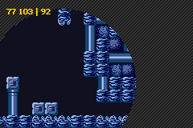

# 14. Direct Memory Access

<!-- toc -->

## DMA … que? {#sec-intro}

<dfn>Direct Memory Access</dfn> (DMA) is fast way of copying data from one place to another. Or, rather, a way of *transferring* data fast; as it can be used for copying data, but also filling memory. When you activate DMA the so-called <dfn>DMA controller</dfn> takes over the hardware (the CPU is actually halted), does the desired transfer and hands control back to the CPU before you even knew it was missing.

There are four DMA channels. Channel 0 has the highest priority; it is used for time-critical operations and can only be used with internal RAM. Channels 1 and 2 are used to transfer sound data to the right sound buffers for playback. The lowest priority channel, channel 3, is for general-purpose copies. One of the primary uses for this channel is loading in new bitmap or tile data.

## DMA registers {#sec-regs}

Every kind of transfer routine needs 3 things: a source, a destination and the amount of data to copy. The *whence*, *whither* and *how much*. For DMA, the source address is put into `REG_DMAxSAD` and destination address into `REG_DMAxDAD`. A third register, `REG_DMAxCNT`, not only indicates the amount to transfer, but also controls other features possible for DMA, like when it should start the transfer, chunk-size, and how the source and destination addresses should be updated after each individual chunk of data. All the DMA registers are 32bits in length, though they can be divided into two 16bit registers if so desired. Those of channel 0 start at`0400:00B0h`; subsequent channels start at an offset of 12 (see {@tbl:dma-regs}).

<div class="lblock">
<table id="tbl:dma-regs">
<caption align="bottom">
  <b>{*@tbl:dma-regs}</b>: DMA register addresses
</caption>
<tr><th>reg<th>function<th>address
<tr><td><code>REG_DMAxSAD</code><td>source
	<td><code>0400:00B0h  + 0Ch</code>·x
<tr><td><code>REG_DMAxDAD</code><td>destination
	<td><code>0400:00B4h + 0Ch</code>·x
<tr><td><code>REG_DMAxCNT</code><td>control
	<td><code>0400:00B8h + 0Ch</code>·x
</table>
</div>

### DMA controls {#ssec-reg-cnt}

The use of the source and destination registers should be obvious. The control register needs some explaining. Although the `REG_DMAxCNT` registers themselves are 32bits, they are often split into two separate registers: one for the count, and one for the actual control bits.

<div class="reg">
<table class="reg reg-huge" id="tbl:reg-dmaxcnt"
  border=1 frame=void cellPadding=4 cellSpacing=0>
<caption class="reg">
  REG_DMAxCNT @ 0400:00B8+12<i>x</i>
</caption>
<tr class="bits">
	<td>1F<td>1E<td>1D 1C<td>1B<td>1A<td>19<td>18 17
	<td>16 15<td>14 13 12 11 10
	<td>F E D C B A 9 8 7 6 5 4 3 2 1 0
<tr class="bf">
  <td class="rclr1">En
  <td class="rclr6">I
  <td class="rclr5">TM
  <td>-
  <td class="rclr2">CS
  <td class="rclr7">R
  <td class="rclr3">SA
  <td class="rclr4">DA
  <td>-
  <td class="rclr0">N
</table>
<br>

<table>
  <col class="bits" width=56>
  <col class="bf" width="8%">
  <col class="def" width="12%">
<tr align="left"><th>bits<th>name<th>define<th>description
<tbody valign="top">
<tr class="bg0">
  <td>00-0F<td class="rclr0">N
  <td> 
  <td><b>Number</b> of transfers.
<tr class="bg1">
  <td>15-16<td class="rclr4">DA
  <td>DMA_DST_INC, DMA_DST_DEC, DMA_DST_FIXED, DMA_DST_RELOAD
  <td><b>Destination adjustment</b>.
    <ul>
      <li><b>00</b>: increment after each transfer (default)
      <li><b>01</b>: decrement after each transfer
      <li><b>10</b>: none; address is fixed
      <li><b>11</b>: increment the destination during the transfer, 
	    and reset it so that repeat DMA will always start at the 
		same destination.
    </ul>
<tr class="bg0">
  <td>17-18<td class="rclr3">SA
  <td>DMA_SRC_INC, DMA_SRC_DEC, DMA_SRC_FIXED,
  <td><b>Source Adjustment</b>. Works just like the two bits for the 
    destination. Note that there is no <code>DMA_SRC_RESET</code>; 
    code 3 for source is forbidden.
<tr class="bg1">
  <td> 19  <td class="rclr7">R
  <td>DMA_REPEAT
  <td>Repeats the copy at each VBlank or HBlank if the DMA timing 
    has been set to those modes.
<tr class="bg0">
  <td> 1A  <td class="rclr2">CS
  <td>DMA_16, DMA_32
  <td><b>Chunk Size</b>. Sets DMA to copy by halfword (if clear) 
    or word (if set).
<tr class="bg1">
  <td>1C-1D<td class="rclr5">TM
  <td>DMA_NOW, DMA_AT_VBLANK, DMA_AT_HBLANK, DMA_AT_REFRESH
  <td><b>Timing Mode</b>. Specifies when the transfer should start.
      <ul>
        <li><b>00</b>: start immediately.
        <li><b>01</b>: start at VBlank.
        <li><b>10</b>: start at HBlank. 
        <li><b>11</b>: Never used it so far, but here's how I gather it 
          works. For DMA1 and DMA2 it'll refill the FIFO when it has 
          been emptied. Count and size are forced to 1 and 32bit, 
          respectively. For DMA3 it will start the copy at the start of 
          each rendering line, but with a 2 scanline delay.
      </ul>
<tr class="bg0">
  <td> 1E  <td class="rclr6">I
  <td>DMA_IRQ
  <td><b>Interrupt request</b>. Raise an interrupt when finished.
<tr class="bg1">
  <td> 1F  <td class="rclr1">En
  <td>DMA_ENABLE
  <td><b>Enable</b> the DMA transfer for this channel.
</tbody>
</table>
</div>

### Source and destination addresses {#ssec-reg-adr}

The registers for source and destination addresses work just as you'd expect: just put in the proper addresses. Oh, I should tell you that the sizes for the source and destination addresses are 28 and 27 bits wide, respectively, and not the full 32. This is nothing to worry about though, you can't access addresses above `1000:0000h` anyway. For destination addresses, you can't use the section above `0800:0000h`. But then, being able to copy to ROM would be kind of strange, wouldn't it?

### DMA flags {#ssec-reg-flags}

The `REG_DMAxCNT` registers can be split in two parts: one with actual flags, and one for the number of copies to do. Either way will work but you must be careful how the flags are defined: using 32-bit #defines for 16-bit registers or vice versa is not a good idea.

There are options to control what will be the next source and destination addresses when one chunk has been transferred. By default, both will increment so that it works as a copier. But you could also keep the source constant so that it'd work more as a memory fill.

What goes into the lower half of `REG_DMAxCNT` is the number of transfers. This is the number of *chunks*, not bytes! Best be careful when using `sizeof()` or something similar here, missing a factor 2 or 4 is very easy. A chunk can be either 16 or 32 bit, depending on bit 26.

### More on DMA timing {#ssec-reg-timing}

What the immediate DMA does is easy to imagine, it works as soon as you enable the DMA. Well *actually* it takes 2 cycles before it'll set in, but it's close enough. The other timing settings aren't that more difficult conceptually, but there is one point of confusion.

Consider the following situation: you want to do something cool to your otherwise standard backgrounds; specifically, you want to do something that requires the background registers to be updated every scanline. I just said that you can copy data at every HBlank (via the `DMA_AT_HBLANK` timing flag), which seems perfect for the job. If you think about it for a minute, however, you may ask yourself the following question:

> When you set the timing to, say, `DMA_AT_HBLANK`, does it do *all* the *N* copies at the next HBlank, or one copy at each HBlank until the list is done?

There is a crucial difference between the two. The first option seems pointless because all copied would be done at once; if your destination is fixed (like they are for background registers), all copies except the last would be lost. In the case of the second one, how would you do more than one copy per HBlank? Clearly, something's amiss here. There is, on two counts.

For the record, I'm not 100% sure about what I'm going to say here, but I think it's pretty close to what's actually going on. The main thing to realize is that as long as the channel is not enabled (`REG_DMAxCNT`\{1f\} is cleared), that channel won't do squat; only after `REG_DMAxCNT`\{1f\} has been set will the DMA process be initiated. At the appropriate time (determined by the timing bits), DMA will do all *N* copies and then shut itself off again.

Unless, that is, the repeat-bit (`REG_DMAxCNT`\{19\}) is set. In that case, it will keep doing the copies at the right time until you disable the channel yourself.

## Some DMA routines {#sec-func}

While it's not that much trouble to set the three registers manually, it is preferable to hide the direct interaction in subroutines. Now, in older code, you might come across something like this:

```c
// Don't do this. Please.
void dma_copy(int ch, void* src, void* dest, uint count, u32 mode)
{
    switch(ch)
    {
    case 0:
        // set DMA 0
    case 1:
        // set DMA 1
... // etc
    }
}
```

This will work, but it's not a nice way of doing things. If your switch-cases differ by a single number, you can usually replace it by a simpe lookup. There are a number of ways of fixing this, but the easiest is by mapping a struct array over the DMA registers, similar to what I did for tile memory. After that, you can just select the channel with the channel variable and simply fill in the addresses and flags.

```c
typedef struct DMA_REC
{
    const void *src;
    void *dst;
    u32 cnt;
} DMA_REC;

#define REG_DMA ((volatile DMA_REC*)0x040000B0)
```

The following are my three of my DMA routines. First the `DMA_TRANSER()` macro, which is the overall macro that can be used for anything. Then two routines for general memory copies and fills using 32bit transfers with DMA 3.

```c
// in tonc_core.h

//! General DMA transfer macro
#define DMA_TRANSFER(_dst, _src, count, ch, mode)   \
do {                                            \
    REG_DMA[ch].cnt= 0;                         \
    REG_DMA[ch].src= (const void*)(_src);       \
    REG_DMA[ch].dst= (void*)(_dst);             \
    REG_DMA[ch].cnt= (count) | (mode);          \
} while(0)

//! General DMA copier
INLINE void dma_cpy(void *dst, const void *src, uint count, int ch, u32 mode)
{
    REG_DMA[3].cnt = 0; // shut off any previous transfer
    REG_DMA[3].src = src;
    REG_DMA[3].dst = dst;
    REG_DMA[3].cnt = count;
}

//! General DMA full routine
INLINE void dma_fill(void *dst, volatile u32 src, uint count, int ch, u32 mode)
{
    REG_DMA[3].cnt = 0; // shut off any previous transfer
    REG_DMA[3].src = (const void*)&src;
    REG_DMA[3].dst = dst;
    REG_DMA[3].cnt = count | DMA_SRC_FIXED;
}

//! Word copy using DMA 3
INLINE void dma3_cpy(void *dst, const void *src, u32 size)
{   dma_cpy(dst, src, size/4, 3, DMA_CPY32);  }

//! Word fill using DMA 3
INLINE void dma3_fill(void *dst, const void *src, u32 size)
{   dma_fill(dst, src, size/4, 3, DMA_CPY32);  }
```

In all cases, I disable any previously operating transfers first. This may seem redundant if DMA stops the CPU, but remember that DMA transfers can be timed as well – you wouldn't want it to start in the middle of setting the registers. After that, it's simply a matter of filling the registers. Now, it so happens that there is a 2-cycle delay before any transfer really begins. This means that you could lose a transfer if you ask for transfers in immediate succession. I'm not sure if this is very likely though: memory wait-states themselves already take that much time so you *should* be safe.

Other notes on these routines: the `DMA_TRANSFER()` macro's code sits between a `do {} while(0);` loop. The problem with macros is that when expanded multiple statements might break nesting-blocks. For example, calling it in the body of an `if` without braces around it would have the first line as the body, but the rest fall outside it. This kind of loop is one of the ways of preventing that. Another problem with macros is that if the arguments' names may hide other parts of the macro's code. Like the `src` and `dst` members of the `DMA_REC` struct; which is why they're underscored. The fill routines also have something remarkable going on, which you can read about in the [next subsection](#ssec-func-fill). Lastly, the `dma3` inlines use word-transfers and take the byte-size as their last arguments, making them very similar to the standard `memcpy()` and `memset()`.
<br>  
I used to have the following macro for my transfers. It uses one of the more exotic capabilities of the preprocessor: the merging-operator ‘##’, which allows you to create symbol names at compile-time. It's scary, totally unsafe and generally unruly, but it does work. The other macro I gave is better, but I still like this thing too.

```c
#define DMA_TRANSFER(_dst, _src, _count, _ch, _mode)  \
    REG_DMA##_ch##SAD = (u32)(_src),                  \
    REG_DMA##_ch##DAD = (u32)(_dst),                  \
    REG_DMA##_ch##CNT = (_count) | (_mode)            \
```

As long as you are using a literal number for `_ch` it'll form the correct register names. And yes, those comma operators between the statements actually work. They keep the statements separate, and also guard against wrongful nesting just like the `do{} while(0)` construct does.

### On DMA fills {#ssec-func-fill}

DMA can be used to fill memory, but there are two problems that you need to be aware of before you try it. The first can be caught by simply paying attention. DMA fills don't work *quite* in the same way as `memset()` does. What you put into `REG_DMAxSAD` isn't the value you want to fill with, but its *address*!

“Very well, I'll put the value in a variable and use its address.” Yes, and that brings us to our second problem, a bug which is almost impossible to find. If you try this, you'll find that it doesn't work. Well it fills with *something*, but usually not what you wanted to fill with. The full explanation is somewhat technical, but basically because you're probably only using the variable's address and not its *value*, the optimizer doesn't ever initialize it. There is a simple solution, one that we've seen before, make it volatile. Or you can use a (inline) function like `dma_fill()`, which has its source argument set as volatile so you can just insert a number just as you'd expect. Note that if you remove the volatile keyword there, it'll fail again.
<br>  
In short: DMA fills need addresses, not direct values. Globals will always work, but if you use local variables or arguments you'll need to make them volatile. Note that the same thing holds true for the BIOS call CpuFastSet().

### DMA; don't wear it out {#ssec-func-use}

DMA is fast, there's no question about that. It can be up to [ten times as fast](text.html#ssec-demo-se2) as array copies. However, think twice about using it for every copy. While it is fast, it doesn't quite blow every other transfer routine out of the water. CpuFastSet() comes within 10% of it for copies and is actually 10% faster for fills. The speed gain isn't that big a deal. Another problem is that it stops the CPU, which can screw up [interrupts](interrupts.html), causing seemingly random bugs. It does have its specific uses, usually in conjunction with timers or interrupts, but for general copies, you might consider other things as well. CpuFastSet() is a good routine, but libtonc also comes with `memcpy16()/32()` and `memset16()/32()` routines that are safer than that, and less restrictions. They are assembly routines, though, so you'll need to know how to assemble or use libraries.

## DMA demo : circular windows {#sec-demo}

<div class="cpt_fr" style="width:240px;">


**{*@fig:dma-demo}**: palette for `dma_demo`.
</div>

The demo for this chapter may seem a little complicated, but the effect is worth it. The basic use of DMA transfers is so easy that it's hardly worth having a demo of. Use of *triggered* DMA is another matter. In this case, we'll look at HBlank-triggered DMA, or HDMA for short. We'll use it to update the [window](gfx.html#sec-win) sized inside the HBlank to give a circular window effect.

This is easier said than done, of course. The first step in the design is how to use HDMA for this in the first place. Because we need to copy to `REG_WIN0H` each HBlank, we need to keep the destination fixed. Technically, it needs to be *reset* to the original destination, but with only one halfword to copy this means the same thing. For the source, we'll keep track of the data that needs to be copied there in an array with one entry for each scanline, and we'll progress through the array one scanline at a time (i.e, incrementing source). And of course, the transfer has to occur at *each* scanline, so we set it to repeat. so basically we need this:

```c
#define DMA_HDMA    (DMA_ENABLE | DMA_REPEAT | DMA_AT_HBLANK | DMA_DST_RELOAD)
```

As for the circle, we need a routine that can calculate the left and right edges of a circle. There are a couple of algorithms around that can draw circles, for example [Bresenham's](http://www.gamedev.net/reference/articles/article767.asp) version. We'll use a modified version of it because we only need to store the left and right points instead of drawing a pixel there. Why left-right and not top-bottom? Because the array is scanline-based, so that indicates the *y*-values already.

It doesn't really matter what you use actually, as long as you can find the edges. Once you have, all you need to do is setup the DMA in the VBlank and you're done.
<br>  
The end result will show something like {@fig:dma-demo}. It's the Brinstar background (again) inside the window, and a striped bg outside. The text indicates the position and radius of the window, which can be moved with the D-pad and scaled by A and B.

```c
#include <stdio.h>
#include <tonc.h>

#include "brin.h"

// From tonc_math.h
//#define IN_RANGE(x, min, max) ( (x) >= (min) && (x) < (max) )


// The source array
u16 g_winh[SCREEN_HEIGHT+1];

//! Create an array of horizontal offsets for a circular window.
/*! The offsets are to be copied to REG_WINxH each HBlank, either 
*     by HDMA or HBlank isr. Offsets provided by modified 
*     Bresenham's circle routine (of course); the clipping code is not
*     optional.
*   \param winh Pointer to array to receive the offsets.
*   \param x0   X-coord of circle origin.
*   \param y0   Y-coord of circle origin.
*   \param rr   Circle radius.
*/
void win_circle(u16 winh[], int x0, int y0, int rr)
{
    int x=0, y= rr, d= 1-rr;
    u32 tmp;

    // clear the whole array first.
    memset16(winh, 0, SCREEN_HEIGHT+1);

    while(y >= x)
    {
        // Side octs
        tmp  = clamp(x0+y, 0, SCREEN_WIDTH);
        tmp += clamp(x0-y, 0, SCREEN_WIDTH)<<8;
        
        if(IN_RANGE(y0-x, 0, SCREEN_HEIGHT))       // o4, o7
            winh[y0-x]= tmp;
        if(IN_RANGE(y0+x, 0, SCREEN_HEIGHT))       // o0, o3
            winh[y0+x]= tmp;

        // Change in y: top/bottom octs
        if(d >= 0)      
        {
            tmp  = clamp(x0+x, 0, SCREEN_WIDTH);
            tmp += clamp(x0-x, 0, SCREEN_WIDTH)<<8;
            
            if(IN_RANGE(y0-y, 0, SCREEN_HEIGHT))   // o5, o6
                winh[y0-y]= tmp;
            if(IN_RANGE(y0+y, 0, SCREEN_HEIGHT))   // o1, o2
                winh[y0+y]= tmp;

            d -= 2*(--y);
        }
        d += 2*(x++)+3;
    }
    winh[SCREEN_HEIGHT]= winh[0];
}

void init_main()
{
    // Init BG 2 (basic bg)
    dma3_cpy(pal_bg_mem, brinPal, brinPalLen);
    dma3_cpy(tile_mem[0], brinTiles, brinTilesLen);
    dma3_cpy(se_mem[30], brinMap, brinMapLen);

    REG_BG2CNT= BG_CBB(0)|BG_SBB(30);

    // Init BG 1 (mask)
    const TILE tile= 
    {{
        0xF2F3F2F3, 0x3F2F3F2F, 0xF3F2F3F2, 0x2F3F2F3F, 
        0xF2F3F2F3, 0x3F2F3F2F, 0xF3F2F3F2, 0x2F3F2F3F
    }};
    tile_mem[0][32]= tile;
    pal_bg_bank[4][ 2]= RGB15(12,12,12);
    pal_bg_bank[4][ 3]= RGB15( 8, 8, 8);
    pal_bg_bank[4][15]= RGB15( 0, 0, 0);
    se_fill(se_mem[29], 0x4020);

    REG_BG1CNT= BG_CBB(0)|BG_SBB(29);

    tte_init_chr4_b4_default(0, BG_CBB(2)|BG_SBB(28));
    tte_init_con();
    tte_set_margins(8, 8, 232, 40);

    // Init window
    REG_WIN0H= SCREEN_WIDTH;
    REG_WIN0V= SCREEN_HEIGHT;

    // Enable stuff
    REG_DISPCNT= DCNT_MODE0 | DCNT_BG0 | DCNT_BG1 | DCNT_BG2 | DCNT_WIN0;
    REG_WININ= WIN_BUILD(WIN_BG0|WIN_BG2, 0);
    REG_WINOUT= WIN_BUILD(WIN_BG0|WIN_BG1, 0);
}

int main()
{
    int rr=40, x0=128, y0=120;

    init_main();

    while(1)
    {
        vid_vsync();
        key_poll();

        rr += key_tri_shoulder();   // size with B/A
        x0 += key_tri_horz();       // move left/right
        y0 += key_tri_vert();       // move up/down

        if(rr<0)
            rr= 0;

        // Fill circle array
        win_circle(g_winh, x0, y0, rr);
    
        // Init win-circle HDMA
        DMA_TRANSFER(&REG_WIN0H, &g_winh[1], 1, 3, DMA_HDMA);

        tte_printf("#{es;P}(%d,%d) | %d", x0, y0, rr);
    }
    
    return 0;
} 
```

The initialization function is mostly just fluff. Mostly, because there is one thing of interest: the calls to `dma_cpy` to copy the Brinstar palette, tiles and map. Aside from that, nothing to see here.

The main function itself is also pretty standard. Of interest here are the call to `win_circle()`, which sets up the source-array, and to `DMA_TRANSFER()` to initialize the HDMA. Note that I'm actually making it start at `g_winh[1]` instead of just `g_winh[0]`. The reason for this is that the HBlank occurs *after* a given scanline, not before it, so we'll lag one otherwise. The `g_winh` array is actually 160+1 long, and both entry 0 and 160 describe the data for scanline 0. What's also important, but not exactly visible here, is that HDMA only occurs on the *visible* HBlanks, not the ones in the VBlank. This saves up a whole lot of trouble determining how many scanlines to correct for when setting it up.

And then there's `win_circle()`. If you're aware of how the Bresenham circle algorithm work, you know it calculates an offset for one octant and then uses it for the 7 others via symmetry rules. This happens here as well. What doesn't happen in the original probably is all the clipping (the `clamp()`s and `IN_RANGE()s`). However, these steps are absolutely vital here. Going out of bounds horizontally would mean wrong windowing offsets which would make the window turn in on itself. Going out of bounds vertically means going OOB on `g_winh` for all kind of horrible. Trust me, they are necessary.

Also, notice that I wipe the whole array clean first; this can be done inside the loop, but sometimes it's just faster to fill the whole thing first and then only update the parts you need. Lastly, as mentioned before, the first scanline's data is copied to the final entry of the array to account for the way HBlanks happen.
<br>  
And here ends the chapter on DMA. The use of HDMA in this manner is great for all kinds of effects, not just circular windows. All you need is an array containing scanline-data and a function that sets it up beforehand. Be careful you don't get your channels mixed up, though.

DMA is the fastest method of copying, but as you block interrupts using `memcpy32()` is probably safer. The speed difference is only 10% anyway. DMA is also used for sound FIFO, in conjunction with timers. I can't really show you how to use it for sound, but I can tell you how timers work, and will do so in the next chapter.
