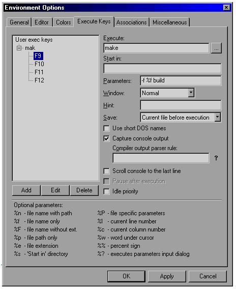
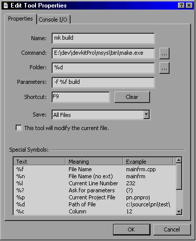
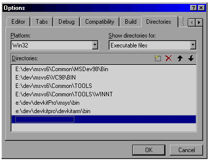
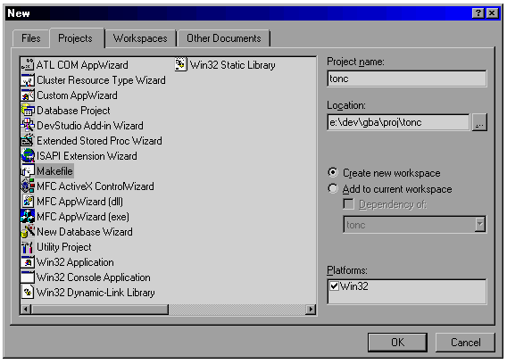
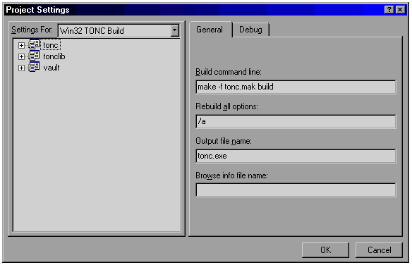
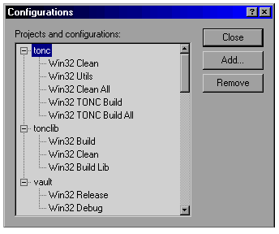

# E. Make via editors {#ch-}

<!-- toc -->

## Introduction {#sec-intro}

As good as makefiles are, they're still command-line driven processes, with all the problems attached to it. If you're in a Unix/Linux environment those problems are usually fairly small, but on a pure Windows system we have to work in a DOS-like Windows command prompt, which has a number of very ghastly flaws that can make your life miserable: not only is wringing through the directory structure not much fun, the non-intuitive way to copy/paste text and the inability to arrow through your commands to fix a typo are somewhat annoying too. Another thing that will wear your patience very quickly is not being able to scroll through the list of compilation errors that speeds across your itty-bitty Windows command prompt like a thundering herd of rabid elephants in a China shop. And you *know* it'd all be okay if you could just find the one at the start of the list and fix that. Now, you can get around the gross inadequacies of a Windows command prompt by using an MSYS-box instead. You'd still need to learn how to use the Bash shell to make the most of it, though. And you'd still have the extra window for the command line box.

Fortunately, there are ways to avoid any kind of command line box altogether. Unless you're using something as dreadful as the standard Windows Notepad, there is a good chance you can run make or any other tool directly from your code editor. In this case, I'd like to take a look at three of them

-   [Context](http://www.fixedsys.com/context)
-   [Programmer's Notepad](http://www.pnotepad.org/). Yes, the one that comes with devkitARM.
-   Microsoft Visual C++

Context and PN are basically advanced forms of text editors, of which there are quite a few. Most of these will allow tabbed files, search&replace, customizable syntax highlighting, macros and shell commands. If you're still using Windows Notepad for, well, *anything* really, you owe it to yourself to download one of the more advanced text editors and use that as a replacement. The glorified edit-box known as Notepad should not be allowed anywhere near any kind of plain text file unless there is no way around it. Every one of the programmers' editors you can google up is likely to be superior to Notepad in every single way, and some of them even allow you to replace the actual notepad.exe. While this has become harder since Windows XP Service Pack 2 because system file protection keeps resurrecting it, in my opinion it's well worth the effort to shoot it down permanently.

Ahem, sorry about that. Sometimes I get a little carried away when I remember how much the standard Windows tools suck at times. Anyway, onto the show. In the remaining part of this chapter, I'll show how you can get Context and PN to run make for the currently open makefile. The last section of this chapter will cover setting up MSVC for the job. If you're not interested in any of this, feel free to skip to the [next chapter](first.html) at any time.

## Make via Context {#sec-context}

[Context](http://www.fixedsys.com/context) is a lightweight free text editor that I use for most of plain text editing. It can do all the things that programmer's editors are supposed to do, it has a Notepad replacer and a tool that allows me to export code to an html format, which has been very useful indeed for writing tonc. It does have one or two minor flaws, but none that I particularly mind.

The shell commands manager can be found under Options-\>Environment Options...-\>Execute Keys (@fig:ctxt-make), and works on an extension basis. In my case, that means .mak. Context allows 4 commands per extension, and I'm using F9 to make the ‘build’ target and F10 for a clean operation.

F9 : make build

-   **Execute:** `make.exe` (add full path if necessary)
-   **Parameters:** `-f %f build`
-   **Capture output:** yes

F10 : make clean

-   **Execute:** `make.exe`
-   **Parameters:** `-f %f clean`
-   **Capture output:** yes

Be sure that the devkitARM and msys bin directories are in the system path, or context won't be able to find make.exe or the compiler tools.

<div class="cpt" style="width:464px">

<br>
<b>{*@fig:ctxt-make}</b>: Context shell commands.
</div>

## Make via Programmer's Notepad 2 {#sec-pn2}

I never really knew about PN until it started coming with devkitARM, but it looks really good. I haven't used it that much myself, but only because I am still content with context. That said, PN is probably the better editor, and as it may come with the toolchain, chances are you'll have it already.

For all its benefits, I should say this though: by default, it seems to ignore the desktop color scheme. This may not sound like a big deal, but because the background color defaulted to a hard white, I literally couldn't even look at the thing for more than a minute. When I first tried to fix this in the options, it seemed that you could only change this on a type-by-type basis instead of globally. Took me a while to figure out I'd been looking in the wrong place <span class="kbd">:P</span> all along. Look under Tools-\>Options-\>Styles, not under Tools-\>Options-\>Schemes.

To add commands for makefiles, go to Tools-\>Options-\>Tools (@fig:pn-make), and select the ‘Make’. Then add 2 commands for ‘make build’ and ‘make clean’

F9 : make build

:   -   **Name:** mk build
    -   **Command:** “E:\\dev\\devkitPro\\msys\\bin\\make.exe”
    -   **Folder:** ‘%d’ (the makefile's directory)
    -   **Parameters:** “-f %f build”
    -   **Shortcut:** F9

F10 : make clean

:   -   **Name:** mk clean
    -   **Command:** “E:\\dev\\devkitPro\\msys\\bin\\make.exe”
    -   **Folder:** ‘%d’ (the makefile's directory)
    -   **Parameters:** “-f %f clean”
    -   **Shortcut:** F10

The name and shortcut can be different, of course; the rest should be as above. It is possible that you have to make sure the .mak extension is tied to the ‘Make’ scheme.

<div class="cpt" style="width:392px">

<br>
<b>*@fig:pn-make</b>: Programmer's Notepad shell 
commands.
</div>

By adding make commands to your editor, you should be able to run the makefile of every tonc demo. If you encounter problems, you probably forgot to set a path somewhere.

## Make via MS Visual C++ 6 {#sec-msvc6}

I'm sure a lot of you will have gotten your hands on some version of Visual Studio one way or the other, officially, via school or … other methods. MSVC actually works with its own kind of makefiles and maketool called NMAKE, but we're going to ignore that one and use GNU's make instead. The instructions in this section work for versions 5 and 6, but I'm not sure about later versions. From what I hear, they changed a lot in those so if you have one of those you might have to do some digging of your own. I know that there are also add-ons that can create GBA projects via wizards, but again you'll have to find them yourself.

### VC and makefile projects {#ssec-msvc-make}

#### Phase 1: setting the path

The first thing you need to do, if you haven't done so already, is setting the path so that Visual C can find the tools. Open the \[Tools/Options\] dialog and go to the \[Directories\] tab, then select the \[Executable files\] list from the \[Show Directories for\] box (see @fig:msvc-dirs below). Now you need to add the bin directories of MSYS and dkARM. You can also set these directories to autoexec.bat as well. The devkitARM directory can also be set inside the makefiles themselves, but since I use 4 different computers to write Tonc, I prefer not to do this.

<div class="cpt" style="width:424px">

<br>
<b>*@fig:msvc-dirs</b>: adding the the dkARM paths 
to the executable list.
</div>

#### Phase 2: Creating a makefile project

The second step is creating a project/workspace that uses custom makefiles. This is called, what else, a <dfn>makefile project</dfn>. Go to the \[Projects\] tab of the \[File/New\] dialog (shown in @fig:msvc-new below), select Makefile, give it a name and press OK. Mind you, this does *not* create the makefile, only the project! Also, the project's name I use here is ‘tonc’, change this to the name of your own project.

<div class="cpt" style="width:568px">

<br>
<b>*@fig:msvc-new</b>: creating a makefile project.
</div>

#### Phase 3: Profit!\^H\^H\^H\^Hject settings!

After you click OK, you will be asked to go to the Project Settings. Do so and you'll see the dialog from fig 6. The first thing you will find is the \[Build command line\] edit box. Right now, this reads something like

```sh
NMAKE /f tonc.mak
```

Change it to

```sh
make -f tonc.mak build
```

Why? Because we won't be using the standard VC make (NMAKE), but the GNU make (make). Why? Because it's free, platform-independent and usually comes with the devkit, making your project more portable, is more powerful and better documented as well. Why? Because ... just because, OK? This is the command that is executed when you press Rebuild (F7). The -f flag says which makefile to use. Inside a makefile you can have multiple sub-projects; in this case the one called build is the active one.

The other settings aren't important for our purposes so leave them as they are. Yes, the output filename too; the makefile will take care of that. By the way, note that the workspace in @fig:msvc-make-cfg shows three projects: tonc and tonclib for actual tonc stuff, and a vault project. A standard practice of mine to have one vault project where I can store source-files I don't want compiled but do want to have available for reference (such as templates and examples). All my workspaces have one and I can highly recommend them.

<div class="cpt" style="width:584px">

<br>
<b>*@fig:msvc-make-cfg</b>: project settings.

</div>

<div class="note">

<div class="nhgood">

Converting GCC reports to MSVC reports

</div>

When you build a normal MSVC project, it will report and errors and warnings and double-clicking on these will bring to to the line that spawned it. This does not work for devkitARM because GCC has a slightly different reporting format.

```
# GCC error: {filename}:{line}: error: ...
foo.c:42: error: 'bar' undeclared (first use in this function)
# MSVC error: {dir}\{filename}(line): error ...
dir\foo.c(42) : error C2065: 'bar' : undeclared identifier
```

Because of the difference in line-number formatting, MSVC gets confused and can't find the line, or even the file. Fortunately, we can change this by piping the output of make through sed, the bash-shell string editor that comes with msys. To do this, change the build invocation to:

```sh
make -f tonc.mak build 2>&1 | sed -e 's|\(\w\+\):\([0-9]\+\):|\1(\2):|'
```

The `2>&1 | ` feeds the standard output of make to the standard input of the sed. The rest is a sed command that finds the parts before the first two colons, and converts them to the parenthesized format the MSVC expects. Note that tonc's build line is slightly more complicated because of its directory structure but the line above is what really matters.

</div>

#### Phase 3b: Build configurations

This one isn't strictly necessary, but may be useful. In Visual C++ you can have multiple <dfn>build configurations</dfn>, each with its own project settings. You're probably familiar with the Debug and Release Builds, but you can add your own as well with the \[Build/Configurations\] dialog (shown in @fig:msvc-bld-cfg). The tonc project has five configurations, which all drive different targets in tonc.mak. `Build` builds the current demo; `Clean` removes all intermediary and output files (.O, .ELF and.GBA). In order to build/clean a specific demo you'd have to change the project settings or, preferably, set the `DEMO` variable inside tonc.mak to the name of that demo. `Build All` and `Clean All` run `Build` and `Clean` for all demos, respectively. The ‘Utils’ configuration creates the tonc library required for some of the later examples.

<div class="cpt" style="width:344px">


<b>*@fig:msvc-bld-cfg</b>: Build Configurations.

</div>

And that's about it as far as Visual C++ is concerned. You still have to actually create the referenced makefile (tonc.mak in this case). You know how to create a textfile, don't you? Another thing to remember about makefile projects is that all build commands are inside the makefile; the files mentioned in the File Viewer are just for show and are not compiled by themselves like ‘normal’ VC projects.

<div class="note">

<div class="nh">

Easy switching between devkits in tonc.mak

</div>

Tonc's makefiles are of such nature that each can stand on its own, but can also be called from a central makefile tonc.mak, with the `DEMO` variable. I've also put a `CROSS` (which houses the prefix) variable in there which overrides `CROSS` of the individual makefiles. Changing it in tonc.mak effectively changes it everywhere.

</div>

<div class="note">

<div class="nhgood">

Getting rid of MSVC 6.0's useless directories

</div>

It appears that Visual Studio 6 (and higher too?) has a very annoying habit of creating all kinds of extra directories for each project added to a workspace and for each project configuration. Directories that you probably never intend to use, and *certainly* never asked for, and which clutter up your project. Removing them from disk doesn't solve the problem, because they'll just reappear merely by selecting the project/configuration.

\*grumble\*

Well, the good news is that for normal projects you can just remove them from the project settings, then remove them from disk and everything will be clean again. The bad news is that we're not using normal projects but makefile projects, which don't have the settings-tab in question. So what you have to do is go to the .DSP in a text editor, and remove everything resembling the following lines

```
# PROP BASE Output_Dir [DIR]
# PROP BASE Intermediate_Dir [DIR]
# PROP Output_Dir [DIR]
# PROP Intermediate_Dir [DIR]
```

No, I don't exactly know what I'm doing, but yes when you remove the directories now they *stay* gone. In fact, I'm pretty sure a lot of lines can be removed from the DSP, but as there is no manual for the commands in a project file, I'm not taking any chances there.

Now, if anyone does have a reference guide for DSP files, or can tell me whether this obnoxious behaviour is still present in later MSVC iterations, I'm all ears.

</div>
