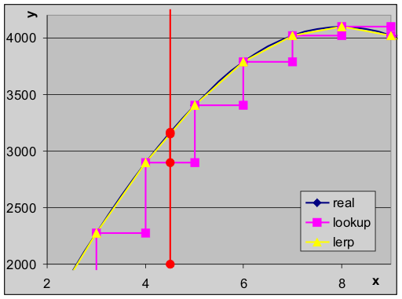

# B. Fixed-Point Numbers and LUTs

<!-- toc -->

## What are fixed-point numbers {#sec-intro}

Roughly put, there are two types of numbers: integers and floating-points. For most serious math you would get nowhere with integers because, by definition, they don't allow fractions. So for 3D games you'd use floating-point math. Back in the old days, before the arrival of specialized floating-point hardware, that stuff was very slow! Or at least slower than integer arithmetic. Fortunately, there is a way of faking numbers with decimal points with integers. This is known as <dfn>fixed-point math</dfn>.

### General fixed-point numbers {#ssec-fix-gen}

Here's an example. Say you have \$10.78 (ten dollars and seventy-eight cents) in wallet. If you want to write this amount as an integer you have a problem, because you'd either have to leave off the fractional part (\$10) or round it to \$11. However, you could also write it down not in dollars, but in *cents*. That way you'd write 1078, which is an integer, problem solved.

That's the way fixed-point math works. Instead of counting units, you count *fractions*. In the previous example, you count in cents, or hundredths. Fixed-points have a in integer part (the “10”), and a fractional part (“78”). Since we have 2 digits for the fractional part, we call this a fixed-point number in an <dfn>x.2</dfn> format.

Note that PCs have floating-point units (FPU) since the mid-1990s. This makes floating-point arithmetic just as fast as integer arithmetic (sometimes even faster) so using fixed-point math is not really worth the trouble except, perhaps, in rasterization, since the conversion from `float`s to `int`s is still slow. However, the GBA doesn't do floating-point stuff well, so it's fixed math all the way.

### GBA fixed-point usage {#ssec-fix-gba}

Because computers use the [binary system](numbers.html#ssec-num-basen), using decimals would be silly as a basis for fixed-points would be silly. Fortunately, you can do fixed-point math in any base, including binary. The basic format is *i*.*f*, where *i* is number of integer bits, and *f* the number of fractional bits. Often, only the fractional is important to know, so you'll also come across just the indication ‘.*f*’.

The GBA uses fixed-point math in a number of cases. The [affine parameters](affine.html), for example, are all .8 fixed-point numbers (“<dfn>fixeds</dfn>”, for short). Effectively, this means you're counting in 1/2<sup>8</sup> = 1/256ths, giving you a 0.004 accuracy. So when you write 256 to a register like REG_BG2PA, this is actually interpreted as 256/256=1.00. REG_BG2PA=512 would be 2.00, 640 is 2.50, et cetera. Of course, it is a little hard to see in the decimal system, but grab a calculator and you'll see that it's true. For this reason, it is often more convenient to write them down as hex numbers: 256=0x100→1.00, 512=0x200→2.00, 640=0x280→2.50 (remember that 8 is 16/2, or one half).

```c
// .8 fixed point examples : counting in fractions of 256

int a= 256;         // 256/256 = 1.00
int a= 1 << 8;      // Ditto
int a= 0x100;       // Ditto

int b= 0x200;       // 0x200/256 = 512/256 = 2.00
int c= 0x080;       // 0x080/256 = 128/256 = 0.50
int d= 0x280;       // 0x280/256 = 640/256 = 2.50
```

The affine registers aren't the only places fixed-points are used, though that's where they are the most recognizable. The [blend weights](gfx.html#sec-blend) are essentially fixed-point numbers as well, only they are 1.4 fixeds, not .8 fixeds. This is an important point, actually: the position you set the fixed-point to is arbitrary, and you can even switch the position as you go along. Now, the numbers themselves won't tell you where the point is, so it is important to either remember it yourself or better yet, write it down in the comments. Trust me, you do not want to guess at the fixed-point position in the middle of a lengthy algorithm.

<div class="note">

<div class="nhgood">

Comment your fixed-point position

</div>

When you use fixed-point variables, try to indicate the fixed-point format for them, especially when you need them for longer calculations, where the point may shift position depending on the operations you use.

</div>

### Fixed-point and signs {#ssec-fix-sign}

Fixed-point numbers are supposed to be a poor man's replacement for floating-point numbers, which would include negative numbers as well. This means that they're supposed to be *signed*. Or at least, usually. For example, the affine registers use signed 8.8 fixeds, but the blend weights are unsigned 1.4 fixeds. You may think it hardly matters, but [signs](numbers.html#bits-int-sign) can really mess things up if you're not careful. Say you're using fixed-points for positions and velocities. Even if your positions are always positive, the velocities won't be, so signed numbers would be more appropriate. Furthermore, if your fixed-point numbers are halfwords, say 8.8 fixeds, a signed ‘−1’ will be used as `0xFFFFFFFF`, i.e. a proper ‘−1’, but an unsigned ‘−1’ is `0x0000FFFF`, which is actually a positive number. You won't be the first person to trip over this, nor would be the last. So signed fixeds, please.

Another point of notice is the way signed fixeds are often indicated. You may see things of the form ‘1.*n*.*f*’. This is meant to indicate one sign bit, *n* integer bits and *f* fractional bits. Technically speaking, this is **false**. Fixed-point numbers are just plain integers, just interpreted as fractions. That means they follow [two's complement](numbers.html#bits-int-neg) and that, while a set top bit does indicate a negative number, it isn't *the* sign bit. As I mentioned, ‘−1’ in two's complement is `0xFFFFFFFF`, not `0x80000001` as is the case with sign and magnitude. You might not think much of this distinction and that it's obvious that it's still two's complement, but considering that floating-point formats *do* have a separate sign bit, I'd say it's worth remembering.

<div class="note">

<div class="nhcare">

Signed fixed format notation

</div>

Signed fixed-point formats are sometimes indicated as ‘1.*n*.*f*’. From that, you might think they have a separate sign bit like floating-point formats, but this is **not correct**. They're still regular integers, using two's complement for negative numbers.

</div>

## Fixed-point math {#sec-fmath}

Knowing what fixed-point numbers are is one thing, you still have to use them somehow. Three things concern us here.

-   Converting between regular integers or floats and fixed-point numbers.
-   Arithmetical operations.
-   Overflow.

None of these items are difficult to understand, but each does have its awkward issues. In fact, overflow *is* merely an issue, not really an item. This section will focus on 24.8 signed fixeds, for which I will use a “FIXED” typedef'ed int. Although it only uses this fixed-point format, the topics covered here can easily be applied to other formats as well.

### Converting to and from fixed-points {#ssec-fmath-conv}

I'm not really sure is “conversion” is even the right word here. The only difference between fixed-point numbers and normal ones is a scaling factor *M*. All that's necessary to go from a FIXED to an int or float is account for that scale by either multiplication or division. Yes, it really is that simple. As we're using power-of-two's for the scales, the integer↔FIXED conversion can even be done with shifts. You can add the shifts in the code yourself, but the compiler is smart enough to convert power-of-two multiplications and divisions to shifts itself.

```c
typedef s32 FIXED;         //! 32bit FIXED in 24.8 format

// For other fixed formats, change FIX_SHIFT and the rest goes with it.

//! Convert an integer to fixed-point
INLINE FIXED int2fx(int d)
{   return d<<FIX_SHIFT;    }

//! Convert a float to fixed-point
INLINE FIXED float2fx(float f)
{   return (FIXED)(f*FIX_SCALEF);   }


//! Convert a fixed point value to an unsigned integer.
INLINE u32 fx2uint(FIXED fx)    
{   return fx>>FIX_SHIFT;   }

//! Get the unsigned fractional part of a fixed point value (orly?).
INLINE u32 fx2ufrac(FIXED fx)
{   return fx&FIX_MASK; }

//! Convert a FIXED point value to an signed integer.
INLINE int fx2int(FIXED fx)
{   return fx/FIX_SCALE;    }

//! Convert a fixed point value to floating point.
INLINE float fx2float(FIXED fx)
{   return fx/FIX_SCALEF;   }
```

#### Rounding off and negative number inconsistencies

The conversions are almost as simple as described above. The two places where things may be problematic are round-off inconsistencies and negative fractions. Note that I said they *may* be problematic; it depends on what you had in mind. I am not going to explain all the ins and out here, because they generally won't be much of a problem, but you need to be aware of them.

If you're not new to programming, you will undoubtedly be aware of the problem of round-off from floats to ints: a simple cast conversion truncates a number, it does not really round it off. For example, ‘(int)1.7’ gives 1 as a result, not 2. The earlier macros have the same problem (if you can call it that). Float-to-int rounding is done by adding one half (0.5) to the float before rounding, which we can also apply to fixed-point conversion. In this case, of course, the value of one half depends on the number of fixed-point bits. For example, .8 fixeds, ½ is 0x80=128 (256/2), for .16 fixeds it is 0x8000=32768. Add this before shifting down and it'll be rounded off properly. There are actually multiple ways of rounding off, which you can read about in ["An Introduction to Fixed Point Math" by Brian Hook](https://web.archive.org/web/20060204155500/http://www.bookofhook.com/Article/GameDevelopment/AnIntroductiontoFixedPoin.html).

And then there are negative numbers. Frankly, division on negative integers is always a bitch. The basic problem here is that they are always rounded towards zero: both +3/4 and −3/4 give 0. In some ways this makes sense, but in one way it doesn't: it breaks up the sequence of outputs around zero. This is annoying on its own, but what's worse is that right-shifting *doesn't* follow this behaviour; it always shifts towards negative infinity. In other words, for negative integer division, the division and right-shift operators are *not* the same. Which method you choose is a design consideration on your part. Personally, I'm inclined to go with shifts because they give a more consistent result.

<div class="cblock">
<table id="tbl:neg-div"
  border=1 cellpadding=2 cellspacing=0>
<caption align="bottom">
  <b>*@tbl:neg-div</b>:
  Division and right-shifts around zero.
</caption>
<col span=19 width=20>
<tbody align="center">
<tr>
  <th><i>x</i> 
  <td> -8<td> -7<td> -6<td> -5<td> -4<td> -3<td> -2<td> -1<td>  0
  <td>  1<td>  2<td>  3<td>  4<td>  5<td>  6<td>  7<td>  8<td>  9
<tr>
  <th><i>x</i>/4 
  <td> -2<td> <b>-1</b><td> <b>-1</b><td> <b>-1</b><td> -1
  <td>  <b>0</b><td>  <b>0</b><td>  <b>0</b><td>  0
  <td>  0<td>  0<td>  0<td>  1<td>  1<td>  1<td>  1<td>  2<td>  2

<tr>
  <th><i>x</i>&gt;&gt;2 
  <td> -2<td> <b>-2</b><td> <b>-2</b><td> <b>-2</b><td> -1
  <td> <b>-1</b><td> <b>-1</b><td> <b>-1</b><td>  0
  <td>  0<td>  0<td>  0<td>  1<td>  1<td>  1<td>  1<td>  2<td>  2
</tbody>
</table>
</div>

The negative division nasty is even worse when you try to deal with the fractional part. Masking with AND effectively destroys the sign of a number. For example, a 8.8 −2¼ is −0x0240 = 0xFDC0. Mask that with 0xFF and you'll get 0xC0 = ¾, a positive number, and the wrong fraction as well. On the other hand 0xFDC0\>\>8 is −3, for better or for worse, and −3 + ¾ is indeed −2¼, so in that sense it does work out. The question whether or not it works for *you* is something you'll have to decide on your own. If you want to display the fixed numbers somehow (as, say -2.40 in this case), you'll have to be a little more creative than just shifts and masks. Right now, I'm not even touching that one.

<div class="note">

<div class="nhcare">

Converting negative fixed-point numbers

</div>

The conversion from negative fixed-point numbers to integers is a particularly messy affair, complicated by the fact that there are multiple, equally valid solutions. Which one you should choose is up to you. If you can, avoid the possibility; the fixed→int conversion is usually reserved for the final stages of arithmetic and if you can somehow ensure that those numbers will be positive, do so.

</div>

### Arithmetical operations {#ssec-fmath-ops}

Fixed-point numbers are still integers, so they share their arithmetic operations. However, some caution needs to be taken to keep the fixed point in its proper position at times. The process is the same as arithmetic on decimals. For example, 0.01+0.02 = 0.03 ; what you will usually do for this sum is remove the decimal point, leaving 1 and 2, adding those to give 3, and putting the decimal point back. That's essentially how fixed-points work as well. But when adding, say, 0.1 and 0.02, the fixed decimals aren't 1 and 2, but **10** and 2. The key here is that for addition (and subtraction) the point should be in the same place.

A similar thing happens for multiplication and division. Take the multiplication 0.2×0.3. 2×3 equals 6, then put the point back which gives 0.6, right? Well, if you did your homework in pre-school you'll know that the result should actually be 0.06. Not only do the decimals multiply, the *scales* multiply as well.

Both of these items apply to fixed-point arithmetic as well. If you always use the same fixed point, addition and subtractions will pose no problem. For multiplication and division, you'll need to account for extra scaling factor as well. A fixed-fixed multiply required a division by the scale afterwards, whereas a fixed-fixed division needs a scale multiply *before* the division. In both cases, the reason of the place of the scale correction is to keep the highest accuracy. Equations 1 and 2 show this in a more mathematical form. The fixed-point numbers are always given by a constant times the fixed scale *M*. Addition and subtraction maintain the scale, multiplication and division don't, so you'll have to remove or add a scaling factor, respectively.

<!--
\begin{matrix}
fa & = & a \cdot M \\
fb & = & b \cdot M
\end{matrix}
-->
<table id="eq:fix-add">
<tr>
  <td class="eqnrcell">(!@eq:fix-add)</td>
  <td class="eqcell">
<math xmlns="http://www.w3.org/1998/Math/MathML" display="block">
  <mstyle displaystyle="true" scriptlevel="0">
    <mrow data-mjx-texclass="ORD">
      <mtable rowspacing=".5em" columnspacing="1em" displaystyle="true">
        <mtr>
          <mtd>
            <mtable columnspacing="1em" rowspacing="4pt">
              <mtr>
                <mtd>
                  <mi>f</mi>
                  <mi>a</mi>
                </mtd>
                <mtd>
                  <mo>=</mo>
                </mtd>
                <mtd>
                  <mi>a</mi>
                  <mo>&#x22C5;</mo>
                  <mi>M</mi>
                </mtd>
              </mtr>
              <mtr>
                <mtd>
                  <mi>f</mi>
                  <mi>b</mi>
                </mtd>
                <mtd>
                  <mo>=</mo>
                </mtd>
                <mtd>
                  <mi>b</mi>
                  <mo>&#x22C5;</mo>
                  <mi>M</mi>
                </mtd>
              </mtr>
            </mtable>
          </mtd>
        </mtr>
      </mtable>
    </mrow>
  </mstyle>
</math>
  </td>
</tr>
</table>

<!--
\begin{matrix}
fc & = & fa+fb & = & (a+b) \cdot M \\
fd & = & fa-fb & = & (a-b) \cdot M \\
fe & = & fa \cdot fb & = & (a \cdot b) \cdot M^2 \\
ff & = & fa / fb & = & a/b
\end{matrix}
-->
<table id="eq:fix-mul">
<tr>
  <td class="eqnrcell">(!@eq:fix-mul)</td>
  <td class="eqcell">
<math xmlns="http://www.w3.org/1998/Math/MathML" display="block">
  <mstyle displaystyle="true" scriptlevel="0">
    <mrow data-mjx-texclass="ORD">
      <mtable rowspacing=".5em" columnspacing="1em" displaystyle="true">
        <mtr>
          <mtd>
            <mtable columnspacing="1em" rowspacing="4pt">
              <mtr>
                <mtd>
                  <mi>f</mi>
                  <mi>c</mi>
                </mtd>
                <mtd>
                  <mo>=</mo>
                </mtd>
                <mtd>
                  <mi>f</mi>
                  <mi>a</mi>
                  <mo>+</mo>
                  <mi>f</mi>
                  <mi>b</mi>
                </mtd>
                <mtd>
                  <mo>=</mo>
                </mtd>
                <mtd>
                  <mo stretchy="false">(</mo>
                  <mi>a</mi>
                  <mo>+</mo>
                  <mi>b</mi>
                  <mo stretchy="false">)</mo>
                  <mo>&#x22C5;</mo>
                  <mi>M</mi>
                </mtd>
              </mtr>
              <mtr>
                <mtd>
                  <mi>f</mi>
                  <mi>d</mi>
                </mtd>
                <mtd>
                  <mo>=</mo>
                </mtd>
                <mtd>
                  <mi>f</mi>
                  <mi>a</mi>
                  <mo>&#x2212;</mo>
                  <mi>f</mi>
                  <mi>b</mi>
                </mtd>
                <mtd>
                  <mo>=</mo>
                </mtd>
                <mtd>
                  <mo stretchy="false">(</mo>
                  <mi>a</mi>
                  <mo>&#x2212;</mo>
                  <mi>b</mi>
                  <mo stretchy="false">)</mo>
                  <mo>&#x22C5;</mo>
                  <mi>M</mi>
                </mtd>
              </mtr>
              <mtr>
                <mtd>
                  <mi>f</mi>
                  <mi>e</mi>
                </mtd>
                <mtd>
                  <mo>=</mo>
                </mtd>
                <mtd>
                  <mi>f</mi>
                  <mi>a</mi>
                  <mo>&#x22C5;</mo>
                  <mi>f</mi>
                  <mi>b</mi>
                </mtd>
                <mtd>
                  <mo>=</mo>
                </mtd>
                <mtd>
                  <mo stretchy="false">(</mo>
                  <mi>a</mi>
                  <mo>&#x22C5;</mo>
                  <mi>b</mi>
                  <mo stretchy="false">)</mo>
                  <mo>&#x22C5;</mo>
                  <msup>
                    <mi>M</mi>
                    <mn>2</mn>
                  </msup>
                </mtd>
              </mtr>
              <mtr>
                <mtd>
                  <mi>f</mi>
                  <mi>f</mi>
                </mtd>
                <mtd>
                  <mo>=</mo>
                </mtd>
                <mtd>
                  <mi>f</mi>
                  <mi>a</mi>
                  <mrow data-mjx-texclass="ORD">
                    <mo>/</mo>
                  </mrow>
                  <mi>f</mi>
                  <mi>b</mi>
                </mtd>
                <mtd>
                  <mo>=</mo>
                </mtd>
                <mtd>
                  <mi>a</mi>
                  <mrow data-mjx-texclass="ORD">
                    <mo>/</mo>
                  </mrow>
                  <mi>b</mi>
                </mtd>
              </mtr>
            </mtable>
          </mtd>
        </mtr>
      </mtable>
    </mrow>
  </mstyle>
</math>
</tr>
</table>

```c
//! Add two fixed point values
INLINE FIXED fxadd(FIXED fa, FIXED fb)
{   return fa + fb;         }

//! Subtract two fixed point values
INLINE FIXED fxsub(FIXED fa, FIXED fb)
{   return fa - fb;         }

//! Multiply two fixed point values
INLINE FIXED fxmul(FIXED fa, FIXED fb)
{   return (fa*fb)>>FIX_SHIFT;              }

//! Divide two fixed point values.
INLINE FIXED fxdiv(FIXED fa, FIXED fb)
{   return ((fa)*FIX_SCALE)/(fb);           }
```

### Over- and underflow {#ssec-fmath-flow}

This is actually a subset of the scaling problems of multiplication and division. Overflow is when the result of your operation is higher that the about of bits you have to store it. This is a potential problem for any integer multiplication, but in fixed-point math it will occur much more often because not only are fixed-point numbers scaled upward, multiplying fixeds scales it up *twice*. A .8 fixed multiplication has its ‘one’ at 2<sup>16</sup>, which is already out of range for halfwords.

One way of covering for the extra scale is not to correct after the multiplication, but before it; though you will lose some accuracy in the process. A good compromise would be to right-shift both operands by half the full shift.

Fixed divisions have a similar problem called underflow. As a simple example of this, consider what happens in integers division *a*/*b* if *b*\>*a*. That's right: the result would be zero, even though a fraction would be what you would like. To remedy this behaviour, the numerator is scaled up by *M* first (which may or may not lead to an overflow problem <span class="kbd">:P</span>).

As you can see, the principles of fixed-point math aren't that difficult or magical. But you do have to keep your head: a missed or misplaced shift and the whole thing crumbles. If you're working on a new algorithm, consider doing it with floats first (preferably on a PC), and convert to fixed-point only when you're sure the algorithm itself works.

## Faking division (optional) {#sec-rmdiv}

<div class="note">

<div class="nhcare">

Math heavy and optional

</div>

This section is about a sometimes useful optimization technique. It not only introduces the technique, but also derives its use and safety limits. As such, there is some nasty math along the way. Chances are you're perfectly safe without detailed knowledge of this section, but it can help you get rid of some slow divisions if the need is there.

</div>

You may have heard of the phrase “division by a constant is multiplication by its reciprocal”. This technique can be used to get rid of division and replace it with a much faster multiplication. For example *x*/3 = *x*·(1/3) = *x*·0.333333. At first glance, this doesn't seem to help your case: the integer form of 1/*y* is always zero by definition; the alternative to this is floating-point, which isn't so hot either, and you *still* need a division to get even there! This is all true, but the important thing is that these problems can be avoided. The integer/floating-point problem can be solved by using fixed-point instead. As for the division, remember that we're talking about division by a *constant*, and arithmetic on constants is done at compile-time, not runtime. So problems solved, right? Uhm, yeah. Sure. The *superficial* problems are solved, but now the two age-old problems of overflow and round-off rear their ugly heads again.

Below is the code for the evaluation of “*x*/12”. The ARM-compiled code creates a .33 fixed-point for 1/12, then uses a 64bit multiplication for the division. On the other hand, the Thumb version doesn't (and indeed can't) do this and uses the standard, slow division routine. If you want to get rid of this time consuming division, you will have to take care of it yourself. for the record, yes I know that even if you know ARM assembly, why it does what it does may be hard to follow. That's what this section is for.

```armasm
@ Calculating y= x/12

@ === Thumb version ===
    ldr     r0, .L0     @ load numerator
    ldr     r0, [r0]
    mov     r1, #12     @ set denominator
    bl      __divsi3    @ call the division routine
    ldr     r1, .L0+4
    str     r0, [r1]
.L0:
    .align  2
    .word   x
    .word   y

@ === ARM version ===
    ldr     r1, .L1         @ Load M=2^33/12
    ldr     r3, .L1+4
    ldr     r3, [r3]        @ Load x
    smull   r2, r0, r1, r3  @ r0,r2= x*M (64bit)
    mov     r3, r3, asr #31     @ s = x>=0 ? 0 : -1 (for sign correction)
    rsb     r3, r3, r0, asr #1  @ y= (x*M)/2 - s = x/12
    ldr     r1, .L1+8
    str     r3, [r1]        @  store y
.L1:
    .align  2
    .word   715827883   @ 0x2AAAAAAB (≈ 2^33/12 )
    .word   x
    .word   y
```

The remainder of this section is on recognizing and dealing with these problems, as well as deriving some guidelines for safe use of this technique. But first, we need some definitions.

Integer division; positive integers *p*, *q*, *r*

<!--
r = \left\lfloor p/q \right\rfloor \iff p = r \cdot q + p \text{%}q
-->
<table id="eq:int-div">
<tr>
  <td class="eqnrcell">(!@eq:int-div)</td>
  <td class="eqcell">
<math xmlns="http://www.w3.org/1998/Math/MathML" display="block">
  <mstyle displaystyle="true" scriptlevel="0">
    <mrow data-mjx-texclass="ORD">
      <mtable rowspacing=".5em" columnspacing="1em" displaystyle="true">
        <mtr>
          <mtd>
            <mi>r</mi>
            <mo>=</mo>
            <mrow data-mjx-texclass="INNER">
              <mo data-mjx-texclass="OPEN">&#x230A;</mo>
              <mi>p</mi>
              <mrow data-mjx-texclass="ORD">
                <mo>/</mo>
              </mrow>
              <mi>q</mi>
              <mo data-mjx-texclass="CLOSE">&#x230B;</mo>
            </mrow>
            <mstyle scriptlevel="0">
              <mspace width="0.278em"></mspace>
            </mstyle>
            <mo stretchy="false">&#x27FA;</mo>
            <mstyle scriptlevel="0">
              <mspace width="0.278em"></mspace>
            </mstyle>
            <mi>p</mi>
            <mo>=</mo>
            <mi>r</mi>
            <mo>&#x22C5;</mo>
            <mi>q</mi>
            <mo>+</mo>
            <mi>p</mi>
            <mo>%</mo>
            <mi>q</mi>
          </mtd>
        </mtr>
      </mtable>
    </mrow>
  </mstyle>
</math>
  </td>
</tr>
</table>

Approximation; positive integers *x*, *y*, *a*, *m*, *n* and real error term δ
<!--
y = \left\lfloor x/a \right\rfloor = \left\lfloor (x \cdot m)/n \right\rfloor + \delta
-->
<table id="eq:div-aprx">
<tr>
  <td class="eqnrcell">(!@eq:div-aprx)</td>
  <td class="eqcell">
<math xmlns="http://www.w3.org/1998/Math/MathML" display="block">
  <mstyle displaystyle="true" scriptlevel="0">
    <mrow data-mjx-texclass="ORD">
      <mtable rowspacing=".5em" columnspacing="1em" displaystyle="true">
        <mtr>
          <mtd>
            <mi>y</mi>
            <mo>=</mo>
            <mrow data-mjx-texclass="INNER">
              <mo data-mjx-texclass="OPEN">&#x230A;</mo>
              <mi>x</mi>
              <mrow data-mjx-texclass="ORD">
                <mo>/</mo>
              </mrow>
              <mi>a</mi>
              <mo data-mjx-texclass="CLOSE">&#x230B;</mo>
            </mrow>
            <mo>=</mo>
            <mrow data-mjx-texclass="INNER">
              <mo data-mjx-texclass="OPEN">&#x230A;</mo>
              <mo stretchy="false">(</mo>
              <mi>x</mi>
              <mo>&#x22C5;</mo>
              <mi>m</mi>
              <mo stretchy="false">)</mo>
              <mrow data-mjx-texclass="ORD">
                <mo>/</mo>
              </mrow>
              <mi>n</mi>
              <mo data-mjx-texclass="CLOSE">&#x230B;</mo>
            </mrow>
            <mo>+</mo>
            <mi>&#x3B4;</mi>
          </mtd>
        </mtr>
      </mtable>
    </mrow>
  </mstyle>
</math>
  </td>
</tr>
</table>

I'm using the floor (&#x230A;*p*/*q*&#x230B;) to indicate integer division, which is basically the rounded down version of real division. As usual, modulo is the remainder and calculated usually calculated with *p* − *r·q*. The key to the approximation of 1/*a* is in terms *m* and *n*. In our case *n* will be a power of two *n*=2<sup>F</sup> so that we can use shifts, but it need not be. δ is an error term that is inherent in any approximation. Note that I'm only using positive integers here; for negative numbers you need to add one to the result if you want to mimic a ‘true’ division. (Or, subtract the sign bit, which work just as well as you can see in the ARM assembly shown above.)

<div class="note">

<div class="nh">

Faking negative divisions and rounding

</div>

This section is about positive numbers. If you want the standard integer-division result (round toward zero), you will have to add one if the numerator is negative. This can be done quickly by subtracting the sign-bit.

```c
// pseudo-code for division by constant M
int x, y;
y= fake_div(x, M);  // shift-like div
y -= y>>31;         // convert to /-like division
```

If you want to round to minus infinity you'll have to do something else. But I'm not quite sure what, to be honest.

</div>

### Theory {#ssec-rmdiv-try}

There are two things we need to have for success. First, a way of finding *m*. Second, a way of determining when the approximation will fail. The latter can be derived from @eq:div-aprx. The error in the approximation is given by &#x230A;ε/*n*&#x230B;, so as long as this is zero you're safe.

<!--
x \cdot m - n \cdot \left\lfloor x/A \right\rfloor = \varepsilon \\
\text{Fail if: } \varepsilon \ge n
-->
<table id="eq:aprx-fail">
<tr>
  <td class="eqnrcell">(!@eq:aprx-fail)</td>
  <td class="eqcell">
<math xmlns="http://www.w3.org/1998/Math/MathML" display="block">
  <mstyle displaystyle="true" scriptlevel="0">
    <mrow data-mjx-texclass="ORD">
      <mtable rowspacing=".5em" columnspacing="1em" displaystyle="true">
        <mtr>
          <mtd>
            <mi>x</mi>
            <mo>&#x22C5;</mo>
            <mi>m</mi>
            <mo>&#x2212;</mo>
            <mi>n</mi>
            <mo>&#x22C5;</mo>
            <mrow data-mjx-texclass="INNER">
              <mo data-mjx-texclass="OPEN">&#x230A;</mo>
              <mi>x</mi>
              <mrow data-mjx-texclass="ORD">
                <mo>/</mo>
              </mrow>
              <mi>A</mi>
              <mo data-mjx-texclass="CLOSE">&#x230B;</mo>
            </mrow>
            <mo>=</mo>
            <mi>&#x3B5;</mi>
          </mtd>
        </mtr>
        <mtr>
          <mtd>
            <mtext>Fail if:&#xA0;</mtext>
            <mi>&#x3B5;</mi>
            <mo>&#x2265;</mo>
            <mi>n</mi>
          </mtd>
        </mtr>
      </mtable>
    </mrow>
  </mstyle>
</math>
  </td>
</tr>
</table>

As for finding *m*. Recall that &#x230A;1/*A*&#x230B; = &#x230A;(*n·A*)/*n*&#x230B;, so that it'd appear that using *m* = &#x230A;*n*/*A*&#x230B; would be a good value. However, it's not.

This is probably a good time for a little example. Consider the case of *A* = 3, just like at the start. We'll use .8 fixed numbers here, in other words *k* = 8 and *n*=256. Our trial *m* is then *m* = &#x230A;*n*/*A*&#x230B; = 85 = 0x55, with 1 as the remainder.

An alternative way of looking at it is to go to hexadecimal floating point and taking the first *F* bits. This is not as hard as you might think. The way you find a floating-point number of a fraction is to multiply by the base, write down the integral part, multiply the remainder by the base, write down the integral part and so forth. The table below has the hex version of 1/7 (I'm not using 1/3 because that's rather monotonous). As you can see 1/7 in hex is 0.249249…h. Do this for one third and you'll find 0.5555…h.

<div class="lblock">
<table id="tbl:hexfloat"
  border=1 cellpadding=2 cellspacing=0>
<caption align="bottom">
  <b>*@tbl:hexfloat</b>: 
  Floating-point representation of 1/7 in base <i>B</i>=16
</caption>
<tbody align="center">
<tr><th> x <th> x&middot;B <th> x&middot;&#x230A;B/7&#x230B; <th> x&middot;B%7
<tr><th width=16> 1 <td> 16  <td> 2     <td> 2
<tr><th> 2 <td> 32  <td> 4     <td> 4
<tr><th> 4 <td> 64  <td> 9     <td> 1
<tr><th> 1 <td> 16  <td> 2     <td> 2
<tr><th> 2 <td> 32  <td> 4     <td> 4
</tbody>
</table>
</div>

So 1/3 in hex is zero, followed by a string of fives, or just *m*=0x55 in truncated .8 fixed-point notation. Now look what happens when you do the multiplication by reciprocal thing. I'm using hex floats here, and *y*=&#x230A;(*x·m*)/*n*&#x230B;, as per @eq:div-aprx. The result you actually get is just the integer part, ignore the (hexi)decimals

<div class="cblock">
<table id="tbl:rmdiv-bad"
  border=1 cellpadding=2 cellspacing=0>
<caption align="bottom">
  <b>*@tbl:rmdiv-bad</b>: 
  <i>x</i>/3, using <i>m</i>= &#x230A;256/3&#x230B; = 0x55. Bad at 3, 6, &hellip;
</caption>
<tbody align="center">
<tr><th>x
  <th> 0 <th> 1 <th> 2 <th> 3 <th> 4 <th> 5 <th> 6 <th> 7
<tr><th>y=(x&middot;m)&gt;&gt;F
  <td> 0.00h        <td> 0.55h <td> 0.AAh 
  <td> <b>0.FFh</b> <td> 1.54h <td> 1.A9h
  <td> <b>1.FEh</b> <td> 2.53h
<tr><th>true <i>x</i>/3
  <td> 0 <td> 0 <td> 0 <td> 1 <td> 1 <td> 1 <td> 2 <td> 2
</tbody>
</table>
</div>

As you can see, problems arise almost *immediately*! You can't even get up to *x*=*A* without running into trouble. This is *not* a matter of accuracy: you can use a .128 fixed-point numbers and it'll still be off. This is purely a result of <dfn>round-off error</dfn>, and it'd happen with floats just as well. When you use reciprocal division, *m* should be rounded *up*, not down. You can use the alignment trick here: add *A*−1, then divide. Now *m*=0x56, and you'll be safe. At least, for a while.

<!--
m = \left\lfloor (n+A-1)/A \right\rfloor
-->
<table id="eq:reci-m">
<tr>
  <td class="eqnrcell">(!@eq:reci-m)</td>
  <td class="eqcell">
<math xmlns="http://www.w3.org/1998/Math/MathML" display="block">
  <mstyle displaystyle="true" scriptlevel="0">
    <mrow data-mjx-texclass="ORD">
      <mtable rowspacing=".5em" columnspacing="1em" displaystyle="true">
        <mtr>
          <mtd>
            <mi>m</mi>
            <mo>=</mo>
            <mrow data-mjx-texclass="INNER">
              <mo data-mjx-texclass="OPEN">&#x230A;</mo>
              <mo stretchy="false">(</mo>
              <mi>n</mi>
              <mo>+</mo>
              <mi>A</mi>
              <mo>&#x2212;</mo>
              <mn>1</mn>
              <mo stretchy="false">)</mo>
              <mrow data-mjx-texclass="ORD">
                <mo>/</mo>
              </mrow>
              <mi>A</mi>
              <mo data-mjx-texclass="CLOSE">&#x230B;</mo>
            </mrow>
          </mtd>
        </mtr>
      </mtable>
    </mrow>
  </mstyle>
</math>
  </td>
</tr>
</table>

<div class="cblock">
<table id="tbl:rmdiv-good"
  border=1 cellpadding=2 cellspacing=0>
<caption align="bottom">
  <b>*@tbl:rmdiv-good</b>: 
  <i>x</i>/3, using <i>m</i>= &#x230A;(256+2)/3&#x230B; = 0x56. Still good at 3, 6, &hellip;
</caption>
<tbody align="center">
<tr><th>x
  <th> 0 <th> 1 <th> 2 <th> 3 <th> 4 <th> 5 <th> 6 <th> 7
<tr><th>y=(x&middot;m)&gt;&gt;F
  <td> 0.00h <td> 0.56h <td> 0.ACh 
  <td> 1.02h <td> 1.58h <td> 1.AEh
  <td> 2.04h <td> 2.5Ah
<tr><th>true <i>x</i>/3
  <td> 0 <td> 0 <td> 0 <td> 1 <td> 1 <td> 1 <td> 2 <td> 2
</tbody>
</table>
</div>

Yes, you're safe. But for how long? Eventually, you'll reach a value of *x* where there will be trouble. This time around, it does concern the accuracy. Fortunately, you can derive safety limits for *x* and *n* that spell out when things can go badly. It is possible that the true range is a little bit better due to the way the error condition of @eq:aprx-fail jumps around, but better safe than sorry. The derivations start at @eq:aprx-fail and make use of @eq:int-div and a trick concerning modulo, namely that *p*%*q* ∈ \[0, *q*⟩.

<!--
\begin{matrix}
x \cdot m - n \left\lfloor x/A \right\rfloor & < & n &  \\
x \cdot m \cdot a - n \left\lfloor x/A \right\rfloor A & < & n \cdot A & \text{[insert } \left\lfloor x/A \right\rfloor A=x-x \text A) & < & n \cdot A & \text{[insert } \max(x \text{%} A) = A - 1 \text{]} \\
x(m \cdot A - n) + n(A - 1) & < & n \cdot A &  \\
x(m \cdot A - n) & < & n & 
\end{matrix}
-->
<table id="eq:lims">
<tr>
  <td class="eqnrcell" rowspan=6>(!@eq:lims)</td>
  <td class="eqcell">
<math xmlns="http://www.w3.org/1998/Math/MathML" display="block">
  <mstyle displaystyle="true" scriptlevel="0">
    <mrow data-mjx-texclass="ORD">
      <mtable rowspacing=".5em" columnspacing="1em" displaystyle="true">
        <mtr>
          <mtd>
            <mtable columnspacing="1em" rowspacing="4pt">
              <mtr>
                <mtd>
                  <mi>x</mi>
                  <mo>&#x22C5;</mo>
                  <mi>m</mi>
                  <mo>&#x2212;</mo>
                  <mi>n</mi>
                  <mrow data-mjx-texclass="INNER">
                    <mo data-mjx-texclass="OPEN">&#x230A;</mo>
                    <mi>x</mi>
                    <mrow data-mjx-texclass="ORD">
                      <mo>/</mo>
                    </mrow>
                    <mi>A</mi>
                    <mo data-mjx-texclass="CLOSE">&#x230B;</mo>
                  </mrow>
                </mtd>
                <mtd>
                  <mo>&lt;</mo>
                </mtd>
                <mtd>
                  <mi>n</mi>
                </mtd>
                <mtd></mtd>
              </mtr>
              <mtr>
                <mtd>
                  <mi>x</mi>
                  <mo>&#x22C5;</mo>
                  <mi>m</mi>
                  <mo>&#x22C5;</mo>
                  <mi>a</mi>
                  <mo>&#x2212;</mo>
                  <mi>n</mi>
                  <mrow data-mjx-texclass="INNER">
                    <mo data-mjx-texclass="OPEN">&#x230A;</mo>
                    <mi>x</mi>
                    <mrow data-mjx-texclass="ORD">
                      <mo>/</mo>
                    </mrow>
                    <mi>A</mi>
                    <mo data-mjx-texclass="CLOSE">&#x230B;</mo>
                  </mrow>
                  <mi>A</mi>
                </mtd>
                <mtd>
                  <mo>&lt;</mo>
                </mtd>
                <mtd>
                  <mi>n</mi>
                  <mo>&#x22C5;</mo>
                  <mi>A</mi>
                </mtd>
                <mtd>
                  <mtext>[insert&#xA0;</mtext>
                  <mrow data-mjx-texclass="INNER">
                    <mo data-mjx-texclass="OPEN">&#x230A;</mo>
                    <mi>x</mi>
                    <mrow data-mjx-texclass="ORD">
                      <mo>/</mo>
                    </mrow>
                    <mi>A</mi>
                    <mo data-mjx-texclass="CLOSE">&#x230B;</mo>
                  </mrow>
                  <mi>A</mi>
                  <mo>=</mo>
                  <mi>x</mi>
                  <mo>&#x2212;</mo>
                  <mi>x</mi>
                  <mo>%</mo>
                  <mi>A</mi>
                  <mtext>]</mtext>
                </mtd>
              </mtr>
              <mtr>
                <mtd>
                  <mi>x</mi>
                  <mo>&#x22C5;</mo>
                  <mi>m</mi>
                  <mo>&#x22C5;</mo>
                  <mi>A</mi>
                  <mo>&#x2212;</mo>
                  <mi>n</mi>
                  <mo>&#x22C5;</mo>
                  <mi>x</mi>
                  <mo>+</mo>
                  <mi>n</mi>
                  <mo stretchy="false">(</mo>
                  <mi>x</mi>
                  <mo>%</mo>
                  <mi>A</mi>
                  <mo stretchy="false">)</mo>
                </mtd>
                <mtd>
                  <mo>&lt;</mo>
                </mtd>
                <mtd>
                  <mi>n</mi>
                  <mo>&#x22C5;</mo>
                  <mi>A</mi>
                </mtd>
                <mtd>
                  <mtext>[insert&#xA0;</mtext>
                  <mo data-mjx-texclass="OP" movablelimits="true">max</mo>
                  <mo stretchy="false">(</mo>
                  <mi>x</mi>
                  <mo>%</mo>
                  <mi>A</mi>
                  <mo stretchy="false">)</mo>
                  <mo>=</mo>
                  <mi>A</mi>
                  <mo>&#x2212;</mo>
                  <mn>1</mn>
                  <mtext>]</mtext>
                </mtd>
              </mtr>
              <mtr>
                <mtd>
                  <mi>x</mi>
                  <mo stretchy="false">(</mo>
                  <mi>m</mi>
                  <mo>&#x22C5;</mo>
                  <mi>A</mi>
                  <mo>&#x2212;</mo>
                  <mi>n</mi>
                  <mo stretchy="false">)</mo>
                  <mo>+</mo>
                  <mi>n</mi>
                  <mo stretchy="false">(</mo>
                  <mi>A</mi>
                  <mo>&#x2212;</mo>
                  <mn>1</mn>
                  <mo stretchy="false">)</mo>
                </mtd>
                <mtd>
                  <mo>&lt;</mo>
                </mtd>
                <mtd>
                  <mi>n</mi>
                  <mo>&#x22C5;</mo>
                  <mi>A</mi>
                </mtd>
                <mtd></mtd>
              </mtr>
              <mtr>
                <mtd>
                  <mi>x</mi>
                  <mo stretchy="false">(</mo>
                  <mi>m</mi>
                  <mo>&#x22C5;</mo>
                  <mi>A</mi>
                  <mo>&#x2212;</mo>
                  <mi>n</mi>
                  <mo stretchy="false">)</mo>
                </mtd>
                <mtd>
                  <mo>&lt;</mo>
                </mtd>
                <mtd>
                  <mi>n</mi>
                </mtd>
                <mtd></mtd>
              </mtr>
            </mtable>
          </mtd>
        </mtr>
      </mtable>
    </mrow>
  </mstyle>
</math>
  </td>
</tr>
</table>

From this result, we can easily calculate the maximum valid *x* for given *A* and *n*:

<table id="eq:lim-x">
<tr>
  <td class="eqnrcell">(!@eq:lim-x)
  <td class="eqcell"><i>x</i> &lt; <i>n</i> / 
    (<i>m&middot;A</i> &minus; <i>n</i>)
</table>

The lower-limit for *n* follows from the fact that, by (6), max(*m·A*) = *n*+*A*−1, so that:

<table id="eq:lim-n">
<tr>
  <td class="eqnrcell">(!@eq:lim-n)
  <td class="eqcell"><i>n</i> &gt; <i>x</i>(<i>A</i>&minus;1)
</table>

And that's basically it. There's a little more to it, of course. As you'll be multiplying, the product *m·A* must fit inside a variable. The practical limit of numbers will therefore be around 16 bits. You can sometimes ease this limitation a little bit by shifting out the lower zero-bits of *A*. For example, for *A*=10=5·2, you can right-shift *x* once before doing the whole calculation. Even 360 is 45·8, and you can save three bits this way. Also, note that even if you surpass the limits, there's a good chance that the thing is still correct or only off by a small amount (check @eq:aprx-fail). You should be able to find the true answer relatively quickly then.

<div class="note">

<div class="nhgood">

ARM ‘int/const int’ division is always safe

</div>

We can now see why GCC can always safely optimize 32bit divisions. The maxima of 32bit *x* and *A* are, of course, 2<sup>32</sup>. The safety limit for this is 2<sup>64</sup>−2<sup>32</sup>, which will always fit in the 64bit result of `smull`.

</div>

Of course, you don't want to have to type in these things all the time. So here are two macros that can do the work for you. They look horrible, but the preprocessor and compiler know how to handle them. I'd advise against converting these to inline functions, because for some reason there is a good chance you will lose any advantages the code is supposed to bring.

```c
// Division by reciprocal multiplication
// a, and fp _must_ be constants

//! Get the reciprocal of \a a with \a fp fractional bits
#define FX_RECIPROCAL(a, fp)    ( ((1<<(fp))+(a)-1)/(a) )

//! Division of x/a by reciprocal multiplication
#define FX_RECIMUL(x, a, fp)    ( ((x)*((1<<(fp))+(a)-1)/(a))>>(fp) )
```

### Summary {#ssec-rmdiv-sum}

Never forget that this is something of a hack and **only** works when *A* is constant. The whole point was to have the division at compile time rather than runtime, and that is only possible if *A* is constant. One nice thing about constants is that they're known beforehand, by definition. Negative values and powers of two may be resolved at compile-time too if desired.

The reciprocal multiplier *m* is *not* merely &#x230A;*n*/*A*&#x230B;, for reasons of round-off error. Always round up. In other words:

*m* = &#x230A;(*n*+*A*−1) / *A*&#x230B;

Then there's the matter of failed divisions, i.e. where the approximation differs from the ‘true’ &#x230A;*x*/*A*&#x230B;. The exact condition doesn't really matter, but it is useful to know the safe ranges of *x*, and conversely what *n* you need for a given *x*-range. Again, because the important terms are constant they can be figured out in advance. Note that the relations given below represent *A* limit, not *the* limit. The actual numbers for failure may be a bit looser, but depend on the circumstances and as such, relations for those would be more complex.

*x* \< *n* / (*m·a* − *n*)

*n* \> *x*(*A*−1)

Lastly, if you have absolutely no idea what this whole section was about, I'd advise against using this strategy. It is a partially safe optimisation technique for division and while it can be a good deal faster that the normal division, it might not be worth it in non-critical areas. Just, use your judgement.

<div class="note">

<div class="nh">

Altenative method

</div>

There is an alternative method for reciprocal multiplication: instead of rounding *n*/*A* up, you can also add 1 to *x* for

*y* = &#x230A;*x* / *A*&#x230B; ≈ (*x*+1) × &#x230A;*N* / *A* / *N*&#x230B;

This will also get rid of the problems described by @tbl:rmdiv-bad. The safety conditions are almost the same as before, but there is some difference for division of negative *x*. If you *really* must know, details are available on request.

</div>

## Look-up Tables {#sec-lut}

A <dfn>look-up table</dfn> (or <dfn>LUT</dfn>) is, well, it's a table that you use to look stuff up. That was rather obvious, wasn't it? The important point is that you can do it really *quickly*. As a simple example, what is 2<sup>5</sup>, and what is 3<sup>5</sup>? Real Programmers (should) know the answer to the first one instantly, but the other might take a little longer to find. Why? Because any self-respecting programmer knows the powers of 2 by heart, up to 2<sup>10</sup> at least. The powers of 2 crop up so often in programming that you've got the answers memorized – you see as much as see the question "2<sup>5</sup>", you don't calculate the answer via repeated multiplication, your mind simply **looks it up** in its memory and you give the answer instantly, almost without thinking. The same goes for (decimal) multiplication tables: 7×8? 56, just like that. But move to, say, powers of 3 or hexadecimal multiplications and the process fails and you have to do it the hard and long way. What I'm trying to say here is that things can go a lot faster when you can simply look them up, rather than having to do the proper calculations.

The concept of look-up tables works for computers as well, otherwise I wouldn't have brought it up. In this case, the look-up table is simply an array that you stuff with whatever you think you might need to look up.

### Example: sine/cosine LUTs {#ssec-lut-sin}

Classic examples are trigonometry LUTs. Sines and cosines are expensive operations, especially on the GBA, so it would be best to make a table of them so you only have to spend a memory access instead of going through two (expensive) type conversions, floating-point function. A simple way to do this is to create two FIXED arrays of, say, 360 elements each (one for every degree) and fill it at the start of your game.

```c
#define PI 3.14159265
#define DEGREES    360      // Full circle

FIXED sin_lut[DEGREES], cos_lut[DEGREES];

// A really simple (and slow and wasteful) LUT builder
void sincos_init()
{
    const double conv= 2*PI/DEGREES;
    for(int ii=0; ii<DEGREES; ii++)
    {
        sin_lut[ii]= (FIXED)(sin(conv*ii)*FIX_SCALEF);
        cos_lut[ii]= (FIXED)(cos(conv*ii)*FIX_SCALEF);
    }
}
```

However, this particular method is deeply flawed. Yes, it works, yes, it's easy, but there is definitely room for improvement. To start with an issue that would be immediately visible if you were to use this function, it actually takes a few *seconds* to complete. Yes, that's how slow the standard trig routines are. This is a fairly mild issue as you only have to call it once, but still. Additionally, because the arrays are not constant, they are put in IWRAM. That's 10% of IWRAM basically wasted on something that is never actually changed except during initialization. There are a number of ways of improving on these two points like using the sine-cosine symmetries to cut down on calculation time and having the tables overlap, but why calculate them inside the game at all? It is just as easy to precalculate the tables on a PC, then export that data to arrays: then they will be constant (i.e., not hogging IWRAM), and the GBA won't have to spend a cycle on their initialization.

A second improvement would be to use a higher fixed-point fraction. The range of sine and cosine is \[−1, +1\]. This means that by using 8.8 fixeds for the LUT, I am actually wasting 6 bits that I could have used for a higher accuracy. So what I'm going to do is use 4.12 fixed-point. Yes, you could go up to .14 fixeds, but 12 is a nicer number.

And for the final improvement, I'm not going to use 360 units for a circle, but a power of two; 512 in this case. This has two benefits:

-   For wrapping (α\<0 or α\>2π), I can use a bitmask instead of if-statements or \*gasp\* modulo.
-   Since the cosine is just shifted sine, and because of point one, I now only need one table for both waves, and can use an offset angle and wrap-by-masking to get one wave from the other.

Both these points can make life a lot easier.

For the record, it is perfectly alright to this. The forms of sine and cosine stem from travelling along the circumference of the unit circle; the number of divisions along that path is arbitrary. The number 360 has historical significance, but that's it. Let's face it, you wouldn't be able to tell how much a degree is anyway, the thing that matters is circle divisions. 360° is a full circle, 90° is a quarter circle, et cetera. Now it's 512 for a full circle, 128 (512/4) for a quarter, and so on. A quick and dirty sin LUT generator might look something like this. Summing up:

-   Precalculate the LUT outside the GBA, and link it in like a normal const array.
-   Use 4.12 fixeds instead of 4.8.
-   Divide the LUT into a power-of-two (like 512), instead of 360.

```c
// Example sine LUT generator
#include <stdio.h>
#include <math.h>

#define M_PI 3.1415926535f
#define SIN_SIZE 512
#define SIN_FP 12

int main()
{
    int ii;
    FILE *fp= fopen("sinlut.c", "w");
    unsigned short hw;

    fprintf(fp, "//\n// Sine LUT; %d entries, %d fixeds\n//\n\n", 
        SIN_SIZE, SIN_FP);
    fprintf(fp, "const short sin_lut[%d]=\n{", SIN_SIZE);
    for(ii=0; ii<SIN_SIZE; ii++)
    {
        hw= (unsigned short)(sin(ii*2*M_PI/SIN_SIZE)*(1<<SIN_FP));
        if(ii%8 == 0)
            fputs("\n\t", fp);
        fprintf(fp, "0x%04X, ", hw);
    }
    fputs("\n};\n", fp);

    fclose(fp);
    return 0;
}
```

It creates a file sinlut.c which contains a 512 halfword array called `sin_lut`. Note that while I'm creating a C file here, you could just as well create a table in an assembly file, or even just as a binary file that you then somehow link to the project. Actually finding the sine and cosine values goes through the `lu_sin()` and `lu_cos()` functions.

```c
// Sine/cosine lookups. 
// NOTE: theta's range is [0, 0xFFFF] for [0,2π⟩, just like the 
// BIOS functions

//! Look-up a sine value
INLINE s32 lu_sin(u32 theta)
{   return sin_lut[(theta>>7)&0x1FF];   }

//! Look-up a cosine value
INLINE s32 lu_cos(u32 theta)
{   return sin_lut[((theta>>7)+128)&0x1FF]; }
```

#### Presenting excellut

I haven't actually used the generator shown above for the LUTs in libtonc. Rather, I've used my own [excellut](http://www.coranac.com/projects/#excellut). This is not a program, but an Excel file. Yes, I did say Excel. The thing about using a spreadsheet program for building LUTs is that you can make *any* kind of mathematical table with it, test whether it has the desired accuracy and plot it and everything. Then after you're satisfied, you can then just export part of the spreadsheet in the manner of your choice. How's that for flexibility?

#### Accuracy and resolution

These are the two main things to consider when creating your LUT. <dfn>Accuracy</dfn> concerns the number of significant bits of each entry; <dfn>resolution</dfn> is how far apart each entry is in the argument space. Bigger is better in both cases, but there is a space trade-off, of course. A compromise is necessary, and once again, it depends very much on what you intend to do with it.

For accuracy, you need to think of the range of the function. As said, the sine range is \[−1, +1\] and using 8.8 fixeds would waste 6 bits that could have been used for more significant bits.. For a division LUT like the one I'm using for the [first mode 7 chapter](mode7.html), I need 1/1 up to 1/160, which would *not* work well with .8 fixeds, so I'm using .16 fixeds there, which may still not be enough, but more might give overflow problems.

The second issue, resolution, is tied to how many entries you have. Even if you have all the accuracy in the world, it wouldn't do you much good if they're spread out too thin. It's similar to screen resolutions: even with 32bit color, things will look mighty hideous if you only have a 17 inch monitor with a 320×240 resolution. On the other hand, an overly high resolution doesn't help you if the accuracy isn't there to support it. Most LUT-worthy functions will be smooth curves and for any given accuracy, you will reach a point where increasing resolution will only add identical values to the LUT, which would be a waste of space. And remember, if you really need to you can always do an interpolation if necessary.

The first few values of my 512, 8.8 fixeds sine-lut, for example, read “0x0000, 0x0003, 0x0006, 0x0009” That is where the derivative is maximal, so these are the largest differences between neighbours you will find. If I were to increase the resolution fourfold, the differences would be in the final bit; going any further would be useless unless I increased the accuracy as well.

So it's actually a three-way compromise. There needs to be a balance between accuracy and resolution (the derivative of the function would be helpful to find this), and pitted against those two is the amount of ROM space you want to allot to the LUT. Again, the only person who can judge on the right balance is you.

### Linear interpolation of LUTs {#ssec-lut-lerp}

Look-up tables are essentially a collection of points sampled from a function. This is fine if you always access the arrays at those points, but what if you want to retrieve value between points? An example of this would be a fixed-point angle, like `theta` of the (co)sine inline functions. Usually, the lower bits of a fixed-point number are just cut off and the point before it is used. While fast, this does have some loss of accuracy as its result.

<div class="cpt_fr" style="width:256px;">
  <br>
  <b>*@fig:lerp</b>: approximating a sine by direct 
  look-up or linear interpolation.
</div>

A more accurate solution would be to use the surrounding points and interpolate to the desired point. The easiest of these is <dfn>linear interpolation</dfn> (or <dfn>lerp</dfn>). Say you have a point *x*<sub>a</sub> and *x*<sub>b</sub>, with function values *y*<sub>a</sub> and *y*<sub>b</sub>, respectively. This can be used to define a line. The function value of point *x* can then be interpolated by:

<table id="eq:lerp">
<tr>
  <td class="eqnrcell">(!@eq:lerp)
  <td class="eqcell">
    <i>y</i> = 
  <td class="eqcell">
	<table>
	  <tr><td class="bdrB"><i>y</i><sub>b</sub> &minus; <i>y</i><sub>a</sub>
	  <tr><td><i>x</i><sub>b</sub> &minus; <i>x</i><sub>a</sub>
	</table>
  <td class="eqcell">
    (<i>x</i> &minus; <i>x</i><sub>a</sub>) + <i>y</i><sub>a</sub>
</table>

*@fig:lerp gives an example of the difference that linear interpolation can make. Here I have a sine function sampled at 16 points and at .12f precision. The blue line represents the actual sine function. The magenta like is the direct look-up using the preceding point, and the lerp is given by the yellow line. Note that the blue and yellow lines are almost the same, but the magenta line can be a good deal off. Consider *x* = 4.5, given in red. The LUT value is off by 8.5%, but the lerp value by only 0.5%: that's 16 times better! True, this is an exaggerated case, but lerping can make a huge difference.

So how do we implement this? Well, essentially by using @eq:lerp. The division in it may look nasty, but remember that the difference between successive points is always 1 – or a power-of-two for fixed point numbers. An efficient implementation would be:

```c
//! Linear interpolator for 32bit LUTs.
/*! A LUT is essentially the discrete form of a function, f(\i x).
*   You can get values for non-integer \i x via (linear) 
*   interpolation between f(x) and f(x+1).
*   \param lut  The LUT to interpolate from.
*   \param x    Fixed point number to interpolate at.
*   \param shift    Number of fixed-point bits of \a x.
*/
INLINE int lu_lerp32(const s32 lut[], int x, const int shift)
{
    int xa, ya, yb;
    xa=x>>shift;
    ya= lut[xa]; yb= lut[xa+1];
    return ya + ((yb-ya)*(x-(xa<<shift))>>shift);
}
```

That's the version for 32-bit LUTs, there is also a 16-bit version called `lu_lerp16()`, which has the same body, but a different declaration. In C++, this would make a nice template function.

These functions work for every kind of LUT, expect for a little snag at the upper boundary. Say you have a LUT of *N* entries. The functions use *x*+1, which is likely not to exist for the final interval between *N*−1 and *N*. This could seriously throw the interpolation off at that point. Rather than covering that as a special case, add an extra point to the LUT. The `sinlut` actually has 513 points, and not 512. (Actually, it has 514 points to keep things word-aligned, but that's beside the point.)

<div class="note">

<div class="nhcare">

Lerping at the upper boundary

</div>

Linear interpolation needs the sampling point above and below *x*, which can cause problems at the upper boundary. Add an extra sampling point there to “finish the fence’, as it were.

</div>

The direct look-up is also known as 0-order interpolation; linear interpolation is first order. Higher orders also exists but require more surrounding points and more and complexer calculations. Only attempt those if you really, really have to.

### Non mathematical LUTs {#ssec-lut-nomath}

While the most obvious use of lookup tables is for precalculated mathematical functions, LUTs aren't restricted to mathematics. In my [text systems](text.html), for example, I'm using a look-up table for the character→tile-index conversion. This offers me a greater range in the distribution of tiles that otherwise would be possible. The default font uses ASCII characters 32-127, and the tiles for these are usually in tiles 0 through 95. But if for some reason I would only need the number tiles, I could set-up the character LUT for only numbers, and the text system would take it from there. the rest of the tiles would then be free for other purposes.

Another use would be flag lookup. The libraries that come with Visual C++ use LUTs for the character type routines, `isalpha()`, `isnum()` and the like. There is a table with bitflags and when you use the routines, they just grab the appropriate element and do some bit testing. You can find something similar in game programming too, like a table with bitflags for the tile types: background, walkable, trap, etc. Instead of massive switch-blocks, you might only have to do an array-lookup, which is a lot faster.
