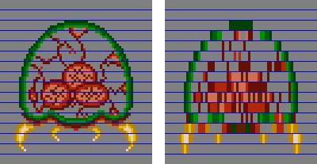
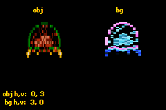
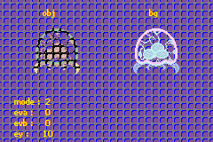
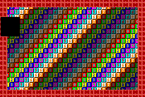
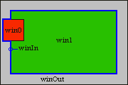

# 13. Graphic Effects

<!-- toc -->

So you know how to put sprites and backgrounds on screen, do ya? Now, how about some extra effects to liven up the place? When discussing sprites and backgrounds, we left some flags untouched, namely the [mosaic](#sec-mos) and [blending](#sec-blend) flags. There will be covered here. We'll also be looking into [windowing](#sec-win), with which you can create regions to mask out backgrounds or sprites.

## Mosaic {#sec-mos}

The best description of mosaic is that it makes sprites or tiles look blocky. A mosaic works in two dimensions with parameters *w<sub>m</sub>* and *h<sub>m</sub>*. These numbers divide your sprite or background into blocks of *w<sub>m</sub>* × *h<sub>m</sub>* pixels. The top-left pixel of each block is used to fill the rest of that block, which makes it blocky. {*@fig:metr-mos} shows a 1x4 mosaic for a metroid sprite. The blue lines indicate the vertical block-boundaries. The first line of each block is copied to the rest of the block, just like I said. Other examples of the mosaic effect are Zelda:LTTP when you hit an electric baddie, or Metroid Fusion when an X changes shape.

<div class="lblock">
  <div class="cpt" style="width:400px;">
    
    <b>{*@fig:metr-mos}</b>: a 1×4 mosaiced metroid.
  </div>
</div>

### Using mosaic: sprite/bg flags and REG_MOSAIC {#ssec-mos-use}

To use mosaic you must do two things. First, you need to enable mosaic. For individual sprites, set `OBJ_ATTR.attr0`\{C\}. For backgrounds, set `REG_BGxCNT`\{7\}. The set the mosaic levels through `REG_MOSAIC`, which looks like this:

<div class="reg">
  <table class="reg" id="tbl:reg-mosaic" border=1 frame=void cellpadding=4 cellspacing=0>
    <caption class="reg">REG_MOSAIC @ 0400:004Ch</caption>
    <tr class="bits">
      <td>F E D C</td>
      <td>B A 9 8</td>
      <td>7 6 5 4</td>
      <td>3 2 1 0</td>
    </tr>
    <tr class="bf">
      <td class="rclr3">Ov</td>
      <td class="rclr2">Oh</td>
      <td class="rclr1">Bv</td>
      <td class="rclr0">Bh</td>
    </tr>
  </table>
  <br>
  <table>
    <col class="bits" width=40>
    <col class="bf" width="8%">
    <col class="def" width="12%">
    <tr align="left">
      <th>bits</th>
      <th>name</th>
      <th>define</th>
      <th>description</th>
    </tr>
    <tbody valign="top">
      <tr class="bg0">
        <td>0-3</td>
        <td class="rclr0">Bh</td>
        <td><i>MOS_BH#</i></td>
        <td>Horizontal BG stretch.</td>
      </tr>
      <tr class="bg1">
        <td>4-7</td>
        <td class="rclr1">Bv</td>
        <td><i>MOS_BV#</i></td>
        <td>Vertical BG stretch.</td>
      </tr>
      <tr class="bg0">
        <td>8-B</td>
        <td class="rclr2">Oh</td>
        <td><i>MOS_OH#</i></td>
        <td>Horizontal object stretch.</td>
      </tr>
      <tr class="bg1">
        <td>C-F</td>
        <td class="rclr3">Ov</td>
        <td><i>MOS_OV#</i></td>
        <td>Vertical object stretch.</td>
      </tr>
    </tbody>
  </table>
</div>

The <dfn>stretch</dfn> is across how many pixels the base-pixel is stretched. This corresponds to *w<sub>m</sub>*−1 or *h<sub>m</sub>*−1. With a nybble for each effect, you have stretches between 0 and 15, giving mosaic widths and heights between 1 and 16.

:::tip Enabling mosaic

For backgrounds, set bit 7 of REG_BGxCNT. For sprites, set bit 12 in attribute 0. Then set the mosaic levels in REG_MOSAIC.

:::

### A small mosaic demo {#ssec-mos-demo}

There is a demo called *mos_demo* that illustrates the use of mosaic for both objects and backgrounds.

<div id="cd-mos-demo">

```c
// mos_demo.c
//   bg 0, cbb  0, sbb 31, pb 0: text
//   bg 1, cbb  1, sbb 30, pb 1: bg metroid
//   oam 0: tile 0-63: obj metroid

#include <stdio.h>
#include <tonc.h>
#include "metr.h"

void test_mosaic()
{
    tte_printf("#{P:48,8}obj#{P:168,8}bg");
    tte_set_margins(4, 130, 128, 156);

    POINT pt_obj={0,0}, pt_bg={0,0};
    POINT *ppt= &pt_obj;
    while(1)
    {
        vid_vsync();

        // control the mosaic
        key_poll();

        // switch between bg or obj mosaic
        ppt= key_is_down(KEY_A) ? &pt_bg : &pt_obj;
        ppt->x += key_tri_horz();       // inc/dec h-mosaic
        ppt->y -= key_tri_vert();       // inc/dec v-mosaic

        ppt->x= clamp(ppt->x, 0, 0x80);
        ppt->y= clamp(ppt->y, 0, 0x80);

        REG_MOSAIC= MOS_BUILD(pt_bg.x>>3, pt_bg.y>>3, pt_obj.x>>3, pt_obj.y>>3);

        tte_printf("#{es;P}obj h,v: %2d,%2d\n bg h,v: %2d,%2d",
            pt_obj.x>>3, pt_obj.y>>3, pt_bg.x>>3, pt_bg.y>>3);
    }
}

void load_metr()
{
    int ix, iy;

    memcpy32(&tile_mem[1][0], metrTiles, metrTilesLen/4);
    memcpy32(&tile_mem[4][0], metrTiles, metrTilesLen/4);
    memcpy32(pal_obj_mem, metrPal, metrPalLen/4);

    // create object: oe0
    OBJ_ATTR *metr= &oam_mem[0];
    obj_set_attr(metr, ATTR0_SQUARE | ATTR0_MOSAIC, ATTR1_SIZE_64, 0);
    obj_set_pos(metr, 32, 24);              // left-center

    // create bg map: bg1, cbb1, sbb 31

    for(ix=1; ix<16; ix++)
        pal_bg_mem[ix+16]= pal_obj_mem[ix] ^ CLR_WHITE;

    SCR_ENTRY *pse= &se_mem[30][3*32+18];    // right-center
    for(iy=0; iy<8; iy++)
        for(ix=0; ix<8; ix++)
            pse[iy*32+ix]= (iy*8+ix) | SE_PALBANK(1);

    REG_BG1CNT= BG_CBB(1) | BG_SBB(30) | BG_MOSAIC;
}

int main()
{
    // setup sprite
    oam_init(oam_mem, 128);
    load_metr();
    REG_DISPCNT= DCNT_BG0 | DCNT_BG1 | DCNT_OBJ | DCNT_OBJ_1D;

    // set-up text: bg0, cbb0, sbb31
    tte_init_chr4_b4_default(0, BG_CBB(2)|BG_SBB(31));
    tte_init_con();

    test_mosaic();
    return 0;
}
```
</div>

<div class="cpt_fr" style="width:240px;">
  
  <b>{*@fig:mos-demo}</b>: <i>mos_demo</i>.
</div>

I use two metroids in this demo. The sprite metroid is on the left, and the background metroid with inverted colors is on the right. I've shown how to set-up sprites and backgrounds before, so you should be able to follow the steps here because it's nothing new. Well, except setting the mosaic flags in `OBJ_ATTR.attr0` and REG_BG0CNT, which I've put in bold here.

The mosaic effect is regulated inside the `test_mosaic()`. I use two 2d points to keep track of the current level of mosaic. The D-pad is used to increase or decrease the mosaic levels; just the D-pad sets the object's mosaic and holding down A sets that of the background.

On a code design note, I could have used two if-blocks here, one for objects and one for the background, but I can also switch the mosaic context via a pointer, which saves me some code. Hurray for pointers. Also, the coordinates are in .3 fixed point format, which is how I slow down the changes in the mosaic levels. Again, I could have used timer variables and more checks to see if they had reached their thresholds, but fixed-point timers are much easier and in my view cleaner too.

You should really see the demo on hardware, by the way. Somehow both VBA and no$gba are both flawed when it comes to mosaic. After VBA 1.7.2, it has a problem with horizontal sprite mosaic. I do believe I've seen inconsistencies between hardware and scrolling mosaiced backgrounds, but can't remember where I saw it. As for no$gba, vertical mosaic appears to be disabled for both sprites and backgrounds.

:::warning Emulators and mosaic

VBA and no$gba, the most popular GBA emulators both have problems with mosaic. Watch your step.

:::

## Blending {#sec-blend}

If you're not completely new to gaming or graphics, you may have heard of <dfn>alpha blending</dfn>. It allows you to combine the color values two overlapping layers, thus creating transparency (also known as semi-transparency, because something that's *completely* transparent is invisible). Some bitmap types also come with an alpha channel, which indicates either the transparency or opacity of the pixel in question.

The basic idea behind blending is this. You have two layers, A and B, that overlap each other. Consider A to be on top of B. The color-value of the a pixel in this region is defined as

<table id="eq:blend">
  <tr>
    <td class="eqnrcell">({!@eq:blend})</td>
    <td class="eqcell">C = w<sub>A</sub>·A + w<sub>B</sub>·B,</td>
  </tr>
</table>

where *w<sub>A</sub>* and *w<sub>B</sub>* are the <dfn>weights</dfn> of the layers. The weights are generally normalised (between 0 and 1), with 0 being fully transparent and 1 being fully visible. It is also convenient to think of color-components in this way. Here's a few things you can do with them:

<div class="lblock">
  <table>
    <col span=3 align="left">
    <tr>
      <th width="8%">w<sub>A</sub></th>
      <th width="10%">w<sub>B</sub></th>
      <th>effect</th>
    </tr>
    <tr>
      <td>1</td>
      <td>0</td>
      <td>layer A fully visible (hides B; standard)</td>
    </tr>
    <tr>
      <td>0</td>
      <td>1</td>
      <td>layer B fully visible (or A is invisible)</td>
    </tr>
    <tr>
      <td>&alpha;</td>
      <td>1&minus;&alpha;</td>
      <td>Alpha blending. &alpha; is opacity in this case.</td>
    </tr>
  </table>
</div>

Note that in these examples the sum of the weights is 1, so that the final color *C* is between 0 (black) and 1 (white) as well. As we'll see, there are instances where you can drop out of these ranges; if this happens the values will be clipped to the standard range.

### GBA Blending {#ssec-bld-gba}

Backgrounds are always enabled for blending. To enable sprite-blending, set `OBJ_ATTR.attr0`\{a\}. There are three registers that control blending, which unfortunately go by many different names. The ones I use are `REG_BLDCNT`, `REG_BLDALPHA` and `REG_BLDY`. Other names are `REG_BLDMOD`, `REG_COLEV` and `REG_COLEY`, and sometimes the ‘E’ in the last two is removed. Be warned. Anyway, the first says how and on which layers the blend should be performed, the last two contain the weights. Oh, since the GBA doesn't do floating point, the weights are [fixed-point](fixed.html) numbers in 1.4 format. Still limited by 0 and 1, of course, so there are 17 blend levels.

<div class="reg">
  <table class="reg reg-huge" id="tbl:reg-bldcnt" border=1 frame=void cellpadding=4 cellspacing=0>
    <caption class="reg">REG_BLDCNT (REG_BLDMOD) @ 0400:0050h</caption>
    <tr class="bits">
      <td>F E</td>
      <td>D</td>
      <td>C</td>
      <td>B</td>
      <td>A</td>
      <td>9</td>
      <td>8</td>
      <td>7 6</td>
      <td>5</td>
      <td>4</td>
      <td>3</td>
      <td>2</td>
      <td>1</td>
      <td>0</td>
    </tr>
    <tr class="bf">
      <td>-</td>
      <td class="rclr1">bBD</td>
      <td class="rclr1">bOBJ</td>
      <td class="rclr1">bBG3</td>
      <td class="rclr1">bBG2</td>
      <td class="rclr1">bBG1</td>
      <td class="rclr1">bBG0</td>
      <td class="rclr2">BM</td>
      <td class="rclr0">aBD</td>
      <td class="rclr0">aObj</td>
      <td class="rclr0">aBG3</td>
      <td class="rclr0">aBG2</td>
      <td class="rclr0">aBG1</td>
      <td class="rclr0">aBG0</td>
    </tr>
  </table>
  <br>
  <table>
    <col class="bits" width=40>
    <col class="bf" width="8%">
    <col class="def" width="12%">
    <tr align="left">
      <th>bits</th>
      <th>name</th>
      <th>define</th>
      <th>description</th>
    </tr>
    <tbody valign="top">
      <tr class="bg0">
        <td>0-5</td>
        <td class="rclr0">aBG0-aBD</td>
        <td><i>BLD_TOP#</i></td>
        <td>The A (top) layers. <b>BD</b>, by the way, is the <dfn>back drop</dfn>, a solid plane of color 0. Set the bits to make that layer use the A-weights. Note that these layers must actually be in front of the B-layers, or the blend will fail.</td>
      </tr>
      <tr class="bg1">
        <td>6-7
        <td class="rclr2">BM
        <td>BLD_OFF, BLD_STD, BLD_WHITE, BLD_BLACK, <i>BLD_MODE#</i>
        <td>
          <b>Blending mode</b>.
          <ul>
            <li><b>00</b>: blending is off.</li>
            <li><b>01</b>: normal blend using the weights from <code>REG_ALPHA</code>.</li>
            <li><b>10</b>: blend A with white (fade to white) using the weight from <code>REG_BLDY</code></li>
            <li><b>11</b>: blend A with black (fade to black) using the weight from <code>REG_BLDY</code></li>
          </ul>
        </td>
      </tr>
      <tr class="bg0">
        <td>8-D</td>
        <td class="rclr1">bBG0-bBD</td>
        <td><i>BLD_BOT#</i></td>
        <td>The B (bottom) layers. Use the B-weights. Note that these layers must actually lie behind the A-layers, or the blend will not work.</td>
      </tr>
    </tbody>
  </table>
</div>

The `REG_BLDALPHA` and `REG_BLDY` registers hold the blending weights in the form of <span class="rclr0"><b>eva</b></span>, <span class="rclr1"><b>evb</b></span> and <span class="rclr2"><b>ey</b></span>, all in 1.4 fixed-point format. And no, I do not know why they are called that; they just are.

<div class="reg">
  <table class="reg" id="tbl:reg-bldalpha" border=1 frame=void cellPadding=4 cellSpacing=0>
    <caption class="reg">REG_BLDALPHA (REG_COLEV) @ 0400:0052h</caption>
    <tr class="bits">
      <td>F E D</td>
      <td>C B A 9 8</td>
      <td>7 6 5</td>
      <td>4 3 2 1 0</td>
    </tr>
    <tr class="bf">
      <td>-</td>
      <td class="rclr1">evb</td>
      <td>-</td>
      <td class="rclr0">eva</td>
    </tr>
  </table>
  <table>
    <col class="bits" width=40>
    <col class="bf" width="8%">
    <col class="def" width="12%">
    <tr align="left">
      <th>bits</th>
      <th>name</th>
      <th>define</th>
      <th>description</th>
    </tr>
    <tbody valign="top">
      <tr class="bg0">
        <td>0-4</td>
        <td class="rclr0">eva</td>
        <td><i>BLD_EVA#</i></td>
        <td><b>Top blend weight</b>. Only used for normal blending</td>
      </tr>
      <tr class="bg1">
        <td>8-C</td>
        <td class="rclr1">evb</td>
        <td><i>BLD_EVB#</i></td>
        <td><b>Bottom blend weight</b>. Only used for normal blending</td>
      </tr>
    </tbody>
  </table>
</div>
<br>
<div class="reg">
  <table class="reg" id="tbl:reg-bldy" border=1 frame=void cellpadding=4 cellspacing=0>
    <caption class="reg">REG_BLDY (REG_COLEY) @ 0400:0054h</caption>
    <tr class="bits">
      <td>F E D C B A 9 8 7 6 5</td>
      <td>4 3 2 1 0</td>
    </tr>
    <tr class="bf">
      <td>-</td>
      <td class="rclr2">ey</td>
    </tr>
  </table>
  <table>
    <col class="bits" width=40>
    <col class="bf" width="8%">
    <col class="def" width="12%">
    <tr align="left">
      <th>bits</th>
      <th>name</th>
      <th>define</th>
      <th>description</th>
    </tr>
    <tbody valign="top">
      <tr class="bg0">
        <td>0-4</td>
        <td class="rclr2">ey</td>
        <td><i>BLDY#</i></td>
        <td><b>Top blend fade</b>. Used for white and black fades.</td>
      </tr>
    </tbody>
  </table>
</div>

### Blending caveats {#ssec-bld-cav}

Blending is a nice feature to have, but keep these points in mind.

- The A layers *must* be in front of the B layers. Only then will the blend actually occur. So watch your priorities.
- In the alpha-blend mode (mode 1) the blend will only take place on the **overlapping, non-transparent** pixels of layer A and layer B. Non-overlapping pixels will still have their normal colors.
- Sprites are affected differently than backgrounds. In particular, the blend mode specified by `REG_BLDCNT`\{6,7\} is applied only to the *non*-overlapping sections (so that effectively only fading works). For the overlapping pixels, the standard blend is *always* in effect, regardless of the current blend-mode.
- If you are using [windows](#sec-win), you need to set the bits 5 and/or 13 in REG_WININ or REG_WINOUT for the blending to work.

### The obligatory demo {#ssec-bld-demo}

<div id="cd-bld-demo">

```c
// bld_demo.c

//   bg 0, cbb  0, sbb 31, pb 15: text
//   bg 1, cbb  2, sbb 30, pb 1: metroid
//   bg 2, cbb  2, sbb 29, pb 0: fence
//   oam 0: tile 0-63: obj metroid

#include <stdio.h>
#include <tonc.h>
#include "../gfx/metr.h"

void test_blend()
{
    tte_printf("#{P:48,8}obj#{P:168,8}bg");
    tte_set_margins(16, SCR_H-4-4*12, SCR_W-4, SCR_H-4);

    u32 mode=0;
    // eva, evb and ey are .4 fixeds
    // eva is full, evb and ey are empty
    u32 eva=0x80, evb= 0, ey=0;

    REG_BLDCNT= BLD_BUILD(
        BLD_OBJ | BLD_BG0,  // Top layers
        BLD_BG1,            // Bottom layers
        mode);              // Mode

    while(1)
    {
        vid_vsync();
        key_poll();

        // Interactive blend weights
        eva += key_tri_horz();
        evb -= key_tri_vert();
        ey  += key_tri_fire();

        mode += bit_tribool(key_hit(-1), KI_R, KI_L);

        // Clamp to allowable ranges
        eva = clamp(eva, 0, 0x81);
        evb = clamp(evb, 0, 0x81);
        ey  = clamp(ey, 0, 0x81);
        mode= clamp(mode, 0, 4);

        tte_printf("#{es;P}mode :\t%2d\neva :\t%2d\nevb :\t%2d\ney :\t%2d",
            mode, eva/8, evb/8, ey/8);

        // Update blend mode
        BFN_SET(REG_BLDCNT, mode, BLD_MODE);

        // Update blend weights
        REG_BLDALPHA= BLDA_BUILD(eva/8, evb/8);
        REG_BLDY= BLDY_BUILD(ey/8);
    }
}

void load_metr()
{
    // copy sprite and bg tiles, and the sprite palette
    memcpy32(&tile_mem[2][0], metrTiles, metrTilesLen/4);
    memcpy32(&tile_mem[4][0], metrTiles, metrTilesLen/4);
    memcpy32(pal_obj_mem, metrPal, metrPalLen/4);

    // set the metroid sprite
    OBJ_ATTR *metr= &oam_mem[0]; // use the first sprite
    obj_set_attr(metr, ATTR0_SQUARE | ATTR0_BLEND, ATTR1_SIZE_64, 0);
    obj_set_pos(metr, 32, 24);       // mid-center

    // create the metroid bg
    // using inverted palette for bg-metroid
    int ix, iy;
    for(ix=0; ix<16; ix++)
        pal_bg_mem[ix+16]= pal_obj_mem[ix] ^ CLR_WHITE;

    SCR_ENTRY *pse= &se_mem[30][3*32+18]; // right-center
    for(iy=0; iy<8; iy++)
        for(ix=0; ix<8; ix++)
            pse[iy*32+ix]= iy*8+ix + SE_PALBANK(1);

    REG_BG0CNT= BG_CBB(0) | BG_SBB(30);
}

// set-up the fence background
void load_fence()
{

    // tile 0 / ' ' will be a fence tile
    const TILE fence=
    {{
        0x00012000, 0x00012000, 0x00022200, 0x22220222,
        0x11122211, 0x00112000, 0x00012000, 0x00012000,
    }};
    tile_mem[2][64]= fence;
    se_fill(se_mem[29], 64);

    pal_bg_mem[0]= RGB15(16, 10, 20);
    pal_bg_mem[1]= RGB15( 0,  0, 31);
    pal_bg_mem[2]= RGB15(16, 16, 16);

    REG_BG2CNT= BG_CBB(2) | BG_SBB(29);
}

int main()
{
    oam_init(oam_mem, 128);
    load_metr();
    load_fence();

    tte_init_chr4_b4_default(0, BG_CBB(0)|BG_SBB(31));
    tte_init_con();

    REG_DISPCNT= DCNT_MODE0 | DCNT_BG0 | DCNT_BG1 | DCNT_BG2 |
        DCNT_OBJ | DCNT_OBJ_1D;

    test_blend();

    return 0;
}
```
</div>

<div class="cpt_fr" style="width:240px;">
  
  <b>{*@fig:bld-demo}</b>: blend demo; mode=2, eva=0, evb=0, ey=10.
</div>

As always, there's a demo that goes with all this stuff. *bld_demo* features 2 metroids (the left one is a sprite, the right one (palette inverted) is on background 0) on a fence-like background (bg 1 to be precise) and lets you modify the mode, and the 3 weights independently. The mode, by the way, is given in the top left corner. The controls are:

<div class="lblock">
  <table>
    <col valign="top">
    <tr>
      <th>left, right</th>
      <td>changes <code>eva</code>. Note that <code>eva</code> is at maximum initially.</td>
    </tr>
    <tr>
      <th>down,up</th>
      <td>changes <code>evb</code>.</td>
    </tr>
    <tr>
      <th>B,A</th>
      <td>Changes <code>ey</code></td>
    </tr>
    <tr>
      <th>L,R</th>
      <td>Changes mode.</td>
    </tr>
  </table>
</div>

The function of interest is `test_blend()`. This is where the key handling takes place and where the blend settings are altered. Similar to *mos_demo*, .3 fixeds are used for the blend weight variables to slow the rate of change to more comfortable levels. To set the blend registers themselves I'm using `BUILD()` macros and `BF_SET()`, which work well enough for these purposes. It would be trivially easy to write wrapper functions here of course. Most of the code is pretty standard; just play around with the blend modes and weights and see what happens.

Do take note of how, like I said earlier, the sprite metroid is affected differently than the bg-metroid. The background-background blend behaves exactly as the mode says it should; the sprite, on the other hand, always has a blend if they overlap with the fence's pixels, and the rest obeys the mode, which is what I told you in the caveats.

## Windowing {#sec-win}

Windowing allows you to divide the screen into rectangular areas known as, well, windows. There are two basic windows: <dfn>win0</dfn> and <dfn>win1</dfn>. There's also a third type of window, the <dfn>object</dfn> window. This creates a window out of the visible pixels of the sprites. You can enable the windows by setting `REG_DISPCNT`\{d,e,f\}, respectively.

A rectangular window is defined by its <dfn>left</dfn>, <dfn>right</dfn>, <dfn>top</dfn> and <dfn>bottom</dfn> sides. Unless you're one of *those* people, who think it's funny to say that a rectangle has only two sides: an inside and an outside. In fact, this is truer than you think. The union of win0 and win1 is the <dfn>inside</dfn> window. There's also the <dfn>outside</dfn> window, which is everything else. In other words:

<div class="lblock">
  <table>
    <tr>
      <td class="fill"></td>
      <td class="eqcell">winIn = win0 | win1<br>winOut = ~(winIn)</td>
    </tr>
  </table>
  <table id="fig:win-dgrm">
    <tbody valign="top">
      <tr>
        <td>
          <div class="cpt" style="width:240px;">
            
            <b>{*@fig:win-dgrm}a</b>: showing win0, win1, and win_out windows.
          </div>
        </td>
        <td>
          <div class="cpt" style="width:180px;">
            
            <b>{*@fig:win-dgrm}b</b>: win0 in red, win1 in green, winIn is win0 | win1 (blue edge), winOut in grey.
          </div>
        </td>
      </tr>
    </tbody>
  </table>
</div>

### Window boundaries {#ssec-win-bound}

Both win0 and win1 have 2 registers that define their boundaries. In order these are `REG_WIN0H` (`0400:0040h`), `REG_WIN1H` (`0400:0042h`), `REG_WIN0V` (`0400:0044h`) and `REG_WIN1V` (`0400:0046h`), which have the following layout:

<div class="reg">
  <table class="reg" id="tbl:reg-winxy" border=1 frame=void cellPadding=4 cellSpacing=0>
    <caption class="reg">REG_WINxH and REG_WINxV @ 0400:0040-0400:0047h</caption>
    <tr class="bits">
      <th>reg</th>
      <td>F E D C B A 9 8</td>
      <td>7 6 5 4 3 2 1 0</td>
    </tr>
    <tr class="bf">
      <td><code>REG_WINxH</code></td>
      <td class="rclr0">left</td>
      <td class="rclr1">right</td>
    </tr>
    <tr class="bf">
      <td><code>REG_WINxV</code></td>
      <td class="rclr2">top</td>
      <td class="rclr3">bottom</td>
    </tr>
  </table>
  <br>
  <table>
    <col class="bits" width=40>
    <col class="bf" width=40>
    <col class="def">
    <tr align="left">
      <th>bits</th>
      <th>name</th>
      <th></th>
      <th>description</th>
    </tr>
    <tbody valign="top">
      <tr class="bg0">
        <td>0-7</td>
        <td class="rclr1">right</td>
        <td></td>
        <td>Right side of window (exclusive)</td>
      </tr>
      <tr class="bg1">
        <td>8-F</td>
        <td class="rclr0">left</td>
        <td></td>
        <td>Left side of window (inclusive)</td>
      </tr>
      <tr>
        <td colspan=4>-</td>
      </tr>
      <tr class="bg0">
        <td>0-7</td>
        <td class="rclr3">bottom</td>
        <td></td>
        <td>Bottom side of window (exclusive)</td>
      </tr>
      <tr class="bg1">
        <td>8-F</td>
        <td class="rclr2">top</td>
        <td></td>
        <td>Top side of window (inclusive)</td>
      </tr>
    </tbody>
  </table>
</div>

So you have one byte for each value. That's bytes as in *unsigned* chars. The contents of a window are drawn from starting at the top-left up to, but not including, the bottom-right. What you have to realize is that this is also true when, say, the right value is lower than the left value. In such a case, there's a wrap-around and everything on that line is inside the window, except the pixels between R and L. If both *R* < *L* and *B* < *T* then you get a window in the shape of a cross.

### Window content {#ssec-win-content}

The possible content for the windows are backgrounds 0-3 and objects. No suprise there, right? In total, we have regions: win0, win1, winOut and winObj. `REG_WININ` (`0400:0048h`) controls win0 and win1, `REG_WINOUT` (`0400:004ah`) takes care of winOut and winObj. There's one bit for each content-type, plus one for blending, which you will need if you intend to use blending on the contents of that particular window.

<div class="reg">
  <table class="reg reg-huge" id="tbl:reg-winio" border=1 frame=void cellpadding=4 cellspacing=0>
    <tr class="bits">
      <th>register</th>
      <td>F E</td>
      <td>D</td>
      <td>C</td>
      <td>B</td>
      <td>A</td>
      <td>9</td>
      <td>8</td>
      <td>7 6</td>
      <td>5</td>
      <td>4</td>
      <td>3</td>
      <td>2</td>
      <td>1</td>
      <td>0</td>
    </tr>
    <tr class="bf">
      <th>bits</th>
      <td>-</td>
      <td class="rclr1">Bld</td>
      <td class="rclr1">Obj</td>
      <td class="rclr1">BG3</td>
      <td class="rclr1">BG2</td>
      <td class="rclr1">BG1</td>
      <td class="rclr1">BG0</td>
      <td>-</td>
      <td class="rclr0">Bld</td>
      <td class="rclr0">Obj</td>
      <td class="rclr0">BG3</td>
      <td class="rclr0">BG2</td>
      <td class="rclr0">BG1</td>
      <td class="rclr0">BG0</td>
    </tr>
    <tr align="center">
      <th><code>REG_WININ</code></th>
      <td>-</td>
      <td colspan=6>win1</td>
      <td>-</td>
      <td colspan=6>win0</td>
    </tr>
    <tr align="center">
      <th><code>REG_WINOUT</code></th>
      <td>-</td>
      <td colspan=6>winObj</td>
      <td>-</td>
      <td colspan=6>winOut</td>
    </tr>
  </table>
  <br>
  <table>
    <col class="bits" width=40>
    <col class="bf" width="8%">
    <col class="def" width="12%">
    <tr align="left">
      <th>bits</th>
      <th>name</th>
      <th>define</th>
      <th>description</th>
    </tr>
    <tbody valign="top">
      <tr class="bg0">
        <td>0-5</td>
        <td class="rclr0">BGx, Obj, Bld</td>
        <td>WIN_BGx, WIN_OBJ, WIN_BLD, <i>WIN_LAYER#</i></td>
        <td><b>Windowing flags</b>. To be used with all bytes in REG_WININ and REG_WINOUT.</td>
      </tr>
    </tbody>
  </table>
</div>

There is little in the way of macros or bit-defines here because they're not really necessary. Do have these in *tonc_memdef.h* though:

```c
#define WIN_BUILD(low, high)    \
    ( ((high)<<8) | (low) )

#define WININ_BUILD(win0, win1)     WIN_BUILD(win0, win1)

#define WINOUT_BUILD(out, obj)      WIN_BUILD(out, obj)
```

There are still a few things you should know about windows. First of all, when you turn on windowing in `REG_DISPCNT`, nothing will show up. There are two reasons for this. Firstly, the boundary registers are all 0, so the whole screen is basically winOut. Secondly, and this is really important: a background or object will only show up in the windows in which it is enabled! This means that unless at least *some* bits have been set in `REG_WININ` or `REG_WINOUT` nothing will show. This presents you with an effective way of hiding stuff, as we'll see in the demo. There is a third thing that you must remember, namely that win0 takes precedence over win1, which in turn takes precedence over winOut. I'm not sure how winObj fits into this yet.

:::tip Windowing necessities

To make windowing work for you, you need to do the following things:

- Enable windows in `REG_DISPCNT`
- Indicate in which window you want things to show up by setting the appropriate bits in `REG_WININ` and `REG_WINOUT`. You **must** set at least some bits here if you have windowing enabled, or nothing will show up at all!
- Set the desired window sizes in `REG_WINxH/V`. If you don't, everything will be considered in the Out-window.

:::

### Caveats {#ssec-win-caveat}

There's something really weird going on when either the top or bottom is outside of the screen. Multiple somethings in fact, see the demo *on hardware!* for details.

-   If the top is in the \[-29, 0⟩ range (i.e., \[227, 255\]), the window will *not* be rendered at all. Likewise, if the bottom is inside this range, the window covers the height of the screen. I cannot say exactly what the cause is, but since the VCount also stops at 227, that might have something to do with it.
-   Also, if you move the bottom from, 161 to 160, the window will also cover the whole length, but only for a frame or so.
-   The points mentioned above assume *T*<*B*. If the top is bigger, then the effect is reversed.

:::warning Windowing weirdness not on emulators

This behaviour does *not* appear on the emulators I've tested on.

VBA clips the windows, like common sense would lead you to believe. (Of course, common sense also tells you that the Sun orbits the Earth or that the stars are pinpricks on a large black canvas. Common sense is hardly common).

MappyVM and BoycottAdvance simply remove the window if any of the boundaries goes off the screen.

:::

### Demo: there's a rocket in my pocket {#ssec-win-demo}

In case you hadn't noticed yet, I like the Metroid series. I really like the Metroid series. If you have ever played Super Metroid chances are that you've used the X-ray scope, which let's you see through the layers and find items and secret passages with much more ease. Guess how that was done? Yup, windowing. The windowing demo *win_demo* essentially does the same thing. There's a rocket-item hidden behind the background layers and you have an X-ray rectangle which you can move around the screen so you can find it.

The controls are simple: use the D-pad to move the window around; START repositions the rocket. I've also added finer movement (A + D-pad) so you can see the strange behaviour the windows seem to exhibit at certain positions.

<div class="lblock">
  <table>
    <tr>
      <th width="10%">dir</th>
      <td>Moves the rectangle.</td>
    </tr>
    <tr>
      <th>A + dir</th>
      <td>Move rectangle by tapping for finer control.</td>
    </tr>
    <tr>
      <th>start</th>
      <td>Randomly change the position of the rocket.</td>
    </tr>
  </table>
</div>

What follows below is the majority of the demo's code. I have removed the functions that set up the backgrounds and sprite because there's nothing in them that you haven't seen before already. The earlier {@fig:win-dgrm}a is a screenshot of the demo in action.

<div id="cd-win-demo">

```c
// win_demo.c

//   bg 0, cbb  0, sbb  2, pb 0: numbered forground
//   bg 1, cbb  0, sbb  3, pb 0: fenced background
//   oam 0: tile 0-3: rocket

//   win 0: objects
//   win 1: bg 0
//   win out : bg 1

#include <tonc.h>
#include "nums.h"
#include "rocket.h"

typedef struct tagRECT_U8 { u8 ll, tt, rr, bb; } ALIGN4 RECT_U8;

// window rectangle regs are write only, so buffers are necessary
// Objects in win0, BG 0 in win1
RECT_U8 win[2]=
{
    { 36, 20,  76,  60 },   // win0: 40x40 rect
    { 12, 12 ,228, 148 }    // win1: screen minus 12 margin.
};

// gfx loaders omitted for clarity
void init_front_map();  // numbers tiles
void init_back_map();   // fence
void init_rocket();     // rocket

void win_copy()
{
    REG_WIN0H= win[0].ll<<8 | win[0].rr;
    REG_WIN1H= win[1].ll<<8 | win[1].rr;
    REG_WIN0V= win[0].tt<<8 | win[0].bb;
    REG_WIN1V= win[1].tt<<8 | win[1].bb;
}

void test_win()
{
    win_copy();
    while(1)
    {
        key_poll();
        vid_vsync();

        // key_hit() or key_is_down() 'switch'
        // A depressed: move on direction press (std movement)
        // A pressed  : moves on direction hit (fine movement)
        int keys= key_curr_state();
        if(key_is_down(KEY_A))
            keys &= ~key_prev_state();

        if(keys & KEY_RIGHT)
        {   win[0].ll++;        win[0].rr++;    }
        else if(keys & KEY_LEFT )
        {   win[0].ll--;        win[0].rr--;    }
        if(keys & KEY_DOWN)
        {   win[0].tt++;        win[0].bb++;    }
        else if(keys & KEY_UP )
        {   win[0].tt--;        win[0].bb--;    }

        // (1) randomize rocket position
        if(key_hit(KEY_START))
            obj_set_pos(&oam_mem[0],
                qran_range(0, 232), qran_range(0, 152));

        win_copy();
    }
}

int main()
{
    // obvious inits
    oam_init();
    init_front_map();
    init_back_map();
    init_rocket();

    // (2) windowing inits
    REG_DISPCNT= DCNT_BG0 | DCNT_BG1 | DCNT_OBJ | DCNT_OBJ_1D |
        DCNT_WIN0 |     // Enable win 0
        DCNT_WIN1;      // Enable win 1

    REG_WININ= WININ_BUILD(WIN_OBJ, (WIN_BG0);
    REG_WINOUT= WINOUT_BUILD(WIN_BG1, 0);

    win_copy();     // Initialize window rects

    test_win();

    return 0;
}
```
</div>

Initializing the windows is done at point 2: both win0 and win1 in `REG_DISPCNT`, objects in win 0, bg 0 in win 1 and bg1 in winOut. The windows' sizes are set using `win_copy()` in each frame. I am using two rectangle variables to keep track of where the windows are, because the window-rectangle registers themselves are write only. See {@fig:win-dgrm} again for the result.

Usually, objects are shown in front of backgrounds. However, because objects are now only set to appear inside win 0, they are effectively hidden everywhere else: you will only see the rocket or parts of it if the rocket and win 0's rectangle overlap. Furthermore, you will notice that because *only* objects are set for win 0, the window itself is completely black.

The rest of the demo is rather uneventful. I could explain that the way mask the variable `keys` with the previous keystate when **A** is held down lets me switch between the `key_hit()` and `key_is_down()` functions, giving me the functionality I require to switch between direct and fine motion for the X-ray window, but it's not all that interesting and quite besides the point of the demo. What's also beside the point of the demo, but *is* interesting to mention, is the randomization of the rocket's position.

#### Random numbers

Random numbers on a computer is a somewhat quaint notion. The whole point of a computer is to have a reliable calculator, and random numbers are pretty much the antithesis of that. Computer generated random numbers are also called <dfn>pseudo-random</dfn>, because they aren't intrinsically random, just deterministically generated to *seem* that way. There are statistical tests to see if a given routine is sufficiently random. However, this isn't nuclear physics we're talking about, this is game programming. We mostly need something that can, say, make an enemy zig or zag without any discernable pattern; that it can kill a Monte Carlo simulation is totally irrelevant.

One class of generators are <dfn>linear congruential generators</dfn>, which follow the pattern *N*<sub>i+1</sub> = (*a·N*<sub>i</sub> + *c*)%*m*, with *N*<sub>i</sub>∈\[0, *m*⟩. With properly picked parameters *a*, *c* and *m*, the routine can be quite adequate. If you ever encounter a `rand()` function in any kind of standard library, chances are it's one of these. Not only are these easy to implement, they are likely to be fast as well.

The following routine `qran()` is taken from my numerical methods book, [Numerical Recipes](http://www.amazon.com/gp/product/0521431085/103-4874440-3995059), pp 275, where it is labelled a quick and dirty generator, but an adequate one. Consisting of one addition and one multiply (*m*=2<sup>32</sup>, so done automatically), it is *very* fast. The actual number returned are the top 15 bits from *N*, because the upper bits are apparently more random than the lower, and also because 15 gives a \[0,32767\] range, which is something of an unofficial standard, AFAIK. Note that there is a second function, `sqran()` used to <dfn>seed</dfn> the generator. Since the process itself is still deterministic, you need a seed to ensure that you don't get the same sequence every time. Unless, that is, you actually *want* that to happen. This isn't such a strange idea if you think about it: you could use it to generate maps, for example. Instead of storing the whole map so that it looks the same every time you load it, you just store the seed and you're done. This is how the planetary terrains in [Star Control 2](https://sc2.sourceforge.net/) are made; I very much doubt it would have been possible to store bitmaps of all the 1000+ planets it had. This is why `sqran()` also returns the current *N*, so you can reset it later if necessary.

<div id="cd-qran">

```c
// from tonc_core.h/.c
// A Quick (and dirty) random number generator and its seeder

int __qran_seed= 42;     // Seed / rnd holder

// Seed routine
int sqran(int seed)
{
    int old= __qran_seed;
    __qran_seed= seed;
    return old;
}

//! Quick (and very dirty) pseudo-random number generator
/*! \return random in range [0,8000h>
*/
INLINE int qran()
{
    __qran_seed= 1664525*__qran_seed+1013904223;
    return (__qran_seed>>16) & 0x7FFF;
}
```
</div>

I'll say again, this is not a very advanced random generator, but it'll be enough for what I need. If you want a better (but slower) one, try the [Mersenne Twister](https://en.wikipedia.org/wiki/Mersenne_twister). You can find a nice implementation on it on PERN's [new sprite page](https://web.archive.org/web/20160323220658/http://www.drunkencoders.com/tutorials/GBA/day_3.html).

#### Ranged random numbers

Getting a random number is one thing; getting a random number in a particular range is another. It seems simple enough, of course: for a number between, say, 0 and 240 you'd use modulo 240. However, as the GBA doesn't have a hardware divide, it'll cost quite a number of cycles. Fortunately, there is a simple way out of it.

I said that `qran()`, like stdlib's `rand()` has a range between 0 and 0x8000. You can also see this as a range between 0 and 1, if you interpret them as .15 fixed point numbers. By multiplying with 240, you'll have the desired ranged random number, and it only costs a multiplication and a shift. This technique works for every random number generator, as long as you pay attention to its maximum range and integer overflow (which you should pay attention to anyway). Tonclib's version of this is called `qran_range()`.

```c
//! Ranged random number
/*! \return random in range [\a min, \a max>
*   \note (max-min) must be lower than 8000h
*/
INLINE int qran_range(int min, int max)
{    return (qran()*(max-min)>>15)+min;     }
```

In the demo, I'm using `qran_range()` twice to keep the sprite position inside the screen at all times. While the position itself could be predicted beforehand with some investigation, I don't think it'll be that easy. And if you really put that kind of effort in it, I'd say you would deserve something for your troubles. If you reload the demo a few times, you will notice that the sequence of positions is always the same. This is why they're called *pseudo*-random. To get a different sequence, the seed value should be different. I haven't even seeded it once here because it's not really important for this, but the usual trick to seed it with something involving time: for example, the number of frames or cycles before one actually starts a game, counted from the various intro screens that may precede it. Even a small difference in the seed can produce wildly varying sequences.

## Conclusions {#sec-conc}

Technically speaking you probably won't really need mosaic, blending or windowing in games, but they're great for subtle effects, like a ‘shock-hit’ or spotlights. They're also of great use for various types of scene transitions; a fade to black can be easily implemented using the blend registers. Also fun are various HBlank effects using windows, changing the rectangles every HBlank to give beams, side-way wipes or circlular windows. However, to be able to do that you need to know how to work with interrupts. Or a special case of DMA known as HDMA, which just happens to be up next.
