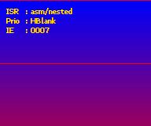
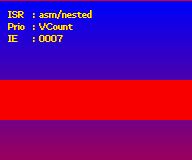

# 16. Interrupts

<!-- toc -->

## Introduction {#sec-intro}

Under certain conditions, you can make the CPU drop whatever it's doing, go run another function instead, and continue with the original process afterwards. This process is known as an <dfn>interrupt</dfn> (two ‘r’s, please). The function that handles the interrupt is an <dfn>interrupt service routine</dfn>, or just interrupt; triggering one is called <dfn>raising</dfn> an interrupt.

Interrupts are often attached to certain hardware events: pressing a key on a PC keyboard, for example, raises one. Another PC example is the VBlank (yes, PCs have them too). The GBA has similar interrupts and others for the HBlank, DMA and more. This last one in particular can be used for a great deal of nifty effects. I'll give a full list of interrupts shortly.

Interrupts halt the current process, quickly do ‘something’, and pass control back again. Stress the word “quickly”: interrupts are supposed to be short routines.

## Interrupts registers {#sec-regs}

There are three registers specifically for interrupts: `REG_IE` (`0400:0200h`), `REG_IF` (`0400:0202h`) and `REG_IME` (`0400:0208h`). `REG_IME` is the master interrupt control; unless this is set to ‘1’, interrupts will be ignored completely. To enable a specific interrupt you need to set the appropriate bit in `REG_IE`. When an interrupt occurs, the corresponding bit in `REG_IF` will be set. To acknowledge that you've handled an interrupt, the bit needs to be cleared again, but the way to do that is a little counter-intuitive to say the least. To acknowledge the interrupt, you actually have to *set* the bit again. That's right, you have to write 1 to that bit (which is already 1) in order to clear it.

Apart from setting the bits in `REG_IE`, you also need to set a bit in other registers that deal with the subject. For example, the HBlank interrupt also requires a bit in `REG_DISPSTAT`. I think (but please correct me if I'm wrong) that you need both a sender and receiver of interrupts; `REG_IE` controls the receiver and registers like `REG_DISPSTAT` control the sender. With that in mind, let's check out the bit layout for `REG_IE` and `REG_IF`.

<div class="reg">
<table class="reg" id="tbl:reg-ie"
  border=1 frame=void cellpadding=4 cellspacing=0>
<caption class="reg">
  REG_IE @ <code>0400:0200</code> and REG_IF @ <code>0400:0202</code>
</caption>
<tr class="bits">
  <td>F E<td>D<td>C<td>B A 9 8<td>7<td>6 5 4 3<td>2<td>1<td>0
<tr class="bf">
  <td>-
  <td class="rclr7">C
  <td class="rclr6">K
  <td class="rclr5">Dma
  <td class="rclr4">Com
  <td class="rclr3">Tm
  <td class="rclr2">Vct
  <td class="rclr1">Hbl
  <td class="rclr0">Vbl
</table>
<br>

<table>
  <col class="bits" width=40>
  <col class="bf" width="8%">
  <col class="def" width="12%">
<tr align="left"><th>bits<th>name<th>define<th>description
<tbody valign="top">
<tr class="bg0">
  <td> 0 <td class="rclr0">Vbl
  <td>IRQ_VBLANK
  <td><b>VBlank</b> interrupt. Also requires 
    <code>REG_DISPSTAT</code>{3}
<tr class="bg1">
  <td> 1 <td class="rclr1">Hbl
  <td>IRQ_HBLANK
  <td><b>HBlank</b> interrupt. Also requires 
    <code>REG_DISPSTAT</code>{4} Occurs <i>after</i> the HDraw, so that 
    things done here take effect in the next line. 
<tr class="bg0">
  <td> 2 <td class="rclr2">Vct
  <td>IRQ_VCOUNT
  <td><b>VCount</b> interrupt. Also requires 
    <code>REG_DISPSTAT</code>{5}. The high byte of 
    <code>REG_DISPSTAT</code> gives the VCount at which to raise the 
    interrupt. Occurs at the <i>beginning</i> of a scanline.
<tr class="bg1">
  <td>3-6<td class="rclr3">Tm
  <td>IRQ_TIMER<i>x</i>
  <td><b>Timer</b> interrupt, 1 bit per timer. Also requires 
    <code>REG_TMxCNT</code>{6}. The interrupt will be raised 
    when the timer overflows.
<tr class="bg0">
  <td> 7 <td class="rclr4">Com
  <td>IRQ_COM
  <td><b>Serial communication</b> interrupt. Apparently, also requires 
    <code>REG_SCCNT</code>{E}. To be raised when the transfer
    is complete. Or so I'm told, I really don't know squat about 
    serial communication. 
<tr class="bg1">
  <td>8-B<td class="rclr5">Dma
  <td>IRQ_DMA<i>x</i>
  <td><b>DMA</b> interrupt, 1 bit per channel. Also requires 
    <code>REG_DMAxCNT</code>{1E}. Interrupt will be raised 
    when the full transfer is complete.
<tr class="bg0">
  <td>C <td class="rclr6">K
  <td>IRQ_KEYPAD
  <td><b>Keypad</b> interrupt. Also requires 
    <code>REG_KEYCNT</code>{E}. Raised when any or all or the keys 
    specified in <code>REG_KEYCNT</code> are down.
<tr class="bg1">
  <td> D <td class="rclr7">C
  <td>IRQ_GAMEPAK
  <td><b>Cartridge</b> interrupt. Raised when the cart is removed from 
    the GBA.
</tbody>
</table>
</div>

## Interrupt Service Routines {#sec-isr}

You use the interrupt registers described above to indicate which interrupts you want to use. The next step is writing an interrupt service routine. This is just a typeless function (`void func(void)`); a C-function like many others. Here's an example of an HBlank interrupt.

```c
void hbl_pal_invert()
{
    pal_bg_mem[0] ^= 0x7FFF;
    REG_IF = IRQ_HBLANK;
}
```

The first line inverts the color of the first entry of the palette memory. The second line resets the HBlank bit of `REG_IF` indicating the interrupt has been dealt with. Since this is an HBlank interrupt, the end-result is that that the color changes every scanline. This shouldn't be too hard to imagine.

If you simply add this function to an existing program, nothing would change. How come? Well, though you have an isr now, you still need to tell the GBA where to find it. For that, we will need to take a closer look at the interrupt process as a whole.

<div class="note">
<div class="nhcare">
On acknowledging interrupts correctly
</div>

To acknowledge that an interrupt has been dealt with, you have to **set** the bit of that interrupt in `REG_IF`, and *only* that bit. That means that ‘<code>REG_IF <b>=</b> IRQ_<i>x</i></code>’ is usually the correct course of action, and not ‘<code>REG_IF <b>|=</b> IRQ_<i>x</i></code>’. The |= version acknowledges all interrupts that have been raised, even if you haven't dealt with them yet.

Usually, these two result in the same thing, but if multiple interrupts come in at the same time things will go bad. Just pay attention to what you're doing.
</div>

### The interrupt process {#ssec-isr-proc}

The complete interrupt process is kind of tricky and part of it is completely beyond your control. What follows now is a list of things that you, the programmer, need to know. For the full story, see [GBATEK : irq control](https://problemkaputt.de/gbatek.htm#gbainterruptcontrol).

1.  Interrupt occurs. Some black magic deep within the deepest dungeons of BIOS happens and the CPU is switched to IRQ mode and ARM state. A number of registers (`r0-r3, r12, lr`) are pushed onto the stack.
2.  BIOS loads the address located at `0300:7FFC` and branches to that address.
3.  The code pointed to by `0300:7FFC` is run. Since we're in ARM-state now, this *must* to be ARM code!
4.  After the isr is done, acknowledge that the interrupt has been dealt with by writing to `REG_IF`, then return from the isr by issuing a `bx lr` instruction.
5.  The previously saved registers are popped from stack and program state is restored to normal.

Steps 1, 2 and 5 are done by BIOS; 3 and 4 are yours. Now, in principle all you need to do is place the address of your isr into address `0300:7FFC`. To make our job a little easier, we will first create ourselves a function pointer type.

```c
typedef void (*fnptr)(void);
#define REG_ISR_MAIN *(fnptr*)(0x03007FFC)

// Be careful when using it like this, see notes below
void foo()
{
    REG_ISR_MAIN= hbl_pal_invert;  // tell the GBA where my isr is
    REG_DISPSTAT |= VID_HBL_IRQ;  // Tell the display to fire HBlank interrupts
    REG_IE |= IRQ_HBLANK;          // Tell the GBA to catch HBlank interrupts
    REG_IME= 1;                   // Tell the GBA to enable interrupts;
}
```

Now, this will probably work, but as usual there's more to the story.

-   First, the code that `REG_ISR_MAIN` jumps to *must* be ARM code! If you compile with the `-mthumb` flag, the whole thing comes to a screeching halt.
-   What happens when you're interrupted inside an interrupt? Well, that's not quite possible actually; not unless you do some fancy stuff we'll get to later. You see, `REG_IME` is not the only thing that allows interrupts, there's a bit for irqs in the <dfn>program status register</dfn> (PSR) as well. When an interrupt is raised, the CPU disables interrupts there until the whole thing is over and done with.
-   `hbl_pal_invert()` doesn't check whether it has been activated by an HBlank interrupt. Now, in this case it doesn't really matter because it's the only one enabled, but when you use different types of interrupts, sorting them out is essential. That's why we'll create an [interrupt switchboard](#sec-switch) in the next section.
-   Lastly, when you use [BIOS calls](swi.html) that require interrupts, you also need to acknowledge them in `REG_IFBIOS` (== `0300:7FF8`). The use is the same as `REG_IF`.

<div class="note">
<div class="nhcare">
On section mirroring
</div>

GBA's memory sections are mirrored ever so many bytes. For example IWRAM (`0300:0000`) is mirrored every 8000h bytes, so that `0300:7FFC` is also `03FF:FFFC`, or `0400:0000`−4. While this is faster, I'm not quite sure if this should be taken advantage of. no$gba v2.2b marks it as an error, even though this was apparently a small oversight and fixed in v2.2c. Nevertheless, consider yourself warned.
</div>

## Creating an interrupt switchboard {#sec-switch}

The `hbl_pal_invert()` function is an example of a single interrupt, but you may have to deal with multiple interrupts. You may also want to be able to use different isr's depending on circumstances, in which case stuffing it all into one function may not be the best way to go. Instead, we'll create an interrupt switchboard.

An <dfn>interrupt switchboard</dfn> works a little like a telephone switchboard: you have a call (i.e., an interrupt, in `REG_IF`) coming in, the operator checks if it is an active number (compares it with `REG_IE`) and if so, connects the call to the right receiver (your isr).

This particular switchboard will come with a number of additional features as well. It will acknowledge the call in both `REG_IF` and `REG_IFBIOS`), even when there's no actual ISR attached to that interrupt. It will also allow nested interrupts, although this requires a little extra work in the ISR itself.

### Design and interface considerations {#ssec-switch-design}

The actual switchboard is only one part of the whole; I also need a couple of structs, variables and functions. The basic items I require are these.

-   **`__isr_table[]`**. An interrupt table. This is a table of function pointers to the different isr's. Because the interrupts should be prioritized, the table should also indicate which interrupt the pointers belong to. For this, we'll use an `IRQ_REC` struct.
-   **`irq_init()`** / **`irq_set_master()`**. Set master isr. `irq_init()` initializes the interrupt table and interrupts themselves as well.
-   **`irq_enable()`** / **`irq_disable()`**. Functions to enable and disable interrupts. These will take care of both `REG_IE` and whatever register the sender bit is on. I'm keeping these bits in an internal table called `__irq_senders[]` and to be able to use these, the input parameter of these functions need to be the *index* of the interrupt, not the interrupt flag itself. Which is why I have `II_`*`foo`* counterparts for the `IRQ_`*`foo`* flags.
-   **`irq_set()`** / **`irq_add()`** / **`irq_delete()`**. Function to add/delete interrupt service routines. The first allows full prioritization of isr's; `irq_add()` will replace the current irs for a given interrupt, or add one at the end of the list; `irq_delete()` will delete one and correct the list for the empty space.

All of these functions do something like this: disable interrupts (`REG_IME`=0), do their stuff and then re-enable interrupts. It's a good idea to do this because being interrupted while mucking about with interrupts is not pretty. The functions concerned with service routines will also take a function pointer (the `fnptr` type), and also return a function pointer indicating the previous isr. This may be useful if you want to try to chain them.

Below you can see the structs, tables, and the implementation of `irq_enable()` and `irq_add()`. In both functions, the `__irq_senders[]` array is used to determine which bit to set in which register to make sure things send interrupt requests. The `irq_add()` function goes on to finding either the requested interrupt in the current table to replace, or an empty slot to fill. The other routines are similar. If you need to see more, look in *tonc_irq.h/.c* in tonclib.

```c
//! Interrups Indices
typedef enum eIrqIndex
{
    II_VBLANK=0, II_HBLANK, II_VCOUNT, II_TIMER0,
    II_TIMER1,   II_TIMER2, II_TIMER3, II_SERIAL,
    II_DMA0,     II_DMA1,   II_DMA2,   II_DMA3,
    II_KEYPAD,   II_GAMEPAK,II_MAX
} eIrqIndex;

//! Struct for prioritized irq table
typedef struct IRQ_REC  
{
    u32 flag;   //!< Flag for interrupt in REG_IF, etc
    fnptr isr;  //!< Pointer to interrupt routine
} IRQ_REC;

// === PROTOTYPES =====================================================

IWRAM_CODE void isr_master_nest();

void irq_init(fnptr isr);
fnptr irq_set_master(fnptr isr);

fnptr irq_add(enum eIrqIndex irq_id, fnptr isr);
fnptr irq_delete(enum eIrqIndex irq_id);

fnptr irq_set(enum eIrqIndex irq_id, fnptr isr, int prio);
void irq_enable(enum eIrqIndex irq_id);
void irq_disable(enum eIrqIndex irq_id);
```

```c
// IRQ Sender information
typedef struct IRQ_SENDER
{
    u16 reg_ofs;    //!< sender reg - REG_BASE
    u16 flag;       //!< irq-bit in sender reg
} ALIGN4 IRQ_SENDER;

// === GLOBALS ========================================================

// One extra entry for guaranteed zero
IRQ_REC __isr_table[II_MAX+1];

static const IRQ_SENDER __irq_senders[] =
{
    { 0x0004, 0x0008 },     // REG_DISPSTAT,    DSTAT_VBL_IRQ
    { 0x0004, 0x0010 },     // REG_DISPSTAT,    DSTAT_VHB_IRQ
    { 0x0004, 0x0020 },     // REG_DISPSTAT,    DSTAT_VCT_IRQ
    { 0x0102, 0x0040 },     // REG_TM0CNT,      TM_IRQ
    { 0x0106, 0x0040 },     // REG_TM1CNT,      TM_IRQ
    { 0x010A, 0x0040 },     // REG_TM2CNT,      TM_IRQ
    { 0x010E, 0x0040 },     // REG_TM3CNT,      TM_IRQ
    { 0x0128, 0x4000 },     // REG_SCCNT_L      BIT(14) // not sure
    { 0x00BA, 0x4000 },     // REG_DMA0CNT_H,   DMA_IRQ>>16
    { 0x00C6, 0x4000 },     // REG_DMA1CNT_H,   DMA_IRQ>>16
    { 0x00D2, 0x4000 },     // REG_DMA2CNT_H,   DMA_IRQ>>16
    { 0x00DE, 0x4000 },     // REG_DMA3CNT_H,   DMA_IRQ>>16
    { 0x0132, 0x4000 },     // REG_KEYCNT,      KCNT_IRQ
    { 0x0000, 0x0000 },     // cart: none
};


// === FUNCTIONS ======================================================

//! Enable irq bits in REG_IE and sender bits elsewhere
void irq_enable(enum eIrqIndex irq_id)
{
    u16 ime= REG_IME;
    REG_IME= 0;

    const IRQ_SENDER *sender= &__irq_senders[irq_id];
    *(u16*)(REG_BASE+sender->reg_ofs) |= sender->flag;

    REG_IE |= BIT(irq_id);
    REG_IME= ime;
}

//! Add a specific isr
fnptr irq_add(enum eIrqIndex irq_id, fnptr isr)
{
    u16 ime= REG_IME;
    REG_IME= 0;

    int ii;
    u16 irq_flag= BIT(irq_id);
    fnptr old_isr;
    IRQ_REC *pir= __isr_table;

    // Enable irq
    const IRQ_SENDER *sender= &__irq_senders[irq_id];
    *(u16*)(REG_BASE+sender->reg_ofs) |= sender->flag;
    REG_IE |= irq_flag;

    // Search for previous occurance, or empty slot
    for(ii=0; pir[ii].flag; ii++)
        if(pir[ii].flag == irq_flag)
            break;
    
    old_isr= pir[ii].isr;
    pir[ii].isr= isr;
    pir[ii].flag= irq_flag;

    REG_IME= ime;
    return old_isr;
}
```

### The master interrupt service routine {#ssec-switch-master}

The main task of the master ISR is to seek out the raised interrupt in `___isr_table`, and acknowledge it in both `REG_IF` and `REG_IFBIOS`. If there is an irq-specific service routine, it should call it; otherwise, it should just exit to BIOS again. In C, it would look something like this.

```c
// This is mostly what tonclib's isr_master does, but
// you really need asm for the full functionality
IWRAM_CODE void isr_master_c()
{
    u32 ie= REG_IE;
    u32 ieif= ie & REG_IF;
    IRQ_REC *pir;

    // (1) Acknowledge IRQ for hardware and BIOS.
    REG_IF      = ieif;
    REG_IFBIOS |= ieif;

    // (2) Find raised irq 
    for(pir= __isr_table; pir->flag!=0; pir++)
        if(pir->flag & ieif)
            break;

    // (3) Just return if irq not found in list or has no isr.
    if(pir->flag == 0 || pir->isr == NULL)
        return;

    // --- If we're here have an interrupt routine ---
    // (4a) Disable IME and clear the current IRQ in IE
    u32 ime= REG_IME;
    REG_IME= 0;
    REG_IE &= ~ieif;

    // (5a) CPU back to system mode 
    //> *(--sp_irq)= lr_irq;
    //> *(--sp_irq)= spsr
    //> cpsr &= ~(CPU_MODE_MASK | CPU_IRQ_OFF);
    //> cpsr |= CPU_MODE_SYS;
    //> *(--sp_sys) = lr_sys;

    pir->isr();             // (6) Run the ISR

    REG_IME= 0;             // Clear IME again (safety)

    // (5b) Back to irq mode
    //> lr_sys = *sp_sys++;
    //> cpsr &= ~(CPU_MODE_MASK | CPU_IRQ_OFF);
    //> cpsr |= CPU_MODE_IRQ | CPU_IRQ_OFF;
    //> spsr = *sp_irq++
    //> lr_irq = *sp_irq++;

    // (4b) Restore original ie and ime 
    REG_IE= ie;
    REG_IME= ime;
}
```

Most of these points have been discussed already, so I won't repeat them again. Do note the difference is acknowledging `REG_IF` and `REG_IFBIOS`: the former uses a simple assignment and the latter an |=. Steps 4, 5 and 6 only execute if the current IRQ has its own service routine. Steps 4a and 5a work as initialization steps to ensure that the ISR (step 6) can work in CPU mode and that it can't be interrupted unless it asks for it. Steps 4b and 5b unwind 4a and 5a.

This routine would work fine in C, were it not for items 5a and 5b. These are the code to set/restore the CPU mode to system/irq mode, but the instructions necesasry for that aren't available in C. Another problem is that the link registers (these are used to hold the return addresses of functions) have to be saved somehow, and these *definitely* aren't available in C.

Note: I said register**s**, plural! Each CPU mode has its own stack and link register, and even though the names are the same (`lr` and `sp`), they really aren't identical. Usually a C routine will save `lr` on its own, but since you need it twice now it's very unsafe to leave this up to the compiler. Aside from that, you need to save the saved program status register `spsr`, which indicates the program status when the interrupt occurred. This is another thing that C can't really do. As such, assembly is required for the master ISR.
<br>  
So, assembly it is then. The function below is the assembly equivalent of `irs_master_c()`. It is almost a line by line translation, although I am making use of a few features of the instruction set the compiler wont't or can't. I don't expect you to really understand everything written here, but with some imagination you should be able to follow most of it. Teaching assembly is *way* beyond the scope of this chapter, but worth the effort in my view. Tonc's [assembly chapter](asm.html) should give you the necessary information to understand most of it and shows where to go to learn more.

```armasm
    .file   "tonc_isr_master.s"
    .extern __isr_table;

/*! \fn IWRAM_CODE void isr_master()
    \brief  Default irq dispatcher (no automatic nesting)
*/
    .section .iwram, "ax", %progbits
    .arm
    .align
    .global isr_master

    @ --- Register list ---
    @ r0 : &REG_IE
    @ r1 : __isr_table / isr
    @ r2 : IF & IE
    @ r3 : tmp
    @ ip : (IF<<16 | IE)

isr_master:
    @ Read IF/IE 
    mov     r0, #0x04000000
    ldr     ip, [r0, #0x200]!
    and     r2, ip, ip, lsr #16     @ irq= IE & IF

    @ (1) Acknowledge irq in IF and for BIOS
    strh    r2, [r0, #2]
    ldr     r3, [r0, #-0x208]
    orr     r3, r3, r2
    str     r3, [r0, #-0x208]

    @ (2) Search for irq.
    ldr     r1, =__isr_table
.Lirq_search:
        ldr     r3, [r1], #8 
        tst     r3, r2
        bne     .Lpost_search       @ Found one, break off search
        cmp     r3, #0
        bne     .Lirq_search        @ Not here; try next irq

    @ (3) Search over : return if no isr, otherwise continue.
.Lpost_search:
    ldrne   r1, [r1, #-4]           @ isr= __isr_table[ii-1].isr
    cmpne   r1, #0
    bxeq    lr                      @ If no isr: quit

    @ --- If we're here, we have an isr ---

    @ (4a) Disable IME and clear the current IRQ in IE
    ldr     r3, [r0, #8]            @ Read IME 
    strb    r0, [r0, #8]            @ Clear IME
    bic     r2, ip, r2
    strh    r2, [r0]                @ Clear current irq in IE
    
    mrs     r2, spsr
    stmfd   sp!, {r2-r3, ip, lr}    @ sprs, IME, (IE,IF), lr_irq

    @ (5a) Set mode to sys
    mrs     r3, cpsr
    bic     r3, r3, #0xDF
    orr     r3, r3, #0x1F
    msr     cpsr, r3

    @ (6) Call isr
    stmfd   sp!, {r0,lr}            @ &REG_IE, lr_sys
    mov     lr, pc
    bx      r1
    ldmfd   sp!, {r0,lr}            @ &REG_IE, lr_sys

    @ --- Unwind ---
    strb    r0, [r0, #8]            @ Clear IME again (safety)
    @ (5b) Reset mode to irq
    mrs     r3, cpsr
    bic     r3, r3, #0xDF
    orr     r3, r3, #0x92
    msr     cpsr, r3

    @ (4b) Restore original spsr, IME, IE, lr_irq
    ldmfd   sp!, {r2-r3, ip, lr}    @ sprs, IME, (IE,IF), lr_irq
    msr     spsr, r2
    strh    ip, [r0]
    str     r3, [r0, #8]
    
    bx      lr
```

<div class="note">
<div class="nhcare">
Nested irqs are nasty
</div>

Making a nested interrupt routine work is not a pleasant exercise when you only partially know what you're doing. For example, that different CPU modes used different stacks took me a while to figure out, and it took me quite a while to realize that the reason my nested isrs didn't work was because there are different link registers too.

The `isr_master_nest` is largely based on libgba's interrupt dispatcher, but also borrows information from GBATEK and A. Bilyk and DekuTree's analysis of the whole thing as described in [forum:4063](http://forum.gbadev.org/viewtopic.php?t=4063). Also invaluable was the home-use debugger version of no$gba, hurray for breakpoints.

If you want to develop your own interrupt routine, these sources will help you immensely and will keep the loss of sanity down to somewhat acceptable levels.
</div>

<div class="note">
<div class="nh">
Deprecation notice
</div>

I used to have a different master service routine that took care of nesting and prioritizing interrupts automatically. Because it was deemed too complicated, it has been replaced with this one.

Nested interrupts are still possible, but you have to indicate interruptability inside the isr yourself now.
</div>

## Nested interrupt demo {#sec-demo}

Today's demo shows a little bit of everything described above:

-   It'll display a color gradient on the screen through the use of an HBlank interrupt.
-   It will allow you to toggle between two different master isrs: The switchboard `isr_master` which routes the program flow to an HBlank isr, and an isr in C that handles the HBlank interrupt directly. For the latter to work, we'll need to use ARM-compiled code, of course, and I'll also show you how in a minute.
-   Finally, having a nested isr switchboard doesn't mean much unless you can actually see nested interrupts in action. In this case, we'll use two interrupts: VCount and HBlank. The HBlank isr creates a vertical color gradient. The VCount isr will reset the color and tie up the CPU for several scanlines. If interrupts don't nest, you'll see the gradient stop for a while; if they do nest, it'll continue as normal.
-   And just for the hell of it, you can toggle the HBlank and VCount irqs on and off.

The controls are as follows:
<table>
<tbody valign="top">
<tr>
  <th>A</th>
  <td>Toggles between asm switchboard and C direct isr.</td>
</tr>
<tr>
  <th>B</th>
  <td>Toggles HBlank and VCount priorities.</td>
</tr>
<tr>
  <th>L,R</th>
  <td>Toggles VCount and HBlank irqs on and off.</td>
</tr>
</tbody>
</table>

```c
#include <stdio.h>
#include <tonc.h>

IWRAM_CODE void isr_master();
IWRAM_CODE void hbl_grad_direct();

void vct_wait();
void vct_wait_nest();


CSTR strings[]= 
{
    "asm/nested",   "c/direct", 
    "HBlank",       "VCount"
};

// Function pointers to master isrs.
const fnptr master_isrs[2]= 
{
    (fnptr)isr_master,
    (fnptr)hbl_grad_direct 
};

// VCount interrupt routines.
const fnptr vct_isrs[2]= 
{
    vct_wait, 
    vct_wait_nest
};


// (1) Uses tonc_isr_master.s' isr_master() as a switchboard
void hbl_grad_routed()
{
    u32 clr= REG_VCOUNT/8;
    pal_bg_mem[0]= RGB15(clr, 0, 31-clr);
}

// (2a) VCT is triggered at line 80; this waits 40 scanlines
void vct_wait()
{
    pal_bg_mem[0]= CLR_RED;
    while(REG_VCOUNT<120);
}

// (2b) As vct_wait(), but interruptable by HBlank
void vct_wait_nest()
{
    pal_bg_mem[0]= CLR_RED;
    REG_IE= IRQ_HBLANK;     // Allow nested hblanks
    REG_IME= 1;
    while(REG_VCOUNT<120);
}


int main()
{
    u32 bDirect=0, bVctPrio= 0;

    tte_init_chr4_b4_default(0, BG_CBB(2)|BG_SBB(28));
    tte_set_drawg((fnDrawg)chr4_drawg_b4cts_fast);
    tte_init_con();
    tte_set_margins(8, 8, 128, 64);

    REG_DISPCNT= DCNT_MODE0 | DCNT_BG0;

    // (3) Initialize irqs; add HBL and VCT isrs 
    // and set VCT to trigger at 80
    irq_init(master_isrs[0]);
    irq_add(II_HBLANK, hbl_grad_routed);
    BFN_SET(REG_DISPSTAT, 80, DSTAT_VCT);
    irq_add(II_VCOUNT, vct_wait);
    irq_add(II_VBLANK, NULL);

    while(1)
    {
        //vid_vsync();
        VBlankIntrWait();
        key_poll();

        // Toggle HBlank irq
        if(key_hit(KEY_R))
            REG_IE ^= IRQ_HBLANK;

        // Toggle Vcount irq
        if(key_hit(KEY_L))
            REG_IE ^= IRQ_VCOUNT;

        // (4) Toggle between 
        // asm switchblock + hbl_gradient (red, descending)
        // or purely hbl_isr_in_c (green, ascending)
        if(key_hit(KEY_A))
        {
            bDirect ^= 1;
            irq_set_master(master_isrs[bDirect]);
        }

        // (5) Switch priorities of HBlank and VCount
        if(key_hit(KEY_B))
        {
            //irq_set(II_VCOUNT, vct_wait, bVctPrio);
            bVctPrio ^= 1;
            irq_add(II_VCOUNT, vct_isrs[bVctPrio]);
        }

        tte_printf("#{es;P}IRS#{X:32}: %s\nPrio#{X:32}: %s\nIE#{X:32}: %04X", 
            strings[bDirect], strings[2+bVctPrio], REG_IE);
    }

    return 0;
}
```

The code listing above contains the main demo code, the HBlank, and VCount isrs that will be routed and some sundry items for convenience. The C master isr called `hbl_grad_direct()` is in another file, which will be discussed later.

First, the contents of the interrupt service routines (points 1 and 2). Both routines are pretty simple: the HBlank routine (`hbl_grad_routed()`) uses the value of the scanline counter to set a color for the backdrop. At the top, `REG_VCOUNT` is 0, so the color will be blue; at the bottom, it'll be 160/8=20, so it's somewhere between blue and red: purple. Now, you may notice that the first scanline is actually red and not blue: this is because a) the HBlank interrupt occurs *after* the scanline (which has caused trouble before in the [DMA demo](dma.html#sec-demo)) and b) because HBlanks happen during the VBlank as well, so that the color for line 0 is set at `REG_VCOUNT`=227, which will give a bright red color.

The VCount routines activate at scanline 80. They set the color to red and then waits until scanline 120. The difference between the two is that `vct_wait()` just waits, but `vct_wait_nest()` enables the HBlank interrupt. Remember that `isr_master` disables interrupts before calling an service routine, so the latter Vcount routine should be interrupted by `hbl_grad_routed()`, but the former would not. As you can see from {@fig:irq-demo}a and {@fig:irq-demo}b, this is exactly what happens.

Point 3 is where the interrupts are set up in the first place. The call to `irq_init()` clears the isr table and sets up the master isr. Its argument can be NULL, in which case the tonc's default master isr is used. The calls to `irq_add()` initialize the HBlank and VCount interrupts and their service routines. If you don't supply a service routine, the switchboard will just acknowledge the interrupt and return. There are times when this is useful, as we'll see in the next chapter. `irq_add()` already takes care of both `REG_IE` and the IRQ bits in `REG_DISPSTAT`; what it doesn't do yet is set the VCount at which the interrupt should be triggered, so this is done separately. The order of `irq_add()` doesn't really matter, but lower orders are searched first so it makes sense to put more frequent interrupts first.

You can switch between master service routines with `irq_set_master()`, as is done at point 4. Point 5 chooses between the nested and non-nested VCount routine.

<div class="cblock">
<table id="fig:irq-demo">
<tbody align="center"><tr>
<td>
<div class="cpt" style="width:192px;">
  <br>
  <b>{*@fig:irq-demo}a</b>: Gradient; nested 
  <code>vct_wait_nested</code>.
</div>
</td>
<td>
<div class="cpt" style="width:192px;">
  <br>
  <b>{*@fig:irq-demo}b</b>: Gradient; non-nested 
  <code>vct_wait</code>.
</div>
</td>
<td>
<div class="cpt" style="width:192px;">
  <br>
  <b>{*@fig:irq-demo}c</b>: Gradient; HBlank in 
  master ISR in C.
</div>
</td>
</tr></tbody>
</table>
</div>

This explains most of what the demo can show. For Real Life use, `irq_init()` and `irq_add()` are pretty much all you need, but the demo shows some other interesting things as well. Also interesting is that the result is actually a little different for VBA, no$gba and hardware, which brings up another point: interrupts are time-critical routines, and emulating timing is rather tricky. If something works on an emulator but not hardware, interrupts are a good place to start looking.

This almost concludes demo section, except for one thing: the direct HBlank isr in C. But to do that, we need it in ARM code and to make it efficient, it should be in IWRAM as well. And here's how we do that.

### Using ARM + IWRAM code {#ssec-demo-iwram}

The master interrupt routines have to be ARM code. As we've always compiled to Thumb code, this would be something new. The reason that we've always compiled to Thumb code is that the 16bit buses of the normal code sections make ARM-code slow there. However, what we could do is put the ARM code in IWRAM, which has a 32bit bus (and no waitstates) so that it's actually beneficial to use ARM code there.

Compiling as ARM code is actually quite simple: use `-marm` instead of `-mthumb`. The IWRAM part is what causes the most problems. There are GCC extensions that let you specify which section a function should be in. Tonclib has the following macros for them:

```c
#define EWRAM_DATA __attribute__((section(".ewram")))
#define IWRAM_DATA __attribute__((section(".iwram")))
#define  EWRAM_BSS __attribute__((section(".sbss")))

#define EWRAM_CODE __attribute__((section(".ewram"), long_call))
#define IWRAM_CODE __attribute__((section(".iwram"), long_call))


// --- Examples of use: ---
// Declarations
extern EWRAM_DATA u8 data[];
IWRAM_CODE void foo();


// Definitions
EWRAM_DATA u8 data[8]= { ... };

IWRAM_CODE void foo()
{
    ....
}
```

The EWRAM/IWRAM things should be self-explanatory. The <code>DATA_IN_<i>x</i></code> things allow global data to be put in those sections. Note that the default section for data is IWRAM anyway, so that may be a little redundant. `EWRAM_BSS` concerns uninitialized globals. The difference with initialized globals is that they don't have to take up space in ROM: all you need to know is how much space you need to reserve in RAM for the array.

The function variants also need the `long_call` attribute. Code branches have a limited range and section branches are usually too far to happen by normal means and this is what makes it work. You can compare them with ‘far’ and ‘near’ that used to be present in PC programming.

It should be noted that these extensions can be somewhat fickle. For one thing, the placement of the attributes in the declarations and definitions seems to matter. I think the examples given work, but if they don't try to move them around a bit and see if that helps. A bigger problem is that the long_call attribute doesn't always want to work. Previous experience has led me to believe that the `long_call` is ignored *unless* the definition of the function is in another file. If it's in the same file as the calling function, you'll get a ‘relocation error’, which basically means that the jump is too far. The upshot of this is that you have to separate your code depending on section as far as functions are concerned. Which works out nicely, as you'll want to separate ARM code anyway.

So, for ARM/IWRAM code, you need to have a separate file with the routines, use the `IWRAM_CODE` macro to indicate the section, and use `-marm` in compilation. It is also a good idea to add `-mlong-calls` too, in case you ever want to call ROM functions from IWRAM. This option makes every call a long call. Some toolchains (including DKP) have set up their linkscripts so that files with the extension *.iwram.c* automatically go into IWRAM, so that `IWRAM_CODE` is only needed for the declaration.
<br>  
In this case, that'd be the file called *isr.iwram.c*. This contains a simple master isr in C, and only takes care of the HBlank and acknowledging the interrupts.

```c
#include <tonc.h>

IWRAM_CODE void hbl_grad_direct();

// an interrupt routine purely in C
// (make SURE you compile in ARM mode!!)
void hbl_grad_direct()
{
    u32 irqs= REG_IF & REG_IE;

    REG_IFBIOS |= irqs;
    if(irqs & IRQ_HBLANK)
    {
        u32 clr= REG_VCOUNT/8;
        pal_bg_mem[0]= RGB15(0, clr, 0);
    }

    REG_IF= irqs;
}
```

<div class="note">
<div class="nhgood">
Flags for ARM+IWRAM compilation
</div>
Replace the ‘-mthumb’ in your compilation flags by ‘-marm -mlong-calls’. For example:

```makefile
CBASE   := $(INCDIR) -O2 -Wall

# ROM flags
RCFLAGS := $(CBASE) -mthumb-interwork -mthumb
# IWRAM flags
ICFLAGS := $(CBASE) -mthumb-interwork -marm -mlong-calls
```

For more details, look at the makefile for this project.
</div>
