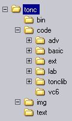

# Introduction

<!-- toc -->

## Organisation {#sec-org}

<!-- <div class="cpt_fr" style="width:120px;">
  

  **{*@fig:toncdirs}**: directories.
</div> -->

TONC consists of three components: a <dfn>text</dfn> section (the actual tutorial), an <dfn>examples</dfn> repo with all the source code & makefiles of the various demos, and a library called <dfn>libtonc</dfn> which holds all the useful/reusable code introduced throughout the tutorial.

Previously these were all distributed as zip files, but times have changed and now they exist in separate git repositories. They will now be explained in more detail:


### Tonc text {#ssec-org-text}

The text section, which you're reading now, covers the principles of GBA programming in detail. The focus here is not so much on how to get something done, but how things actually *work*, and why it's done the way it's done. After that the *how* often comes naturally. Every chapter has one of more demonstrations of the covered theory, and a brief discussion of the demo itself.

Please, do not make the mistake of only reading the demo discussion: to properly understand how things work you need to read the text in full. While there are optional parts, and whole pages of boring text that seem to have little to do with actual GBA coding, they are there for a reason, usually there's extra conceptual information or gotchas.

At first, the text part had only very little code in it, because I figured the demo code would be at hand and flicking between them would not be annoying. Well, I've realized that I figured wrong and am in the process of including more of the code into these pages; maybe not quite enough to copy-paste and get a clean compile, but enough to go with the explanations of the demos.

The main language will be C, and a smidgeon of assembly. These are the two main languages used in GBA programming even though there are others around. Since the basics of programming are independent of language, it should be possible to adapt them for your chosen language easily.

GBA programming is done close to the hardware, so I hope you know your pointers, [hexadecimal numbers](numbers.html#sec-num) and [boolean algebra/bit-operations](numbers.html#sec-bitops). There's also a fair amount of math here, mostly [vector and matrix](matrix.html) stuff so I hope your linear algebra is up to speed. Lastly, I am assuming your intellectual capacities exceed those of a random lab monkey, so I won't elaborate on what I consider trivial matters too much.

Aside from the introduction and appendices, the text is divided into 3 parts. First there's ‘basics’, which explains the absolute essentials for getting anything done. This includes setting up the development environment, basic use of graphics and buttons. It also contains text on what it means to do low level programming and programming efficiently; items that in my view you'd better learn sooner rather than later. The second part covers most of the other items of the GBA like special graphic effects, timers and interrupts. The final section covers more advanced items that uses elements from all chapters. This includes writing text (yes, that's an advanced topic on the GBA), mode 7 graphics and a chapter on ARM assembly.

The Markdown source for the text is all [available on GitHub](https://github.com/gbadev-org/tonc), so please feel free to contribute if you find a typo or something that can be improved.

<!--
TODO: maybe provide links to PDF and 'offline' html downloads?

Individual html: [tonc-text.zip](http://www.coranac.com/files/tonc-text.zip) (663 kb)  
Compiled html (CHM, v1.4 version): [tonc.chm](http://www.coranac.com/files/tonc.chm) (1.2 MB).  
PDF: [tonc.pdf](http://www.coranac.com/files/tonc.pdf) (3.1 MB)
-->

### Tonc code (libtonc & examples) {#ssec-org-code}

The source code to all the demos mentioned in the text can be found in the [libtonc-examples](https://github.com/gbadev-org/libtonc-examples) repository. Like the text, the examples themselves are divided into 3 parts: *basic*, *extended* and *advanced*. There is also a `lab` directory with a few interesting projects, but which might not be quite ready. Still interesting to look at, though.

The language we'll be using is **C** with a dash of assembly (but *not* C++). I am working under the assumption that you are familiar with this language. If not, go learn it first because I'm not going to show you; this is not a C course. I do have some links to C tutorials in the [references](refs.html#ssec-tut).

Unlike some older GBA tutorials, tonc uses **makefiles** instead of batch scripts to build the example projects, because they're just Plain Better™. How to use these will be explained in the next chapter, but if you just wanted to check out the pre-compiled example ROMs, those are still available here: [tonc-bin.zip](http://www.coranac.com/files/tonc-bin.zip).

The examples depend on [libtonc](https://github.com/gbadev-org/libtonc), a library containing all the important #defines and functions introduced throughout the tutorial. This also includes text writers for all video modes, BIOS routines, a pretty advanced interrupt dispatcher, safe and fast memory copy and fill routines and much more. Historically `libtonc` was included alongside the examples, but nowadays it comes with devkitARM, so you don't have to download it yourself.


### Statement of Purpose {#ssec-org-sop}

I wrote Tonc for two reasons. Firstly, as a way to organize my own thoughts. You often see things in a different light when you write things down and learn from that experience. Secondly, there is a lot of *very bad* information in other tutorials out there (the only exceptions I know of are the [new PERN](http://www.drunkencoders.com/web.archive.org/web/20030413142151fw_/http_/www.thepernproject.com/English/tutorial.html) and [Deku's sound tutorial](https://stuij.github.io/deku-sound-tutorial/). Yes, I am aware of how that sounds, but unfortunately it happens to be true. A number of examples:

-   Only very basic information given, sometimes even [incorrect info](affine.html).
-   Strong focus on bitmap modes, which are hardly ever used for serious GBA programming.
-   [Bad programming habits](first.html#ssec-notes-bad). Adding code/data to projects by [#including the files](bitmaps.html#ssec-data-hdr), Using ancient [toolchains](setup.html#sec-alt), non-optimal compiler settings and data-types, and inefficient (sometimes *very* inefficient) code.

If you are new and have followed the other tutorials, everything will seem to work fine, so what's the problem? Well, that's part of the problem actually. Everything will *seem* fine, until you start bigger projects, at which time you'll find hidden errors and that slow code really bogs things down and you'll have unlearn all the bad habits you picked up and redo everything from the start. The GBA is one of the few platforms where efficient coding still means something, and sometimes all it takes is a change of datatype or compiler switch. These things are better done right from the start.

I've tried to go for completeness first, simplicity second. As a certain wild-haired scientist once said: “Make things as simple as possible, but no simpler.” This means things can seem a little technical at times, but that's only because things *are* pretty technical at times, and there's no sense in pretending they're not.

In short, Tonc is *not* “GBA Programming for Dummies”, never was, never will be. There's far too much of stuff for Dummies already anyway. If you consider yourself a dummy (and I do mean dummy, not newbie), maybe Tonc isn't the right place. If you're serious about learning GBA programming, however, accept no substitute.

## Terminology and Notation {#sec-nota}

I'm a physicist by training which means that I know my math and its notational conventions. I use both quite often in Tonc, as well as a number of html-tag conventions. To make sure we're all on the same page here's a list:

<div class="lblock">
<table border=1 cellpadding=2 cellspacing=0>
<tr><th>Type	<th>notation	<th>example
<tr><td>bit n in a <code>foo</code>		<td><code>foo</code>{n}	
  <td><code>REG_DISPCNT{4}</code> (active page bit)
<tr><td>code	<td>&lt;code&gt; tag	<td> <code>sx</code>
<tr><td>command/file <td>&lt;tt&gt; tag <td> <tt>vid.h</tt>
<tr><td>matrix	<td>bold, uppercase		<td> <b>P</b>
<tr><td>memory  <td>hex + code			<td> <code>0400:002eh</code>
<tr><td>new term <td>bold, italic		<td> <dfn>charblock</dfn>
<tr><td>variable <td>italics			<td> <i>x</i>
<tr><td>vector	<td>bold, lowercase		<td> <b>v</b>
</table>
</div>

I also use some non-ASCII symbols that may not show up properly depending on how old your browser is. These are:

<div class="lblock">
<table border=1 cellpadding=2 cellspacing=0>
<tr><th>symbol<th>description
<tr><td>&alpha;, &beta;, &gamma;	<td>Greek letters
<tr><td>&asymp;		<td>approximately
<tr><td>&frac12;	<td>one half
<tr><td>&frac14;	<td>one quarter
<tr><td>&frac34;	<td>three quarters
<tr><td>&ge;		<td>greater or equal
<tr><td>&harr;		<td>double-sided arrow
<tr><td>&isin;		<td>is in (an interval)
<tr><td>&lang; &rang;		<td>&lsquo;bra&rsquo; &amp; &lsquo;ket&rsquo;
<tr><td>&rarr;		<td>right arrow
<tr><td>&sup2;		<td>superscript 2
<tr><td>&times;		<td>times
</table>
</div>

I also make liberal use of shorthand for primitive C types like `char` and `int` and such. These are typedefs that better indicate the size of the variable that's used. Since this is very important in console programming, they're quite common. Anyway, here's a list.

<div class="lblock">
<table border=1 cellpadding=2 cellspacing=0>
<tr><th>base type	<th>alt name <th>unsigned	<th>signed	<th>volatile
<tr><th>char		<td>byte	 <td>u8			<td>s8		<td>vu8 / vs8
<tr><th>short		<td>halfword <td>u16		<td>s16		<td>vu16 / vs16
<tr><th>int			<td>word	 <td>u32		<td>s32		<td>vu32 / vs32
</table>
</div>

Finally, there are a number of different notations for hex that I will switch between, depending on the situation. The C notation (‘0x’ prefix, 0x0400) is common for normal numbers, but I'll also use the assembly affix at times (‘h’, 0400:0000h). The colon here is merely for ease of reading. It's hard to tell the number of zeros without it.

### Register names and descriptions {#ssec-note-reg}

Getting the GBA to do things often involves the use of the so-called <dfn>IO registers</dfn>. Certain bits at certain addresses of memory can be used as switches for the various effects that the GBA is capable of. Each register is aliased as a normal variable, and you need to set/clear bits using bit operations. We'll get to where these registers are and what bit does what later; right now I want to show you how I will *present* these, and refer to them in the text.

Each register (or register-like address) is mapped to a dereferenced pointer, usually 16bits long. For example, the display status register is

```c
#define  REG_DISPSTAT *(u16*)0x04000004     
```

Every time I introduce a register I will give an overview of the bits like this:

<div class="reg">
<table class="reg"
  border=1 frame=void cellPadding=4 cellSpacing=0>
<caption class="reg">
  REG_DISPSTAT @ 0400:0004h
</caption>
<tr class="bits">
  <td>F E D C B A 9 8
  <td>7 6<td>5<td>4<td>3<td class="rof">2<td class="rof">1<td class="rof">0
<tr class="bf">
  <td class="rclr3">VcT
  <td>-
  <td class="rclr2">VcI
  <td class="rclr1">HbI
  <td class="rclr0">VbI
  <td class="rclr2">VcS
  <td class="rclr1">HbS
  <td class="rclr0">VbS
</table>
</div>

The table lists the register's name (`REG_DISPSTAT`, its address (0400:0000h) and the individual bits or bitfields. Sometimes, bits or entire registers are read- or write-only. **Read-only** is indicated with a red overbar (as used here). **Write-only** uses a blue underbar. After it will be a list that describes the various bits, and also gives the #define or #defines I use for that bit:

<div class="reg">
<table>
  <col class="bits" width=40>
  <col class="bf" width="8%">
  <col class="def" width="15%">
<tr align="left"><th>bits<th>name<th>define<th>description
<tbody valign="top">
<tr class="bg0">
  <td>0 <td class="rclr0">VbS
  <td>DSTAT_IN_VBL
  <td>VBlank status, read only. Will be set inside VBlank, clear in VDraw.
<tr class="bg1">
  <td colspan=4 align="center"><i>other fields</i>
<tr class="bg0">
  <td>8-F <td class="rclr3">VcT
  <td><i>DSTAT_VCT#</i>
  <td>VCount trigger value. If the current scanline is at this value, 
    bit 2 is set and an interrupt is fired if requested.
</tbody>
</table>
</div>

The full list of REG_DISPSTAT can be found [here](video.html#tbl-reg-dispstat). The #defines are usually specific to tonc, by the way. Each site and API has its own terminology here. This is possible because it's not the names that are important, but the numbers they stand for. That goes for the names of the registers themselves too, of course. One last point on the #defines: some of the ones listed have a hash (‘#’) affix. This is a shorthand notation to indicate that that field has *foo*`_SHIFT` and *foo*`_MASK` #defines, and a *foo*`()` macro. For example, the display register has an 8-bit trigger VCount field, which has ‘*DSTAT_VCT#*’ listed in the define column. This means that the following three things exist in the tonc headers:

```c
#define DSTAT_VCT_MASK      0xFF00
#define DSTAT_VCT_SHIFT          8
#define DSTAT_VCT(_n)       ((_n)<<DSTAT_VCT_SHIFT)
```

Lastly, as shorthand for a specific bit in a register, I will use accolades. The number will be a hexadecimal number. For example, REG_DISPCNT{0} is the VBlank status bit (VbS above), and REG_DISPCNT{8-F} would be the whole byte for the VCount trigger.


## On errors, suggestions {#sec-feedback}

As much as we (cearn and the gbadev.net community) have tried to weed out things like spelling/grammar errors and broken links, it's surely possible some have slipped by. If you find some, please raise an issue (or even better, make a pull request) on the [GitHub repo](https://github.com/gbadev-org/tonc). Of course, if things are unclear or _\*gasp\*_ incorrect, or if you have suggestions, we'd like to know that as well! You can also reach us on [Discord / IRC](https://gbadev.net/resources.html#community) or the [Forums](https://forum.gbadev.net/).


And, of course:

> This distribution is provided as is, without warranty of any kind. I cannot be held liable for any damage arising out of the use or inability to use this distribution. Code has been tested on emulator and real hardware as well as I could, but I can't guarantee 100% correctness.
> Both text and code may be modified at any time. Check in once in a while to see if anything's changed. <!--Time stamps are at the bottom of every page, and at the top of all source-files.--> There is also a [log](log.html) in the appendices.

OK that's it. Have fun.

<div style="margin-left:1.2cm;">

-- _Jasper Vijn_ (cearn at coranac dot com) and the _gbadev.net_ community<br>

<!--(Mar 24, 2013)-->
<!-- TODO: figure out how to put the build date here? -->
</div>
