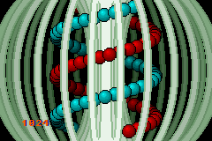
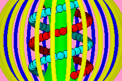
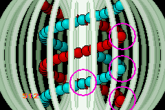

# 24. The Lab

<!-- toc -->

## Lab introduction {#sec-intro}

The Lab stands for “laboratory”, a place for me to toy with new stuff. If I have something new that may be useful, but isn't quite ready to be up anywhere else yet, I'll put it here for a while. It does mean it may get messy at times, but that's alright because that's what laboratories are for anyway. As a by-product, “lab” may double for “labyrinth”, but that's just a little bonus <kbd>:)</kbd>.

## Priority and drawing order {#sec-prio}

This section covers the last of the bits in the background and object control that I haven't discussed yet: <dfn>priority</dfn>. There are four priority levels, 0-3, and you can set the priority for backgrounds in [REG_BGxCNT](regbg.html#tbl-reg-bgxcnt) bits 0 and 1, and for objects in [attribute 2](regobj.html#tbl-oe-attr2), bits 10 and 11. The concept of priority is simple: higher priorities are rendered first, so they appear behind things with a lower priority. This will allow you to have objects behind backgrounds, for example.

This all sounds very simple, and it is, but there is a little more to the order of the rendering process than this. On the one hand you have the priority settings, on the other you have the obj and bg <dfn>numbers</dfn>. Objects are numbered 0 to 127, backgrounds from 0 to 3. Again, higher numbers appear behind lower numbers: in a stack of objects, obj 0 is on top; bg 0 covers the others, and objects are drawn in front of backgrounds. This is *not* due to the priority settings; in fact the whole point of priorities is so that the default order can be altered.

The above is true for objects and backgrounds of *the same* priority. You could argue that the final obj/bg order is composed of both the priority and the obj/bg number, where priority is the most significant part. So if, for example you have obj 1 and bg 2 at priority 0, and obj 0 and bg 1 at priority 1, the order would be obj1 (prio0), bg2 (prio0), obj0 (prio1), bg1 (prio1).

Well, *mostly* …

### The object-priority bug and object sorting {#ssec-prio-objsort}

For the most part, the order is as mentioned above, except for the parts where obj 0 and obj 1 overlap. Due to a, well I guess you can call it a design flaw, the notion of order = priority.number isn't quite true: if you have two objects in which the priorities and numbers are asymmetrical and there is a background in between, the object that's supposed to be below the background will shine through the background in the region where the two objects overlap. This sounds very complicated, but that's just because words can't really capture what happens. Basically, something like obj1+prio0, bg0+prio0, obj0+prio1 will cause a pretty nasty graphical artifact if the rectangles of these objects overlap. However, obj0+prio0, bg0+prio0, obj1+prio1 will work fine, because the object numbers are now in line with the priorities.

Which brings us to <dfn>object sorting</dfn>: the process of making sure the object that should be first will actually *be* first, i.e., have a lower obj number. This is actually a separate issue from priorities, but it's nice to do them both in one go. In principle, an object sort is a sort like any other: you have an array or list of things, in this case OBJ_ATTR's, and you have to put them into order via some sort of <dfn>key</dfn>, a value that indicates what the sorted order should be.

Now, the key can basically be anything. A lot of top-down or isometric games use Y-sorting, as higher Y-values means the object is more in the foreground. 3D and mode 7 games can use Z-sorting, of which Y-sorting is technically a special case.

You'll also need a sorting algorithm. There are plenty of them to choose from the [wiki on sorting algorithms](https://en.wikipedia.org/wiki/Sorting_algorithm). When picking an algorithm, remember that the number of items to sort here is maybe about a hundred tops, and that it's likely that the items don't change order all that often. Finally, you need a way to put the whole thing together; make it work with the sprite and OBJ_ATTR structs that you have.

For the moment, I've chosen primarily for *simplicity*, not speed. The sorter, `id_sort_shell()`, uses a slightly modified version of the [Shell sort](https://en.wikipedia.org/wiki/Shellsort) algorithm found in Numerical Recipes (ch 8, pp 321). Its parameters are an array of key values and the number of elements. However, it does not sort these directly (which would be fairly pointless as they're not tied to objects here), but keeps track of the sorting results in an index table, `ids[]`.

An <dfn>index table</dfn> is, well, a table of indices, obviously; it will provide the sorted order of the keys after the routine has finished. This strategy allows me to keep the object double buffer intact, which I like because it makes sprite management simpler. Also, I don't have to swap whole structs (although that's usually done by pointers anyway), and it makes the routine usable as a general sorter, not just for objects. The choice of bytes as the type for the index table does limit this, but that's just one of those space trade-offs one has to make sometimes. Changing it to use full integers isn't exactly hard, of course.

<div id="cd-oe-sort1">

```c
// sort routine (in IWRAM!) 

//! Sort indices via shell sort
/*! \param keys Array of sort keys
    \param ids Array of indices. After completion keys[ids[ii]]
      will be sorted in ascending order.
    \param number of entries.
*/
IWRAM_CODE void id_sort_shell(int keys[], u8 ids[], int count)
{
    u32 ii, inc;
    // find initial 'inc' in sequence x[i+1]= 3*x[i]+1 ; x[1]=1
    for(inc=1; inc<=count; inc++)
        inc *= 3;
    // actual sort
    do
    {
        // division is done by reciprocal multiplication. So no worries.
        inc /= 3;                   // for ARM compile
        // inc = (inc*0x5556)>>16); // for Thumb compile
        for(ii=inc; ii<count; ii++)
        {
            u32 jj, id0= ids[ii]; 
            int key0= keys[id0]
            for(jj=ii; jj>=inc && keys[ids[jj-inc]]>key0; jj -= inc)
                ids[jj]= ids[jj-inc];
            ids[jj]= id0;
        }
    } while(inc > 1);
}
```

</div>

<div id="cd-oe-sort2">

```c
// example of use
IWRAM_CODE void id_sort_shell(int keys[], u8 ids[], int count);

int sort_keys[SPR_COUNT];      // sort keys
u8 sort_ids[SPR_COUNT];        // sorted OAM indices

void foo()
{
    int ii;
    for(ii=0; ii<SPR_COUNT; ii++)
    {
        // setup sort keys  ... somehow
        sort_keys[ii]= ... ;
    }

    // sort the indices
    id_sort_shell(sort_keys, sort_ids, SPR_COUNT);

    // custom object update
    for(ii=0; ii<SPR_COUNT; ii++)
        oam_mem[ii]= obj_buffer[sort_ids[ii]];
}
```

</div>

Note that I intend the routine to be in IWRAM (and compiled as ARM code) because it's so **very f%#\$@\*g slow**! Or perhaps I shouldn't say slow, just costly.

Think of how a basic sort works. You have *N* elements to sort. In principle, each of these has to be checked with every other element, so that the routine's speed is proportional to *N*^2^, usually expressed as *O*(*N*^2^), where the *O* stands for order of magnitude. For sorting, *O*(*N*^2^) is bad. For example, when *N*=128, you would be looking at 16k checks. Times the number of cycles that the actual checks and updates would take. Not pleasant.

Fortunately, there are faster methods, you'd want at least an *O*(*N*·log~2~(*N*)) for sorting algorithms, and as you can see from the aforementioned wiki, there are plenty of those and shellsort is one of them. Unfortunately, even this can be quite expensive. Again, with *N*=128 this is still about 900, and you can be sure the multiplier can be high, as in 80+. With ARM+IWRAM, I can manage to bring that down to 20-30, and a simple exercise in assembly gives me an acceptable 13 to 22 × *N*·log~2~(*N*).

:::note The Big O Notation

The ‘Big O’ or order notation is a useful expression for comparing algorithms. The notation is *O*( f(*N*) ), where *N* is the number of elements to work on and f(*N*) a function, usually a combination of powers and logarithms. It shows how the runtime of an algorithm rises with increasing *N*. As lower order functions will eventually be overtaken by higher order ones, the former is generally preferable.

The keyword here, though, is ‘eventually’. It does not mention the scale of the algorithm, which varies from case to case. In some cases if *N* is low enough and the scales are different enough, a higher-order routine may actually outperform a lower-order one.

:::

Now, I'll be the first to admit that the current design isn't exactly optimal anyway. Using linked lists instead of an index table may work faster, and there are other things too (the division isn't a problem, as [it can be faked](fixed.html#sec-rmdiv)). However, then it wouldn't be quite as simple anymore, which is what I was going for here.

Once `id_sort_shell()` is finished, we have an table of indices arranged in such a way that `obj_buffer[sort_ids[ii]]` gives the sorted OAM entries, which is used to update to the real OAM.

### Caged DNA {#ssec-prio-demo}

The demo for this section is probably the coolest and most complicated one yet. It features a double helix of objects, revolving around the center of a toroidal cage (see {!@fig:prio-demo}). All four backgrounds are used here, one for text (little as there is of that), and three parts of the cage: one front end, which obscures the objects, one back end that lies behind everything else and the middle of the toroid around which the the object rotate, i.e., they pass both in front and behind it at different times. And then there are the objects that form the helix. The two strands each consist of 48 spherical 16x16 objects. The strands are distinguishable by their colors: one is red and the other cyan. These will turn to dark red and cyan as they pass behind the central plane. Priority settings are used to allow the objects to pass behind nearer backgrounds, and priorities *and* sorting make the object order smooth and avoid the previously mentioned obj-bg-obj bug. To summarize:

-   4 backgrounds with varying priority settings
-   96 objects revolving (in 3D) around a central pillar.
-   Object priorities and number sorting to ensure proper order.
-   Palette swapping to distinguish near from far objects.

You can see a schematic representation of the whole thing in {@fig:prio-demo}b; @tbl:prio-demo-x explains the colors.

<div class="cblock">
<table id="fig:prio-demo"
  border=0 cellpadding=2 cellspacing=0>
<tbody valign="top">
<tr>
<td>
  <div class="cpt_fr" style="width:240px;">
  <br>
  <b>{*@fig:prio-demo}a</b> (left): 
    Priority and sprite order demo.
  </div>
<td>
  <div class="cpt_fr" style="width:240px;">
  <br>
  <b>{*@fig:prio-demo}b</b>: 
    schematic of {!@fig:prio-demo}a.
  </div>
</tbody>
</table>

<table id="tbl:prio-demo-x" class="table-data">
<caption align="bottom">
  <b>*@tbl:prio-demo-x</b>: legend for 
  {!@fig:prio-demo}b.
</caption>
<tr>
  <th>color	<th>description		<th>obj/bg	<th>prio
<tr>
  <th>yellow <td>cage near	<td>bg1	<td>prio0
<tr>
  <th>green	<td>cage center	<td>bg2	<td>prio1
<tr>
  <th>blue	<td>cage far	<td>bg3	<td>prio2
<tr>
  <th>red	<td>strand 1	<td>obj_buffer[00..47]	<td>var
<tr>
  <th>cyan	<td>strand 2	<td>obj_buffer[48..95]	<td>var
<tr>
  <th>lt red/cyan	<td>near orbs	<td>OAM[0..47]	<td>prio 1
<tr>
  <th>dark red/cyan	<td>far orbs	<td>OAM[48..95]	<td>prio 2
</table>
</div>

#### Sprites and the helix pattern

As you can imagine, the sprite part is the trickiest thing about this demo. The helix is inherently a three dimensional path, so we need a 3D vector for each orb's position, with the coordinates being fixed-point numbers, of course. It also needs an index to the OAM shadow, linking a sprite (the orb) to the right OBJ_ATTR (the object on screen).

```c
typedef struct tagSPR_BASE
{
    VECTOR pos; // position (x, y, z)
    int id;     // oe-id in OAM buffer
} SPR_BASE;

#define SPR_COUNT 96

SPR_BASE sprites[SPR_COUNT];    // Sprite list
```

<div class="cpt_fr" style="width:144px;">
<br>
<b>*@fig:helix</b>: 3 periods of a helix.
</div>

A helix is simply a circle parameterization extruded in the direction of its normal axis (see @fig:helix). Note the directions of the three principal axes: it is a right-handed system, with *x* and *y* following the directions of the screens axes, and *z* pointing into the screen. A helix rotating around the *y*-axis can be described by the following relation:

<!--
\textbf{x}(y,t)=\begin{bmatrix}
A \cdot \cos(k\cdot y+\omega t) \\
y \\
A \cdot \sin(k\cdot y+\omega t)
\end{bmatrix}
-->
<table id="eq:helix">
<tr>
  <td class="eqnrcell">(!@eq:helix)
  <td class="eqcell">
<math xmlns="http://www.w3.org/1998/Math/MathML" display="block">
  <mstyle displaystyle="true" scriptlevel="0">
    <mrow data-mjx-texclass="ORD">
      <mtable rowspacing=".5em" columnspacing="1em" displaystyle="true">
        <mtr>
          <mtd>
            <mtext mathvariant="bold">x</mtext>
            <mo stretchy="false">(</mo>
            <mi>y</mi>
            <mo>,</mo>
            <mi>t</mi>
            <mo stretchy="false">)</mo>
            <mo>=</mo>
            <mrow data-mjx-texclass="INNER">
              <mo data-mjx-texclass="OPEN">[</mo>
              <mtable columnspacing="1em" rowspacing="4pt">
                <mtr>
                  <mtd>
                    <mi>A</mi>
                    <mo>&#x22C5;</mo>
                    <mi>cos</mi>
                    <mo data-mjx-texclass="NONE">&#x2061;</mo>
                    <mrow>
                      <mo data-mjx-texclass="OPEN">(</mo>
                      <mi>k</mi>
                      <mo>&#x22C5;</mo>
                      <mi>y</mi>
                      <mo>+</mo>
                      <mi>&#x3C9;</mi>
                      <mi>t</mi>
                      <mo data-mjx-texclass="CLOSE">)</mo>
                    </mrow>
                  </mtd>
                </mtr>
                <mtr>
                  <mtd>
                    <mi>y</mi>
                  </mtd>
                </mtr>
                <mtr>
                  <mtd>
                    <mi>A</mi>
                    <mo>&#x22C5;</mo>
                    <mi>sin</mi>
                    <mo data-mjx-texclass="NONE">&#x2061;</mo>
                    <mrow>
                      <mo data-mjx-texclass="OPEN">(</mo>
                      <mi>k</mi>
                      <mo>&#x22C5;</mo>
                      <mi>y</mi>
                      <mo>+</mo>
                      <mi>&#x3C9;</mi>
                      <mi>t</mi>
                      <mo data-mjx-texclass="CLOSE">)</mo>
                    </mrow>
                  </mtd>
                </mtr>
              </mtable>
              <mo data-mjx-texclass="CLOSE">]</mo>
            </mrow>
          </mtd>
        </mtr>
      </mtable>
    </mrow>
  </mstyle>
</math>
  </td>
</tr>
</table>

*A* is the radius of the helix, *k* is the wave number (*k*=2π/λ) and ω the angular velocity (ω=2π/*T*). The wave number defines the spacing between the layers of the helix (i.e., the pitch), the angular velocity gives the speed of rotation. Note that to create the helix in @fig:helix I actually need a negative wave number, but that's not really important right now.

In the actual code I'm going to make a slight change to the formula above to make ω variable without upsetting the whole helix. Instead of simply ω*t*, I'll use the integration of it for the initial phase angle: φ<sub>0</sub>=∫ω(*t*)d*t*. φ<sub>0</sub> will be a parameter to the function that creates the helix, and managed elsewhere. Another parameter for the pattern is **p**<sub>0</sub>, the reference point of the helix. You gotta have one of those.

```c
// some constants
const VECTOR P_ORG= { 112<<8, 0<<8, 0<<8 };
#define AMP     0x3800  // amplitude (.8)
#define WAVEN  -0x002C  // wave number (.12)
#define OMEGA0  0x0200  // angular velocity (.8)

//   phi0(t) = INT(w(t'), t', 0, t)
//   (x,y,z) = ( x0+A*cos(k*y+ft), y0+y, z0+A*sin(k*y+phi0) )
void spr_helix(const VECTOR *p0, int phi0)
{
    int ii, phi;
    VECTOR dp= {0, 0, 0};
    SPR_BASE *sprL= sprites, *sprR= &sprites[SPR_COUNT/2];

    for(ii=0; ii<SPR_COUNT/2; ii++)
    {
        // phi: 0.9f ; dp: 0.8f ; WAVEN:0.12f ; phi0: 0.8f
        phi= (WAVEN*dp.y>>11) + (phi0>>7);

        // red helix
        dp.x=  AMP*lut_cos(phi)>>8;
        dp.z=  AMP*lut_sin(phi)>>8;
        vec_add(&sprL[ii].pos, p0, &dp);

        // cyan helix
        dp.x= -dp.x;
        dp.z= -dp.z;
        vec_add(&sprR[ii].pos, p0, &dp);

        dp.y += 144*256/(SPR_COUNT/2);
    }
}
```

The routine is fairly straightforward. A running counter for the *y* is kept in the form of `dp.y`, which is used to calculate the full phase, from which we get our sines and cosines. Since the red and cyan helices are in counter-phase, I can simply get the *x* and *z* offsets for one by switching the signs of the other. The only really tricky part is managing the different fixed point scales for the phase; when dealing with fixed point math, always indicate the number of fractional bits, it's so very easy to get lost there.


Now that we have the double helix pattern, we need a way to link it to the objects, complete with sorting and all.

```c
void spr_update()
{
    int ii, prio, zz, *key;
    u32 attr2;
    int *key= sort_keys;
    SPR_BASE *spr= sprites;
    OBJ_ATTR *oe;

    for(ii=0; ii<SPR_COUNT; ii++)
    {
        oe= &obj_buffer[spr->id];
        // set x/y pos
        obj_set_pos(oe, spr->pos.x>>8, spr->pos.y>>8);

        // set priority based on depth.
        // HAX 1: palette swapping
        attr2= oe->attr2 & ~(ATTR2_PRIO_MASK | (1<<ATTR2_PALBANK_SHIFT));
        zz= spr->pos.z;
        if(zz>0)
        {
            prio= 2;
            attr2 |= 1<<ATTR2_PALBANK_SHIFT;
        }
        else
            prio= 1;
        oe->attr2= attr2 | (prio<<ATTR2_PRIO_SHIFT);

        // HAX 2: sort-key contruction
        *key++= (prio<<30) + (zz>>2) - 6<<28;
        spr++;
    }

    if(g_state & S_SORT) // sort and update
    {
        id_sort_shell(sort_keys, sort_ids, SPR_COUNT);
        for(ii=0; ii<SPR_COUNT; ii++)
            oam_mem[ii]= obj_buffer[sort_ids[ii]];
    }
    else                 // regular update
        oam_update(0, SPR_COUNT);
}
```

The big loop here updates the OAM shadow, *not the real OAM*! It updates the object's position using the sprites *x* and *y* (corrected for fixed point, of course), and uses *z* to set the priority: 1 if it's on the near side (before the central pillar), and 2 if it's on the far side (behind the pillar). It *also* does something funky with the palette, which is the first hack in the function, shortly followed by the second one.

<div class="cpt_fr"  style="width:120px;">
<table id="tbl:prio-hack1" class="table-data">
<caption align="bottom">
  <b>*@tbl:prio-hack1</b>: object palette banks.
</caption>
<tr><th>bank	<th>color
<tr><td>4		<td>light red
<tr><td>5		<td> dark red
<tr><td>6		<td>light cyan
<tr><td>7		<td> dark cyan
</table>
</div>

**Hack 1**. I've arranged the object palette in such a way that the reds are in palette banks 4 and 5, and the cyans in banks 6 and 7 (@tbl:prio-hack1). This means that I can switch between the light and dark versions by toggling the first pal-bank bit, attr2 bit 12.

Immediately after this is the second hack, creating the sort key.

**Hack 2**. The sort key is a combination of the priority (2 bits) and the depth *z* (the rest). The lower 30 bits of `zz` work as a **signed** offset for the priority levels, so that each priority has its own depth range of \[-2\<\<30,2\<\<30⟩ if one is necessary. The problem is that the keys are also signed, which would mean that priorities 2 and 3 would count as negative and therefore be sorted in front of prio 0 and 1, which would be bad. To remedy this, I subtract 0x60000000, which shifts the range of priority 0 to the most negative range where it should be.

The last part of the function updates the OAM shadow to OAM, either with or without sorting.

:::note Sorting disabled objects

Incidentally, you could easily modify the sort-key creation to account for disabled/hidden objects. All you'd have to do is assign the highest (signed) value to the sort-key, in this case 0x7FFFFFFF.

```c
if( (oe->attr0&ATTR0_MODE_MASK) != ATTR0_HIDE )
    *key++= (prio<<30) + (zz>>2) - 6<<28; 
else
    *key++= 0x7FFFFFFF;
```

:::

#### Rest of code

The rest of the code is just `main()` and the initializer code. Most of the initializer code is pretty standard stuff: loading graphics, register inits and so on. The only interesting part is the object initialization, which sets the pal-banks to 0x4000 and 0x6000 for the red and cyan orbs. And because the sorting uses an index table instead of changing the object buffer itself, this is all I'll ever have to keep the primary colors correct.

```c
#define S_AUTO  0x0001
#define S_SORT  0x0002

const VECTOR P_ORG= { 112<<8, 0<<8, 0<<8 };

int g_phi= 0;                   // phase, integration of omega over time
int g_omega= OMEGA0;            // rotation velocity (.8)
u32 g_state= S_AUTO | S_SORT;   // state switches


void main_init()
{
    int ii;
    // --- init gfx ---
    // bgs
    memcpy32(pal_bg_mem, cagePal, cagePalLen/4);
    pal_bg_mem[0]= CLR_BLACK;
    memcpy32(tile_mem[1], cageTiles, cageTilesLen/4);
    // Hacx 3: there are 3 maps in cageMap, which have to be extracted manually
    // front part, priority 0
    memcpy32(se_mem[5], &cageMap[ 1*32], 20*32/2);
    REG_BG1CNT= BG_CBB(1) | BG_SBB(5) | BG_8BPP | BG_PRIO(0);
    // center, priority 1
    memcpy32(se_mem[6], &cageMap[22*32], 20*32/2);
    REG_BG2CNT= BG_CBB(1) | BG_SBB(6) | BG_8BPP | BG_PRIO(1);
    // back, priority 2
    memcpy32(se_mem[7], &cageMap[43*32], 20*32/2);
    REG_BG3CNT= BG_CBB(1) | BG_SBB(7) | BG_8BPP | BG_PRIO(2);

    // object
    memcpy32(&tile_mem[4][1], ballTiles, ballTilesLen/4);
    memcpy32(pal_obj_mem, ballPal, ballPalLen/4);

    // -- init vars ---
    // init sort list
    for(ii=0; ii<SPR_COUNT; ii++)
        sprites[ii].id= sort_ids[ii]= ii;

    // --- init sprites and objects ---
    oam_init();
    for(ii=0; ii<SPR_COUNT/2; ii++)
    {
        obj_set_attr(&obj_buffer[ii], 0, ATTR1_SIZE_16, 0x4001);
        obj_set_attr(&obj_buffer[ii+SPR_COUNT/2], 0, 
            ATTR1_SIZE_16, 0x6001);
    }

    spr_helix(&P_ORG, 0);
    spr_update();

    REG_DISPCNT= DCNT_BG_MASK | DCNT_OBJ | DCNT_OBJ_1D;
    int_init();
    int_enable_ex(II_VBLANK, NULL);
    txt_init_std();
    txt_init_se(0, BG_CBB(3)|BG_SBB(31), 0, 0xEC00021F, 0xEE);
}

int main()
{
    char str[32];

    main_init();

    while(1)
    {
        VBlankIntrWait();
        // kery handling
        key_poll();
        if(key_hit(KEY_START))
            g_state ^= S_AUTO;
        if(key_hit(KEY_SELECT))
            g_state ^= S_SORT;

        // movement
        if(g_state & S_AUTO)
        {
            g_omega += key_tri_shoulder()<<4;
            g_phi += g_omega;
        }
        else
            g_phi += g_omega*key_tri_shoulder();

        // sprite/obj update
        spr_helix(&P_ORG, g_phi);
        spr_update();

        // print omega
        siprintf(str, "%6d", g_omega);
        se_puts(8, 136, str, 0);
    }

    return 0;
}
```

<div class="cpt_fr" style="width:240px;">
<br>
<b>*@fig:prio-demo2</b>: Sorting switched off.
</div>

The main loop checks for state changes, advances and updates the sprites and objects and prints the current angular velocity.

There are two state switches in `g_state`, one that toggles the sorting procedure (`S_SORT`, with the **Select** Button), and one that sets the rotation to automatic or not (`S_AUTO`, with the **Start** Button). Toggling the sorting is interesting because you can see what happens if you just set the priorities. This has two effects (see @fig:prio-demo2: first, the orb-order in each strand would be fixed and every object would partially obscure the one on its left, which is incorrect for the receding parts of the strands. This is most visible at the right-most side, where the strands seem broken. The second effect is the object priority/number order bug where the deeper object can show through the background that's supposed to be occluding it.

The start button toggles between automatic and manual rotation. During automatic mode, you can change ω with the **L** and **R** Buttons. In manual mode, L and R update the phase with the current angular speed. By setting the speed really low, you can examine what happens in more detail. For example, you can clearly see that the objects in the vertical centerline are in front of both their left and right neighbors, exactly what one would expect. Unless the sorting is off, that is.

And that concludes the topic of priorities and object sorting. Remember that the priorities of objects and backgrounds aren't the only thing that determine the rendering order, the obj or bg number is also important for each priority level. Once you start mixing objects and background priorities, make sure that the object numbers follow the same order as their priorities, and that often means object sorting.

I've discussed a simple and flexible sorting method, but I warn you that it does take its time. If it's good enough, by all means use it. If it's not, faster methods can certainly be created. Linked lists, range checks, handcrafted assembly (see *id_sort_shell2.s* in the *prio_demo* directory for example) can all help make it faster. but the final implementation will be up to you.
