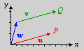
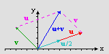
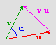
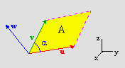
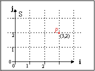
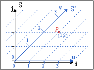

# C. Vectors and Matrices {#ch-}

<!-- toc -->

## Vectors {#sec-vec}

Before I go into what a vector is, I'll first tell you what it isn't. Generally, you divided physical quantities into <dfn>scalars</dfn> and <dfn>vectors</dfn>. A <dfn>scalar</dfn> gives the magnitude of a quantity. It's a single number, like the ones you use every day. Mass, energy and volume are examples of scalars. A <dfn>vector</dfn> is something with both a magnitude _and_ direction, and is usually represented by multiple numbers: one for every dimension. Position, momentum and force are prime examples. Also, note that velocity is a vector, while speed is not. 50 kph is not a vector. 50 kph down Highway 60 is. The notation of a vector is as a bold character, usually lowercase, and either as a set of numbers enclosed by parentheses, **u** = (1, 4, 9), or as an M×1 column. And yes, I do mean a column, not a row; we'll see why when we get to matrices.

<table id="eq:vec-def">
  <tr>
    <td class="eqnrcell">({!@eq:vec-def})</td>
    <td>
      <math xmlns="http://www.w3.org/1998/Math/MathML" display="block">
        <mstyle displaystyle="true" scriptlevel="0">
          <mrow data-mjx-texclass="ORD">
            <mtable rowspacing=".5em" columnspacing="1em" displaystyle="true">
              <mtr>
                <mtd>
                  <mtext mathvariant="bold">u</mtext>
                  <mo>&#x2261;</mo>
                  <mrow data-mjx-texclass="INNER">
                    <mo data-mjx-texclass="OPEN">[</mo>
                    <mtable columnspacing="1em" rowspacing="4pt">
                      <mtr>
                        <mtd>
                          <msub>
                            <mi>u</mi>
                            <mn>1</mn>
                          </msub>
                        </mtd>
                      </mtr>
                      <mtr>
                        <mtd>
                          <mo>:</mo>
                        </mtd>
                      </mtr>
                      <mtr>
                        <mtd>
                          <msub>
                            <mi>u</mi>
                            <mi>m</mi>
                          </msub>
                        </mtd>
                      </mtr>
                    </mtable>
                    <mo data-mjx-texclass="CLOSE">]</mo>
                  </mrow>
                  <mo>&#x2261;</mo>
                  <mo stretchy="false">(</mo>
                  <msub>
                    <mi>u</mi>
                    <mn>1</mn>
                  </msub>
                  <mo>,</mo>
                  <mo>&#x22EF;</mo>
                  <mo>,</mo>
                  <msub>
                    <mi>u</mi>
                    <mi>m</mi>
                  </msub>
                  <mo stretchy="false">)</mo>
                  <mo>&#x2262;</mo>
                  <mrow data-mjx-texclass="INNER">
                    <mo data-mjx-texclass="OPEN">[</mo>
                    <mtable columnspacing="1em" rowspacing="4pt">
                      <mtr>
                        <mtd>
                          <msub>
                            <mi>u</mi>
                            <mn>1</mn>
                          </msub>
                        </mtd>
                        <mtd>
                          <mo>&#x22EF;</mo>
                        </mtd>
                        <mtd>
                          <msub>
                            <mi>u</mi>
                            <mi>m</mi>
                          </msub>
                        </mtd>
                      </mtr>
                    </mtable>
                    <mo data-mjx-texclass="CLOSE">]</mo>
                  </mrow>
                </mtd>
              </mtr>
            </mtable>
          </mrow>
        </mstyle>
      </math>
    </td>
  </tr>
</table>

<div class="cpt_fr" style="width:128px">
  <br>
  <b>{*@fig:img-vec}</b>: the difference between
  vectors and points.
</div>

If you have a coordinate system, vectors are usually used to represent a spatial point in that system, with vectors' elements as the coordinates. However, there is a crucial difference between points and vectors. Points are always related to an origin, while vectors can are independent of any origin. {*@fig:img-vec} on the right illustrates this. You have points *P* and *Q*, and vectors **u, v, w**. Vectors **u** and **v** are equal (they have equal lengths and directions). However, while **u** and the point it points to (*P*) have the same coordinates, this isn't true for **v** and *Q*. In fact, *Q* = **u** + **w**. And, to be even more precise, *Q* = *O\* + **u** + **w**, which explicitly states the origin (_O_) in the equation.

## Vector operations {#sec-vec-ops}

Vector operations are similar to scalar operations, but the multi-dimensionality does add some complications, especially in the case of multiplications. Note that there are no less than _three_ ways of vector-multiplication, so pay attention. On the right you can see examples of vector addition and scalar-vector multiplication. **u**= (8, 3), **v**= (-4 ,4). With the definitions of the operations given below, you should be able to find the other vectors.

### Vector-vector addition and subtraction {#ssec-vec-add}

<div class="cpt_fr" style="width:160px">
  
  <br>
  <b>{*@fig:img-vec-ops}</b>: vector addition and scalar-vector multiplication.
</div>

When it comes to addition and subtraction, both operands must be M-dimensional vectors. The result is another vector, also M-dimensional, which elements are the sum or difference of the operands' elements: with **w = u + v** we have _w_<sub>i</sub> = _u_<sub>i</sub> + _v_<sub>i</sub>.

<table id="eq:vec-add">
  <tr>
    <td class="eqnrcell">({!@eq:vec-add})</td>
    <td class="eqcell">
      <math xmlns="http://www.w3.org/1998/Math/MathML" display="block">
        <mstyle displaystyle="true" scriptlevel="0">
          <mrow data-mjx-texclass="ORD">
            <mtable rowspacing=".5em" columnspacing="1em" displaystyle="true">
              <mtr>
                <mtd>
                  <mtext mathvariant="bold">w</mtext>
                  <mo>=</mo>
                  <mtext mathvariant="bold">u + v</mtext>
                  <mo>&#x2261;</mo>
                  <mrow data-mjx-texclass="INNER">
                    <mo data-mjx-texclass="OPEN">[</mo>
                    <mtable columnspacing="1em" rowspacing="4pt">
                      <mtr>
                        <mtd>
                          <msub>
                            <mi>u</mi>
                            <mn>1</mn>
                          </msub>
                          <mo>+</mo>
                          <msub>
                            <mi>v</mi>
                            <mn>1</mn>
                          </msub>
                        </mtd>
                      </mtr>
                      <mtr>
                        <mtd>
                          <mo>:</mo>
                        </mtd>
                      </mtr>
                      <mtr>
                        <mtd>
                          <msub>
                            <mi>u</mi>
                            <mi>m</mi>
                          </msub>
                          <mo>+</mo>
                          <msub>
                            <mi>v</mi>
                            <mi>m</mi>
                          </msub>
                        </mtd>
                      </mtr>
                    </mtable>
                    <mo data-mjx-texclass="CLOSE">]</mo>
                  </mrow>
                </mtd>
              </mtr>
            </mtable>
          </mrow>
        </mstyle>
      </math>
    </td>
</table>

### Scalar-vector multiplication {#ssec-vec-scale}

This is the first of the vector multiplications. If you have a scalar _a_ and a vector **u**, the elements of resultant vector after scalar-vector multiplication are the original elements, each multiplied with the scalar. So if **v** = _c_&nbsp;**u**, then _v_<sub>i</sub>= _c\*u_<sub>i</sub>. Note that **u** and **v** lie on the same line – only the length is different. Also, note that subtraction can also be written as **w** = **u** − **v** = **u** + (−1)\***v**.

<table id="eq:vec-scale">
  <tr>
    <td class="eqnrcell">({!@eq:vec-scale})</td>
    <td class="eqcell"> 
      <math xmlns="http://www.w3.org/1998/Math/MathML" display="block">
        <mstyle displaystyle="true" scriptlevel="0">
          <mrow data-mjx-texclass="ORD">
            <mtable rowspacing=".5em" columnspacing="1em" displaystyle="true">
              <mtr>
                <mtd>
                  <mtext mathvariant="bold">v</mtext>
                  <mo>=</mo>
                  <mi>c</mi>
                  <mtext mathvariant="bold">u</mtext>
                  <mo>&#x2261;</mo>
                  <mrow data-mjx-texclass="INNER">
                    <mo data-mjx-texclass="OPEN">[</mo>
                    <mtable columnspacing="1em" rowspacing="4pt">
                      <mtr>
                        <mtd>
                          <mi>c</mi>
                          <mo>&#x22C5;</mo>
                          <msub>
                            <mi>u</mi>
                            <mn>1</mn>
                          </msub>
                        </mtd>
                      </mtr>
                      <mtr>
                        <mtd>
                          <mo>:</mo>
                        </mtd>
                      </mtr>
                      <mtr>
                        <mtd>
                          <mi>c</mi>
                          <mo>&#x22C5;</mo>
                          <msub>
                            <mi>u</mi>
                            <mi>m</mi>
                          </msub>
                        </mtd>
                      </mtr>
                    </mtable>
                    <mo data-mjx-texclass="CLOSE">]</mo>
                  </mrow>
                </mtd>
              </mtr>
            </mtable>
          </mrow>
        </mstyle>
      </math>
    </td>
  </tr>
</table>

### The dot-product (aka scalar product) {#ssec-vec-dot}

The second vector-multiplication is the dot-product, which has two vectors as input, but a _scalar_ as its output. The notation for this is _c_ = **u · v**, where **u** and **v** are vectors and _c_ is the resultant scalar. Note the operator is in the form of a dot, which gives this type of multiplication its name. To do the dot-product, multiply the elements of both vectors piecewise and add them all together. In other words:

<table id="eq:vec-dot">
  <tr>
    <td class="eqnrcell">({!@eq:vec-dot})</td>
    <td class="eqcell">
      <math xmlns="http://www.w3.org/1998/Math/MathML" display="block">
        <mstyle displaystyle="true" scriptlevel="0">
          <mrow data-mjx-texclass="ORD">
            <mtable rowspacing=".5em" columnspacing="1em" displaystyle="true">
              <mtr>
                <mtd>
                  <mi>c</mi>
                  <mo>=</mo>
                  <mtext mathvariant="bold">u</mtext>
                  <mo>&#x22C5;</mo>
                  <mtext mathvariant="bold">v</mtext>
                  <mo>=</mo>
                  <munderover>
                    <mo data-mjx-texclass="OP">&#x2211;</mo>
                    <mrow data-mjx-texclass="ORD"></mrow>
                    <mrow data-mjx-texclass="ORD"></mrow>
                  </munderover>
                  <msub>
                    <mi>u</mi>
                    <mi>i</mi>
                  </msub>
                  <mo>&#x22C5;</mo>
                  <msub>
                    <mi>v</mi>
                    <mi>i</mi>
                  </msub>
                  <mo>=</mo>
                  <msub>
                    <mi>u</mi>
                    <mn>1</mn>
                  </msub>
                  <mo>&#x22C5;</mo>
                  <msub>
                    <mi>v</mi>
                    <mn>1</mn>
                  </msub>
                  <mo>+</mo>
                  <mo>&#x22EF;</mo>
                  <mo>+</mo>
                  <msub>
                    <mi>u</mi>
                    <mi>m</mi>
                  </msub>
                  <mo>&#x22C5;</mo>
                  <msub>
                    <mi>v</mi>
                    <mi>m</mi>
                  </msub>
                </mtd>
              </mtr>
            </mtable>
          </mrow>
        </mstyle>
      </math>
    </td>
  </tr>
</table>

Now, this may seem like a silly operation to have, but it's actually very useful. For one thing, the length of the vector is calculated via a dot-product with itself. But you can also find the projection of one vector onto another with the dot-product, which is invaluable when you try to decompose vectors in terms of other vectors or determine the base-vectors of an M-dimensional space (do what to the whaaat?!? Don't worry, I'll explain later). One of the most common uses of the dot-product is finding the angle between two vectors. If you have vectors **u** and **v**, \|**u**\| and \|**v**\| their lengths and α the angle between the two, the cosine can be found via

<div class="cpt_fr" style="width:112px">
  
  <br>
  <b>{*@fig:img-vec-dot}</b>: dot product.
</div>

<table id="eq:vec-cos">
  <tr>
    <td class="eqnrcell">({!@eq:vec-cos})</td>
    <td class="eqcell"> 
      <math xmlns="http://www.w3.org/1998/Math/MathML" display="block">
        <mstyle displaystyle="true" scriptlevel="0">
          <mrow data-mjx-texclass="ORD">
            <mtable rowspacing=".5em" columnspacing="1em" displaystyle="true">
              <mtr>
                <mtd>
                  <mi>cos</mi>
                  <mo data-mjx-texclass="NONE">&#x2061;</mo>
                  <mrow>
                    <mo data-mjx-texclass="OPEN">(</mo>
                    <mi>&#x3B1;</mi>
                    <mo data-mjx-texclass="CLOSE">)</mo>
                  </mrow>
                  <mo>=</mo>
                  <mfrac>
                    <mrow>
                      <mtext mathvariant="bold">u</mtext>
                      <mo>&#x22C5;</mo>
                      <mtext mathvariant="bold">v</mtext>
                    </mrow>
                    <mrow>
                      <mtext mathvariant="bold">|u|</mtext>
                      <mtext>&#xA0;</mtext>
                      <mtext mathvariant="bold">|v|</mtext>
                    </mrow>
                  </mfrac>
                </mtd>
              </mtr>
            </mtable>
          </mrow>
        </mstyle>
      </math>
    </td>
  </tr>
</table>

Why does this work? Well, you can prove it in a number of ways, but here's is the most elegant (thanks Ash for reminding me). Remember that the square of the length of a vector is given by the dot-product with itself. This means that \|**v−u**\|<sup>2</sup> = \|**v**\|<sup>2</sup> + \|**u**\|<sup>2</sup> − 2·**u·v**. From the cosine rule for the triangle in {@fig:img-vec-dot}, we also have \|**v−u**\|<sup>2</sup> = \|**v**\|<sup>2</sup> + \|**u**\|<sup>2</sup> − 2·\|**v**\|·\|**u**\| cos(α). Combined, these relations immediately result in {@eq:vec-cos}. And people say math is hard.

By the way, not only can you find the angle with this, but it also provides a very simply way to see if something's behind you or not. If **u** is the looking-direction and **v** the vector to an object, **u · v** is negative if the angle is more than 90°. It's also useful for field-of-view checking, and to see if vectors are perpendicular, as **u · v** = 0. You also find the dot-product by the truck-load in physics when yo do things like force decomposition, and path-integrals over force to find the potential energy. Basically, every time you find a cosine in an equation in physics, it's probably the result of a dot-product.

### The cross-product (aka vector-product) {#ssec-vec-cross}

The cross product is a special kind of product that only works in 3D space. The cross-product takes two vectors **u** and **v** and gives the vector perpendicular to both, **w**, as a result. The length of **w** is the area spanned by the two operand vectors. The notation for it is this: **w** = **u** × **v**, which is why it's called the cross-product. The elements of **w** are _w_<sub>i</sub>= _ε_<sub>ijk</sub>·_u_<sub>j</sub>· _v_<sub>k</sub>, where _ε_<sub>ijk</sub> is the Levi-Cevita symbol ( +1 for even permutations of _i,j,k_, −1 for odd permutations, and 0 if any of the indices are equal). Since you've probably never even seen this thing (for your sanity, keep it that way), it's written down in full in {@eq:vec-dot}.

<div class="cpt_fr" style="width:176px">
  
  <br>
  <b>{*@fig:img-vec-cross}</b>: cross product.
</div>

<table id="eq:vec-cross">
  <tr>
    <td class="eqnrcell">({!@eq:vec-cross})</td>
    <td class="eqcell">
      <math xmlns="http://www.w3.org/1998/Math/MathML" display="block">
        <mstyle displaystyle="true" scriptlevel="0">
          <mrow data-mjx-texclass="ORD">
            <mtable rowspacing=".5em" columnspacing="1em" displaystyle="true">
              <mtr>
                <mtd>
                  <mtext mathvariant="bold">w</mtext>
                  <mo>=</mo>
                  <mtext mathvariant="bold">u</mtext>
                  <mtext>&#xA0;</mtext>
                  <mo>&#xD7;</mo>
                  <mtext>&#xA0;</mtext>
                  <mtext mathvariant="bold">v</mtext>
                  <mo>&#x2261;</mo>
                  <mrow data-mjx-texclass="INNER">
                    <mo data-mjx-texclass="OPEN">[</mo>
                    <mtable columnspacing="1em" rowspacing="4pt">
                      <mtr>
                        <mtd>
                          <msub>
                            <mi>u</mi>
                            <mi>y</mi>
                          </msub>
                          <msub>
                            <mi>v</mi>
                            <mi>z</mi>
                          </msub>
                          <mo>&#x2212;</mo>
                          <msub>
                            <mi>u</mi>
                            <mi>z</mi>
                          </msub>
                          <msub>
                            <mi>v</mi>
                            <mi>y</mi>
                          </msub>
                        </mtd>
                      </mtr>
                      <mtr>
                        <mtd>
                          <msub>
                            <mi>u</mi>
                            <mi>z</mi>
                          </msub>
                          <msub>
                            <mi>v</mi>
                            <mi>x</mi>
                          </msub>
                          <mo>&#x2212;</mo>
                          <msub>
                            <mi>u</mi>
                            <mi>x</mi>
                          </msub>
                          <msub>
                            <mi>v</mi>
                            <mi>z</mi>
                          </msub>
                        </mtd>
                      </mtr>
                      <mtr>
                        <mtd>
                          <msub>
                            <mi>u</mi>
                            <mi>x</mi>
                          </msub>
                          <msub>
                            <mi>v</mi>
                            <mi>y</mi>
                          </msub>
                          <mo>&#x2212;</mo>
                          <msub>
                            <mi>u</mi>
                            <mi>y</mi>
                          </msub>
                          <msub>
                            <mi>v</mi>
                            <mi>x</mi>
                          </msub>
                        </mtd>
                      </mtr>
                    </mtable>
                    <mo data-mjx-texclass="CLOSE">]</mo>
                  </mrow>
                </mtd>
              </mtr>
            </mtable>
          </mrow>
        </mstyle>
      </math>
    </td>
</table>

In {@fig:img-vec-cross} you can see a picture of what the cross-product does; it's a 3D picture, so you have to use your imagination a bit. Vectors **u** and **v** define a parallelogram (in yellow). The cross-product vector **w** is perpendicular to both of these, a fact that follows from **u·w** and **v·w**. The length of **w** is the area of this parallelogram, _A_ and if you remember your area-calculations, you'll realize that

<table id="eq:vec-sin">
  <tr>
    <td class="eqnrcell">({!@eq:vec-sin})</td>
    <td class="eqcell">
      <math xmlns="http://www.w3.org/1998/Math/MathML" display="block">
        <mstyle displaystyle="true" scriptlevel="0">
          <mrow data-mjx-texclass="ORD">
            <mtable rowspacing=".5em" columnspacing="1em" displaystyle="true">
              <mtr>
                <mtd>
                  <mi>A</mi>
                  <mo>=</mo>
                  <mo stretchy="false">|</mo>
                  <mtext mathvariant="bold">u</mtext>
                  <mtext>&#xA0;</mtext>
                  <mo>&#xD7;</mo>
                  <mtext>&#xA0;</mtext>
                  <mtext mathvariant="bold">v</mtext>
                  <mo stretchy="false">|</mo>
                  <mo>=</mo>
                  <mtext mathvariant="bold">&#xA0;|u|</mtext>
                  <mo>&#x22C5;</mo>
                  <mtext mathvariant="bold">|v|</mtext>
                  <mo>&#x22C5;</mo>
                  <mi>sin</mi>
                  <mo data-mjx-texclass="NONE">&#x2061;</mo>
                  <mrow>
                    <mo data-mjx-texclass="OPEN">(</mo>
                    <mi>&#x3B1;</mi>
                    <mo data-mjx-texclass="CLOSE">)</mo>
                  </mrow>
                </mtd>
              </mtr>
            </mtable>
          </mrow>
        </mstyle>
      </math>
    </td>
  </tr>
</table>

meaning that you can find the sine of the angle between two vectors with the cross-product. Note that the cross-product is that it is _anti_-commutative! That means that **u × v** = −**v × u**. Notice the minus sign? This actually brings up a good point: the plane defined by **u** and **v**, the normal vector to this plane is pointing up; but how do you determine what ‘up’ is? What I usually do is take a normal 3D coord-system (like the one in the lower-right part of {@fig:img-vec-cross}), put the _x_-axis on **u**, rotate till the _y_-axis is along **v** (or closest to it), and then **w** will be along the _z_-axis. {\*@eq:vec-cross} has all of this sorted out already. I do need a right-handed system for this, though, a left-handed one messes up my mind so bad.

Now, when the vectors are parallel, **u** × **v** = 0, which means that **w** is the null-vector **0**. It also means that if **u** is your view direction, the object with vector **v** is dead-center in your sights. However, if **u** is the velocity of a rocket and **v** is the relative vector to _you_, prepare to respawn. Basically, whereas the dot-product tells you whether an object is in front or behind (along the tangent), the cross-product gives you the offset from center (the normal). Very useful if you ever want to implement something like red shells (and by that I mean the _original_ SMK red shells, not the wussy instant-homing shells in the later Mario Karts, booo!!). The cross-product also appears abundantly in physics in things like angular momentum (**L = r × p**) and magnetic induction.

That was the 3D case, but the cross-product is also useful for 2D. Everything works exactly the same, except that you only need the _z_-component of **w**.

### The norm (or length) {#ssec-vec-norm}

I've used this already a couple of times but never actually defined what the length of a vector is. The norm of vector **u** is defined as the square root of the dot-product with itself, see {@eq:vec-norm}. The age-old Pythagorean Theorem is just the special case for 2D.

The length or norm of a vector is a useful thing to have around. Actually, you often start with the length and use the sine and cosine to decompose the vector in _x_ and _y_ components. A good example of this is the speed. One other thing where the length plays a role is in the creation of <dfn>unit-vectors</dfn>, which have length 1. Many calculations require the length in some way, but if that's one, you won't have to worry about that anymore. To create a normal vector, simply define it by its length: **û** = **u** / \|**u**|.

<table id="eq:vec-norm">
  <tr>
    <td class="eqnrcell">({!@eq:vec-norm})</td>
    <td class="eqcell">
      <math xmlns="http://www.w3.org/1998/Math/MathML" display="block">
        <mstyle displaystyle="true" scriptlevel="0">
          <mrow data-mjx-texclass="ORD">
            <mtable rowspacing=".5em" columnspacing="1em" displaystyle="true">
              <mtr>
                <mtd>
                  <mo stretchy="false">|</mo>
                  <mtext mathvariant="bold">u</mtext>
                  <mo stretchy="false">|</mo>
                  <mo>=</mo>
                  <msqrt>
                    <mo stretchy="false">(</mo>
                    <mtext mathvariant="bold">u</mtext>
                    <mo>&#x22C5;</mo>
                    <mtext mathvariant="bold">u</mtext>
                    <mo stretchy="false">)</mo>
                  </msqrt>
                  <mo>=</mo>
                  <mo stretchy="false">(</mo>
                  <munderover>
                    <mo data-mjx-texclass="OP">&#x2211;</mo>
                    <mrow data-mjx-texclass="ORD"></mrow>
                    <mrow data-mjx-texclass="ORD"></mrow>
                  </munderover>
                  <msubsup>
                    <mi>u</mi>
                    <mi>i</mi>
                    <mn>2</mn>
                  </msubsup>
                  <msup>
                    <mo stretchy="false">)</mo>
                    <mrow data-mjx-texclass="ORD">
                      <mfrac>
                        <mn>1</mn>
                        <mn>2</mn>
                      </mfrac>
                    </mrow>
                  </msup>
                </mtd>
              </mtr>
            </mtable>
          </mrow>
        </mstyle>
      </math>
    </td>
  </tr>
</table>

### Algebraic properties of vectors {#ssec-vec-props}

What follows is a list of algebraic properties of vectors. Most will seem obvious, but you need to see them at least once. Take directly from my linear algebra textbook: let **u, v, w** be M-dimensional vectors and _c_ and _d_ scalars, then:

<div class="lblock">
  <table>
    <tr>
      <td><b>u + v = v + u</b></td>
      <td>Commutativity</td>
    </tr>
    <tr>
      <td><b>(u + v) + w = u + (v + w)</b></td>
      <td>Associativity</td>
    </tr>
    <tr>
      <td><b>u + 0 = 0 + u = u</b></td>
    </tr>
    <tr>
      <td><b>u + (&minus;u) = &minus;u + u = 0</b></td>
      <td>where &minus;<b>u</b> denotes (&minus;1)<b>u</b></td>
    </tr>
    <tr>
      <td>c·(<b>u + v</b>) = c·<b>u</b> + c·<b>v</b></td>
      <td>Distributivity</td>
    </tr>
    <tr>
      <td>(c + d)·<b>u</b> = c·<b>u</b> d·<b>u</b></td>
      <td>Distributivity</td>
    </tr>
    <tr>
      <td>c·(d·<b>u</b>) = (c·d)·<b>u</b></td>
      <td>Associativity</td>
    </tr>
    <tr>
      <td>1·<b>u</b> = <b>u</b>
    </tr>
  </table>
</div>

And on the products:

<div class="lblock">
  <table>
    <tr>
      <td width="256"><b>u · (v + w) = (u + v) · w</b></td>
      <td></td>
    </tr>
    <tr>
      <td><b>u ·</b> (c·<b>v</b>) = (c·<b>u</b>)<b> · v</b> = c·(<b>u · v</b>)
      <td></td>
    </tr>
    <tr>
      <td>&nbsp;</td>
      <td></td>
    </tr>
    <tr>
      <td><b>u &times; v</b> = &minus;(<b>u &times; v</b>)</td>
      <td>Anti-commutativity</td>
    </tr>
    <tr>
      <td><b>u</b> &times; (<b>v + w</b>) = <b>u &times; v + u &times; w</b></td>
      <td></td>
    </tr>
    <tr>
      <td>(<b>u + v</b>) &times; <b>w</b> = <b>u &times; w + v &times; w</b></td>
      <td></td>
    </tr>
    <tr>
      <td><b>u</b> &times; (c·<b>v</b>) = c·<b>u &times; v</b> = (c·<b>u</b>) &times; <b>v</b>
      <td></td>
    </tr>
    <tr>
      <td>&nbsp;</td>
      <td></td>
    </tr>
    <tr>
      <td><b>u ·</b> (<b>u &times; v</b>) = 0</td>
      <td></td>
    </tr>
    <tr>
      <td><b>u ·</b> (<b>v &times; w</b>) = (<b>u &times; v</b>) <b>· w</b></td>
      <td>Triple scalar product, gives the volume of parallelepiped defined by <b>u, v, w</b>.</td>
    </tr>
    <tr>
      <td><b>u</b> &times; (<b>v &times; w</b>) = <b>u</b>(<b>v · w</b>) &minus; <b>w</b>(<b>u · v</b>)</td>
      <td>Triple vector product</td>
    </tr>
  </table>
</div>

## Matrices {#sec-mat}

In a nutshell, a matrix is a 2-dimensional grid of numbers. They were initially used as shorthand to solve a system of linear equations. For example, the system using variables _x, y, z_:

<table id="eq:eqset">
  <tr>
    <td class="eqnrcell">({!@eq:eqset}a)</td>
    <td class="eqcell">
      <math xmlns="http://www.w3.org/1998/Math/MathML" display="block">
        <mstyle displaystyle="true" scriptlevel="0">
          <mrow data-mjx-texclass="ORD">
            <mtable rowspacing=".5em" columnspacing="1em" displaystyle="true">
              <mtr>
                <mtd></mtd>
                <mtd>
                  <mi>x</mi>
                </mtd>
                <mtd>
                  <mo>&#x2212;</mo>
                </mtd>
                <mtd>
                  <mn>2</mn>
                  <mi>y</mi>
                </mtd>
                <mtd>
                  <mo>+</mo>
                </mtd>
                <mtd>
                  <mi>z</mi>
                </mtd>
                <mtd>
                  <mo>=</mo>
                </mtd>
                <mtd>
                  <mn>0</mn>
                </mtd>
              </mtr>
              <mtr>
                <mtd></mtd>
                <mtd></mtd>
                <mtd></mtd>
                <mtd>
                  <mn>2</mn>
                  <mi>y</mi>
                </mtd>
                <mtd>
                  <mo>&#x2212;</mo>
                </mtd>
                <mtd>
                  <mn>8</mn>
                  <mi>z</mi>
                </mtd>
                <mtd>
                  <mo>=</mo>
                </mtd>
                <mtd>
                  <mn>8</mn>
                </mtd>
              </mtr>
              <mtr>
                <mtd></mtd>
                <mtd>
                  <mo>&#x2212;</mo>
                  <mn>4</mn>
                  <mi>x</mi>
                </mtd>
                <mtd>
                  <mo>+</mo>
                </mtd>
                <mtd>
                  <mn>5</mn>
                  <mi>y</mi>
                </mtd>
                <mtd>
                  <mo>+</mo>
                </mtd>
                <mtd>
                  <mn>9</mn>
                  <mi>z</mi>
                </mtd>
                <mtd>
                  <mo>=</mo>
                </mtd>
                <mtd>
                  <mo>&#x2212;</mo>
                  <mn>9</mn>
                </mtd>
              </mtr>
            </mtable>
          </mrow>
        </mstyle>
      </math>
    </td>
  </tr>
</table>

can be written down more succinctly using matrices as:

<table>
  <tr>
    <td>
      <table>
        <tr>
          <td class="eqnrcell">({!@eq:eqset}b)</td>
          <td class="eqcell">
            <math xmlns="http://www.w3.org/1998/Math/MathML" display="block">
              <mstyle displaystyle="true" scriptlevel="0">
                <mrow data-mjx-texclass="ORD">
                  <mtable rowspacing=".5em" columnspacing="1em" displaystyle="true">
                    <mtr>
                      <mtd>
                        <mrow data-mjx-texclass="INNER">
                          <mo data-mjx-texclass="OPEN">[</mo>
                          <mtable columnspacing="1em" rowspacing="4pt">
                            <mtr>
                              <mtd>
                                <mn>1</mn>
                              </mtd>
                              <mtd>
                                <mo>&#x2212;</mo>
                                <mn>2</mn>
                              </mtd>
                              <mtd>
                                <mn>1</mn>
                              </mtd>
                            </mtr>
                            <mtr>
                              <mtd>
                                <mn>0</mn>
                              </mtd>
                              <mtd>
                                <mn>2</mn>
                              </mtd>
                              <mtd>
                                <mo>&#x2212;</mo>
                                <mn>8</mn>
                              </mtd>
                            </mtr>
                            <mtr>
                              <mtd>
                                <mo>&#x2212;</mo>
                                <mn>4</mn>
                              </mtd>
                              <mtd>
                                <mn>5</mn>
                              </mtd>
                              <mtd>
                                <mn>9</mn>
                              </mtd>
                            </mtr>
                          </mtable>
                          <mo data-mjx-texclass="CLOSE">]</mo>
                        </mrow>
                      </mtd>
                    </mtr>
                  </mtable>
                </mrow>
              </mstyle>
            </math>
          </td>
        </tr>
      </table>
    </td>
    <td width=64 align="center">or</td>
    <td>
      <table>
        <tr>
          <td class="eqnrcell">({!@eq:eqset}c)</td>
          <td class="eqcell">
            <math xmlns="http://www.w3.org/1998/Math/MathML" display="block">
              <mstyle displaystyle="true" scriptlevel="0">
                <mrow data-mjx-texclass="ORD">
                  <mtable rowspacing=".5em" columnspacing="1em" displaystyle="true">
                    <mtr>
                      <mtd>
                        <mrow data-mjx-texclass="INNER">
                          <mo data-mjx-texclass="OPEN">[</mo>
                          <mtable columnspacing="1em" rowspacing="4pt">
                            <mtr>
                              <mtd>
                                <mn>1</mn>
                              </mtd>
                              <mtd>
                                <mo>&#x2212;</mo>
                                <mn>2</mn>
                              </mtd>
                              <mtd>
                                <mn>1</mn>
                              </mtd>
                              <mtd>
                                <mn>0</mn>
                              </mtd>
                            </mtr>
                            <mtr>
                              <mtd>
                                <mn>0</mn>
                              </mtd>
                              <mtd>
                                <mn>2</mn>
                              </mtd>
                              <mtd>
                                <mo>&#x2212;</mo>
                                <mn>8</mn>
                              </mtd>
                              <mtd>
                                <mn>8</mn>
                              </mtd>
                            </mtr>
                            <mtr>
                              <mtd>
                                <mo>&#x2212;</mo>
                                <mn>4</mn>
                              </mtd>
                              <mtd>
                                <mn>5</mn>
                              </mtd>
                              <mtd>
                                <mn>9</mn>
                              </mtd>
                              <mtd>
                                <mo>&#x2212;</mo>
                                <mn>9</mn>
                              </mtd>
                            </mtr>
                          </mtable>
                          <mo data-mjx-texclass="CLOSE">]</mo>
                        </mrow>
                      </mtd>
                    </mtr>
                  </mtable>
                </mrow>
              </mstyle>
            </math>
          </td>
        </tr>
      </table>
    </td>
  </tr>
</table>

{\*@eq-eqset}b is called the <dfn>coefficient matrix</dfn>, in which only the coefficients of the variables are written down. The <dfn>augmented matrix</dfn> ({@eq:eqset}c) also contains the right-hand side of the system of equations. Note that the variables themselves are nowhere in sight, which is more or less the point. Mathematicians are the laziest persons in the world, and if there's a shorthand to be exploited, they will use it. If there isn't, they'll make one up.

Anyway, a matrix can be divided into <dfn>rows</dfn>, which run horizontally, or <dfn>columns</dfn>, which run vertically. A matrix is indicated by its size: an M×N matrix has M rows and N columns. Note that the number of rows comes first; this in contrast to image sizes, where width is usually given first. Yeah I know, that sucks, but there's not a lot I can do about that. The coefficient matrix of {@eq:eqset}b is a 3x3 matrix, and the augmented matrix of {@eq:eqset}c is 3x4. The whole matrix itself is usually indicated by a bold, capital; the columns of a matrix are simply vectors (which were M×1 columns, remember?) and will be denoted as such, with a single index for the column-number; the <dfn>elements</dfn> of the matrix will be indicated by a lowercase (italic) letter with a double index.

<table id="eq:mat-def">
  <tr>
    <td class="eqnrcell">({!@eq:mat-def})</td>
    <td class="eqcell">
      <math xmlns="http://www.w3.org/1998/Math/MathML" display="block">
        <mstyle displaystyle="true" scriptlevel="0">
          <mrow data-mjx-texclass="ORD">
            <mtable rowspacing=".5em" columnspacing="1em" displaystyle="true">
              <mtr>
                <mtd>
                  <mtext mathvariant="bold">A</mtext>
                  <mo>=</mo>
                  <mrow data-mjx-texclass="INNER">
                    <mo data-mjx-texclass="OPEN">[</mo>
                    <mtable columnspacing="1em" rowspacing="4pt">
                      <mtr>
                        <mtd>
                          <msub>
                            <mtext mathvariant="bold">a</mtext>
                            <mn>1</mn>
                          </msub>
                        </mtd>
                        <mtd>
                          <mo>&#x22EF;</mo>
                        </mtd>
                        <mtd>
                          <msub>
                            <mtext mathvariant="bold">a</mtext>
                            <mi>n</mi>
                          </msub>
                        </mtd>
                      </mtr>
                    </mtable>
                    <mo data-mjx-texclass="CLOSE">]</mo>
                  </mrow>
                  <mo>&#x2261;</mo>
                  <mrow data-mjx-texclass="INNER">
                    <mo data-mjx-texclass="OPEN">[</mo>
                    <mtable columnspacing="1em" rowspacing="4pt">
                      <mtr>
                        <mtd>
                          <msub>
                            <mtext mathvariant="bold">a</mtext>
                            <mrow data-mjx-texclass="ORD">
                              <mn>11</mn>
                            </mrow>
                          </msub>
                        </mtd>
                        <mtd>
                          <mo>&#x22EF;</mo>
                        </mtd>
                        <mtd>
                          <msub>
                            <mtext mathvariant="bold">a</mtext>
                            <mrow data-mjx-texclass="ORD">
                              <mn>1</mn>
                              <mi>n</mi>
                            </mrow>
                          </msub>
                        </mtd>
                      </mtr>
                      <mtr>
                        <mtd>
                          <mrow data-mjx-texclass="ORD">
                            <mo>&#x22EE;</mo>
                          </mrow>
                        </mtd>
                        <mtd></mtd>
                        <mtd>
                          <mrow data-mjx-texclass="ORD">
                            <mo>&#x22EE;</mo>
                          </mrow>
                        </mtd>
                      </mtr>
                      <mtr>
                        <mtd>
                          <msub>
                            <mtext mathvariant="bold">a</mtext>
                            <mrow data-mjx-texclass="ORD">
                              <mi>m</mi>
                              <mn>1</mn>
                            </mrow>
                          </msub>
                        </mtd>
                        <mtd>
                          <mo>&#x22EF;</mo>
                        </mtd>
                        <mtd>
                          <msub>
                            <mtext mathvariant="bold">a</mtext>
                            <mrow data-mjx-texclass="ORD">
                              <mi>m</mi>
                              <mi>n</mi>
                            </mrow>
                          </msub>
                        </mtd>
                      </mtr>
                    </mtable>
                    <mo data-mjx-texclass="CLOSE">]</mo>
                  </mrow>
                </mtd>
              </mtr>
            </mtable>
          </mrow>
        </mstyle>
      </math>
    </td>
  </tr>
</table>

Most computer languages also have the concept of matrices, only they don't always agree in how the things are ordered. Indexing in Visual Basic and C, for example, is row-based, just like {@eq:mat-def} is. Fortran, on the other hand, is vector-based, so the indices need to be reversed. Thanks to the C's pointer-type, you can also access a matrix as an array.

```c {.proglist}
mat(i, j)     // VB matrix

mat[i][j]    // C matrix
mat[i+N*j]   // C matrix, in array form

mat(j, i)    // Fortran matrix
```

Let's return to ({@eq:eqset}) for a while, if we use **x** = (_x, y, z_), **b**= (0, 8, −9), and **A** for the coefficient matrix, we can rewrite ({@eq:eqset}a) to

<table>
  <tr>
    <td class="eqnrcell">({!@eq:eqset}d)</td>
    <td class="eqcell">
      <math xmlns="http://www.w3.org/1998/Math/MathML" display="block">
        <mstyle displaystyle="true" scriptlevel="0">
          <mrow data-mjx-texclass="ORD">
            <mtable rowspacing=".5em" columnspacing="1em" displaystyle="true">
              <mtr>
                <mtd>
                  <msub>
                    <mi>a</mi>
                    <mn>1</mn>
                  </msub>
                  <mo>&#x22C5;</mo>
                  <mi>x</mi>
                  <mtext>&#xA0;</mtext>
                  <mo>+</mo>
                  <mtext>&#xA0;</mtext>
                  <msub>
                    <mi>a</mi>
                    <mn>2</mn>
                  </msub>
                  <mo>&#x22C5;</mo>
                  <mi>y</mi>
                  <mtext>&#xA0;</mtext>
                  <mo>+</mo>
                  <mtext>&#xA0;</mtext>
                  <msub>
                    <mi>a</mi>
                    <mn>3</mn>
                  </msub>
                  <mo>&#x22C5;</mo>
                  <mi>z</mi>
                  <mo>=</mo>
                  <mtext mathvariant="bold">b</mtext>
                  <mo>=</mo>
                  <mtext mathvariant="bold">A</mtext>
                  <mo>&#x22C5;</mo>
                  <mtext mathvariant="bold">x</mtext>
                </mtd>
              </mtr>
            </mtable>
          </mrow>
        </mstyle>
      </math>
    </td>
  </tr>
</table>

I've used the column-vector notation on the left of **b**, and the full matrix notation on the right. You will do well to remember this form of equation, as we'll see it later on as well. And yes, that's a matrix-multiplication on the right-hand side there. Although I haven't given a proper definition of it yet, this should give you some hints.

## Matrix operations {#sec-mat-ops}

### Transpose {#ssec-mat-transpose}

To transpose a matrix is to mirror is across the diagonal. It's a handy thing to have around at times. The notation for the transpose is a superscript uppercase ‘T’, for example, **B** = **A**<sup>T</sup>. If **A** is an M×N matrix, its transpose **B** will be N×M, with the elements _b_<sub>ij</sub> = _a_<sub>ji</sub>. Like I said, mirror it across the diagonal. The diagonal itself will, of course, be unaltered.

### Matrix addition {#ssec-mat-add}

Matrix addition is much like vector addition, but in 2 dimensions. If **A, B, C** are all M×N matrices and **C = A + B**, then the elements of **C** are _c_<sub>ij</sub> = _a_<sub>ij</sub> + _b_<sub>ij</sub>. Subtraction is no different, of course.

### Matrix multiplication {#ssec-mat-mul}

Aahhh, and now things are getting interesting. There are a number of rules to matrix multiplication, which makes it quite tricky. For our multiplication, we will use **C = A · B**. The thing is that the number of columns of the first operand (**A**) _must_ equal the number of rows of the second (**B**). So if **A** is a _p×q_ matrix, **B** should be a _q×r_ matrix. The size of **C** will then be _p×r_. Now, the elements of **C** are given by

<table id="eq:mat-mul-elem">
  <tr>
    <td class="eqnrcell">({!@eq:mat-mul-elem})</td>
    <td class="eqcell">
      <math xmlns="http://www.w3.org/1998/Math/MathML" display="block">
        <mstyle displaystyle="true" scriptlevel="0">
          <mrow data-mjx-texclass="ORD">
            <mtable rowspacing=".5em" columnspacing="1em" displaystyle="true">
              <mtr>
                <mtd>
                  <msub>
                    <mi>c</mi>
                    <mrow data-mjx-texclass="ORD">
                      <mi>i</mi>
                      <mi>j</mi>
                    </mrow>
                  </msub>
                  <mo>&#x2261;</mo>
                  <munderover>
                    <mo data-mjx-texclass="OP">&#x2211;</mo>
                    <mrow data-mjx-texclass="ORD">
                      <mi>k</mi>
                    </mrow>
                    <mrow data-mjx-texclass="ORD"></mrow>
                  </munderover>
                  <msub>
                    <mi>a</mi>
                    <mrow data-mjx-texclass="ORD">
                      <mi>i</mi>
                      <mi>k</mi>
                    </mrow>
                  </msub>
                  <mo>&#x22C5;</mo>
                  <msub>
                    <mi>b</mi>
                    <mrow data-mjx-texclass="ORD">
                      <mi>k</mi>
                      <mi>j</mi>
                    </mrow>
                  </msub>
                </mtd>
              </mtr>
            </mtable>
          </mrow>
        </mstyle>
      </math>
    </td>
  </tr>
</table>

In other words, you take row _i_ of **A**, column _j_ of **B** and take their dot-product. _k_ in {@eq:mat-mul-elem} is the summation-index for this dot-product. This is also the reason why the columns of **A** and the rows of **B** must be of equal size; if not you'll have a loose end at either vector. Another way of looking at it is this: The whole of **A** forms the coefficient matrix of a linear system, similar to that of {@eq:eqset}b. The columns of **B** are all vectors of variables which, when processed by the linear system, gives the columns of **C**:

<table id="eq:mat-mul">
  <tr>
    <td class="eqnrcell">({!@eq:mat-mul})</td>
    <td class="eqcell">
      <math xmlns="http://www.w3.org/1998/Math/MathML" display="block">
        <mstyle displaystyle="true" scriptlevel="0">
          <mrow data-mjx-texclass="ORD">
            <mtable rowspacing=".5em" columnspacing="1em" displaystyle="true">
              <mtr>
                <mtd>
                  <mtext mathvariant="bold">C</mtext>
                  <mo>=</mo>
                  <mtext mathvariant="bold">A</mtext>
                  <mo>&#x22C5;</mo>
                  <mtext mathvariant="bold">B</mtext>
                  <mo>&#x2261;</mo>
                  <mtext mathvariant="bold">A</mtext>
                  <mrow data-mjx-texclass="INNER">
                    <mo data-mjx-texclass="OPEN">[</mo>
                    <mtable columnspacing="1em" rowspacing="4pt">
                      <mtr>
                        <mtd>
                          <msub>
                            <mtext mathvariant="bold">b</mtext>
                            <mn>1</mn>
                          </msub>
                        </mtd>
                        <mtd>
                          <mo>&#x22EF;</mo>
                        </mtd>
                        <mtd>
                          <msub>
                            <mtext mathvariant="bold">b</mtext>
                            <mi>r</mi>
                          </msub>
                        </mtd>
                      </mtr>
                    </mtable>
                    <mo data-mjx-texclass="CLOSE">]</mo>
                  </mrow>
                  <mo>&#x2261;</mo>
                  <mrow data-mjx-texclass="INNER">
                    <mo data-mjx-texclass="OPEN">[</mo>
                    <mtable columnspacing="1em" rowspacing="4pt">
                      <mtr>
                        <mtd>
                          <mtext mathvariant="bold">A</mtext>
                          <mo>&#x22C5;</mo>
                          <msub>
                            <mtext mathvariant="bold">b</mtext>
                            <mn>1</mn>
                          </msub>
                        </mtd>
                        <mtd>
                          <mo>&#x22EF;</mo>
                        </mtd>
                        <mtd>
                          <mtext mathvariant="bold">A</mtext>
                          <mo>&#x22C5;</mo>
                          <msub>
                            <mtext mathvariant="bold">b</mtext>
                            <mi>r</mi>
                          </msub>
                        </mtd>
                      </mtr>
                    </mtable>
                    <mo data-mjx-texclass="CLOSE">]</mo>
                  </mrow>
                </mtd>
              </mtr>
            </mtable>
          </mrow>
        </mstyle>
      </math>
    </td>
</table>

The value of this way of looking at it will become clear when I discuss coordinate transformations. Also, like I said, for matrix-multiplication you take the dot-product of a row of **A** and a column of **B**. Since a vector is basically an M×1 matrix, the normal dot-product is actually a special case of the matrix-multiplication. The only thing is that you have to take the transposed of the first vector:

<table id="eq:vec-mul">
  <tr>
    <td class="eqnrcell">({!@eq:vec-mul})</td>
    <td class="eqcell">
      <math xmlns="http://www.w3.org/1998/Math/MathML" display="block">
        <mstyle displaystyle="true" scriptlevel="0">
          <mrow data-mjx-texclass="ORD">
            <mtable rowspacing=".5em" columnspacing="1em" displaystyle="true">
              <mtr>
                <mtd>
                  <mi>c</mi>
                  <mo>=</mo>
                  <mtext mathvariant="bold">u</mtext>
                  <mo>&#x22C5;</mo>
                  <mtext mathvariant="bold">v</mtext>
                  <mo>=</mo>
                  <msup>
                    <mrow data-mjx-texclass="INNER">
                      <mo data-mjx-texclass="OPEN">[</mo>
                      <mtable columnspacing="1em" rowspacing="4pt">
                        <mtr>
                          <mtd>
                            <mtext mathvariant="bold">u</mtext>
                          </mtd>
                        </mtr>
                      </mtable>
                      <mo data-mjx-texclass="CLOSE">]</mo>
                    </mrow>
                    <mrow data-mjx-texclass="ORD">
                      <mi>T</mi>
                    </mrow>
                  </msup>
                  <mo>&#x22C5;</mo>
                  <mrow data-mjx-texclass="INNER">
                    <mo data-mjx-texclass="OPEN">[</mo>
                    <mtable columnspacing="1em" rowspacing="4pt">
                      <mtr>
                        <mtd>
                          <mtext mathvariant="bold">v</mtext>
                        </mtd>
                      </mtr>
                    </mtable>
                    <mo data-mjx-texclass="CLOSE">]</mo>
                  </mrow>
                </mtd>
              </mtr>
            </mtable>
          </mrow>
        </mstyle>
      </math>
    </td>
</table>

There's a wealth of other things you can do with matrix-multiplication, but I'll leave it with the following two notes. First, the operation is _not commutative_! What that means is that **A · B** ≠ **B · A**. you may have guessed that from the row-column requirement, but even if those do match up it is still not commutative. My [affine sprite demo](affobj.html#sec-demo) kind of shows this: a rotation-then-scale does not give the same results as scale-then-rotate (which is probably what you wanted). Only in very special cases is **A · B** equal to **B · A**.

The other note is that matrix multiplication is expensive. You have to do a dot-product (_q_ multiplications) for each element of **C**, which leads to _p\*q\*r_ multiplications. That's an O(3) operation, the nastiest ones around. OK, so for 2x2 matrices it doesn't amount to much, but when you deal with 27x18 matrices (like I do for work), this becomes a problem. Fortunately there are ways of cutting down on the number of calculations, but that's beyond the scope of this tutorial.

### Determinant {#ssec-mat-det}

The determinant is a scalar that you get when you combine the elements of a <dfn>square matrix</dfn> (of size N×N) a certain way. I've looked everywhere for a nice, clear-cut definition of the determinant, but with very little luck. It seems it has a number of uses, but it is most often used as a simple check to see if a equations of a system (or a set of vectors) is linearly independent, and thus if the coefficient matrix is invertible. The mathematical definition of the determinant of N×N matrix **A** is a recurrence equation and looks like this.

<table id="eq:mat-det">
  <tr>
    <td class="eqnrcell">({!@eq:mat-det})</td>
    <td class="eqcell">
      <math xmlns="http://www.w3.org/1998/Math/MathML" display="block">
        <mstyle displaystyle="true" scriptlevel="0">
          <mrow data-mjx-texclass="ORD">
            <mtable rowspacing=".5em" columnspacing="1em" displaystyle="true">
              <mtr>
                <mtd>
                  <mi>det</mi>
                  <mo data-mjx-texclass="NONE">&#x2061;</mo>
                  <mtext mathvariant="bold">A</mtext>
                  <mo>=</mo>
                  <mo stretchy="false">|</mo>
                  <mtext mathvariant="bold">A</mtext>
                  <mo stretchy="false">|</mo>
                  <mo>=</mo>
                  <munderover>
                    <mo data-mjx-texclass="OP">&#x2211;</mo>
                    <mrow data-mjx-texclass="ORD">
                      <mi>j</mi>
                    </mrow>
                    <mrow data-mjx-texclass="ORD"></mrow>
                  </munderover>
                  <mo stretchy="false">(</mo>
                  <mo>&#x2212;</mo>
                  <mn>1</mn>
                  <msup>
                    <mo stretchy="false">)</mo>
                    <mrow data-mjx-texclass="ORD">
                      <mn>1</mn>
                      <mo>+</mo>
                      <mi>j</mi>
                    </mrow>
                  </msup>
                  <mtext>&#xA0;</mtext>
                  <msub>
                    <mi>a</mi>
                    <mrow data-mjx-texclass="ORD">
                      <mn>1</mn>
                      <mi>j</mi>
                    </mrow>
                  </msub>
                  <mtext>&#xA0;</mtext>
                  <mi>det</mi>
                  <mo data-mjx-texclass="NONE">&#x2061;</mo>
                  <msub>
                    <mi>A</mi>
                    <mrow data-mjx-texclass="ORD">
                      <mn>1</mn>
                      <mi>j</mi>
                    </mrow>
                  </msub>
                </mtd>
              </mtr>
            </mtable>
          </mrow>
        </mstyle>
      </math>
    </td>
  </tr>
</table>

I could explain this in more detail, but there's actually little point in doing that. I'll just give the formulae for the 2x2 and 3x3 case. Actually, I've already done so: in the cross product. If you have matrix **A** = \[**a**<sub>1</sub> **a**<sub>2</sub> **a**<sub>3</sub>\], then \|**A**\| = **a**<sub>1</sub> · (**a**<sub>2</sub> × **a**<sub>3</sub>). For a 2×2 matrix, **B** = \[**b**<sub>1</sub> **b**<sub>2</sub>\] it's _b_<sub>11</sub>·_b_<sub>22</sub> − _b_<sub>12</sub>·_b_<sub>21</sub>, which in fact also uses the cross product. This is not a mere coincidence. Part of what the determinant is used for is determining whether a matrix can be inverted. Basically, if \|**A**\| = 0, then there is no inverse matrix. Now, remember that the cross-product gives is involved in the calculation of the area between vectors. This can only be 0 if the vectors are colinear. And linear independence is one of the key requirements of having an inverse matrix. Also, notice the notation for the determinant: det **A** = \|**A**\|. Looks a bit like the norm of a vector, doesn't it? Well, the related cross-product _is_ related to the area spanned between vectors, so I guess it makes sense then.

### Matrix inversion {#ssec-mat-inv}

Going back to {@eq:eqset} (yet again), we have a system of equations with variables **x**= (_x, y, z_) and matrix **A** such that **A · x** = **b**. We'll that's nice and all, but most of the times it's **x** that's unknown, not **b**. What we need isn't the way from **x** to **b** (which is **A**), but its <dfn>inverse</dfn>. What we need is **x** = **A**<sup>−1</sup> **· b**. **A**<sup>−1</sup> is the notation for the inverse of a matrix. The basic definition of it is **A · A**<sup>−1</sup> = **I**, where **I** is the <dfn>identity matrix</dfn>, which has 1s on its diagonal and 0s everywhere else. There are a number of ways of calculating an inverse. There's trial-and-error, of course (don't even think about it!), but also the way one usually solves linear systems: through row reduction. Since I haven't mentioned how to do that, I'll resort to just giving a formula for one, namely the 2x2 case:

<table id="eq:2d-inv">
  <tr>
    <td class="eqnrcell">({!@eq:2d-inv})</td>
    <td class="eqcell">
      <math xmlns="http://www.w3.org/1998/Math/MathML" display="block">
        <mstyle displaystyle="true" scriptlevel="0">
          <mrow data-mjx-texclass="ORD">
            <mtable rowspacing=".5em" columnspacing="1em" displaystyle="true">
              <mtr>
                <mtd>
                  <mtext mathvariant="bold">A</mtext>
                  <mo>=</mo>
                  <mrow data-mjx-texclass="INNER">
                    <mo data-mjx-texclass="OPEN">[</mo>
                    <mtable columnspacing="1em" rowspacing="4pt">
                      <mtr>
                        <mtd>
                          <mi>a</mi>
                        </mtd>
                        <mtd>
                          <mi>b</mi>
                        </mtd>
                      </mtr>
                      <mtr>
                        <mtd>
                          <mi>c</mi>
                        </mtd>
                        <mtd>
                          <mi>d</mi>
                        </mtd>
                      </mtr>
                    </mtable>
                    <mo data-mjx-texclass="CLOSE">]</mo>
                  </mrow>
                </mtd>
              </mtr>
            </mtable>
          </mrow>
        </mstyle>
      </math>
    </td>
    <td class="eqcell">
      <math xmlns="http://www.w3.org/1998/Math/MathML" display="block">
        <mstyle displaystyle="true" scriptlevel="0">
          <mrow data-mjx-texclass="ORD">
            <mtable rowspacing=".5em" columnspacing="1em" displaystyle="true">
              <mtr>
                <mtd>
                  <msup>
                    <mtext mathvariant="bold">A</mtext>
                    <mrow data-mjx-texclass="ORD">
                      <mo>&#x2212;</mo>
                      <mn>1</mn>
                    </mrow>
                  </msup>
                  <mo>&#x2261;</mo>
                  <mfrac>
                    <mn>1</mn>
                    <mrow>
                      <mi>a</mi>
                      <mi>d</mi>
                      <mo>&#x2212;</mo>
                      <mi>b</mi>
                      <mi>c</mi>
                    </mrow>
                  </mfrac>
                  <mrow data-mjx-texclass="INNER">
                    <mo data-mjx-texclass="OPEN">[</mo>
                    <mtable columnspacing="1em" rowspacing="4pt">
                      <mtr>
                        <mtd>
                          <mi>d</mi>
                        </mtd>
                        <mtd>
                          <mo>&#x2212;</mo>
                          <mi>b</mi>
                        </mtd>
                      </mtr>
                      <mtr>
                        <mtd>
                          <mo>&#x2212;</mo>
                          <mi>c</mi>
                        </mtd>
                        <mtd>
                          <mi>a</mi>
                        </mtd>
                      </mtr>
                    </mtable>
                    <mo data-mjx-texclass="CLOSE">]</mo>
                  </mrow>
                </mtd>
              </mtr>
            </mtable>
          </mrow>
        </mstyle>
      </math>
    </td>
  </tr>
</table>

This is the simplest case of an inverse. And, yup, that's a determinant as the denominator. You can see what happens if that thing's zero. Now, some other things you need to know about matrix inverses. Only square matrices have a chance of being invertible. You can use the determinant to see if it's actually possible. Furthermore, the inverse of the inverse is the original matrix again. There's more, of course (oh gawd is there more), but this will have to do for now.

### Algebraic properties of matrices {#ssec-mat-props}

**A** and **B** are M×N matrices; **C** is N×P; **D** and **E** are N×N. **e**~i~ are the column vectors of **E**. _c_ is a scalar.

<div class="lblock">
<table cellpadding=2 cellspacing=0>
  <tr>
    <td><b>A + B</b> = <b>B + A</b></td>
  </tr>
  <tr>
    <td>c·(<b>A + B</b>) = c<b>B</b> + c<b>A</b></td>
  </tr>
  <tr>
    <td><b>A·I</b> = <b>I·A</b> = <b>A</b></td>
  </tr>
  <tr>
    <td>
      <b>A·C</b> = <b>C·A</b> <i>only</i> if M=P, and then <i>only</i> under very special conditions
    </td>
  </tr>
  <tr>
    <td>
      If <b>E·F</b> = <b>I</b>, then <b>E</b><sup>&minus;1</sup> = <b>F</b> and <b>F</b><sup>&minus;1</sup> = <b>E</b>
    </td>
  </tr>
  <tr>
    <td>(<b>A</b><sup>T</sup>)<sup>T</sup> = <b>A</b></td>
  </tr>
  <tr>
    <td>
      (<b>A·C</b>)<sup>T</sup> = <b>C</b><sup>T</sup> · <b>A</b><sup>T</sup>
    </td>
  </tr>
  <tr>
    <td>
      (<b>A·C</b>)<sup>&minus;1</sup> = <b>C</b><sup>&minus;1</sup> · <b>A</b><sup>&minus;1</sup>
    </td>
  </tr>
  <tr>
    <td>
      If <b>a</b><sub>i</sub> · <b>a</b><sub>j</sub> = &delta;<sub>ij</sub>, then <b>A</b><sup>&minus;1</sup> = <b>A</b><sup>T</sup> (in other words, if the vectors are unit vectors and mutually perpendicular, the inverse is the transposed.)
    </td>
  </tr>
</table>
</div>

## Spaces, bases, coordinate transformations {#sec-space}

The collection of all possible vectors is called a <dfn>vector space</dfn>. The number of dimensions is given by the amount of numbers of the vectors (or was it the other way around?). A 2D space has vectors with 2 elements, 3D vectors have 3, etc. Now, usually, the elements of a vector tell you where in the space you are, but there's more to it than that. For a fully defined position you need

- a base
- an origin
- coordinates

The vectors you're used to cover the coordinates part, but without the other two coordinates mean nothing, they're just numbers. A set of coordinates like (2, 1) means as little as, say, a speed of 1. You need a frame of reference for them to mean anything. For physical quantities, that means units (like km/h or miles/h or m/s, see what a difference that makes for speed?); for spaces, that means a base and an origin.

### Coordinate systems {#ssec-space-sys}

<div class="lblock">
  <table id="fig:img-sys">
    <tr>
      <td>
        <div class="cpt" style="width:192px">
          
          <br>
          <b>{*@fig:img-sys}a</b>: a standard coordinate system S. Point <i>P</i> is given by coordinates <nobr>(3, 2)</nobr>.
        </div>
      </td>
      <td>
        <div class="cpt" style="width:192px">
          
          <br>
          <b>{*@fig:img-sys}b</b>, a sheared coordinate system S'. Point <i>P</i> is given by coordinates <nobr>(1, 2)</nobr>.
        </div>
      </td>
    </tr>
  </table>
</div>

{\*@fig:img-sys}a shows the 2D Cartesian coordinates system you're probably familiar with. You have an horizontal x-axis (**i** = (1, 0) ) and a vertical y-axis (**j** = (0, 1) ). And I have a point _P_ in it. If you follow the gridlines, you'll see that x=3 and y=2, so _P_= (3, 2), right? Well, yes. And no. In my opinion, mostly no.

The thing is that a point in space _has_ no real coordinates, it's just there. The coordinates depend on your frame of reference, which is basically arbitrary. To illustrate this, take a look at {@fig:img-sys}b; In this picture I have a coordinate system S', which still has a horizontal x-axis (**u** = (1, 0) ), but the y-axis (**v** = (1, 1) ) is sheared 45°. And in this system, point _P_ is given by coordinates (1, 2), and not (3, 2). If you use the coordinates of one system directly into another system, bad things happen.

Two questions now emerge: why would anyone use a different set of coordinates, and how do we convert between two systems. I'll cover the latter in the rest of this article. As for the former, while a Cartesian system is highly useful, there are many instances where real (or virtual) world calculations are complicated immensely when you stick to it. For one thing, describing planetary orbits or things involving magnetism considerably easier in spherical or cylindrical coordinates. For another, in texture mapping, you have a texture with texels which need to be applied to surfaces that in nearly all cases do not align nicely with your world coordinates. The [affine transformations](affine.html) are perfect examples of this. So, yeah, using non-Cartesian coordinates are very useful indeed.

### Building a coordinate base {#ssec-space-build}

Stating that there are other coordinate systems besides the Cartesian one is nice and all, but how does one really use them? Well, very easily, actually. Consider what you are really doing when you're using coordinates in a Cartesian system. Look at {@fig:img-sys}a again. Suppose you're given a coordinate set, like (x, y)= (3, 2). To find its location, you move 3 along the x-axis, 2 along the y-axis, and you have your point _P_. Now, in system S' ({@fig:img-sys}b) we have (x', y') = (1, 2), but the procedure we used in S doesn't work here since we don't have an y-axis. However, we _do_ have vectors **u** and **v**. Now if you move 1 along **u** and 2 along **v**, we're at point _P_ again. Turning back to system S again, the x and y axes are really vectors _i_ and _j_, respectively, so we've been using the same procedure in both systems after all. Basically, what we do is:

<table id="eq:coords">
  <tr>
    <td class="eqnrcell">({!@eq:coords}a)</td>
    <td class="eqcell">
      <math xmlns="http://www.w3.org/1998/Math/MathML" display="block">
        <mstyle displaystyle="true" scriptlevel="0">
          <mrow data-mjx-texclass="ORD">
            <mtable rowspacing=".5em" columnspacing="1em" displaystyle="true">
              <mtr>
                <mtd>
                  <mi>P</mi>
                  <mo>=</mo>
                  <mtext mathvariant="bold">i</mtext>
                  <mo>&#x22C5;</mo>
                  <mi>x</mi>
                  <mtext>&#xA0;</mtext>
                  <mo>+</mo>
                  <mtext>&#xA0;</mtext>
                  <mtext mathvariant="bold">j</mtext>
                  <mo>&#x22C5;</mo>
                  <mi>y</mi>
                </mtd>
              </mtr>
            </mtable>
          </mrow>
        </mstyle>
      </math>
    </td>
  <tr>
    <td class="eqnrcell">({!@eq:coords}b)</td>
    <td class="eqcell">
      <math xmlns="http://www.w3.org/1998/Math/MathML" display="block">
        <mstyle displaystyle="true" scriptlevel="0">
          <mrow data-mjx-texclass="ORD">
            <mtable rowspacing=".5em" columnspacing="1em" displaystyle="true">
              <mtr>
                <mtd>
                  <mi>P</mi>
                  <mo>=</mo>
                  <mtext mathvariant="bold">u</mtext>
                  <mo>&#x22C5;</mo>
                  <msup>
                    <mi>x</mi>
                    <mo data-mjx-alternate="1">&#x2032;</mo>
                  </msup>
                  <mtext>&#xA0;</mtext>
                  <mo>+</mo>
                  <mtext>&#xA0;</mtext>
                  <mtext mathvariant="bold">v</mtext>
                  <mo>&#x22C5;</mo>
                  <msup>
                    <mi>y</mi>
                    <mo data-mjx-alternate="1">&#x2032;</mo>
                  </msup>
                </mtd>
              </mtr>
            </mtable>
          </mrow>
        </mstyle>
      </math>
    </td>
  </tr>
</table>

Now, if you've paid attention, you should recognize the structure of these equations. Yes, we've seen them before, in {@eq:eqset}d. If we rewrite our vectors and coordinates, to matrices and vectors, we get

<math xmlns="http://www.w3.org/1998/Math/MathML" display="block">
  <mstyle displaystyle="true" scriptlevel="0">
    <mrow data-mjx-texclass="ORD">
      <mtable rowspacing=".5em" columnspacing="1em" displaystyle="true">
        <mtr>
          <mtd>
            <mtext mathvariant="bold">M</mtext>
            <mo>=</mo>
            <mrow data-mjx-texclass="INNER">
              <mo data-mjx-texclass="OPEN">[</mo>
              <mtable columnspacing="1em" rowspacing="4pt">
                <mtr>
                  <mtd>
                    <mtext mathvariant="bold">i</mtext>
                  </mtd>
                  <mtd>
                    <mtext mathvariant="bold">j</mtext>
                  </mtd>
                </mtr>
              </mtable>
              <mo data-mjx-texclass="CLOSE">]</mo>
            </mrow>
            <mo>=</mo>
            <mrow data-mjx-texclass="INNER">
              <mo data-mjx-texclass="OPEN">[</mo>
              <mtable columnspacing="1em" rowspacing="4pt">
                <mtr>
                  <mtd>
                    <mn>1</mn>
                  </mtd>
                  <mtd>
                    <mn>0</mn>
                  </mtd>
                </mtr>
                <mtr>
                  <mtd>
                    <mn>0</mn>
                  </mtd>
                  <mtd>
                    <mn>1</mn>
                  </mtd>
                </mtr>
              </mtable>
              <mo data-mjx-texclass="CLOSE">]</mo>
            </mrow>
            <mo>,</mo>
            <mtext>&#xA0;</mtext>
            <mtext>&#xA0;</mtext>
            <mtext mathvariant="bold">x</mtext>
            <mo>=</mo>
            <mrow data-mjx-texclass="INNER">
              <mo data-mjx-texclass="OPEN">[</mo>
              <mtable columnspacing="1em" rowspacing="4pt">
                <mtr>
                  <mtd>
                    <mi>x</mi>
                  </mtd>
                </mtr>
                <mtr>
                  <mtd>
                    <mi>y</mi>
                  </mtd>
                </mtr>
              </mtable>
              <mo data-mjx-texclass="CLOSE">]</mo>
            </mrow>
            <mo>;</mo>
            <mtext>&#xA0;</mtext>
            <mtext>&#xA0;</mtext>
            <msup>
              <mtext mathvariant="bold">M</mtext>
              <mo data-mjx-alternate="1">&#x2032;</mo>
            </msup>
            <mo>=</mo>
            <mrow data-mjx-texclass="INNER">
              <mo data-mjx-texclass="OPEN">[</mo>
              <mtable columnspacing="1em" rowspacing="4pt">
                <mtr>
                  <mtd>
                    <mtext mathvariant="bold">u</mtext>
                  </mtd>
                  <mtd>
                    <mtext mathvariant="bold">v</mtext>
                  </mtd>
                </mtr>
              </mtable>
              <mo data-mjx-texclass="CLOSE">]</mo>
            </mrow>
            <mo>=</mo>
            <mrow data-mjx-texclass="INNER">
              <mo data-mjx-texclass="OPEN">[</mo>
              <mtable columnspacing="1em" rowspacing="4pt">
                <mtr>
                  <mtd>
                    <mn>1</mn>
                  </mtd>
                  <mtd>
                    <mn>1</mn>
                  </mtd>
                </mtr>
                <mtr>
                  <mtd>
                    <mn>0</mn>
                  </mtd>
                  <mtd>
                    <mn>1</mn>
                  </mtd>
                </mtr>
              </mtable>
              <mo data-mjx-texclass="CLOSE">]</mo>
            </mrow>
            <mo>,</mo>
            <mtext>&#xA0;</mtext>
            <mtext>&#xA0;</mtext>
            <msup>
              <mtext mathvariant="bold">x</mtext>
              <mo data-mjx-alternate="1">&#x2032;</mo>
            </msup>
            <mo>=</mo>
            <mrow data-mjx-texclass="INNER">
              <mo data-mjx-texclass="OPEN">[</mo>
              <mtable columnspacing="1em" rowspacing="4pt">
                <mtr>
                  <mtd>
                    <msup>
                      <mi>x</mi>
                      <mo data-mjx-alternate="1">&#x2032;</mo>
                    </msup>
                  </mtd>
                </mtr>
                <mtr>
                  <mtd>
                    <msup>
                      <mi>y</mi>
                      <mo data-mjx-alternate="1">&#x2032;</mo>
                    </msup>
                  </mtd>
                </mtr>
              </mtable>
              <mo data-mjx-texclass="CLOSE">]</mo>
            </mrow>
          </mtd>
        </mtr>
      </mtable>
    </mrow>
  </mstyle>
</math>
<br>
<table>
  <tr>
    <td class="eqnrcell">({!@eq:coords}c)</td>
    <td class="eqcell">
      <math xmlns="http://www.w3.org/1998/Math/MathML" display="block">
        <mstyle displaystyle="true" scriptlevel="0">
          <mrow data-mjx-texclass="ORD">
            <mtable rowspacing=".5em" columnspacing="1em" displaystyle="true">
              <mtr>
                <mtd>
                  <mi>P</mi>
                  <mo>=</mo>
                  <mtext mathvariant="bold">M</mtext>
                  <mo>&#x22C5;</mo>
                  <mtext mathvariant="bold">x</mtext>
                  <mo>=</mo>
                  <msup>
                    <mtext mathvariant="bold">M</mtext>
                    <mo data-mjx-alternate="1">&#x2032;</mo>
                  </msup>
                  <mo>&#x22C5;</mo>
                  <msup>
                    <mtext mathvariant="bold">x</mtext>
                    <mo data-mjx-alternate="1">&#x2032;</mo>
                  </msup>
                </mtd>
              </mtr>
            </mtable>
          </mrow>
        </mstyle>
      </math>
    </td>
</table>

Vectors **x** and **x**' contain the coordinates, just like they always have. What's new is that we have now defined the coordinate system in the form matrices **M** and **M'**. The vectors that the matrices are made of are the <dfn>base vectors</dfn> of the coordinate system. Of course, since the base vectors of system S are the standard unit vectors, the matrix that they form is the identity matrix **M == I**, which can be safely omitted (and usually is), but don't forget it's there behind the curtains. Actually, there's one more thing that's usually implicitly added to the equation, namely the origin _O_. The standard origin is the null vector, but it need not be.

{\*@eq:pt-def} is the full equation for the definition of a point. _O_ is the origin of the coordinate system, **M** defines the base vectors, **x** is a coordinate set in that base, starting at the origin. Note that each of these is completely arbitrary; the **M** and **x** in the preceding discussion are just examples of these.

<table id="eq:pt-def">
  <tr>
    <td class="eqnrcell">({!@eq:pt-def})</td>
    <td class="eqcell">
      <math xmlns="http://www.w3.org/1998/Math/MathML" display="block">
        <mstyle displaystyle="true" scriptlevel="0">
          <mrow data-mjx-texclass="ORD">
            <mtable rowspacing=".5em" columnspacing="1em" displaystyle="true">
              <mtr>
                <mtd>
                  <mi>P</mi>
                  <mo>=</mo>
                  <mi>O</mi>
                  <mo>+</mo>
                  <mtext mathvariant="bold">M</mtext>
                  <mo>&#x22C5;</mo>
                  <mtext mathvariant="bold">x</mtext>
                </mtd>
              </mtr>
            </mtable>
          </mrow>
        </mstyle>
      </math>
    </td>
  </tr>
</table>

### Last notes {#ssec-space-notes}

It really is best to think of points in terms of {@eq:pt-def} (that is, an origin, a base matrix, and a coordinate vector), rather than merely a set of coordinates. You'll find that this technique can be applied to an awful lot of problems and having a general description for them simplifies solving those problems. For example, rotating and scaling of sprites and backgrounds is nothing more than a change of coordinate systems. There's no magic involved in _pa-pd_, they're just the matrix that defines the screen→texture space transformation.

Be very careful that you understand what does what when dealing with coordinate system changes. When transforming between two systems, it is very easy to write down the exact inverse of what you meant to do. For example, given the systems S and S' of the previous paragraph, we see that **x = M · x'**, that is **M** transforms from S' to S. But the base vectors of **M** are _inside_ system S, so you may be tempted to think it transforms from S to S'. Which it doesn't. A similar thing goes on with the **P** matrix that the GBA uses. The base vectors of this matrix lie inside texture space (see fig 5 in the [affine](affine.html) page), meaning that the transformation it does goes from screen to texture space and _not_ the other way around.

The base matrix need not be square; you can use any M×N matrix. This corresponds to a conversion from N dimensions to M dimensions. For example, if M=3 and N=2 (i.e., two 3D vectors), you would have a flat plane inside a 3D world. If N\>M, you'd have a projection.
