# 20. Mode 7 Part 1

<!-- toc -->

Right, and now for something cool: mode 7. Not just how to implement it on the GBA, but also the math behind it. You need to know your way around [tiled backgrounds](regbg.html) (especially the [transformable](affbg.html) ones) [interrupts](interrupts.html). Read up on those subjects if you don't. The stuff you'll find here explains the basics of Mode 7. I also have an [advanced page](mode7ex.html), but I urge you to read this one first, since the math is still rather easy compared to what I'll use there.

## Introduction {#sec-intro}

Way, way back in 1990, there was the Super NES, the 16bit successor to the Nintendo Entertainment System. Apart from the usual improvements that are inherent to new technology, the SNES was the first console to have special hardware for graphic tricks that allowed linear transformations (like rotation and scaling) on backgrounds and sprites. <dfn>Mode7</dfn> took this one step further: it not only rotated and scaled a background, but added a step for perspective to create a 3D look.

One could hardly call Mode 7 yet another pretty gimmick. For example, it managed to radically change the racing game genre. Older racing games (like Pole Position and Outrun) were limited to simple left and right bends. Mode 7 allowed more interesting tracks, as your vision wasn't limited to the part of the track right in front of you. F-Zero was the first game to use it and blew everything before it out of the water (the original Fire Field is still one of the most vicious tracks around with its hairpins, mag-beams and mines). Other illustrious games were soon to follow, like Super Mario Kart (mmmm, Rainbow Road. 150cc, full throttle all the way through \*gargle\*) and Pilotwings.

Since the GBA is essentially a miniature SNES, it stands to reason that you could do Mode7 graphics on it as well. And, you'd be right, although I heard the GBA Mode7 is a little different as the SNES'. On the SNES the video modes really did run up to #7 (see the [SNESdev Wiki](https://snes.nesdev.org/wiki/Backgrounds)) The GBA only has modes 0-5. So technically “GBA Mode 7” is a yet another misnomer. However, for everyone who's not a SNES programmer (which _is_ nearly everyone, me included) the term is synonymous with the graphical effect it was famous for: a perspective view. And you can create a perspective view on the GBA, so in that sense the term's still true.

I'm not sure about the SNES, but GBA Mode 7 is a very much unlike true 3D APIs like OpenGL and Direct3D. On those systems, you can just give the proper perspective matrix and place it into the pipeline. On the GBA, however, you only have the general 2D transformation matrix **P** and displacement **dx** at your disposal and you have to do all the perspective calculations yourself. This basically means that you have to alter the scaling and translation on every scanline using either the HBlank DMA or the HBlank interrupt.

In this tutorial, I will use the 64x64t affine background from the [sbb_aff](affbg.html#sec-demo) demo (which looks a bit like @fig:img-m7-map), do the Mode7 mojo and turn it into something like depicted in @fig:img-m7-persp. The focus will be on showing, in detail, how the magic works. While the end result is given as a HBlank interrupt function; converting to a HBlank DMA case shouldn't be to hard.

<div class="lblock">
  <table>
    <tr valign="top">
    <td>
      <div class="cpt" style="width:256px;">
        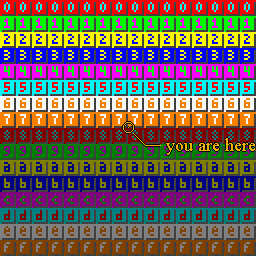
        <br>
        <b>*@fig:img-m7-map</b>: this is your map (well, kinda)
      </div>
    <td>
      <div class="cpt" style="width:240px;">
        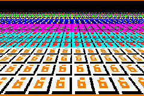
        <br>
        <b>*@fig:img-m7-persp</b>: this is your map in mode7.
      </div>
  </table>
</div>

## Getting a sense of perspective {#sec-persp}

(If you are familiar with the basics of perspective, you can just skim this section.)  
If you've ever looked at a world map or a 3D game, you know that when mapping from 3D to 2D, something' has to give. The technical term for this is <dfn>projection</dfn>. There are many types of projection, but the one we're concerned with is <dfn>perspective</dfn>, which makes objects look smaller the further off they are.

We start with a 3D space like the one in @fig:img-3dview. In computer graphics, it is customary to have the _x_-axis pointing to the right and the _y_-axis pointing up. The _z_-axis is the determined by the handedness of the space: a <dfn>right-handed</dfn> coordinate system has it pointing to the back (out of the screen), which in a left-handed system it's pointing to the front. I'm using a right-handed system because my mind gets hopelessly confused in a left-handed system when it comes to rotation and calculating normals. Another reason is that this way the screen coordinates correspond to (_x_, _z_) values. It is also customary to have the viewer at the origin (for a different viewer position, simply translate the world in the other direction). For a right-handed system, this means that you're looking down the negative _z_-axis.

Of course, you can't see everything: only the objects inside the <dfn>viewing volume</dfn> are visible. For a perspective projection this is defined by the viewer position (the origin in our case) and the <dfn>projection plane</dfn>, located in front of the viewer at a distance _D_. Think of it as the screen. The projection plane has a width _W_ and height _H_. So the viewing volume is actually a <dfn>viewing pyramid</dfn>, though in practice it is usually a viewing _frustum_ (a beheaded pyramid), since there is a minimum and maximum to the distance you can perceive as well.

{\*@fig:img-side1} shows what the perspective projection actually does. Given is a point (_y_, _z_) which is projected to point (_y_<sub>p</sub>, −*D*) on the projection plane. The projected _z_-coordinate, by definition, is −*D*. The projected _y_-coordinate is the intersection of the projection plane and the line passing through the viewer and the original point:

<table id="eq:persp">
  <tr>
    <td class="eqnrcell">(!@eq:persp)
    <td class="eqcell">
      <math display="block" class="tml-display" style="display:block math;">
        <mrow>
          <msub>
            <mi>y</mi>
            <mi>p</mi>
          </msub>
          <mo>=</mo>
          <mi>y</mi>
          <mo>·</mo>
          <mi>D</mi>
          <mo lspace="0em" rspace="0em">⁄</mo>
          <mi>z</mi>
        </mrow>
      </math>
</table>

Basically, you divide by
<math style="display: inline-block math;">
<mrow>
<mi>z</mi>
<mo lspace="0em" rspace="0em">/</mo>
<mi>D</mi>
</mrow>
</math>.
Since it is so important a factor it has is own variable: the <dfn>zoom factor</dfn> λ:

<table id="eq:lambda">
  <tr>
    <td class="eqnrcell">(!@eq:lambda)
    <td class="eqcell">
      <math xmlns="http://www.w3.org/1998/Math/MathML" display="block">
        <mstyle displaystyle="true" scriptlevel="0">
          <mrow data-mjx-texclass="ORD">
            <mtable rowspacing=".5em" columnspacing="1em" displaystyle="true">
              <mtr>
                <mtd>
                  <mi>&#x3BB;</mi>
                  <mo>=</mo>
                  <mi>z</mi>
                  <mrow data-mjx-texclass="ORD">
                    <mo>/</mo>
                  </mrow>
                  <mi>D</mi>
                  <mo>=</mo>
                  <mi>y</mi>
                  <mrow data-mjx-texclass="ORD">
                    <mo>/</mo>
                  </mrow>
                  <msub>
                    <mi>y</mi>
                    <mrow data-mjx-texclass="ORD">
                      <mi>p</mi>
                    </mrow>
                  </msub>
                </mtd>
              </mtr>
            </mtable>
          </mrow>
        </mstyle>
      </math>
</table>

As a rule, everything in front the projection plane (λ\<1) will be enlarged, and everything behind it (λ\>1) is shrunk.

<div class="cblock">
  <table>
    <tr valign="top">
      <td>
        <div class="cpt" style="width:256px;">
          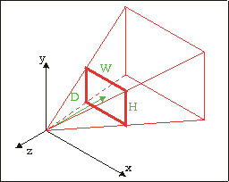
          <br>
          <b>*@fig:img-3dview</b>:
          3D coordinate system showing the viewing pyramid defined by the origin, and the screen rectangle (<i>W</i>&times;<i>H</i>) at <i>z</i>= &minus;<i>D</i>
        </div>
      <td>
        <div class="cpt" style="width:320px;">
          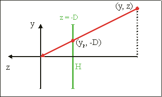
          <br>
          <b>*@fig:img-side1</b>:
          Side view; point (<i>y, z</i>) is projected onto the (<i>z</i> = &minus;<i>D</i> plane. The projected point is <i>y</i><sub>p</sub> =  <i>y·D/z</i>
        </div>
  </table>
</div>

## Enter Mode 7 {#sec-m7-math}

{\*@fig:img-3dview} and @fig:img-side1 describe the general case for perspective projection in a 3D world with tons of objects and viewer orientations. The case for Mode 7 is considerably less complicated than that:

- **Objects**. We only work with two objects: the viewer (at point **a** = (_a_<sub>x</sub>, _a_<sub>y</sub>, _a_<sub>z</sub>) ) and the floor (at _y_=0, by definition).
- **Viewer orientation**. In a full 3D world, the viewer orientation is given by 3 angles: yaw (y-axis), pitch (x-axis) and roll (z-axis). We will limit ourselves to yaw to keep things simple.
- **The horizon issue**. Because the view direction is kept parallel to the floor, the horizon should go in the center of the screen. This would leave the top half of the screen empty, which is a bit of a waste. To remedy this we only use the bottom half of the viewing volume, so that the horizon is at the top of the screen. Note that even though the top and bottom view-lines are now the same as when you would look down a bit, the cases are _NOT_ equal as the projection plane is still vertical. It is important that you realize the difference.

<div class="lblock">
  <div class="cpt" style="width:320px;">
    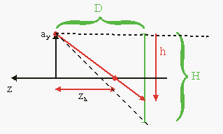
    <b>*@fig:img-side2</b>: side view of Mode 7 perspective
  </div>
</div>

{\*@fig:img-side2} shows the whole situation. A viewer at *y* = *a*<sub>y</sub> is looking in the negative z-direction. At a distance _D_ in front of the viewer is the projection plane, the bottom half of which is displayed on the GBA screen of height _H_ (=160). And now for the fun part. The GBA doesn't have any real 3D hardware capabilities, but you can fake it by cleverly manipulating the scaling and translation `REG_BGxX-REG_BGxPD` for every scanline. You just have to figure out which line of part of the floor goes into which scanline, and at which zoom level. Effectively, you're building a very simple ray-caster.

### The math {#ssec-math-math}

Conceptually, there are four steps to Mode 7, depicted in {@fig:img-steps}a-d. Green figures indicate the original map; red is the map after the operation. Given a scanline _h_, here's what we do:

1. **Pre-translation** by **a**= (_a_<sub>x</sub>, _a_<sub>z</sub>). This places the viewer at the origin, which is where we need it for steps b and c.
2. **Rotation** by α. This takes care of the yaw angle. These steps have been the same as for normal transformable backgrounds so you shouldn't have any difficulty understanding them.
3. **Perspective division**. Next, we scale the whole thing by 1/λ. From @eq:lambda we have λ = *a*<sub>y</sub>/_h_. The line *z* = *z*<sub>h</sub> is the line that belongs on scanline _h_. The new position of this line after scaling is _z_ = −*D*, since that was the whole point of perspective division.
4. **Post-translation** by (−**x**<sub>s</sub>). Note the minus sign. After the perspective division, all that remains is moving the fully transformed map back to its proper screen position (the beige area). For obvious reasons the horizontal component should be half the screen width. The vertical move should move the floor-line to the scanline, so the vector is:

<table id="eq:post-ofs">
<tr>
  <td class="eqnrcell">(!@eq:post-ofs)
  <td class="eqcell">
  <table class="eqtbl" cellpadding=2 cellspacing=0>
  <col align="right">
  <col align="center">
  <col align="left">
  <tr>
    <math xmlns="http://www.w3.org/1998/Math/MathML" display="block">
      <mstyle displaystyle="true" scriptlevel="0">
        <mrow data-mjx-texclass="ORD">
          <mtable rowspacing=".5em" columnspacing="1em" displaystyle="true">
            <mtr>
              <mtd>
                <msub>
                  <mi>x</mi>
                  <mrow data-mjx-texclass="ORD">
                    <mi>s</mi>
                  </mrow>
                </msub>
                <mo>=</mo>
                <mi>W</mi>
                <mrow data-mjx-texclass="ORD">
                  <mo>/</mo>
                </mrow>
                <mn>2</mn>
                <mo>=</mo>
                <mn>120</mn>
              </mtd>
            </mtr>
          </mtable>
        </mrow>
      </mstyle>
    </math>
  <tr>
    <math xmlns="http://www.w3.org/1998/Math/MathML" display="block">
      <mstyle displaystyle="true" scriptlevel="0">
        <mrow data-mjx-texclass="ORD">
          <mtable rowspacing=".5em" columnspacing="1em" displaystyle="true">
            <mtr>
              <mtd>
                <msub>
                  <mi>y</mi>
                  <mrow data-mjx-texclass="ORD">
                    <mi>s</mi>
                  </mrow>
                </msub>
                <mo>=</mo>
                <mo stretchy="false">(</mo>
                <mi>D</mi>
                <mo>+</mo>
                <mi>h</mi>
                <mo stretchy="false">)</mo>
              </mtd>
            </mtr>
          </mtable>
        </mrow>
      </mstyle>
    </math>
  </table>
</table>

<div class="cblock">
  <table id="fig:img-steps" border=1 cellpadding=4 cellspacing=0>
    <caption align="bottom">
      {*@fig:img-steps}a-d: The 4 steps of mode 7
    </caption>
    <tr>
      <td>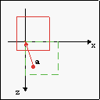
      <td>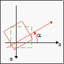
      <td>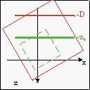
      <td>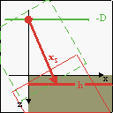
    <tr>
      <td>{*@fig:img-steps}a: pre-translate by (<i>a</i><sub>x</sub>, <i>a</i><sub>z</sub>)
      <td>{*@fig:img-steps}b: rotate by &alpha;
      <td>{*@fig:img-steps}c: scale by 1/&lambda;
      <td>{*@fig:img-steps}d: post-translate by (<i>x</i><sub>s</sub>, <i>y</i><sub>s</sub>)
  </table>
</div>

### Putting it all together {#ssec-math-combine}

While the steps described above are indeed the full procedure, there are still a number of loose ends to tie up. First of all, remember that the GBA's transformation matrix **P** maps from screen space to background space, which is actually the inverse of what you're trying to do. So what you should use is:

<table id="eq:prs">
<tr>
  <td class="eqnrcell">(!@eq:prs)
  <td class="eqcell">
    <math xmlns="http://www.w3.org/1998/Math/MathML" display="block">
      <mstyle displaystyle="true" scriptlevel="0">
        <mrow data-mjx-texclass="ORD">
          <mtable rowspacing=".5em" columnspacing="1em" displaystyle="true">
            <mtr>
              <mtd>
                <mtext mathvariant="bold">P</mtext>
                <mo>=</mo>
                <mtext mathvariant="bold">S</mtext>
                <mo stretchy="false">(</mo>
                <mi>&#x3BB;</mi>
                <mo stretchy="false">)</mo>
                <mo>&#x22C5;</mo>
                <mtext mathvariant="bold">R</mtext>
                <mo stretchy="false">(</mo>
                <mi>a</mi>
                <mo stretchy="false">)</mo>
                <mo>=</mo>
                <mrow data-mjx-texclass="INNER">
                  <mo data-mjx-texclass="OPEN">[</mo>
                  <mtable columnspacing="1em" rowspacing="4pt">
                    <mtr>
                      <mtd>
                        <mi>&#x3BB;</mi>
                        <mo>&#x22C5;</mo>
                        <mi>cos</mi>
                        <mo data-mjx-texclass="NONE">&#x2061;</mo>
                        <mrow>
                          <mo data-mjx-texclass="OPEN">(</mo>
                          <mi>a</mi>
                          <mo data-mjx-texclass="CLOSE">)</mo>
                        </mrow>
                      </mtd>
                      <mtd>
                        <mo>&#x2212;</mo>
                        <mi>&#x3BB;</mi>
                        <mo>&#x22C5;</mo>
                        <mi>sin</mi>
                        <mo data-mjx-texclass="NONE">&#x2061;</mo>
                        <mrow>
                          <mo data-mjx-texclass="OPEN">(</mo>
                          <mi>a</mi>
                          <mo data-mjx-texclass="CLOSE">)</mo>
                        </mrow>
                      </mtd>
                    </mtr>
                    <mtr>
                      <mtd>
                        <mi>&#x3BB;</mi>
                        <mo>&#x22C5;</mo>
                        <mi>sin</mi>
                        <mo data-mjx-texclass="NONE">&#x2061;</mo>
                        <mrow>
                          <mo data-mjx-texclass="OPEN">(</mo>
                          <mi>a</mi>
                          <mo data-mjx-texclass="CLOSE">)</mo>
                        </mrow>
                      </mtd>
                      <mtd>
                        <mi>&#x3BB;</mi>
                        <mo>&#x22C5;</mo>
                        <mi>cos</mi>
                        <mo data-mjx-texclass="NONE">&#x2061;</mo>
                        <mrow>
                          <mo data-mjx-texclass="OPEN">(</mo>
                          <mi>a</mi>
                          <mo data-mjx-texclass="CLOSE">)</mo>
                        </mrow>
                      </mtd>
                    </mtr>
                  </mtable>
                  <mo data-mjx-texclass="CLOSE">]</mo>
                </mrow>
              </mtd>
            </mtr>
          </mtable>
        </mrow>
      </mstyle>
    </math>
  </table>
</table>

And yes, the minus sign is correct for a counter-clockwise rotation (**R** is defined as a clockwise rotation). Also remember that the GBA uses the following relation between screen point **q** and background point **p**:

<table id="eq-ofs-base">
  <tr>
    <td class="eqnrcell">(20.5)
    <td class="eqcell">
      <math xmlns="http://www.w3.org/1998/Math/MathML" display="block">
        <mstyle displaystyle="true" scriptlevel="0">
          <mrow data-mjx-texclass="ORD">
            <mtable rowspacing=".5em" columnspacing="1em" displaystyle="true">
              <mtr>
                <mtd>
                  <mi>d</mi>
                  <mi>x</mi>
                  <mo>+</mo>
                  <mi>P</mi>
                  <mo>&#x22C5;</mo>
                  <mi>q</mi>
                  <mo>=</mo>
                  <mi>p</mi>
                </mtd>
              </mtr>
            </mtable>
          </mrow>
        </mstyle>
      </math>
</table>

that is, <span class="underline">one</span> translation and <span class="underline">one</span> transformation. We have to combine the pre- and post-translations to make it work. We've seen this before in eq 4 in the [affine background page](affbg.html#sec-aff-ofs), only with different names. Anyway, what you need is:

<table id="eq-aff-ofs">
<tr>
  <td class="eqnrcell">(20.6)
  <td class="eqcell">
    <math xmlns="http://www.w3.org/1998/Math/MathML" display="block">
      <mstyle displaystyle="true" scriptlevel="0">
        <mrow data-mjx-texclass="ORD">
          <mtable rowspacing=".5em" columnspacing="1em" displaystyle="true">
            <mtr>
              <mtd>
                <mtable displaystyle="true" columnalign="right left" columnspacing="0em" columnwidth="auto auto" rowspacing="3pt" data-width-includes-label="true">
                  <mtr>
                    <mtd></mtd>
                    <mtd>
                      <mi>d</mi>
                      <mi>x</mi>
                      <mo>+</mo>
                      <mi>P</mi>
                      <mo>&#x22C5;</mo>
                      <mi>q</mi>
                      <mo>=</mo>
                      <mi>p</mi>
                    </mtd>
                  </mtr>
                  <mtr>
                    <mtd></mtd>
                    <mtd>
                      <mi>P</mi>
                      <mo>&#x22C5;</mo>
                      <mo stretchy="false">(</mo>
                      <mi>q</mi>
                      <mo>&#x2212;</mo>
                      <msub>
                        <mi>x</mi>
                        <mrow data-mjx-texclass="ORD">
                          <mi>s</mi>
                        </mrow>
                      </msub>
                      <mo stretchy="false">)</mo>
                      <mo>=</mo>
                      <mi>p</mi>
                      <mo>&#x2212;</mo>
                      <mi>a</mi>
                    </mtd>
                  </mtr>
                  <mtr>
                    <mtd></mtd>
                    <mtd>
                      <mspace width="5cm" height="1pt" style="background: var(--fg);"></mspace>
                    </mtd>
                  </mtr>
                  <mtr>
                    <mtd></mtd>
                    <mtd>
                      <mi>d</mi>
                      <mi>x</mi>
                      <mo>+</mo>
                      <mi>P</mi>
                      <mo>&#x22C5;</mo>
                      <msub>
                        <mi>x</mi>
                        <mrow data-mjx-texclass="ORD">
                          <mi>s</mi>
                        </mrow>
                      </msub>
                      <mo>=</mo>
                      <mi>a</mi>
                    </mtd>
                  </mtr>
                  <mtr>
                    <mtd></mtd>
                    <mtd>
                      <mi>d</mi>
                      <mi>x</mi>
                      <mo>=</mo>
                      <mi>a</mi>
                      <mo>&#x2212;</mo>
                      <mi>P</mi>
                      <mo>&#x22C5;</mo>
                      <msub>
                        <mi>x</mi>
                        <mrow data-mjx-texclass="ORD">
                          <mi>s</mi>
                        </mrow>
                      </msub>
                    </mtd>
                  </mtr>
                </mtable>
              </mtd>
            </mtr>
          </mtable>
        </mrow>
      </mstyle>
    </math>
</table>

So for each scanline you do the calculations for the zoom, put the **P** matrix of @eq:prs into `REG_BGxPA-REG_BGxPD`, and **a−P·x**<sub>s</sub> into `REG_BGxX` and `REG_BGxY` and presto! Instant Mode 7.

Well, almost. [Remember](affbg.html#ssec-ao-refpts) what happens when writing to `REG_BGxY` inside an HBlank interrupt: the _current_ scanline is perceived as the screen's origin null-line. In other words, it does the _+h_ part of _y<sub>s</sub>_ automatically. Renaming the true _y_<sub>s</sub> to _y_<sub>s0</sub>, what you _should_ use is

<table id="eq-yofs">
<tr>
  <td class="eqnrcell">(20.7)
  <td class="eqcell">
    <math xmlns="http://www.w3.org/1998/Math/MathML" display="block">
      <mstyle displaystyle="true" scriptlevel="0">
        <mrow data-mjx-texclass="ORD">
          <mtable rowspacing=".5em" columnspacing="1em" displaystyle="true">
            <mtr>
              <mtd>
                <msub>
                  <mi>y</mi>
                  <mrow data-mjx-texclass="ORD">
                    <mi>s</mi>
                  </mrow>
                </msub>
                <mo>=</mo>
                <msub>
                  <mi>y</mi>
                  <mrow data-mjx-texclass="ORD">
                    <mi>s</mi>
                    <mn>0</mn>
                  </mrow>
                </msub>
                <mo>&#x2212;</mo>
                <mi>h</mi>
                <mo>=</mo>
                <mi>D</mi>
              </mtd>
            </mtr>
          </mtable>
        </mrow>
      </mstyle>
    </math>
</table>

Now, in theory you have everything you need. In practice, though, there are a number of things that can go wrong. Before I go into that, here's a nice, (not so) little demo.

## Threefold demo {#sec-demo}

As usual, there is a demo. Actually, I have several Mode 7 demos, but that's not important right now. The demo is called `m7_demo` and the controls are:

<table>
  <col valign="top">
  <tr><th>D-pad<td>Strafe.
  <tr><th>L, R<td>turn left and right (i.e., rotate map right and left, respectively)
  <tr><th>A, B<td>Move up and down, though I forget which is which.
  <tr><th>Select<td>Switch between 3 different Mode7 types (A, B, C)
  <tr><th>Start<td>Resets all values (<b>a</b>= (256, 32, 256), &alpha;= 0)
</table>

“Switch between 3 different Mode7 types”? That's what I said, yes. Make sure you move around in all three types. Please. There's a label in the top-left corner indicating the current type.

<div class="cblock">
  <table id="img-types">
    <tr>
      <td>
        <div class="cpt" style="width:240px;">
          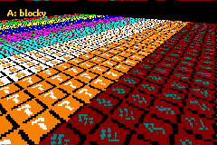<br>
          <b>Fig 20.7a</b>: Type A: blocked.
        </div>
      <td>
        <div class="cpt" style="width:240px;">
          <br>
          <b>Fig 20.7b</b>: Type B: sawtooth.
        </div>
    <tr>
      <td colspan=2 align="center">
        <div class="cpt" style="width:240px;">
          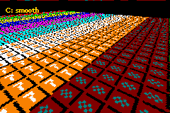<br>
          <b>Fig 20.7c</b>: Type C: smooth.
        </div>
  </table>
</div>

## Order, order! {#sec-order}

Fiddled with my demo a bit? Good. Noticed the differences between the three types? Even better! For reference, take a look at Figs 20.7a-c, which correspond to the types. They adequately show what's different.

- Type A is horribly blocky. Those numbers in the red tiles are supposed to be ‘8’s. Heh, numbers? What numbers!
- Type B is better. The left-hand side is smooth, but there's still some trouble on the right-hand side. But at least you can see eights with some imagination.
- Type C. Now we're talking! The centerline is clear, which is important since that's what you're looking at most of the time. But even on the sides, things are looking pretty decent.

So we have three very different Mode7 results, but I guarantee you it's all based on the same math. So how come one method looks so crummy, and the other looks great?

### The code {#ssec-order-code}

Here are the two HBlank ISRs that create the types. Types A and B are nearly identical, except for one thing. Type C is very different from the others. If you have a thing for self-torture, try explaining the differences from the code alone. I spent most of yesterday night figuring out what made Type C work, so I have half a mind of leaving you hanging. Fortunately for you, that half's asleep right now.

```c
#define M7_D   128

extern VECTOR cam_pos;          // Camera position
extern FIXED g_cosf, g_sinf;    // cos(phi) and sin(phi), .8f
```

```c
// --- Type A ---
// (offset * zoom) * rotation
// All .8 fixed
void m7_hbl_a()
{
    FIXED lam, xs, ys;

    lam= cam_pos.y*lu_div(REG_VCOUNT)>>16;  // .8*.16/.16 = .8

    // Calculate offsets (.8)
    xs= 120*lam;
    ys= M7_D*lam;

    REG_BG2PA= (g_cosf*lam)>>8;
    REG_BG2PC= (g_sinf*lam)>>8;

    REG_BG2X = cam_pos.x - ( (xs*g_cosf-ys*g_sinf)>>8 );
    REG_BG2Y = cam_pos.z - ( (xs*g_sinf+ys*g_cosf)>>8 );
}
```

```c
// --- Type B ---
// (offset * zoom) * rotation
// Mixed fixed point: lam, xs, ys use .12
void m7_hbl_b()
{
    FIXED lam, xs, ys;

    lam= cam_pos.y*lu_div(REG_VCOUNT)>>12;  // .8*.16/.12 = .12

    // Calculate offsets (.12f)
    xs= 120*lam;
    ys= M7_D*lam;

    REG_BG2PA= (g_cosf*lam)>>12;
    REG_BG2PC= (g_sinf*lam)>>12;

    REG_BG2X = cam_pos.x - ( (xs*g_cosf-ys*g_sinf)>>12 );
    REG_BG2Y = cam_pos.z - ( (xs*g_sinf+ys*g_cosf)>>12 );
}
```

```c
// --- Type C ---
// offset * (zoom * rotation)
// Mixed fixed point: lam, lcf, lsf use .12
// lxr and lyr have different calculation methods
void m7_hbl_c()
{
    FIXED lam, lcf, lsf, lxr, lyr;

    lam= cam_pos.y*lu_div(REG_VCOUNT)>>12;  // .8*.16 /.12 = 20.12
    lcf= lam*g_cosf>>8;                     // .12*.8 /.8 = .12
    lsf= lam*g_sinf>>8;                     // .12*.8 /.8 = .12

    REG_BG2PA= lcf>>4;
    REG_BG2PC= lsf>>4;

    // Offsets
    // Note that the lxr shifts down first!

    // horizontal offset
    lxr= 120*(lcf>>4);      lyr= (M7_D*lsf)>>4;
    REG_BG2X= cam_pos.x - lxr + lyr;

    // vertical offset
    lxr= 120*(lsf>>4);      lyr= (M7_D*lcf)>>4;
    REG_BG2Y= cam_pos.z - lxr - lyr;
}
```

### The discussion (technical) {#ssec-order-disc}

All three versions do the following things: calculate the zoom-factor λ, using eq 2 and a division LUT, calculate the affine matrix using λ and stored versions of cos(φ) and sin(φ), and calculate the affine offsets. Note that only _p_<sub>a</sub> and _p_<sub>c</sub> are actually calculated; because the scanline offset is effectively zero all the time, _p_<sub>b</sub> and _p_<sub>d</sub> have no effect and can be ignored. Those are the similarities, but what's more interesting are the differences:

1.  **Fixed point**. Type A uses .8 fixed point math throughout, but B and C use a combination of .12 and .8 fixeds.
2.  **Calculation order of the affine offset** The affine displacement **dx** is a combination of 3 parts: scale, rotation and offsets. Type A and B use **dx** = (offset\*scale)\*rotation, while C uses **dx** = offset\*(scale\*rotation). Because type C does the offsets last, it can also use different fixed-points for the offsets.

<div class="cpt_fr">
<table id="tbl:divs" border=1 cellpadding=2 cellspacing=0>
  <caption align= bottom>
      <b>*@tbl:divs</b>: division tables and zoom factors. <i>a</i><sub>y</sub>=32
  </caption>
  <tr><th>h	<th>1/h			<th>&lambda; (true)	<th>&lambda;(.8)
  <tr><td>157	<td>0.01a16d..h	<td>0.342da7h	<td>0.34h
  <tr><td>158	<td>0.019ec8..h	<td>0.33d91dh	<td>0.33h
  <tr><td>159	<td>0.019c2d..h	<td>0.3385a2h	<td>0.33h
  <tr><td>160	<td>0.019999..h	<td>0.333333h	<td>0.33h
</table>
</div>

These two (well, 2 and a half, really) differences are enough to explain the differences in the results. Please remember that the differences in the code are quite subtle: fixed point numbers are rarely used outside consoles, and results changing due to the order of calculation is probably even rarer. Yet is these two items that make all the difference here.

Let's start with types A and B, which differ only by the fixed-point of `lam`. λ is the ration of the camera height and the scanline, which will often be quite small – smaller than 1 at any rate. @tbl:divs shows a few of the numbers. Note that using a λ with only 8 fractional bits means that you'll often have the same number for multiple scanlines, which carries through in the later calculations. This is why type A, which plays by the rules and uses a constant fixed-point like a good little boy, is so blocky at low altitudes. The four extra bits of type B gives much better results. Rules are nice and all, but sometimes they needs to be broken to get results.

Now, you will notice that type B still has a bit of distortion, so why only go to .12 fixeds in type B, why not 16? Well, with 16 you can get into trouble with integer overflow. It'd be alright for calculating `xs` and `ys`, but we still have to rotate these values later on as well. OK, so we'll use 64bit math, then the 32bit overflow wouldn't matter and we could use _even more_ fixed point bits! After all, more == better, right?

Well, no. Bigger/stronger/more does not always mean better (see the DS vs PSP). The remaining distortion is not a matter of the number of fixed-point bits; not exactly. You could use a 128bit math and .32f division and trig tables for all I care; it wouldn't matter here, because that's not were the problem is.

The problem, or at least part of it, is the basic algorithm used in types A and B. If you look back to the theory, you'll see that the affine matrix is calculated first, then the offsets. In other words, first combine the scale and rotation, then calculate the offset-correction, **P**·**x**<sub>s</sub>. This is how the affine parameters in the GBA work anyway. However, this is actually only the first step. If you follow that procedure, you'd still get the jagged result. The _real_ reason for these jaggies is the order of calculation of `lxr`.

```c
// Multiply, then shift to .8 (A and B)
    lxr= (120*lcf)>>4;

// Shift to .8 first, then multiply (C)
    lxr= 120*(lcf>>4);
```

Getting `lxr` = *p*<sub>a/c</sub>·_x_<sub>s</sub> requires two parts: multiplication with **P** elements and the shift down to .8 fixeds. You might expect doing the shift last would be better because it has a higher precision. The funny thing is that it **doesn't**! Shifting _p_<sub>a</sub> or _p_<sub>c</sub> down to 8 fractional bits before the multiplication is what gets rid of the remaining distortions, reversing the order of operations doesn't.

As for why, I'm not 100% sure, but I can hazard a guess. The affine transformation takes place around the origin of the screen, and to place the origin somewhere else we need to apply a post-translation by **x**<sub>s</sub>. The crucial point I think is that **x**<sub>s</sub> is a point in screen-space which uses normal integers, not fixed points. However, it only applies to _x_<sub>s</sub> because that _really_ represents an on-screen offset; _y_<sub>s</sub> is actually not a point on the screen but the focal distance of the camera. On the other hand, it might have something to do with the internal registers for the displacement.

### The verdict {#ssec-order-verdict}

Obviously, type C is the one you want. It really bugs the hell out of me that I didn't think of it myself. And the fact that I _did_ use the scale-rotation multiplication but abandoned it because I screwed up with the multiplication by the projection distance _D_ doesn't help either (yes, this sentence makes sense). The code of `m7_hbl_c` shown above works, even though it only uses 32-bit math. As long as you do the scale-rotation multiplication first and shift down to .8 fixeds before you multiply by 120 in the calculation of `wxr` everything should be fine.

## Final Thoughts {#sec-final}

This has been one of those occasions that show that programming (especially low-level programming) is as much of a science as an art. Even though the theory for the three mode 7 versions was the same, the slight differences in the order and precision of the calculations in the implementations made for very noticeable differences in the end result. When it comes to mode 7, calculate the affine matrix before the correction offset. But most importantly, the _x_-offset for the screen should not be done in fixed point.

Secondly, this was only the basic theory behind mode 7 graphics. No sprites, no pitch-angle and no horizon, and tailored to the GBA hardware from the start. In the next chapter, we'll derive the theory more extensively following standard 3D theory with linear algebra. This chapter will also show how to position sprites in 3D and how to do other things with them like animating for rotation and sorting, and also present variable-pitch and a horizon. If this sounds complicated, well, I supposed that it is. It's definitely worth a look, though.
