# 21. Mode 7 Part 2 {#ch-}

<!-- toc -->

## Introduction {#sec-intro}

[Mode 7: part 1](mode7.html) covered the basics of how to get an affine background to look like a 3D plane, and discussed some of the trickier parts of the fixed point arithmetic involved. Getting the basic look of a 3D plane is only the first step.

In this chapter, we'll look into the general math involved of creating a 3D world and translate it back to a form we can use for mode 7. This includes translations in all directions and looking around (yaw) like before, but also a pitch angle for looking up and down. We'll also see how to deal with the horizon and use a background for the backdrop above the horizon. I'll even throw in a bit of fogging to occlude the distant parts of the ground.

I'll discuss also working with sprites in 3D space. Not just the transformation from 3D space to 2D screen, but also culling, scaling for distance (which is not as simple as one might think), animation and sorting. Note that this part of the chapter is basic 3D sprite theory, and can be applied to 3D games that use sprites in some way.

The theory part of the chapter is going to be very math-heavy, as 3D theory always is. Knowing a little bit about [linear algebra](matrix.html) certainly wouldn't hurt. The full story about geometry is beyond the scope of Tonc, but this stuff is quite general; most books on 3D programming will have a chapter on geometric transformations, so you can look at those if you get a little lost here.

This chapter touches on almost all of the topics covered so far. It uses [affine objects](affobj.html), backgrounds (both [regular](regbg.html) and [affine](affbg.html)), [interrupts](interrupts.html), [color effects](gfx.html#blend) and a few more. If your understanding of any of these is lacking, you could be in for a rough time here.

<div class="cblock">
  <table class="bdr" id="fig:img-m7-ex" cellpadding=2 cellspacing=0>
    <tbody align="center">
      <tr>
        <td>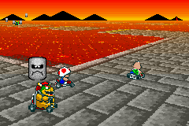</td>
        <td>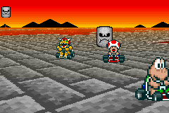</td>
      </tr>
      <tr>
        <td colspan=2>
          <b>*@fig:img-m7-ex</b>: <tt>m7_ex</tt>; with horizon, sprites, variable pitch angle and distance fogging.
        </td>
      </tr>
    </tbody>
  </table>
</div>

What we're going to try to do is re-create a scene from the SNES Mario Kart (see {@fig:img-m7-ex}; apologies to Nintendo for using the graphics, but I don't have a lot of options here <kbd>:\\</kbd>). This is just a freeze-frame of the game, not actual game play is involved, but this should present a nice target to aim for. The code is distributed over a number of files: `mode7.c` for the simple mode 7 functions and `mode7.iwram.c` for the less simple mode 7 functions and interrupt routines. The code of demo-specific code can be found in `m7_ex.c`, which does the set-up, interaction and main loop. The basic controls are as follows:

<div class="lblock">
  <table cellpadding=2 cellspacing=0>
    <col span=2 align="left" valign="top">
      <tr><th>D-pad	<td>Looking
      <tr><th>A/B		<td>Back/forward
      <tr><th>L/R		<td>Strafing
      <tr><th>Select+A/B	<td>Float up/down
      <tr><th>Start	<td>Menu
  </table>
</div>

Movement and looking follows FPS/aircraft motion, or at least as well as could be expected with the number of buttons available. There are several extra options which have been put in a menu. First is _motion control_ which sets difference methods of movement. Option ‘local’ follows the camera axis for flight-controls, ‘level’ gives movement parallel to the ground, like FPSs usually do, and ‘global’ uses world axis for movement. Other options include toggling fog on or off and resetting the demo.

## Basic mode 7 theory {#sec-theory}

{\*@fig:img-crd-overview} shows what we're up against: we have a camera located at **a**<sub>cw</sub>, which has some orientation with respect to the world coordinate system. What we have to do is find the transformation that links screen point **x**<sub>s</sub> to world point **x**<sub>w</sub>. There are a number of ways to do this. You already saw one in the [first mode 7 chapter](mode7.html), where we I had the GBA hardware in mind from the start. You could extend this to the general mode 7 case (with a non-zero pitch) with some effort. You could also use pure trigonometry, which is a minefield of minus signs and potential sine-cosine mix-ups. Still, it is possible. What I'll use here, though, is [linear algebra](matrix.html). There are several reasons for this choice. Firstly, linear algebra has a very concise notation, so you can write down the final solution in just a few lines (in fact, once you get through the definitions, the solution that covers all cases can be written down in 2 lines). Furthermore, the equations are well structured and uniform in appearance, making debugging easier. Then there's the fact that inverting the whole thing is very easy. And lastly, it's what true 3D systems use too, so the theory can be applied outside the mode 7 arena as well. Conversely, if you know basic 3D theory, you'll feel right at home here.

<div class="lblock">
  <div class="cpt" style="width:378px;">
    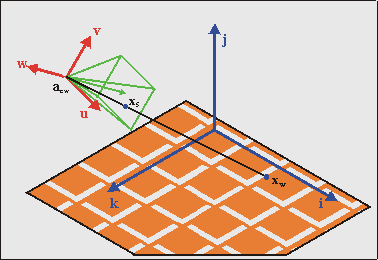
    <br>
    <b>*@fig:img-crd-overview</b>: The basic 3D situation. The trick is to relate screen point <b>x</b><sub>s</sub> to world point <b>x</b><sub>w</sub>, taking the camera position <b>a</b><sub>cw</sub> and its orientation into account.
  </div>
</div>

### Definitions {#ssec-try-defs}

Before you can do anything, though, you need to know _exactly_ what we're going to use. The first thing to note is that we have two main coordinate systems: the <dfn>world</dfn> system _S_<sub>w</sub> and the <dfn>camera</dfn> system _S_<sub>c</sub>. Inside the camera system we have two minor coordinate systems, namely the <dfn>projection</dfn> space _S_<sub>p</sub> and <dfn>screen</dfn> space _S_<sub>s</sub>. Now, for every transformation between systems _S_<sub>i</sub> and _S_<sub>j</sub> the following relation holds:

<table id="eq:crd-transf">
  <tr>
    <td class="eqnrcell">(!@eq:crd-transf)
    <td class="eqcell">
      <math xmlns="http://www.w3.org/1998/Math/MathML" display="block">
        <mstyle displaystyle="true" scriptlevel="0">
          <mrow data-mjx-texclass="ORD">
            <mtable rowspacing=".5em" columnspacing="1em" displaystyle="true">
              <mtr>
                <mtd>
                  <msub>
                    <mi>M</mi>
                    <mrow data-mjx-texclass="ORD">
                      <mi>i</mi>
                      <mi>j</mi>
                    </mrow>
                  </msub>
                  <mtext>&#xA0;</mtext>
                  <mo>&#x22C5;</mo>
                  <mtext>&#xA0;</mtext>
                  <msub>
                    <mi>x</mi>
                    <mrow data-mjx-texclass="ORD">
                      <mi>j</mi>
                    </mrow>
                  </msub>
                  <mo>=</mo>
                  <msub>
                    <mi>x</mi>
                    <mrow data-mjx-texclass="ORD">
                      <mi>i</mi>
                    </mrow>
                  </msub>
                  <mo>&#x2212;</mo>
                  <msub>
                    <mi>a</mi>
                    <mrow data-mjx-texclass="ORD">
                      <mi>j</mi>
                      <mi>i</mi>
                    </mrow>
                  </msub>
                </mtd>
              </mtr>
            </mtable>
          </mrow>
        </mstyle>
      </math>
</table>

where

<div class="lblock">
  <table cellpadding=0>
    <tr>
      <td><b>x</b><sub>i</sub>
      <td>the coordinate vector in system <i>S</i><sub>i</sub>;
    <tr>
      <td><b>x</b><sub>j</sub>
      <td>the coordinate vector in system <i>S</i><sub>j</sub>;
    <tr>
      <td><b>a</b><sub>ji</sub>
      <td>the origin of system <i>S</i><sub>j</sub>, expressed in coordinates of system <i>S</i><sub>i</sub>;
    <tr>
      <td><b>M</b><sub>ij</sub>
      <td>the transformation matrix, which is basically the matrix formed by the principle vectors of <i>S</i><sub>j</sub>, in terms of <i>S</i><sub>i</sub>.
  </table>
</div>

Once you get over the initial shock of the many indices (meh, in general relativity you have something called the Riemann tensor, which has _four_ indices), you'll see that this equation makes sense. If you don't get it right away, think of them as arrays and matrices. An observant reader will also recognise the structure in the [screen↔map transformation](affbg.html#sec-aff-ofs) we had for affine maps: **P·q** = **p − dx**. {\*@eq:crd-transf} is a very general equation, by the way, it holds for every kind of linear coordinate transformation. In fact, systems _S_<sub>i</sub> and _S_<sub>j</sub> don't even have to have the same number of dimensions!

As said, we have 4 systems in total, so we have 4 subscripts for <dfn>w</dfn>(orld), <dfn>c</dfn>(amera), <dfn>p</dfn>(rojection), <dfn>s</dfn>(creen). Remember these, for they will appear on a very regular basis. The final forms of the matrices and origins depend very much on the exact definitions of these systems, so make sure you know exactly what each means.

### World system {#ssec-try-world}

The first of these, the world system _S_<sub>w</sub>, is easy to deal with. This is simply a right-handed Cartesian system with principle axes **i**, **j**, and **k**, which are its x-, y- and z-axes, respectively. In the right-handed system that is used in computer graphics, the x-axis (**i**) points to the right, the y-axis (**j**) points up and the z-axis (**k**) points _backward_! This means that you're looking in the negative _z_ direction, which may seem weird at first. If you absolutely must have a forward pointing **k**, you could use a left-handed system. While this utterly destroys my 3d intuition, if you want it be my guest. Before you do that, though, remember that the map marks the floor of world space and in a right-handed system, the texture coordinates will match up neatly to world coordinates.

### The camera frame {#ssec-try-cam}

<div class="cpt_fr" style="width:260px;">
  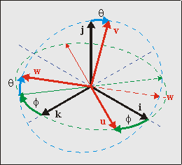
  <br>
  <b>{*@fig:img-w2c}</b>: Camera orientation {<b>u, v, w</b>} in world space {<b>i, j, k</b>}, given by angles &theta; and &phi;
</div>

The transformation to the camera system is probably the major hurdle in the whole thing. At least it would be if it wasn't for matrices. Rewriting @eq:crd-transf, the transformation between camera and world space is given by

<table id="eq:w2c">
<tr>
   <td class="eqnrcell">({!@eq:w2c})
   <td class="eqcell">
    <math xmlns="http://www.w3.org/1998/Math/MathML" display="block">
      <mstyle displaystyle="true" scriptlevel="0">
        <mrow data-mjx-texclass="ORD">
          <mtable rowspacing=".5em" columnspacing="1em" displaystyle="true">
            <mtr>
              <mtd>
                <mi>C</mi>
                <mtext>&#xA0;</mtext>
                <mo>&#x22C5;</mo>
                <mtext>&#xA0;</mtext>
                <msub>
                  <mi>x</mi>
                  <mrow data-mjx-texclass="ORD">
                    <mi>c</mi>
                  </mrow>
                </msub>
                <mo>=</mo>
                <msub>
                  <mi>x</mi>
                  <mrow data-mjx-texclass="ORD">
                    <mi>w</mi>
                  </mrow>
                </msub>
                <mo>&#x2212;</mo>
                <msub>
                  <mi>a</mi>
                  <mrow data-mjx-texclass="ORD">
                    <mi>c</mi>
                    <mi>w</mi>
                  </mrow>
                </msub>
              </mtd>
            </mtr>
          </mtable>
        </mrow>
      </mstyle>
    </math>
</table>

As you can expect, the origin of camera space is the camera position, **a**<sub>cw</sub>. The camera matrix **C** is formed by the principle axes of camera space, which are **u, v** and **w** for the local x-, y- and z-axes, respectively. This means that the camera matrix is **C** = \[**u v w**\].

The orientation of the camera with respect to world space is defined by 3 angles: <dfn>pitch</dfn> (rotation around the x-axis), <dfn>yaw</dfn> (rotation around the y-axis) and <dfn>roll</dfn> (around z-axis). The combination of these give **C**. Traditionally, the rotation direction of these is such that if you look down one of these axes, a positive angle turns the system counter-clockwise. However, I'll do the exact opposite, because it makes a number of things easier. Additionally, I will only be using two angles: pitch and yaw. For mode 7 it is impossible to incorporate roll into the picture. Why? Look at it this way: if you're rolled on your side, the ground would be on the right or left of the screen, which would require a vertical perspective division, which is impossible to achieve since we can only change the affine parameters at HBlank. Therefore, only pitch (θ) and yaw (φ) are allowed. I want my positive θ and φ to the view down and right, respectively, meaning I need the following rotation matrices:

<table id="eq:mat-rot">
  <tr>
    <td class="eqnrcell">({!@eq:mat-rot}a)</td>
    <td class="eqcell">
      <math xmlns="http://www.w3.org/1998/Math/MathML" display="block">
        <mstyle displaystyle="true" scriptlevel="0">
          <mrow data-mjx-texclass="ORD">
            <mtable rowspacing=".5em" columnspacing="1em" displaystyle="true">
              <mtr>
                <mtd>
                  <msub>
                    <mtext mathvariant="bold">R</mtext>
                    <mrow data-mjx-texclass="ORD">
                      <mi>x</mi>
                    </mrow>
                  </msub>
                  <mo stretchy="false">(</mo>
                  <mi>&#x3B8;</mi>
                  <mo stretchy="false">)</mo>
                  <mo>=</mo>
                  <mrow data-mjx-texclass="INNER">
                    <mo data-mjx-texclass="OPEN">[</mo>
                    <mtable columnspacing="1em" rowspacing="4pt">
                      <mtr>
                        <mtd>
                          <mn>1</mn>
                        </mtd>
                        <mtd>
                          <mn>0</mn>
                        </mtd>
                        <mtd>
                          <mn>0</mn>
                        </mtd>
                      </mtr>
                      <mtr>
                        <mtd>
                          <mn>0</mn>
                        </mtd>
                        <mtd>
                          <mi>cos</mi>
                          <mo data-mjx-texclass="NONE">&#x2061;</mo>
                          <mrow>
                            <mo data-mjx-texclass="OPEN">(</mo>
                            <mi>&#x3B8;</mi>
                            <mo data-mjx-texclass="CLOSE">)</mo>
                          </mrow>
                        </mtd>
                        <mtd>
                          <mi>sin</mi>
                          <mo data-mjx-texclass="NONE">&#x2061;</mo>
                          <mrow>
                            <mo data-mjx-texclass="OPEN">(</mo>
                            <mi>&#x3B8;</mi>
                            <mo data-mjx-texclass="CLOSE">)</mo>
                          </mrow>
                        </mtd>
                      </mtr>
                      <mtr>
                        <mtd>
                          <mn>0</mn>
                        </mtd>
                        <mtd>
                          <mo>&#x2212;</mo>
                          <mi>sin</mi>
                          <mo data-mjx-texclass="NONE">&#x2061;</mo>
                          <mrow>
                            <mo data-mjx-texclass="OPEN">(</mo>
                            <mi>&#x3B8;</mi>
                            <mo data-mjx-texclass="CLOSE">)</mo>
                          </mrow>
                        </mtd>
                        <mtd>
                          <mi>cos</mi>
                          <mo data-mjx-texclass="NONE">&#x2061;</mo>
                          <mrow>
                            <mo data-mjx-texclass="OPEN">(</mo>
                            <mi>&#x3B8;</mi>
                            <mo data-mjx-texclass="CLOSE">)</mo>
                          </mrow>
                        </mtd>
                      </mtr>
                    </mtable>
                    <mo data-mjx-texclass="CLOSE">]</mo>
                  </mrow>
                </mtd>
              </mtr>
            </mtable>
          </mrow>
        </mstyle>
      </math>
    </td>
  </tr>
  <tr>
    <td class="eqnrcell">({!@eq:mat-rot}b)</td>
    <td>
      <math xmlns="http://www.w3.org/1998/Math/MathML" display="block">
        <mstyle displaystyle="true" scriptlevel="0">
          <mrow data-mjx-texclass="ORD">
            <mtable rowspacing=".5em" columnspacing="1em" displaystyle="true">
              <mtr>
                <mtd>
                  <msub>
                    <mtext mathvariant="bold">R</mtext>
                    <mrow data-mjx-texclass="ORD">
                      <mi>y</mi>
                    </mrow>
                  </msub>
                  <mo stretchy="false">(</mo>
                  <mi>&#x3C6;</mi>
                  <mo stretchy="false">)</mo>
                  <mo>=</mo>
                  <mrow data-mjx-texclass="INNER">
                    <mo data-mjx-texclass="OPEN">[</mo>
                    <mtable columnspacing="1em" rowspacing="4pt">
                      <mtr>
                        <mtd>
                          <mi>cos</mi>
                          <mo data-mjx-texclass="NONE">&#x2061;</mo>
                          <mrow>
                            <mo data-mjx-texclass="OPEN">(</mo>
                            <mi>&#x3C6;</mi>
                            <mo data-mjx-texclass="CLOSE">)</mo>
                          </mrow>
                        </mtd>
                        <mtd>
                          <mn>0</mn>
                        </mtd>
                        <mtd>
                          <mo>&#x2212;</mo>
                          <mi>sin</mi>
                          <mo data-mjx-texclass="NONE">&#x2061;</mo>
                          <mrow>
                            <mo data-mjx-texclass="OPEN">(</mo>
                            <mi>&#x3C6;</mi>
                            <mo data-mjx-texclass="CLOSE">)</mo>
                          </mrow>
                        </mtd>
                      </mtr>
                      <mtr>
                        <mtd>
                          <mn>0</mn>
                        </mtd>
                        <mtd>
                          <mn>1</mn>
                        </mtd>
                        <mtd>
                          <mn>0</mn>
                        </mtd>
                      </mtr>
                      <mtr>
                        <mtd>
                          <mi>sin</mi>
                          <mo data-mjx-texclass="NONE">&#x2061;</mo>
                          <mrow>
                            <mo data-mjx-texclass="OPEN">(</mo>
                            <mi>&#x3C6;</mi>
                            <mo data-mjx-texclass="CLOSE">)</mo>
                          </mrow>
                        </mtd>
                        <mtd>
                          <mn>0</mn>
                        </mtd>
                        <mtd>
                          <mi>cos</mi>
                          <mo data-mjx-texclass="NONE">&#x2061;</mo>
                          <mrow>
                            <mo data-mjx-texclass="OPEN">(</mo>
                            <mi>&#x3C6;</mi>
                            <mo data-mjx-texclass="CLOSE">)</mo>
                          </mrow>
                        </mtd>
                      </mtr>
                    </mtable>
                    <mo data-mjx-texclass="CLOSE">]</mo>
                  </mrow>
                </mtd>
              </mtr>
            </mtable>
          </mrow>
        </mstyle>
      </math>
    </td>
  </tr>
</table>

But now the next problem arises: do we do pitch first, or yaw? That really depends on what kind of effect you want to have _and_ in relation to what system you do your rotation. There is actually only one order that is possible for the same reason that roll wasn't allowed: you cannot have a vertical perspective. What this boils down to is that **u** (the x-axis of the camera frame) _must_ be parallel to the ground plane, i.e., _u_<sub>y</sub> must be zero. In order to do that, you must do pitch first, then yaw. This is depicted in {@fig:img-w2c}. To get a feel for this: stand up, tilt your head down (pitch θ\>0), then turn to your right (yaw φ\>0). The full camera matrix then becomes:

<table id="eq:rotxy">
  <tr>
    <td class="eqnrcell">({!@eq:rotxy})</td>
    <td class="eqcell">
      <math xmlns="http://www.w3.org/1998/Math/MathML" display="block">
        <mstyle displaystyle="true" scriptlevel="0">
          <mrow data-mjx-texclass="ORD">
            <mtable rowspacing=".5em" columnspacing="1em" displaystyle="true">
              <mtr>
                <mtd>
                  <mtext mathvariant="bold">C</mtext>
                  <mo stretchy="false">(</mo>
                  <mi>&#x3B8;</mi>
                  <mo>,</mo>
                  <mi>&#x3C6;</mi>
                  <mo stretchy="false">)</mo>
                  <mo>=</mo>
                  <msub>
                    <mtext mathvariant="bold">R</mtext>
                    <mrow data-mjx-texclass="ORD">
                      <mi>y</mi>
                    </mrow>
                  </msub>
                  <mo stretchy="false">(</mo>
                  <mi>&#x3C6;</mi>
                  <mo stretchy="false">)</mo>
                  <mtext>&#xA0;</mtext>
                  <mo>&#x22C5;</mo>
                  <mtext>&#xA0;</mtext>
                  <msub>
                    <mtext mathvariant="bold">R</mtext>
                    <mrow data-mjx-texclass="ORD">
                      <mi>x</mi>
                    </mrow>
                  </msub>
                  <mo stretchy="false">(</mo>
                  <mi>&#x3B8;</mi>
                  <mo stretchy="false">)</mo>
                  <mo>=</mo>
                  <mrow data-mjx-texclass="INNER">
                    <mo data-mjx-texclass="OPEN">[</mo>
                    <mtable columnspacing="1em" rowspacing="4pt">
                      <mtr>
                        <mtd>
                          <mi>cos</mi>
                          <mo data-mjx-texclass="NONE">&#x2061;</mo>
                          <mrow>
                            <mo data-mjx-texclass="OPEN">(</mo>
                            <mi>&#x3C6;</mi>
                            <mo data-mjx-texclass="CLOSE">)</mo>
                          </mrow>
                        </mtd>
                        <mtd>
                          <mi>sin</mi>
                          <mo data-mjx-texclass="NONE">&#x2061;</mo>
                          <mrow>
                            <mo data-mjx-texclass="OPEN">(</mo>
                            <mi>&#x3C6;</mi>
                            <mo data-mjx-texclass="CLOSE">)</mo>
                          </mrow>
                          <mo>&#x22C5;</mo>
                          <mi>s</mi>
                          <mi>i</mi>
                          <mi>n</mi>
                          <mo stretchy="false">(</mo>
                          <mi>&#x3B8;</mi>
                          <mo stretchy="false">)</mo>
                        </mtd>
                        <mtd>
                          <mo>&#x2212;</mo>
                          <mi>sin</mi>
                          <mo data-mjx-texclass="NONE">&#x2061;</mo>
                          <mrow>
                            <mo data-mjx-texclass="OPEN">(</mo>
                            <mi>&#x3C6;</mi>
                            <mo data-mjx-texclass="CLOSE">)</mo>
                          </mrow>
                          <mo>&#x22C5;</mo>
                          <mi>cos</mi>
                          <mo data-mjx-texclass="NONE">&#x2061;</mo>
                          <mrow>
                            <mo data-mjx-texclass="OPEN">(</mo>
                            <mi>&#x3B8;</mi>
                            <mo data-mjx-texclass="CLOSE">)</mo>
                          </mrow>
                        </mtd>
                      </mtr>
                      <mtr>
                        <mtd>
                          <mn>0</mn>
                        </mtd>
                        <mtd>
                          <mi>cos</mi>
                          <mo data-mjx-texclass="NONE">&#x2061;</mo>
                          <mrow>
                            <mo data-mjx-texclass="OPEN">(</mo>
                            <mi>&#x3B8;</mi>
                            <mo data-mjx-texclass="CLOSE">)</mo>
                          </mrow>
                        </mtd>
                        <mtd>
                          <mi>sin</mi>
                          <mo data-mjx-texclass="NONE">&#x2061;</mo>
                          <mrow>
                            <mo data-mjx-texclass="OPEN">(</mo>
                            <mi>&#x3B8;</mi>
                            <mo data-mjx-texclass="CLOSE">)</mo>
                          </mrow>
                        </mtd>
                      </mtr>
                      <mtr>
                        <mtd>
                          <mi>sin</mi>
                          <mo data-mjx-texclass="NONE">&#x2061;</mo>
                          <mrow>
                            <mo data-mjx-texclass="OPEN">(</mo>
                            <mi>&#x3B8;</mi>
                            <mo data-mjx-texclass="CLOSE">)</mo>
                          </mrow>
                        </mtd>
                        <mtd>
                          <mo>&#x2212;</mo>
                          <mi>cos</mi>
                          <mo data-mjx-texclass="NONE">&#x2061;</mo>
                          <mrow>
                            <mo data-mjx-texclass="OPEN">(</mo>
                            <mi>&#x3B8;</mi>
                            <mo data-mjx-texclass="CLOSE">)</mo>
                          </mrow>
                          <mo>&#x22C5;</mo>
                          <mi>sin</mi>
                          <mo data-mjx-texclass="NONE">&#x2061;</mo>
                          <mrow>
                            <mo data-mjx-texclass="OPEN">(</mo>
                            <mi>&#x3B8;</mi>
                            <mo data-mjx-texclass="CLOSE">)</mo>
                          </mrow>
                        </mtd>
                        <mtd>
                          <mi>cos</mi>
                          <mo data-mjx-texclass="NONE">&#x2061;</mo>
                          <mrow>
                            <mo data-mjx-texclass="OPEN">(</mo>
                            <mi>&#x3C6;</mi>
                            <mo data-mjx-texclass="CLOSE">)</mo>
                          </mrow>
                          <mo>&#x22C5;</mo>
                          <mi>cos</mi>
                          <mo data-mjx-texclass="NONE">&#x2061;</mo>
                          <mrow>
                            <mo data-mjx-texclass="OPEN">(</mo>
                            <mi>&#x3B8;</mi>
                            <mo data-mjx-texclass="CLOSE">)</mo>
                          </mrow>
                        </mtd>
                      </mtr>
                    </mtable>
                    <mo data-mjx-texclass="CLOSE">]</mo>
                  </mrow>
                </mtd>
              </mtr>
            </mtable>
          </mrow>
        </mstyle>
      </math>
    </td>
</table>

Aside from being correct, this matrix has two nice properties. Firstly, the column vectors are of unit length. Secondly, the component vectors are perpendicular. This means that **C** is an <dfn>orthogonal matrix</dfn>, which has the very nice feature that **C**<sup>−1</sup> = **C**<sup>T</sup>. This makes the world→camera transformation a relatively simple operation.

One last thing here: if you were to rotate the camera system by 180° around **i**, this would give you a forward pointing **w** and a downward pointing **v**, both of which decrease the number of awkward minus signs in later calculations, at the expense of an awkward camera frame. Whether you want to do this is up to you.

<div class="note">

<div class="nh">

Matrix transforms and the system they occur in.

</div>

I said that to mimic the rotations of **C** you to tilt your head first (θ), then rotate your body (φ). You might think that you can get the same effect by doing it the other way: turn first, then look down. However, this is incorrect.

It may _feel_ the same, but in the second case you'd not actually be using the **R**<sub>x</sub>(θ) to invoke the tilt. A matrix isn't a thing in itself, it ‘lives’ in a space. In this case, both **R**<sub>x</sub>(θ) and **R**<sub>y</sub>(φ) are defined in terms of the _world_ coordinate system, and when applying them the directions follow the world's axes. The turn-then-tilt order would use **R**<sub>x</sub>(θ) in a local frame, which is a legal operation, but not the one that the math requires.

I know it's a subtle point, but there really is an important difference. Try visualizing it with a 90° rotation in both orders, maybe that'd help.

</div>

### The projection plane {#ssec-try-proj}

<div class="cpt_fr" style="width:256px;">
  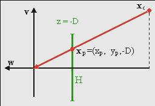
  <br>
  <b>{*@fig:img-c2p}</b>: perspective projection.
</div>

To create the illusion of depth we need a <dfn>perspective view</dfn>. For this, you need a <dfn>center of projection</dfn> (COP) and a <dfn>projection plane</dfn>. Naturally, both need to be in camera space. While you're free to choose these any way you want, you can simplify matters by placing the center of projection at the origin of camera space and the projection plane at a distance _D_ in front of the camera, so that the plane is given by **x**<sub>p</sub> = (_x_<sub>p</sub>, *y*<sub>p</sub>, −*D*). Yes, that's a negative _z_<sub>p</sub>, because we're looking in the negative z-direction. The projected coordinates are the intersections of the line between COP and **x**<sub>c</sub>, and the projection plane. Since the COP is at the origin, the relation between **x**<sub>c</sub> and **x**<sub>p</sub> is

<table id="eq:c2p">
<tr>
  <td class="eqnrcell">({!@eq:c2p})</td>
  <td class="eqcell">
    <math xmlns="http://www.w3.org/1998/Math/MathML" display="block">
      <mstyle displaystyle="true" scriptlevel="0">
        <mrow data-mjx-texclass="ORD">
          <mtable rowspacing=".5em" columnspacing="1em" displaystyle="true">
            <mtr>
              <mtd>
                <mi>&#x3BB;</mi>
                <mtext>&#xA0;</mtext>
                <msub>
                  <mi>x</mi>
                  <mrow data-mjx-texclass="ORD">
                    <mi>p</mi>
                  </mrow>
                </msub>
                <mo>=</mo>
                <msub>
                  <mi>x</mi>
                  <mi>c</mi>
                </msub>
              </mtd>
            </mtr>
          </mtable>
        </mrow>
      </mstyle>
    </math>
    </td>
</table>

Here λ is a simple scaling factor, the value of which can be determined in a variety of ways, depending of the information available at the point in your derivations. For example, since _z_<sub>p</sub> = −*D*, by definition, we have λ = −*z*<sub>c</sub> / _D_. Later we'll see another expression. The interesting thing about this expression is that λ is proportional to the distance in camera space, which in turn tells you how much the camera position is to be scaled _down_, or zoomed. This is useful, since the scaling parameters of the affine matrix scales down as well. Also, the distance _D_ attenuates the scaling, which means that it acts as a <dfn>focus length</dfn>. Note that when _z_<sub>c</sub> = −*D*, the scale is one, meaning that the objects at this distance appear in their normal size.

### Viewport and viewing volume {#ssec-try-view}

<div class="cpt_fr" style="width:308px;">
  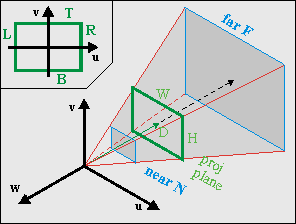
  <br>
  <b>{*@fig:img-viewport}</b>: Viewing frustum in camera space. The green rectangle is the visible part of the projection plane (i.e., the screen).
</div>

Before I give the last step of the transformation to the screen, I have to say a few words about the viewport and the viewing volume. As you can imagine, you can only see a certain portion of the world. You see the world through a region called the <dfn>viewport</dfn>. This is an area on the projection plane, usually rectangular, that defines the horizontal and vertical boundaries of what you can see. In particular, you have a left side (_L_), right side (_R_), top (_T_) and bottom (_B_). With the axes defined as they are and the origin is usually centered (see @fig:img-viewport, inset), we have _R\>0\>L_ and _T\>0\>B_. Yup, in this particular case _L_ is negative, and _T_ is positive!

The width and height of the viewport are *W* = \|_R−L_\| and *H* = \|_B−T_\|, respectively. Together with the center of projection, the viewport defines the <dfn>viewing volume</dfn> (see @fig:img-viewport). For a rectangular viewport this will be a pyramid.

Most of the time you will want boundaries in depth as well, because things too near will obstruct everything else from view (besides, dividing by 0 is never good), and very distant objects will become so small that they are barely noticeable, and why waste so many calculations on a handful of pixels? These boundaries in depth are called the <dfn>near</dfn> (_N_) and <dfn>far</dfn> (_F_) planes, and will turn the viewing volume in a frustum. The numbers for these distances are a matter of taste. Whatever you use, be aware that the z-values are actually negative. I would prefer to have the values of _N_ and _F_ positive, so that the order or distance is 0\>−*N*\>−*F*.

Another point is the notion of the <dfn>field of view</dfn> (FOV). This is the horizontal angle α that you can see, meaning that

<table id="eq:fov-cam">
  <tr>
    <td class="eqnrcell">({!@eq:fov-cam})
    <td class="eqcell">
      <math xmlns="http://www.w3.org/1998/Math/MathML" display="block">
        <mstyle displaystyle="true" scriptlevel="0">
          <mrow data-mjx-texclass="ORD">
            <mtable rowspacing=".5em" columnspacing="1em" displaystyle="true">
              <mtr>
                <mtd>
                  <mi>tan</mi>
                  <mo data-mjx-texclass="NONE">&#x2061;</mo>
                  <mrow>
                    <mo data-mjx-texclass="OPEN">(</mo>
                    <mi>&frac12; &#x3B1;</mi>
                    <mo data-mjx-texclass="CLOSE">)</mo>
                  </mrow>
                  <mo>=</mo>
                  <mfrac>
                    <mi>&frac12; W</mi>
                    <mi>D</mi>
                  </mfrac>
                </mtd>
              </mtr>
            </mtable>
          </mrow>
        </mstyle>
      </math>
</table>

I am told that a commonly used FOV is about 90°, which would require *D* = ½*W*. With *D* = 128 you get close enough to this requirement, with the added benefit that it's a power of 2, but that, of course, is an implementation detail. _However_, it seems that *D* = 256 is more common, so we'll use that instead.

### The screen {#ssec-try-scr}

<div class="cpt_fr" style="width:192px;">
  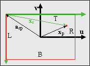
  <br>
  <b>{*@fig:img-p2s}</b>: screen space vs camera space
</div>

The last step is the one from the projection plane onto the screen. This step is almost trivial, but the almost can cause you a lot of trouble if you're not careful. The situation is shown in @fig:img-p2s, where you are looking through the camera. The axes **u** and **v** are the up and right axes of the camera system, while the green arrows denote the x- and y-axes of screen space. And if you have paid attention to any of the tutorials, you should know that the screen's y-axis points _down_. This is bugfest number 1. Also, the origins of camera and screen space differ. Since the screen corresponds to the viewport, the origin of the screen in camera/projection space is **a**<sub>sp</sub> = (_L, T, −D_). Be careful not to reverse the signs here; that would be bugfest number 2. Also remember that since this is in camera space, _L_ is negative and _T_ is positive. Taking both the inverted vertical axis and the origin of screen-space in mind, we have

<table id="eq:p2s">
  <tr>
    <td class="eqnrcell">({!@eq:p2s})
    <td class="eqcell">
      <math xmlns="http://www.w3.org/1998/Math/MathML" display="block">
        <mstyle displaystyle="true" scriptlevel="0">
          <mrow data-mjx-texclass="ORD">
            <mtable rowspacing=".5em" columnspacing="1em" displaystyle="true">
              <mtr>
                <mtd>
                  <mi>S</mi>
                  <mo stretchy="false">(</mo>
                  <mn>1</mn>
                  <mo>,</mo>
                  <mo>&#x2212;</mo>
                  <mn>1</mn>
                  <mo>,</mo>
                  <mn>1</mn>
                  <mo stretchy="false">)</mo>
                  <mo>&#x22C5;</mo>
                  <msub>
                    <mi>x</mi>
                    <mrow data-mjx-texclass="ORD">
                      <mi>s</mi>
                    </mrow>
                  </msub>
                  <mo>=</mo>
                  <msub>
                    <mi>x</mi>
                    <mi>p</mi>
                  </msub>
                  <mo>&#x2212;</mo>
                  <msub>
                    <mi>a</mi>
                    <mrow data-mjx-texclass="ORD">
                      <mi>s</mi>
                      <mi>p</mi>
                    </mrow>
                  </msub>
                </mtd>
              </mtr>
            </mtable>
          </mrow>
        </mstyle>
      </math>
</table>

The scaling matrix reverses the sign of the y-axis. We could have avoided the extra matrix if we had rotated the camera frame by another 180°, in which case **v** would have pointed down and **w** would have pointed forward. But I didn't, so we'll have to live with it here. Also, since the origin of the screen in camera space, is **a**<sub>sp</sub> = (_L, T, −D_), the screen position is **x**<sub>s</sub> = (_x_<sub>s</sub>, *y*<sub>s</sub>, 0), in other words _z_<sub>s</sub> is always zero. If you want to check whether everything is OK, see if the corners of the viewport give the right screen coordinates.

### Theory summary {#ssec-try-sum}

And that's basically it, phew. Since it took three pages to get here, I'll repeat the most important things. First, the main equations we need are:

<table id="eq:m7-main">
<col span=2 align="right">
<tr>
  <td class="eqnrcell">({!@eq:m7-main}a)</td>
  <td class="eqcell">
    <math xmlns="http://www.w3.org/1998/Math/MathML" display="block">
      <mstyle displaystyle="true" scriptlevel="0">
        <mrow data-mjx-texclass="ORD">
          <mtable rowspacing=".5em" columnspacing="1em" displaystyle="true">
            <mtr>
              <mtd>
                <mi>&#x3BB;</mi>
                <mi>C</mi>
                <mtext>&#xA0;</mtext>
                <mo>&#x22C5;</mo>
                <mtext>&#xA0;</mtext>
                <msub>
                  <mi>x</mi>
                  <mi>p</mi>
                </msub>
                <mo>=</mo>
                <msub>
                  <mi>x</mi>
                  <mi>w</mi>
                </msub>
                <mo>&#x2212;</mo>
                <msub>
                  <mi>a</mi>
                  <mrow data-mjx-texclass="ORD">
                    <mi>c</mi>
                    <mi>w</mi>
                  </mrow>
                </msub>
              </mtd>
            </mtr>
          </mtable>
        </mrow>
      </mstyle>
    </math>
  </td>
</tr>
<tr>
  <td class="eqnrcell">({!@eq:m7-main}b)</td>
  <td class="eqcell">
    <math xmlns="http://www.w3.org/1998/Math/MathML" display="block">
      <mstyle displaystyle="true" scriptlevel="0">
        <mrow data-mjx-texclass="ORD">
          <mtable rowspacing=".5em" columnspacing="1em" displaystyle="true">
            <mtr>
              <mtd>
                <mi>S</mi>
                <mo stretchy="false">(</mo>
                <mn>1</mn>
                <mo>,</mo>
                <mo>&#x2212;</mo>
                <mn>1</mn>
                <mo>,</mo>
                <mn>1</mn>
                <mo stretchy="false">)</mo>
                <mo>&#x22C5;</mo>
                <msub>
                  <mi>x</mi>
                  <mi>s</mi>
                </msub>
                <mo>=</mo>
                <mo stretchy="false">(</mo>
                <msub>
                  <mi>x</mi>
                  <mi>p</mi>
                </msub>
                <mo>&#x2212;</mo>
                <msub>
                  <mi>a</mi>
                  <mrow data-mjx-texclass="ORD">
                    <mi>s</mi>
                    <mi>p</mi>
                  </mrow>
                </msub>
                <mo stretchy="false">)</mo>
              </mtd>
            </mtr>
          </mtable>
        </mrow>
      </mstyle>
    </math>
  </td>
</table>

where

<div class="lblock">
  <table cellpadding=0>
    <tr>
      <td width="8%"><b>x</b><sub>w</sub>
      <td>coordinates in world space;
    <tr>
      <td><b>x</b><sub>p</sub>
      <td> coordinates on the projection plane, <b>x</b><sub>p</sub>=
      (<i>x</i><sub>p</sub>, <i>y</i><sub>p</sub>, &minus;<i>D</i>);
    <tr>
      <td><b>x</b><sub>s</sub>
      <td>coordinates on the screen, <b>x</b><sub>s</sub>=
      (<i>x</i><sub>s</sub>, <i>y</i><sub>s</sub>, 0);
    <tr>
      <td><b>a</b><sub>cw</sub>
      <td>the location of the camera in world space;
    <tr>
      <td><b>a</b><sub>sp</sub>
      <td>the location of the screen origin in camera space space,
      <b>a</b><sub>sp</sub>&nbsp;=&nbsp;(<i>L, T, &minus;D</i>);
    <tr>
      <td><b>C</b>
      <td>the camera matrix, as function of pitch &theta; and yaw &phi;:
      <b>C</b> =
      <b>R</b><sub>y</sub>(&phi;)· <b>R</b><sub>x</sub>(&theta;);
    <tr>
      <td>&lambda;
      <td>the scaling factor. Its value can be determined by the
      boundary conditions.
  </table>
</div>

Remember these equations and terms, for I will refer to them often. The break between {@eq:m7-main}a and {@eq:m7-main}b is by design: all the real information is in {@eq:m7-main}a; {@eq:m7-main}b is just a final step that needs to be taken to complete the transformation. In the remainder of the text, I will make frequent use of {@eq:m7-main}a and leave out {@eq:m7-main}b unless necessary. Other interesting things to know:

- World system _S_<sub>w</sub> = {**i**,**j**,**k**} and camera system _S_<sub>c</sub> = {**u**, **v**, **w**} are right-handed Cartesian coordinate systems. As expected, the columns of camera matrix **C** are the principle axes of _S_<sub>c</sub>: **C** = \[**u v w**\];
- The viewport and viewing frustum are in camera space, meaning that their boundaries are too. This means that
  <table>
    <tr><td><i>R</i> &gt; 0 &gt; <i>L</i> <td>(horizontal)
    <tr><td><i>T</i> &gt; 0 &gt; <i>B</i> <td>(vertical)
    <tr><td>0 &gt; &minus;<i>N</i> &gt; &minus;<i>F</i> <td>(depth)
  </table>
- If we use the GBA screen size as a basis (*W* = 240, *H* = 160), and *D* = 256, reasonable values for the viewing frustum boundaries are the following, but you can pick others if you want.
  <table>
    <col span=1>
      <tr><td><i>L</i> = &minus;120  <td><i>R</i> = &minus;120
      <tr><td><i>T</i> =  80   <td><i>B</i> = &minus;80
      <tr><td><i>N</i> =  24   <td><i>F</i> = 1024
  </table>

## Horizon and backdrop {#sec-horz}

Take the essential mode 7 case: a floor in perspective. Due to the perspective division, the distant parts of the floor will approach a single line: the <dfn>horizon</dfn>. Since the map really is just a floor, the horizon really will be just that: one horizontal line. The space above that is usually empty, but to make it a little less bland, we will use a <dfn>backdrop</dfn>: a panorama view of the distant environment that moves along with the camera's rotation.

### Finding the horizon {#sec-horz-find}

Roughly put, the horizon is where z = −∞. If you have lines on the floor, the horizon is where all parallel lines seem to meet: the vanishing line. Naturally, if you only have a floor, then you should only draw it below the horizon and the graphics above it should be part of a skybox. I'm sure you've seen this in the original Mario Kart and other mode 7 racers. Since we're limited to a roll-less camera, the horizon will always be a horizontal line: one scanline _y_<sub>s,h</sub>. To find it, all we have to do is take the _y_-component of {@eq:m7-main}a and rearrange the terms to get

<table id="eq:horz-line">
<tr>
  <td class="eqnrcell">({!@eq:horz-line}a)
  <td class="eqcell">
    <math xmlns="http://www.w3.org/1998/Math/MathML" display="block">
      <mstyle displaystyle="true" scriptlevel="0">
        <mrow data-mjx-texclass="ORD">
          <mtable rowspacing=".5em" columnspacing="1em" displaystyle="true">
            <mtr>
              <mtd>
                <mtable displaystyle="true" columnalign="right left" columnspacing="0em" rowspacing="3pt">
                  <mtr>
                    <mtd>
                      <mi>&#x3BB;</mi>
                      <mo stretchy="false">(</mo>
                      <msub>
                        <mi>v</mi>
                        <mi>y</mi>
                      </msub>
                      <mtext>&#xA0;</mtext>
                      <msub>
                        <mi>y</mi>
                        <mrow data-mjx-texclass="ORD">
                          <mi>p</mi>
                          <mo>,</mo>
                          <mi>h</mi>
                        </mrow>
                      </msub>
                      <mtext>&#xA0;</mtext>
                      <mo>&#x2212;</mo>
                      <msub>
                        <mi>w</mi>
                        <mi>y</mi>
                      </msub>
                      <mi>D</mi>
                      <mo stretchy="false">)</mo>
                    </mtd>
                    <mtd style="text-align: left;">
                      <mi></mi>
                      <mo>=</mo>
                      <mo>&#x2212;</mo>
                      <msub>
                        <mi>a</mi>
                        <mrow data-mjx-texclass="ORD">
                          <mi>c</mi>
                          <mi>w</mi>
                          <mo>,</mo>
                          <mi>y</mi>
                        </mrow>
                      </msub>
                    </mtd>
                  </mtr>
                  <mtr>
                    <mtd style="text-align: left;">
                      <msub>
                        <mi>y</mi>
                        <mrow data-mjx-texclass="ORD">
                          <mi>p</mi>
                          <mo>,</mo>
                          <mi>h</mi>
                        </mrow>
                      </msub>
                    </mtd>
                    <mtd>
                      <mi></mi>
                      <mo>=</mo>
                      <mo stretchy="false">(</mo>
                      <msub>
                        <mi>w</mi>
                        <mi>y</mi>
                      </msub>
                      <mi>D</mi>
                      <mo>&#x2212;</mo>
                      <msub>
                        <mi>a</mi>
                        <mrow data-mjx-texclass="ORD">
                          <mi>c</mi>
                          <mi>w</mi>
                          <mo>,</mo>
                          <mi>y</mi>
                        </mrow>
                      </msub>
                      <mrow data-mjx-texclass="ORD">
                        <mo>/</mo>
                      </mrow>
                      <mi>&#x3BB;</mi>
                      <mo stretchy="false">)</mo>
                      <mrow data-mjx-texclass="ORD">
                        <mo>/</mo>
                      </mrow>
                      <msub>
                        <mi>v</mi>
                        <mi>y</mi>
                      </msub>
                    </mtd>
                  </mtr>
                </mtable>
              </mtd>
            </mtr>
          </mtable>
        </mrow>
      </mstyle>
    </math>
</table>

And if we were to take our horizon at infinity, them λ = −∞, which would reduce @eq:horz-line to

<table>
<tr>
  <td class="eqnrcell">({!@eq:horz-line}b)
  <td class="eqcell">
    <math xmlns="http://www.w3.org/1998/Math/MathML" display="block">
      <mstyle displaystyle="true" scriptlevel="0">
        <mrow data-mjx-texclass="ORD">
          <mtable rowspacing=".5em" columnspacing="1em" displaystyle="true">
            <mtr>
              <mtd>
                <msub>
                  <mi>y</mi>
                  <mrow data-mjx-texclass="ORD">
                    <mi>p</mi>
                    <mo>,</mo>
                    <mi>h</mi>
                  </mrow>
                </msub>
                <mo>=</mo>
                <mi>D</mi>
                <mtext>&#xA0;</mtext>
                <msub>
                  <mi>w</mi>
                  <mi>y</mi>
                </msub>
                <mrow data-mjx-texclass="ORD">
                  <mo>/</mo>
                </mrow>
                <msub>
                  <mi>v</mi>
                  <mi>y</mi>
                </msub>
                <mo>=</mo>
                <mi>D</mi>
                <mi>tan</mi>
                <mo data-mjx-texclass="NONE">&#x2061;</mo>
                <mrow>
                  <mo data-mjx-texclass="OPEN">(</mo>
                  <mi>&#x3B8;</mi>
                  <mo data-mjx-texclass="CLOSE">)</mo>
                </mrow>
              </mtd>
            </mtr>
          </mtable>
        </mrow>
      </mstyle>
    </math>
</table>

However, you need to think about whether you want to use this simplified equation. At very large λ, the gaps in displayed map points are so large that you're effectively showing noise, which can be very ugly indeed. A better way would be making use of the far clipping plane at _z_<sub>c</sub> = −*F*. In that case, λ = *F/D* and we can use @eq:horz-line to calculate the horizon, which will be something like

<table>
<tr>
  <td class="eqnrcell">({!@eq:horz-line}c)
  <td class="eqcell">
    <math xmlns="http://www.w3.org/1998/Math/MathML" display="block">
      <mstyle displaystyle="true" scriptlevel="0">
        <mrow data-mjx-texclass="ORD">
          <mtable rowspacing=".5em" columnspacing="1em" displaystyle="true">
            <mtr>
              <mtd>
                <msub>
                  <mi>y</mi>
                  <mrow data-mjx-texclass="ORD">
                    <mi>p</mi>
                    <mo>,</mo>
                    <mi>h</mi>
                  </mrow>
                </msub>
                <mo>=</mo>
                <mi>D</mi>
                <mrow data-mjx-texclass="ORD">
                  <mo>/</mo>
                </mrow>
                <mi>F</mi>
                <mtext>&#xA0;</mtext>
                <mo>&#x22C5;</mo>
                <mtext>&#xA0;</mtext>
                <mo stretchy="false">(</mo>
                <mi>F</mi>
                <msub>
                  <mi>w</mi>
                  <mi>y</mi>
                </msub>
                <mtext>&#xA0;</mtext>
                <mo>&#x2212;</mo>
                <mtext>&#xA0;</mtext>
                <msub>
                  <mi>a</mi>
                  <mrow data-mjx-texclass="ORD">
                    <mi>c</mi>
                    <mi>w</mi>
                    <mo>,</mo>
                    <mi>y</mi>
                  </mrow>
                </msub>
                <mo stretchy="false">)</mo>
                <mrow data-mjx-texclass="ORD">
                  <mo>/</mo>
                </mrow>
                <msub>
                  <mi>v</mi>
                  <mi>y</mi>
                </msub>
              </mtd>
            </mtr>
          </mtable>
        </mrow>
      </mstyle>
    </math>
</table>

As expected, if *F* = −∞ then {@eq:horz-line}c reduces to {@eq:horz-line}b. Regardless of whether you chose a finite of infinite _z_<sub>c</sub>, the horizon will be at scanline _y_<sub>s,h</sub> = *T − y*<sub>p,h</sub>.

### Using the horizon {#ssec-horz-use}

The horizon marks the line between the map and ‘far far away’: between the floor and the backdrop. The floor should be an affine background, obviously; for the backdrop, we will use a regular background, although that's not required. What we need to a way to switch between the two at the horizon scanline. The simplest way is by HBlank interrupt: once the horizon scanline is reached, make the switch between floor and backdrop settings in the BG control registers and perhaps initiate HDMA for the affine parameter transfers if you chose to use DMA for that.

Switching between the backdrop and floor backgrounds is actually trickier than it sounds. You could, for example, have a separate background for each and enable/disable them depending on your needs. The problem is that it seems to take about 3 scanlines before a background is fully set up in hardware (see [forum:1303](https://web.archive.org/web/20160328171807/https://forum.gbadev.org/viewtopic.php?t=1303)), so you'll see crap during that time. In other words, this solution is no good.

An other way would be to have one background for both and switch the video-mode from 0 to 1 or 2. This won't give you 3 lines of garbage, but now another problem arises: chances are very high that the backdrop and floor have very different tiles and map attributes. This is easy to solve though: simply change the screen (and char) base blocks in `REG_BGxCNT`.

<div class="lblock">
  <div class="cpt" style="width:336px;">
    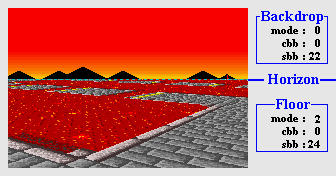
    <br>
    <b>{*@fig:img-bg-switch}</b>: Switch video-mode and background parameters at the horizon.
  </div>

  <div class="cpt" style="width:450px;">
    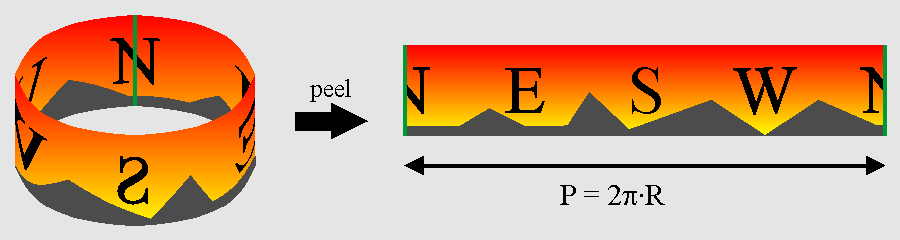
    <br>
    <b>{*@fig:img-pan}</b>: peeling a panoramic view from a cylinder.
  </div>
</div>

### Making and placing the backdrop {#ssec-horz-backdrop}

The space directly above the horizon is for the backdrop. You probably want a nice image of a distant town or tree line over there, not just a boring empty sky. The backdrop offers a panoramic view, which can be considered a map painted on the inside of a cylinder and then peeled off to a normal 2D surface (see @fig:img-pan). The idea is to put that surface on a background and the scroll around.

Vertically, the bottom of the background should connect to the horizon. Because regular backgrounds use wrap-around coordinates this is actually quite easy: place the ground-level of the backdrop at the bottom of a screen-block and set the vertical offset to −*y*<sub>s,h</sub>.

Horizontally, there are several issues to be aware of. The first is the width of the map, which is simply the perimeter _P_ of the cylinder. As we should have a scrolled a full map's width for a 360° rotation, the correct scroll ratio per unit angle is simply _P_/2π = *R*, the radius. In principle, _R_ is arbitrary, but the best result can be had when the field of view formed by the angle of the panorama (α<sub>p</sub> = *W*/_R_), is equal to the camera field-of-view angle α<sub>c</sub> from @eq:fov-cam. If all is right we should have α<sub>p</sub> = α<sub>c</sub> = α.

<table id="eq:fov">
<tr>
  <td class="eqnrcell">({!@eq:fov})
  <td class="eqcell">
    <math xmlns="http://www.w3.org/1998/Math/MathML" display="block">
      <mstyle displaystyle="true" scriptlevel="0">
        <mrow data-mjx-texclass="ORD">
          <mtable rowspacing=".5em" columnspacing="1em" displaystyle="true">
            <mtr>
              <mtd>
                <mtable displaystyle="true" columnalign="right left" columnspacing="0em" rowspacing="3pt">
                  <mtr>
                    <mtd>
                      <mi>&#x3B1;</mi>
                    </mtd>
                    <mtd>
                      <mi></mi>
                      <mo>=</mo>
                      <mn>2</mn>
                      <mtext>&#xA0;</mtext>
                      <mo>&#x22C5;</mo>
                      <mtext>&#xA0;</mtext>
                      <mi>arctan</mi>
                      <mo data-mjx-texclass="NONE">&#x2061;</mo>
                      <mrow>
                        <mo data-mjx-texclass="OPEN">(</mo>
                        <mfrac>
                          <mi>&frac12; W</mi>
                          <mrow>
                            <mi>D</mi>
                          </mrow>
                        </mfrac>
                        <mo data-mjx-texclass="CLOSE">)</mo>
                      </mrow>
                    </mtd>
                  </mtr>
                  <mtr>
                    <mtd>
                      <mi>&#x3B1;</mi>
                    </mtd>
                    <mtd style="text-align: left">
                      <mi></mi>
                      <mo>=</mo>
                      <mfrac>
                        <mi>W</mi>
                        <mi>R</mi>
                      </mfrac>
                      <!-- <mrow data-mjx-texclass="ORD">
                        <mo>/</mo>
                      </mrow>
                      <mi>R</mi> -->
                    </mtd>
                  </mtr>
                  <mtr>
                    <mtd>
                      <mi>R</mi>
                    </mtd>
                    <mtd style="text-align: left;">
                      <mi></mi>
                      <mo>=</mo>
                      <mfrac>
                        <mi>&frac12; W</mi>
                        <mrow>
                          <mi>arctan</mi>
                          <mo data-mjx-texclass="NONE">&#x2061;</mo>
                          <mrow>
                            <mo data-mjx-texclass="OPEN">(</mo>
                            <mfrac>
                              <mi>&frac12; W</mi>
                              <mi>D</mi>
                            </mfrac>
                            <mo data-mjx-texclass="CLOSE">)</mo>
                          </mrow>
                        </mrow>
                      </mfrac>
                    </mtd>
                  </mtr>
                  <mtr>
                    <mtd></mtd>
                    <mtd style="text-align: left;">
                      <mi></mi>
                      <mo>&#x2248;</mo>
                      <mfrac>
                        <mi>D</mi>
                        <mrow>
                          <mn>1</mn>
                          <mo>&#x2212;</mo>
                          <mo stretchy="false">(</mo>
                          <mfrac>
                            <mi>&frac12; W</mi>
                            <mi>D</mi>
                          </mfrac>
                          <msup>
                            <mo stretchy="false">)</mo>
                            <mn>2</mn>
                          </msup>
                          <mtext>&#xA0;</mtext>
                          <mrow data-mjx-texclass="ORD">
                            <mo>/</mo>
                          </mrow>
                          <mtext>&#xA0;</mtext>
                          <mn>3</mn>
                        </mrow>
                      </mfrac>
                    </mtd>
                  </mtr>
                </mtable>
              </mtd>
            </mtr>
          </mtable>
        </mrow>
      </mstyle>
    </math>
</table>

That last approximation stems from the first couple of terms of the [Taylor series](https://en.wikipedia.org/wiki/Taylor's_theorem){target="\_blank"} of the arctangent. Interestingly enough, even _R_ ≈ _D_ seems somewhat adequate. Anyway, filling in *W* = 240 and *D* = 256 gives *P* = 1720, which isn't a very convenient map size, is it? Now, it is possible to create a map of any size and update VRAM if we go outside the screenblock's boundaries (commercial games do it all the time), but doing so would distract for the subject at hand, so you know what? We're going to bend the rules a bit and just force *P* = 1024.

“Wait a sec ... you can't do that!” Well, yes I can actually. I'm not _supposed_ to do it, but that's another issue. The fact of the matter is that, I don't think there is a _single_ mode 7 game that scrolls the backdrop properly! For example, the Mario Kart's often use multiple backgrounds with different scrolling speeds in their backdrops, which is absolutely ridiculous, mathematically speaking, because looking around doesn't change relative lines of sight. But I guess nobody noticed or at least nobody cares. What I'm trying to say is: we're in good company <kbd>:P</kbd>

So, we just define a perimeter value and with it backdrop map-width ourselves. In this case I'm going to use *P* = 1024, which is a nice round number and for which we can use a 512 px wide tile-map will effectively end up as a panorama with 180° rotational symmetry. Taking into account the circle partitioning of 2π ⇔ 10000h, the scrolling value is simply φ\*_P_/10000h = φ/64. We'll have to offset this by _L_ as well because I want to map φ = 0 to due north. The final position of the backdrop is given in {!@eq:bd-pos}.

<table id="eq:bd-pos">
<tr>
  <td class="eqnrcell">({!@eq:bd-pos})
  <td class="eqcell">
    <math xmlns="http://www.w3.org/1998/Math/MathML" display="block">
      <mstyle displaystyle="true" scriptlevel="0">
        <mrow data-mjx-texclass="ORD">
          <mtable rowspacing=".5em" columnspacing="1em" displaystyle="true">
            <mtr>
              <mtd>
                <mtable displaystyle="true" columnalign="right left" columnspacing="0em" rowspacing="3pt">
                  <mtr>
                    <mtd>
                      <mi>d</mi>
                      <mi>x</mi>
                    </mtd>
                    <mtd>
                      <mi></mi>
                      <mo>=</mo>
                      <mi>&#x3C6;</mi>
                      <mrow data-mjx-texclass="ORD">
                        <mo>/</mo>
                      </mrow>
                      <mn>64</mn>
                      <mo>+</mo>
                      <mi>L</mi>
                    </mtd>
                  </mtr>
                  <mtr>
                    <mtd>
                      <mi>d</mi>
                      <mi>y</mi>
                    </mtd>
                    <mtd style="text-align: left;">
                      <mi></mi>
                      <mo>=</mo>
                      <mo>&#x2212;</mo>
                      <msub>
                        <mi>y</mi>
                        <mrow data-mjx-texclass="ORD">
                          <mi>s</mi>
                          <mo>,</mo>
                          <mi>h</mi>
                        </mrow>
                      </msub>
                    </mtd>
                  </mtr>
                </mtable>
              </mtd>
            </mtr>
          </mtable>
        </mrow>
      </mstyle>
    </math>
</table>

## The floor {#sec-flr}

### Affine parameters for the floor {#ssec-flr-parms}

{\*@eq:m7-main} describes the world↔screen transformation but that information uses 3D vectors, while the GBA only has a 2×2 affine matrix **P** and a 2D displacement vector **dx** at its disposal. So we have some rewriting to do. Now, I could give you the full derivation, 2d↔3d conversions and all, but something tells me you really don't want to see that. So instead, I'll give you the set of equations you need to solve, and hints on how to do that.

<table id="eq:m7-set">
<tr>
  <td class="eqnrcell">({!@eq:m7-set})
  <td class="eqcell">
    <math xmlns="http://www.w3.org/1998/Math/MathML" display="block">
      <mstyle displaystyle="true" scriptlevel="0">
        <mrow data-mjx-texclass="ORD">
          <mtable rowspacing=".5em" columnspacing="1em" displaystyle="true">
            <mtr>
              <mtd>
                <mtable displaystyle="true" columnalign="right left" columnspacing="0em" rowspacing="3pt">
                  <mtr>
                    <mtd>
                      <mi>&#x3BB;</mi>
                      <mi>C</mi>
                      <mtext>&#xA0;</mtext>
                      <mo>&#x22C5;</mo>
                      <mtext>&#xA0;</mtext>
                      <msub>
                        <mi>x</mi>
                        <mi>p</mi>
                      </msub>
                    </mtd>
                    <mtd style="text-align: left;">
                      <mi></mi>
                      <mo>=</mo>
                      <msub>
                        <mi>x</mi>
                        <mi>w</mi>
                      </msub>
                      <mo>&#x2212;</mo>
                      <msub>
                        <mi>a</mi>
                        <mrow data-mjx-texclass="ORD">
                          <mi>c</mi>
                          <mi>w</mi>
                        </mrow>
                      </msub>
                    </mtd>
                  </mtr>
                  <mtr>
                    <mtd>
                      <mi>S</mi>
                      <mo stretchy="false">(</mo>
                      <mn>1</mn>
                      <mo>,</mo>
                      <mo>&#x2212;</mo>
                      <mn>1</mn>
                      <mo>,</mo>
                      <mn>1</mn>
                      <mo stretchy="false">)</mo>
                      <mtext>&#xA0;</mtext>
                      <mo>&#x22C5;</mo>
                      <mtext>&#xA0;</mtext>
                      <msub>
                        <mi>x</mi>
                        <mi>s</mi>
                      </msub>
                    </mtd>
                    <mtd style="text-align: left;">
                      <mi></mi>
                      <mo>=</mo>
                      <mo stretchy="false">(</mo>
                      <msub>
                        <mi>x</mi>
                        <mi>p</mi>
                      </msub>
                      <mo>&#x2212;</mo>
                      <msub>
                        <mi>a</mi>
                        <mrow data-mjx-texclass="ORD">
                          <mi>s</mi>
                          <mi>p</mi>
                        </mrow>
                      </msub>
                      <mo stretchy="false">)</mo>
                    </mtd>
                  </mtr>
                  <mtr>
                    <mtd>
                      <mi>P</mi>
                      <mtext>&#xA0;</mtext>
                      <mo>&#x22C5;</mo>
                      <mtext>&#xA0;</mtext>
                      <mi>q</mi>
                    </mtd>
                    <mtd style="text-align: left;">
                      <mi></mi>
                      <mo>=</mo>
                      <mi>p</mi>
                      <mo>&#x2212;</mo>
                      <mi>d</mi>
                      <mi>x</mi>
                    </mtd>
                  </mtr>
                </mtable>
              </mtd>
            </mtr>
          </mtable>
        </mrow>
      </mstyle>
    </math>
</table>

The first two equations are just {@eq:m7-main} again, I just them list for completeness. The last equation is the relation between screen point **q** and map point **p** for an affine map, an equation that should be familiar by now. Now, remember that our map lies on the floor, in other words **p** = (_x_<sub>w</sub>, *z*<sub>w</sub>). The 2D screen point **q** is, of course, similar to the 3D screen vector of **x**<sub>s</sub>. The only thing that you have to remember is that when writing to `REG_BGxY`, the left of the current scanline is taken as the origin, so that effectively **q** = (_x_<sub>s</sub>, 0), which in turn means that _p_<sub>b</sub> and _p_<sub>d</sub> are of no consequence. The values of the other elements of **P** are simply the _x_- and _z_-components of the scaled camera x-axis, λ**u**. If you use these values, you will see that eventually you will end up with an expression that can best be summed up by:

<table id="eq:m7-ofs">
<tr>
  <td class="eqnrcell">({!@eq:m7-ofs})
  <td class="eqcell">
    <math xmlns="http://www.w3.org/1998/Math/MathML" display="block">
      <mstyle displaystyle="true" scriptlevel="0">
        <mrow data-mjx-texclass="ORD">
          <mtable rowspacing=".5em" columnspacing="1em" displaystyle="true">
            <mtr>
              <mtd>
                <mtable displaystyle="true" columnalign="right" columnspacing="" rowspacing="3pt">
                  <mtr>
                    <mtd>
                      <mi>d</mi>
                      <msup>
                        <mi>x</mi>
                        <mo data-mjx-alternate="1">&#x2032;</mo>
                      </msup>
                      <mo>=</mo>
                      <msub>
                        <mi>a</mi>
                        <mrow data-mjx-texclass="ORD">
                          <mi>c</mi>
                          <mi>w</mi>
                        </mrow>
                      </msub>
                      <mo>+</mo>
                      <mi>&#x3BB;</mi>
                      <mi>C</mi>
                      <mtext>&#xA0;</mtext>
                      <mo>&#x22C5;</mo>
                      <mtext>&#xA0;</mtext>
                      <mi>b</mi>
                    </mtd>
                  </mtr>
                </mtable>
              </mtd>
            </mtr>
          </mtable>
        </mrow>
      </mstyle>
    </math>
</table>

where

<div class="lblock">
  <math xmlns="http://www.w3.org/1998/Math/MathML" display="block">
    <mstyle displaystyle="true" scriptlevel="0">
      <mrow data-mjx-texclass="ORD">
        <mtable rowspacing=".5em" columnspacing="1em" displaystyle="true">
          <mtr>
            <mtd>
              <mtable displaystyle="true" columnalign="right left" columnspacing="0em" rowspacing="3pt">
                <mtr>
                  <mtd>
                    <mi>d</mi>
                    <msup>
                      <mi>x</mi>
                      <mo data-mjx-alternate="1">&#x2032;</mo>
                    </msup>
                  </mtd>
                  <mtd style="text-align: left;">
                    <mi></mi>
                    <mo>=</mo>
                    <mo stretchy="false">(</mo>
                    <mi>d</mi>
                    <mi>x</mi>
                    <mo>,</mo>
                    <mtext>&#xA0;</mtext>
                    <mn>0</mn>
                    <mo>,</mo>
                    <mtext>&#xA0;</mtext>
                    <mi>d</mi>
                    <mi>y</mi>
                    <mo stretchy="false">)</mo>
                  </mtd>
                </mtr>
                <mtr>
                  <mtd>
                    <mi>b</mi>
                  </mtd>
                  <mtd>
                    <mi></mi>
                    <mo>=</mo>
                    <mo stretchy="false">(</mo>
                    <mi>L</mi>
                    <mo>,</mo>
                    <mtext>&#xA0;</mtext>
                    <mi>T</mi>
                    <mo>&#x2212;</mo>
                    <msub>
                      <mi>y</mi>
                      <mrow data-mjx-texclass="ORD">
                        <msup>
                          <mi>s</mi>
                          <mo data-mjx-alternate="1">&#x2032;</mo>
                        </msup>
                      </mrow>
                    </msub>
                    <mo>,</mo>
                    <mo>&#x2212;</mo>
                    <mi>D</mi>
                    <mo stretchy="false">)</mo>
                  </mtd>
                </mtr>
              </mtable>
            </mtd>
          </mtr>
        </mtable>
      </mrow>
    </mstyle>
  </math>
</div>

Everything you need for the displacement is neatly packed into this one equation, now we need to disassemble it to construct the algorithm. First, we can use the _y_-component of **dx'** to calculate λ. Once we have that we can use it to calculate the other two elements, i.e., the actual affine offsets. The affine matrix was already given earlier.

{\*@eq:m7-sum} gives all the relations explicitly, though I hope you'll forgive me when I prefer the conciseness of {@eq:m7-ofs} myself.

<table id="eq:m7-sum">
<col span=2 align="right">
<tr>
  <td rowspan=5 class="eqnrcell">({!@eq:m7-sum})
  <td>
    <math xmlns="http://www.w3.org/1998/Math/MathML" display="block">
      <mstyle displaystyle="true" scriptlevel="0">
        <mrow data-mjx-texclass="ORD">
          <mtable rowspacing=".5em" columnspacing="1em" displaystyle="true">
            <mtr>
              <mtd>
                <mtable displaystyle="true" columnalign="right left" columnspacing="0em" rowspacing="3pt">
                  <mtr>
                    <mtd>
                      <mi>&#x3BB;</mi>
                    </mtd>
                    <mtd style="text-align: left;">
                      <mi></mi>
                      <mo>=</mo>
                      <msub>
                        <mi>a</mi>
                        <mrow data-mjx-texclass="ORD">
                          <mi>c</mi>
                          <mi>w</mi>
                          <mo>,</mo>
                          <mi>y</mi>
                        </mrow>
                      </msub>
                      <mtext>&#xA0;</mtext>
                      <mrow data-mjx-texclass="ORD">
                        <mo>/</mo>
                      </mrow>
                      <mtext>&#xA0;</mtext>
                      <mo stretchy="false">(</mo>
                      <mo stretchy="false">(</mo>
                      <msub>
                        <mi>y</mi>
                        <mi>s</mi>
                      </msub>
                      <mo>&#x2212;</mo>
                      <mi>T</mi>
                      <mo stretchy="false">)</mo>
                      <msub>
                        <mi>v</mi>
                        <mi>y</mi>
                      </msub>
                      <mtext>&#xA0;</mtext>
                      <mo>+</mo>
                      <mi>D</mi>
                      <msub>
                        <mi>w</mi>
                        <mi>y</mi>
                      </msub>
                      <mo stretchy="false">)</mo>
                    </mtd>
                  </mtr>
                  <mtr>
                    <mtd>
                      <msub>
                        <mi>p</mi>
                        <mi>a</mi>
                      </msub>
                    </mtd>
                    <mtd style="text-align: left;">
                      <mi></mi>
                      <mo>=</mo>
                      <mi>&#x3BB;</mi>
                      <mtext>&#xA0;</mtext>
                      <msub>
                        <mi>u</mi>
                        <mi>x</mi>
                      </msub>
                    </mtd>
                  </mtr>
                  <mtr>
                    <mtd>
                      <msub>
                        <mi>p</mi>
                        <mi>c</mi>
                      </msub>
                    </mtd>
                    <mtd style="text-align: left;">
                      <mi></mi>
                      <mo>=</mo>
                      <mi>&#x3BB;</mi>
                      <mtext>&#xA0;</mtext>
                      <msub>
                        <mi>u</mi>
                        <mi>z</mi>
                      </msub>
                    </mtd>
                  </mtr>
                  <mtr>
                    <mtd>
                      <mi>d</mi>
                      <mi>x</mi>
                    </mtd>
                    <mtd style="text-align: left;">
                      <mi></mi>
                      <mo>=</mo>
                      <msub>
                        <mi>a</mi>
                        <mrow data-mjx-texclass="ORD">
                          <mi>c</mi>
                          <mi>w</mi>
                          <mo>,</mo>
                          <mi>x</mi>
                        </mrow>
                      </msub>
                      <mtext>&#xA0;</mtext>
                      <mo>+</mo>
                      <mtext>&#xA0;</mtext>
                      <mi>&#x3BB;</mi>
                      <mo stretchy="false">(</mo>
                      <mi>L</mi>
                      <msub>
                        <mi>u</mi>
                        <mi>x</mi>
                      </msub>
                      <mtext>&#xA0;</mtext>
                      <mo>+</mo>
                      <mtext>&#xA0;</mtext>
                      <mo stretchy="false">(</mo>
                      <mi>T</mi>
                      <mo>&#x2212;</mo>
                      <msub>
                        <mi>y</mi>
                        <mi>s</mi>
                      </msub>
                      <mo stretchy="false">)</mo>
                      <msub>
                        <mi>v</mi>
                        <mi>x</mi>
                      </msub>
                      <mtext>&#xA0;</mtext>
                      <mo>&#x2212;</mo>
                      <mi>D</mi>
                      <msub>
                        <mi>w</mi>
                        <mi>x</mi>
                      </msub>
                      <mo stretchy="false">)</mo>
                    </mtd>
                  </mtr>
                  <mtr>
                    <mtd>
                      <mi>d</mi>
                      <mi>y</mi>
                    </mtd>
                    <mtd style="text-align: left;">
                      <mi></mi>
                      <mo>=</mo>
                      <msub>
                        <mi>a</mi>
                        <mrow data-mjx-texclass="ORD">
                          <mi>c</mi>
                          <mi>w</mi>
                          <mo>,</mo>
                          <mi>z</mi>
                        </mrow>
                      </msub>
                      <mtext>&#xA0;</mtext>
                      <mo>+</mo>
                      <mtext>&#xA0;</mtext>
                      <mi>&#x3BB;</mi>
                      <mo stretchy="false">(</mo>
                      <mi>L</mi>
                      <msub>
                        <mi>u</mi>
                        <mi>z</mi>
                      </msub>
                      <mtext>&#xA0;</mtext>
                      <mo>+</mo>
                      <mtext>&#xA0;</mtext>
                      <mo stretchy="false">(</mo>
                      <mi>T</mi>
                      <mo>&#x2212;</mo>
                      <msub>
                        <mi>y</mi>
                        <mi>s</mi>
                      </msub>
                      <mo stretchy="false">)</mo>
                      <msub>
                        <mi>v</mi>
                        <mi>z</mi>
                      </msub>
                      <mo>&#x2212;</mo>
                      <mi>D</mi>
                      <msub>
                        <mi>w</mi>
                        <mi>z</mi>
                      </msub>
                      <mo stretchy="false">)</mo>
                    </mtd>
                  </mtr>
                </mtable>
              </mtd>
            </mtr>
          </mtable>
        </mrow>
      </mstyle>
    </math>
</table>

Note that if we take the top at 0 and no pitch (_T_=0 and θ=0) we have exactly the same result as in the first mode 7 chapter, and if we look straight down (θ=90°), the whole thing reduces to a simple scaling/rotation around point (−*L, T*), which is exactly it should be. {\*@eq:m7-sum} is the general equation for mode 7; for the implementation, you can often make a number of shortcuts that speed up calculation, but well get to that [later](#eq-aff-calc).

### Distance fogging {#ssec-flr-fog}

In the real world, light coming from far away objects has to travel through the atmosphere, which scatters the photons, attenuating the beam. What you'll end up seeing is partly the object itself and partly the ambient color, and the further the original object, the smaller its contribution is. Because such effect is most easily visible in fog conditions, I'll call this effect <dfn>fogging</dfn>.

Fogging offers a hint of distance and including it can increase the sense of depth. Also, it can hide objects popping into view as they're loaded. GBA-wise, it can be implemented by using different alpha-blends at every scanline.

The fundamental equation for this is the following differential equation:

<math xmlns="http://www.w3.org/1998/Math/MathML" display="block">
  <mstyle displaystyle="true" scriptlevel="0">
    <mrow data-mjx-texclass="ORD">
      <mtable rowspacing=".5em" columnspacing="1em" displaystyle="true">
        <mtr>
          <mtd>
            <mtable displaystyle="true" columnalign="right" columnspacing="" rowspacing="3pt">
              <mtr>
                <mtd>
                  <mi>d</mi>
                  <mi>I</mi>
                  <mo>=</mo>
                  <mo>&#x2212;</mo>
                  <mi>I</mi>
                  <mtext>&#xA0;</mtext>
                  <mi>k</mi>
                  <mo stretchy="false">(</mo>
                  <mi>&#x3BD;</mi>
                  <mo stretchy="false">)</mo>
                  <mtext>&#xA0;</mtext>
                  <mi>&#x3C1;</mi>
                  <mtext>&#xA0;</mtext>
                  <mi>d</mi>
                  <mi>z</mi>
                </mtd>
              </mtr>
            </mtable>
          </mtd>
        </mtr>
      </mtable>
    </mrow>
  </mstyle>
</math>

where _I_ is the intensity; _k_(ν) is the absorption coefficient of the medium, which depends on the frequency of the light, ν and possibly position; ρ is the density and _z_ is the distance. Solving this would lead to an exponential decay over distance. And I do mean real distance, with squares and roots and everything.

Fortunately, we don't have to use something that complicated; all we really need is some functional relation that gives 0 at infinity and 1 close up. Interestingly enough, we already have something like that, namely λ as function of the scanline (see {!@eq:m7-sum}). This is basically a hyperbola, all you have to do then is fiddle with scalers and offsets a bit to get something that looks nice. In my case, λ\*6/16 seems to work well enough.

<div class="cblock">
  <table class="bdr" id="fig:img-fog" border=0 cellpadding=2 cellspacing=2>
    <tr>
      <td> 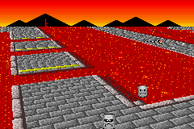 </td>
      <td> 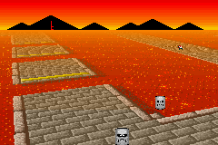 </td>
    </tr>
    <tr>
      <td>
        <b>{*@fig:img-fog}</b>: fog off (left) and on (right).
      </td>
    </tr>
  </table>
</div>

{\*@fig:img-fog} shows screenshots with and without the fogging effect as seen from a fairly high altitude. The distance to the floor is relatively small at the bottom of the screen, so those are still very visible. At the horizon, the floor is completely obscured by the orange fog; which is actually a good thing, as the lines near the horizon are usually not much to look at anyway.

By the way, note that I said _orange_ fog. If you'd paid attention in the [graphics effects](gfx.html#sec-blend) chapter will know that the GBA only has fading modes for white and black. Nevertheless, fades to an arbitrary color are very much possible, but I'll explain once we get to the implementation. While you ponder over how it can be done, I'll move on to 3D sprites.

## Sprites {#sec-objs}

Sprites and 3D are a strange combination. By their very nature, sprites are 2D objects – like stickers stuck against the viewport (i.e., the screen). To make them appear part of the 3D world, you have to make them move over the screen in such a way that they appear to move with the world and scale them according to their distance. Once again, the basic of this is @eq:m7-main, but there is considerably more to it.

Four topics must be covered here. The first is sprite **positioning**. {\*@eq:m7-main} will work at point/pixel level, and a sprite is a simple rectangle. While it's possible to rewrite the sprite's pixels to work around that, it kind of defeats the purpose of using sprites in the first place. Instead, we'll link one point on the object to the world coordinate of the sprite and set the OAM position and matrix to accommodate this. This is basically the theory of [anchoring](affobj.html#sec-combo) discussed in the affine object chapter.

Next up: sprite **culling**. Once you have the correct OAM positions you can't use them as is, you have to make sure the sprite is only active if it is actually visible inside the viewport. If not, it should be disabled.

Then there's the matter of sprite **animation**. Consider Toad's kart in {@fig:img-m7-obj}, which has the correct anchored position, but no matter which angle you look at it, it'll always show the same side. To make it look as if you can actually move around the object, we'll use different frames of animation to show different sides.

Lastly, sprite **sorting**. By default, objects will be ordered according to the objects' numbers: obj 0 over obj 1, over obj 2, etc. Always linking a sprite to the same object means that the order would be wrong if you look at them from the other side, so we need to sort them by distance.

Those are the main issues to deal with. There are a few others, like placing a shadow, and using pre-scaled objects to get around the hardware limitation of 32 affine matrices, but these are fairly easy if the other points are already taken care of. One thing I will discuss as well is what I call object **normalization**: applying an extra scaling for objects so that they don't grow too big for their clipping rectangle.

<table id="fig:img-m7-obj" class="bdr" style="width:512px; margin:10px auto;" border=0 cellpadding=2 cellspacing=0>
  <tr>
    <td>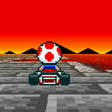</td>
    <td>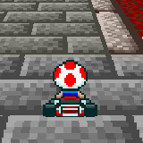</td>
    <td></td>
  </tr>
  <tr>
    <td colspan=3>
      <b>{*@fig:img-m7-obj}</b>: anchored sprite. The position is good, but no matter how you turn, Toad always turns away. Maybe it's the hat.
    </td>
  </tr>
</table>

### Positioning and anchoring {#ssec-obj-pos}

Positioning sprites consists of two facets. The first is to transform the sprites world position **x**<sub>w</sub> to a position on the screen **x**<sub>s</sub>. After that, you need to use that point to determine the most appropriate OAM coordinates.

The first part is just another application of {@eq:m7-main} again, only in reverse. Normally, inverting 3D matrix is a particularly un-fun process, but the camera matrix happens to be an orthonormal matrix. An <dfn>orthonormal matrix</dfn> is a matrix of which the component vectors are orthogonal (perpendicular to each other) and have a length of 1. The neat thing about an orthonormal matrix is that its inverse is simply its transpose: **C**<sup>−1</sup> = **C**<sup>T</sup>. That leads us to the following equations:

<table id="eq:obj-w2s">
  <tr>
    <td class="eqnrcell">({!@eq:obj-w2s})
    <td class="eqcell">
      <math xmlns="http://www.w3.org/1998/Math/MathML" display="block">
        <mstyle displaystyle="true" scriptlevel="0">
          <mrow data-mjx-texclass="ORD">
            <mtable rowspacing=".5em" columnspacing="1em" displaystyle="true">
              <mtr>
                <mtd>
                  <mtable displaystyle="true" columnalign="right left" columnspacing="0em" rowspacing="3pt">
                    <mtr>
                      <mtd>
                        <msub>
                          <mi>x</mi>
                          <mi>p</mi>
                        </msub>
                      </mtd>
                      <mtd style="text-align: left;">
                        <mi></mi>
                        <mo>=</mo>
                        <msup>
                          <mi>C</mi>
                          <mi>T</mi>
                        </msup>
                        <mtext>&#xA0;</mtext>
                        <mo>&#x22C5;</mo>
                        <mtext>&#xA0;</mtext>
                        <mo stretchy="false">(</mo>
                        <msub>
                          <mi>x</mi>
                          <mi>w</mi>
                        </msub>
                        <mo>&#x2212;</mo>
                        <msub>
                          <mi>a</mi>
                          <mrow data-mjx-texclass="ORD">
                            <mi>c</mi>
                            <mi>w</mi>
                          </mrow>
                        </msub>
                        <mo stretchy="false">)</mo>
                        <mrow data-mjx-texclass="ORD">
                          <mo>/</mo>
                        </mrow>
                        <mi>&#x3BB;</mi>
                      </mtd>
                    </mtr>
                    <mtr>
                      <mtd>
                        <msub>
                          <mi>x</mi>
                          <mi>s</mi>
                        </msub>
                      </mtd>
                      <mtd>
                        <mi></mi>
                        <mo>=</mo>
                        <mi>S</mi>
                        <mo stretchy="false">(</mo>
                        <mn>1</mn>
                        <mo>,</mo>
                        <mo>&#x2212;</mo>
                        <mn>1</mn>
                        <mo>,</mo>
                        <mn>1</mn>
                        <mo stretchy="false">)</mo>
                        <mtext>&#xA0;</mtext>
                        <mo>&#x22C5;</mo>
                        <mtext>&#xA0;</mtext>
                        <mo stretchy="false">(</mo>
                        <msub>
                          <mi>x</mi>
                          <mi>p</mi>
                        </msub>
                        <mo>&#x2212;</mo>
                        <msub>
                          <mi>a</mi>
                          <mrow data-mjx-texclass="ORD">
                            <mi>s</mi>
                            <mi>p</mi>
                          </mrow>
                        </msub>
                        <mo stretchy="false">)</mo>
                      </mtd>
                    </mtr>
                  </mtable>
                </mtd>
              </mtr>
            </mtable>
          </mrow>
        </mstyle>
      </math>
</table>

The only real unknown here is λ, which we can calculate by using the fact that _z_<sub>p</sub> = −*D*. Now let the distance between camera and sprite be **r** = **x**<sub>w</sub> − **a**<sub>cw</sub>; using **C** = \[**u v w**\], we find

<math xmlns="http://www.w3.org/1998/Math/MathML" display="block">
  <mstyle displaystyle="true" scriptlevel="0">
    <mrow data-mjx-texclass="ORD">
      <mtable rowspacing=".5em" columnspacing="1em" displaystyle="true">
        <mtr>
          <mtd>
            <mtable displaystyle="true" columnalign="right left" columnspacing="0em" rowspacing="3pt">
              <mtr>
                <mtd>
                  <mi>&#x3BB;</mi>
                </mtd>
                <mtd>
                  <mi></mi>
                  <mo>=</mo>
                  <mo>&#x2212;</mo>
                  <mi>w</mi>
                  <mo>&#x22C5;</mo>
                  <mi>r</mi>
                  <mrow data-mjx-texclass="ORD">
                    <mo>/</mo>
                  </mrow>
                  <mi>D</mi>
                </mtd>
              </mtr>
              <mtr>
                <mtd>
                  <msub>
                    <mi>x</mi>
                    <mi>p</mi>
                  </msub>
                </mtd>
                <mtd style="text-align: left;">
                  <mi></mi>
                  <mo>=</mo>
                  <mi>u</mi>
                  <mo>&#x22C5;</mo>
                  <mi>r</mi>
                  <mrow data-mjx-texclass="ORD">
                    <mo>/</mo>
                  </mrow>
                  <mi>&#x3BB;</mi>
                </mtd>
              </mtr>
              <mtr>
                <mtd>
                  <msub>
                    <mi>y</mi>
                    <mi>p</mi>
                  </msub>
                </mtd>
                <mtd style="text-align: left;">
                  <mi></mi>
                  <mo>=</mo>
                  <mi>v</mi>
                  <mo>&#x22C5;</mo>
                  <mi>r</mi>
                  <mrow data-mjx-texclass="ORD">
                    <mo>/</mo>
                  </mrow>
                  <mi>&#x3BB;</mi>
                </mtd>
              </mtr>
            </mtable>
          </mtd>
        </mtr>
      </mtable>
    </mrow>
  </mstyle>
</math>

<div class="cpt_fr" style="width:88px;">
  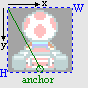
  <br>
  <b>{*@fig:img-anchor}</b>: a 32&times;32 sprite, with the anchor <b>p</b><sub>0</sub> relative to the top-left.
</div>

Finding the screen position of **x**<sub>w</sub> is trivial after that. And now the anchoring part. Instead of stickers, think of objects as pieces of pater to be tacked onto a board (i.e., the screen). The tack goes through one spot of the object, and that spot is fixed to the board. That spot is the <dfn>anchor</dfn>. For affine objects it's not quite as simple as that, because we have to specify OAM coordinates rather than anchor coords, so there is some math involved in how to express the OAM coordinates **x** in terms of the texture anchor **p**<sub>0</sub> and the screen anchor **q**<sub>0</sub>. This theory was covered in the [affine object](affobj.html#sec-combo) chapter, which led to @eq:anchor. The other quantities there are size of the objects, **s** = (_w_, *h*), and _m_ which is ½ for normal affine objects and 1 for double-size affine objects.

<table id="eq:anchor">
  <tr>
    <td class="eqnrcell">({!@eq:anchor})
    <td class="eqcell">
      <math xmlns="http://www.w3.org/1998/Math/MathML" display="block">
        <mstyle displaystyle="true" scriptlevel="0">
          <mrow data-mjx-texclass="ORD">
            <mtable rowspacing=".5em" columnspacing="1em" displaystyle="true">
              <mtr>
                <mtd>
                  <mtable displaystyle="true" columnalign="right" columnspacing="" rowspacing="3pt">
                    <mtr>
                      <mtd>
                        <mi>x</mi>
                        <mo>=</mo>
                        <msub>
                          <mi>q</mi>
                          <mn>0</mn>
                        </msub>
                        <mo>&#x2212;</mo>
                        <mi>m</mi>
                        <mi>s</mi>
                        <mo>&#x2212;</mo>
                        <msup>
                          <mi>P</mi>
                          <mrow data-mjx-texclass="ORD">
                            <mo>&#x2212;</mo>
                            <mn>1</mn>
                          </mrow>
                        </msup>
                        <mtext>&#xA0;</mtext>
                        <mo>&#x22C5;</mo>
                        <mtext>&#xA0;</mtext>
                        <mo stretchy="false">(</mo>
                        <msub>
                          <mi>p</mi>
                          <mn>0</mn>
                        </msub>
                        <mo>&#x2212;</mo>
                        <mi>&frac12; s</mi>
                        <mo stretchy="false">)</mo>
                      </mtd>
                    </mtr>
                  </mtable>
                </mtd>
              </mtr>
            </mtable>
          </mrow>
        </mstyle>
      </math>
</table>

Now the task is to link the data we have to this equation. The screen anchor **q**<sub>0</sub> is just **x**<sub>s</sub>. The texture anchor **p**<sub>0</sub> is the pixel in texture space you want to keep fixed and is yours to choose. For the kart-sprite, it makes sense to put it near the bottom of the kart, as is depicted in @fig:img-anchor. ‘Vector’ **s** is given by the size of the object, which in this case is (32, 32) and because I'm choosing to always use double-size objects here, _m_=1. The **P**-matrix is just a scaling by λ, unless you want to add other things as well. All that remains then is just to fill it in the numbers.

### Sprite culling {#ssec-obj-cull}

<div class="cpt_fr" style="width:308px;">
  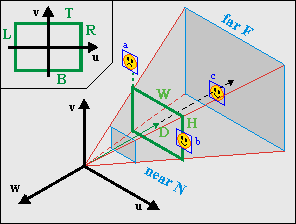
  <br>
  <b>{*@fig:img-vp-obj}</b>: View-frustum with sprites <i>a</i>, <i>b</i> and <i>c</i>. <i>b</i> and <i>c</i> are visible, <i>a</i> is not.
</div>

<dfn>Culling</dfn> is the process removing any part of the world that cannot be seen. In this case, it means removing those sprites that do not fall within the viewing volume. This is a very smart thing to do, and it makes even more sense for sprites, because not doing so would seriously screw things up because OAM couldn't cope with the possible range of **x**<sub>s</sub>.

The first thing to do would be a distance check: if the object is too far away, it should not be seen. It's also a good idea to have a near-plane distance check. Then you have to test it for intersections with the viewport. Each sprite is bounded by a certain rectangle on the projection plane and if this is completely outside the viewport, the object should not be rendered.

{\*@fig:img-vp-obj} shows a few examples of this. Objects _a_ and _b_ have already been projected onto the projection plane. Object _a_ is outside the viewport, and should be disabled. Object _b_ is partially visible and should be rendered. Object _c_ is not projected yet, but falls between the near and far plane and should at least be tested (and then found fully visible).

It's actually easier to do the view volume checks in 3D camera space instead of 2D projection space. The object rectangle can easily be calculated from **x**<sub>c</sub> = **C**<sup>T</sup>·**r**, the anchor **p**<sub>0</sub> and the size **s**. The viewport will have to be scaled by λ, and this gives us the following rests to perform:

<div class="lblock">
  <table id="tbl:culltest" border=1 cellpadding=2 cellspacing=0>
    <caption align="bottom">
      <b>{*@tbl:culltest}</b>: Object rect and culling tests in camera space. Note the signs!
    </caption>
    <tbody>
      <tr>
        <th>&nbsp;</th><th>Object position</th><th>Visible if</th>
      </tr>
      <tr>
        <th> Depth </th>
        <td> 
          <math xmlns="http://www.w3.org/1998/Math/MathML" display="block">
            <mstyle displaystyle="true" scriptlevel="0">
              <mrow data-mjx-texclass="ORD">
                <mtable rowspacing=".5em" columnspacing="1em" displaystyle="true">
                  <mtr>
                    <mtd>
                      <mtable displaystyle="true" columnalign="right" columnspacing="" rowspacing="3pt">
                        <mtr>
                          <mtd>
                            <mi>d</mi>
                            <mo>=</mo>
                            <mo>&#x2212;</mo>
                            <msub>
                              <mi>z</mi>
                              <mi>c</mi>
                            </msub>
                            <mo>=</mo>
                            <mi>w</mi>
                            <mo>&#x22C5;</mo>
                            <mi>r</mi>
                          </mtd>
                        </mtr>
                      </mtable>
                    </mtd>
                  </mtr>
                </mtable>
              </mrow>
            </mstyle>
          </math>
        </td>
        <td>
          <math xmlns="http://www.w3.org/1998/Math/MathML" display="block">
            <mstyle displaystyle="true" scriptlevel="0">
              <mrow data-mjx-texclass="ORD">
                <mtable rowspacing=".5em" columnspacing="1em" displaystyle="true">
                  <mtr>
                    <mtd>
                      <mtable displaystyle="true" columnalign="right" columnspacing="" rowspacing="3pt">
                        <mtr>
                          <mtd>
                            <mi>N</mi>
                            <mo>&#x2264;</mo>
                            <mi>d</mi>
                            <mtext>&#xA0;</mtext>
                            <mi mathvariant="normal">&amp;</mi>
                            <mi mathvariant="normal">&amp;</mi>
                            <mtext>&#xA0;</mtext>
                            <mi>d</mi>
                            <mo>&lt;</mo>
                            <mi>F</mi>
                          </mtd>
                        </mtr>
                      </mtable>
                    </mtd>
                  </mtr>
                </mtable>
              </mrow>
            </mstyle>
          </math>
        </td>
      </tr>
      <tr>
        <th> Horizontal </th>
        <td> 
          <math xmlns="http://www.w3.org/1998/Math/MathML" display="block">
            <mstyle displaystyle="true" scriptlevel="0">
              <mrow data-mjx-texclass="ORD">
                <mtable rowspacing=".5em" columnspacing="1em" displaystyle="true">
                  <mtr>
                    <mtd>
                      <mtable displaystyle="true" columnalign="right" columnspacing="" rowspacing="3pt">
                        <mtr>
                          <mtd>
                            <mi>l</mi>
                            <mo>=</mo>
                            <msub>
                              <mi>x</mi>
                              <mi>c</mi>
                            </msub>
                            <mo>&#x2212;</mo>
                            <msub>
                              <mi>p</mi>
                              <mrow data-mjx-texclass="ORD">
                                <mn>0</mn>
                                <mo>,</mo>
                                <mi>x</mi>
                              </mrow>
                            </msub>
                          </mtd>
                        </mtr>
                      </mtable>
                    </mtd>
                  </mtr>
                </mtable>
              </mrow>
            </mstyle>
          </math>
        </td>
        <td>
          <math xmlns="http://www.w3.org/1998/Math/MathML" display="block">
            <mstyle displaystyle="true" scriptlevel="0">
              <mrow data-mjx-texclass="ORD">
                <mtable rowspacing=".5em" columnspacing="1em" displaystyle="true">
                  <mtr>
                    <mtd>
                      <mtable displaystyle="true" columnalign="right" columnspacing="" rowspacing="3pt">
                        <mtr>
                          <mtd>
                            <mi>&#x3BB;</mi>
                            <mi>L</mi>
                            <mo>&#x2264;</mo>
                            <mi>l</mi>
                            <mo>+</mo>
                            <mi>w</mi>
                            <mtext>&#xA0;</mtext>
                            <mi mathvariant="normal">&amp;</mi>
                            <mi mathvariant="normal">&amp;</mi>
                            <mtext>&#xA0;</mtext>
                            <mi>l</mi>
                            <mo>&lt;</mo>
                            <mi>&#x3BB;</mi>
                            <mi>R</mi>
                          </mtd>
                        </mtr>
                      </mtable>
                    </mtd>
                  </mtr>
                </mtable>
              </mrow>
            </mstyle>
          </math>
        </td>
      </tr>
      <tr>
        <th> Vertical </th>
        <td>
          <math xmlns="http://www.w3.org/1998/Math/MathML" display="block">
            <mstyle displaystyle="true" scriptlevel="0">
              <mrow data-mjx-texclass="ORD">
                <mtable rowspacing=".5em" columnspacing="1em" displaystyle="true">
                  <mtr>
                    <mtd>
                      <mtable displaystyle="true" columnalign="right" columnspacing="" rowspacing="3pt">
                        <mtr>
                          <mtd>
                            <mi>t</mi>
                            <mo>=</mo>
                            <mo>&#x2212;</mo>
                            <msub>
                              <mi>y</mi>
                              <mi>c</mi>
                            </msub>
                            <mo>&#x2212;</mo>
                            <msub>
                              <mi>p</mi>
                              <mrow data-mjx-texclass="ORD">
                                <mn>0</mn>
                                <mo>,</mo>
                                <mi>y</mi>
                              </mrow>
                            </msub>
                          </mtd>
                        </mtr>
                      </mtable>
                    </mtd>
                  </mtr>
                </mtable>
              </mrow>
            </mstyle>
          </math>
        </td>
        <td>
          <math xmlns="http://www.w3.org/1998/Math/MathML" display="block">
            <mstyle displaystyle="true" scriptlevel="0">
              <mrow data-mjx-texclass="ORD">
                <mtable rowspacing=".5em" columnspacing="1em" displaystyle="true">
                  <mtr>
                    <mtd>
                      <mtable displaystyle="true" columnalign="right" columnspacing="" rowspacing="3pt">
                        <mtr>
                          <mtd>
                            <mi>&#x3BB;</mi>
                            <mi>T</mi>
                            <mtext>&#xA0;</mtext>
                            <mo>&#x2264;</mo>
                            <mtext>&#xA0;</mtext>
                            <mi>t</mi>
                            <mo>+</mo>
                            <mi>h</mi>
                            <mtext>&#xA0;</mtext>
                            <mi mathvariant="normal">&amp;</mi>
                            <mi mathvariant="normal">&amp;</mi>
                            <mtext>&#xA0;</mtext>
                            <mi>t</mi>
                            <mo>&lt;</mo>
                            <mo>&#x2212;</mo>
                            <mi>&#x3BB;</mi>
                            <mi>B</mi>
                          </mtd>
                        </mtr>
                      </mtable>
                    </mtd>
                  </mtr>
                </mtable>
              </mrow>
            </mstyle>
          </math> 
        </td>
      </tr>
    </tbody>
  </table>
</div>

If all these conditions are true, then the object should be visible. Now, please note the _signs_ of the tests, particularly in the vertical checks.

### Animation {#ssec-obj-ani}

<div class="cpt_fr" style="width:200px;">
  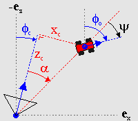
  <br>
  <b>{*@fig:img-psi-def}</b>: Finding the view-angle &psi;.
</div>

Rotation animation, to be precise. As we saw in {@fig:img-m7-obj}, the sprite will show the same side regardless of where you are looking from. This is only logical, as the sprite is not actually a 3D entity. To make it _look_ a little more 3D, we need to have images of the sprite taken from different camera angles, and then pick the one we need depending on which angle we're looking from.

First, finding the correct view angle, ψ. {\*@fig:img-psi-def} shows the general situation. The angle you need is the angle between the vector between the camera and the object (red, dashed) and the global looking direction of the object. In the figure, you can see the global direction angles for the camera and object: φ<sub>c</sub> and φ<sub>o</sub>, respectively. Also indicated is the angle between the camera direction and the sprite, α. If you look at these angles closely, you'll see that φ<sub>c</sub> + α + ψ = φ<sub>o</sub>. In other words:

<table id="eq:psi">
  <tr>
    <td class="eqnrcell">({!@eq:psi}) </td>
    <td class="eqcell">
      <math xmlns="http://www.w3.org/1998/Math/MathML" display="block">
        <mstyle displaystyle="true" scriptlevel="0">
          <mrow data-mjx-texclass="ORD">
            <mtable rowspacing=".5em" columnspacing="1em" displaystyle="true">
              <mtr>
                <mtd>
                  <mtable displaystyle="true" columnalign="right left" columnspacing="0em" rowspacing="3pt">
                    <mtr>
                      <mtd>
                        <mi>&#x3C8;</mi>
                      </mtd>
                      <mtd style="text-align: left;">
                        <mi></mi>
                        <mo>=</mo>
                        <msub>
                          <mi>&#x3C6;</mi>
                          <mrow data-mjx-texclass="ORD">
                            <mn>0</mn>
                          </mrow>
                        </msub>
                        <mo>&#x2212;</mo>
                        <msub>
                          <mi>&#x3C6;</mi>
                          <mrow data-mjx-texclass="ORD">
                            <mi>c</mi>
                          </mrow>
                        </msub>
                        <mo>&#x2212;</mo>
                        <mi>&#x3B1;</mi>
                      </mtd>
                    </mtr>
                    <mtr>
                      <mtd></mtd>
                      <mtd>
                        <mi></mi>
                        <mo>=</mo>
                        <msub>
                          <mi>&#x3C6;</mi>
                          <mrow data-mjx-texclass="ORD">
                            <mn>0</mn>
                          </mrow>
                        </msub>
                        <mo>&#x2212;</mo>
                        <msub>
                          <mi>&#x3C6;</mi>
                          <mrow data-mjx-texclass="ORD">
                            <mi>c</mi>
                          </mrow>
                        </msub>
                        <mo>&#x2212;</mo>
                        <mi>arctan</mi>
                        <mo data-mjx-texclass="NONE">&#x2061;</mo>
                        <mrow>
                          <mo data-mjx-texclass="OPEN">(</mo>
                          <msub>
                            <mi>x</mi>
                            <mi>c</mi>
                          </msub>
                          <mrow data-mjx-texclass="ORD">
                            <mo>/</mo>
                          </mrow>
                          <mo>&#x2212;</mo>
                          <msub>
                            <mi>z</mi>
                            <mi>c</mi>
                          </msub>
                          <mo data-mjx-texclass="CLOSE">)</mo>
                        </mrow>
                      </mtd>
                    </mtr>
                  </mtable>
                </mtd>
              </mtr>
            </mtable>
          </mrow>
        </mstyle>
      </math>
    </td>
  </tr>
</table>

Whether the minus-sign inside the arctan() is necessary depends on how you define the terms all the terms. {\*@eq:psi} is the fully correct version, but if the arctan doesn't appeal to you, you'll be glad to know that in most cases the α-term can be safely ignored without anyone noticing.

Now that we have our viewing angle, we need to use it somehow. Suppose you have _N_ frames of rotation, which divides the circle into equal parts each 2π/_N_ radians wide. To get the slice that ψ is in, we merely have to divide by the angle of each slice: *i* = ψ/(2π/_N_) = *N*·ψ/(2π). If you have defined your circle in power-of-two divisions (which we have) then this part is ridiculously easy: just use a right-shift. Once you have the frame-index, the rest should be easy. Mostly. There are some intricacies that that can fog things up, but those are implementation-dependent and will be saved for later.

### Sprite sorting {#ssec-obj-sort}

Disregarding priority bits for the moment, the order of objects on-screen is determined by the object number: a lower number will be in front of higher numbers. In 2D games, you can often ignore this because sprites will be on the same layer; in 3D games, you really, really can't. Take {@fig:img-obj-sort}, for example. The four thwomps here have a specific object order. In the left picture, the closest thwomp happens to have the lowest object and the visual ordering is correct. When viewed from the other side, however, (middle picture) things are a little different. There are two visual cues for depth: scaling (more distance is smaller) and occlusion (distance objects are obscured by closer objects). In the middle picture, these two conflict because the closest object has the _highest_ number, making the overall picture a little disconcerting. In the picture on the right, everything looks okay again, because steps were taken to ensure the correct object order.

<table id="fig:img-obj-sort" class="bdr" style="width:512px; margin:10px auto;" border=0 cellpadding=2 cellspacing=2>
  <tr>
    <td>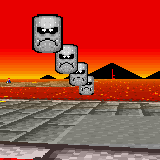</td>
    <td>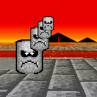</td>
    <td>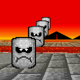</td>
  </tr>
  <tr>
    <td colspan=3>
      <b>{*@fig:img-obj-sort}</b>. Non-sorted objects look alright (left) from one angle, but not from the other way (middle). You need to sort them to get the correct order (right).
    </td>
  </tr>
</table>

What needs to be done is sort the objects in OAM according to depth; a kind of [Z-buffer](https://en.wikipedia.org/wiki/Z-buffering) for objects. The depth of a sprite is simply _z_<sub>c</sub>, and we need to fill OAM with the sprite's object attributes in order of ascending _z_<sub>c</sub>. For good measure, it's probably a good idea to give hidden objects the maximum depth-value possible or to leave them out of the sorting process entirely.

There are many possible strategies for sorting the objects. My own choice aright now would be to not sort the sprites or objects directly but to create an **index table**, which indicates the order the sprites' attributes should go into OAM. The pseudo-code for this is given below. Which algorithm you use to sort the keys doesn't really matter at this time, as long as it does the job. I'm sure that faster methods can be found, but probably at the expense of more code and I want to keep things relatively simple.

```c
// Pseudo code for sorting sprites for OAM
void spr_sort()
{
    int ids[N];     // Index table
    int keys[N];    // Sort keys

    // Create initial index and sort-key table
    for ii=0; ii<N; ii++)
    {
        ids[ii]= ii;
        keys[ii]= is_visible(sprite[ii]) ? sprite[ii].depth : DEPTH_MAX;
    }

    // Sort keys (i.e., fill ids)
    id_sort(ids, keys);

    // Fill OAM according to
    for(ii=0; ii<N; ii++)
        oam_mem[ii]= sprite[ids[ii]].obj;
}
```

### Renormalization {#ssec-obj-norm}

I wouldn't be surprised if you've never heard of this term before. <dfn>Normalization</dfn> means that you scale a quantity to a user-friendly value – usually 1. You have already scaled the sprite by a factor λ, but that's not enough. In most cases, you have to scale it further, i.e _renormalize_ it. Here's why.

By definition, the scaling factor λ will be one when _z_<sub>c</sub> = −*D*. Now consider what happens if you look at a closer object, say at _z_<sub>c</sub> = −½*D*. In this case, λ will be ½ and the object will be scaled by a factor of two. In other words, it'll already fill the double-size canvas. And higher scales are possible too: with the suggested values of *D* = 256 and *N* = 24, you could end up with scaling of 10! This will not do.

It is possible to get around this by moving the near-plane further away. However, then you'll see object disappearing if they're still quite far off, which will look just as strange as seeing them clipped. A better solution is to give the objects an extra scaling factor. In `m7_ex` I have scaled the objects by an additional factor of ¼, so that a 32x32 sprite is actually only 8x8 ‘world’-pixels in size. This seems to work out quite nicely.

This renormalization means that you're actually working with _two separate_ scaling factors: one for the coordinate transformation, and one for visual effects. It is the _visual_ scaling you need to use in positioning and culling the sprites, not the transformation scaling; the latter's influence stops once you've found the screen-position of the anchor.

There's probably an official term for this process, but I wouldn't know what it is. I'm familiar with the process of renormalization from physics (a few Dutch professors got the Nobel Prize for this subject a few years back) and it seemed to fit. If you know the official term, I'd like to hear it.

<div class="cblock">
  <table id="fig:img-obj-norm" class="bdr" width=512 border=0 cellpadding=4 cellspacing=0>
    <tr>
      <td>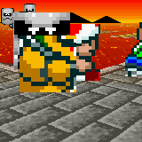</td>
      <td>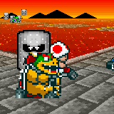</td>
      <td>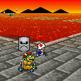</td>
    </tr>
    <tr>
      <td colspan=3>
        <b>{*@fig:img-obj-norm}</b>. Object renormalization. Left: normal (ew, no!). Middle: &times;&frac12; (hmmm, no). Right: &times;&frac14; (yeah, that's it).
      </td>
    </tr>
  </table>
</div>

And with that, we've reached the end of the theory. Now to actually implement all of this.

## Implementation {#sec-code}

### Design considerations. {#ssec-code-design}

My aim here is not to merely dish out a couple of functions that can make mode 7 happen, but also provide something that can be easily modified if necessary. The code of the `m7_ex` demo is spread over 4 files: one for the things specific to the demo itself `m7_ex.c`; and three for mode 7 specific stuff, `mode7.h`, `mode7.c` and `mode7.iwram.c`. Yes, iwram functions too; some of these things are going to be computation extensive and I want them as fast as possible right off the bat. I'm also borrowing the object sorter from the [priority demo](lab.html##ssec-prio-objsort).

There are three main areas of interest here: the **camera**, **background stuff** and **sprites**. For each of these we will use a struct and/or array to keep their data so it's nice and OOPy. There will also be a sort of manager struct for the mode 7 stuff as a whole. And, of course, we need constants for the view volume, focus length and a few other items. A handful of functions will then operate on these items to give up what we need.

#### Constants

There aren't too many constants. Most have to do with the viewport, the others with the focus and renormalization.

```c
#define M7_D        256     //!< Focal length
#define M7_D_SHIFT    8     //!< Focal shift
#define M7O_NORM      2     //!< Object renormalization shift (by /4)

// View frustum limits
#define M7_LEFT     (-120)      //!< Viewport left
#define M7_RIGHT     120        //!< Viewport right
#define M7_TOP        80        //!< Viewport top (y-axis up)
#define M7_BOTTOM   (-80)       //!< Viewport bottom (y-axis up!)
#define M7_NEAR       24        //!< Near plane (objects)
#define M7_FAR       512        //!< Far plane (objects)

#define M7_FAR_BG    768        //!< Far plane (floor)
```

#### Structs and variables {#ssec-code-class}

Mode 7 would be a wonderful place to use classes, but since I'm working in C, not C++, I'm sticking to structs. Apart from the `BG_AFFINE` struct I presented in the [affine background](affbg.html) page, you need one struct for the camera and one struct for the mode 7 objects. I'm also using a mode 7 container struct to keep track of all the parts that go into the mode 7 functionality, so that you won't have loose global variables lying around the place.

You're free to create your own structs for these, but the ones I will use are given below. If you've been paying attention, most of the members should be familiar. Oh, the `POINT` and `VECTOR` structs are 2D and 3D vectors, of course.

```c
//! 3D sprite struct
typedef struct M7_SPRITE
{
    VECTOR pos;     //!< World position.
    POINT anchor;   //!< Sprite anchor.
    OBJ_ATTR obj;   //!< Object attributes.
    s16 phi;        //!< Azimuth angle.
    u8 obj_id;      //!< Object index.
    u8 aff_id;      //!< OBJ_AFFINE index.
    TILE *tiles;    //!< Gfx pointer.
    VECTOR pos2;    //!< Position in cam space (subject to change)
} M7_SPRITE;

//! 3D camera struct
typedef struct M7_CAM
{
    VECTOR pos;     //!< World position.
    int theta;      //!< Polar angle.
    int phi;        //!< Azimuth angle.
    VECTOR u;       //!< local x-axis (right)
    VECTOR v;       //!< local y-axis (up)
    VECTOR w;       //!< local z-axis (back)
} M7_CAM;


//! One struct to bind them all
typedef struct M7_LEVEL
{
    M7_CAM *camera;         //!< Camera variables
    BG_AFFINE *bgaff;       //!< Affine parameter array
    M7_SPRITE *sprites;     //!< 3D sprites
    int horizon;            //!< Horizon scanline (sorta)
    u16 bgcnt_sky;          //!< BGxCNT for backdrop
    u16 bgcnt_floor;        //!< BGxCNT for floor
} M7_LEVEL;
```

There's not much more I have to say about these structs. The `M7_SPRITE` has the attributes of its object as a member itself, rather than an index or pointer to any sort of buffer. The reason behind this is essentially “why the hell not”. Because I have to sort the objects anyway, using an extra buffer might not be worthwhile, so I chose this. I'm also keeping track of the position in camera space because I need it on more than one occasion, and a TILE pointer for graphics. The reason for this will become apparent when we implement animation.

The `M7_LEVEL` holds pointers to the main variables for mode 7 (the camera, affine array and sprites) as well as the horizon scanline needed to switch from backdrop to floor, and two variables containing the data of the bg control register, as this will be different for the backdrop and floor.

Now we need these four variables using these structs. Because these are technically part of the demo itself, I've put them in `m7_ex.c` instead of the main mode 7 code, although that code does require an actual `m7_level` variable to exist for the HBlank interrupt. `SPR_COUNT` is the number of sprites, which is _definitely_ demo specific. There are 161 entries in `m7_bgaffs` rather than just 160 for the same reason as in the [DMA demo](dma.html#sec-demo): HBlank sets up the next line, rather than the current one, and having this is better (and faster) than the alternative with if/else blocks.

```c
M7_CAM m7_cam;
BG_AFFINE m7_bgaffs[SCREEN_HEIGHT+1];
M7_SPRITE m7_sprites[SPR_COUNT];

M7_LEVEL m7_level;
```

<div class="note">

<div class="nhgood">

Type and order of struct members

</div>

My usual advice is to use ints for your data types, but for structs this may not always be the best thing to do. Local variables may not use up memory, but structs do. And when you have arrays of structs, the extra space that word-sized members cost adds up quickly. So in that case feel free to use non-ints.

Having said that, when it's time to use those members it can pay to copy its data to a local 32bit variable, rather an using a byte or halfword member for all the calculations.

Also, and this is _very_ important, you won't be saving any space if you don't pay attention to the order of the members. An int will still require word-alignment, even when it comes right after a byte member. The compiler may add padding after bytes and halfwords to ensure the next member is correctly aligned. It'd be best if you ordered the members in such a way that there's as little padding as possible.

</div>

### Background functions {#ssec-code-bg}

These are my four main background functions:

- `void m7_prep_horizon(M7_LEVEL *level)`. Calculates the horizon scanline.
- `IWRAM_CODE void m7_prep_affines(M7_LEVEL *level)`. Calculates the affine parameters for the floor, based on camera position and orientation..
- `void m7_update_sky(const M7_LEVEL *level)`. Positions the backdrop.
- `IWRAM_CODE void m7_hbl_floor()`. HBlank interrupt routine. Switches to mode 2 when necessary and copies affine parameters and creates fog effect.

`m7_prep_horizon()` and ` m7_update_sky()` are simple implementations of {@eq:horz-line} and {@eq:psi}, respectively, so I can be brief with these.

```c
//! Calculate the horizon scanline
void m7_prep_horizon(M7_LEVEL *level)
{
    int horz;
    M7_CAM *cam= level->camera;

    if(cam->v.y != 0)
    {
        horz= M7_FAR_BG*cam->w.y - cam->pos.y;
        horz= M7_TOP - Div(horz*M7_D, M7_FAR_BG*cam->v.y);
    }
    else    // looking straight down (w.y > 0) means horizon at -inf scanline
        horz= cam->w.y > 0 ? INT_MIN : INT_MAX;

    level->horizon= horz;
}

//! Update sky-bg position
void m7_update_sky(const M7_LEVEL *level)
{
    REG_BG2HOFS= (level->camera->phi>>6)+M7_LEFT;
    REG_BG2VOFS= -clamp(level->horizon, 0, 228)-1;
}
```

The horizon calculation makes use of a clipping far-plane, though this is not strictly necessary. If you want the horizon at infinity, remove the subtraction by the camera's height and use `M7_FAR_BG` = 1. Note the check for _v_<sub>y</sub> = 0. As _v_<sub>y</sub> = cos(θ), this will be true when looking straight up or straight down. The distinction is important because sees the sky (no affine bg) and one sees only floor (no backdrop). Technically these should be ±infinity, but as this is fixed-point, `INT_MIN/MAX` will have to do.

As for the backdrop placement: I'm taking a _lot_ of shortcuts here. A mathematically correct backdrop would use a background map 1720 pixels wide. It can be done, but mostly it's just annoying. Instead, I'm using a 512x256p regular background and use *P* = 1024 in the angle→scroll-offset conversion. This means the map shows up twice in one 360° rotation and that the _dx_ is just φ/64. Yes, the floor and backdrop field-of-view will be slightly out of sync, but you'll only notice if you know what to look for, so that's alright.

Strictly speaking, the vertical offset should be bgHeight − horizon, but the bg-height can be ignored due to wrapping. The reason I'm also clamping the horizon to the size of the viewport is because the horizon scanline can become very large – the tan(θ) in it will approach infinity when looking up, remember? If you don't clamp it you'll scroll through the whole backdrop map a couple of times when panning up, which just looks awful.

#### Preparing the affine parameter table

Calculating the affine parameters happens in `m7_prep_affines()`. You could try to do this in the HBlank isr, but because it requires a division, it would simply take too long. Also, doing it in one spot is more efficient, as you only have to set-up the variables once. This routine carries out the calculations of {@eq:m7-sum}. It has to do quite a number of calculations for each scanline, including a division, so you can expect it to be rather costly; which is why I'm putting it in IWRAM right from the start.

Now, you don't have to calculate things for every scanline: just the ones below the horizon. As for implementing {@eq:m7-sum} itself: it turns out that it works much better if you take the camera matrix apart again and work with sines and cosines of θ and φ, rather than the nine matrix entries. This next paragraph will explain how, but feel free to skip it and go onto the code.

Remember that the camera matrix is **C** = **R**<sub>y</sub>(φ)·**R**<sub>x</sub>(θ); and that λ and **dx** are calculated via {@eq:m7-ofs}: **dx**′ = **a**<sub>cw</sub> + λ·**C**·**b**. You can break up **C** can combine it with **b** to form **b**′ = **R**<sub>x</sub>(θ)·**b**. This new vector takes care of the pitch entirely – it's as if we only had a rotation around the vertical axis, i.e., the case discussed in the previous chapter. With this pre-rotation, the code becomes simpler and faster.

```c
IWRAM_CODE void m7_prep_affines(M7_LEVEL *level)
{
    if(level->horizon >= SCREEN_HEIGHT)
        return;

    int ii, ii0= (level->horizon>=0 ? level->horizon : 0);

    M7_CAM *cam= level->camera;
    FIXED xc= cam->pos.x, yc= cam->pos.y, zc=cam->pos.z;

    BG_AFFINE *bga= &level->bgaff[ii0];

    FIXED yb, zb;           // b' = Rx(theta) *  (L, ys, -D)
    FIXED cf, sf, ct, st;   // sines and cosines
    FIXED lam, lcf, lsf;    // scale and scaled (co)sine(phi)
    cf= cam->u.x;      sf= cam->u.z;
    ct= cam->v.y;      st= cam->w.y;
    for(ii= ii0; ii<SCREEN_HEIGHT; ii++)
    {
        yb= (ii-M7_TOP)*ct + M7_D*st;
        lam= DivSafe( yc<<12,  yb);     // .12f

        lcf= lam*cf>>8;                 // .12f
        lsf= lam*sf>>8;                 // .12f

        bga->pa= lcf>>4;                // .8f
        bga->pc= lsf>>4;                // .8f

        // lambda·Rx·b
        zb= (ii-M7_TOP)*st - M7_D*ct;   // .8f
        bga->dx= xc + (lcf>>4)*M7_LEFT - (lsf*zb>>12);  // .8f
        bga->dy= zc + (lsf>>4)*M7_LEFT + (lcf*zb>>12);  // .8f

        // hack that I need for fog. pb and pd are unused anyway
        bga->pb= lam;
        bga++;
    }
    level->bgaff[SCREEN_HEIGHT]= level->bgaff[0];
}
```

We begin by getting the scanline to begin calculating at (which may be nothing), and defining _lots_ of temporaries. Not all of the temporaries are necessary, but they make the code more readable. Names aside, the code within the loop is very similar to that of `hbl_mode7_c` in the [first mode 7 demo](mode7.html#ssec-order-code), except that in calculating λ we use a rotated _y_<sub>s</sub>-value, and in calculating the offsets a rotated _z_<sub>s</sub> (= −*D*) value. Annnd, that's it.

The comments behind the calculations indicate the fixed-point count of the results, which in this case can be either .8f or .12f. Now hear this: it is **very** important that the scaled (co)sine of φ, `lcf` and `lsf`, use 12 bits of precision or more. I've tried 8, it's not pretty – the displacements are all off at close range. Secondly, note the order of multiplications and shifts in the displacements; it is also very important that these stay the way they are. Particularly the one with _L_: the multiplication by `M7_LEFT` **must** happen after the shift, trust me on this.

The last interesting point is the line after the loop, which copies the parameters for scanline 0 to the back of the array to compensate for the HBlank-interrupt obiwan error.

This function is probably as fast as you can make it in C, and it the compiler does its job pretty well so there is little to be gained by going to manual assembly. This does not mean it doesn't still take quite some time. The division alone costs something like 100 to 400 cycles (the cycle-count for BIOS division is roughly 90 + 13/significant bit). At one division per scanline, this can really add up. The best strategy to deal with this is to _not do it_ if you don't have to. If you use a fixed pitch angle, you can precalculate all the divisions and just look them up. If you must have a variable pitch, you can also go the trig way. Look back at {@fig:img-obj-sort}. If β is the angle between (0, *y*<sub>p</sub>, −*D*) and (0, 0, −*D*), then tan(β) = *y*<sub>p</sub>/_D_. With a good deal of trigonometry, you could rewrite the formula for λ to

<table id="eq:lambda-alt">
  <tr>
    <td class="eqnrcell">({!@eq:lambda-alt})</td>
    <td class="eqcell">
      <math xmlns="http://www.w3.org/1998/Math/MathML" display="block">
        <mstyle displaystyle="true" scriptlevel="0">
          <mrow data-mjx-texclass="ORD">
            <mtable rowspacing=".5em" columnspacing="1em" displaystyle="true">
              <mtr>
                <mtd>
                  <mtable displaystyle="true" columnalign="right left" columnspacing="0em" rowspacing="3pt">
                    <mtr>
                      <mtd>
                        <mi>&#x3BB;</mi>
                      </mtd>
                      <mtd>
                        <mi></mi>
                        <mo>=</mo>
                        <msub>
                          <mi>a</mi>
                          <mrow data-mjx-texclass="ORD">
                            <mi>c</mi>
                            <mi>w</mi>
                            <mo>,</mo>
                            <mi>y</mi>
                          </mrow>
                        </msub>
                        <mrow data-mjx-texclass="ORD">
                          <mo>/</mo>
                        </mrow>
                        <mi>D</mi>
                        <mtext>&#xA0;</mtext>
                        <mo>&#x22C5;</mo>
                        <mi>cos</mi>
                        <mo data-mjx-texclass="NONE">&#x2061;</mo>
                        <mrow>
                          <mo data-mjx-texclass="OPEN">(</mo>
                          <mi>&#x3B2;</mi>
                          <mo data-mjx-texclass="CLOSE">)</mo>
                        </mrow>
                        <mrow data-mjx-texclass="ORD">
                          <mo>/</mo>
                        </mrow>
                        <mi>sin</mi>
                        <mo data-mjx-texclass="NONE">&#x2061;</mo>
                        <mrow>
                          <mo data-mjx-texclass="OPEN">(</mo>
                          <mi>&#x3B8;</mi>
                          <mo>+</mo>
                          <mi>&#x3B2;</mi>
                          <mo data-mjx-texclass="CLOSE">)</mo>
                        </mrow>
                      </mtd>
                    </mtr>
                  </mtable>
                </mtd>
              </mtr>
            </mtable>
          </mrow>
        </mstyle>
      </math>
    </td>
  </tr>
</table>

You can get β via an arctan LUT of 160 entries, one for each scanline (hey, you could even put that into _p_<sub>d</sub>!), and then use a 1/sine LUT. You have to be careful to use large enough LUTs, though. Since the arguments of LUTs are integers, β will be truncated, and you will lose a _lot_ of accuracy though this, especially near the horizon. Now, I haven't actually tried the trig-way yet, but I have done some basic tests in Excel which would suggest that with a 1/sine LUT of 512/circle, you'd get λ-errors well over 10% near the horizon, and errors around 1% everywhere else. With that in mind, I'd suggest 1024/circle at least. Or interpolating between LUT entries, which you can do with tonclib's `lu_lerp16()` and `lu_lerp32()` functions.

Aside from going triggy with it, you can probably speed up the division as well in a number of ways. But before you go and optimize this, ask yourself if you really need it first. Premature optimization is the root of all evil, after all.

<div class="note">

<div class="nh">

Speed-ups for affine calculations

</div>

Tried three optimizations recently. First, ARM/IWRAM, which brings the thing down to 23k-58k cycles. Then, a little refactoring that presented itself in a discussion with sgeos: the camera vectors can resolve to a smaller set of variables, saving 10-20%. Then, the trig thing, which can bring the whole thing down to 10-20k or even 7k-14k max, depending on whether you get cos(β) and 1/sin(θ+β) via large luts, or smaller luts and linear interpolation. Once you get the math, shifts, and signs in order, it works like a charm.

</div>

#### The mode 7 HBlank interrupt routine

To keep things simple, nearly everything that has to happen during VDraw happens inside one HBlank isr called `m7_hbl_floor()`. Earlier versions of this demo used a system of VCount/HBlank interrupts, but that turned out to be more trouble than it's worth. This is also an IWRAM routine because it really needs to be as fast as possible. The interrupt service routine does the following things:

1.  **Check vcount for floor-range**. If this scanline is not part of the floor, return.
2.  **Check vcount for horizon**. At reaching the horizon scanline the video mode should change and `REG_BG2CNT` should be set to the floor's settings.
3.  **Copy affine parameters to `REG_BG_AFFINE[2]`**. Copy the _next_ scanline's parameters to `REG_BG_AFFINE[2]`, as we've already past the current scanline.
4.  **Fogging**. Fade to orange in this case.

```c
// from tonc_core.h
//! Range check; true if xmin<=x<xmax
#define IN_RANGE(x, min, max)  ( (x) >= (min) && (x) < (max) )
```

```c
IWRAM_CODE void m7_hbl_floor()
{
    int vc= REG_VCOUNT;
    int horz= m7_level.horizon;

    // (1) Not in floor range: quit
    if(!IN_RANGE(vc, horz, SCREEN_HEIGHT) )
        return;

    // (2) Horizon: switch to mode 1; set-up bg control for floor
    if(vc == horz)
    {
        BF_SET(REG_DISPCNT, DCNT_MODE1, DCNT_MODE);
        REG_BG2CNT= m7_level.bgcnt_floor;
    }

    // (3) Looking at floor: copy affine params
    BG_AFFINE *bga= &m7_level.bgaff[vc+1];
    REG_BG_AFFINE[2] = *bga;

    // (4) A distance fogging with high marks for hack-value
    u32 ey= bga->pb*6>>12;
    if(ey>16)
        ey= 16;

    REG_BLDALPHA= BLDA_BUILD(16-ey, ey);
}
```

Points (3) and (4) could benefit from a bit more explanation. As mentioned several times now, the isr of any scanline _vc_ should set-up the parameters of _next_ scanline, which is why we're copying from `level.bgaff[vc+1]` rather than just `[vc]`. Scanline zero's uses the set from *vc* = 160, which is alright because we've copied zero's data to the last element in the array. As usual, struct copies ftw.

For the fogging I use _p_<sub>b</sub> which filled with λ in `m7_prep_affines()` for this very reason. A scaled λ is not the most accurate model for fogging, but the effect looks well enough. Because the blending registers cap at 16, I need to make sure it doesn't wrap around at higher values.

This _still_ leaves the question of what I'm actually blending with, as orange isn't part of the GBA's fade repertoire. At least, not _directly_. It is, however, quite possible to blend with the backdrop, which just shows bg-color 0. This color can be anything, including orange.

### Sprites and objects {#ssec-code-spr}

Sprite and object handling has been distributed over the following three functions:

- `void update_sprites()`. This is the main sprite handler, which calls other functions to do positioning, sorting and animation.
- `IWRAM_CODE void m7_prep_sprite(M7_LEVEL *level, M7_SPRITE *spr)`. This calculates the correct position and scale of the sprite.
- `void kart_animate(M7_SPRITE *spr, const M7_CAM *cam)`. This selects the correct frame for rotating around the karts.

Only `m7_prep_sprite()` is actually part of the mode 7 functions; the others could very well differ for every mode 7 game you have in mind. The main sprite handler, `update_sprites()`, is pretty simple: it needs to call `m7_prep_sprite()` for each sprite and create the sprite's sorting key, sort all the sprites and copy the sorted attributes to OAM. It also calls `kart_animate()` for each kart-sprite for their animations; if I had animations for the thwomps or other sprites they'd probably go here as well.

```c
void update_sprites()
{
    int ii;

    M7_SPRITE *spr= m7_level.sprites;
    for(ii=0; ii<SPR_COUNT; ii++)
    {
        m7_prep_sprite(&m7_level, &spr[ii]);

        // Create sort key
        if(BF_GET2(spr[ii].obj.attr0, ATTR0_MODE) != ATTR0_HIDE)
            sort_keys[ii]= spr[ii].pos2.z;
        else
            sort_keys[ii]= INT_MAX;
    }

    // Sort the sprites
    id_sort_shell(sort_keys, sort_ids, SPR_COUNT);

    // Animate karts
    for(ii=0; ii<8; ii++)
        kart_animate(&spr[ii], m7_level.camera);

    // Update real OAM
    for(ii=0; ii<SPR_COUNT; ii++)
        obj_copy(&oam_mem[ii], &spr[sort_ids[ii]].obj, 1);
}
```

Most of the code has to do with sorting the sprites, which was already described in the theory. The `pos2` member of the sprites is set by `m7_prep_sprite()` to contain the sprite's position in camera space. The sorting routine `id_sort_shell()` is the index-table sorter described in the [priority section](lab.html#sec-prio).

If I had wanted to have more advanced animation or sprite things, they'd be put here as well. But I didn't, so I haven't.

#### Sprite positioning and scaling

The function `m7_prep_sprite()` calculates the correct on-screen position for a sprite, sets up the affine matrix with the proper (renormalized) scales and hides the sprite if it falls outside the view volume.

The first step is convert to the convert the world-position of the sprite to a vector in the camera space, using the first part of {@eq:obj-w2s}: **x**<sub>c</sub> = **C**<sup>T</sup>·**r**, with **r** being the position of the sprite relative to the camera: **r** = **x**<sub>w</sub>−**a**<sub>cw</sub>. This is put into variable `vc`, but with the signs of _y_ and _z_ switched! This makes subsequent calculations a little easier. This vector is also stored in `spr->pos2`, which is used in sorting elsewhere.

The second step is checking whether the sprite would actually be visible, using the conditions from {@tbl:culltest}, with one exception: the checks now use the _renormalized_ rectangle of the sprite. Leaving that part out could create artifacts for some orientations. To calculate the sprite rectangle I'm using the sizes of the object rectangle. It is possible to get a tighter fit if you'd also define a sprite rectangle indicating the visible pixels within the object frame, but that might be going a little too far here.

Note that most of the code from the bounds checks on is done in a `do-while(0)` loop. This pattern is sort of a poor-man's `try/catch` block – I _could_ have used `goto`s here, but as they're considered harmful I decided against it. Anyway, an out-of-bounds ‘exception’ here would indicate that the sprite should be hidden, which is done in step (5).

If we've passed the bounds-checks, we need to set-up the affine matrix and calculate the object's position via the anchoring equation of {@eq:anchor}.

```c
//! Setup an object's attr/affine with the right attributes
/*! \param level    Mode 7 level data
*   \param spr      3D sprite to calculate for
*/
IWRAM_CODE void m7_prep_sprite(M7_LEVEL *level, M7_SPRITE *spr)
{
    M7_CAM *cam= level->camera;
    VECTOR vr, vc;      // Difference and inverted-cam vector
    int sx, sy;         // Object size
    RECT rect;          // Object rectangle

    // (1) Convert to camera frame
    vec_sub(&vr, &spr->pos, &cam->pos);
    vc.x=  vec_dot(&vr, &cam->u);
    vc.y= -vec_dot(&vr, &cam->v);
    vc.z= -vec_dot(&vr, &cam->w);
    spr->pos2= vc;

    OBJ_ATTR *obj= &spr->obj;
    sx= obj_get_width(obj);
    sy= obj_get_height(obj);

    // --- Check with viewbox ---
    do
    {
        // (2a) check distance
        if(M7_NEAR*256 > vc.z || vc.z > M7_FAR*256)
            break;

        // (2b) check horizontal
        rect.l= vc.x - spr->anchor.x*(256>>M7O_NORM);
        rect.r= rect.l + sx*(256>>M7O_NORM);
        if(M7_LEFT*vc.z > rect.r*M7_D || rect.l*M7_D > M7_RIGHT*vc.z)
            break;

        // (2c) check vertical
        rect.t= vc.y - spr->anchor.y*(256>>M7O_NORM);
        rect.b= rect.t + sy*(256>>M7O_NORM);
        if(-M7_TOP*vc.z > rect.b*M7_D || rect.t*M7_D > -M7_BOTTOM*vc.z)
            break;

        // (3) Set-up affine matrix
        OBJ_AFFINE *oa= &obj_aff_mem[spr->aff_id];
        oa->pa= oa->pd= vc.z>>(M7_D_SHIFT-M7O_NORM);    // normalized lambda
        oa->pb= oa->pb= 0;

        FIXED scale= DivSafe(M7_D<<16, vc.z);   // (.16 / .8) = .8

        // (4) anchoring
        // Base anchoring equation:
        // x = q0 - s - A(p0 - s/2)
        // In this case A = 1/lam; and q0 = xc/lam
        // -> x = (xc - p0 + s/2)/lam - s + screen/2
        int xscr, yscr;
        xscr  = spr->anchor.x*256 - sx*128;             // .8
        xscr  = (vc.x - (xscr>>M7O_NORM))*scale>>16;    // .0
        xscr += -sx - M7_LEFT;

        yscr  = spr->anchor.y*256 - sy*128;             // .8
        yscr  = (vc.y - (yscr>>M7O_NORM))*scale>>16;    // .0
        yscr += -sy + M7_TOP;
        obj_unhide(obj, ATTR0_AFF_DBL);
        obj_set_pos(obj, xscr, yscr);

        return;
    }
    while(0);

    // (5) If we're here, we have an invisible sprite
    obj_hide(obj);
}
```

#### Kart animation

The basic theory for animation around a sprite is simple, namely {@eq:psi}: the viewing angle ψ is the difference between the global sprite angle φ<sub>o</sub>, and the camera angle φ<sub>c</sub> and the angle to the sprite in camera-space α: ψ = φ<sub>o</sub>−φ<sub>c</sub>−α. The angle translates to an animation frame to use and you're done.

In theory.

The practice has a number of snares, especially the way SMK does it. First, look at {@fig:img-obj-frames}. These 12 frames are the ones that Super Mario Kart uses for Toad. The first complication is that this is only the right side of the rotation; the left side is done via mirroring. That's easy enough: just change the sign of _p_<sub>a</sub> of the view-angle is negative.

The second problem is the number of tiles. 12 frames for half a circle means 24 for the full rotation (well 22 actually, as we don't need to duplicate the front and back frames). At 4x4=16 tiles each, this gives 384 tiles for Toad alone (and only the rotation animation at that!) Multiply by 8 for the full set of characters and you're _way_ out of VRAM. This means that you can't load all the frames into VRAM in one go and use an object's tile-index for animation: you have to dynamically load frames you need. This is why the sprite struct had a `tiles` member, pointing to the full sprite sheet in ROM.

The third complication is that the frames aren't uniformly divided over the circle. If you look closely, the first 8 frames are for angles 0° through 90°, the remaining four for 90°-180°. The reason behind this is that most of the time you'll see the karts from the back, so it pays to have more frames for those. Now, in the theory we could calculate the animation frame quite nicely, namely _N_·ψ/2<sup>16</sup>. However, that relied on having _N_ equal slices, which we don't have anymore. Or do we?

Well no, we don't have equal slices anymore. But we can _make_ equal slices again, using a sort of mapping. {\*@fig:img-psi-lut} shows could the principle works. In the figure there are 12 main partitions (inside circle), with 0, 1, 10 and 11 covering more angular space than 2-9. However, we can also divide the circle into 16 parts (outer circle), and use the same frame for multiple entries. For example, slice-0 of the main sequence is now covered by slice-0 and slice-1 of the new sequence. While it's possible to use if/else blocks to the mapping, it's easier on everyone to just use a LUT for it. This actually takes care of two other problems I hadn't mentioned before, namely that mirroring would require some sort of reversal of the normal sequence, and the fact that the slices actually have to be offset by half a slice so that you don't have a slice-switch when looking exactly at the front or back, for example. A LUT solves all those problems in one go.

<div class="cblock">
  <table cellspacing=4>
    <tr valign="top">
      <td>
        <div class="cpt" style="width:392px;">
          
          <br>
          <b>{*@fig:img-obj-frames}</b>: Toad's frames from different angles.
        </div>
      </td>
      <td>
        <div class="cpt" style="width:160px;">
          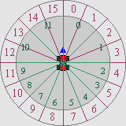
          <br>
          <b>{*@fig:img-psi-lut}</b>: Using &psi; for 16-element LUT entry, instead of 12 non-equal partitions.
        </div>
      </td>
    </tr>
  </table>
</div>

```c
const u8 cKartFrames[32]=
{
     0,  1,  2, 3, 4, 5, 6, 7, 7, 8, 8, 9, 9, 10, 10, 11,
    11, 10, 10, 9, 9, 8, 8, 7, 7, 6, 5, 4, 3,  2,  1,  0,
};

//! Animate kart sprite
void kart_animate(M7_SPRITE *spr, const M7_CAM *cam)
{
    OBJ_ATTR *obj= &spr->obj;

    if(BF_GET2(obj->attr0,ATTR0_MODE) == ATTR0_HIDE)
        return;

    TILE *dst= &tile_mem[4][BF_GET(obj->attr2, ATTR2_ID)];
    s16 psi= spr->phi - cam->phi;

    // Extra arctan angle for correctness
    if(g_state & STATE_OBJ_VIEW_ATAN)
        psi -= ArcTan2(spr->pos2.z>>8, spr->pos2.x>>8);

    memcpy32(dst, &spr->tiles[cKartFrames[(psi>>11)&31]*16], 16*8);

    OBJ_AFFINE *oa= &obj_aff_mem[spr->aff_id];
    if(psi < 0)
        oa->pa= -oa->pa;
}
```

The snippet above shows the kart's angle-LUT and animation routine. The LUT has 32 entries, with the first and last 7 using single chunks and the rest being doubled. Also note that the LUT is symmetric, which is required for the mirroring.

The routine itself isn't exactly pretty, but it gets the job done. It checks whether the sprite is visible first and bugs out if it's not: no point in doing work if we can't see its results. The sprite's in-camera angle, α, requires an arctan. I've added a switch in the menu so you can see the results with and without the α-correction, and I think you'll find that the difference is pretty small. Since I always use the same VRAM for each sprite, finding the destination of the tile-copy is easy; finding the source frame looks a little ugly, but it's just the ψ→slice conversion and the look-up, really.

### Rounding up: the main loop and other fluff {#ssec-code-misc}

The hard parts of mode 7 have more or less been covered now, with the possible exception of the main loop, which we'll get to in a moment. There is, of course, initialization of the registers, the sprites and mode 7 variables, loading of VRAM and input, but that's rather easy and tends to vary from game to game anyway. For those things, please see the actual code.

#### The main program flow

In the snippet below you can see the `main()` function and its major branches. `init_main()` sets up the main mode 7 variables, `m7_level` through `m7_init()`, initializes the VBlank and HBlank interrupts and various other things. The main loop is quite short. The function `input()` does both the movement of the camera and menu.

After that come the actual mode 7 functions. `m7_prep_horizon()` has to come first, but the order of the rest is pretty arbitrary. I would suggest calling `m7_prep_affines()` last, though: it's the most costly function here, but it'd be alright to let it run into VDraw time. Not that that happens here (I've clocked the main loop to end around scanline 170-210), but it'd be okay if it did.

```c
int main()
{
    init_main();

    while(1)
    {
        VBlankIntrWait();
        input();

        m7_prep_horizon(&m7_level);
        // Switch to backdrop display.
        if(m7_level.horizon > 0)
        {
            BF_SET(REG_DISPCNT, DCNT_MODE0, DCNT_MODE);
            REG_BG2CNT= m7_level.bgcnt_sky;
            REG_BLDALPHA= 16;
        }
        m7_update_sky(&m7_level);

        update_sprites();
        m7_prep_affines(&m7_level);
    }

    return 0;
}
```

#### Movement in 3D

This is the last thing I want to cover: how to move things in 3D. To be precise: how to do different methods of motion in 3D; which I'm sure people might want to know.

3D movement is actually much the same as 2D movement, except with an extra dimension. The reason why people sometimes find it difficult is that they think in terms of angles, when what they _should_ be thinking in is vectors. Vector-based movement (or vector-based anything) usually makes things much easier than with angles and trigonometry. This is also why the theory of this chapter has been using vectors and matrices.

Here I'll look into three different modes of camera movements: one using the world coordinate system, one using the camera system, and one somewhere in between so that it stays parallel to the ground. But first, let's take a look at what moving in a certain direction actually _means_.

Every object in 3D space has its own little coordinate space, the <dfn>local frame</dfn>. This is defined as a set of 3 vectors, denoting the directions of the local _x_, _y_ and _z_ directions. In the case of the camera, I named these **u**, **v** and **w**, respectively. The local matrix is just another way of writing down this set of vectors. Movement is usually defined as steps along these vectors.

As an example of this, consider your head to be the camera and use arrows to indicate the local axes: **u** would stick out of your right ear, **v** out of the top of your head and **w** out the back. A step right would be along the **u** direction, and one forward along −**w**. A general movement could be written as _x_ steps right, _y_ steps up, and _z_ steps back. _x_, _y_ and _z_ are used as _multipliers_ for the direction vectors, and the final displacement in global space is **dx** = _x_·**u** + _y_·**v** + _z_·**w**.

And where matrices come in. Those three multipliers can be written a vector **r** = (_x_, *y*, *z*), which is the distance vector in _local_ space. The three directions formed a matrix **C**, The definition of **dx** given above is nothing else than the long way of writing down **dx** = **C**·**r**. The matrix multiplication is just shorthand for “scale the vectors of **C** by the elements of **r** and add them all up”. Note that this procedure would work for any object, in any orientation. All you need to do is find the correct local matrix.

In my case, I construct vector **r** in `input()`, based on various buttons. At this point it doesn't really mean anything yet. Each of the movement methods has its own set of directions and hence its own matrix that has to be applied to **r**; I have functions that can perform them and add the results to the camera position. All of these can be found in {@tbl:motion} and the code below it.

The ‘level’ (that is, level to the ground) is probably the most common for camera systems for ground-based objects, though using the local system might make sense for flying objects. Experiment with them and see what you like.

<div class="cblock">
  <table id="tbl:motion" border=1 cellpadding=2 cellspacing=0>
    <caption align="bottom">
      <b>{*@tbl:motion}</b>: Movement methods and their associated transformations to world-space. New position of an object is given by <b>x</b><sub>w</sub> += <b>v</b><sub>w</sub>.
    </caption>
    <tbody>
      <tr>
        <th>Method</th>
        <th>Function</th>
        <th>Transformation</th>
      </tr>
      <tr>
        <td>Global frame</td> 
        <td><code>m7_translate_global()</code></td>
        <td><b>dx</b> = <b>I</b> · <b>r</b> = <b>r</b>
      </tr>
      <tr>
        <td>Local (camera) frame</td> 
        <td><code>m7_translate_local()</code></td>
        <td><b>dx</b> = <b>C</b>(&theta;, &phi;) · <b>r</b>
      </tr>
      <tr>
        <td>Level: local but parallel to ground</td> 
        <td><code>m7_translate_level()</code></td>
        <td><b>dx</b> = <b>R</b><sub>y</sub>(&phi;) · <b>r</b>
      </tr>
    </tbody>
  </table>
</div>

```c
//! Translate by \a dir in global frame
void m7_translate_global(M7_CAM *cam, const VECTOR *dir)
{
    vec_add_eq(&cam->pos, dir);
}

//! Translate by \a dir in local frame
void m7_translate_local(M7_CAM *cam, const VECTOR *dir)
{
    cam->pos.x += (cam->u.x * dir->x + cam->v.x * dir->y + cam->w.x * dir->z) >> 8;
    cam->pos.y += ( 0                + cam->v.y * dir->y + cam->w.y * dir->z) >> 8;
    cam->pos.z += (cam->u.z * dir->x + cam->v.z * dir->y + cam->w.z * dir->z) >> 8;
}

//! Translate by \a dir using local frame for x/y, but global z
void m7_translate_level(M7_CAM *cam, const VECTOR *dir)
{
    cam->pos.x += (cam->u.x * dir->x - cam->u.z * dir->z)>>8;
    cam->pos.y += dir->y;
    cam->pos.z += (cam->u.z * dir->x + cam->u.x * dir->z)>>8;
}
```

If you're not really familiar with matrices they may seem bright and scary, but they can be a lifesaver once you get used to them a bit. There is a _reason_ why large 3D systems use them non-stop; doing everything by raw trig is hard, very hard. Matrices allow you to work within whatever coordinate system is most natural to the task at hand, and then transform to whatever system you need in the end. If you have any work related to geometry, learning more about the basics of linear algebra (the rules for vector and matrix use) is well worth the effort.

<div class="note">

<div class="nh">

Side note : centering on a sprite

</div>

As an example of how easy matrices can make life, consider the issue of centering the camera on a given sprite and then rotating around it. You have the camera matrix **C**, the distance you want to view from, _Z_ and presumably the sprite position, **x**<sub>w</sub>. What you need to do is: move the camera to the sprite's position, then take _Z_ steps back. In other words **a**<sub>cw</sub> = **x**<sub>w</sub>+**C**·(0, 0, _Z_), which boils down to **a**<sub>cw</sub> = **x**<sub>w</sub>+Z**w**,

Once you know the camera matrix, positioning it practically writes itself.

</div>

## Concluding remarks {#sec-conc}

It's done, finally! This chapter's text explained the most important elements of a mode 7 game: calculation of the affine parameters, adding a horizon and backdrop, positioning, sorting _and_ animating 3D sprites and as a bonus how to use create a distance fogging effect. In the preceding text, I've used stuff from just about every subject described in the rest of Tonc, and not just the easy parts. If you're here and understood all or most of the above, congratulations.

But still I've omitted a few things that would make it a little better. Getting rid of all those divisions in the λ calculations, for instance. Or getting around the 32 affine object limitation or placing shadows for the sprites on the floor. Nor have I shown how to correctly allow for loopings, instead of clamping the pitch at straight up or down. These things are relatively easy to grasp, conceptually, but implementing them would require a lot more code. If you understood this text, I'm sure you can figure it out on your own.
