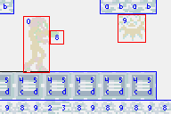
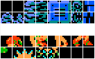
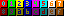
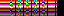
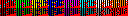

# 7. Sprite and background overview

<!-- toc -->

## Sprites and backgrounds introduction {#sec-intro}

Although you can make games based purely on the bitmap modes, you'll find very few that do. The simple reason for this is that all graphics would be rendered by software. No matter how good your code is, that's always going to be a slow process. Now, I'm not saying it can't be done: there are several FPSs on the GBA (Wolfenstein and Doom for example). I *am* saying that unless you're willing to optimize the crap out of your code, you'll have a hard time doing it.

The vast majority uses the GBA's <dfn>hardware graphics</dfn>, which come in the forms of <dfn>sprites</dfn> and <dfn>tiled backgrounds</dfn> (simply “background” or “bg” for short). As I said in the [video introduction](video.html#sec-vid-types), a tiled background is composed of a matrix of tiles (hence the name) and each tile contains an index to an 8x8 pixel bitmap known as a <dfn>tile</dfn>. So what ends up on screen is a matrix of tiles. There are four of these backgrounds with sizes between 128x128 pixels (32x32 tiles) to 1024x1024 pixels (128x128 tiles). Sprites are smaller objects between 8x8 to 64x64 pixels in size. There are 128 of them and you can move them independently of each other. Like backgrounds, sprites are built out of tiles.

The hardware takes care of several other aspects of rendering besides mere raster blasting. For one thing, it uses <dfn>color keying</dfn> to exclude some pixels from showing up (i.e., these are transparent). Basically, if the tile's pixel has a value of zero it is transparent. Furthermore, the hardware takes care of a number of other effects like flipping, alpha-blending and [affine transformations](affine.html) like rotation and scaling.

The trick is setting up the process. There are three basic steps to be aware of: <dfn>control</dfn>, <dfn>mapping</dfn> and <dfn>image data</dfn>. The boundaries of these steps are a bit vague, but it helps to see it in this manner since it allows you to see sprites and backgrounds as two sides of the same coin. And unification is a Good Thing®. There are still differences, of course, but only in the details.
<br>  
This page gives a broad overview of what I will talk about in the next couple of pages. Don't worry if you don't understand right away, that's not really the point right now. Just let it seep into your brain, read the other pages and then you'll see what I'm on about here.

## Sprite and background control {#sec-ctrl}

The first step of rendering is control. Control covers things that act on the sprites or backgrounds as a whole, like activation of the things themselves, whether to use 16 or 256 color tiles, and effects like alpha-blending and transformations. First up is whether or not you want to use the things in the first place. This is done by setting the right bits in the display control register [`REG_DISPCNT`](video.html#tbl-reg-dispcnt). Once you've done that there are further control registers for backgrounds: the `REG_BGxCNT` registers (`0400:0008h`-`0400:000Fh`). For sprites there's the <dfn>Object Attribute Memory</dfn>, or OAM, which can be found at `0700:0000h`. Each of the 128 sprites has three so-called <dfn>attributes</dfn> (hence OAM) which covers both the control and mapping aspects of the sprites.

## Sprite and background mapping {#sec-map}

There's a lot of grey area between control and mapping, but here goes. Mapping concerns everything about which tiles to use and where they go. As said, the screen appearance of both sprites and backgrounds are constructed of tiles, laid out side by side. You have to tell the GBA which tiles to blit to what position. {*@fig:tile-gfx}a-c (below) illustrates this. In {@fig:tile-gfx}b you see the tiles. Note that both sprites and backgrounds have their own set of tiles.

In {@fig:tile-gfx}c you see how these tiles are used. The background uses a <dfn>tile-map</dfn>, which works just like an ordinary paletted bitmap except that it's a matrix of <dfn>screenblock entries</dfn> (with tile-indices) instead of pixels (containing color-indices). Excuse me, a what?!? Screenblock entry. Yes, I know the name is a bit silly. The thing is that you need keep a clear distinction between the entries in the map (the screenblock entries, <dfn>SE</dfn> for short) and the image-data (the actual tiles). Unfortunately, the term “tile” is often used for both. I'll stick to tiles for the actual graphical information, and since the tile-map is stored in things called screenblocks, screenblock entries or SE for the map data. Anyway, each SE has its own tile-index. It also contains bits for horizontal and vertical flipping and, if it's a 16-color background, an index for the palbank as well. In {@fig:tile-gfx}c, you only see the tile-index, though.

For sprites, it's s a bit different, but the basic steps remain. You give *one* tile-index for the whole sprite; the GBA then figures out the other tiles to use by looking at the shape and size of the sprite and the <dfn>sprite mapping-mode</dfn>. I'll explain what this means [later](regobj.html#sec-oam); suffice to say that the mapping mode is either 1D or 2D, depending on `REG_DISPCNT{6}`. In this case, I've used 1D mapping, which states that the tiles that a sprite should use are consecutive. Like backgrounds, there's additional flipping flags and palette-info for 16-color sprites. Unlike backgrounds, these work on the *whole* sprite, not just on one tile. Also, the component tiles of sprites are always adjoining, so you can see a sprite as a miniature tiled-background with some imagination.

What belongs to the mapping step as well is the [affine transformation matrix](affine.html), if any. With this 2x2 matrix you can rotate, scale or shear sprites or backgrounds. There seems to be a lot of confusion about how this works so I've written a detailed, mathematical description on how this thing works. Bottom line: the matrix maps from screen space to texture-space, and *not* the other way round. Though all the reference documents do state this in a roundabout way, almost every rotation-scale matrix I've seen so far is incorrect. If your code is based on PERN's, chances are yours is too.

<div class="cblock" id="fig:tile-gfx">
<table id="img-tile-use">
<col span=2>
<tr valign="top">
<td>
  <div class="cpt" style="width:200px">
  <br>
  <b>{*@fig:tile-gfx}a</b>: 2 sprites on a background.
  </div>
<td rowspan=2>
  <div class="cpt" style="width:384px">
  <br>
  <b>{*@fig:tile-gfx}c</b>: tile usage by bgs and 
    sprites. One tile per SE for 
    bgs, and the top-left tile for sprites. Default tiles (with 
	index 0 are omitted for clarity's sake.
  </div>
<tr>
<td>
  <div class="cpt" style="width:200px">
  <br>
  <b>{*@fig:tile-gfx}b</b>: background (above) and
    sprite (below) tiles. 
  <!--Note the 'interesting' division of the sprite tiles.-->
  </div>
</table>
</div>

## Sprite and background image data {#sec-img}

Image data is what the GBA actually uses to produce an image. This means two things: tiles and palettes.

### Tiles {#ssec-img-tiles}

Sprites and backgrounds are composed of a matrix of smaller bitmaps called <dfn>tile</dfn>s. Your basic tile is an 8x8 bitmap. Tiles come in 4bpp (16 colors / 16 palettes) and 8bpp (256 colors / 1 palette) variants. In analogy to floating point numbers, I refer to these as <dfn>s-tiles</dfn> (single-size tile) and <dfn>d-tiles</dfn> (double-size tiles). An s-tile is 32 (20h) bytes long, a d-tile 64 (40h) bytes. The default type of tile is the 4bpp variant (the s-tile). If I talk about tiles without mentioning which type, it either doesn't matter or it's an s-tile. Just pay attention to the context.

There is sometimes a misunderstanding about what working in tiles really means. In tiled modes, VRAM is *not* a big bitmap out of which tiles are selected, but a collection of 8x8 pixel bitmaps (i.e., the tiles). It is important that you understand the differences between these two methods! Consider an 8x8 rectangle in a big bitmap, and an 8x8 tile. In the big bigmap, the data after the first 8 pixels contain the next 8 pixels of the same scanline; the next line of the ‘tile’ can be found further on. In tiled modes, the next scanline of the tile immediately follows the current line.

Basically, VRAM works as an 8×*N*·8 bitmap in the tiled modes. Because such a small width is impractical to work with, they're usually presented as a wider bitmap anyway. An example is the VBA tile viewer, which displays char blocks as a 256x256 bitmap; I do something similar in {@fig:tile-as}a. It is important to remember that these do not accurately mimic the contents of VRAM; to reproduce the actual content of VRAM you'd need something like {@fig:tile-as}b, but, of course, no-one is insane enough to edit bitmaps in that manner. In all likelihood, you need a tool that can break up a bitmap into 8x8 chunks. Or restructure it to a bitmap with a width of 8 pixels, which in essence is the same thing.

As with all bitmaps, it is the programmer's responsibility (that means you!) that the bit-depth of the tiles that sprites and backgrounds correspond to the bit-depth of the data in VRAM. If this is out of sync, something like {@fig:tile-as}a may appear as {@fig:tile-as}c. Something like this is likely to happen sooner or later, because all graphics need to be converted outside of the system before use; one misplaced conversion option is all it takes.

<div class="cblock" id="fig:tile-as">
<table id="img-bad-bpp">
<tr valign="top">
<td>
  <div class="cpt" style="width:192px">
  
  <b>{*@fig:tile-as}a</b>: 8bpp tiles.
  </div>
</td>
<td>
  <div class="cpt" style="width:192px">
  
  <b>{*@fig:tile-as}b</b>: 8bpp tiles as bitmap.
  </div>
</td>
<tr>
<td colspan=2>
  <div class="cpt" style="width:384px">
  
  <b>{*@fig:tile-as}c</b>: the data of 
    {@fig:tile-as}a, interpreted as 4bpp data. 
    If you see something like this (and you will), you now know why.
  </div>
</td>
</table>
</div>

:::tip Tiled graphics considerations

Remember and understand the following points:

1.  The data of each tile are stored sequentially, with the next row of 8 pixels immediately following the previous row. VRAM is basically a big bitmap 8 pixels wide. Graphics converters should be able to convert bigger bitmaps into this format.
2.  As always, watch your bitdepth.

:::

:::tip Tip for graphics converters

If you want to make your own conversion tools, here's a little tip that'll help you with tiles. Work in stages; do *not* go directly from a normal, linear bitmap to writing the data-file. Create a tiling function that takes a bitmap and arranges the tiles into a bitmap 1 tile wide and *H* tiles high. This can then be exported normally. If you allow for a variable tile-width (not hard-coding the 8-pixel width), you can use it for other purposes as well. For example, to create 16x16 sprites, first arrange with width=16, then with width=8.

:::

### Tile blocks (aka charblocks) {#ssec-img-cbb}

All the tiles are stored in <dfn>charblocks</dfn>. As much as I'd like them to be called tile-blocks because that's what they're blocks *of*, tradition has it that tiles are characters (not to be confused with the programming type of characters: an 8bit integer) and so the critters are called charblock. Each charblock is 16kb (4000h bytes) long, so there's room for 512 (4000h/20h) s-tiles or 256 (4000h/40h) d-tiles. You can also consider charblocks to be matrices of tiles; 32x16 for s-tiles, 16x16 (or 32x8) for d-tiles. The whole 96kb of VRAM can be seen as 6 charblocks.

As said, there are 6 tile-blocks, that is 4 for backgrounds (0-3) and 2 for sprites (4-5). For tiled backgrounds, tile-counting starts at a given <dfn>character base block</dfn> (block for the character base, CBB for short), which are indicated by `REG_BGxCNT`\{2-3\}. Sprite tile-indexing always starts at the lower sprite block (block 4, starting at `0601:0000h`).

It'd be nice if tile-indexing followed the same scheme for backgrounds and sprites, but it doesn't. For sprites, numbering always follows s-tiles (20h offsets) even for d-tiles, but backgrounds stick to their indicated tile-size: 20h offsets in 4bpp mode, 40h offsets for 8bpp mode.

:::warning Bg vs sprite tile indexing

Sprites always have 32 bytes between tile indices, bg tile-indexing uses 32 or 64 byte offsets, depending on their set bitdepth.

:::

Now, both regular backgrounds and sprites have 10 bits for tile indices. That means 1024 allowed indices. Since each charblock contains 512 s-tiles, you can access not only the base block, but also the one after that. And if your background is using d-tiles, you can actually access a total of four blocks! Now, since tiled backgrounds can start counting at any of the four background charblocks, you might be tempted to try to use the sprite charblocks (blocks 4 and 5) as well. On the emulators I've tested, this does indeed work. On a real GBA, however, it does not. This is one of the reasons why you *need* to test on real hardware. For more on this subject see the [background tile subtleties](regbg.html#ssec-map-subtle) and the [`cbb_demo`](regbg.html#sec-demo).

Another thing you need to know about available charblocks is that in one of the [bitmap](bitmaps.html) modes, the bitmaps extend into the lower sprite block. For that reason, you can only use the higher sprite block (containing tiles 512 to 1023) in this case.

Thanks to the wonderful concept of `typedef`s, you can define types for tiles and charblocks so that you can quickly come up with the addresses of tiles by simple array-accesses. An alternative to this is using macros or inline functions to calculate the right addresses. In the end it hardly matters which method you choose, though. Of course, the typedef method allows the use of the `sizeof` operator, which can be quite handy when you need to copy a certain amount of tile. Also, struct-copies are faster than simple loops, and require less C-code too.

```c
// tile 8x8@4bpp: 32bytes; 8 ints
typedef struct { u32 data[8];  } TILE, TILE4;
// d-tile: double-sized tile (8bpp)
typedef struct { u32 data[16]; } TILE8;
// tile block: 32x16 tiles, 16x16 d-tiles
typedef TILE  CHARBLOCK[512];
typedef TILE8 CHARBLOCK8[256];

#define tile_mem  ( (CHARBLOCK*)0x06000000)
#define tile8_mem ((CHARBLOCK8*)0x06000000)

//In code somewhere
TILE *ptr= &tile_mem[4][12];   // block 4 (== lower object block), tile 12

// Copy a tile from data to sprite-mem, tile 12
tile_mem[4][12] = *(TILE*)spriteData;
```

### Palettes and tile colors {#ssec-img-clr}

Sprites and backgrounds have separate palettes. The background palette goes first at `0500:0000h`, immediately followed by the sprite palette (`0500:0200h`). Both palettes contain 256 entries of 15bit colors.

In 8-bit color mode, the pixel value in the tiles is palette-index for that pixel. In 4-bit color mode, the pixel value contains the lower nybble of the palette index; the high nybble is the <dfn>palbank</dfn> index, which can be found in either the sprite's attributes, or the upper nybble of the tiles. If the pixel-value is 0, then that pixel won't be rendered (i.e., will be transparent).

Because of 16-color mode and the transparency issue, it is *essential* that your bitmap editor leaves the palette intact. I know from personal experience that MS-Paint and the Visual C bitmap editor don't, so you might want to use something else. Favorites among other GBA developers are [Graphics Gale](http://www.tempest-j.com/gale/e/) and [GIMP](http://www.gimp.org). Of course, since I have my [my own bitmap editor](http://www.coranac.com/projects/#usenti), I prefer to use that.

## Summary {#sec-summary}

This is a short list of various attributes of sprites and backgrounds. It's alright if you don't understand it right away; I'll explain in more detail in the following pages.

<div class="cblock">
<table id="tbl:sum"
  border=1 cellspacing=0 cellpadding=2 width="70%">
<col span=3 valign="top">
<tr><th width="30%">Subject		<th>Backgrounds		<th>Sprites
<tr><td>Number		<td>4 (2 affine)	<td>128	(32 affine)
<tr>
  <td>Max size
  <td><b>reg</b>: 512x512<br><b>aff</b>: 1024x1024		<td>64x64
<tr><td>Control			<td><code>REG_BGxCNT</code>		<td>OAM
<tr><td>Base tile block		<td>0-3						<td>4
<tr>
  <td>Available tiles <i>id</i>s
  <td><b>reg</b>: 0-1023 <br><b>aff</b>: 0-255
  <td><b>modes 0-2</b>: 0-1023 <br><b>modes 3-5</b>: 512-1023
<tr>
  <td>Tile memory offsets
  <td>Per tile size: <br><b>4bpp</b>: start= base + <i>id</i>*32
  <br><b>8bpp</b>: start= base + <i>id</i>*64
  <td>Always per 4bpp tile size: <br>start= base + <i>id</i>*32
<tr>
  <td>Mapping
  <td><b>reg</b>: the full map is divided into map-blocks of 
    32&times;32 tegels. (banked map)<br>
    <b>aff</b>: one matrix of tegels, just like a normal bitmap (flat 
    map)
  <td>If a sprite is <i>m &times; n</i> tiles in size:<br>
    <b>1D mapping</b>: the <i>m*n</i> successive tiles are used, 
    starting at 
    <i>id</i><br>
    <b>2D mapping</b>: tile-blocks are 32&times;32 matrices; the 
    used tiles 
    are the <i>n</i> columns of the <i>m</i> rows of the matrix, 
    starting at <i>id</i>.
<tr>
  <td>Flipping
  <td>Each tile can be flipped individually
  <td>Flips the whole sprite
<tr><td>Palette		<td><code>0500:0000h</code>	<td><code>0500:0200h</code>
</table>
</div>

## What's in a name? {#sec-name}

Well, since you are a programmer you should know the answer: plenty. If you disagree, visit the [How To Write Unmaintanable Code](https://www.mindprod.com/jgloss/unmain.html) website and look at a number of their entries. My naming scheme is a bit different from that of the GBA community. I don't do this just because I feel like being contrary. I find some of the conventional names are incomplete, misleading and ambiguous. I feel little need, at least at present, to follow tradition simply because everyone else does. But you still need to know the traditional names, simply because everyone else does. So here's a list of differences in names.

<div class="cblock">
<table id="tbl:name" 
  border=1 cellspacing=0 cellpadding=2 width="70%">
<col span=3 valign="top">
<tr><th>Subject		<th>Traditional		<th>Tonc
<tr>
  <td>Sprite and bg image data
  <td>tiles
  <td>tiles
<tr>
  <td>Tile-map entries
  <td>tiles  (can you feel the confusion?)
  <td>screenblock entries / SE
<tr>
  <td>Matrix for transformations
  <td>Rot/Scale matrix
  <td>affine matrix / <b>P</b>
<tr><td>Sprite types		<td>?? vs Rot/Scale	<td> regular vs affine
<tr><td>Background types	<td>text vs rot	<td> regular vs affine
<tr>
  <td>Depository for sprite tiles (<code>0601:0000</code>)
  <td><code>OAMData</code> (i.e., not the <i>real</i> OAM, which is
    at <code>0700:0000</code>)
  <td><code>tile_mem_obj</code>
<tr><td>OAM (<code>0700:0000</code>)
  <td><code>OAMData</code> or <code>OAMMem</code>
  <td><code>oam_mem</code>
</table>
</div>
