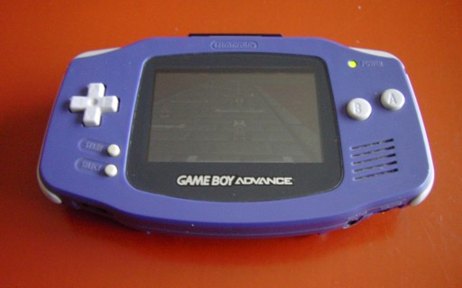
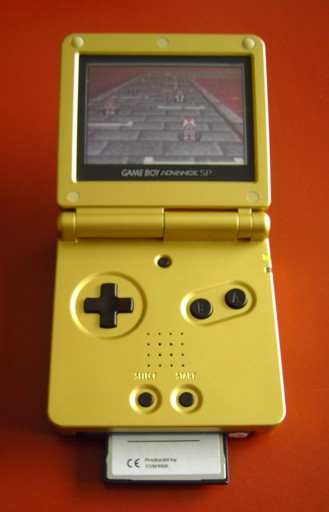

Title: GBA Hardware
Date: 2003-12-23
Modified: 2023-09-09
Authors: Cearn

# 1. GBA Hardware {#ch-}

<!-- toc -->

## Meet the GBA {#sec-intro}

The Nintendo GameBoy Advance (GBA) is a portable games console. As if you didn't know already. The CPU is a 32-bit ARM7tdmi chip running at 16.78 MHz. It has a number of distinct memory areas (like work RAM, IO and video memory) which we will look into shortly. The games are stored on <dfn>Game Paks</dfn>, consisting of ROM for code and data, and fairly often some RAM for saving game info. The GBA has a 240x160 LCD screen capable of displaying 32768 colors (15 bits). Unfortunately, the screen is not back-lit, which made a lot of people very angry and has generally been regarded as a bad move. So, in 2003 Nintendo launched the GBA SP, a sort of GBA 2.0, which features a fold-up screen reminiscent of the old Game & Watch games (remember those? You do? Boy, you are *old*! (For the record, I still have mine too `:)` )). Then in came the final GBA version, the GBA micro, a very, very small GBA which easily fits in everyone's pockets. The differences the GBA, GBA-SP and Micro are mainly cosmetic, though, they're the same thing from a programming point of view.

The original GameBoy which took the world by storm in 1989. Not bad for a monochrome handheld console, eh? Later the GameBoy Color was released which finally put some color on the aging machine, but it was still very much a simple GameBoy. The true successor was the GBA, released in 2002. The GBA is backward compatible with the GameBoy, so you can play all the old GB games as well.

In terms of capabilities the GBA is a lot like the Super NES (SNES): 15-bit color, multiple background layers and hardware rotation and scaling. And shoulder buttons, of course. A cynic might look at the enormous amount of SNES ports and say that the GBA *is* a SNES, only portable. This is true, but you can hardly call that a bad thing.

  <table>
    <tbody valign="top">
      <tr>
        <td>
          

            
             
            <b>{*@fig:gba}</b>: original GBA.
          

        </td>
        <td rowspan=2>
          

            
             
            <b>{*@fig:gba-sp}</b>: GBA-SP.
          

        </td>
      </tr>
    </tbody>
  </table>

## GBA specs and capabilities {#sec-specs}

Below is a list of the specifications and capabilities of the GBA. This not a full list, but these are the most important things you need to know.

- Video
    - 240x160 pixel, 15-bit color LCD screen. The original GBA screen was not backlit, but the SP's and Micro's are.
    - 3 [bitmap modes](bitmaps.html) and 3 [tilemap modes](regbg.html) and [sprites](regobj.html).
    - 4 individual tilemap layers (backgrounds) and 128 sprites (objects).
    - [Affine transformations](affine.html) (rotate/scale/shear) on 2 backgrounds and 32 objects.
    - [Special graphic effects](gfx.html): mosaic, additive blend, fade to white/black.
- Sound
    - 6 channels total
    - 4 tone generators from the original GameBoy: 2 square wave, 1 general wave and one noise generator.
    - 2 'DirectSound' channels for playing samples and music.
- Miscellaneous
    - 10 buttons (or [keys](keys.html)): 4-way directional pad, Select/Start, fire buttons A/B, shoulder buttons L/R.
    - 14 hardware interrupts.
    - 4-player multiplayer mode via a multiboot cable.
    - Optional infrared, solar and gyroscopic interfaces. Other interfaces have also been made by some.
    - Main programming platforms: C/C++ and assembly, though there are tools for Pascal, Forth, LUA and others as well. Easy to start with, yet hard to truly master.

From a programming point of view, the GBA (or any other console for that matter) is totally different from a PC. There is no operating system, no messing with drivers and hardware incompatibilities; it's bits as far as the eye can see. Well, PCs are also just bits, but that's several layers down; on consoles it's just you, the CPU and memory. Basically, it's the [Real Programmer](http://www.catb.org/~esr/jargon/html/R/Real-Programmer.html)'s dream.

To get anything done, you use <dfn>memory-mapped IO</dfn>. Specific areas of memory are mapped directly to hardware functions. In the first demo, for example, we will write the number `0x0403` to memory address `0400:0000h`. This tells the GBA to enable background 2 and set the graphics mode to 3. What this actually *means* is, of course, what this tutorial is for `:)`.

### CPU {#ssec-cpu}

As said, the GBA runs on a ARM7tdmi RISC chip at 16.78 MHz (2^24^ cycles/second). It is a 32-bit chip that can run on two different instruction sets. First, there's is <dfn>ARM code</dfn>, which is a set of 32-bit instructions. Then there's <dfn>THUMB</dfn>, which uses 16-bit instructions. THUMB instructions are a subset of the ARM instruction set; since the instructions are shorter, the code can be smaller, but their power is also reduced. It is recommended that normal code be THUMB code in ROM, and for time-critical code to be ARM code and put in IWRAM. Since all tonc-demos are still rather simple, most (but not all) code is THUMB code.

For more information on the CPU, go to [www.arm.com](http://www.arm.com) or to the [assembly chapter](asm.html)

## Memory Sections {#sec-memory}

This section lists the various memory areas. It's basically a summary of the [GBATek](http://nocash.emubase.de/gbatek.htm) section on memory.

  <table border=1 cellspacing=0 cellpadding=2>
    <col span=8 valign="top">
    <thead>
      <tr>
        <th>area</th>
        <th>start</th>
        <th>end</th>
        <th>length</th>
        <th>port-size</th>
        <th>description</th>
      </tr>
    </thead>
    <tbody>
      <tr>
        <th>System ROM</th>
        <td><code>0000:0000</code></td>
        <td><code>0000:03FF</code></td>
        <td>16 KB</td>
        <td>32 bit</td>
        <td>Bios memory. You can execute it, but not read it (i.o.w, touch, don't look)</td>
      </tr>
      <tr>
        <th>EWRAM</th>
        <td><code>0200:0000h</code></td>
        <td><code>0203:FFFFh</code></td>
        <td>256 KB</td>
        <td>16 bit</td>
        <td>External work RAM. Is available for your code and data. If you're using a multiboot cable, this is where the downloaded code goes and execution starts (normally execution starts at ROM). Due to the 16-bit port, you want this section's code to be THUMB code.</td>
      </tr>
      <tr>
        <th>IWRAM</th>
        <td><code>0300:0000h</code></td>
        <td><code>0300:7FFFh</code></td>
        <td>32 KB</td>
        <td>32 bit</td>
        <td>This is also available for code and data. The 32-bit bus and the fact it's embedded in the CPU make this the fastest memory section. The 32-bit bus means that ARM instructions can be loded at once, so put your ARM code here.</td>
      </tr>
      <tr>
        <th>IO RAM</th>
        <td><code>0400:0000h</code></td>
        <td><code>0400:03FFh</code></td>
        <td>1 KB</td>
        <td>32 bit</td>
        <td>Memory-mapped IO registers. These have nothing to do with the CPU registers you use in assembly so the name can be a bit confusing. Don't blame me for that. This section is where you control graphics, sound, buttons and other features.</td>
      </tr>
      <tr>
        <th>PAL RAM</th>
        <td><code>0500:0000h</code></td>
        <td><code>0500:03FFh</code></td>
        <td>1 KB</td>
        <td>16 bit</td>
        <td>Memory for two palettes contaning 256 entries of 15-bit colors each. The first is for backgrounds, the second for sprites.</td>
      </tr>
      <tr>
        <th>VRAM</th>
        <td><code>0600:0000h</code></td>
        <td><code>0601:7FFFh</code></td>
        <td>96 KB</td>
        <td>16 bit</td>
        <td>Video RAM. This is where the data used for backgrounds and sprites are stored. The interpretation of this data depends on a number of things, including video mode and background and sprite settings.</td>
      </tr>
      <tr>
        <th>OAM</th>
        <td><code>0700:0000h</code></td>
        <td><code>0700:03FFh</code></td>
        <td>1 KB</td>
        <td>32 bit</td>
        <td>Object Attribute Memory. This is where you control the sprites.</td>
      </tr>
      <tr>
        <th>PAK ROM</th>
        <td><code>0800:0000h</code></td>
        <td>var</td>
        <td>var</td>
        <td>16 bit</td>
        <td>Game Pak ROM. This is where the game is located and execution starts, except when you're running from a multiboot cable. This size is variable, but the limit is 32 MB. It's a 16-bit bus, so THUMB code is preferable over ARM code here.</td>
      </tr>
      <tr>
        <th>Cart RAM</th>
        <td><code>0E00:0000h</code></td>
        <td>var</td>
        <td>var</td>
        <td>8 bit</td>
        <td>This is where saved data is stored. Cart RAM can be in the form of SRAM, Flash ROM or EEPROM. Programatically they all do the same thing: store data. The total size is variable, but 64 KB is a good indication.</td>
      </tr>
    </tbody>
  </table>

The various RAM sections (apart from Cart RAM) are zeroed at start-up by BIOS. The areas you will deal with them most are IO, PAL, VRAM and OAM. For simple games and demos it will usually suffice to load your graphics data into PAL and VRAM at the start use IO and OAM to take care of the actual interaction. The layout of these two sections is quite complex and almost impossible to figure out on your own (almost, because emulator builders obviously have done just that). With this in mind, reference sheets like the [GBATek](http://nocash.emubase.de/gbatek.htm) and the [CowBite Spec](http://www.cs.rit.edu/~tjh8300/CowBite/CowBiteSpec.htm) are unmissable documents. In theory this is all you need to get you started, but in practice using one or more tutorials (such as this one) with example code will save a lot of headaches.
