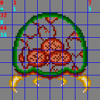
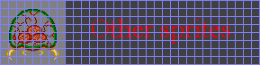
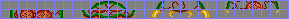

Title: Regular sprites
Date: 2003-09-01
Modified: 2023-09-09
Authors: Cearn

# 8. Regular sprites {#ch-}

<!-- toc -->

## Sprite introduction {#sec-intro}

<div class="cpt_fr" style="width:64px">

<b>{*@fig:metr}</b>. Metroid. Rawr.
</div>

According to Webster's, a sprite is “an imaginary being or spirit, as a fairy, elf, or goblin”. Right, glad that's cleared up. For games, though, when referring to a sprite one is usually talking about “a \[small\] animated object that can move freely from the background” (PERN). Primary examples are game characters, but status objects like scores and life bars are often sprites as well. {*@fig:metr} on the right shows a sprite of everybody's favorite vampire jellyfish, the metroid. I will use this sprite in the demo at the end of this chapter.

Sprites are a little trickier to use than a bitmap background, but not by much. You just have to pay a little more attention to what you're doing. For starters, the graphics have to be grouped into 8×8 tiles; make sure your graphics converter can do that. Aside from the obvious actions such as enabling sprites in the display control and loading up the graphics and palette, you also have to set-up the attributes of the sprites correctly in OAM. Miss any of these steps and you'll see nothing. These things and more will be covered in this chapter.

<div class="note">
<div class="nhgood">
Essential Sprite Steps
</div>

There are 3 things that you have to do right to get sprites to show up:

-   Load the graphics and palette into object VRAM and palette.
-   Set attributes in OAM to use the appropriate tiles and set the right size.
-   Switch on objects in `REG_DISPCNT`, and set the mapping mode there too.
</div>

<div class="note">
<div class="nhcare">
Sprites aren't objects
</div>

Or something like that. I know it sounds weird, but the more I think about it, the more I realize that sprites and objects shouldn't be considered interchangeable. The term ‘object’, is a hardware feature, controlled in OAM. Right now, I think that ‘sprite’ is more of a conceptual term, and should be reserved for actors, like playing characters, monsters, bullets, etc. These can in fact be built up of multiple hardware objects, or even use a background.

You could also thing of it in this way: objects are *system* entities linked to the console itself, and sprites are *game* entities, living in the game world. The difference may be subtle, but an important one.

This is merely my opinion, and I can't say how right I am in this. Tonc still switches back and forth between the two words because it's too late to do anything about it now. Mea culpa. I'd love to hear the opinion of others on the subject, so feel free to speak your mind if you want.
</div>

## Sprite image data and mapping mode {#sec-tiles}

Like I said in the [sprite and background overview](objbg.html), sprites are composed of a number of 8×8-pixel mini-bitmaps called tiles, which come in two types: 4bpp (s-tiles, 32 bytes long) and 8bpp (d-tiles, 64 bytes long). The tiles available for sprites are stored in <dfn>object VRAM</dfn>, or <dfn>OVRAM</dfn> for short. OVRAM is 32 KiB long and is mapped out by the last two charblocks of `tile_mem`, which are also known as the lower (block 4, starting at `0601:0000h`) and higher (block 5, `0601:4000h`) sprite blocks. Counting always starts at the lower sprite-block and is *always* done in 32 byte offsets, meaning that sprite-tile #1 is at `0601:0020h`, no matter what the bit depth is (see table 8.1). With 4000h bytes per charblock, a quick calculation will show you that there are 512 tiles in each charblock, giving a total range of 1024. However, since the [bitmap](bitmaps.html) modes extend into the lower sprite block, you can only use the higher sprite block (containing tiles 512 to 1023) in modes 3-5.

It may seem that calculating those tile addresses can be annoying, and it would be if you had to do it manually. That's why I have mapped the whole of VRAM with a charblock/tile matrix called `tile_mem`, as discussed in the [overview](objbg.html#ssec-img-cbb). Need tile #123 of OVRAM? That'd be `tile_mem[4][123]`. Need its address? Use the address operator: `&tile_mem[4][123]`. Quick, easy, safe.

Also, don't forget that the sprites have their own palette which starts at `0500:0200h` (right after the background palette). If you are certain you've loaded your tiles correctly but nothing shows up, it's possible you filled the wrong palette.

<div class="lblock">
<table id="tbl:obj-tids"
  border=1 cellspacing=0 cellpadding=1>
<caption align="bottom">
  <b>{*@tbl:obj-tids}</b>: tile counting for sprites, 
  always per 32 bytes. (You can use odd numbers for 8bpp tiles, but 
  be sure you fill the VRAM accordingly.)
</caption>
<tr>
  <th>memory 0601:<th>0000<th>0020 <th>0040<th>0060 <th>0080<th>0100 <th>...
<tr>
  <th>4bpp tile <td>0      <td>1  <td>2    <td>3  <td>4    <td>5 <td>&nbsp;
<tr>
  <th>8bpp tile <td colspan=2>0   <td colspan=2>2 <td colspan=2>4<td>&nbsp;
</table>
</div>

<div class="note">
<div class="nhcare">
Bitmap modes and Object VRAM
</div>

Only the higher sprite block is available for sprites in modes 3-5. Indexing still starts at the lower block, though, so the tile range is 512-1023.
</div>

### The sprite mapping mode {#ssec-map}

Sprites aren't limited to a single tile. In fact, most sprites are larger (see {*@tbl:obj-size} for a list of the available sizes for GBA sprites). Larger sprites simply use multiple tiles, but this may present a problem. For backgrounds, you choose each tile explicitly with the tile-map. In the case of sprites, you have two options: 1D and 2D mapping. The default is 2D mapping, and you can switch to 1D mapping by setting `REG_DISPCNT{6}`.

How do these work? Consider the example sprite of {@fig:obj-map}a, showing the metroid of {@fig:metr} divided into tiles. In 2D mapping, you're interpreting the sprite charblocks as one big bitmap of 256×256 pixels and the sprite a rectangle out of that bitmap (still divided into tiles, of course). In this case, each tile-row of a sprite is at a 32-tile offset. This is shown in {@fig:obj-map}b. On the other hand, you can also consider the charblocks as one big array of tiles, and the tiles of every sprite are consecutive. This is shown in {@fig:obj-map}c. The numbers in {@fig:obj-map}a show the difference between 1D and 2D mapping. Assuming we start at tile 0, the red and cyan numbers follow 2D and 1D mapping, respectively.

From a GBA-programming viewpoint, it is easier to use 1D mapping, as you don't have to worry about the offset of each tile-row when storing sprites. However, actually *creating* sprites is easier in 2D mode. I mean, do you *really* want to edit a bitmap tile by tile? That's what I thought. Of course, it should be the exporting tool's job to convert your sprites from 2D to 1D mapping for you. You can do this with [Usenti](https://www.coranac.com/projects/#usenti) too.

<div class="lblock">
<table id="fig:obj-map"
  cellpadding=4 cellspacing=0>
<tr valign="top">
<td>
  <div class="cpt" style="width:200px">
  
  <b>{*@fig:obj-map}a</b>: zoomed out version of 
  {*@fig:metr}, divided into tiles; colored numbers 
    indicate mapping mode: red for 2D, cyan for 1D.
  </div>
<td>
  <div class="cpt" style="width:297px">
  
  <b>{*@fig:obj-map}b</b>: how 
    {@fig:obj-map}a should be stored in memory when 
	using 2D mapping.
  </div>
  <br>
  <div class="cpt" style="width:296px">
  
  <b>{*@fig:obj-map}c</b>: how 
    {@fig:obj-map}a should be stored in memory when using 
	1D mapping.
  </div>
</table>
</div>

<div class="note">
<div class="nh">
Object data conversion via CLI
</div>

Some command-line interfaces can tile bitmaps for use with objects (and tilemaps). In some cases, they can also convert images with multiple sprite-frames to a set of object tiles in 1D object mapping mode. If *foo.bmp* is a 64×16 bitmap with 4 16×16 objects, here's how you can convert it to 8×8 4bpp tiles using gfx2gba and grit (flags for 1D mapping are given in brackets)

```sh
# gfx2gba
# 4x 16x16@4 objects (C array; u8 foo_Bitmap[], u16 master_Palette[]; foo.raw.c, master.pal.c)
    gfx2gba -fsrc -c16 -t8 [-T32] foo.bmp
```

```sh
# grit
# 4x 16x16@4 objects (C array; u32 fooTiles[], u16 fooPal[]; foo.c, foo.h)
    grit foo.bmp -gB4 [-Mw 2 -Mh 2]
```

Two notes on the 1D mapping flags here. First, gfx2gba can only meta-tile (-T) square objects; for something like 16×8 objects you'd need to do the 1D mapping yourself. Second, grit's meta-tiling flags (`-Mw` and `-Mh`) can be anything, and use tile units, not pixels.
</div>

<div class="note">
<div class="nh">
Size units: tiles vs pixels
</div>

The default unit for bitmap dimensions is of course the pixel, but in tiled graphics it is sometimes more useful to use tiles as the basic unit, that is, the pixel size divided by 8. This is especially true for backgrounds. In most cases the context will suffice to indicate which one is meant, but at times I will denote the units with a ‘p’ for pixels or ‘t’ for tiles. For example, a 64x64p sprite is the same as a 8×8t sprite.
</div>

## Sprite control: Object Attribute Memory {#sec-oam}

Much unlike in the bitmap modes, you don't have to draw the sprites yourself: the GBA has special hardware that does it for you. This can get the sprites on screen faster than you could ever achieve programmatically. There are still limits, though: there is a limit to the amount of sprite pixels you can cram in one scanline. About 960, if the fora are anything to go by.

So you don't have to draw the sprites yourself; however, you *do* need to tell the GBA how you want them. This is what the <dfn>Object Attribute Memory </dfn> –OAM for short– is for. This starts at address `0700:0000h` and is 1024 bytes long. You can find two types of structures in OAM: the <dfn>OBJ_ATTR</dfn> struct for regular sprite attributes, and the <dfn>OBJ_AFFINE</dfn> struct containing the transformation data. The definitions of these structures can be found below. Note that names may vary from site to site.

<div id="cd-oam-structs">

```c
typedef struct tagOBJ_ATTR
{
    u16 attr0;
    u16 attr1;
    u16 attr2;
    s16 fill;
} ALIGN4 OBJ_ATTR;

typedef struct OBJ_AFFINE
{
    u16 fill0[3];
    s16 pa;
    u16 fill1[3];
    s16 pb;
    u16 fill2[3];
    s16 pc;
    u16 fill3[3];
    s16 pd;
} ALIGN4 OBJ_AFFINE;
```
</div>

There are a few interesting things about these structures. First, you see a lot of `fill`er fields. Second, if you would take 4 `OBJ_ATTR` structures and lay them over one `OBJ_AFFINE` structure, as done in {@tbl:obj-weave}, you'd see that the fillers of one would exactly cover the data of the other, and vice versa. This is no coincidence: OAM is in fact a weave of `OBJ_ATTR`s and `OBJ_AFFINE`s. Why would Nintendo use a weave instead of simply having one section of attributes and one for transform data? That's a good question and deserves a good answer. When I have one, I'll tell you (I'm guessing it's a data-alignment thing). Also, note that the elements of the `OBJ_AFFINE` are *signed* shorts. I've gone through a world of hurt with the `obj_aff` code because I used `u16` instead of `s16`. With 1024 bytes at our disposal, we have room for 128 `OBJ_ATTR` structures and 32 `OBJ_AFFINE`s. The rest of this file will explain regular sprites that only use `OBJ_ATTR`. I want to give the [affine transformation matrix](affine.html) the full mathematical treatment it deserves and will save [affine sprites](affobj.html) for later.

<div class="lblock">
<table id="tbl:obj-weave"
  class="reg" border=1 frame=void cellpadding=4 cellspacing=0>
<caption align= bottom>
  <b>{*@tbl:obj-weave}</b>: 
  memory interlace of OBJ_ATTR and 
  OBJ_AFFINE structures.
 </caption>
<tr align="left"><th>mem (u16)<th>0<th>3<th>4<th>7<th>8<th>b<th>c<th>f
<tr><th>OBJ_ATTR
  <td>0 1 2<td>&nbsp;<td>0 1 2<td>&nbsp;
  <td>0 1 2<td>&nbsp;<td>0 1 2<td>&nbsp;
<tr><th>OBJ_AFFINE
  <td>&nbsp;<td>pa<td>&nbsp;<td>pb
  <td>&nbsp;<td>pc<td>&nbsp;<td>pd
</table>
</div>

<div class="note">
<div class="nhgood">
Force alignment on OBJ_ATTRs
</div>
As of devkitARM r19, there are new rules on struct alignments, which means that structs may not always be word aligned, and in the case of `OBJ_ATTR` structs (and others), means that `struct` copies like the one in `oam_update()` later on, will not only be slow, they may actually break. For that reason, I will force word-alignment on many of my structs with `ALIGN4`, which is a macro for `__attribute__((aligned(4)))`. For more on this, see the section on [data alignment](bitmaps.html#ssec-data-align).
</div>

## Object attributes: OBJ_ATTR {#sec-oam-entry}

The basic control for every sprite is the `OBJ_ATTR` structure. It consists of three 16-bit attributes for such qualities as size, shape, position, base tile and more. Each of the three attributes is covered below.

### Attribute 0 {#ssec-obj-attr0}

The first attribute controls a great deal, but the most important parts are for the *y* coordinate, and the shape of the sprite. Also important are whether or not the sprite is transformable (an affine sprite), and whether the tiles are considered to have a bit depth of 4 (16 colors, 16 sub-palettes) or 8 (256 colors / 1 palette).

<div class="reg">
<table class="reg" id="tbl-oe-attr0"
  border=1 frame=void cellpadding=4 cellspacing=0>
<caption class="reg">
  <code>OBJ_ATTR.attr0</code>
</caption>
<tr class="bits">
	<td>F E<td>D<td>C<td>B A<td>9 8 <td>7 6 5 4 3 2 1 0
<tr class="bf">
	<td class="rclr1">Sh
	<td class="rclr2">CM
	<td class="rclr5">Mos
	<td class="rclr4">GM
	<td class="rclr3">OM
	<td class="rclr0">Y
</table>

<table>
  <col class="bits" width=40>
  <col class="bf" width="8%">
  <col class="def" width="12%">
<tr align="left"><th>bits<th>name<th>define<th>description
<tbody valign="top">
<tr class="bg0">	
  <td>0-7<td class="rclr0">Y
  <td><i>ATTR0_Y#</i>
  <td><b>Y coordinate</b>. Marks the top of the sprite.
<tr class="bg1">	
  <td>8-9<td class="rclr3">OM
  <td>ATTR0_REG, ATTR0_AFF, ATTR0_HIDE, ATTR0_AFF_DBL.
    <i>ATTR0_MODE#</i>
  <td><b>(Affine) object mode</b>. Use to hide the sprite or govern 
    affine mode.
    <ul>
      <li><b>00</b>. Normal rendering.
      <li><b>01</b>. Sprite is an affine sprite, using affine matrix
        specified by <code>attr1{9-D}</code>
      <li><b>10</b>. Disables rendering (hides the sprite)
      <li><b>11</b>. Affine sprite using double rendering area. See 
        <a href="affobj.html">affine sprites</a> for more.
    </ul>   
<tr class="bg0">	
  <td>A-B<td class="rclr4">GM
  <td>ATTR0_BLEND, ATTR0_WIN. <i>ATTR0_GFX#</i>
  <td><b>Gfx mode</b>. Flags for special effects.
    <ul>
      <li><b>00</b>. Normal rendering.
      <li><b>01</b>. Enables alpha blending. Covered 
        <a href="gfx.html#sec-blend">here</a>.
      <li><b>10</b>. Object is part of the object window. The sprite 
        itself isn't rendered, but serves as a mask for bgs and other 
        sprites. (I think, haven't used it yet)
      <li><b>11</b>. Forbidden.
    </ul>
<tr class="bg1">	
  <td>C<td class="rclr5">Mos
  <td>ATTR0_MOSAIC
  <td>Enables mosaic effect. Covered <a href="gfx.html#sec-mos">here</a>. 
<tr class="bg0">	
  <td>D<td class="rclr2">CM
  <td>ATTR0_4BPP, ATTR0_8BPP
  <td><b>Color mode</b>. 16 colors (4bpp) if cleared; 
    256 colors (8bpp) if set.    
<tr class="bg1">	
  <td>E-F<td class="rclr1">Sh
  <td>ATTR0_SQUARE, ATTR0_WIDE, ATTR0_TALL. <i>ATTR0_SHAPE#</i>
  <td><b>Sprite shape</b>. This and the sprite's size 
    (<code>attr1{E-F}</code>) determines the sprite's real size, see 
    <a href="#tbl-obj-size">table 8.4</a>.
</tbody>
</table>
</div>

Two extra notes on attribute 0. First, `attr0` contains the ***y*** coordinate; `attr1` contains the ***x*** coordinate. For some reason I keep messing these two up; if you find your sprite is moving left when it should be moving up, this may be why. Second, the affine and gfx modes aren't always named as such. In particular, `attr0{9}` is simply referred to as *the* double-size flag, even though it only works in that capacity if bit 8 is set too. If it isn't, then it hides the sprite. I think that it's actually taken out of the object rendering stage entirely leaving more time for the others, but I'm not 100% sure of that.

<div class="lblock">
<table id="tbl:obj-size"
  class="reg" border=1 cellpadding=2 cellspacing=0>
<caption align="bottom">
  <b>{*@tbl:obj-size}</b>: GBA sprite sizes
</caption>
<tr><td>shape\size <th>00    <th>01    <th>10    <th>11
<tr><th>00<td>8×8  <td>16×16 <td>32×32 <td>64×64
<tr><th>01<td>16×8 <td>32×8 <td>32×16 <td>64×32
<tr><th>10<td>8×16 <td>8×32 <td>16×32 <td>32×64
</table></div>

### Attribute 1 {#ssec-obj-attr1}

The primary parts of this attribute are the *x* coordinate and the size of the sprite. The role of bits 9 to 13 depend on whether or not this is a affine sprite (determined by `attr0{8}`). If it is, these bits specify which of the 32 `OBJ_AFFINE`s should be used. If not, they hold flipping flags.

<div class="reg">
<table class="reg" id="tbl-oe-attr1"
  border=1 frame=void cellPadding=4 cellSpacing=0>
<caption class="reg">
  <code>OBJ_ATTR.attr1</code>
</caption>
<tr class="bits">
	<td>F E<td>D<td>C<td>B A 9<td>8 7 6 5 4 3 2 1 0
<tr class="bf">
	<td class="rclr1">Sz
	<td class="rclr2">VF
	<td class="rclr2">HF
	<td>-
	<td class="rclr0">X
<tr class="bf">
    <td>-
	<td colspan=3 class="rclr3">AID
    <td>-
</table>

<table>
  <col class="bits" width=40>
  <col class="bf" width="8%">
  <col class="def" width="12%">
<tr align="left"><th>bits<th>name<th>define<th>description
<tbody valign="top">
<tr class="bg0">	
  <td>0-8<td class="rclr0">X
  <td><i>ATTR1_X#</i>
  <td><b>X coordinate</b>. Marks left of the sprite.
<tr class="bg1">	
  <td>9-D<td class="rclr3">AID
  <td><i>ATTR1_AFF#</i>
  <td><b>Affine index</b>. Specifies the <code>OAM_AFF_ENTY</code> this 
    sprite uses. Valid <i>only</i> if the affine flag 
    (<code>attr0</code>{8}) is set.
<tr class="bg0">	
  <td>C-D<td class="rclr2">HF, VF
  <td>ATTR1_HFLIP, ATTR1_VFLIP. <i>ATTR1_FLIP#</i>
  <td><b>Horizontal/vertical flipping</b> flags. Used <i>only</i> if 
    the affine flag (<code>attr0</code>) is clear; otherwise they're 
    part of the affine index.
<tr class="bg1">	
  <td>E-F<td class="rclr1">Sz
  <td><i>ATTR1_SIZE#</i>
  <td><b>Sprite size</b>. Kinda. Together with the shape bits
    (<code>attr0</code>{E-F}) these determine the sprite's real size, 
    see {@tbl:obj-size}.
</tbody>
</table>
</div>

I'll say it here too: `attr0` contains *y*, `attr1` contains *x*. Note that bits 12 and 13 have a double role as either flipping flags or affine index. And if you are wondering if you can still flip affine sprites, the answer is yes: simply use negative scales in the matrix.

### Attribute 2 {#ssec-obj-attr2}

This attribute tells the GBA which tiles to display and its background priority. If it's a 4bpp sprite, this is also the place to say what sub-palette should be used.

<div class="reg">
<table class="reg" id="tbl:oe-attr2"
  border=1 frame=void cellpadding=4 cellspacing=0>
<caption class="reg">
  {*@tbl:oe-attr2}: <code>OBJ_ATTR.attr2</code>
</caption>
<tr class="bits">
	<td>F E D C<td>B A<td>9 8 7 6 5 4 3 2 1 0
<tr class="bf">
	<td class="rclr1">PB
	<td class="rclr2">Pr
	<td class="rclr0">TID
</table>

<table>
  <col class="bits" width=40>
  <col class="bf" width="8%">
  <col class="def">
<tr align="left"><th>bits<th>name<th>&nbsp;<th>description
<tbody valign="top">
<tr class="bg0">	
  <td>0-9<td class="rclr0">TID
  <td><code>ATTR2_ID#</code>
  <td>Base <b>tile index</b> of sprite. Note that in bitmap modes,
    this must be 512 or higher.
<tr class="bg1">	
  <td>A-B<td class="rclr2">Pr
  <td><code>ATTR2_PRIO#</code>
  <td><b>Priority</b>. Higher priorities are drawn first (and therefore 
    can be covered by later sprites and backgrounds). Sprites cover 
    backgrounds of the same priority, and for sprites of the 
    same priority, the higher <code>OBJ_ATTR</code>s are drawn first.
<tr class="bg0">	
  <td>C-F<td class="rclr1">PB
  <td><code>ATTR2_PALBANK#</code>
  <td><b>Palette bank</b> to use when in 16-color mode. Has no effect if
	the color mode flag (<code>attr0</code>{C}) is set.
</tbody>
</table>
</div>

### Attribute 3 {#ssec-obj-attr3}

There is *no* attribute 3. Although the `OBJ_ATTR` struct does *have* a fourth halfword, this is only a filler. The memory in that filler actually belongs to the `OBJ_AFFINE`s. Nobody is to mistreat `attr3` in any way … if there's any affine sprite active.

### OAM double buffering {#ssec-oam-buffer}

You *could* write all your sprite data directly to the OAM at `0700:0000h`, but that might not always be the best move. If it's done during VDraw there's the possibility of tearing. Even worse, you might change the sprite's tile-index in mid-render so that the top is in one animation frame and the bottom is in another. Not a pretty sight. Actually, this isn't something to worry about because you *can't* update OAM during VDraw; it's locked then. What's often done is creating a separate buffer of OAM entries (also known as the <dfn>object shadow</dfn>) that can be modified at any time, and then copy that to the real OAM during VBlank. Here's my take on this.

```c
OBJ_ATTR obj_buffer[128];
OBJ_AFFINE *const obj_aff_buffer= (OBJ_AFFINE*)obj_buffer;
```

I'm using 128 now, but I suppose you could use a lower number if you don't use all the sprites. Anyway, now you have a double buffer for both `OBJ_ATTR` and `OBJ_AFFINE` data, which is available at any given time. Just make sure you copy it to the *real* OAM when the time is right.

## Bitfield macros (OAM or otherwise) {#sec-macro}

Setting and clearing individual bits is easy, but sometimes it's not too convenient to do it all yourself. This is especially true for field of bits like positions or palette banks, which would involve long statements with masks and shifts if you want to do it nicely. To improve on this a little bit, I have a number of macros that may shorted the amount of actual code. There are essentially three classes of macros here, but before I go into that, I have to explain a little bit more about the hashed (*foo*‘#”) defines in the attribute lists above.

The hash means that for each of these, there will be three `#define`s with *foo* as their roots: *foo*`_MASK`, *foo*`_SHIFT`, and *foo*`(_n)`. These give the bitmask, bitshift and a bitfield set macro for the corresponding type.

For example, the one attached to the tile index, `ATTR2_ID#`. The tile index field has 10 bits and starts at bit 0. The corresponding defines therefore are:

```c
// The 'ATTR2_ID#' from the attr2 list means these 3 #defines exist
#define ATTR2_ID_MASK       0x03FF    
#define ATTR2_ID_SHIFT           0    
#define ATTR2_ID(n)        ((n)<<ATTR2_ID_SHIFT)
```

Most GBA libraries out there have `#define`s like these, albeit with different names. The actual macro isn't 100% safe because it does no range checking, but it's short and sweet. Now, as far as Tonc's text is concerned, every time you see the hash in the define list for a register, it'll have these three `#define`s to go with that name.

I also have a second batch of macros you can use for setting and getting specific fields, which use the mask and shift names explained above. I'll admit the macros look horrible, but I assure you they make sense and can come in handy.

<div id="cd-bitfield">

```c
// bit field set and get routines
#define BF_PREP(x, name)         ( ((x)<<name##_SHIFT)& name##_MASK  )
#define BF_GET(x, name)          ( ((x) & name##_MASK)>> name##_SHIFT )
#define BF_SET(y, x, name)       (y = ((y)&~name##_MASK) | BF_PREP(x,name) )

#define BF_PREP2(x, name)        ( (x) & name##_MASK )
#define BF_GET2(y, name)         ( (y) & name##_MASK )
#define BF_SET2(y, x, name)      (y = ((y)&~name##_MASK) | BF_PREP2(x, name) )
```
</div>

Well, I did warn you. The `name` argument here is the *foo* from before. The preprocessor concatenation operator is use to create the full mask and shift names. Again using the tile-index as an example, these macros expand to the following:

```c
// Create bitfield:
attr2 |= BF_PREP(id, ATTR0_SHAPE);
// becomes:
attr2 |= (id<<ATTR2_ID_SHIFT) & ATTR2_ID_MASK;

// Retrieve bitfield:
id= BF_GET(attr2, ATTR2_ID);
// becomes:
id= (attr2 & ATTR2_ID_MASK)>>ATTR2_ID_SHIFT;

// Insert bitfield:
BF_SET(attr2, id, ATTR2_ID);
// becomes:
attr2= (attr&~ATTR2_ID_MASK) | ((id<<ATTR2_ID_SHIFT) & ATTR2_ID_MASK);
```

`BF_PREP()` can be used to prepare a bitfield for later insertion or comparison. `BF_GET()` gets a bitfield from a value, and `BF_SET()` sets a bitfield in a variable, without disturbing the rest of the bits. This is basically how bitfields normally work, except that true bitfields cannot be combined with OR and such.

The macros with a ‘2’ in their names work in a similar way, but do not apply shifts. These can be useful when you have already shifted `#define`s like `ATTR0_WIDE`, which can't use the other ones.

```c
// Insert pre-shifted bitfield:
// BF_SET2(attr0, ATTR0_WIDE, ATTR0_SHAPE);
attr0= (attr0&~ATTR0_SHAPE_MASK) | (id & ATTR0_SHAPE_MASK);
```

Note that none of these three have anything GBA specific in them; they can be used on any platform.

Finally, what I call my build macros. These piece together the various bit-flags into a single number in an orderly fashion, similar to HAM's tool macros. I haven't used them that often yet, and I'm not forcing you to, but on occasion they are useful to have around especially near initialization time.

<div id="cd-oe-build">

```c
// Attribute 0
#define ATTR0_BUILD(y, shape, bpp, mode, mos, bld, win)             \
(                                                                   \
    ((y)&255) | (((mode)&3)<<8) | (((bld)&1)<<10) | (((win)&1)<<11) \
    | (((mos)&1)<<12) | (((bpp)&8)<<10) | (((shape)&3)<<14)         \
)

// Attribute 1, regular sprites
#define ATTR1_BUILD_R(x, size, hflip, vflip)         \
( ((x)&511) | (((hflip)&1)<<12) | (((vflip)&1)<<13) | (((size)&3)<<14) )

// Attribute 1, affine sprites
#define ATTR1_BUILD_A(x, size, aff_id)               \
( ((x)&511) | (((aff_id)&31)<<9) | (((size)&3)<<14) )

Attribute 2
#define ATTR2_BUILD(id, pbank, prio)                 \
( ((id)&0x3FF) | (((pbank)&15)<<12) | (((prio)&3)<<10) )
```
</div>

Instead of doing ORring the bitflags together yourself, you can use these and perhaps save some typing. The order of arguments maybe annoying to remember for some, and the amount of safety checking may be a bit excessive (gee, ya think?!?), but if the numbers you give them are constants the operations are done at compile time so that's okay, and sometimes they really can be helpful. Or not <span class="kbd">:P</span>. Like I said, I'm not forcing you to use them; if you think they're wretched pieces of code (and I admit they are) and don't want to taint your program with them, that's fine.

Note that with the exception of `bpp`, the arguments are all shifted by the macros, meaning that you should *not* use the `#define` flags from the lists, just small values like you'd use if they were separate variables rather than bits in a variable.

## Demo time {#sec-obj-demo}

Now, to actually use the bloody things. The code below is part of the *obj_demo*. It is the most complex I've shown yet, but if you take it one step at a time you'll be fine. Essentially, this demo places the tiles of a boxed metroid in the VRAM allotted for objects and then lets you screw around with various `OBJ_ATTR` bits like position and flipping flags. The controls are as follows:

- Control Pad  
  Moves the sprite. Note that if you move far enough off-screen, it'll come up on the other side.
- A and B Buttons  
  Flip the sprite horizontally or vertically, respectively.
- Select Button  
  Makes it glow. Well, makes it palette-swap, actually. Handy for damage-flashing.
- Start Button  
  Toggles between 1D and 2D mapping modes. {*@fig:obj-map}b and {@fig:obj-map}c should explain what happens. Since the sprite is in 1D mode, there's really not much to see when you switch to 2D mapping, but I had a few buttons to spare, so I thought why not.
- L and R Buttons  
  Decreases or increase the starting tile, respectively. Again, I had a few keys to spare.

```c
// Excerpt from toolbox.h

void oam_init(OBJ_ATTR *obj, uint count);
void oam_copy(OBJ_ATTR *dst, const OBJ_ATTR *src, uint count);

INLINE OBJ_ATTR *obj_set_attr(OBJ_ATTR *obj, u16 a0, u16 a1, u16 a2);
INLINE void obj_set_pos(OBJ_ATTR *obj, int x, int y);
INLINE void obj_hide(OBJ_ATTR *oatr);
INLINE void obj_unhide(OBJ_ATTR *obj, u16 mode);

// === INLINES ========================================================

//! Set the attributes of an object.
INLINE OBJ_ATTR *obj_set_attr(OBJ_ATTR *obj, u16 a0, u16 a1, u16 a2)
{
    obj->attr0= a0; obj->attr1= a1; obj->attr2= a2;
    return obj;
}

//! Set the position of \a obj
INLINE void obj_set_pos(OBJ_ATTR *obj, int x, int y)
{
    BF_SET(obj->attr0, y, ATTR0_Y);
    BF_SET(obj->attr1, x, ATTR1_X);
}

//! Hide an object.
INLINE void obj_hide(OBJ_ATTR *obj)
{   BF_SET2(obj->attr0, ATTR0_HIDE, ATTR0_MODE);        }

//! Unhide an object.
INLINE void obj_unhide(OBJ_ATTR *obj, u16 mode)
{   BF_SET2(obj->attr0, mode, ATTR0_MODE);          }
```

```c
// toolbox.c

void oam_init(OBJ_ATTR *obj, uint count)
{
    u32 nn= count;
    u32 *dst= (u32*)obj;

    // Hide each object
    while(nn--)
    {
        *dst++= ATTR0_HIDE;
        *dst++= 0;
    }
    // init oam
    oam_copy(oam_mem, obj, count);
}

void oam_copy(OBJ_ATTR *dst, const OBJ_ATTR *src, uint count)
{

// NOTE: while struct-copying is the Right Thing to do here, 
//   there's a strange bug in DKP that sometimes makes it not work
//   If you see problems, just use the word-copy version.
#if 1
    while(count--)
        *dst++ = *src++;
#else
    u32 *dstw= (u32*)dst, *srcw= (u32*)src;
    while(count--)
    {
        *dstw++ = *srcw++;
        *dstw++ = *srcw++;
    }
#endif

}
```

This is the basic utility code for the demo, and contains most of the things you'd actually like to have functions for. Note that the inline functions make good use of the bitfield macros shown earlier; if I hadn't done that, the code would be a good deal longer.

Another point that I need to make is that if I'd put everything into *toolbox.h*, the file would be pretty big, around 700 lines or so. And with future demos, it'd be a lot longer. With that in mind, I've started redistributing the contents a little: all the types go in *types.h*, everything to do with the memory map goes into *memmap.h*, all the register defines go into *memdef.h* and the input inlines and macros can be found in *input.h*. The rest is still in *toolbox.h*, but will find themselves redistributed in the end as well.

The two functions in *toolbox.c* need some more clarification as well I guess. In `oam_init()` I cast the objects to a word pointer and use that for setting things; again, this is simply because it's a lot faster. Because it may be used to initialixe something other than the real OAM, I copy the initialized buffer to OAM just in case.

The other point concerns something of a very specific bug in the optimizer of the current compiler (devkitARM r19b). I expect this to be fixed in a later addition and the basic version here *should* work, but just in case it isn't, set the `#if` expression to 0 if you see OAM get corrupted. If you must know, the problem seems to be `struct` copying of OBJ_ATTRs in a `for` loop. Yes, it's that specific. Even though `struct` copying is legal and fast if they're word aligned, it seems GCC gets confused with 8-byte blocks in loops and uses `memcpy()` for each struct anyway, something that wouldn't work on OAM. Oh well.

<div id="cd-obj-demo">

```c
#include <string.h>
#include "toolbox.h"
#include "metr.h"


OBJ_ATTR obj_buffer[128];
OBJ_AFFINE *obj_aff_buffer= (OBJ_AFFINE*)obj_buffer;

void obj_test()
{
    int x= 96, y= 32;
    u32 tid= 0, pb= 0;      // (3) tile id, pal-bank
    OBJ_ATTR *metr= &obj_buffer[0];

    obj_set_attr(metr, 
        ATTR0_SQUARE,              // Square, regular sprite
        ATTR1_SIZE_64,              // 64x64p, 
        ATTR2_PALBANK(pb) | tid);   // palbank 0, tile 0

    // (4) position sprite (redundant here; the _real_ position
    // is set further down
    obj_set_pos(metr, x, y);

    while(1)
    {
        vid_vsync();
        key_poll();

        // (5) Do various interesting things
        // move left/right
        x += 2*key_tri_horz();
        // move up/down
        y += 2*key_tri_vert();

        // increment/decrement starting tile with R/L
        tid += bit_tribool(key_hit(-1), KI_R, KI_L);

        // flip
        if(key_hit(KEY_A))  // horizontally
            metr->attr1 ^= ATTR1_HFLIP;
        if(key_hit(KEY_B))  // vertically
            metr->attr1 ^= ATTR1_VFLIP;

        // make it glow (via palette swapping)
        pb= key_is_down(KEY_SELECT) ? 1 : 0;

        // toggle mapping mode
        if(key_hit(KEY_START))
            REG_DISPCNT ^= DCNT_OBJ_1D;

        // Hey look, it's one of them build macros!
        metr->attr2= ATTR2_BUILD(tid, pb, 0);
        obj_set_pos(metr, x, y);

        oam_copy(oam_mem, obj_buffer, 1);   // (6) Update OAM (only one now)
    }
}

int main()
{
    // (1) Places the tiles of a 4bpp boxed metroid sprite 
    //   into LOW obj memory (cbb == 4)
    memcpy(&tile_mem[4][0], metr_boxTiles, metr_boxTilesLen);
    memcpy(pal_obj_mem, metrPal, metrPalLen);

    // (2) Initialize all sprites
    oam_init(obj_buffer, 128);
    REG_DISPCNT= DCNT_OBJ | DCNT_OBJ_1D;

    obj_test();

    while(1);

    return 0;
}
```
</div>

### Setting up sprites {#ssec-demo-init}

Before any sprites show up, there are three things you have to do, although not necessarily in this order. They are: copying sprite graphics to VRAM, setting up OAM to use these graphics, and enabling sprites in the display control, `REG_DISPCNT`.

#### Display control

Starting with the last one, you enable sprites by setting bit 12 of `REG_DISPCNT`. Usually you'll also want to use 1D mapping, so set bit 6 as well. This is done at **point (2)** of the code.

#### Hiding all sprites

The other step performed here is a call to `oam_init()`. This isn't strictly necessary, but a good idea nonetheless. What `oam_init()` does is hide all the sprites. Why is this a good idea? Well, because a fully zeroed out OAM does *not* mean the sprites are invisible. If you check the attributes you'll see that this will mean that they're all 8×8-pixel sprites, using tile 0 for their graphics, located at (0,0). If the first tile isn't empty, you'll start with 128 versions of that tile in the top-left corner, which looks rather strange. So, make sure they're all invisible first. The demo also comes with `obj_hide()` and `obj_unhide()` functions, although they aren't used here.

#### Loading sprite graphics

The first thing to do (**point (1)**) is to store the sprite graphics in object VRAM. As I've already said a few times now, these graphics should be stored as 8×8-pixel tiles, not as a flat bitmap. For example, my sprite here is 64×64p in size, so to store it I've had to convert this to 8×8 separate tiles first. If you do *not* do this, your sprites will look very strange indeed.

Exactly where you put these tiles is actually not all that relevant (apart from the obvious, like mapping mode, and tile alignment, of course). Object VRAM works as a texture pool and has nothing to do with the screen directly. You store the tiles that you want to be available there, and it is by manipulating the OAM attributes that the system knows which tiles you want to use and where you want them. There is no reason why sprite 0 couldn't start at tile 42, or why multiple sprites couldn't use the same tiles. This is also why `OAMData`, which is sometimes used for object VRAM, is such a misnomer: object VRAM has nothing to do with OAM. *Nothing*! If your headers use this name for <span class="kbd">0601:0000</span>, or even <span class="kbd">0601:4000</span>, change it. Please. And be careful where you put things in the bitmap modes, as you can't use tiles 0-511 there.

As I said, loading the sprites happens at **point (1)** in the code. If you paid attention to the [overview](objbg.html#ssec-img-cbb), you'll remember that `tile_mem[][]` is a two dimensional array, mapping charblocks and 4-bit tiles. You'll also remember that object VRAM is charblocks 4 and 5, so `&tile_mem[4][0]` points to the first tile in object VRAM. So I'm loading my boxed metroid into the first 64 tiles of object VRAM.

I am also loading its palette into the sprite palette. That's *sprite* palette (<span class="kbd">0500:0200</span>), not background palette. Load it to the wrong place and you won't see anything.

<div class="note">
<div class="nhgood">
Finding tile addresses
</div>

Use `tile_mem` or a macro to find the addresses to copy your tiles too, it's much more readable and maintainable than calculating them manually. You should not have any hard-coded VRAM addresses in your code, ever.
</div>

<div class="note">
<div class="nhbad">
OAMData
</div>

Headers from other sites sometimes `#define OAMData` as part of VRAM. It is not. Rename it.
</div>

#### Setting attributes

Lastly, I'll set up one `OBJ_ATTR` so that it actually uses the metroid tiles. This is done at **point (3)**, using the `obj_set_attr()` inline function. All it does is three assignments to the attributes of the first argument, by the way, nothing spectacular. This just saves typing doing it this way rather than three separate statements. With this particular call, I tell this sprite that it's a 64×64 pixel (8×8 tile) sprite, and its starting tile is `tid`, which is 0. This means that it'll use the 64 tiles, starting at tile 0.

Note that the sprite I'm setting is actually part of the OAM buffer, not the real OAM. This means that even after I set the attributes there, nothing happens yet. To finalize the sprite I need to update the *real* OAM, which is done by a call to `oam_copy()` (**point (6)**). This carries two arguments: an index and a count denoting how many sprites to update, and which sprite to start at. I also have `obj_copy()`, which only copies attributes 0, 1 and 2, but *not* 3! This is necessary when you start using affine sprites, which may be copied incorrectly otherwise.

The previous steps are enough to get the metroid sprite on-screen. The story doesn't end there, of course. Here are a few things that you can do with sprites.

### Sprite positioning {#ssec-demo-pos}

The first order of business is usually to place it at some position on screen, or even off screen. To do this you have to update the bits for the *y* and *x* positions in attributes 0 and 1, respectively. One mistake I often seem to make is fill *x* into attr0 and *y* into attr1, when it should be the other way around. If your sprite moves strangely, this might be why.

Note that these coordinates mark the **top-left** of the sprite. Also, the number of bits for the coordinates means we have 512 possible *x*-values and 256 *y*-values. The coordinate ranges wrap around, so you could also say that these are signed integers, with the ranges *x* ∈ \[-256, 255\] and *y* ∈ \[-128, 127\]. Yes, that would make the highest *y*-value smaller than the height of the screen, but thanks to the wrapping it all works out. Well, [almost](affobj.html#ssec-wrap). Anyway, thanks to the 2s-complement nature of integers, simply masking the *x* and *y* values by `0x01FF` and `0x00FF`, respectively, will give proper 9- and 8-bit signed values. You can do this manually, or use the `obj_set_pos()` function used at **point (4)**.

You might see code that clears the lower bits of the attributes and then directly ORRs in *x* and *y*. This is not a good idea, because negative values are actually represented by upper half of a datatype's range. −1 for example is all bits set (0xFFFFFFFF). Without masking off the higher bits, negative values would overwrite the rest of the attribute bits, which would be bad.

<div class="note">
<div class="nhcare">
Mask your coordinates
</div>

If you're making a sprite positioning function or use someone else's **make sure** you mask off the bits in *x* and *y* before you insert them into the attributes. If not, negative values will overwrite the whole attribute.

This is bad

```c
obj->attr0= (obj->attr0 &~ 0x00FF) | (y);
```

This is good:

```c
obj->attr0= (obj->attr0 &~ 0x00FF) | (y & 0x00FF);
```
</div>

#### Position variables and using tribools

Instead of using an `OBJ_ATTR` to store the sprite's position, it is better to keep them in separate variables, in this case `x` and `y`. This avoids having to mask coordinate fields all the time, but more importantly, the positions can extend beyond the size of the screen. As most game worlds aren't restricted to a single screen, this is an important point. Then, when the time is right, these are fed to `oam_set_pos()` to update the sprite.

Also, note the use of my [tribool key functions](keys.html#ssec-adv-tri) to update the positions. Input processing often follows a pattern of “key X pressed: increment, key opposite of Y pressed, decrement” The tribool functions bring that kind of code down from four lines to one, which makes the code easier to read (once you get over the initial hurdle). For example, `key_tri_horz()` returns +1 if ‘right’ is pressed, −1 if ‘left’ is pressed, and 0 if neither or both are pressed. `key_tri_vert()` does something similar for vertical movement and the line with `bit_tribool()` function makes a variant using `key_hit()` and R and L to increment or decrement the tile index.

### Other attrs {#ssec-demo-attr}

Sprite coordinates are only two of the many sprite attributes that can be controlled with via specific OAM bits, even while the sprite is already active. Some of the obvious ones are flipping or mirroring it, which can be done using A and B here. Or, if you're using a 4bpp sprite, you can swap palettes so that all the colors change. Pressing Select in the demo switches from palette bank 0 to 1, which happens to have a grey to white gradient. Toggling between these palette banks quickly can make the sprite flash. You could also change the priorities in which the sprites are rendered, or toggle alpha blending, although I haven't done those things here.

Now, these things don't really change the overall image of the sprite. What you should realize though is that it *is* possible to do that. As I've already noted before, it's not true that the contents of VRAM *are* the sprite, rather that a sprite *uses* parts of VRAM to show something, anything, on screen. You could, for example, change the starting tile `tid` that the sprite uses, which in this case can be done using L and R. Not only is this legal, it's the standard practice for animation (although you can also overwrite VRAM for that – resetting the tile index is just faster). Understanding this is one of the points of moving from a user to a developer perspective: the user only sees the surface; the coder looks below it and sees what's really going on.

And that's it for regular sprites. Using multiple sprites isn't much different – seen one, seen them all. Basic animation shouldn't be problematic either, until you run out of VRAM to put them in. There are still a few regions left untouched like blending and mosaic, but I'll deal with those [later](gfx.html).
