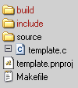
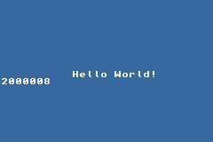

Title: Setting up a development environment
Date: 2007-12-29
Modified: 2023-11-18
Authors: Cearn

# 2. Setting up a development environment

<!-- toc -->

## Introduction {#sec-intro}

Unless you want to punch in the instructions in binary in a hex editor (“Luxury! When we were young we had to toggle each bit individually with magnets!”), you'll need a development environment to turn human readable code into machine language. There are several options here, but the main one in GBA homebrew is [devkitPro](//devkitpro.org) and the ARM cross-compiler devkitARM. This chapter will show you how to set-up the necessary components and how to get it running and how to compile tonc's code with it. I'll also show where you can find some other development packages currently available, but the focus in this and other chapters will be devkitPro/ARM.

The last section explains some of the details about using the command-line and makefiles. It is essentially optional, but for historical reasons I have to cover it before the rest of the chapters instead of putting it in an appendix.

## devkitPro and devkitARM {#sec-dkp}

### Installation {#ssec-dkp-install}

<div class="cpt_fr" style="width:208px;">
<br>
<b>{*@fig:dkp-dir}</b>: devkitPro dir tree.
</div>

In the last few years, [<dfn>devkitPro</dfn>](http://www.devkitpro.org) (DKP) has become the standard toolchain for GBA homebrew and is available for Windows, Mac and Linux platforms. DevkitPro is actually a package, containing, compilers for a number of systems (including GBA), library and example code and an editor. You can find the actual downloads in the [download](http://sourceforge.net/project/showfiles.php?group_id=114505) section of the sourceforge page: [http://sourceforge.net/projects/devkitpro/](http://sourceforge.net/projects/devkitpro/).

For the GBA, you will need:

- **devkitARM** (DKA). The ARM cross-compiler, based on the GCC toolchain.
- **MSys**. A shell with basic Unix commands like `make` and `rm`. Probably only needed for Windows platforms, which usually lack these tools.

Other recommended items are:

- **Programmer's Notepad 2**: an advanced plain text editor with code highlighters, code-folding capabilities and shell execution commands. I suppose you could call it a mini-IDE. Even if you had your own editor, it is recommended that you get this one as well because both DKP's and Tonc's examples contain PN2 project files, which makes it easier to build GBA projects.
- **libgba**: a set of basic types, macros and functions for use in GBA development. While I won't be using it here, it is still worth a look. Currently `libgba` and tonc's own code library `libtonc` are pretty much incompatible (multiple definitions and such), I am trying to make sure that there won't be any conflicts.
- **GBA examples**: a set of example projects using libgba.

For Windows, there is an installer that downloads and installs the components automatically. For Mac and Linux, you'll have to install things yourself. The installation process also creates a number of environment variables for directories to devkitPro and devkitARM, and adds `msys/bin` to the PATH.

When installng DKP on Windows, there's one thing you must be aware of. GCC-based tools have their origins in Unix, and Unix doesn't take kindly to spaces in paths. Therefore **do not** install into a directory with spaces (like `c:\Program Files`) and don't put your projects in a folder with spaces in the name either (like `My Documents`, which is actually ‘short’ for `c:\Documents And Settings\UserName\Blah Blah Blah More Ridiculously Long Directory Names That Never Fit In Textboxes\My Documents\`). Basically, don't use the standard Windows directories. My own installation tree looks like @fig:dkp-dir, but it's customary to put devkitPro in `c:\devkitPro`.

<div id="nt-paths" class="note">

<div class="nhbad">
Do not use spaces in paths
</div>

GCC makes use of the GCC toolchain, which doesn't cope well with spaces in paths (think `My Documents`). Spaces are used as a separator between command-line options and when you have them in paths the tools will interpret that as new options. While there are ways to use them anyway, you can save yourself a lot of headaches by simply staying clear of them.

</div>

### Building projects with DevkitARM {#ssec-dkp-use}

<div class="cpt_fr" style="width:100px;">
<br>
<b>{*@fig:templ-dir}</b>: Template project.
</div>

There are several ways of building GBA projects, but the recommended process it to use makefiles. In particular, devkitPro's template makefiles. The GBA template makefiles can be found in `$(DEVKITPRO)/examples/gba/template`. When creating a new project of your own, base it on this one. You can see the basic structure of the template project in @fig:templ-dir. The `build` directory is where all the intermediate files go. You'd rarely have to look there. The `source` directory is where you put the source code: the C, C++ and perhaps assembly files. If you have header files, put those in `include`.

Note that the `build` and `include` directories don't actually exist in the template project yet; `build` is created by the build process itself, and since there are no headers to include, the `include` folder isn't necessary in this case and has been removed, but if you do have headers, you'd put them there.

The template directory itself has two files: the PN2 project files, `template.pnproj` and the `Makefile`. Once you've opened the project in PN2, you can <dfn>build</dfn> the project with `Alt+1`, and <dfn>clean</dfn> the project with `Alt+2`. If all is well, you should get something like this:

```sh
> "make" 
template.c
arm-none-eabi-gcc -MMD -MP -MF /e/dev/devkitPro/examples/gba/template/build/template.d 
  -g -Wall -O3 -mcpu=arm7tdmi -mtune=arm7tdmi -fomit-frame-pointer -ffast-math 
  -mthumb -mthumb-interwork  -I/e/dev/devkitPro/libgba/include 
  -I/e/dev/devkitPro/examples/gba/template/build 
  -c /e/dev/devkitPro/examples/gba/template/source/template.c -o template.o
linking multiboot
built ... template_mb.gba
ROM fixed!

> Process Exit Code: 0
> Time Taken: 00:02
```

The output consists of 6 lines:

1.  \``make`'. Invokes `make` to run the makefile.
2.  \``template.c`'. The file we're compiling.
3.  \``arm-none-eabi-gcc -MMD ...`'. This very long line, split over multiple lines here, invokes the compiler. `gcc` is front-end of the compiler, and `arm-none-eabi` is the prefix that devkitARM uses to set it apart from all the other versions of gcc. The rest are the compiler options. Basically, this whole thing turns the source file `template.c` into an <dfn>object file</dfn> called `template.o`.
4.  \``linking multiboot`'. After compilation, all object files have to be <dfn>linked</dfn> together into the final binary. The actual calling of the linker is hidden here, but it is another call to `arm-none-eabi-gcc` with a different set of options. I'll cover what “multiboot” means later in the section.
5.  \``built ... template_mb.gba`'. Indicated everything worked, and we now have a GBA binary called template_mb.gba.
6.  \``ROM fixed!`'. Each GBA ROM starts with a header that the GBA checks to see if it's a valid GBA program. If the header check fails, the GBA will reject the program (even though emulators will still accept it). There is a tool called `gbafix` that patches the ROM with a valid header, which is what this line is about.

<div class="lblock">
<div class="cpt" style="width:240px;">
<br>
<b>{*@fig:templ}</b>: template(_mb).gba.
</div>
</div>

The \``ROM fixed!`' line means the build has succeeded. You should end up with a `template_mb.gba`. When you open it in VBA or no$gba you should see something like @fig:templ. If you don't see a .gba file or it shows a white screen, something beyond your contol went wrong. But before we get to what could be amiss, I want you to take a look inside the Makefile itself first.

<div id="nt-dkp-ide" class="note">

<div class="nh">
Using other editors to manage projects
</div>

Programmer's Notepad 2 is just one of the many editors you can work with. In principle, all you need is an editor capable of running external tools like `make`. [DevkitPro's FAQ](http://www.devkitpro.org/faq/) has a nice overview of some of the other options.

Even if you do use another editor, it's a good idea to add a `pnproj` file if you want others to build your project since they may not have the same editor. Even an empty one will suffice.

</div>

<div id="nt-dkp-prefix" class="note">

<div class="nhcare">
Prefix changes in devkitARM r41
</div>

In devkitARM r41, the common prefix for GCC's tools changed from `arm-eabi` to `arm-none-eabi`. This mean that all older makefiles won't work anymore (including tonc's). To fix this, just replace the old prefix with the new one.

I *could* have avoided this by using the standard makefiles, but they didn't exist when I started, and now it's just too late to switch <kbd>:(</kbd>.

</div>

### DKP's makefile {#ssec-dkp-makefile}

A <dfn>makefile</dfn> is a script used to manage the files of a project and the steps necessary to build, clean or install a program. They consist of rules that describe the dependencies between the various files of the project and which commands to use. The devkitPro template makefiles are almost completely automated: all the relevant rules are already in place and all you have to do to add source files to a project is tell the makefile which directories the sources are in. Basically, they're pretty fucking awesome. They're also pretty fucking mystifying for first-time users. If you stick to the standard procedure everything should work right out of the box, but if you want tweak how things are done, here are the most important parts from a user's perspective.

The `Makefile` begins like this:

```makefile
#---------------------------------------------------------------------------------
# Clear the implicit built in rules
#---------------------------------------------------------------------------------
.SUFFIXES:
#---------------------------------------------------------------------------------
ifeq ($(strip $(DEVKITARM)),)
$(error "Please set DEVKITARM in your environment. export DEVKITARM=<path to>devkitARM)
endif

include $(DEVKITARM)/gba_rules

#---------------------------------------------------------------------------------
# TARGET is the name of the output, if this ends with _mb a multiboot image is generated
# BUILD is the directory where object files & intermediate files will be placed
# SOURCES is a list of directories containing source code
# DATA is a list of directories containing data files
# INCLUDES is a list of directories containing header files
#---------------------------------------------------------------------------------
TARGET      :=  $(shell basename $(CURDIR))
BUILD       :=  build
SOURCES     :=  source
DATA        :=  
INCLUDES    :=

#---------------------------------------------------------------------------------
# options for code generation
#---------------------------------------------------------------------------------
ARCH    :=  -mthumb -mthumb-interwork

CFLAGS  :=  -g -Wall -O3\
	-mcpu=arm7tdmi -mtune=arm7tdmi\
	-fomit-frame-pointer\
	-ffast-math \
	$(ARCH)

CFLAGS  +=  $(INCLUDE)

CXXFLAGS := $(CFLAGS) -fno-rtti -fno-exceptions

ASFLAGS :=  $(ARCH)
LDFLAGS =   -g $(ARCH) -Wl,-Map,$(notdir $@).map

#---------------------------------------------------------------------------------
# path to tools - this can be deleted if you set the path to the toolchain in windows
#---------------------------------------------------------------------------------
export PATH :=  $(DEVKITARM)/bin:$(PATH)

#---------------------------------------------------------------------------------
# any extra libraries we wish to link with the project
#---------------------------------------------------------------------------------
LIBS    :=  -lgba

#---------------------------------------------------------------------------------
# list of directories containing libraries, this must be the top level containing
# include and lib
#---------------------------------------------------------------------------------
LIBDIRS :=  $(LIBGBA)

## more ...
```

This part of the makefile sets up certain variables that are used later. The various -`FLAGS` variables are compiler, assembly and linker flags. You don't really have to touch those, though you may want to use `-O2` instead of `-O3` because `-O3` tends to bloat code pretty severely. The really important part is this:

```makefile
#---------------------------------------------------------------------------------
# TARGET is the name of the output, if this ends with _mb a multiboot image is generated
# BUILD is the directory where object files & intermediate files will be placed
# SOURCES is a list of directories containing source code
# DATA is a list of directories containing data files
# INCLUDES is a list of directories containing header files
#---------------------------------------------------------------------------------
TARGET      :=  $(shell basename $(CURDIR))_mb
BUILD       :=  build
SOURCES     :=  source
DATA        :=  
INCLUDES    :=
```

Like the comments say, the `SOURCES` variable lists the directories where your code is. In this case, all the code is in `source`. If you have code in other directories as well, add them here separated by spaces. Yes, **spaces**; that's what `make` uses to tell tokens apart (and this is also why you shouldn't put spaces in paths). If you have sub-directories as well, use forward slashes ('/'), not backward slashes ('\\\\').

Similarly, `DATA` and `INCLUDES` are the lists for binary data and header files. In this case they're empty because there's no extra data or headers. The directories are relative to the location of the makefile; to indicate source is in that directory, use a period ('.').

The `TARGET` line is also interesting. It is the name of the output file, without an extension. \``$(shell basename $(CURDIR))`' gives the last part of the current directory, which in this case would be `template`. In other words, it automatically uses the name of the project's directory for the ROM name as well.

The extra \``_mb`' here indicates this should be built as a multiboot game. There are two kinds of GBA builds: cartridge and multiboot. The main difference is where the code and constant data resides. In a cartridge game it's in ROM (32MB); in multiboot it's in EWRAM (256kb). Technically, cartidge is the normal kind binary, but multiboot can be run over a [multiboot cable](first.html#ssec-testing-hw).

<div class="note">

<div class="nh">
Cart vs multiboot builds
</div>

There are two different kinds of gba builds: ‘cart’ builds and ‘multiboot’ builds. A cart build puts the main code and data in the 32MB ROM (`0800:0000h`) of a cart. A multiboot build puts that stuff in the 256kB EWRAM (`0200:0000`). Commercial games are obviously cart builds, but make use of multiboot builds to make single-cart multiplayer possible.

Other than the maximum size, there is little difference in gameplay between both. For homebrew, multiboot does have one advantage, namely that you can load a game up to hardware without the need of an expensive flashcart; you can build your own PC-GBA cable for peanuts.

Choosing the kind of build is done at link-time through linker specs. For cart-builds use `-specs=gba.specs` and for multiboot builds use `-specs=gba_mb.specs`. If the TARGET ends with `_mb`, the template makefile will link it as a multiboot game.

</div>

### When compilers attack {#ssec-dkp-error}

In most cases, the steps given thus far will ‘Just Work’. However, it is possible that the installation or the build didn't quite go the way it should. Here is a short list of potential errors you may come across when building the template project.

#### \`make not found'

Also known as \`Failed to create process: The system cannot find the file specified.' or \`make: unknown command or filename' or any of the other variants. This means that it can't find the `make` command. This should be in `$(DEVKITPRO)/msys/bin`, and this path *should* have been added to the system path by the installation. Look in the right directory if `make.exe` is there. If it is there, check the system path in \``My Computer/Advanced/Environment Variables/System Variables`'. As you can probably tell, this should mostly be a Windows issue.

#### \`arm-none-eabi-gcc: no such file or directory'

`make` works, but it can't find the compiler. The compiler and other tools are in `$(DEVKITARM)/bin` and the makefile already adds that to the path via \``export PATH := $(DEVKITARM)/bin:$(PATH)`'. so this error shouldn't happen. `DEVKITARM` is one of the system variables the installation creates; if you've moved the directories without updating these variables, this error could happen. It is also possible you have an older version of devkitARM; before r19 the prefix was `arm-elf`, not `arm-none-eabi`.

#### \`This application has requested the Runtime to terminate it in an unusual way.'

This is an error I sometimes get when compiling from the Visual C++ IDE. This is not a DKA error, but more a Windows/MSVC one. The next compilation always works.

#### Windows Vista

This was a problem before devkitARM r21. Vista and GCC didn't really get along before that.

#### Build works; ROM shows white screen.

By default, the GBA screen is white and if you have an empty `main()`, this would be the result. However, if you're sure that something *should* have shown, it is likely that something went wrong even before your code was ever called. Before `main()` the ROM's <dfn>boot code</dfn> is called (`$(DEVKITARM)/arm-none-eabi/lib/gba_crt0.s`, if you're curious), which takes care of some house-keeping. Wintermute (the devkitPro maintainer) sometimes tinkers with the bootcode or linkscripts to improve the process, but sometimes things go wrong (sorry, Dave, you know it's true).

Case in point: if you build the template project under devkitARM r21 exactly as shown before you'll get a white screen because there is an bug in the linkscript for multiboot builds. The easiest way out of this is to simply not build as multiboot with r21. Alternative solutions can be found at [forum:14493](http://forum.gbadev.org/viewtopic.php?t=14493).

If you ever get a white screen after upgrading devkitARM even though it worked fine before, this is a likely suspect. There is usually an announcement thread in the gbadev forum and chances are that if it is a bootcode/linkscript error you're not the first to notice.

### Building Tonc's examples with devkitARM {#ssec-dkp-tonc}

All of Tonc's demos and the code library `tonclib` have PN2 projects, so it's mainly a matter of opening those in Programmer's Notepad 2 and hitting Alt+1.

There are also project files for use on Visual C++ 6 and higher. These make use of a master makefile, `tonc.mak`. This makefile serves as a hub for building and cleaning individual or all projects. For individual projects, set the `DEMO` the name of the demo you want to build. From within MSVC, choose the proper build configuration and build as usual. *@tbl:tonc-cfg has an overview of the options.

<div class="lblock">
<table id="tbl:tonc-cfg" border=1 cellspacing=0 cellpadding=2 frame=void rules=cols>
<caption align="bottom">
  <b>{*@tbl:tonc-cfg}</b>: building tonc projects.
</caption>
<tr align="left">
  <th>to ...</th>
  <th>run ...</th>
  <th>MSVC config</th>
</tr>
<tr>
  <td>build <tt>libtonc.a</tt>	</td>
  <td>make libtonc</td>
  <td>Build libtonc</td>
</tr>
<tr>
  <td>build <tt>foo</tt> demo</td>
  <td>make DEMO=foo</td>
  <td>Build Single</td>
</tr>
<tr>
  <td>clean <tt>foo</tt> demo</td>		
  <td>make DEMO=foo clean</td>
  <td>Clean Single</td>
</tr>
<tr>
  <td>build all demos</td>
  <td>make build_all</td>
  <td>Build All</td>
</tr>
<tr>
  <td>clean all demos</td>
  <td>make clean_all</td>
  <td>Clean All</td>
</table>
</div>


## Alternative development environments {#sec-env}

DevkitARM is the standard toolchain for GBA homebrew right now and almost the only one still being actively maintained. Developing with DKA means C, C++ or assembly and building up everything from scratch (or at least nearly scratch). If you'd like another language or a richer API, these alternatives may be worth a try.

#### devkit Advance

I only mention this here because it is still technically an alternative, and most tutorials still refer to it. devkit Advance is another GCC-based toolchain and can be considered the spiritual predecessor to devkitARM. Nowadays, I can't think of any reason to use devkit Advance instead of devkitARM aside perhaps from compatibility with very old projects. If you're still using it, consider switching.

<div id="nt-dka" class="note">

<div class="nhcare">
DKA vs DKA
</div>

Both devkitARM and devkit Advance are abbreviated as “DKA”, which might cause some confusion. There is no real way to know which one one is referred to except perhaps by date: documents prior to 2004/2005 will refer to devkit Advance; more recent texts will probably mean devkitARM.

</div>

#### HAM, visualHAM and HEL

HAM is another GCC-based toolchain, but it also comes with HAMlib, an API for managing backgrounds, sprites and sound. The windows installation also contains an IDE called visualHAM.

Setting up HAM is easy: simply download the freeware version from [www.ngine.de](http://www.ngine.de) and install. And then install again because it's only the installer that you've just installed <kbd>:P</kbd>. After the second install everything will be ready, but you'll actually have two copies of each, one of them can safely be removed. As with DKA, don't use spaces in paths.

HAM is useful if you don't want to have to involve yourself with the guts of GBA programming, but you *still* need to some idea of now the GBA functions to make use of HAM properly. Hiding the lower levels can be dangerous on systems where resources are sparse, and the GBA certainly qualifies. I should also point out that HAMlib isn't exactly efficient when it comes to speed. If you're using HAM, also get the add-on library called HEL by Perter Schraut from [www.console-dev.de](http://www.console-dev.de). Unlike many of HAM's functions, HEL's code has been optimized to make the most of the GBA's capabilities. HEL is also still being maintained.

<div class="note">

<div class="nhgood">
HAM vs HEL
</div>

VisualHAM's creator, [Peter Schraut](http://www.console-dev.de) has also written an add-on library called HEL. Unlike HAM, some time has been spent on optimizing HEL's code, or at the very least to make it not slow. If you're using HAM, consider using HEL as well.

</div>

#### Other languages

There are some non-C/asm environments for GBA out there, but as far as I know these projects have mostly been abandoned by their original authors. Note that my knowledge of these packages is extremely limited, so I can't do much more than link to the sites where you can find them.

There is [dragonBASIC](http://db.zhilaware.starfusion.org/), which provides a BASIC-like syntax. This should be suitable for small projects, but I'm not sure it can be used for full games like a Mario clone. You can find a FreePascal for GBA/NDS at [itaprogaming.free.fr](http://itaprogaming.free.fr/), and instructions for using Forth or Lua at [www.torlus.com](http://www.torlus.com/index.php?Gba). Finally, there is (or at least was) something called Catalpult at [www.nocturnal-central.com](http://www.nocturnal-central.com/). This is a very complete environment with an emulator and I think I've seen a debugger there as well. I think this could be compared to GameMaker, but then again I may be wrong.

## Command line details and legacy topics {#sec-cli}

This section serves two purposes: to give those used to dealing solely with GUIs some background information on how to work with command-line tools (and how not to work with them). Now, this would be a subject for an appendix if it weren't for how Tonc's earlier chapters and its examples are structured.

### Working with command-line tools. {#ssec-cli-basic}

For most people nowadays, working with programs means double-clicking on a desktop shortcut or double-clicking on a file in Explorer (I'm focussing on Windows here. Sorry, other 10%). For office work this is usually enough, and that'll be the end of it. For development work (particularly console dev), it really pays to have a deeper understanding of what's going on.

Most of this subsection will have a high *duh!*-factor. Feel free to skip it if it gets a little too familiar.

Like any other files, program files ([executables](http://en.wikipedia.org/wiki/Executable)) are stored somewhere in the file hierarchy. For example, the main executable of Office Word is called `winword.exe` and may be found at `C:/Program Files/(... More Directories ...)/winword.exe`. The pathname is also the command to run the program: simply pass the pathname to the [shell](http://en.wikipedia.org/wiki/Shell_%28computing%29) the OS will execute the program. Usually you will do this via shortcuts of some sort: double-clicking on a shortcut tells the GUI to run the associated target. You can also invoke it via the command line. In the `Start Menu`, you can find `Run...`. Entering `winword` there will also launch Word, just as a double click did.

<div class="lblock">
<div class="cpt" style="width:347px;">
Run" src="img/setup/start_run.png" id="fig:run"><br>
<b>{*@fig:run}</b>: Start-\>Run window.
</div>
</div>

Programs often allow <dfn>command-line options</dfn> as well, separated by spaces. The types of options available depends on the program in question, of course. For word, the main option is to pass a filename to open. For example,

```batch
winword "C:\foo\bar.doc"
```

will open `C:\foo\bar.doc` (see {@fig:run}). The same thing happens when you double-click a Word document: Windows picks up the filename, looks up which application it's associated to and calls that application with the filename as an option.

#### The value of the command-line

Of course, using the command-line to open a Word document may seem slightly silly considering you can do the same thing by just double-clicking the file itself, but there are instances where the reverse is true. For example, you can use it to open multiple documents at once (\``winword C:\a.doc C:\b.doc`') or make it print them, or whatever the program allows. GUIs may be easier sometimes, but using the command-line allows for more **control**.

A second great thing about the command-line is that you can **automate** processes. This is particularly important in programming, because that generally involves taking multiple steps for each file in the project. Doing all of that manually for each file in the project and each time you rebuild is simply beyond any rational consideration; you'll want a script for that. Batch-files and makefiles are examples of such scripts.

#### Basic steps for building a GBA project {#sssec-build-steps}

Converting your C/C++/asm sources into a valid GBA binary requires the following four steps:

1.  **Compile/assemble the sources**. The first step is turning the human readable C or C++ files (`.c`/`.cpp`) or assembly files (`.s`/`.asm`) to a binary format known as [object files](http://en.wikipedia.org/wiki/Object_code) (`.o`). There is one object file for each source file.  
    The tool for this is called `arm-none-eabi-gcc`. Actually, this is just a front-end for the real compiler, but that's just details. The `arm-none-eabi-` here is just a prefix specific to devkitARM; other toolchains or platforms have different prefixes. Note that C++ uses `g++` instead of `gcc`.
2.  **Link the object files**. After that, you need to link the separate object files into a single executable [ELF](http://en.wikipedia.org/wiki/Executable_and_Linkable_Format) file. Any precompiled code libraries (`.a`) you may have are linked at this stage too.  
    You can actually compile and link at the same time, but it is good practice that you keep them separate: serious projects usually contain multiple files and you don't want to have to wait for the whole world to recompile when you only changed one. This becomes even more important when you start adding data (graphics, music, etc).  
    Again, `arm-none-eabi-gcc` is used for invoking the linker, although the actual linker is called `arm-none-eabi-ld`.
3.  **Translate/strip to pure executable**. The ELF file still contains debug data and can't actually be read by the GBA (though most emulators will accept it). `arm-none-eabi-objcopy` strips the debug data and makes sure the GBA will accept it. Well, almost.
4.  **Validate header**. Each GBA game has a header with a checksum to make sure it's a valid GBA binary. Normally, compilation doesn't supply one, so we have to use a tool like DarkFader's `gbafix` to fix the header. This tool comes with DKA, so you don't have to download it separately.

The demo in the next chapter is called `first`, which uses a single source file, `first.c`. To create the binary `first.gba`, you'll need to execute the following commands.

```sh
# Compile first.c to first.o
arm-none-eabi-gcc -mthumb -mthumb-interwork -c first.c

# Link first.o (and standard libs) to first.elf
arm-none-eabi-gcc -specs=gba.specs -mthumb -mthumb-interwork first.o -o first.elf

# Strip to binary-only
arm-none-eabi-objcopy -O binary first.elf first.gba

# Fix header
gbafix first.gba
```

Note that apart from the filenames (bolded), there are also different options for the tools (anything that starts with a hyphen). The options in italics are technically not required, but recommended nonetheless. I've collected a few of the more common flags in the [makefile appendix](makefile.html#sec-flags), so look them up if you want to know. You can look up the full list of options in the [manuals](http://www.gnu.org/manual/manual.html), though I should warn you that the number of options can be very large.

<div id="nt-dka-specs" class="note">

<div class="nhcare">
devkitARM's linker requires a -specs option.
</div>

Unlike other GBA toolchains, devkitARM requires that either `-specs=gba.specs` or `-specs=gba_mb.specs` is present as a linker option. These specs contain the memory map without which the linker can't do its job. If you're migrating from an older toolchain and find that suddenly the binary doesn't work anymore, this is a likely cause.

It is also a good idea to always have `-mthumb -mthumb-interwork` in the compiler and linker flags. Enabling compiler optimization (like `-O2`) and warnings (`-Wall`) are helpful as well.

</div>

#### Better living through automation

You can build a GBA binary by typing the commands given above into a command-line interface each time. It is also possible to clean toilets with a toothbrush before use it on your teeth – just because you can doesn't always mean you should. To manually enter each line whenever you want to rebuild is, well, insane. It's much more useful to use some sort of script to do this for you. Technically, you can use any kind of scripting environment you want, but I'll focus on two in particular here: batch-files and makefiles.

[<dfn>Batch-files</dfn>](http://en.wikipedia.org/wiki/Batch_file) (`.bat`) are Windows shell script that have been there since ye olde MS-DOS. Batch-files are pretty easy to use: simply drop the commands in a `.bat` file and run that. But as usual, complex questions have easy to understand, wrong answers. While batch-files are indeed very easy to use, they are utterly inadequate for anything but the most simple projects. More complex projects will have multiple files and adding extra compilation lines every time you add a file becomes annoying. To be fair, it is possible to use variables and loops and stuff in batch-files to ease this a little, but no one ever mentions those.

Another problem is that if you run a batch-file, you run the whole thing. This means that you're compiling *every* file every time, and that if there are errors, you'll get the errors for every file in the project. This can be very tricky to navigate and sometimes it may not be possible at all because the first errors are past the scroll-limit. (This was especially true for Windows versions 98 and earlier, which didn't even have a scrollbar for a DOS-box. Eeek!)

Lastly, the syntax for batch-files are DOS/Windows only. This makes them unsuited for platform independent development.

A better solution is using makefiles. [<dfn>Makefiles</dfn>](http://en.wikipedia.org/wiki/Make_%28software%29) are scripts run by a tool called <dfn>make</dfn> (which windows usually doesn't have, but it comes with MSys). Makefiles are platform independent and make managing files easier by working with rules instead of just commands. You can have pattern rules that tell you how to turn files from one type into files of another type (like compiling `.c` into `.o` files) and `make` will take care of it; all you need to do is give a list of files which need to be compiled. `Make` will also check whether the compilation is necessary in the first place so no unnecessary work will be done if the output file is already up to date.

The problem with makefiles is that they're harder to create than batch-files – at least for the uninitiated. But thanks to the devkitPro template makefiles, you generally don't have to worry about that anymore: you can just set the correct directories and go. That said, it is still worth learning a bit more about how makefiles work. For that reason, the next section explains a bit about the makefile process. The makefiles in the Tonc examples also have a makefiles that increase in complexity.

If you're annoyed that makefiles can't be double-clicked to run, you can always create a batch-file that runs the makefile. Something like this should suffice.

```bat
REM batch-file to run make
make
pause
```

*Don't* start this batch-file with \``make clean`' though, as that would force a complete rebuild – something we're trying to avoid.. I'd also advise against calling it `make.bat`, because that may clash with the name of the actual `make` tool.

I'd recommend against this method though. The batchfile output will go into a DOS-box, which doesn't exactly navigate nicely. It would be better to use a notepad that can execute shell commands and capture its output. Most of these will also allow you to go to errors by double-clicking on the error message. PN2 is one of the many editors that can do these things.

<div id="nt-make-good" class="note">

<div class="nhgood">
Prefer makefiles over batch-files
</div>

For all its initial ease, using batch-files will only hurt you in the long run. It's better to use something that can deal with complex projects as well from the get go.

A down side to makefiles is that you can't activate them by double-clicking. It's possible to create a dummy batch-file to invoke the makefile, but a better approach would be to use a code editor that can also execute shell commands.

</div>

#### Paths and system variables

If you try to build anything using the commands given earlier, you'll probably find that it doesn't quite work. This is because I omitted an important bit of information: the path. for the shell to execute the commands, it needs to be able to find them first and merely using `arm-none-eabi-gcc` isn't enough because the file itself is actually at `[initial dirs]/devkitPro/devkitARM/bin/arm-none-eabi-gcc`. The *full path* needs to be visible to the shell in order for anything to happen, not just the filename.

Because typing out the whole thing is rather annoying and because my directory structure may be different than yours, the operating system has a variable called `PATH` for standard directories. If you only give the filename, the shell will search in the current directory and all the paths in the `PATH` for a match.

It is possible to add the DKA `bin` directory to the path directly, but devkitPro has chosen a cleaner approach. Instead of adding it to the `PATH`, the installer creates a number of environment variables to some of the core directories, and you can use these during the build process to point to the real paths. For example, there is a `DEVKITARM` variable, which in my case equates to `/e/dev/devkitPro/devkitARM`. Yours will probably be a little different, but the point is that in both cases `$(DEVKITARM)/bin` will be the directory where the main tools are.

Note that the standard Windows format for directories is something like `c:/foo/bar`, whereas the `DEVKITPARM` variable is formatted as a POSIX pathname with forward slashes. As far as I know, Windows is the only OS that doesn't allow POSIX names which, well, kinda sucks. This is where MSys comes in. MSys is a collection of tools to make the standard Unix tools available on DOS/Windows systems. Apart from `make`, it also has the [bash shell](http://en.wikipedia.org/wiki/Bash) where you can use POSIX names like every other programmer. To switch to bash in a DOSbox, type \``sh`'. On the whole, bash is a more useful shell than DOS, though you may have to get used to the different command set. But that's why we have [manuals](http://www.gnu.org/software/bash/manual/).

### Basic Makefilese {#ssec-cli-make}

Like batch-files, makefiles are scripts that can aid you in building a project. The main difference in how they work is that batch-files uses a sequential list of commands, while makefiles use a chain of <dfn>rules</dfn> that define how files are converted into others, eventually leading to the binary. This is the basic format of a rule:

```makefile
# Makefile rule example
target : prerequisite
    command
```

The <dfn>target</dfn> can be the output file or files, or just an identifier for the rule, the <dfn>prerequisite(s)</dfn> are the files the target depends on and the <dfn>command(s)</dfn> are a list of commands that turn the prerequisites into the targets (although technically they can do other things as well). Note that the indentation of the commands **must** be a tab (ASCII 9), not spaces. This is an annoying little requirement that can trip you up when copy-pasting makefiles, so remember it well.

The direct equivalent of the commands used earlier to build `first.gba` would be like this:

<div id="cd-make-mini">

```makefile
#
# Equivalent makefile for the earlier build procedure.
#

PATH := $(DEVKITARM)/bin:$(PATH)

first.gba : first.c
	arm-none-eabi-gcc -mthumb -mthumb-interwork -c first.c
	arm-none-eabi-gcc -specs=gba.specs -mthumb -mthumb-interwork first.o -o first.elf
	arm-none-eabi-objcopy -v -O binary first.elf first.gba
	gbafix first.gba
```

</div>

There is only one rule here, with target `first.gba` and prerequisite `first.c`. The commands are just what we typed in earlier.

<div class="note">

<div class="nhcare">
Tabs, not spaces, before make commands
</div>

NOTE: GNU's `make` requires tabs before actual commands, not spaces. If you copy-paste, you may have to place the tabs manually.

</div>

#### Running makefiles

You can invoke `make` to run the makefile like this:

```sh
make -f file-name target-name
```

The \``-f`' flag indicates which makefile to execute; the *target-name* tells which rule to start the chain with. Both of these options are actually optional. Without the \``-f`' option, `make` will look in the current directory for files called '`GNUmakefile`', '`Makefile`' or '`makefile`' and run that. This is why makefiles are usually called ‘Makefile”. If the target name is absent, the chain starts at the first rule in the file.

It's not necessary to go to the commandline and type in \``make`' yourself: IDEs can often do that for you, although setting the IDE up for that can take some doing. Because there are so many editors, I will not cover this here; google or use the help files to figure out what needs to be done for your editor. I have examples for setting up conTEXT, an alternative for PN, and MS Visual Studio (5 and 6) in [this appendix](edmake.html). The DKP site also has a few examples in its [FAQ](http://www.devkitpro.org/faq.shtml)

#### Makefiles, version 2

The makefile shown above was just an extremely simple (and limited) example of what a makefile would look like. Proper makefiles have multiple rules and may use <dfn>variables</dfn> to define commonly-used data. The following is a more complex, but also more useful.

```makefile
#
# A more complicated makefile
#

PATH := $(DEVKITARM)/bin:$(PATH)

# --- Project details -------------------------------------------------

PROJ    := first
TARGET  := $(PROJ)

OBJS    := $(PROJ).o

# --- Build defines ---------------------------------------------------

PREFIX  := arm-none-eabi-
CC      := $(PREFIX)gcc
LD      := $(PREFIX)gcc
OBJCOPY := $(PREFIX)objcopy

ARCH    := -mthumb-interwork -mthumb
SPECS   := -specs=gba.specs

CFLAGS  := $(ARCH) -O2 -Wall -fno-strict-aliasing
LDFLAGS := $(ARCH) $(SPECS)


.PHONY : build clean

# --- Build -----------------------------------------------------------
# Build process starts here!
build: $(TARGET).gba

# Strip and fix header (step 3,4)
$(TARGET).gba : $(TARGET).elf
	$(OBJCOPY) -v -O binary $< $@
	-@gbafix $@

# Link (step 2)
$(TARGET).elf : $(OBJS)
	$(LD) $^ $(LDFLAGS) -o $@

# Compile (step 1)
$(OBJS) : %.o : %.c
	$(CC) -c $< $(CFLAGS) -o $@
        
# --- Clean -----------------------------------------------------------

clean : 
	@rm -fv *.gba
	@rm -fv *.elf
	@rm -fv *.o

#EOF
```

The top half of this makefile is spent defining variables for later use. Something like \``FOO := bar`' defines a variable called `FOO` which can then be used via `$(FOO)`. Although I'm only using `:=` here, there are other methods as well:

<div class="lblock">
<table id="tbl:make-vardef" border=1 cellpadding=2 cellspacing=0>
<caption align="bottom">
  <b>{*@tbl:make-vardef}</b>: variable definitions.
</caption>
<tr>
  <th>=</th>
  <td>Direct substitution variable (like a C macro).</td>
</tr>
<tr>
  <th>:=</th>
  <td>Basic variable (overrides previous definition).</td>
</tr>
<tr>
  <th>?=</th>
  <td>Create variable if it didn't exist yet.</td>
</tr>
<tr>
  <th>+=</th>
  <td>Add to existing variable.</td>
</tr>
</table>
</div>

The variables created here are mostly standard things: names for the compiler and linker (`CC` and `LD`) and their flags (`CFLAGS` and `LDFLAGS`). These aren't strictly necessary, but they are useful. The things actually related to the project are `TARGET` and `OBJS`. `TARGET` is the base-name of the output binary, and `OBJS` is the list of object files. Note: **list** of object files! Right now there's only a single file, but later projects will have multiple source files that all have to be compiled and linked. By using a variable like this, adding a new file to the project is a matter of extending this list. It is also a list of **object** files, not source files. The rules start are based on the target names, not the prerequisite names.

There are also more rules now. The primary rules are `build` and `clean` (the `.PHONY` is just to indicate that they're not actually filenames themselves). In the `build` rule you see how the chaining works: `build` depends on the .gba binary, which depends on the .elf file, which depends on the object files, which depends on the source files. It's basically the [basic steps](#sssec-build-steps) I gave earlier in reverse.

Part of the makefile magic is that a rule will only be executed if the prerequisites are younger than the targets. For example, if a particular source-file has been modified, it will be younger than its .o file and the compilation rule will run for that particular file but not the others. This is partly why dividing the process into separate rules is useful.

The funny things with with dollar signs (`$@`, etc) are <dfn>automatic variables</dfn>. They are shorthand for the target and prerequisite names. You can find what they mean in @tbl:make-autovars. This is just three of the automatic variables available; for a full list, go to the `make` manual.

<div class="lblock">
<table id="tbl:make-autovars"
  border=1 cellpadding=2 cellspacing=0>
<caption align="bottom">
  <b>{*@tbl:make-autovars}</b>: automatic variables for rules.
</caption>
<tr><th> $&lt;	</th><td> Name of the first prerequisite</td></tr>
<tr><th> $^		</th><td> List of all the prerequisites	</td></tr>
<tr><th> $@		</th><td> Name of the target			</td></tr>
</table>
</div>

The last thing I want to discuss here concerning this particular makefile is the compilation rule. The form \``%o : %.c` is an example a <dfn>static pattern rule</dfn>. It basically says “for every file in `OBJS` with the extension ‘.o’, look for the corresponding ‘.c’ file and run the command”. Like I said earlier, `OBJS` can have *multiple* filenames, each of which will compile automatically via this one rule. Again, this is one of the nice things about makefiles: to add a file for the project, you don't have to write another rule, just add its object name to `OBJS` and you're done. There are also possibilities to get all files in a directory so that you won't heven have to add it yourself, but that's out of the scope of this section.

### Legacy: on Tonc's structure {#ssec-cli-tonc}

This last section shouldn't really be here. With devkitPro's template makefiles, managing projects should be easy enough without having to know anything about makefiles, so this stuff could be tucked safely in an appendix. So why is it here?

The reason it's put in front is historical in nature. When I started this around 2004, devkitARM was still young and libgba, the installer and the templates simply didn't exist yet. There we a handful of GBA tutorials which did explain the basics, but all used poor (sometimes *very* poor) programming standards and project structure. With the latter I mean three things:

- using the wrong compiler flags;
- \#including the whole program into a single file (covered in some detail in the [data section](bitmaps.html#ssec-data-hdr) in the chapter on bitmaps);
- using batch-files instead of makefiles.
- code that was simply incorrect or at best very inefficient.

Instead of just saying how to do things, I also tried to make a point about how *not* to do things. Knowing what to avoid can be just as important as knowing the right moves. I've also tried to ease into makefiles so that they wouldn't seem so daunting for new users. This resulted in dividing Tonc into three main parts:

- **basic**: completely stand-alone projects; with very simple makefiles.
- **extended**: projects use tonclib; makefiles are more complex.
- **advanced**: projects use tonclib and makefiles derived from devkitPro's makefiles.

In the ‘basics’ section, I spend much time on good/bad practices to get it out of the way. This requires knowing elementary makefiles, hence this section. If I had the time or if there was a real need I'd do things differently now, but the requirement of the good/bad practices have made the earlier parts somewhat harder to maintain than the later chapters. One of life's little ironies.
