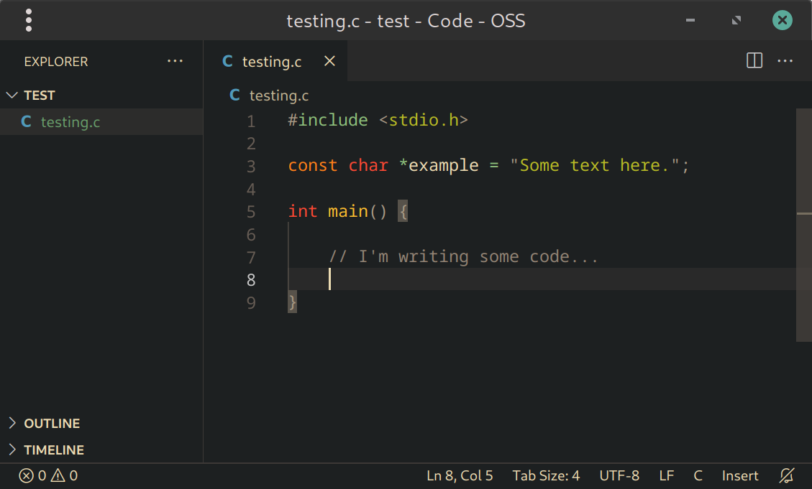
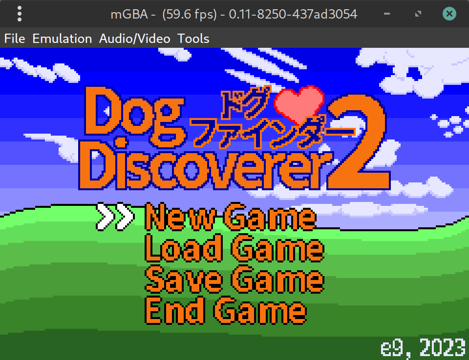
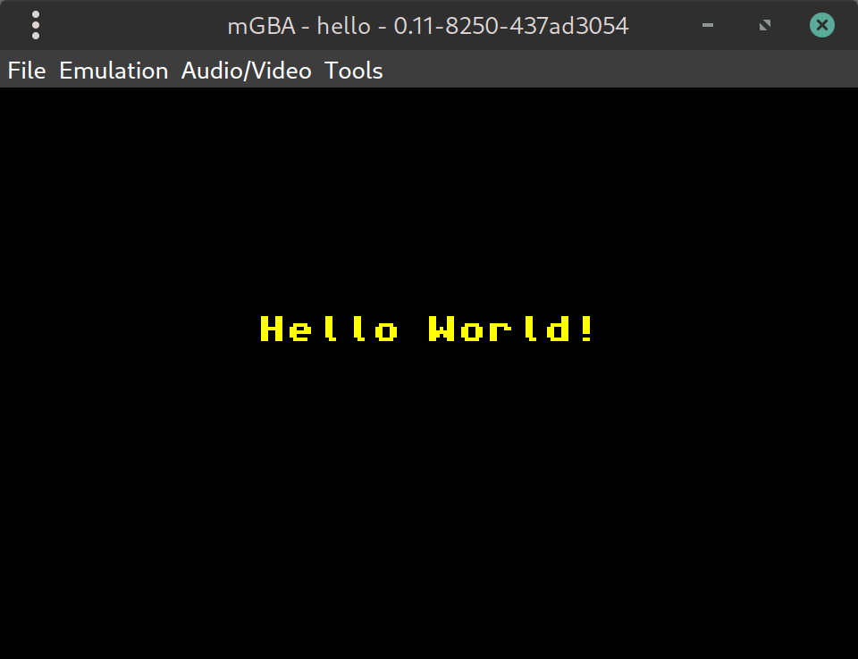

# 2. Setting up a development environment

<!-- toc -->

## Introduction {#sec-intro}

Unless you want to punch in the instructions in binary in a hex editor, you'll need a development environment to turn human readable code into machine code. This chapter will show you how to set up the necessary components and use them to compile Tonc's examples.

By the end you should have:

* A text editor
* A GBA emulator _(mGBA)_
* A cross-compiler toolchain _(devkitARM)_
* Libraries used for GBA programming _(libtonc in particular)_
* The examples which accompany this tutorial


:::warning Some command-line skills required

To compile a GBA game, you'll need a basic undestanding of the command-line. If this is unfamiliar to you, the following [Unix command-line tutorial](https://command-line-tutorial.readthedocs.io/) may be helpful.

If you're on Windows, you should use the **MSYS2** terminal which comes with devkitARM. On other OS's, the built-in terminal should be perfectly adequate.

:::


## Choosing a text editor {#sec-editor}

A decent text editor is essential for programming. At the bare minimum you'll want something that supports syntax highlighting and gives you control over indentation and line endings. That means _notepad.exe_ sadly won't cut it.

There are many options, and you may already have a favourite. But in case you don't, here are some suggestions:

- [Visual Studio Code](https://code.visualstudio.com/) - a popular and featureful editor that works on Linux, Windows & Mac

- [Kate](https://kate-editor.org/) - another powerful editor, a bit lighter and fully open-source

- [Geany](https://www.geany.org/) - runs well on low-end machines and is still very extensible via plugins

- [Notepad++](https://notepad-plus-plus.org/) - a lightweight and widely-loved choice on Windows

Once you've chosen an editor and gotten comfortable with it, you can move onto the next section.

<div class="cpt cblock" style="width:420px;">
<br>
<b>{*@fig:text-editor}</b>: Editing a file in VS Code.
</div>

In many editors it's possible to set a hotkey (usually <kbd>F5</kbd> or <kbd>Ctrl+Enter</kbd>) to compile and run your code. This can be an effective workflow, but for the purposes of this tutorial we'll use the command-line, because it's essential to know what's going on under the hood.

Likewise, code-completion and error highlighting are also valuable features which you may want to spend time setting up, but are outside the scope of this chapter.


## Installing a GBA emulator {#sec-emu}

Needless to say, you'll need a way to actually run your GBA programs. Testing on real hardware from time to time is highly recommended (and part of the fun), but for everyday development you'll want something more convenient. That's where emulators come in.

At the time of writing, the most suitable emulator for GBA development is [<dfn>mGBA</dfn>](https://mgba.io/). It's highly accurate and has features for developers such as memory viewers, debug logging, and a GDB server for step debugging, all of which will make your life a lot easier when things go wrong (and they will)!

<div class="cpt cblock" style="width:320px;" markdown>
<br>
<b>{*@fig:mgba-game}</b>: A GBA ROM running inside mGBA
</div>

Other emulators which you might want to use are: [NanoBoyAdvance](https://github.com/nba-emu/NanoBoyAdvance) and [SkyEmu](https://github.com/skylersaleh/SkyEmu), which are both _cycle accurate_ and effectively the closest you can get to playing on real hardware without actually doing so.

Finally [no$gba](https://problemkaputt.github.io/gba.htm) (debug version) is a somewhat older and less accurate Windows-only GBA emulator, but has some unique debugging features you won't find elsewhere. Namely a visual debugger, performance profiler, CPU usage meters, and memory access checking which can catch buffer overflows and such. If you can get it working, it's an invaluable tool!


## Installing devkitARM {#sec-dkp}

<dfn>devkitARM</dfn> has been the standard toolchain for GBA homebrew for many years. It is provided by a team called <dfn>devkitPro</dfn> (dkP), though informally the tools are often referred to as devkitPro too (much to the maintainers' lament).

To install devkitARM, visit the [devkitPro Getting Started](https://devkitpro.org/wiki/Getting_Started) page and follow the instructions for your OS.

:::danger Do not use spaces in paths

devkitARM uses [`make`](https://en.wikipedia.org/wiki/Make_(software)) for building projects, which doesn't cope well with spaces in paths (such as `My Documents`). The reason for this is that `make` uses spaces as a separator between command-line options, but unlike e.g. shell scripts, it doesn't provide an adequate form of quoting/escaping, especially not when working with lists of filenames.

:::

### Windows tips {#ssec-dkp-win}

If you are on Windows, there is a GUI installer which downloads and installs the components automatically. Be sure to select "GBA Development" during installation, as shown in @fig:devkitpro.

<div class="cpt cblock" style="width:420px;">
<br>
<b>{*@fig:devkitpro}</b>: Installing devkitARM with the GBA packages on Windows.
</div>


### Linux & Mac tips {#ssec-dkp-unix}

If you are using Linux or Mac, after following the instructions on dkP's Getting Started page, you should install the `gba-dev` package group via `dkp-pacman` in your terminal _(or just `pacman` if you use Arch Linux)_. To do this, run the following command:

```sh
sudo dkp-pacman -S gba-dev
```

When asked which packages to install _("Enter a selection (default=all):")_ you should simply hit <kbd>Enter</kbd> to install everything in the entire `gba-dev` group.


## Obtaining Tonc's example code {#sec-examples}

This tutorial comes with a [full set of examples](https://github.com/gbadev-org/libtonc-examples) to demonstrate the concepts taught in each chapter.

Additionally, <dfn>libtonc</dfn> is the GBA programming library that accompanies Tonc, and is necessary to compile the examples. In the past, libtonc had to be downloaded separately and placed where your projects could find it. But nowadays it comes included as part of devkitARM. As long as you selected the `gba-dev` packages during installation, _you already have libtonc_.

The bad news is devkitARM doesn't include the Tonc examples, so you still have to download those yourself. You can get them via _"Code -> Download&nbsp;Zip"_ on the repository page, or by using [git](https://git-scm.com/) in your terminal:

```sh
git clone https://github.com/gbadev-org/libtonc-examples
```
<br>


:::tip toolbox.h vs libtonc

In the early chapters, we'll be building our own library called `toolbox.h` which replicates parts of libtonc for educational purposes. But for real-world usage, sticking to a more featureful, tried-and-tested library (such as libtonc itself) should be preferred.

:::


## Compiling the examples {#sec-compile}

To test your installation, let's try building one of the examples.

In the terminal, navigate to the directory where one of the examples is located (let's say, the *hello* example) and run `make`:

```sh
cd libtonc-examples/basic/hello
make
```

When invoked, `make` will build the project by following the rules in the file called _'Makefile'_ in the current working directory. Assuming this was successful, a `.gba` file will be produced, which you can run in your emulator of choice:

<div class="cpt cblock" style="width:320px">
<br>
<b>{*@fig:mgba-hello}</b>: One of the Tonc examples running in mGBA.
</div>

If you've gotten this far, congratulations! You are now ready to start writing your own GBA programs.

You can move onto the next chapter, or keep reading for more details.


:::tip Setting environment variables

If you get an error such as `Please set DEVKITPRO in your environment`, it means your environment variables aren't set properly. The solution to this differs between machines, but usually you want to edit a file called `.bashrc` in your home directory, and add the following lines to it:

```sh
export DEVKITPRO=/opt/devkitpro
export DEVKITARM=/opt/devkitpro/devkitARM
export DEVKITPPC=/opt/devkitpro/devkitPPC

export PATH=$DEVKITARM/bin:$DEVKITPRO/tools/bin:$PATH  # optional
```

The last line adds the compiler and related tools to your `PATH` environment variable, allowing you to use them directly in your terminal.

This is optional, because the example makefiles also set `PATH` during the build process. But having the tools on hand is useful, and *required* if you want to follow along in the next section.

After editing `.bashrc`, you will have to close and reopen your terminal to apply the changes. Or you can run `source ~/.bashrc` to persist these changes in the current shell.

:::


## Manual steps to build a GBA ROM {#sec-build-steps}

We've just seen how to compile a GBA program via `make`. Copying the makefile and using it for your own projects is absolutely encouraged! That said, it's valuable to know what's happening under the hood.

Converting your C/C++/asm sources into a valid GBA ROM involves 4 steps, which can be seen in the output from running `make`:

```sh
$ make
hello.c               # <--- invoke the compiler
linking cartridge     # <--- invoke the linker
built ... hello.gba   # <--- elf stripped
ROM fixed!            # <--- header fixed
```

The steps are as follows:

1. **Compile/assemble the sources**. We turn the human readable C or C++ files (`.c`/`.cpp`) or assembly files (`.s`/`.asm`) to a binary format known as [object files](https://en.wikipedia.org/wiki/Object_code) (`.o`). There is one object file for each source file.
    
    The tool for this is called `arm-none-eabi-gcc`. Actually, this is just a front-end for the real compiler, but that's just details. The `arm-none-eabi-` here is a prefix which means this version of GCC produces machine code for bare-metal ARM platforms; other target platforms have different prefixes. Note that C++ uses `g++` instead of `gcc`.

2. **Link the object files**. After that, the separate object files are linked into a single executable [ELF](https://en.wikipedia.org/wiki/Executable_and_Linkable_Format) file. Any precompiled code libraries (`.a`) you may have specified are linked at this stage too.
    
    You can actually compile and link at the same time, but it is good practice to keep them separate: serious projects usually contain multiple source files and you don't want to have to wait for the whole world to recompile when you only changed one. This becomes even more important when you start adding data (graphics, music, etc).
    
    Again, `arm-none-eabi-gcc` is used for invoking the linker, although the actual linker is called `arm-none-eabi-ld`.

3. **Strip to raw binary**. The ELF file still contains debug data and can't actually be read by the GBA (though many emulators will accept it). `arm-none-eabi-objcopy` removes the debug data and makes sure the GBA will accept it. Well, almost.

4. **Fix the header**. Each GBA game has a header with a checksum to make sure it's a valid GBA ROM. The linking step makes room for one, but leaves it blank, so we have to use a tool like DarkFader's `gbafix` to fix the header. This tool comes with devkitARM, so you don't have to download it separately.


You can of course run all these commands in the terminal yourself without a makefile, provided the dkP tools are in your `PATH`.

Let's try it with the example named *first* - this is the easiest one to compile because it doesn't depend on any libraries.


```sh
cd libtonc-examples/basic/first/source

# Compile first.c to first.o
arm-none-eabi-gcc -mthumb -c first.c

# Link first.o (and standard libs) to first.elf
arm-none-eabi-gcc -specs=gba.specs -mthumb first.o -o first.elf

# Strip to binary-only
arm-none-eabi-objcopy -O binary first.elf first.gba

# Fix header
gbafix first.gba
```

There you have it - a GBA program compiled from scratch! Well... we can always go deeper but this is probably a good place to stop for now. <kbd>x)</kbd>

There are various options passed to the tools here that may not be immediately obvious. These are explained in the [makefile appendix](makefile.html#sec-flags) if you're interested.


:::tip Avoid batch files for compiling

You may be tempted to stick all these commands into a batch file or shell script, and use that to compile your project. This is simple, but not recommended. 

The reason becomes apparent as soon as your project has more than one source file: if you make an edit to a single file, you shouldn't have to recompile _all_ of the sources, only the one that changed. A build system such as `make` is smart enough to realise this, whereas simple shell scripts are not.

When you get to the point where your project has dozens of source files, this makes a big difference! 

:::

## Alternative toolchains {#sec-alt}

The advantage of devkitARM is that it provides a consistent environment for compiling GBA homebrew on Windows, Mac and Linux. However, if you're feeling adventurous there are other good options available nowadays:

* [gba-toolchain](https://github.com/felixjones/gba-toolchain) - uses the CMake build system instead of Makefiles
* [meson-gba](https://github.com/LunarLambda/meson-gba) - uses the Meson build system instead of Makefiles
* [gba-bootstrap](https://github.com/AntonioND/gba-bootstrap) - the bare minimum needed to compile a GBA program. In other words, _roll your own toolchain_, with the hard bits done for you.

Why would you want to use these? They might be easier to install (many Linux distros offer their own builds of `arm-none-eabi-gcc` and related packages, which is essentially the same thing devkitARM provides), or you could be using a machine for which devkitARM is not available (such as a Raspberry Pi). Or perhaps you just want a better build system than makefiles.

Tonc assumes you're using devkitARM, but most of the information is relevant no matter which toolchain you're using.


:::danger Avoid 'devkitAdvance'

You may encounter a toolchain called _devkitAdvance_. This is an ancient toolchain which hasn't been updated since 2003. By using it, you will be missing out on _two decades worth_ of compiler improvements and optimisations. If somebody recommends this to you, run away!

:::
