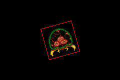

Title: BIOS Calls
Date: 2003-12-29
Modified: 2013-03-24
Authors: Cearn

# 17. BIOS Calls

<!-- toc -->

<br>  

## Introduction {#sec-intro}

Apart from [hardware interrupts](interrupts.html), like HBlank and cartridge interrupts, there are also things called <dfn>software interrupts</dfn>, also known as <dfn>BIOS calls</dfn>. The software interrupts work very much like ordinary functions: you set-up input, call the routine, and get some output back. The difference lies in how you reach the code; for normal functions you just, well, jump to the routine you want. Software interrupts use the `swi` instruction, which diverts the program flow to somewhere in BIOS, carries out the requested algorithm and then restores the normal flow of your program. This is similar to what hardware interrupts do, only now you raise the interrupt programmatically. Hence: software interrupt.

The GBA BIOS has 42 software interrupts, with basic routines for copying, math (division, square root), affine transformations for sprites and backgrounds, decompression among others. There are also some very special functions like the `IntrWait` routines, which can stop the CPU until a hardware interrupt occurs. The VBlank variant is highly recommended, which is what makes this chapter important.

Using software interrupts isn't too hard if it weren't for one thing: the `swi` instruction itself. This again requires some assembly. However, not *much* assembly, and it's easy to write C wrappers for them, which we'll also cover here.

## The BIOS functions {#sec-funs}

Calling the BIOS functions can be done via the ‘<code>swi <i>n</i></code>’ instruction, where *n* is the BIOS call you want to use. Mind you, the exact numbers you need to use depends on whether your code is in ARM or THUMB state. In THUMB the argument is simply the *n* itself, but in ARM you need to use *n*<<16. Just like normal functions, the BIOS calls can have input and output. The first four registers (r0-r3) are used for this purpose; though the exact purpose and the number of registers differ for each call.

Here's a list containing the names of each BIOS call. I am not going to say what each of them does since other sites have done that already and it seems pointless to copy their stuff verbatim. For full descriptions go to [GBATek](http://nocash.emubase.de/gbatek.htm), for example. I will give a description of a few of them so you can get a taste of how they work.

### Full list {#ssec-funs-list}

<center>
<table width="70%">
<col span=5 align="left">
<tr><th>id		<th width="30%">Name  <th width="10%">	<th>id		<th>Name
<tr><td>0x00	<td>SoftReset		<td><td>0x08	<td>Sqrt
<tr><td>0x01	<td>RegisterRamReset<td><td>0x09	<td>ArcTan 
<tr><td>0x02	<td>Halt			<td><td>0x0A	<td>ArcTan2
<tr><td>0x03	<td>Stop			<td><td>0x0B	<td>CPUSet 
<tr><td>0x04	<td>IntrWait		<td><td>0x0C	<td>CPUFastSet 
<tr><td>0x05	<td>VBlankIntrWait	<td><td>0x0D	<td>BiosChecksum 
<tr><td>0x06	<td>Div				<td><td>0x0E	<td>BgAffineSet 
<tr><td>0x07	<td>DivArm			<td><td>0x0F	<td>ObjAffineSet 

<tr><td>&nbsp;
<tr><td>0x10	<td>BitUnPack		<td><td>0x18	<td>Diff16bitUnFilter 
<tr><td>0x11	<td>LZ77UnCompWRAM	<td><td>0x19	<td>SoundBiasChange 
<tr><td>0x12	<td>LZ77UnCompVRAM	<td><td>0x1A	<td>SoundDriverInit 
<tr><td>0x13	<td>HuffUnComp		<td><td>0x1B	<td>SoundDriverMode 
<tr><td>0x14	<td>RLUnCompWRAM	<td><td>0x1C	<td>SoundDriverMain 
<tr><td>0x15	<td>RLUnCompVRAM	<td><td>0x1D	<td>SoundDriverVSync 
<tr><td>0x16	<td>Diff8bitUnFilterWRAM	<td><td>0x1E <td>SoundChannelClear 
<tr><td>0x17	<td>Diff8bitUnFilterVRAM	<td><td>0x1F <td>MIDIKey2Freq

<tr><td>&nbsp;
<tr><td>0x20	<td>MusicPlayerOpen		<td><td>0x28 <td>SoundDriverVSyncOff
<tr><td>0x21	<td>MusicPlayerStart	<td><td>0x29 <td>SoundDriverVSyncOn 
<tr><td>0x22	<td>MusicPlayerStop		<td><td>0x2A <td>GetJumpList
<tr><td>0x23	<td>MusicPlayerContinue
<tr><td>0x24	<td>MusicPlayerFadeOut
<tr><td>0x25	<td>MultiBoot
<tr><td>0x26	<td>HardReset
<tr><td>0x27	<td>CustomHalt
</table>
</center>

### Div, Sqrt, Arctan2 and ObjAffineSet descriptions {#ssec-funs-smpl}

<dl>
<dt>0x06: Div</dt>
<dd>
Input:
  <p>r0: numerator</p>
  <p>r1: denominator</p>
 Output:
  <p>r0: numerator / denominator</p>
  <p>r1: numerator % denominator</p>
  <p>r3: abs(numerator / denominator)</p>
 Note: do NOT divide by zero!
<br>
</dd>

<dt>0x08: Sqrt</dt>
<dd>
Input:
  <p>r0: num, a unsigned 32-bit integer</p>
Output:
  <p>r1: sqrt(num)</p>
<br>
</dd>

<dt>0x0a: ArcTan2</dt>
<dd>
Input:
  <p>r0: <i>x</i>, a <b>signed 16bit</b> number (<code>s16</code>)</p>
  <p>r1: <i>y</i>, a <b>signed 16bit</b> number (<code>s16</code>)</p>
Output:
  <p>r0: 
    <i>x</i>&ge;0 : <i>&theta;</i>= arctan(<i>y/x</i>) &or;
    <i>x</i>&lt;0 : <i>&theta;</i>= 
      sign(<i>y</i>)*(&pi; &minus; arctan(|<i>y/x</i>|).<br>
  </p>
    This does the full inverse of <i>y</i> = <i>x</i>*tan(&theta;).
    The problem with the tangent is that the domain is a semi-circle,
    as is the range of arc tangent. To get the full circle range, both
    <i>x</i> and <i>y</i> values are required for not only their 
    quotient, but their signs as well. The mathematical range of
    <i>&theta;</i> is [&minus;&pi;,&nbsp;&pi;&rang;, which corresponds
    to [&minus;0x8000,&nbsp;0x8000&rang; (or
    [0,&nbsp;2&pi;&rang; and [0,&nbsp;0xFFFF] if you like)
<br>
</dd>

<dt>0x0f: ObjAffineSet</dt>
<dd>
Input:
  <p>r0: source address</p>
  <p>r1: destination address</p>
  <p>r2: number of calculations</p>
  <p>r3: Offset of <b>P</b> matrix elements (2 for bgs,
    8 for objects)</p>
</dd>
</dl>

The source address points to an array of `AFF_SRC` structs (also known as `ObjAffineSource`, which is a bit misleading since you can use them for backgrounds as well). The `AFF_SRC` struct consist of two scales *s*<sub>x</sub> , *s*<sub>y</sub> and an angle α, which again uses the range \[0, 0xFFFF\] for 2π. The resulting **P**:

<math id="eq:pswi" xmlns="http://www.w3.org/1998/Math/MathML" display="inline">
  <mstyle displaystyle="true" scriptlevel="0">
    <mrow data-mjx-texclass="ORD">
      <mtable rowspacing=".5em" columnspacing="1em" displaystyle="true">
        <mtr>
          <mtd>
            <mtext mathvariant="bold">({!@eq:pswi})</mtext>
            <mtext>&#xA0;</mtext>
            <mtext>&#xA0;</mtext>
            <mtext mathvariant="bold">P</mtext>
            <mo>=</mo>
            <mrow data-mjx-texclass="INNER">
              <mo data-mjx-texclass="OPEN">[</mo>
              <mtable columnspacing="1em" rowspacing="4pt">
                <mtr>
                  <mtd>
                    <msub>
                      <mi>s</mi>
                      <mi>x</mi>
                    </msub>
                    <mo>&#x22C5;</mo>
                    <mi>cos</mi>
                    <mo data-mjx-texclass="NONE">&#x2061;</mo>
                    <mi>&#x3B1;</mi>
                  </mtd>
                  <mtd>
                    <mo>&#x2212;</mo>
                    <msub>
                      <mi>s</mi>
                      <mi>x</mi>
                    </msub>
                    <mo>&#x22C5;</mo>
                    <mi>sin</mi>
                    <mo data-mjx-texclass="NONE">&#x2061;</mo>
                    <mi>&#x3B1;</mi>
                  </mtd>
                </mtr>
                <mtr>
                  <mtd>
                    <msub>
                      <mi>s</mi>
                      <mi>y</mi>
                    </msub>
                    <mo>&#x22C5;</mo>
                    <mi>sin</mi>
                    <mo data-mjx-texclass="NONE">&#x2061;</mo>
                    <mi>&#x3B1;</mi>
                  </mtd>
                  <mtd>
                    <msub>
                      <mi>s</mi>
                      <mi>y</mi>
                    </msub>
                    <mo>&#x22C5;</mo>
                    <mi>cos</mi>
                    <mo data-mjx-texclass="NONE">&#x2061;</mo>
                    <mi>&#x3B1;</mi>
                  </mtd>
                </mtr>
              </mtable>
              <mo data-mjx-texclass="CLOSE">]</mo>
            </mrow>
          </mtd>
        </mtr>
      </mtable>
    </mrow>
  </mstyle>
</math>

By now you should know what this does: it scales horizontally by 1/*s*<sub>x</sub>, vertically by 1/*s*<sub>y</sub> followed by a counter-clockwise rotation by *α*. `ObjAffineSet()` does almost exactly what `obj_aff_rotscale()` and `bg_aff_rotscale()` do, except that `ObjAffineSet()` can also set multiple matrices at once.

The source data is kept in `ObjAffineSource` (i.e., `AFF_SRC`) structs. Now, as the routine sets affine matrices, you might think that the destinations are either `OBJ_AFFINE` or `ObjAffineDest` structs. However, you'd be wrong. Well, partially anyway. The problem is that the destination always points to a *p*<sub>a</sub>-element, which is not necessarily the first element in struct. You *will* make the mistake of simply supplying an `OBJ_AFFINE` pointer when you try to use it to fill those. Don't say I didn't warn you.

Two other things need to be said here as well. First, once again we have a bit of a misnomer: ObjAffineSet doesn't really have much to do with objects per se, but can be used in that capacity by setting `r3` to 8 instead of 2. The second is that the routine can also be used to set up multiple arrays via `r2`. However, *be careful* when you do this with devkitPro 19. `ObjAffineSet()` expects its source structs to be [word-aligned](bitmaps.html#ssec-data-align), which they won't be unless you add the alignment attributes yourself.

```c
// Source struct. Note the alignment!
typedef struct AFF_SRC
{
    s16 sx, sy;
    u16 alpha;
} ALIGN4 AFF_SRC, ObjAffineSource;

// Dst struct for background matrices
typedef struct Aff_DST
{
    s16 pa, pb;
    s16 pc, pd;
} ALIGN4 AFF_DST, ObjAffineDest;

// Dst struct for objects. Note that r1 should be
// the address of pa, not the start of the struct
typedef struct OBJ_AFFINE
{
    u16 fill0[3];    s16 pa;
    u16 fill1[3];    s16 pb;
    u16 fill2[3];    s16 pc;
    u16 fill3[3];    s16 pd;
} ALIGN4 OBJ_AFFINE;
```

## Using BIOS calls {#sec-usage}

### Assembly for BIOS calls {#ssec-use-swi-asm}

You might think this whole discussion was rather pointless since you can't access the registers and the `swi` instruction unless you use assembly, which will be pretty tough, right? Well, no, yes and no. The necessary assembly steps for BIOS calls are actually rather simple, and are given below.

```armasm
@ In tonc_bios.s

@ at top of your file
    .text           @ aka .section .text
    .code 16        @ aka .thumb

@ for each swi (like division, for example)
    .align 2        @ aka .balign 4
    .global Div
    .thumb_func
Div:
    swi     0x06
    bx      lr
```

This is assembly code for the GNU assembler (GAS); for Goldroad or ARM STD the syntax is likely to be slightly different. The first thing you need to do is give some <dfn>directives</dfn>, which tells some details about the following code. In this case, we use the ‘`.text`’ to put the code in the `text` section (ROM or EWRAM for multiboot). We also say that the code is THUMB code by using ‘`.code 16`’ or ‘`.thumb`’. If you place these at the top of the file, they'll hold for the rest of the thing. For each BIOS call, you'll need the following 6 items.

-   **Word-alignment**. Or at least halfword alignment, but words are probably preferable. There are two directives for this, <code>.align <i>n</i></code> and <code>.balign <i>m</i></code>. The former aligns to 2<sup>*n*</sup> so requires ‘`.align 2`’; the latter aligns to *m* so you can just use ‘<code>balign <i>m</i></code>’. Note that both will only work on the *next* piece of code or data and no further, which is why it's best to add it for each function.
-   **Scope**. The <code>.global <i>name</i></code> directive makes a symbol out of *name*, which will then be visible for other files in the project as well. A bit like `extern` or, rather, an anti-`static`.
-   **Thumb indicator** It would seem that `.code 16` alone isn't enough, you also need `.thumb_func`. In fact, if I read the manual correctly this one also implies `.code 16`, which would make that directive redundant.
-   **Label**. ‘*name*:’ marks where the symbol *name* starts. Obviously, to use a function it must actually exist.
-   **BIOS call** To actually activate the BIOS call, use ‘swi *n*’, with *n* the BIOS call you want.
-   **Return** And we're practically done already, all we have to do now is return to the caller with ‘bx lr’.

See? It's really not that complicated. Sometimes you might want a little more functionality than this, but for the most part you only need two measly instructions.

### The Arm Architecture Procedure Call Standard {#ssec-use-aapcs}

That's all fine and good, but that still leaves the questions of a) how do I combine this with C code and b) where'd all the input and output go? The answer to the first is simple: just add a function declaration like usual:

```c
// In tonc_bios.h

int Div(int num, int denom);
```

Mkay, but that *still* doesn't explain where my input and output went. Well actually … it *does*.

> “I am not sure how clouds get formed. But the clouds know how to do it, and that is the important thing”

Found that quote long ago in one of those Kids on Science lists, and I'm always reminded of it when programming. The thing about computers is that they don't think in terms of input, output, text, pictures etc. Actually, they don't think at all, but that's another story. All a computer sees is data; not even code and data, just data since code is data too. Of course, *you* may not see it that way because you're used to C or VB or whatever, but when all is said and done, it's all just ones and zeros. If the ones and zeros come to the CPU via the program counter (**PC** register, `r15`) it's code, otherwise it's data.

So how does that explain the input/output? Well, it doesn't do it directly, but it points to how you should be looking at the situation. Consider you're the compiler and you have to convert some bloke's C code into machine code (or assembly, which is almost the same thing) that a CPU can actually use. You come across the line “`q= Div(x,y);`”. What does `Div()` do? Well, if there's no symbol in the C-file for that name (and there isn't, as it's in *tonc_bios.s*), you wouldn't know. Technically, you don't even know *what* it is. But `Div` knows, and that's the important thing. At least, that's *almost* how it works. The compiler should still need to know what sort of critter `Div` is to avoid confusion: A variable? A macro? A function? That's what the declarations are for. And the declaration above says that `Div` is a function that expects two signed integers and returns one too. As far as the compiler's concerned, it ends there.
<br>  
Of course, that still doesn't explain how the compiler knows what do to. Well, it simply follows the *ARM Architecture Procedure Call Standard*, <dfn>AAPCS</dfn> for short. This states how functions should pass arguments to each other. This PDF document can be found [here](http://www.arm.com/miscPDFs/8031.pdf) and if you're contemplating assembly is a very worthwhile download.

For now, here's what you need to know. The first four arguments are placed in the first four registers `r0-r3`, every one after that is placed on the stack. The output value is placed in `r0`. As long as you take the argument list of the BIOS call as the list in the declaration, it should work fine. Note that the declaration also takes care of any casting that needs to be done. It is important that you realize just what the declaration means here: *it* determines how the function is called, not the actual *definition* assembly function. Or even C function. Things can go very wrong if you mess up the declaration.

Another thing the AAPCS tells you is that register r0-r3 (and r12) are so-called <dfn>scratch</dfn> registers. This means that the caller *expects* the called function to mess these up. After the function returns their contents are to be considered undefined – unless you're the one writing both asm functions, in which case there may be certain … allowances. Having these as scratch registers means that a function can use them without needing to push and pop the originals on and off the stack, thus saving time. This does not hold for the other registers, though: r4-r11, r13, r14 *must* be returned in the way the calling function got them. The last one, r15, is exempt from this, as you shouldn't screw around with the program counter.

### Inline assembly {#ssec-use-inl-asm}

Actually, you don't even need a full assembly file for BIOS calls: you could use <dfn>inline assembly</dfn>. With inline assembly, you can mix C code and assembly code. Since the functions are usually rather simple, you could use something like

```c
// In a C file
int Div(int num, int denom)
{   asm("swi 0x06");   }
```

This does exactly the same thing as the assembly version of `Div`. However, you need to be careful with inline assembly because you can't see the code around it and might accidentally <dfn>clobber</dfn> some registers that you shouldn't be messing with, thus ruining the rest of the code. For the full rules on inline assembly, see the [GCC manual](http://www.gnu.org/manual/manual.html). You can also find a short faq on inline assembly use at [devrs.com](http://www.devrs.com/gba/). The ‘proper’ syntax of inline assembly isn't the friendliest in the world, mind you, and there are other problems as well. Consider the C function given above. Since it doesn't really do anything itself, the optimiser may be tempted to throw it away. This will happen with `-O3` unless you take appropriate precautions. Also, the compiler will complain that the function doesn't return anything, even though it should. It has a point, of course, considering that part is taken care of inside the assembly block. There are probably a few other problems that I'm not aware of at present; in the end it's easier to use the full-assembly versions so you know what's happening.

### The <kbd>swi_call</kbd> macro {#ssec-use-swi-call}

On the other hand, there are also BIOS calls that use no arguments, which can be run via a mere macro. The `swi_call(x)` macro will run the BIOS call *x*, and can be found in *swi.h*, and in Wintermute's [libgba](http://www.devkitpro.org), which is where I got it from. It's a little more refined than the `Div` function given above. First, it uses the `volatile` keyword, which should keep your optimizer from deleting the function (just like we did for all the registers). Secondly, it uses a <dfn>clobber list</dfn> (after the triple colons). This will tell the compiler which registers are used by the inline assembly. Thirdly, it will take care of the THUMB/ARM switch automatically. If you use the `-mthumb` compiler option, the compiler will define `__thumb__` for us, which we will now use to get the right swi-number. Clever, eh?

```c
#ifndef(__thumb__)
#define swi_call(x)   asm volatile("swi\t"#x ::: "r0", "r1", "r2", "r3")
#else
#define swi_call(x)   asm volatile("swi\t"#x"<<16" ::: "r0", "r1", "r2", "r3")
#endif
```

  

By the way, if you want more information about assembly, you can find a number of tutorials on ARM assembly at gbadev.org. Another nice way to learn is by using the `-S` compiler flag, which will give you a compiler-generated assembly file of your code. This will show you exactly what the compiler does to your code, including optimisation steps and use of the AAPCS. Really, you should see this at least once.

It may also help to use `-fverbose-asm`, which will write out the original variable names and operations in comments. Usually in the right place too. Also handy is the `ASM_CMT()` macro shown below. This will give you some hints as to where specific blocks of code are. But again, not all the time.

```c
#define ASM_CMT(str) asm volatile("@ " str)

//In code. Outputs "@ Hi, I'm here!" in the generated asm
ASM_CMT("Hi, I'm here!");
```

## Demo graphs {#sec-demo}

<div class="cpt_fr" style="width:240px;">


**{*@fig:swi-demo}**: div, sqrt, arctan2, sin and cos graphs, courtesy of BIOS.
</div>

To illustrate the use of BIOS calls I am using Div, Sqrt, ArcTan and ObjAffineSet to create graphs if a hyperbole, square root, sine and cosine. I've scaled them in such a way so that they fit nicely on the 240x160 screen. The definitions are

<table>
<tr><td>division	<td><i>y</i>= 2560/<i>x</i>
<tr><td>square root	<td><i>y</i>= 160*sqrt(<i>x</i>/240)
<tr><td>arctan  	<td><i>y</i>= 80 + 64*(2/&pi;)*(arctan(<i>x</i>-120)/16))
<tr><td>sine		<td><i>y</i>=  1*sy*sin(2&pi;·<i>x</i>/240)	<td>; sy= 80
<tr><td>cosine		<td><i>y</i>= 80*sx*cos(2&pi;·<i>x</i>/240)	<td>; sx= 1
</table>

and these functions have been plotted in fig 1. If you're wondering how I got the sine and cosine values, as there are no calls for those, take a look at eq 1 again. The **P** matrix has them. I've used *p*<sub>a</sub> for the cosine and *p*<sub>c</sub> for the sine. Note that the graphs appear instantly; there is no sense of loading time while the graphs are plotted. An earlier version of the mode 7 demo (or PERNs mode 7 demo) used calls to the actual division, sine and cosine functions to build up the LUTs. Even with the symmetry rules of trigonometry, `sin()` and `cos()` are still noticeably slower than the BIOS equivalent.

```c
#include <stdio.h>
#include <tonc.h>

// === swi calls ======================================================

// Their assembly equivalents can be found in tonc_bios.s

void VBlankIntrWait()
{   swi_call(0x05); }

int Div(int num, int denom)
{   swi_call(0x06); }

u32 Sqrt(u32 num)
{   swi_call(0x08); }

s16 ArcTan2(s16 x, s16 y)
{   swi_call(0x0a); }

void ObjAffineSet(const AFF_SRC *src, void *dst, int num, int offset)
{   swi_call(0x0f); }


// === swi demos ======================================================

// NOTE!
// To be consistent with general mathematical graphs, the 
// y-axis has to be reversed and the origin moved to the 
// either the bottom or mid of the screen via
// "iy = H - y"
// or
// "iy = H/2 - y"
//
// functions have been scaled to fit the graphs on the 240x160 screen

// y= 2560/x
void div_demo()
{
    int ix, y;

    for(ix=1; ix<SCREEN_WIDTH; ix++)
    {
        y= Div(0x0a000000, ix)>>16;
        if(y <= SCREEN_HEIGHT)
            m3_plot(ix, SCREEN_HEIGHT - y, CLR_RED);
    }
    tte_printf("#{P:168,132;ci:%d}div", CLR_RED);
}

// y= 160*sqrt(x/240)
void sqrt_demo()
{
    int ix, y;
    for(ix=0; ix<SCREEN_WIDTH; ix++)
    {
        y= Sqrt(Div(320*ix, 3));
        m3_plot(ix, SCREEN_HEIGHT - y, CLR_LIME);
    }
    tte_printf("#{P:160,8;ci:%d}sqrt", CLR_LIME);
}

// y = 80 + tan((x-120)/16) * (64)*2/pi
void arctan2_demo()
{
    int ix, y;
    int ww= SCREEN_WIDTH/2, hh= SCREEN_HEIGHT/2;
    for(ix=0; ix < SCREEN_WIDTH; ix++)
    {
        y= ArcTan2(0x10, ix-ww);
        m3_plot(ix, hh - y/256, CLR_MAG);
    }
    tte_printf("#{P:144,40;ci:%d}atan", CLR_MAG);
}

// wX= 1, wY= 80
// cc= 80*sx*cos(2*pi*alpha/240)
// ss=  1*sy*sin(2*pi*alpha/240)
void aff_demo()
{
    int ix, ss, cc;
    ObjAffineSource af_src= {0x0100, 0x5000, 0};    // sx=1, sy=80, alpha=0
    ObjAffineDest af_dest= {0x0100, 0, 0, 0x0100};  // =I (redundant)

    for(ix=0; ix<SCREEN_WIDTH; ix++)
    {
        ObjAffineSet(&af_src, &af_dest, 1, BG_AFF_OFS);
        cc= 80*af_dest.pa>>8; 
        ss= af_dest.pc>>8;
        m3_plot(ix, 80 - cc, CLR_YELLOW);
        m3_plot(ix, 80 - ss, CLR_CYAN);
        // 0x010000/0xf0 = 0x0111.111...
        af_src.alpha += 0x0111;
    }

    tte_printf("#{P:48,38;ci:%d}cos", CLR_YELLOW);
    tte_printf("#{P:72,20;ci:%d}sin", CLR_CYAN);
}

// === main ===========================================================

int main()
{
    REG_DISPCNT= DCNT_MODE3 | DCNT_BG2;

    tte_init_bmp_default(3);
    tte_init_con();

    div_demo();
    sqrt_demo();
    aff_demo();

    arctan2_demo();
    
    while(1);
    
    return 0;
}
```

## Vsyncing part II, VBlankIntrWait {#sec-vsync2}

Until now, all demos used the function `vid_vsync` to synchronize the action to the VBlank (see the [graphics introduction](video.html#sec-vsync1)). What this did was to check `REG_VCOUNT` and stay in a while loop until the next VBlank came along. While it works, it's really a pretty poor way of doing things for two reasons. First, because of the potential problem when you are in a VBlank already, but that one had been covered. The second reason is more important: while you're in the while loop, you're wasting an awful lot of CPU cycles, all of which slurp battery power.

<div class="cpt_fr" style="width:240px;">


**{*@fig:swi-vsync}**: `swi_vsync` demo.
</div>

There are a number of BIOS calls that can put the CPU into a low power mode, thus sparing the batteries. The main BIOS call for this is Halt (#2), but what we're currently interested in is VBlankIntrWait (#5). This will set things up to wait until the next VBlank interrupt. To use it, you have to have interrupts switched on, of course, in particular the VBlank interrupt. As usual, the VBlank isr will have to acknowledge the interrupt by writing to `REG_IF`. But it *also* has to write to its BIOS equivalent, `REG_IFBIOS`. This little bit of information is a little hard to find elsewhere (in part because few tutorials cover BIOS calls); for more info, see [GBATek, BIOS Halt Functions](http://nocash.emubase.de/gbatek.htm#bioshaltfunctions). Fortunately for us, the switchboard presented in the [interrupts](interrupts.html#sec-switch) section has this built in.

To show you how to set it up, see the `swi_vsync` demo. The most important code is given below; a screen shot can be found in fig 2. What it does is give a rotating metroid sprite with an angular velocity of π rad/s (this corresponds to Δθ = 0x10000/4/60= 0x0111). The basic steps for interrupt handling should be familiar, except the fact that there's no real VBlank isr because the switchboard already takes care of acknowledging the interrupt. After that it's pretty simple: we use `ObjAffineSet()` to calculate the required affine matrix and `VBlankIntrWait` puts the CPU on Halt until the next VBlank interrupt.

```c
// inside main, after basic initialisations

AFF_SRC as= { 0x0100, 0x0100, 0 };
OBJ_AFFINE oaff;

// enable isr switchboard and VBlank interrupt
irq_init(NULL);
irq_add(II_VBLANK, NULL);

while(1)
{
    VBlankIntrWait();

    // Full circle = 10000h
    // 10000h/4/60= 111h -> 1/4 rev/s = 1 passing corner/s
    as.alpha += 0x0111;
    ObjAffineSet(&as, &oaff.pa, 1, 8);

    obj_aff_copy(obj_aff_mem, &oaff, 1);
}
```

<div class="note">
<div class="nhgood">
Prefer VBlankIntrWait() over vid_vsync()
</div>

Waiting for the VBlank via `vid_vsync()` (or its functional equivalent) is not a good idea: it wastes too much battery power. The recommended procedure is using `VBlankIntrWait()` to halt the processor, to be woken again on the VBlank interrupt.
</div>

<div class="note">
<div class="nhcare">
Acknowledging IntrWait routines
</div>

`VBlankIntrWait()` is only one of the BIOS's `IntrWait()` routines that can stop the CPU until an interrupt has been raised. However, it doesn't look at `REG_IF` but at `REG_IFBIOS` (0300:7FF8) for the acknowledgement of the interrupt. If your game locks up after trying `VBlankIntrWait()`, this may be why. Note that you may find the address under other names, as there isn't really an official one for it.
</div>

## Final thoughts {#sec-concs}

Now that you know how to use them, I should warn you that you shouldn't go overboard with them. It appears that the BIOS routines have been designed for space, not speed, so they aren't the fastest in the world. Not only that, there's an overhead of at least 60 cycles for each one (mind you, normal functions seem to have a 30 cycle overhead). If speed is what you're after then the BIOS calls may not be the best thing; you can probably find faster routines on the web ... somewhere. This doesn't mean that the BIOS routines can't be useful, of course, but if you have alternative methods, use those instead. Just remember that that's an optimisation step, which you shouldn't do prematurely.
