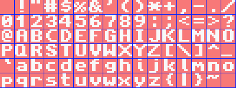
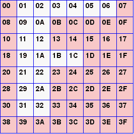
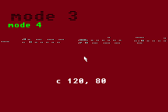
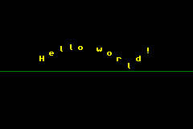
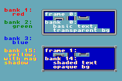
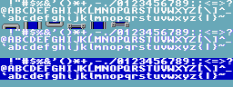
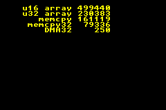
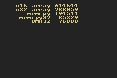

# 19. Text systems

<!-- toc -->


:::note Deprecation notice

This chapter has been superceded by [TTE](tte.html). Information from this chapter can still be useful, but for serious work, TTE should be preferred.

:::

## Introduction {#sec-intro}

<div id="{#cd-hello}">

```c
#include <stdio.h>

int main()
{
    printf("Hello World");
    return 0;
}
```

</div>

Aaah, yes, “Hello world”: the canonical first example for every C course and system. Except for consoles. While printing text on a PC is the easiest thing in the world, it is actually a little tricky on a console. It's not that there's no `printf()` function, but rather that there is nowhere for it to write to or even a font to write with (and that's hardly the full list of things to consider). Nope, if you want to be able to display text, you'll have to build the whole thing from scratch yourself. And you do want to be able to write text to the screen,

So, what do we need for a text system? Well, that's actually not a simple question. Obviously, you need a font. Just a bitmap with the various characters here, no need to depress ourselves with vector-based fonts on a GBA. Second, you need a way of taking specific characters and show them on the screen.

But wait a minute, which video mode are we using? There's tilemaps, bitmap modes and sprites to choose from, all of which need to be dealt with in entirely different ways. Are we settling for one of them, or create something usable for all? Also, what is the font we're using, and what are the character sizes? Fixed width or variable width? Variable width and sizes aren't much of a problem for the bitmap modes, but it's a bitch to splice them for tiles. Also, just for tiles, do we keep the full font in VRAM? If so, that's a lot of tiles, especially considering you'll hardly be using all of them at the same time. It would be more VRAM efficient to only copy in the glyphs that you're using at that time. This will take some management, though.

Just with these items, you'd have enough options for over 20 different text system implementations, all incompatible in very subtle ways. At the very least you'll need `putc()` and `puts()` for each. And then perhaps a `printf()`-like function too; for each text-type, mind you, because glyph placement goes on the inside. Maybe a screen clear too; or how about scrolling functionality. Well, you get the idea.

I suppose it's possible to create a big, complicated system, tailoring to every need anyone could possibly have. But I'm not going to. Firstly, because it's a bit waste of time: the chances you'll need the ability to run, say, bitmap and tilemap modes concurrently are virtually –if not actually– nil. Most of the time, you'll use a single video mode and stick to that. Spending time (and space) for allow every variation imaginable, when hardly any will ever be used is probably not worth the trouble. Besides, writing tons of code that is almost identical except for some small detail in the heart of the routine is just plain bleh.

The point of this chapter is to show how to build and use a set of simple, lightweight text writers. Don't expect the mother of all text systems, I'm mainly interested in getting the essential thing done, namely getting the characters of a string on the screen. This is a core text system, with the following features:

- Bitmap (mode 3, 4, 5), regular tilemap (mode 0, 1) and sprite support.
- There will be a `xxx_puts()` for showing the string, and a `xxx_clrs()` to wipe it. Their arguments will a string, the position to plot to, and some color information. If you want scrolling and/or format specifiers, I'll leave that up to you.
- The font is a fixed width, monochrome font with one 8x8 tile per character. The glyphs can be smaller than 8x8, and I'll even leave in hooks that allow variable widths, but things just get horrible if I'd allowed for multi-tile fonts.
- A variable character map. This is a great feature if you plan on using only a small set of characters, or non-ascii glyph orders.

This arrangement allows for the most basic cases and allows for some variations in set-up, but very little on the side. However, those extras would probably be very game specific anyway, and might be ill suited for a general text system. If you want extras, it shouldn't be too hard to write them yourself.

:::note No printf(). O rly?

I said that there is no `printf()` on the GBA, but this isn't quite true; not anymore, anyway. It is possible to hook your own IO-system to the standard IO-routines, which is done in `libgba`.

:::

:::note Semi-obsolete

I have another text system here that is much more powerful (as in, really working on every video mode and has a printf too) than what's described in this page. However, it's rather large, not completely finished and it would take some time to write the description page and alter the text to fit the demos again. A libtonc version that has the relevant changes can be found at [http://www.coranac.com/files/misc/tonclib-1.3b.rar](http://www.coranac.com/files/misc/tonclib-1.3b.rar).

:::

## Text system internals {#sec-in}

### Variables {#ssec-in-tb}

For keeping track of the text-system's state, we'll need a couple of variables. The obvious variables are a font and a character map. Because I like to keep things flexible, I'll also use two pointers for these so that you can use your own font and char-map if you want. You also need to know where it is you want to write to, which is done via a base-destination pointer. As extras, I'll also have character size variables for variable glyph spacing, and even a pointer to a char-width array, for a possible variable-width font.

I'll use a struct to store these, partially because it's easier for me to maintain, but also because the CPU and compiler can deal with them more efficiently. I'll also leave a few bytes empty for any eventual expansion. Finally, an instance of this struct, and a pointer to it so you can switch between different systems if you ever need to (which is unlikely, but still). Yes, I am wasting a few bytes, but if you max out IWRAM over this, I dare say you have bigger problems to worry about.

```c{#cd-txt-base}
// In text.h
typedef struct tagTXT_BASE
{
    u16 *dst0;      // writing buffer starting point
    u32 *font;      // pointer to font used
     u8 *chars;     // character map (chars as in letters, not tiles)
     u8 *cws;       // char widths (for VWF)
     u8  dx,dy;     // letter distances
    u16  flags;     // for later
     u8  extra[12]; // ditto
} TXT_BASE;

extern TXT_BASE __txt_base, *gptxt;

// In text.c
TXT_BASE __txt_base;                Main TXT_BASE instance
TXT_BASE *gptxt= &__txt_base;        and a pointer to it
```

### The font {#ssec-in-font}

<div class="lblock">
  <div class="cpt" style="width:400px;">
    
    <br>

**{\*@fig:img-tonc-font}**: Default tonc font: mini-ascii, monochrome, 8x8 pixels per glyph.

  </div>
</div>

@fig:img-tonc-font shows the font I'll be using. This particular font is monochrome and each of the glyphs fits into an 8x8 box. The 96 glyphs themselves a subset of the full ASCII that I'll refer to as <dfn>mini-ascii</dfn>. It's the lower ascii half that contains the majority of the standard ASCII table, but leaves out ASCII 0-31 because they're escape codes and not really part of the printable characters anyway.

It is possible to use a different font with another glyph order, but the functions I'll present below rely on one tile per glyph, _and_ in tile layout. I need this arrangement because I intend to use it for all modes, and non single-tile formats would be hell in tile modes.

Another restriction is that the font must be bitpacked to 1bpp. I have a couple of reasons for this. First, there is the size consideration. A 96 glyph, 16bit font (for modes 3/5) would take up 12kB. Pack that to 1bpp and it's less that one kB! Yes, you're restricted to monochrome, but for a font, that's really not much of a problem. Often fonts are monochrome anyway and using 16 bits where you only need one seems a bit of a waste. Secondly, how would you get a 16bpp font to work for 4bpp or 8bpp tiles? Going from a low bpp to a higher one is just a lot easier. Of course, if you don't like this arrangement, feel free to write your own functions.

As for the font data itself, here is the whole thing.

<pre id="cd-toncfont"><code class="language-c hljs">const unsigned int toncfontTiles[192]=
{
    0x00000000, 0x00000000, 0x18181818, 0x00180018, 0x00003636, 0x00000000, 0x367F3636, 0x0036367F,
    0x3C067C18, 0x00183E60, 0x1B356600, 0x0033566C, 0x6E16361C, 0x00DE733B, 0x000C1818, 0x00000000,
    0x0C0C1830, 0x0030180C, 0x3030180C, 0x000C1830, 0xFF3C6600, 0x0000663C, 0x7E181800, 0x00001818,
    0x00000000, 0x0C181800, 0x7E000000, 0x00000000, 0x00000000, 0x00181800, 0x183060C0, 0x0003060C,
    0x7E76663C, 0x003C666E, 0x181E1C18, 0x00181818, 0x3060663C, 0x007E0C18, 0x3860663C, 0x003C6660,
    0x33363C38, 0x0030307F, 0x603E067E, 0x003C6660, 0x3E060C38, 0x003C6666, 0x3060607E, 0x00181818,
    0x3C66663C, 0x003C6666, 0x7C66663C, 0x001C3060, 0x00181800, 0x00181800, 0x00181800, 0x0C181800,
    0x06186000, 0x00006018, 0x007E0000, 0x0000007E, 0x60180600, 0x00000618, 0x3060663C, 0x00180018,

    0x5A5A663C, 0x003C067A, 0x7E66663C, 0x00666666, 0x3E66663E, 0x003E6666, 0x06060C78, 0x00780C06,
    0x6666361E, 0x001E3666, <span class="rem">0x1E06067E</span>, <span class="rem">0x007E0606</span>, 0x1E06067E, 0x00060606, 0x7606663C, 0x007C6666,
    0x7E666666, 0x00666666, 0x1818183C, 0x003C1818, 0x60606060, 0x003C6660, 0x0F1B3363, 0x0063331B,
    0x06060606, 0x007E0606, 0x6B7F7763, 0x00636363, 0x7B6F6763, 0x00636373, 0x6666663C, 0x003C6666,
    0x3E66663E, 0x00060606, 0x3333331E, 0x007E3B33, 0x3E66663E, 0x00666636, 0x3C0E663C, 0x003C6670,
    0x1818187E, 0x00181818, 0x66666666, 0x003C6666, 0x66666666, 0x00183C3C, 0x6B636363, 0x0063777F,
    0x183C66C3, 0x00C3663C, 0x183C66C3, 0x00181818, 0x0C18307F, 0x007F0306, 0x0C0C0C3C, 0x003C0C0C,
    0x180C0603, 0x00C06030, 0x3030303C, 0x003C3030, 0x00663C18, 0x00000000, 0x00000000, 0x003F0000,

    0x00301818, 0x00000000, 0x603C0000, 0x007C667C, 0x663E0606, 0x003E6666, 0x063C0000, 0x003C0606,
    0x667C6060, 0x007C6666, 0x663C0000, 0x003C067E, 0x0C3E0C38, 0x000C0C0C, 0x667C0000, 0x3C607C66,
    0x663E0606, 0x00666666, 0x18180018, 0x00301818, 0x30300030, 0x1E303030, 0x36660606, 0x0066361E,
    0x18181818, 0x00301818, 0x7F370000, 0x0063636B, 0x663E0000, 0x00666666, 0x663C0000, 0x003C6666,
    0x663E0000, 0x06063E66, 0x667C0000, 0x60607C66, 0x663E0000, 0x00060606, 0x063C0000, 0x003E603C,
    0x0C3E0C0C, 0x00380C0C, 0x66660000, 0x007C6666, 0x66660000, 0x00183C66, 0x63630000, 0x00367F6B,
    0x36630000, 0x0063361C, 0x66660000, 0x0C183C66, 0x307E0000, 0x007E0C18, 0x0C181830, 0x00301818,
    0x18181818, 0x00181818, 0x3018180C, 0x000C1818, 0x003B6E00, 0x00000000, 0x00000000, 0x00000000,
};
</code></pre>

Yes, this is the _entire_ font, fitting nicely on one single page. This is what bitpacking can do for you but, like any compression method, it may be a little tricky seeing that it is indeed the font given earlier, so here's a little explanation of what you got in front of you.

#### Bitpacking

<div class="cpt_fr" style="width:200px;">
<table id="tbl:endian"
  border=1 cellpadding=2 cellspacing=0>
<caption align="bottom">
  <b>{@tbl:endian}</b>: Big endian vs little 
  endian interpretation of byte-sequence 01h, 02h, 03h, 04h
</caption>
<tbody align="center">
<tr>
  <th>big u32     <td colspan=4> 0x01020304
<tr>
  <th>big u16     <td colspan=2> 0x0102 <td colspan=2> 0x0304
<tr>
  <th>u8          <th> 0x01 <th> 0x02   <th> 0x03 <th> 0x04
<tr>
  <th>little u16  <td colspan=2> 0x0201 <td colspan=2> 0x0403
<tr>
  <th>little u32  <td colspan=4> 0x04030201
</tbody>
</table>
</div>

Bitpacking isn't hard to understand. Data is little more a big field of bits. In bitpacking, you simply drop bits at regular intervals and tie the rest back together. Our font is monochrome, meaning we only have one bit of information. Now, even in the smallest C datatype, bytes, this would leave 7 bits unused if you were to use one byte per pixel. However, you could also cram eight pixels into one byte, and thus save a factor 8 in space. For the record, that's a compression level of 88%, pretty good I'd say. Of course, if you read all the other pages already, you'd have already recognized instances of bitpacking: 4bpp tiles are bitpacked with 2 pixels/byte. So this stuff shouldn't be completely new.

Bitpacking can save a lot of room, and in principle, it's easy to do, as it's just a matter of masking and shifting. There is one major catch, however: <dfn>endianness</dfn>. You already seen one incarnation of this in other data-arrays: the word `0x01234567` would actually be stored as the byte-sequence `0x67`, `0x45`, `0x23`, `0x01` on ARM (and intel) systems. This is called <dfn>little-endian</dfn>, because the little end (the lower bytes of a multi-byte type) of the word are stored in the lower addresses. There is also <dfn>big-endian</dfn>, which stores the most significant bytes first. You can see the differences in @tbl:endian. Some hex editors or memory viewers (in VBA for example) allow you to switch viewing data as bytes, halfwords or words, so you can see the differences interactively there. Please remember that the data itself does _not_ change because of this, you just _look_ at it in a different way.

For bitpacking, you also have to deal with endianness at the bit level. The font data is packed in a consistent bit-little and byte-little format for three reasons. First, this is how GBA bitpacked stuff works anyway, so you can use the BIOS BitUnpack routine for it. Second, it is a more natural form in terms of counting: lower bits come first. Third, because you can shift down all the time and discard covered bits that way, masking is easier and faster. Now, big-endian would be more natural visually due to the fact we write numbers that way too, so bitmaps are often bit-little as well. Windows BMP files, for example, these have their leftmost pixels in the most significant bits, making them bit-big. However, Windows runs on Intel architecture, which is actually _byte_ little-endian, for maximum confusion. Sigh. Oh well.

In case it's still a bit hazy, @fig:img-fontpack shows how the ‘F’ is packed from 8x8 pixels into 2 words. All 64 pixels are numbered 0 to 63. These correspond to the bit-numbers. Each eight successive bits form a byte: 0-7 make up byte 0, 8-15 form byte 1, etc. Note how the bits seem to mirror horizontally, because we generally write numbers big-endian. So try to forget about that and think of bits in memory to walk through from 0 to 63. You can also view the bits as words, bits 0-31 for word 0 and 32-63 for word 1.

<style>
  #fig\:img-fontpack, #tbl\:bupshade {

    & table {
      width: 100%;
      font-size: 90%;
    }

    & span.rarr {
      font-size:200%;
      position: relative;
      top: 25px;
    }

    & td {
      padding: 3px 0;
    }

    & tr td, tr th {
      background-color: var(--table-alternate-bg);
      border: none;
      text-align: center;
    }

    & .bdrT, .bdrTL, .bdrTR, .bdrLL, .bdrRR {
      border-top: 1px var(--fg) solid;
    }

    & .bdrL, .bdrTL, .bdrBL, .bdrLL {
      border-left: 1px var(--fg) solid;
    }
    & .bdrB, .bdrBL, .bdrBR, .bdrLL, .bdrRR {
      border-bottom: 1px var(--fg) solid;
    }

    & .bdrR, .bdrTR, .bdrBR, .bdrRR {
      border-right: 1px var(--fg) solid;
    }
  }
</style>

<div class="cblock">
<div style="width:750px;">
<table id="fig:img-fontpack"
  border=0 cellpadding=4 cellspacing=0 style="table-layout:fixed; width:100%; page-break-inside: avoid;">
  <tbody align="center">
  <tr>
    <th style="width:150px;">pixels
    <td valign="middle" rowspan=2 style="width:40px;"><span class="rarr">&rarr;</span>
    <th style="width: 150px;">bits
    <td valign="middle" rowspan=2 style="width:40px;"><span class="rarr">&rarr;</span>
    <th style="width: 75px;">bytes
    <td valign="middle" rowspan=2 style="width:40px;"><span class="rarr">&rarr;</span>
    <th style="width: 75px;">words
  <tr>
    <td>
    
    <td> <!-- bits -->
    <table cellpadding=1 cellspacing=0>
      <tr>
        <td class="bdrLL">&nbsp;
        <th> 7 <th> 6 <th> 5 <th> 4 <th> 3 <th> 2 <th> 1 <th> 0
        <td class="bdrRR">&nbsp;
      <tr>
        <td class="bdrLL" rowspan=8>&nbsp;
        <td> 0 <th> 1 <th> 1 <th> 1 <th> 1 <th> 1 <th> 1 <td> 0
        <td class="bdrRR" rowspan=8>&nbsp;
      <tr>
        <td> 0 <td> 0 <td> 0 <td> 0 <td> 0 <th> 1 <th> 1 <td> 0
      <tr>
        <td> 0 <td> 0 <td> 0 <td> 0 <td> 0 <th> 1 <th> 1 <td> 0
      <tr>
        <td> 0 <td> 0 <td> 0 <th> 1 <th> 1 <th> 1 <th> 1 <td> 0
      <tr>
        <td> 0 <td> 0 <td> 0 <td> 0 <td> 0 <th> 1 <th> 1 <td> 0
      <tr>
        <td> 0 <td> 0 <td> 0 <td> 0 <td> 0 <th> 1 <th> 1 <td> 0
      <tr>
        <td> 0 <td> 0 <td> 0 <td> 0 <td> 0 <th> 1 <th> 1 <td> 0
      <tr>
        <td> 0 <td> 0 <td> 0 <td> 0 <td> 0 <td> 0 <td> 0 <td> 0
    </table>
    <td> <!-- bytes -->
    <table cellpadding=1 cellspacing=0>
      <tr>
        <th colspan=3>&nbsp;
      <tr>
        <td class="bdrLL" rowspan=4>&nbsp;
          <td> 0x7E
        <td class="bdrRR" rowspan=4>&nbsp;
      <tr><td> 0x06
      <tr><td> 0x06
      <tr><td> 0x1E
      <tr>
        <td class="bdrLL" rowspan=4>&nbsp;
          <td> 0x06
        <td class="bdrRR" rowspan=4>&nbsp;
      <tr><td> 0x06
      <tr><td> 0x06
      <tr><td> 0x00
    </table>
    <td> <!-- words -->
    <table cellpadding=1 cellspacing=0 style="display: block;">
      <tr>
        <th colspan=3>&nbsp;
      <tr>
        <td class="bdrLL">&nbsp;
          <td> 0x1E06067E
        <td class="bdrRR">&nbsp;
      <tr>
        <td class="bdrLL">&nbsp;
          <td> 0x00060606
        <td class="bdrRR">&nbsp;
    </table>
   </tbody>
</table>
  <b>@fig:img-fontpack</b>: 
  &lsquo;F&rsquo;, from 8x8 tile to 1bpp bit-little, byte-little 
  words.
</div>
</div>

### Character map {#ssec-in-charmap}

Having the mini-ascii font is nice and all but as strings are full-ascii, this may present a problem. Well, not really, but there are several ways of going about the conversion.

First, you can create a giant switch-block that converts, say, ‘A’ (ascii 65) into glyph-index 33. And do that for all 96 glyphs. It should be obvious that this is a dreadful way of going about things. Well it _should_, but apparently it's not because code like that is out there; I only mention it here so you can recognize it for what it is and stay to far, far away from it. Simply put, if you have a switch-block where the only difference between the cases is returning a different offset –and a _fixed_ offset at that– you're doing something very, very wrong.

A second method which is an enormous improvement in every way is to simply subtract 32. That's how mini-ascii was defined after all. Quick, short, and to the point.

However, I kinda like the third option: look-up tables. We've already seen how useful LUTs can be for mathematics, but you can use them for a lot more than that. In this case, the lut is a <dfn>charcter map</dfn>, containing the glyph-index for each ascii character. This has almost all the benefits of the simple subtract (a look-up may be a few cycles slower), but is much more flexible. For example, you can have non-ascii charmaps or alias the cases, things like that. Another ‘interesting’ thing is that you don't really need the font to be text as such, it can be any kind of mapped image data; with a lut you could easily use the text system for drawing borders, as long as you have a border ‘font’ for it. The lut I'm using is 256 bytes long. This may not be enough for Unicode (sorry Eastern dudes), but it's enough to suit my purposes.

#### General design

The first thing to do code-wise is to initialize the members of the text-base. That means attach the font, set the glyph sizes, and initialize the lut. This can be done with `txt_init_std()`.

```c

u8 txt_lut[256];

// Basc initializer for text state
void txt_init_std()
{
    gptxt->dx= gptxt->dy= 8;

    gptxt->dst0= vid_mem;
    gptxt->font= (u32*)toncfontTiles;
    gptxt->chars= txt_lut;
    gptxt->cws= NULL;

    int ii;
    for(ii=0; ii<96; ii++)
        gptxt->chars[ii+32]= ii;
}
```

Depending on the type of text, you may need more specialized initializers, which we'll get to when the time comes. As for writing a string, the basic structure can bee seen below. It's actually quite simple and very general, but unfortunately the fact that `xxx_putc()` is in the inner loop means that you have to have virtually identical wrappers around each char-plotter for each text method. I also have functions called `xxx_clrs()` that clear the string from the screen (they don't wipe the whole screen). They are almost identical to their `puts()` siblings in form and also rather simple, so I won't elaborate on them here.

```c
// Pseudo code for xxx_puts
void xxx_puts(int x, int y, const char *str, [[more]])
{
    [[find real writing start]]
    while(c=*str++)     // iterate through string
    {
        switch(c)
        {
        case [[special chars ('\n' etc)]]:
            [[handle special]]
        case [[normal chars]]:
            [[xxx_putc(destination pointer, lut[c])]]
            [[advance destination]]
        }
    }
}
```

## Bitmap text {#sec-bm}

Bitmap text concerns modes 3, 4 and 5. If you can do mode 3, you pretty much have mode 5 as well, as the two differ only by the pitch and, perhaps, the starting point. Mode 4 is different, not only because it's 8bpp, but also because this means we have to do 2 pixels at once.

### Internal routines {#ssec-bm-intl}

I tend to do bitmap related functions in two parts: there are internal 16bit and 8bit functions that take an address and pitch as their arguments, and then inline interface functions with coordinates that call these. The internal 16bit writer is given in below, with an explanation of the main parts below that.

```c{#cd-bm16-puts}
void bm16_puts(u16 *dst, const char *str, COLOR clr, int pitch)
{
    int c, x=0;

    while((c=*str++) != 0)      // (1) for each char in string
    {
        // (2) real char/control char switch
        if(c == '\n')       // line break
        {
            dst += pitch*gptxt->dy;
            x=0;
        }
        else                // normal character
        {
            int ix, iy;
            u32 row;
            // (3) point to glyph; each row is one byte
            u8 *pch= (u8*)&gptxt->font[2*gptxt->chars[c]];
            for(iy=0; iy<8; iy++)
            {
                row= pch[iy];
                // (4) plot pixels until row-byte is empty
                for(ix=x; row>0; row >>= 1, ix++)
                    if(row&1)
                        dst[iy*pitch+ix]= clr;
            }
            x += gptxt->dx;
        }
    }
}
```

1.  Traditional way to loop through all characters in a string. `c` will be the character we have to deal with, unless it's the delimiter (`'\0'`), then we'll stop.
2.  Normal char/control char switch. Control characters like `'\n'` and `'\t'` should be taken care of separately. I'm only checking for the newline right now, but others could easily be added.
3.  This is where it gets interesting. What this line does is first use the lut to look up the glyph index in the font, look up the actual glyph in the font (multiply by 2 because there are 2 words/glyph), and then set-up a byte-pointer `pch` to point to the glyph.  
    A couple of things come together here. First, because all glyphs are exactly 8 bytes apart, finding the glyph data is very easy. If you create your own text system with your own fonts, I'd advise using constant offsets, even if it wastes pixels like you would for small characters like ‘I’. Second, because of the 1bpp tiled format, each row is exactly one byte long, and all the glyphs bits are in consecutive bytes, so you don't have to jump around for each new row. This is a good thing.
4.  The `ix` loop is even more interesting. First, we read the actual row of pixels into the (word) variable `row`. To test whether we need to write a pixel, we simply check for a given bit. However, because the packing is _little_ endian, this allows for two shortcuts.  
    The first one is that looping through the bits goes from low to high bits, meaning that we can simply shift-right on each iteration and test bit 0. The corollary to this is that the bits we've already done are thrown away, and _this_ means that when `row` is 0, there will be no more pixels, and we're done for that row. As this short-circuit happens inside the inner of a _triple_ loop, the speed-up can be substantial.

This function only does the bare essentials to get a string on screen. It plots the non-zero pixels only (transparent characters), there is no wrapping at the side and no scrolling. The only non-trivial feature is that it can do line-breaks. When those happen, the cursor returns to the original x-position on screen.

The 8bit function is almost identical to this one, ‘almost’ because of the no-byte-write rule for VRAM. The obvious ones are that the pitch and character spacing need to be halved. I'm also making it **requirement** that the start of each character needs to be on an even pixel boundary. By doing so, you can have an almost identical inner loop as before; it just does two pixels in it instead of one. Yes, it's a hack; no, I don't care.

```c{#cd-bm8-puts}
void bm8_puts(u16 *dst, const char *str, u8 clrid)
{
    int c, x=0, dx= gptxt->dx >> 1;

    while((c=*str++) != 0)
    {
        // <snip char-switch and iy loop>
                for(ix=x; row>0; row >>= 2, ix++)
                {
                    pxs= dst[iy*120+ix];
                    if(row&1)
                        pxs= (pxs&0xFF00) | clrid;
                    if(row&2)
                        pxs= (pxs&0x00FF) | (clrid<<8);

                    dst[iy*120+ix]= pxs;
                }
        // <snip>
    }
}
```

### Interface functions {#ssec-bm-iface}

The interface functions are straightforward. All they have to do is set-up the destination start for the internal routines, and for the 16bit versions, provide a pitch. Mode 3 uses `vid_mem` as its base, and mode 4 and 5 use `vid_page` to make sure it works with page flipping. `m4_puts()` also ensures that the characters start at even pixels, and please remember that this routine uses a color-index, rather than a true color.

```c{#cd-mx-puts}
// Bitmap text interface. Goes in text.h
INLINE void m3_puts(int x, int y, const char *str, COLOR clr)
{    bm16_puts(&vid_mem[y*240+x], str, clr, 240);     }

INLINE void m4_puts(int x, int y, const char *str, u8 clrid)
{    bm8_puts(&vid_page[(y*240+x)>>1], str, clrid);   }

INLINE void m5_puts(int x, int y, const char *str, COLOR clr)
{    bm16_puts(&vid_page[y*160+x], str, clr, 160);    }
```

### Clearing text {#ssec-bm-clrs}

Doing a text clear is almost the same as writing out a string. The only functional difference is that you're always putting a space (or rather, a solid filled rectangle) instead of the original characters. You still need the full string you tell you how long the line goes on, and how many lines there are.

With that in mind, the `bm16_clrs()` function below shouldn't be that hard to understand. The whole point of it is to read the string to find out the length in pixels of each line in the string (`nx*gptxt->dx`), then fill the rectangle spanned by that length and the height of the characters (`gptxt->dy`). There's some bookkeeping to make sure it all goes according to plan, but in the end that's all it does. The same goes for the clear routines of the other text-types, so I'm not going to show those.

```c{#cd-bm16-clrs}
void bm16_clrs(u16 *dst, const char *str, COLOR clr, int pitch)
{
    int c, nx=0, ny;

    while(1)
    {
        c= *str++;
        if(c=='\n' || c=='\0')
        {
            if(nx>0)
            {
                nx *= gptxt->dx;
                ny= gptxt->dy;
                while(ny--)
                {
                    memset16(dst, clr, nx);
                    dst += pitch;
                }
                nx=0;
            }
            else
                dst += gptxt->dy*pitch;
            if(c=='\0')
                return;
        }
        else
            nx++;
    }
}
```

## Tilemap text {#sec-tile}

In some ways, text for tile-modes is actually easier than for bitmaps, as you can just stuff the font into a charblock and then you don't need any reference to the font itself anymore. That is, unless you want to have a variable width font, in that case you'll be in bit-shifting hell. But I'm sticking to a fixed width, single tile font, which keeps things very simple indeed.

### Tile initialisation {#ssec-tile-init}

The first order of business is to be able to unpack the font to either 4 or 8 bit. The easiest way of doing this is to just setup a call to `BitUnpack()` and be done with it. However, VBA's implementation of it isn't (or wasn't, they may have fixed it by now) quite correct for what I had planned for it, so I'm going to roll my own. Arguments `dstv` and `srcv` are the source and destination addresses, respectively; `len` is the number of source bytes and `bpp` is the destination bitdepth. `base` serves two purposes. Primarily, it is a number to be added to all the pixels if bit 31 is set, or to all except zero values if it is clear. This allows a greater range of outcomes than just the 0 and 1 that a source bitdepth of one would supply; and an other cute trick that I'll get to later.

```c{#cd-txt-bup}
// Note, the BIOS BitUnpack does exactly the same thing!
void txt_bup_1toX(void *dstv, const void *srcv, u32 len, int bpp, u32 base)
{
    u32 *src= (u32*)srcv;
    u32 *dst= (u32*)dstv;

    len= (len*bpp+3)>>2;    // # dst words
    u32 bBase0= base&(1<<31);    // add to 0 too?
    base &= ~(1<<31);

    u32 swd, ssh=32;    // src data and shift
    u32 dwd, dsh;       // dst data and shift
    while(len--)
    {
        if(ssh >= 32)
        {
            swd= *src++;
            ssh= 0;
        }
        dwd=0;
        for(dsh=0; dsh<32; dsh += bpp)
        {
            u32 wd= swd&1;
            if(wd || bBase0)
                wd += base;
            dwd |= wd<<dsh;
            swd >>= 1;
            ssh++;
        }
        *dst++= dwd;
    }
}
```

The actual map-text initialization is done by `txt_init_se()`. Its first two arguments are exactly what you'd expect: the background that the system should use for text and the control-flags that should go there (charblock, screenblock, bitdepth, all that jazz). The third argument, `se0`, indicates the ‘base’ for palette and tile indexing, similar to the base for unpacking. The format is just like normal screen entries: `se0`{0-9} indicate the tile offset, and `se0`{C-F} are for the 16 color palette bank. `clrs` contains the color for the text, which will go into the palette indicated by the sub-palette and the fifth argument, `base`, the base for bit-unpacking.

For now, ignore the _second_ color in `clrs`, and the extra palette write for 4 bpp. In all likelihood, you don't want to know. I'm going to tell you about them [later](#ssec-demo-se1) anyway, though.

```c{#cd-txt-init-se}
void txt_init_se(int bgnr, u16 bgcnt, SB_ENTRY se0, u32 clrs, u32 base)
{
    bg_cnt_mem[bgnr]= bgcnt;
    gptxt->dst0= se_mem[BF_GET(bgcnt, BG_SBB)];

    // prep palette
    int bpp= (bgcnt&BG_8BPP) ? 8 : 4;
    if(bpp == 4)
    {
        COLOR *palbank= &pal_bg_mem[BF_GET(se0, SE_PALBANK)<<4];
        palbank[(base+1)&15]= clrs&0xFFFF;
        palbank[(base>>4)&15]= clrs>>16;
    }
    else
        pal_bg_mem[(base+1)&255]= clrs&0xFFFF;

    // account for tile-size difference
    se0 &= SE_ID_MASK;
    if(bpp == 8)
        se0 *= 2;

    // Bitunpack the tiles
    txt_bup_1toX(&tile_mem[BF_GET(bgcnt, BG_CBB)][se0],
        toncfontTiles, toncfontTilesLen, bpp, base);
}
```

If you don't want to deal with all kinds of offsets, you can just leave the third and fifth arguments zero. It's probably not a good idea to leave the others zero, but for those two it's not a problem.

### Screen entry writer {#ssec-tile-puts}

This is arguably the most simple of the text writers. As there is one glyph per screen entry, all you have to do is write a single halfword to the screenblock in the right position and you have a letter. Repeat this for a whole string.

There are a few things to note about this implementation, though. First, like before, no kind of wrapping or scrolling. If you want that, you'll have to do all that yourself. Also, the _x_ and _y_ coordinates are still in _pixels_, not tiles. I've done this mainly for consistency with the other writers, nothing more. Oh, in case you hadn't noticed before, `gptxt->dst0` is initialized to point to the start of the background's screenblock in `txt_init_se()`. Lastly, `se0` is added to make up the actual screen entry; if you had a non-zero `se0` in initialization, chances are you'd want to use it here too.

```c
void se_puts(int x, int y, const char *str, SB_ENTRY se0)
{
    int c;
    SB_ENTRY *dst= &gptxt->dst0[(y>>3)*32+(x>>3)];

    x=0;
    while((c=*str++) != 0)
    {
        if(c == '\n')    // line break
        {    dst += (x&~31) + 32;    x=0;    }
        else
            dst[x++] = (gptxt->chars[c]) + se0;
    }
}
```

## Sprite text {#sec-obj}

Sprite text is similar to tilemap text, only you use OBJ_ATTRs now instead of screen entries. You have to set the position manually (attributes 0 and 1), and attribute 2 is almost the same as the screen entry for regular tilemaps. The initializer `txt_init_obj()` is similar to `txt_init_se()`, except that the tilemap details have been replaced by their OAM counterparts. Instead of a screenblock, we point to a base OBJ_ATTR `oe0`, and `attr2` works in much the same way as `se0` did. The code is actually simpler because we can always use 4bpp tiles for the objects that we use, without upsetting the others.

```c
// OAM text initializer
void txt_init_obj(OBJ_ATTR *oe0, u16 attr2, u32 clrs, u32 base)
{
    gptxt->dst0= (u16*)oe0;

    COLOR *pbank= &pal_obj_mem[BF_GET(attr2, ATTR2_PALBANK)<<4];
    pbank[(base+1)&15]= clrs&0xFFFF;
    pbank[(base>>4)&15]= clrs>>16;

    txt_bup_1toX(&tile_mem[4][attr2&ATTR2_ID_MASK], toncfontTiles,
        toncfontTilesLen, 4, base);
}
```

```c

// OAM text writer
void obj_puts(int x, int y, const char *str, u16 attr2)
{
    int c, x0= x;
    OBJ_ATTR *oe= (OBJ_ATTR*)gptxt->dst0;

    while((c=*str++) != 0)
    {
        if(c == '\n')    // line break
        {    y += gptxt->dy; x= x0; }
        else
        {
            if(c != ' ') // Only act on a non-space
            {
                oe->attr0= y & ATTR0_Y_MASK;
                oe->attr1= x & ATTR1_X_MASK;
                oe->attr2= gptxt->chars[c] + attr2;
                oe++;
            }
            x += gptxt->dx;
        }
    }
}
```

The structure of the writer itself should feel familiar now. The `attr2` again acts as a base offset to allow palette swapping and an offset tile start. Note that I'm only entering the position in attributes 0 and 1, and nothing else. I can do this because the rest of the things are already set to what I want, namely, 8x8p sprites with 4bpp tiles and no frills. Yes, this may screw things up for some, but if I _did_ mask out everything properly, it'd screw up other stuff. This is a judgement call, feel free to disagree and change it.

That writer always starts at a fixed OBJ_ATTR, overwriting any previous ones. Because that might be undesirable, I also have a secondary sprite writer, `obj_puts2`, which takes an OBJ_ATTR as an argument to serve as the new base.

```c
INLINE void obj_puts2(int x, int y, const char *str, u16 attr2, OBJ_ATTR *oe0)
{
    gptxt->dst0= (u16*)oe0;
    obj_puts(x, y, str, attr2);
}
```

There are some side notes on memory use that I should mention. Remember, there are only 128 OBJ*ATTRs, and at one entry/glyph it may become prohibitively expensive if used extensively. In the same vein, 1024 tiles may seem like a lot, but you can run out quickly if you have a couple of complete animations in there as well. Also, remember that you only have 512 tiles in the bitmap modes: a full ASCII character set in bitmap modes would take up \_half* the sprite tiles!

If you're just using it to for a couple of characters you're not likely to run into trouble, but if you want screens full of text, you might be better of with something else. There are ways to get around these things, of course; quite simple ways, even. But because they're really game-specific, it's difficult to give a general solution for it.

## Some demos {#sec-demo}

### Bitmap text demo {#ssec-demo-bm}

I suppose I could start with “Hello world”, but as that's pretty boring I thought I'd start with something more interesting. The `txt_bm` demo does something similar to `bm_modes`: namely show something on screen and allow switching between modes 3, 4 and 5 to see what the differences are. Only now, we're going to use the bitmap `puts()` versions to write the actual strings indicating the current mode. Because that's still pretty boring, I'm also going to put a movable cursor on screen and write out its coordinates. Here's the full code:

```c{#cd-txt-bm}
#include <stdio.h>
#include <tonc.h>

#define CLR_BD    0x080F

const TILE cursorTile=
{{  0x0, 0x21, 0x211, 0x2111, 0x21111, 0x2100, 0x1100, 0x21000  }};

void base_init()
{
    vid_page= vid_mem;

    // init interrupts
    irq_init(NULL);
    irq_add(II_VBLANK, NULL);

    // init backdrop
    pal_bg_mem[0]= CLR_MAG;
    pal_bg_mem[CLR_BD>>8]= CLR_BD;
    pal_bg_mem[CLR_BD&255]= CLR_BD;
    m3_fill(CLR_BD);

    // init mode 4 pal
    pal_bg_mem[1]= CLR_LIME;
    pal_bg_mem[255]= CLR_WHITE;

    // init cursor
    tile_mem[5][0]= cursorTile;
    pal_obj_mem[1]= CLR_WHITE;
    pal_obj_mem[2]= CLR_GRAY;
}

int main()
{
    base_init();

    txt_init_std();

    // (1) print some string so we know what mode we're at
    m3_puts( 8,  8, "mode 3", CLR_CYAN);
    m4_puts(12, 32, "mode 4", 1);
    m5_puts(16, 40, "mode 5", CLR_YELLOW);

    // init variables
    u32 mode=3, bClear=0;
    OBJ_ATTR cursor= { 80, 120, 512, 0 };

    // init video mode
    REG_DISPCNT= DCNT_BG2 | DCNT_OBJ | 3;

    // init cursor string
    char str[32];
    siprintf(str, "o %3d,%3d", cursor.attr1, cursor.attr0);

    while(1)
    {
        VBlankIntrWait();
        oam_mem[0]= cursor;
        key_poll();

        if(key_hit(KEY_START))
            bClear ^= 1;

        // move cursor
        cursor.attr1 += key_tri_horz();
        cursor.attr0 += key_tri_vert();

        // adjust cursor(-string) only if necessary
        if(key_is_down(KEY_ANY))
        {
            // (2) clear previous coords
            if(bClear)
                bm_clrs(80, 112, str, CLR_BD);

            cursor.attr0 &= ATTR0_Y_MASK;
            cursor.attr1 &= ATTR1_X_MASK;
            // (3) update cursor string
            siprintf(str, "%c %3d,%3d", (bClear ? 'c' : 'o'),
                cursor.attr1, cursor.attr0);
        }

        // switch modes
        if(key_hit(KEY_L) && mode>3)
            mode--;
        else if(key_hit(KEY_R) && mode<5)
            mode++;
        REG_DISPCNT &= ~DCNT_MODE_MASK;
        REG_DISPCNT |= mode;

        // (4) write coords
        bm_puts(80, 112, str, CLR_WHITE);
    }

    return 0;
}
```

<div class="cpt_fr" style="width:240px;">
<br>
<b>@fig:img-txt-bm</b>: <tt>txt_bm</tt> demo.
</div>

Controls:

<table>
<tbody valign="top">
<tr><th>D-pad<td>Moves cursor.
<tr><th>Start<td>Toggles string clearing.
<tr><th>L, R<td>Decrease or increase mode.
</tbody>
</table>

Many things here should be either self explanatory or fairly irrelevant. The interesting things are indicated by numbers, so let's go through them, shall we?

**1. Mode indicators**. This is where we write three strings to VRAM, indicating the modes. Note that the interfaces are nearly identical; the only real difference is that the fourth argument for `m4_puts()` is a palette index, rather than a real color.

**2. Clear previous cursor-string**. The cursor string keeps track of the cursor as you move across the screen. The first thing you'll notice is that the string turns into a horrible mess because the bitmap writers only write the _non-zero_ pixels of the font. In other words, it does _not_ clear out the rest of the space allotted for that glyph. Essentially `mx_puts()` are transparent string writers.

Sure, I could have added a switch that would erase the whole glyph field to the writers. Quite easily, actually, it only takes an extra `else` clause. However, the current way is actually more practical. For one thing, what if you actually _want_ transparency? You'd have to write another routine just for that. The method I've chosen is to have an extra clearing routine (which you'd probably need anyway). To overwrite the whole glyphs, simply call `mx_clrs()` first; which is what I'm doing here. Well, as long as the `bClear` variable is set (toggle with Start).

A second reason is that this method is just so much faster. Not only because I wouldn't be able to use my premature breaking from the `ix`-loop if I had to erase the whole field and the mere presence of an extra branch adds more cycles (inside a triple loop), but plotting individual characters will always be slower than to do it by whole blocks at a time. `mx_clrs()` uses `memset16()`, which is basically `CpuFastSet()` plus safeties, and will be faster after just a mere half a dozen pixels.

Oh, in case you're wondering why I'm talking about `mx_clrs()` when the code mentions `bm_clrs()`, the latter function is merely a function that uses a switch-block with the current bitmap mode to call the correct mode-specific string clearer.

**3. Updating the cursor string**. As the writers don't have format specification fields, how can we write numbers? Simple, use `sprintf()` to prepare a string first, and then use that one instead. Or rather, use `siprintf()`. This is an integer-only version of `sprintf()`, which is better suited to GBA programming since you're not supposed to use floating point numbers anyway. It should be relatively simple to create functions to wrap around `siprintf()` and `mx_puts()`, but I'm not sure it's worth the effort.

I should perhaps point out that using `siprintf` and other routines that can turn numbers into strings use division by 10 to do so, and you know what that means. And even if you do not ask it to convert numbers, it calls a dozen or so routines from the standard library, which adds around 25kb to your binary. This isn't much for ROM, but for multiboot things (256kb max) it may become problematic. With that in mind, I'd like you to take a look at **posprintf** by [Dan Posluns](https://www.danposluns.com/gbadev/). This is hand-coded assembly using a special algorithm for the decimal conversion. It may not be as rich in options as `siprintf()`, but it's both faster and smaller by a very large margin, so definitely worth checking out.

**4. Write cursor string**. This writes the current cursor string to position (80, 120). Like in the cases of wiping the string, I'm using a `bm_puts()` function that switches between the current mode writers.

### Sprite text; Hello world! {#ssec-demo-obj}

Yes! Hello world! Now, in principle, all you have to do is call `txt_init()`, `txt_init_obj()` and then `obj_puts()` with the right parameters, but again that's just boring, so I'll add some interesting things as well. The `txt_obj` demo shows one of the things best performed with sprites: individual letter animation. The letters of the phrase “hello world!” will fall from the top of the screen, bouncing to a halt on the floor (a green line halfway across the screen).

```c{#cd-txt_obj}
#include <tonc.h>

// === CONSTANTS & STRUCTS ============================================

#define POS0 (80<<8)
#define GRAV 0x40
#define DAMP 0xD0
#define HWLEN 12

const char hwstr[]= "Hello world!";

typedef struct
{
    u32 state;
    int tt;
    FIXED fy;
    FIXED fvy;
} PATTERN;

// === FUNCTIONS ======================================================

void pat_bounce(PATTERN *pat)
{
    if(pat->tt <= 0)    // timer's run out: play pattern
    {
        pat->fvy += GRAV;
        pat->fy += pat->fvy;

        // touched floor: bounce
        if(pat->fy > POS0)
        {
            // damp if we still have enough speed
            // otherwise kill movement
            if(pat->fvy > DAMP)
            {
                pat->fy= 2*POS0-pat->fy;
                pat->fvy= DAMP-pat->fvy;
            }
            else
            {
                pat->fy= POS0;
                pat->fvy= 0;
            }
        }
    }
    else    // still in waiting period
        pat->tt--;
}

int main()
{
    REG_DISPCNT= DCNT_MODE3 | DCNT_BG2 | DCNT_OBJ;

    irq_init(NULL);
    irq_add(II_VBLANK, NULL);
    memset16(&vid_mem[88*240], CLR_GREEN, 240);

    // (1) init sprite text
    txt_init_std();
    txt_init_obj(&oam_mem[0], 0xF200, CLR_YELLOW, 0xEE);
    // (2) 12 px between letters
    gptxt->dx= 12;

    // (3) init sprite letters
    OBJ_ATTR *oe= oam_mem;
    obj_puts2(120-12*HWLEN/2, 8, hwstr, 0xF200, oe);

    int ii;
    PATTERN pats[HWLEN];

    for(ii=0; ii<HWLEN; ii++)
    {
        // init patterns
        pats[ii].state=0;
        pats[ii].tt= 3*ii+1;
        pats[ii].fy= -12<<8;
        pats[ii].fvy= 0;

        // init sprite position
        oe[ii].attr0 &= ~ATTR0_Y_MASK;
        oe[ii].attr0 |= 160;
    }

    while(1)
    {
        VBlankIntrWait();

        for(ii=0; ii<HWLEN; ii++)
        {
            pat_bounce(&pats[ii]);

            oe[ii].attr0 &= ~ATTR0_Y_MASK;
            oe[ii].attr0 |= (pats[ii].fy>>8)& ATTR0_Y_MASK;
        }
    }

    return 0;
}
```

<div class="cpt_fr" style="width:240px;">
  

**{@fig:img-txt-obj}**: `txt_obj` demo.

</div>

Very little of this code is actually concerned with the string itself, namely the items 1, 2 and 3. There's a call to `txt_init_std()` for the basic initialization and a call to the sprite text initializer, `txt_init_obj()`. The second argument is the base for attribute 2 (if you don't remember what attribute 2 is, see the chapter on [sprites](regobj.html#ssec-obj-attr2) again); `0xF200` means I'm using the sub-palette 15 and start the character tiles at tile-index 512 (because of the bitmap mode). The font color will be yellow, and out at index 255. That's 240 from the pal-bank, `0x0E`=14 from the unpacking and 1 for the actual 1bpp pixels 240+14+1=255. After this call, I'm also setting the horizontal pixel offset to 12 to spread out the letters a little bit. After that, I just call `obj_puts2()` to set up the first few sprites of OAM so that they show “hello world!” centered at the top of the screen.

I could have stopped there, but the demo is actually just beginning. The thing about using sprites as glyphs is that they can still _act_ as normal sprites; `obj_puts()` just sets them up to use letters instead of graphics that are more sprite-like.

#### Bouncy, bouncy, bouncy

The goal here is to let the letters drop from the top of the screen, the bounce up again when it hits a floor, but with a little less speed than before due to friction and what not. Physically, the falling part is done using a constant acceleration, _g_. Acceleration is the change in velocity, so the velocity is linear; velocity is the change in position, so the height is parabolic. At the bounce, we do an <dfn>inelastic collision</dfn>; in other words, one where energy is lost. In principle, this would mean that the difference between the squares of the velocities before and after the collision differ by a constant ( \|**v**~out~\|^2^ - \|**v**~in~\|^2^ = Q ). However, this would require a square root to find the new velocity, and I don't care for that right now so I'm just going to scrap the squares here. I'm sure there are situations where this is actually quite valid <kbd>:P</kbd>. As a further simplification, I'm doing a first-order integration for the position. With this, the basic code for movement becomes very simple

```c
// 1D inelastic reflections
// y, vy, ay: position, velocity, acceleration.
// Q: inelastic collision coefficient.
vy += ay;
 y += vy;
if(y>ymay)  // collision
{
    if((ABS(vy)>Q)
    {
        vy= -(vy-SGN(vy)*Q);  // lower speed, switch direction
        y= 2*ymay-y;          // Mirror y at r: y= r-(y-r)= 2r-y
    }
    else  // too slow: stop at ymay
    {   vy= 0; y= ymay; }
}
```

This could be replaced by the following, more accurate code, using second-order integration and ‘proper’ recoil, but you hardly notice anything from the improved integration. I actually prefer the look of the simple, linear recoil over the square root though.

```c
// accelerate
 k= vx+GRAV;
// Trapezium integration rule:
//   x[i+1]= x[i] + (v[i]+v[i+1])/2;
 x += (vx+k)/2;
vx= k;
if(x>xmax)  // collision
{
    if(vx*vx > Q2)
    {   vx= -Sqrt(vx*vx-Q2); x= 2*xmax-x; }
    else
    {   vx= 0;               x= xmax;     }
}
```

### Map text : colors and borders {#ssec-demo-se1}

Next up is the first of two map text demos. The official name for what I call a regular background is “text background”, and they're called that for a reason: in most cases when there is text, it's done using regular backgrounds. Of course, in most cases everything else is _also_ done with those, so strictly speaking associating them with “text” is a misnomer, but we'll let that one slide for today. The first demo is about how you can use the text functions for a variety of effects. Apart from simply showing text (boring), you'll see palette swapping and framing text, and how you can easily use different fonts and borders concurrently. Because of the way I've designed my functions, all this takes is a change in a parameter. Cool huh.

The demo will also feature adding shading to a monochrome font, and adding an opaque background for it. Now, the way I'm going about this will probably reserve me a place in the Computer Science Hell, but, well, the coolness of the tricks will probably keep me from burning up there.

```c{#cd-txt_se1}
#include <tonc.h>
#include "border.h"

// === CONSTANTS & STRUCTS ============================================

#define TID_FRAME0        96
#define TID_FRAME1       105
#define TID_FONT           0
#define TID_FONT2        128
#define TID_FONT3        256
#define TXT_PID_SHADE   0xEE
#define TXT_PID_BG      0x88

// === FUNCTIONS ======================================================

void init()
{
    int ii;
    REG_DISPCNT= DCNT_MODE0 | DCNT_BG0;

    irq_init(NULL);
    irq_add(II_VBLANK, NULL);

    txt_init_std();

    // (1a) Basic se text initialization
    txt_init_se(0, BG_CBB(0) | BG_SBB(31), 0x1000, CLR_RED, 0x0E);

    // (1b) again, with a twist
    txt_init_se(0, BG_CBB(0) | BG_SBB(31), 0xF000|TID_FONT2,
        CLR_YELLOW | (CLR_MAG<<16), TXT_PID_SHADE);

    // (1c) and once more, with feeling!
    txt_init_se(0, BG_CBB(0) | BG_SBB(31), 0xE000|TID_FONT3,
        0, TXT_PID_SHADE);
    u32 *pwd= (u32*)&tile_mem[0][TID_FONT3];
    for(ii=0; ii<96*8; ii++)
        *pwd++ |= quad8(TXT_PID_BG);

    // extra border initialisation
    memcpy32(pal_bg_mem, borderPal, borderPalLen/4);
    memcpy32(&tile_mem[0][TID_FRAME0], borderTiles, borderTilesLen/4);

    // (2) overwrite /\ [] `% ^_ to use border tiles
    //  / ^ \
    //  [ # ]
    //  ` _ '
    const u8 bdr_lut[9]= "/^\\[#]`_\'";
    for(ii=0; ii<9; ii++)
        gptxt->chars[bdr_lut[ii]]= TID_FRAME0+ii;

    // (3) set some extra colors
    pal_bg_mem[0x1F]= CLR_RED;
    pal_bg_mem[0x2F]= CLR_GREEN;
    pal_bg_mem[0x3F]= CLR_BLUE;

    pal_bg_mem[0xE8]= pal_bg_mem[0x08]; // bg
    pal_bg_mem[0xEE]= CLR_ORANGE;   // shadow
    pal_bg_mem[0xEF]= pal_bg_mem[0x0F]; // text
}

void txt_se_frame(int l, int t, int r, int b, u16 se0)
{
    int ix, iy;
    u8 *lut= gptxt->chars;
    u16 *pse= (u16*)gptxt->dst0;
    pse += t*32 + l;
    r -= (l+1);
    b -= (t+1);

    // corners
    pse[32*0  + 0] = se0+lut['/'];
    pse[32*0  + r] = se0+lut['\\'];
    pse[32*b  + 0] = se0+lut['`'];
    pse[32*b  + r] = se0+lut['\''];

    // horizontal
    for(ix=1; ix<r; ix++)
    {
        pse[32*0+ix]= se0+lut['^'];
        pse[32*b+ix]= se0+lut['_'];
    }
    // vertical + inside
    pse += 32;
    for(iy=1; iy<b; iy++)
    {
        pse[0]= se0+lut['['];
        pse[r]= se0+lut[']'];
        for(ix=1; ix<r; ix++)
            pse[ix]= se0+lut['#'];
        pse += 32;
    }
}

int main()
{
    init();

    // (4a) red, green, blue text
    se_puts(8, 16, "bank 1:\n  red",   0x1000);
    se_puts(8, 40, "bank 2:\n  green", 0x2000);
    se_puts(8, 72, "bank 3:\n  blue",  0x3000);
    // (4b) yellow text with magenta shadow
    se_puts(8, 96, "bank 15:\n yellow, \nwith mag \nshadow", 0xF000|TID_FONT2);

    // (5a) framed text, v1
    txt_se_frame(10, 2, 29, 9, 0);
    se_puts( 88, 24, "frame 0:", 0);
    se_puts(104, 32, "/^\\[#]`_'", 0);
    se_puts( 88, 40, "bank  0:\n  basic text,\n  transparent bg", 0);

    // (5b) framed text, v2
    txt_se_frame(10, 11, 29, 18, TID_FRAME1-TID_FRAME0);
    se_puts( 88,  96, "frame 1:", 0xE000|TID_FONT3);
    se_puts(104, 104, "/^\\[#]`_'", 9);
    se_puts( 88, 112, "bank 14:\n  shaded text\n  opaque bg", 0xE000|TID_FONT3);

    while(1)
        VBlankIntrWait();
    return 0;
}
```

<div class="lblock">
  <table id="fig:img-txt-se1">
    <tr>
      <td>
        <div class="cpt" style="width:240px">
          <br>
          <b>{@fig:img-txt-se1}a</b>: First map text demo.
        </div>
      <td>
        <div class="cpt" style="width:256px">
          <br>
          <b>{@fig:img-txt-se1}b</b>: accompanying tileset.
        </div>
  </table>
</div>

#### Code rundown

@fig:img-txt-se1 shows what this code produces. All the actual text drawing is done in the main function, and I'll go by them one by one. The first three things are red, green and blue text (point 4a), done using palette swapping. I've loaded up red, green and blue to palette indices `0x1F`, `0x2F` and `0x3F` (point 3), and can switch between them with the last parameter of `se_puts()`, which you will recall is added to each of the screen entries. The values `0x1000`, `0x2000` and `0x3000` indicate that we'll use palette banks 1, 2 and 3, respectively.

If you look closely, you'll see that fourth text (point 4b) is yellow with a magenta (no it's not pink, it's _magenta_) shading on the right edge of each letter. At least part of this is done with the `se0` parameter, which is now `0xF080`. The reason it's shaded is because of the last part: I'm actually using a slightly different font, one that starts at tile 128. I'll repeat, the reason I can do all this with the same function is because of that offset parameter of `se_puts()`.

Points (5a) and (5b) are for framing, and the text inside it. The function `txt_se_frame()` draws my border. It takes a rectangle as its input, and draws a frame on it. Note that the frame includes the top-left, but excludes the bottom-right. Again, I have one extra `se0` parameter as an offset. This is how the second border is actually done; I just offset the thing by the difference between border tiles.

The borders themselves are actually drawn pretty much as if they were text. In `init()` I've reassigned nine characters in the character lut to use the tile indices for the primary border tileset (point 2). There is no particular reason I'm doing this, other than the mere fact that I can. Just illustrating the things you can do with a text writer and some clever lut manipulation.

The texts inside the frames are an interesting story as well. As you can see from the text in the first frame, the standard text doesn't quite work. The problem is that the main tileset I'm using is transparent, but the frame's background isn't. Mix the two and they'll clash. So how to solve that? Well, you create _another_ font, one that does not have 0 as its background color. There are a number of ways to do that, one of them being adding 1\<\<31 to the bit-unpacking flag. But I'm opting for another method, which I'll get into later. Note that whatever I'm doing, it does work: the text in the second frame is opaque after all. Note that I'm writing that text using pal-bank 14, and am now using a _third_ tileset for the fonts.

Now, up to this point it's all been pretty easy. The usage of `se_puts()` and `txt_se_frame()` I mean. I hope you understood all of the above, because the rest is going to be pretty interesting. Not quite “oh god, oh god, we're all gonna die”-interesting, but still a mite hairy for some.

#### Bit fiddling fun

I've indicated that I'm using three different fonts. But if you study the code, you will find no trace of font definitions or copies. That's because there are none: it's all based on the same bit-packed font I showed earlier. Also, the mathematically inclined will have noticed that bitpacking a 1bpp font will result in two colors. That's what 1bpp _means_, after all. But I have a background color, a foreground color, and shading; that's three. Furthermore, there doesn't seem to be any code that does the shading. This all leads to one simple question, namely: what the hell am I doing?

Well … this:

```c
#define TID_FONT           0
#define TID_FONT2        128
#define TID_FONT3        256
#define TXT_PID_SHADE   0xEE
#define TXT_PID_BG      0x88

// (1a) Basic se text initialization
txt_init_se(0, BG_CBB(0) | BG_SBB(31), 0x1000, CLR_RED, 0x0E);

// (1b) again, with a twist
txt_init_se(0, BG_CBB(0) | BG_SBB(31), 0xF000|TID_FONT2,
    CLR_YELLOW | (CLR_MAG<<16), TXT_PID_SHADE);

// (1c) and once more, with feeling!
txt_init_se(0, BG_CBB(0) | BG_SBB(31), 0xE000|TID_FONT3,
    0, TXT_PID_SHADE);
u32 *pwd= (u32*)&tile_mem[0][TID_FONT3];
for(ii=0; ii<96*8; ii++)
    *pwd++ |= quad8(TXT_PID_BG);
```

These six statements set up the three fonts, complete with shading and opacity. The first one sets up the standard font, in charblock 0, screenblock 31, pal-bank 1 and using `0x0E` for the bit-unpacking offset, so that the text color is at `0x1F`. We've seen the same thing with the object text.

<div class="cpt_fr" style="width:340px; margin: 0px auto;">
<center>
<table id="tbl:bupshade"
    cellpadding=2 cellspacing=0 bgcolor=#E0E0E0 style="table-layout: fixed; width: 100%;">
<caption align="bottom">
  <b>*@tbl:bupshade</b>: 
  bit-unpacking with with base <code>0xEE</code>.
</caption>
<tbody align="center">
  <tr>
    <td rowspan=9>&nbsp;
    <th>bit 
    <th>val
    <td rowspan=9>&nbsp;
    <td>&nbsp;
    <th> 7 <th> 6 <th> 5 <th> 4 <th> 3 <th> 2 <th> 1 <th> 0
    <td>&nbsp;
  <tr>
    <th>0	<td> 0
    <td rowspan=8>&nbsp;
    <td> . <td> . <td> . <td> . <td> . <td> . <td> . <td> 0
    <td rowspan=8>&nbsp;
  <tr>
    <th> 1	<td> 1
    <td> . <td> . <td> . <td> . <td> . <td> E <td> F <td> .
  <tr>
    <th> 2	<td> 1
    <td> . <td> . <td> . <td> . <td> E <td> F <td> . <td> .
  <tr>
    <th> 3	<td> 1
    <td> . <td> . <td> . <td> E <td> F <td> . <td> . <td> .
  <tr>
    <th> 4	<td> 0
    <td> . <td> . <td> . <td> 0 <td> . <td> . <td> . <td> .
  <tr>
    <th> 5	<td> 0
    <td> . <td> . <td> 0 <td> . <td> . <td> . <td> . <td> .
  <tr>
    <th> 6	<td> 1
    <td> E <td> F <td> . <td> . <td> . <td> . <td> . <td> .
  <tr>
    <th> 7	<td> 0
    <td> 0 <td> . <td> . <td> . <td> . <td> . <td> . <td> .
<tr>
  <td colspan=4> OR: 
    <td>&nbsp;
    <th> E <th> F <th> 0 <th> E <th> F <th> F <th> F <th> 0
    <td>&nbsp;
</tbody>
</table>
</center>
</div>

The second call to `txt_se_init()` sets up the second font set, the one with shading. `se0` indicates the use of pal-bank 15 and to start at 128, but the important stuff happens in the `clrs` and `base` parameters. There are now two colors in `clrs`, yellow and magenta. The lower halfword will be the text color, and the upper halfword the shading color.

The actual shading happens because of the value of `base`, which is `0xEE`, and the way the whole bit-unpacking routine works. The offset is added to each ‘on’-bit in the packed font, giving `0xEF`, which is then ORred to the current word with the appropriate shift. Because we're dealing with a 4bpp font, the result will actually overflow into the next nybble. Now, if the next bit is also on, it'll OR `0xEF` with the overflow value of `0x0E`. As `0xF` \| `0xE` is just `0xF`, it's as if the overflow never happened. But, if the next bit was _off_, the value for that pixel would be `0xE`. Lastly, if there was no overflow for a zero source bit, the result is a 0. And now we have the three possible values: 0 (background), 14 (shade) and 15 (text). @tbl:bupshade shows the procedure more graphically. The bits for the source byte are on the left, and the bit-unpacked result for each bit on the grid on the right, in the correct position. These are then ORed together for the end result. For `0x46` that'd be the word `0xEF0EFFF0`. One word is one row of 8 pixels in a 4bpp tile, and because lower nybbles are the left-most pixels, the shade will be on the right of the character even though it uses the more significant bits.

The base `0xEE` is one of many values for which this trick works. The key thing is that the high nybble must be completely overwritten by the lower nybble+1. Any number with equal and even nybbles will work.

Now, I'll be the first to admit that this is something of a hack. A lot of things have to come together for it to work. The word-size must be able to fit a whole tile row, both packed and unpacked data must be little-endian in both bit and byte order, and the unpacking routine must actually allow overflow, and probably a few other things that escape me right now. All of these conditions are satisfied on the GBA, but I doubt very much if you can use the trick on other systems. There are other ways of applying shading, of course, better ones at that. It's just so deliciously nasty that I can't resist using it.

The final `txt_se_init()` work pretty much in the same way as the second one: shading through overflow. What it doesn't do is make the tiles opaque. While it's possible to do that with BitUnpack, you can't have that _and_ shading with one call, that simply doesn't work. But there are other ways. All we really need for the tiles to be opaque is some value other than zero for it for the background pixels. Well, that's easily done: just offset (add or OR) everything by a number. In this case I can't add a value because the text value is already at maximum, so I'll use OR here. The value I'll OR with is `0x88888888`, which doesn't change the text or shading, but sets the background pixels to use `8`, so we've got what we wanted.

And that, as they say, is how we do that. Or at least how _I_ do that. If the above seems like mumbo-jumbo to you, no one's forcing you to do it in the same way. You can always take the easy way out and include multiple fonts into the program rather than construct them from what you have. I'm just showing what can be done with a little creating coding.

### Map text : profiling {#ssec-demo-se2}

The last thing I'll show you is an easy one, but something that might come in handy when it's time to optimize a few things. In case you haven't noticed, debugging GBA programs isn't quite as easy as debugging PC programs. There is the possibility of debugging with Insight and the GDB (the GCC debugger), but even then things are iffy, or so I hear. Well, now that you can print your own text, you can at least do something of that sort. Write out diagnostic messages and the like.

But that's not what I'm going to show you now. The last demo will show you how to do something that usually comes _after_ debugging: profiling. Profiling tells you how much time is spent doing what, so you can tell what would be the best places to try to optimize. What I'll show you is a simple way of getting the time spent inside a function. Stuff like that is good to know, especially on a platform like this where you still have to worry about things like speed and efficiency and other silly stuff like that.

The next demo will clock five different ways of copying data, in this case a mode 4 bitmap from EWRAM (my code is set up for multiboot by default, which means everything goes in EWRAM rather than ROM) to VRAM. The methods are:

- **u16 array**. Copy in 16-bit (halfword) chunks. Probably the one you'll see most in other tutorials, but not here. With reason, as we'll see in a minute.
- **u32 array**. Copy in 32-bit (word) chunks.
- **`memcpy()`**. The standard C copy routine, the one I'm using in the earlier demos. Well, nowadays I am.
- **`memcpy32()`**. Home grown assembly, explained in detail [here](asm.html#sec-cpy). Basically does what `CpuFastSet()` does, only without the restriction that the number of words must be a multiple of 8.
- **`dma_memcpy()`**. Copy via 32-bit DMA.

```c{#cd-txt-se2}
#include <string.h>
#include <stdio.h>
#include <stdlib.h>

#include <tonc.h>

#include "gba_pic.h"

// === CONSTANTS & STRUCTS ============================================

int gtimes[5];

const char *strs[5]=
{   "u16 array", "u32 array", "memcpy", "memcpy32", "DMA32" };

// === FUNCTIONS ======================================================

// copy via u16 array
void test_0(u16 *dst, const u16 *src, u32 len)
{
    u32 ii;
    profile_start();
    for(ii=0; ii<len/2; ii++)
        dst[ii]= src[ii];
    gtimes[0]= profile_stop();
}

// copy via u32 array
void test_1(u32 *dst, const u32 *src, u32 len)
{
    u32 ii;
    profile_start();
    for(ii=0; ii<len/4; ii++)
        dst[ii]= src[ii];
    gtimes[1]= profile_stop();
}

// copy via memcpy
void test_2(void *dst, const void *src, u32 len)
{
    profile_start();
    memcpy(dst, src, len);
    gtimes[2]= profile_stop();
}

// copy via my own memcpy32
void test_3(void *dst, const void *src, u32 len)
{
    profile_start();
    memcpy32(dst, src, len/4);
    gtimes[3]= profile_stop();
}

// copy using DMA
void test_4(void *dst, const void *src, u32 len)
{
    profile_start();
    dma3_cpy(dst, src, len);
    gtimes[4]= profile_stop();
}

int main()
{
    REG_DISPCNT= DCNT_MODE0 | DCNT_BG0;

    irq_init(NULL);
    irq_add(II_VBLANK, NULL);

    test_0((u16*)vid_mem, (const u16*)gba_picBitmap, gba_picBitmapLen);
    test_1((u32*)vid_mem, (const u32*)gba_picBitmap, gba_picBitmapLen);
    test_2(vid_mem, gba_picBitmap, gba_picBitmapLen);
    test_3(vid_mem, gba_picBitmap, gba_picBitmapLen);
    test_4(vid_mem, gba_picBitmap, gba_picBitmapLen);

    // clear the screenblock I'm about to use
    memset32(&se_mem[7], 0, SBB_SIZE/4);

    // init map text
    txt_init_std();
    txt_init_se(0, BG_SBB(7), 0, CLR_YELLOW, 0);

    // print results
    int ii;
    char str[32];
    for(ii=0; ii<5; ii++)
    {
        siprintf(str, "%12s %6d", strs[ii], gtimes[ii]);
        se_puts(8, 8+8*ii, str, 0);
    }

    while(1)
        VBlankIntrWait();

    return 0;
}
```

The code should be self-explanatory. I have five functions for the things I want to profile. I chose separate functions because then I know optimisation will not interfere (it sometimes moves code around). After running these functions, I set-up my text functions and print out the results.

The profiling itself uses two macros, `profile_start()` and `profile_stop()`. These can be found in `core.h` of libtonc. What the macros do is start and stop timers 2 and 3, and then return the time in between the calls. This does mean that the code you're profiling cannot use those timers.

```c
INLINE void profile_start()
{
    REG_TM2D= 0;    REG_TM3D= 0;
    REG_TM2CNT= 0;  REG_TM3CNT= 0;
    REG_TM3CNT= TM_ENABLE | TM_CASCADE;
    REG_TM2CNT= TM_ENABLE;
}

INLINE u32 profile_stop()
{
   REG_TM2CNT= 0;
   return (REG_TM3D<<16)|REG_TM2D;
}
```

<div class="lblock">
<table id="fig:img-txt-se2">
<tr>
<td>
  <div class="cpt" style="width:240px">
  <br>
  <b>{@fig:img-txt-se2}a</b>: <tt>txt_se2</tt> on VBA.
  </div>
<td>
  <div class="cpt" style="width:240px">
  <br>
  <b>{@fig:img-txt-se2}b</b>: <tt>txt_se2</tt> on no$gba.
  </div>
</table>
</div>

<div class="lblock">
  <table id="tbl:txt-se2"
    border=1 cellpadding=2 cellspacing=0>
<caption align="bottom">
  <b>@tbl:txt-se2</b>: timing results for hardware, 
  vba and no$gba.
</caption>
<tbody align="right">
<tr>
  <th>&nbsp;
  <th> hardware	<th> vba	<th> no$gba		<th> vba err	<th> no$ err
<tr>
  <th>u16 array
  <td> 614571	<td> 499440	<td> 614571	<td> -18.73	<td> 0.00
<tr>
  <th>u32 array
  <td> 289825	<td> 230383	<td> 288098	<td> -20.51	<td> -0.60
<tr>
  <th>memcpy
  <td> 195156	<td> 161119	<td> 194519	<td> -17.44	<td> -0.33
<tr>
  <th>memcpy32
  <td> 86816	<td> 79336	<td> 85329	<td> -8.62	<td> -1.71
<tr>
  <th>DMA32
  <td> 76889	<td> 250	<td> 76888	<td> -99.67	<td> 0.00

<!--<tr>
  <th>u16 array
  <td> 674978	<td> 557081	<td> 672162		<td> 17.5%		<td> 0.4%
<tr>
  <th>u32 array
  <td> 260299	<td> 192183	<td> 259309		<td> 26.2%		<td> 0.4%
<tr>
  <th>memcpy
  <td> 195171	<td> 160367	<td> 194608		<td> 17.8%		<td> 0.3%
<tr>
  <th>memcpy32
  <td> 86846	<td> 80049	<td> 85283		<td> 7.8%		<td> 1.8%
<tr>
  <th>DMA32
  <td> 76902	<td> 222	<td> 76901		<td> 99.7%		<td> 0.0%
-->
</tbody>
</table>
</div>

*@fig:img-txt-se2 shows the timing results, as run in VisualBoy Advance and no\$gba. Note that they are not quite the same. So you do what you should always do when two opinions differ: get a third one. In this case, I'll use the only one that really matters, namely hardware. You can see a comparison of the three in @tbl:txt-se2, which will tell you that no\$gba is very accurate in its timing, but VBA not so much. I guess you can still use it to get an estimate or relative timings, but true accuracy will not be found there. For that you need hardware or no\$gba.

About the numbers themselves. The spread is about a factor 9, which is quite a lot. None of the techniques shown here are particularly hard to understand, and data copying is something that you could spend a lot of time doing, so might as well take advantage of the faster ones from the get go.

Most of the tutorial code and probably a lot of demo code you can find out there uses the u16-array method of copying; presumably because byte-copies are unavailable for certain sections. But as you can see, **u16 copies are more than twice as slow as u32 copies**! Granted, it is not the slowest method of copying data, but not by much (using u16 loop variables –also a common occurence– would be slower by about 20%; try it and you'll see). The GBA is a 32-bit machine. It _likes_ 32-bit data, and its instruction sets are better at dealing with 32-bit chunks. Let go of the u16 fetish you may have picked up elsewhere. Use word-sized data if you can, the others only if you have to. That said, do watch your [data alignment](bitmaps.html#ssec-data-align)! u8 or u16 arrays aren't always word-aligned, which will cause trouble with casting.

:::warning GCC and waitstates vs timing results
 
Giving exact timing results is tricky due to a number of factors. First, on the hardware side there are different memory sections with different wait states that complicate things unless you sit down, read the assembly and add up the cycle-counts of the instructions. This is a horrible job, trust me. The second problem is that GCC hasn't reached the theoretical optimum for this code yet, so the results tend to vary with new releases. What you see above is a good indication, but your mileage may vary.

:::

There are a number of fast ways of copying large chunks of data. Faster than writing your own simple loop that is. Common ones are the standard `memcpy()`, which is available for any platform, and two methods that are GBA specific: the `CpuFastSet()` BIOS call (or my own version `memcpy32()` and DMA. The first two _require_ word-alignment; DMA merely works better with it. The performance of `memcpy()` is actually not too shabby, and the fact that it's available everywhere means that it's a good place to start. The others are faster, but come at a cost: `memcpy32()` is hand written assembly; `CpuFastSet()` requires a word-count divisible by 8, and DMA locks up the CPU, which can interfere with interrupts. You would do well to remember these things when you find you need a little more speed.

## Other considerations {#sec-misc}

These couple of functions barely scratch the surface as far as text systems are concerned. You can have larger fonts, colored fonts, proper shading, variable character widths, and more. Each of these can apply to each of the modes, with extra formatting for text justification and alignment, updating tile-memory in conjunction with map/OAM changes to cut down on VRAM use, etc, etc. To take an in-depth look at all the variations would take an entire site by itself, so I'll leave it at this. I just hope you've picked up on some of the basics that go into text systems. What you do with that knowledge I leave up to you.
