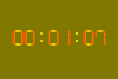

# 15. Timers

<!-- toc -->

## Timing is everything {#sec-intro}

Think of every time you've heard a joke ruined because the punch line came too late or too early; think of all the failed jumps in Super Mario Bros (or any other platform game); all the occasions that you skidded at the start of a Mario Kart race for revving too soon; that your invincibility wore off just *before* you got a red shell up your a\[censored\]s; that you didn't quite dodge that hail of bullets in old-skool shooters because of a sudden slow-down. Think of all this and situations like them and you'll agree that in games, as in life, Timing Is Everything.

Ironically, tim*ers* are of less importance. Throughout video-game history programmers have built their games around one timing mechanism: the vertical refresh rate of the screen. In other words, the VBlank. This is a machine-oriented timer (you count frames) rather than a human-oriented one (where you'd count seconds). For consoles, this works very well as the hardware is always the same. (Except, of course, that some countries use NTSC televisions (@ 60 Hz) and others use PAL TVs (@ 50 Hz). Everyone living in the latter category and has access to both kinds knows the difference and curses the fact that it's the NTSC countries that most games stem from.) While the VBlank timer is pervasive, it is not the only one. The GBA has four clock timers at your disposal. This section covers these timers.

## GBA Timers {#sec-tmr}

All conceivable timers work in pretty much the same way. You have something that oscillates with a certain fixed frequency (like a CPU clock or the swing of a pendulum). After every full period, a counter is incremented and you have yourself a timer. Easy, innit?

The basic frequency of the GBA timers is the CPU frequency, which is 2<sup>24</sup> ≈ 16.78 Mhz. In other words, one <dfn>clock cycle</dfn> of the CPU takes 2<sup>−24</sup> ≈ 59.6 ns. Since this is a very lousy timescale for us humans, the GBA allows for 4 different frequencies (or, rather periods): 1, 64, 256 and 1024 cycles. Some details of these frequencies are shown in {@tbl:tmr-freq}. By clever use of the timer registers, you can actually create timers of any frequency, but more on that later. It should be noted that the screen refreshes every 280,896 cycles, exactly.

<div class="lblock">
<table id="tbl:tmr-freq"
  border=1 cellpadding=2 cellspacing=0>
<caption align="bottom">
  <b>{*@tbl:tmr-freq}</b>: Timer frequencies
</caption>
<col span=4 align="right">
<tr><th>#cycles<th>frequency<th>period
<tr><td>  1 <td>16.78 MHz<td>59.59 ns
<tr><td>  64 <td>262.21 kHz<td>3.815 &mu;s
<tr><td> 256 <td>65.536 kHz<td>15.26 &mu;s
<tr><td>1024 <td>16.384 kHz<td>61.04 &mu;s
</table>
</div>

### Timer registers {#ssec-tmr-regs}

The GBA has four timers, timers 0 to 3. Each of these has two registers: a data register (`REG_TMxD`) and a control register (`REG_TMxCNT`). The addresses can be found in {@tbl:tmr-reg}.

<div class="lblock">
<table id="tbl:tmr-reg">
<caption align="bottom">
  <b>{*@tbl:tmr-reg}</b>: Timer register addresses
</caption>
<tr><th>reg<th>function<th>address
<tr><td><code>REG_TMxD</code><td>data
	<td><code>0400:0100h  + 04h</code>·x
<tr><td><code>REG_TMxCNT</code><td>control
	<td><code>0400:0102h + 04h</code>·x
</table>
</div>

### REG_TMxCNT {#ssec-reg-tmxcnt}

<div class="reg">
<table class="reg" id="tbl:reg-tmxcnt"
  border=1 frame=void cellpadding=4 cellspacing=0>
<caption class="reg">
  REG_TMxCNT @ <code>0400:0102</code> + 4<i>x</i>
</caption>
<tr class="bits">
	<td>F E D C B A 9 8 <td>7 <td>6 <td>5 4 3 <td>2 <td>1 0
<tr class="bf">
  <td>-
  <td class="rclr0">En
  <td class="rclr1">I
  <td>-
  <td class="rclr3">CM
  <td class="rclr2">Fr
</table>

<table>
  <col class="bits" width=40>
  <col class="bf" width="8%">
  <col class="def" width="12%">
<tr align="left"><th>bits<th>name<th>define<th>description
<tbody valign="top">
<tr class="bg0">
  <td>0-1<td class="rclr2">Fr
  <td>TM_FREQ_y
  <td>Timer <b>frequency</b>. 0-3 for 1, 64, 256, or 1024 cycles, 
    respectively. <code>y</code> in the define is the number of 
    cycles.
<tr class="bg1">
  <td> 2 <td class="rclr3">CM
  <td>TM_CASCADE
  <td><b>Cascade mode</b>. When the counter of the <i>preceding</i> 
    (<code>x</code>&minus;1) timer overflows (<code>REG_TM(x-1)D= 
    0xffff</code>), this one will be incremented too. A timer that 
    has this bit set does <i>not</i> count on its own, though you 
    still have to enable it. Obviously, this won't work for timer 0.
    If you plan on using it make sure you understand exactly what I 
    just said; this place is a death-trap for the unwary.
<tr class="bg0">
  <td> 6 <td class="rclr1">I
  <td>TM_IRQ
  <td>Raise an interrupt on overflow.
<tr class="bg1">
  <td> 7 <td class="rclr0">En
  <td>TM_ENABLE
  <td>Enable the timer.
</tbody>
</table>
</div>

### REG_TMxD {#ssec-reg-tmxd}

The data register `REG_TMxD` is a 16-bit number that works a little bit differently than you might expect at first, but in the end it makes sense. The number that you **read** from the register is the **current** timer-count. So far, so good. However, the number that you **write** to `REG_TMxD` is the **initial value** that the counter begins at when the timer is either enabled (via `TM_ENABLE`) or overflows. This has number of ‘interesting’ consequences. To make things a little easier, define variables *n* of the initial value (the write-number) and *c* for the current count (the read number).
<br>  
First of all, when you set an *n* (of, say, `c000h`) like this:

```c
    REG_TM2D= 0xc000;
```

you will *not* have set the current timer-count *c* to *n* (=`c000h`). In fact, if the timer is disabled, then *c*= 0. However, as soon as you do enable the counter, then *c = n* and proceeds from there. And when the timer overflows, it will reset to this value as well. By the way, because *n* is only the starting value it is important to set *n* first, and enable the timer afterwards.

Secondly, ask yourself this: what happens when you disable the timer again? Well, the counter retains its current value. However, when you *enable* it afterwards, *c* will reset to *n* again. This is a bit of a drag if you want to disable the timer for a while (during a game-pause for instance) and then pick up where it left of. Well, yeah, but there is a way to make it happen. How? By turning it into a cascade timer via `TM_CASCADE`! Having that bit set in the `REG_TMxCNT` will cause the timer to be increased only when the preceding one overflows. If you prevent that from ever happening (if it's disabled for instance) then you will have effectively disabled your timer.

Lastly, given a certain *n*, then the timer will overflow after *T*= `10000h`−*n* increments. Or, thanks to the wonders of two's complement, just *T*= −*n*. Combined with a cascade timer (or interrupts) you can build timers of any frequency, which is what you want from a timer.

<div class="note">
<div class="nhcare">
Writing to REG_TMxD is weird
</div>

Writing into REG_TMxD may not do what you think it does. It does *not* set the timer value. Rather, it sets the *initial* value for the next timer run.
</div>

## Timer demo : like clockwork {#sec-demo}

In today's demo, I'm going to show how to make a simple digital clock with the timers. To do this, we'll need a 1 Hz timer. As that's not available directly, I'm going to set up a cascading timer system with timers 2 and 3. Timer 3 will be set to cascade mode, which is updated when timer 2 overflows. It is possible to set the overflow to happen at a frequency of exactly one Hertz. The clock frequency is 2<sup>24</sup>, or 1024\*0x4000. By setting timer 2 to `TM_FREQ_1024` and to start at −0x4000, the cascading timer 3 will effectively be a 1 Hz counter.

<div class="cpt_fr" style="width:240px;">


**{*@fig:tmr-demo}**: `tmr_demo`.
</div>

Whenever timer 3 is updated, the demo turns the number of seconds into hours, minutes and seconds and prints that on screen (see {@fig:tmr-demo}). Yes, I am using divisions and moduli here because it is the simplest procedure and I can spare the cycles in this particular demo.

The demo can be (un)paused with Select and Start. Start disables timer 2, and thus timer 3 too. Select turns timer 2 into a cascade timer as well, and since timer 1 is disabled, doing this also stops timer 2 (and 3). The difference is what happens when you unpause. By disabling a timer, it will start again at the initial value; but stopping it with a cascade actually keeps the timer active and it will simply resume counting once the cascade is removed. The difference is a subtle one, but the latter is more appropriate.

```c
// Using a the "Berk" font from headspins font collection.

#include <stdio.h>
#include <tonc.h>
#include "berk.h"

void tmr_test()
{
    // Overflow every ~1 second:
    // 0x4000 ticks @ FREQ_1024

    REG_TM2D= -0x4000;          // 0x4000 ticks till overflow
    REG_TM2CNT= TM_FREQ_1024;   // we're using the 1024 cycle timer

    // cascade into tm3
    REG_TM3CNT= TM_ENABLE | TM_CASCADE;

    u32 sec= -1;

    while(1)
    {
        vid_vsync();
        key_poll();

        if(REG_TM3D != sec)
        {
            sec= REG_TM3D;
            tte_printf("#{es;P:24,60}%02d:%02d:%02d", 
                sec/3600, (sec%3600)/60, sec%60);
        }

        if(key_hit(KEY_START))  // pause by disabling timer
            REG_TM2CNT ^= TM_ENABLE;

        if(key_hit(KEY_SELECT)) // pause by enabling cascade
            REG_TM2CNT ^= TM_CASCADE;
    }
}

int main()
{
    // set-up berk font
    tte_init_se(0, BG_CBB(0)|BG_SBB(31), 1, 0, 0, &berkFont, se_drawg);
    tte_init_con();
    memcpy16(pal_bg_mem, berkPal, berkPalLen/4);

    REG_DISPCNT= DCNT_MODE0 | DCNT_BG0;

    tmr_test();

    return 0;
}
```

This was a rather simple use of timers. Of course, I could have just as easily used the VBlank to keep track of the seconds, which is how it's usually done anyway. The hardware timers are usually reserved for timed DMA's, which are used in [sound mixers](https://stuij.github.io/deku-sound-tutorial/g), not for game timers. There is one other use that comes to mind, though, namely profiling: examining how fast your functions are. One of the [text system demos](text.html#ssec-demo-se2) uses that to check the speeds of a few copying routines.
