# 22. Tonc's Text Engine {#ch-}

<!-- toc -->

## Introduction {#sec-intro}

The [other page on text](text.html) described how you could get text on backgrounds and objects. It worked, but there were several limitations. For instance, it was limited to 8×8 fonts, didn't support all video modes and had no formatted text capabilities.

Tonc's Text Engine (TTE) remedies many of these shortcomings. In this chapter I'll describe the goals and basic design of the system and some of the implementation details. In particular, I'll describe how to build writers for use of the different kinds of surfaces. In some cases, I'll optimize the living hell out of them because it is possible for a glyph renderer to take multiple scanlines for a single character if you don't pay attention. And yes, this will be done in assembly.

I'll also show how you can add some basic scripting to change cursor positions, colors and even fonts dynamically. A few years ago, Wintermute changed the standard C library in devkitARM to make the stdio routines accessible for GBA and NDS. I'll also show how you can make use of this.

And, of course, there will be demos. Oh, will there be demos. There are about 10 of them in fact, so I'm going to do things a little bit differently than before: there will be one project containing a menu with all the examples. Not all examples will be shown here because that'd just be too much.

Lastly, it is expected that by now you have a decent knowledge of GBA programming, so I'm going to keep the amount of GBA-specific exposition to a minimum. When you see functions used that haven't been covered already, turn to GBATEK, the project's code or tonclib's code for details.

## Basic design {#sec-design}

### TTE Goals {#ssec-design-goals}

The following list has the things I most wanted in TTE:

- **A comprehensive and extensible set of glyph writers, usable for all occasions**. Well _almost_ all occasions. The old system worked for regular backgrounds, bitmap modes and objects, I'm now extending that set to affine backgrounds and tile-rendering. If what you need isn't present in the standard set, you can easily create your own writer and use that one instead. The writer will accept [UTF-8](https://en.wikipedia.org/wiki/UTF-8) strings, meaning you're not limited to 256 characters.
- **Fonts: arbitrary widths and heights and variable width characters**. Instead of being limited to 8x8@1 glyphs; the standard writers in TTE are able to use fonts of any width and height (within reason: no screen-filling glyphs please) and variable width fonts (again, within reason: VWF for tilemaps makes little sense). In principle, there are possibilities to use arbitrary bitdepths as well, but the standard renderers are limited to 1bpp.
- **A simple writer-interface independent of surface details**. For the old system I had `m3_puts()`, `se_puts()`, `obj_puts()` and such. This worked, but it meant you had to use something different for the different modes. In TTE, there are different initializers for the different modes to set up the system, and a single string writer `tte_write()` that just works.
- **Scripting for text parameters**. By that I mean that you can control parameters like position and output color by the strings themselves. The functionality for this is pretty basic, but it works well enough. Note: this is _not_ a full dialog system! That said, it should be possible to build one around it.
- **`printf()` support**. For rather obvious reasons.

### Structures and main components {#ssec-design-items}

All the relevant information for TTE is kept gathered in three structs: a <dfn>text context</dfn>, `TTC`; a <dfn>font description</dfn>, `TFont`; and a <dfn> graphic surface description</dfn>, `TSurface`.

The `TTC` struct contains the main parameters for the engine: information about the surface were rendering to, cursor positions, font information, color attributes and a few other things. It also contains two callbacks for drawing and erasing glyphs.

The `TFont` struct has a pointer to the glyph data, glyph/cell dimensions and a few other things. There are also pointers to width and height tables to allow variable width and height fonts. I've hacked a `TFont` creator into [usenti](http://www.coranac.com/projects/#usenti) a while back so that I could easily create these things from standard fonts, but you can also make your own from scratch.

The `TSurface` struct actually has nothing to do with text. Instead, it's a struct describing the kind of surface we're rendering on. This can be bitmaps, tiles, tilemaps or whatever. Tonclib has basic pixel, line and rectangle routines for dealing with these surfaces, so I might as well use them.

```c{#cd-tte-types}
//# From tonc_tte.h : main TTE types.

typedef struct TFont
{
    const void  *data;      //!< Character data.
    const u8    *widths;    //!< Width table for variable width font.
    const u8    *heights;   //!< Height table for variable height font (mostly unused).
    u16 charOffset;         //!< Character offset
    u16 charCount;          //!< Number of characters in font.
    u8  charW;              //!< Character width (fwf).
    u8  charH;              //!< Character height.(fhf).
    u8  cellW;              //!< Glyph cell width.
    u8  cellH;              //!< Glyph cell height.
    u16 cellSize;           //!< Cell-size (bytes).
    u8  bpp;                //!< Font bitdepth;
    u8  extra;              //!< Padding. Free to use.
} TFont;

//! TTE context struct.
typedef struct TTC
{
    // Members for renderers
    TSurface dst;           //!< Destination surface.
    s16 cursorX;            //!< Cursor X-coord.
    s16 cursorY;            //!< Cursor Y-coord.
    TFont *font;            //!< Current font.
    u8  *charLut;           //!< Character mapping lut, if any.
    u16 cattr[4];           //!< ink, shadow, paper and special color attributes.
    // Higher-up members
    u16 reserved;
    u16 ctrl;               //!< BG control flags.
    u16 marginLeft;
    u16 marginTop;
    u16 marginRight;
    u16 marginBottom;
    s16 savedX;
    s16 savedY;
    // Callbacks and table pointers
    fnDrawg  drawgProc;         //!< Glyph render procedure.
    fnErase  eraseProc;         //!< Text eraser procedure.
    const TFont **fontTable;    //!< Pointer to font table for
    const char  **stringTable;  //!< Pointer to string table for
} TTC;
```

```c{#cd-tte-types2}
//# Supporting types

//! Glyph render function format.
typedef void (*fnDrawg)(int);

//! Erase rectangle function format.
typedef void (*fnErase)(int left, int top, int right, int bottom);

typedef struct TSurface
{
    u8  *data;          //!< Surface data pointer.
    u32 pitch;          //!< Scanline pitch in bytes.
    u16 width;          //!< Image width in pixels.
    u16 height;         //!< Image width in pixels.
    u8  bpp;            //!< Bits per pixel.
    u8  type;           //!< Surface type.
    u16 palSize;        //!< Number of colors.
    u16 *palData;       //!< Pointer to palette.
} TSurface;
```

#### TFont details

<div class="cpt_fr" style="width:128px;">
  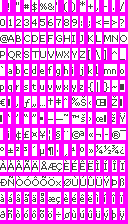
  <br>
  <b>{*@fig:img-verdana9}</b>: Verdana 9 character sheet
</div>

{\*@fig:img-verdana9} shows a character sheet that `TFont` can use. The sheet is a matrix of <dfn>cell</dfn>s and each cell contains a character. The `cellW/H` members are the dimensions of these cells; `cellSize` is the number of bytes per cell.

Each cell has one glyph, but the actual glyphs can be smaller than the cells (white vs magenta parts). This does waste a bit of memory, but it also has several benefits. One of the benefits is that you can use `cellSize` to quickly find the address of any given glyph. Second, because I want by fonts to be usable for both bitmaps _and_ tiles, my glyph boxes would have to be multiples of 8 anyway. Additionally, this particular font will be 1bpp, meaning that even with the wasted parts I'll still have a very low memory footprint (3.5kB).

For fixed-width or fixed-height fonts, members `charW` and `charH` denote the actual character width and height. For fonts of variable widths, the `widths` member points to the a byte-array containing the widths of the glyphs and something similar is true for the `heights`. `charOffset` is the (ASCII) character the data starts at. Font sheets often start at a space (' '), so this tends to be 32. `charCount` is the number of characters and can be used if you need to copy the whole sheet to VRAM (like in the case of tile-mapping).

Please note that how the data in a `TFont` is used depends almost entirely on the glyph renderer. Most renderers that come with tonclib expect this format:

- Bitpacked to **1 bpp**, for size reasons. And for rendering speed too, actually, since memory loads are expensive.
- Tiled-by-glyph. The data for each glyph is contingent with `cellSize` bytes between each glyph. This is similar to how 1D object work with one important difference:
- the tiles in each glyph are **column-major** (tile 1 is under tile 0). This in contrast to objects, which tend to be [row-major](https://en.wikipedia.org/wiki/Row-major_order) (tile 1 is to the right of tile 0). I will refer to this format as **tile-strips**. The reason behind this choice will be given later.

There are exceptions to this, but most renderers presented here will use this format. If you want to make your own renderers, you're free to use any format for the data you think is appropriate.

#### TTC details

The text context, `TTC`, contains the most important data of the system. Starting at the top: the surface, `dst`. This defines the surface we're rendering to. The most relevant items there are its memory address, **pitch**: the number of bytes per scanline. The pitch is a _very_ important parameter for rendering, more important than the width and height in fact. The surface also has palette members, which can be used to access its colors. Much like the `TFont` members, how this data is used largely depends on the renderer.

The members `cursorX/Y` are for the current cursor position. The `margin` rectangle indicates which part of the screen should be used for text. If the cursor exceeds the right margin, it will be moved to the left margin and one line down. The margins are also used for screen-clears and returning to the top of the page.

The `cattr` table is something special. Its entries are <dfn>color attribute</dfn>s. Parameters for ink (foreground color), shadow, paper (background color) are put here, along with a ‘special’ field which is very much context-specific. Note that these color attributes do not necessarily represent colors. In modes 3 and 5 they're colors, but for mode 4 and tile writers they're color indices. There's probably a nicer name for this than ‘color attribute’, but sodomy non sapiens.

Rendering glyphs and erasing (parts of) the screen is done through the callbacks `drawgProc` and `eraseProc`. The idea is that you initialize the system with the routines appropriate for your text format and TTE uses them to do the actual writing. I should point out that using callbacks for rendering a single glyph can have a significant overhead, especially for the simpler kinds of text like tilemaps.

### Main TTE variables and functions. {#ssec-design-writer}

The state of the TTE system is kept in a `TTC` variable accessible through `tte_get_context()`. All changes to the system go through there. In _some_ cases, it is useful to have two sets of state and switch between them when appropriate (like when you have two screens. Y hello thar, NDS). For that you can use `tte_set_context)` to redirect the pointer.

```c {#cd-ttc-funcs}
TTC __tte_main_context;
TTC *gp_tte_context= &__tte_main_context;

//! Get the master text-system.
INLINE TTC *tte_get_context()
{   return gp_tte_context;                          }


//! Set the master context pointer.
void tte_set_context(TTC *tc)
{
    gp_tte_context= tc ? tc : &__tte_main_context;
}
```

To print characters, you can use `tte_putc()` and `tte_write()`.

```c {#cd-tte-putc}
//! Get the glyph index of character \a ch.
INLINE uint tte_get_glyph_id(int ch)
{
    TTC *tc= tte_get_context();
    ch -= tc->font->charOffset;
    return tc->charLut ? tc->charLut[ch] : ch;
}

//! Get the width of glyph \a id.
INLINE uint tte_get_glyph_width(uint gid)
{
    TFont *font= tte_get_context()->font;
    return font->widths ? font->widths[gid] : font->charW;
}

//! Render a character.
int tte_putc(int ch)
{
    TTC *tc= tte_get_context();
    TFont *font= tc->font;

    // (4) translate from character to glyph index
    uint gid= tte_get_glyph_id(ch);

    // (5) get width for cursor update
    int charW= tte_get_glyph_width(gid);

    if(tc->cursorX+charW > tc->marginRight)
        [[ simulate newline ]]

    // (6) Draw and update position
    tc->drawgProc(gid);
    tc->cursorX += charW;

    return charW;
}
```

```c {#cd-tte-write}
//! Render a string.
/*! \param text String to parse and write.
    \return     Number of parsed characters.
*/
int tte_write(const char *text)
{
    int ch;
    uint gid, charW;
    const char *str= text;
    TTC *tc= tte_get_context();

    while( (ch= *str++) != '\0' )
    {
        // (1) Act according to character type
        switch(ch)
        {
        case '\n':  [[ update cursorX/Y for newline ]];     break;
        case '\t':  [[ update cursorX for tab ]];           break;
        default:
            // (2) more special thingies
            if(ch=='#' && str[0]=='{')          // (2a) Command sequence
            {
                str= tte_cmd_default(str+1);
                break;
            }
            else if(ch=='\\' && str[0]=='#')    // (2b) Escaped command
                ch= *str++;
            else if(ch>=0x80)                   // (2c) UTF8 character
                ch= utf8_decode_char(str-1, &str);

            // (3) draw character
            tte_putc(ch);
        }
    }

    return str - text;
}
```

I've omitted the code for a few things here, the idea should be clear. First, read a character. Then, check whether it's a special character (new line, tab, formatting command) and if so, act accordingly. Because `tte_write()` supports UTF-8, we also check for that and decode the string for a full UFT-8 character. After that's all done, we pass the character on to `tte_putc()`, which translates it to a glyph index, draws the glyph and advances the cursor.

Note: the way described here is _a_ method of doing things; it's not _the_ method, because that doesn't actually exist. Several steps done here may be overkill for the kind of text you had in mind. For example, getting from the character to the glyph index is done by the font's character offset and a potential character look-up table, neither of which is strictly necessary. Likewise, wrapping at the edges may already be done in the string itself with newline characters. On the other hand, you might like more complex wrapping, text alignment, scrolling, and who knows what else. If you want these things, creating your own routine shouldn't be too difficult.

### On nomenclature {#ssec-design-names}

Some terms I use in TTE have a very specific meaning. Because the differences between terms can be subtle, it is important to define the term explicitly. Additionally, TTE uses several acronyms and abbreviations that need to be clarified.

- **char(acter) vs glyph index**. ‘Character’ refers to the ASCII character; the ‘glyph index’ is the corresponding index in the font. For example, ‘A’ is character 65, but if the font starts at a space (' ', ASCII 32) the ‘A’ is glyph index 65−32=33. As a rule, variables named `ch` are characters and `gid` means glyph index. The input of the renderers is the glyph index, and not the character.

- **Surface**. Surface is the term I'm using to describe whatever I'm manipulating to show text. This is usually VRAM, but can be other things as well, like OBJ_ATTRs for object text.

- **Pitch**. The pitch is actually a common term in graphics, but since graphics terms may not be so common, it's worth repeating. Technically, the <dfn>pitch</dfn> is the number of scanlines between rows. I'm extending it a little to mean the _characteristic major distance_ for matrices. Matrices are 2D entities, and they'll have adjacent elements in one direction and a larger distance for the other. These usually are _x_ and _y_, respectively, but not always. The _minor_ distance will be referred to as <dfn>stride</dfn>.

- **Color vs color attribute**. The ‘color’ is the real 5.5.5 BGR color; the ‘color attribute’ is whatever the renderer will use on the surface. This can be a color, but it can also be a palette index or something else entirely. The interpretation is up to the renderer.

- **Render/Text family**. This is a conceptual group-name for a specific kind of text. {\*@tbl:tte-family} gives an overview of the families available. This largely corresponds to the `TSurface` types.

- **Renderer types**. Within each family there can be different renderers for different kinds of fonts and effects. For example, when rendering to an 8bpp bitmap (the bmp8 family), you can have different renderers for different font bitdepths (1bpp or 8bpp, for example) or glyph layouts (bitmapped or tiled). They can render some pixels transparently, or apply anti-aliasing. Or any combination of those. The point is there are a _lot_ of options here.

  Because I really don't like names that span a whole line, I will use abbreviations in the renderer's name to indicate what it does; see {@tbl:tte-drawg} for what they mean. For the most part, the renderers will be for fonts with arbitrary width and height, with a 1bpp tile-stripped glyphs, with they will draw them transparently and re-coloring of pixels. This is indicated by `*_b1cts`.

<div class="lblock">
  <table id="tbl:tte-family" border=1 cellpadding=2 cellspacing=0>
    <caption align="bottom">
      <b>{*@tbl:tte-family}</b>: TTE render family indicators and initializers. 4bpp Tiles can be row or column major (<code>crh4r</code> or <code>chr4c</code>).
    </caption>
    <tr>
      <th width=25%>Family</th>	
      <th>prefix</th> 
      <th>Initializer</th>		
    </tr>
    <tr>
	    <td>Regular tilemap (mode 0/1)</td>	
      <td>se</td>
	    <td>
        void tte_init_se(int bgnr, u16 bgcnt, SCR_ENTRY se0, u32 colors, u32 bupofs, const TFont *font, fnDrawg proc);
      </td>
    </tr>
    <tr>
	    <td>Affine tilemap (mode 1/2)</td>
      <td>ase</td>
	    <td>
        void tte_init_ase(int bgnr, u16 bgcnt, u8 ase0, u32 colors, u32 bupofs, const TFont *font, fnDrawg proc);
      </td>
    </tr>
    <tr>
	    <td>4bpp Tiles (modes 0/1/obj)</td>	
      <td>chr4<i>(c/r)</i></td>
	    <td>
        void tte_init_chr4<i>(c/r)</i>(int bgnr, u16 bgcnt, u32 cattrs, u32 colors, const TFont *font, fnDrawg proc);
      </td>
    </tr>
    <tr>
	    <td>8bpp bitmap (mode 4)</td>
      <td>bmp8</td>
	    <td>
        void tte_init_bmp(int vmode, const TFont *font, fnDrawg proc);
      </td>
    </tr>
    <tr>
	    <td>16bpp bitmap (mode3/5)</td>
      <td>bmp16</td>
	    <td>void tte_init_bmp(int vmode, const TFont *font, fnDrawg proc);</td>
    </tr>
    <tr>
	    <td>objects</td>
      <td>obj</td>
	    <td>
        void tte_init_obj(OBJ_ATTR *dst, u32 attr0, u32 attr1, u32 attr2, u32 colors, u32 bupofs, const TFont *font, fnDrawg proc);
      </td>
    </tr>
  </table>
</div>
<br>
<div class="lblock">
  <table id="tbl:tte-drawg" border=1 cellpadding=2 cellspacing=0>
    <caption align="bottom">
      <b>{*@tbl:tte-drawg}</b>: Render type summary.
    </caption>
    <tr>
      <th>Code</th>
      <th>Description</th>
    </tr>
    <tr>
      <td>b<i>x</i></td>
      <td><b>B</b>itdepth of source font. (<code>b1</code> = 1 bpp)</td>
    </tr>
    <tr>
      <td>w<i>x</i></td>
      <td>Specific <b>w</b>idth (<code>w8</code> = width 8)</td>
    </tr>
    <tr>
      <td>h<i>x</i></td>
      <td>Specific <b>h</b>eight (<code>h8</code> = height 8)</td>
    </tr>
    <tr>
      <td>c</td>
      <td>
        Re-<b>c</b>oloring. Color attributes are applied to the pixels in some way.
      </td>
    </tr>
    <tr>
      <td>t/o</td>
      <td><b>T</b>ransparent or <b>o</b>paque paper pixels.</td>
    </tr>
    <tr>
      <td>s</td>
      <td>Glyphs are in tile-<b>s</b>trip format.</td>
    </tr>
  </table>
</div>

Lastly, a note on some of the abbreviations I use in the rendering code. A number of terms come up again and again, and I've taken to use a shorthand notation for these items. The basic format is `fooX` where `foo` is the relevant bitmap/surface and `X` is a one-letter code for things like width, height, data and others. Yes, the use of single-letter names is frowned upon and I don't advocate their use in general, but I've found that in this particular case, if used judiciously, they have helped me read my own code.

<div class="lblock">
  <table id="tbl:tte-brevs" border=1 cellpadding=4 cellspacing=0>
    <caption align="bottom">
      {*@tbl:tte-brevs}. Abbreviations used in rendering code.
    </caption>
    <tr> 
      <th>Term</th>
      <th>Meaning</th>
    </tr>
    <tr>
      <td><code>fooW</code></td>
      <td>Width of <code>foo</code></td>
    </tr>
    <tr>
      <td><code>fooH</code></td>
      <td>Height of <code>foo</code></td>
    </tr>
    <tr>
      <td><code>fooB</code></td>
      <td>Bitdepth of <code>foo</code></td>
    </tr>
    <tr>
      <td><code>fooP</code></td>
      <td>Pitch of <code>foo</code></td>
    </tr>
    <tr>
      <td><code>fooD</code></td>
      <td>Primary data-pointer for <code>foo</code></td>
    </tr>
    <tr>
      <td><code>fooL</code></td>
      <td>Secondary data-pointer for <code>foo</code></td>
    </tr>
    <tr>
      <td><code>fooS</code></td>
      <td>Size of <code>foo</code></td>
    </tr>
    <tr>
      <td><code>fooN</code></td>
      <td>Number/count of <code>foo</code></td>
    </tr>
  </table>
</div>

## Tilemapped text {#sec-map}

### Regular tilemap text {#ssec-map-reg}

Tilemapped text is the easiest to implement, because you don't really have to render anything at all. You simply load up all the font's tiles into a charblock and place screen-entries for the actual text.

The initializer for regular tilemaps is `tte_init_se()`. It's identical to [`txt_init_se()`](text.html#cd-txt-init-se) except for the two extra parameters at the end: `font` and `proc`. These represent the font to use and the renderer that does the surface manipulation. Every initializer in TTE has those two parameters. It's safe to pass NULL to them if you're not sure what to use; in that case, the default option for that family will be used.

If `font` is NULL, you'll get the default font. This is either [`system8Font`](text.html#img-tonc-font) for fixed-width occasions or `verdana9Font` ({@fig:img-verdana9}) when variable width is suitable. These can also be referenced via `fwf_default` and `vwf_default`, respectively.

Each family also has a default renderer, #defined as _`foo`_`_drawg_default`, where _foo_ is the family prefix. The default renderers are the general routines, suitable for all character widths and heights (fixed or variable fonts). Of course, this does mean that they will be slower than routines written to work with a specific glyph size. This is particularly true for tilemapped text, and for that reasons specific `_w8h8` and `_w8h16` versions are available there as well.

The initializers tend to be long and boring, so I won't waste too much space on them here. Basically, they clear out the text context, assign some sensible values to the margins and surface variables, set up the font, the renderer and the eraser. They also fill some of the palette and color attributes.

The code I'll show in this chapter will mostly be about the renderers themselves. Below you can see the code for the default screen-entry writer, `se_drawg_s()`, and the one specific for 8×8 fonts, `se_drawg_w8h8`

```c {#cd-se-drawg .proglist}
//! Character-plot for reg BGs, any sized, vertically tiled font.
void se_drawg_s(uint gid)
{
    int ix, iy;

    // (1) Get main variables.
    TTC *tc= tte_get_context();
    TFont *font= tc->font;
    uint charW= (font->cellW+7)/8, charH= (font->cellH+7)/8;

    uint x0= tc->cursorX, y0= tc->cursorY;
    uint dstP= tc->dst.pitch/2;
    u16 *dstD= (u16*)(tc->data + (y0*dstP+x0)*2);

    // (2) Get the base tile index.
    u32 se= tc->cattr[TTE_SPECIAL] + gid*charW*charH;

    // (3) Loop over all tiles to draw glyph.
    for(ix=0; ix<charW; ix++)
    {
        for(iy=0; iy<charH; iy++)
            dstD[iy*dstP]= se++;
        dstD++;
    }
}

//! Character-plot for reg BGs using an 8x8 font.
void se_drawg_w8h8(uint gid)
{
    TTC *tc= tte_get_context();

    uint x0= tc->cursorX, y0= tc->cursorY;
    uint dstP= tc->dst.pitch/2;
    u16 *dstD= (u16*)(tc->data + (y0*dstP+x0)*2);

    dstD[0]= tc->cattr[TTE_SPECIAL] + gid;
}
```

Let's start with the simpler one: `se_drawg_w8h8()`. An 8×8 glyph on a GBA tilemap simply means write a single screen-entry to the right place. The right place here is derived from the cursor position and the surface data (`tc->dst`). The ‘special’ color attribute is used as a modifier to the glyph index for things like palette swapping.

Note that the routine just handles plotting the glyph. Transforming from ASCII to glyph index and repositioning the cursor is all done elsewhere.

The more generalized routine, `se_drawg_s()` is a little more complex. It still starts by getting a pointer to the glyph's destination, `dstD`, and pitch (the distance to the next line), `dstP`. **All** renderers start with something like this. All renderers also retrieve the character's width and height – unless the sizes are specified in advance. The names I use for rendering are always the same, so you should be able to tell what means what even when the formulas for initializing them can be a tad icky.

Anyway, after getting the pointer and pitch, the tile-index for the top-left of the glyph is calculated and put this into `se`. After that, we loop over the different tiles of the glyph in both directions. Note that the order of the loop is column-major, not row-major, because that's the way the default fonts were ordered.

As it happens, column-major rendering tends to be more efficient for text, because glyphs are usually higher than they are wide. Also, for tilemap text `charW` and `charH` tend to be small – often 1 or 2. This means that it is extremely inefficient to use loops; we'll see how inefficient in the ["Profiling the renderers" subsection](#ssec-misc-profile).. Unrolling them, like `se_drawg_w8h8()` and `se_drawg_w8h16()` do, gives a much better performance.

### Regular tilemap example {#ssec-test-se4}

```c {#cd-test-se4 .proglist}
void test_tte_se4()
{
    irq_init(NULL);
    irq_add(II_VBLANK, NULL);
    REG_DISPCNT= DCNT_MODE0 | DCNT_BG0;

    // --- (1) Base TTE init for tilemaps ---
    tte_init_se(
        0,                      // Background number (BG 0)
        BG_CBB(0)|BG_SBB(31),   // BG control (for REG_BGxCNT)
        0,                      // Tile offset (special cattr)
        CLR_YELLOW,             // Ink color
        14,                     // BitUnpack offset (on-pixel = 15)
        NULL,                   // Default font (sys8)
        NULL);                  // Default renderer (se_drawg_s)

    // --- (2) Init some colors ---
    pal_bg_bank[1][15]= CLR_RED;
    pal_bg_bank[2][15]= CLR_GREEN;
    pal_bg_bank[3][15]= CLR_BLUE;
    pal_bg_bank[4][15]= CLR_WHITE;
    pal_bg_bank[5][15]= CLR_MAG;

    pal_bg_bank[4][14]= CLR_GRAY;

    // --- (3) Print some text ---

    // "Hello world in different colors"
    tte_write("\n Hello world! in yellow\n");
    tte_write(" #{cx:0x1000}Hello world! in red\n");
    tte_write(" #{cx:0x2000}Hello world! in green\n");

    // Color use explained
    tte_set_pos(8, 64);
    tte_write("#{cx:0x0000}C#{cx:0x1000}o#{cx:0x2000}l");
    tte_write("#{cx:0x3000}o#{cx:0x4000}r#{cx:0x5000}s");
    tte_write("#{cx:0} provided by \\#{cx:#}.");


    // --- (4) Init for 8x16 font and print something ---
    GRIT_CPY(&tile_mem[0][256], cyber16Glyphs); // Load tiles
    tte_set_font(&cyber16Font);                 // Attach font
    tte_set_special(0x4100);                    // Set special to tile 256, pal 4
    tte_set_drawg(se_drawg_w8h16);              // Attach renderer

    tte_write("#{P:8,80}Also available in 8x16");

    key_wait_till_hit(KEY_ANY);
}
```

The code above demonstrates a few of the things you can do with TTE for tilemaps. The call to `tte_init_se()` initializes the system to display text on BG 0, using charblock 0 and screenblock 31 and to use the default font and renderer. Parameter five is the bit-unpack offset; by setting it to 14, all the 1-valued pixels in the font move to 14+1=15, the last index in a palette bank. I'm also setting a few other colors so that the palette will look like {@fig:img-test-se4}b.

In step 3, I print some text with `tte_write()`. The different colors are done by using `#{cx:`_`num`_`}` in the string, which sets the special color-attribute to _num_. More on these kinds of commands in the ["Scripting, console IO and other niceties" section](#sec-misc).. Since the `se`-renderers add this value to the glyph index for the final output, it can be used for palette swapping.

Step 4 demonstrates how to load up and use a second font. The `cyber16Font` is a rendition of the 8×16 font used in ye olde SNES game, Cybernator (see {@fig:img-cyber16}). This font was exported as 4bpp data so I can just copy it into VRAM directly, but I do need to use an offset because I want to keep the old font as well. The charblock now has two sets of glyphs (see {@fig:img-test-se4}c).

<div class="cblock">
  <table width=60%>
    <tr valign="bottom">
      <td>
	      <div class="cpt_fl" style="width:128px;">
	        
          <br>
	        <b>{*@fig:img-cyber16}</b>: Cybernator font: 8&times;16.
	      </div>
      </td>
      <td>
	      <div class="cpt" style="width:240px;">
	        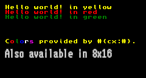
          <br>
	        <b>{*@fig:img-test-se4}a</b>: <code>test_tte_se4</code> output.
	      </div>
      </td>
    </tr>
    <tr valign="top">
      <td>
	      <div class="cpt" style="width:128px;">
	        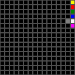test_tte_se4</code>.">
          <br>
	        <b>{*@fig:img-test-se4}b</b>: Palette.
	      </div>
      </td>
      <td>
	      <div class="cpt" style="width:256px;">
	        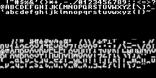test_tte_se4</code>.">
          <br>
	        <b>{*@fig:img-test-se4}c</b>: Tileset.
	      </div>
      </td>
    </tr>
  </table>
</div>

In principle, all I need to do to use a different font is to select it with `tte_set_font()`, but since the tiles are at an offset, I also need to adjust the special color attribute. The value of 0x4100 is used here to account for the offset (0x0100) as well as the palette-bank (0x4000). I'm also selecting a different renderer for the occasion, although that's mostly for show here because the default renderer can handle 8×16 fonts just as well. After that, I just call `tte_write()` again to print a new string in using the new font.

### Affine tilemap text {#ssec-map-affine}

Text for affine tilemaps works almost the same as for regular tilemaps; you just have to remember the differences between the two kinds of backgrounds, like map size and available bitdepth. The functions' prototypes are the same, except that `se` is replaced by `ase`.

Internally, the only real difference is in what the renderers are to output, namely bytes instead of halfwords. And here we run into that quaint little fact of VRAM again: you can't write single bytes to VRAM. This means that the renderers will be a little more complicated. But only a little: simply call a byte-plotting routine for the screen-entry placement. Because affine maps are essentially 8bpp bitmap surfaces, I can use the standard plotter for 8bpp bitmap surfaces: `_sbmp8_plot()`. Aside from this one difference, the `ase_` renderers are identical to the `se_` counterparts.

```c {#cd-ase-drawg .proglist}

//! Character-plot for affine BGs using an 8x8 font.
void ase_drawg_w8h8(uint gid)
{
    TTC *tc= tte_get_context();
    u8 se= tc->cattr[TTE_SPECIAL] + gid;

    _sbmp8_plot(&tc->dst, tc->cursorX/8, tc->cursorY/8, se);
}

//! Character-plot for affine BGs, any sized, vertically oriented font.
void ase_drawg_s(int gid)
{
    TTC *tc= tte_get_context();
    TFont *font= tc->font;
    uint charW= (font->cellW+7)/8, charH= (font->cellH+7)/8;
    uint x0= tc->cursorX/8, y0= tc->cursorY/8;

    u8 se= tc->cattr[TTE_SPECIAL] + gid*charW*charH;

    int ix, iy;
    for(ix=0; ix<charW; ix++)
        for(iy=0; iy<charH; iy++, se++)
            _sbmp8_plot(&tc->dst, ix+x0, iy+y0, se);
}
```

The demo for affine map text is `text_tte_ase()`. The idea is simple here: set up the text for a 256×256 pixel map, write some text onto it and rotate the background to illustrate that it is indeed an affine background. The center of rotation is the “o” at the center of the screen. To place it there, I've used the `#{P:x,y}` code; this sets the cursor to the absolute position given by (x, y). The other string is also positioned on the map in this manner.

```c {#cd-test-ase .proglist}
void test_tte_ase()
{
    irq_init(NULL);
    irq_add(II_VBLANK, NULL);
    REG_DISPCNT= DCNT_MODE1 | DCNT_BG2;

    // Init affine text for 32x32t bg
    tte_init_ase(
        2,                      // BG number
        BG_CBB(0) | BG_SBB(28) | BG_AFF_32x32,  // BG control
        0,                      // Tile offset (special cattr)
        CLR_YELLOW,             // Ink color
        0xFE,                   // BUP offset (on-pixel = 255)
        NULL,                   // Default font (sys8)
        NULL);                  // Default renderer (ase_drawg_s)

    // Write something
    tte_write("#{P:120,80}o");
    tte_write("#{P:72,104}Round, round, #{P:80,112}round we go");

    // Rotate it
    AFF_SRC_EX asx= { 124<<8, 84<<8, 120, 80, 0x100, 0x100, 0 };
    bg_rotscale_ex(&REG_BG_AFFINE[2], &asx);

    while(1)
    {
        VBlankIntrWait();
        key_poll();

        asx.alpha += 0x111;
        bg_rotscale_ex(&REG_BG_AFFINE[2], &asx);

        if(key_hit(KEY_START))
            break;
    }
}
```

<div class="cpt" style="width:240px;">
  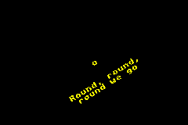test_tte_ase</code>."><br>
  <b>{*@fig:img-test-ase}</b>: <code>test_tte_ase</code>.
</div>

## Bitmapped text {#sec-bmp}

Bitmap text rendering is a little different from map text and can range in difficulty from easy to insane, depending on your wishes. At its core, though, it's always the same process: loop over all pixels and draw them on the destination surface. For example, a generic glyph renderer that draws pixels transparently could look something like this.

```c {.proglist}
// Pseudo code for a general glyph printer.
void foo_drawg(uint gid)
{
    TTC *tc= tte_get_context();
    TFont *font= tc->font;

    // Drawing with color keying.
    // Loop over all pixels. If the glyph's pixel is not zero, draw it.
    // Other wise, nevermind.
    for(iy=0; iy<tte_get_glyph_height(gid); iy++)
    {
        for(ix=0; ix<tte_get_glyph_width(gid); ix++)
        {
            u16 color= font_get_pixel(font, gid, ix, iy);
            if(color != 0)
                foo_plot(&tc->dst, tc->cursorX+ix, tc->cursorY+iy, color);
        }
    }
}
```

Here, _`foo`_ can mean any rendering family. `foo_plot()` is a general pixel plotter and `font_get_pixel()` a pixel retriever. The implementations of those functions depend on the specifics of the font and surface, but the glyph renderer doesn't need to know about that.

### Basic bmp16 to bmp16 glyph printer {#ssec-bmp16-base}

This next function is an example of a 16bpp font to 16bpp bitmap printer.

```c {#cd-bmp16-drawg .proglist}
//! Glyph renderer from bmp16 glyph to bmp16 destination.
void bmp16_drawg(uint gid)
{
    // (1a) Basic variables
    TTC *tc= tte_get_context();
    TFont *font= tc->font;

    u16 *srcD= (u16*)(font->data+gid*font->cellSize), *srcL= srcD;
    uint charW= tte_get_glyph_width(gid)
    uint charH= tte_get_glyph_height(gid);

    uint x0= tc->cursorX, y0= tc->cursorY;
    uint srcP= font->cellW, dstP= tc->dst.pitch/2;
    u16 *dstD= (u16*)(tc->dst.data + (y0*dstP + x0)*2);

    // (2) The actual rendering
    uint ix, iy;
    for(iy=0; iy<charH; iy++)
    {
        for(ix=0; ix<charW; ix++)
            if(srcD[ix] != 0)
                dstD[ix]= srcD[ix];

        srcD += srcP;
        dstD += dstP;
    }
}
```

Blocks 1a and 1b set up the main variables to use in the loop. The most important are the source and destination pointers, `srcD` and `dstD`, and their pitches, `srcP` and `dstP`. Notice that the source pitch, `srcP`, is the not the character width, but the cell width, because the fonts are organized on a cell-grid. The code at point 2 selectively copies pixels from the font to the surface.

#### Intermezzo : considerations for performance

You may wonder why `bmp16_drawg()` doesn't follow the pattern in the earlier `foo_drawg()` more closely. The answer is, of course, performance. And before anyone quotes Knuth on me: not every effort to make your code fast is premature optimization. When you can improve the speed of the code without spending too much effort of a loss of readability, there's not much reason not to.

In this case, the optimizations I've applied here fall into two categories: local variables and pointer arithmetic. These techniques – that every C programmer _should_ know – managed to boost the speed by a factor of 5.

Let's start with pointers. I'm using pointer to my advantage in two places here. First, instead of using the font-data pointer and destination pointer directly, I create pointers `srcD` and `dstD` and direct them the top-lefts of the glyph and where it will be rendered to. Short-circuiting the accesses like this means that I don't have to apply extra offsets to get to where I want to go in the loop. This will be both faster and in fact more readable as well, because the loops won't contain any non-essential expressions.

```c {.proglist}
//# Example of a more standard bitmap copier.
for(iy=0; iy < charH; iy++)
    for(ix=0; ix < charW; ix++)
        dstD[iy*dstP + ix]= srcD[iy*srcP+ix];
```

A second point here is using incremental offsets instead of the `y*pitch+x` form (see above). I suppose this is mostly a matter of preference, but avoiding the wholly unnecessary multiplications does matter.

The second optimization is local variables. By this I mean loading variables that reside in memory (globals and struct members) or oft-used function results in local temporaries. This may seem like a silly thing to point out, but the amount of time you can save with this is actually quite high.

Consider the use of `tte_get_glyph_width()` here. I _know_ the width of a glyph won't change during the loop, so calling a function to get the width in the loop-condition itself is just stupid. Another example of this would be calling `strlen()` when looping over all characters in a string. For those who do this: NO! Bad programmer, bad! Save the value in a local variable and use that instead.

The other point is to pre-load things like globals and struct/class members if you use them more than once. Consider the following code. It's the same as the one given before, only now I have not loaded character height and the pitches into local temporaries.

```c {.proglist}
//# Another bitmap-copy example. DO NOT USE THIS !!!
for(iy=0; iy < font->charH; iy++)
    for(ix=0; ix < charW; ix++)
        dstD[iy*tc->dst.pitch/2 + ix]= srcD[iy*font->cellW + ix];
```

The result: the speed of the function was **halved**! I expected it to be slower, but that this innocuous-looking modification would actually cost me a factor two was quite a surprise to me.

So yes, spam your code width locals for loop-invariant, memory-based quantities. This avoids them being loaded from memory every time. As a bonus, the loops themselves win contain less text and be more generalized, making it more reusable.

Both the pointer work and pre-loading variables are actually the job of the compiler's optimizer, but the current version of GCC doesn't do these very well or at all. Also, sometimes it _can't_ do this optimization. When functions are called between memory dereferences, the compiler has to reload the data because those functions may have changed their contents. Obviously, this wouldn't happen for locals.

<div id="nt-local" class="note">

<div class="nhgood">

Use local variables for struct members and globals

</div>

Struct members and global variables live in memory, not CPU registers. Before the CPU can use their data, they have to be loaded from memory into registers first, and this often happen more times then necessary. Since memory access (especially ROM access) is slower than register access, this can really bog down an algorithm if the thing is used more than once. You can avoid this needless work by creating local variables for them.

Aside from the speed-boost, local variables can use shorter names, resulting in shorter and more readable code in the parts that actually do the work. It's win-freakin'-win, baby.

</div>

### Glyph and surface formats {#ssec-srf-format}

The renderer described above assumes that the glyphs are in formatted as 16-bpp bitmaps. However, TTE's default fonts are in a 1-bpp tilestrip format, so I'll have to use something else. Before I go into the details of that function, I'd like to discuss the different glyph formats and why I'm using tile-strips instead of just plain bitmaps.

When I say glyph formats, what I really mean is the order in which pixels are accessed. Three key variations exist.

- **Linear** or **bitmap** layout. This is a simple, row-major matrix. This gives you two loops; one for _y_ and one for _x_.
- **Tiled**. In particular: 8×8 tiled. This is the standard GBA tile format where each group of 8×8 pixels form a row-major matrix, and then the tiles themselves are part of a larger row-major matrix again. Going through this required **four** loops: two for each matrix.
- **Tile-strips**. This also uses 8×8 tiles, but this time the tiles ordered in a column-major order. In other words, tile 1 comes below tile 0 instead of to the right. This has the rather nice property that the rows in successive tiles are consecutive. It eliminates the break in the _y_ direction, resulting in only 3 loops and has simpler code to boot.

{\*@fig:img-src-loops} shows these three layouts, including the loop structure and the order in which the pixels are traversed for 1bpp fonts. The case is a little bit different because of the bit-packing: 1 bpp means 8 pixels per byte. As a result, the bitmap-_x_ loops have to be broken up into groups of 8, so that the bitmap format now uses three nests of loops instead of just two. There is no difference for the tiled formats, as those are grouped by 8 pixels anyway. Not only that, if you were to calculate the total loop-overhead for commonly used glyph sizes it turns out that this arrangement actually works particularly well for tile-strips. This is left as an exercise for the reader (hint: count the number of comparisons).

<div class="cblock">
  <div class="cpt" style="width:600px;">
    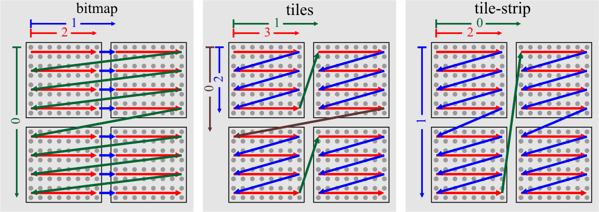
    <br>
    <b>{*@fig:img-src-loops}</b>: Pixel traversal in glyphs for 1-bpp bitmap, tile and tile-strip formats. The numbers indicate the loops and their nestings.
  </div>
</div>

### bmp16_drawg_b1cts : 1- to 16-bpp with transparency and coloring {#ssec-bmp16-std}

The next routine takes 1-bpp tile-strip glyphs and turns them into output suitable for 16-bpp bitmap backgrounds. The output will use the ink attribute for color and it will only draw a pixel if the bit was 1 in the source data, giving us transparency. The three macros at the top declare and define the basic variables, comparable to step 1a in `bmp16_drawg()`.

```c {#cd-bmp16-drawg-b1cts .proglist}
void bmp16_drawg_b1cts(uint gid)
{
    // (1) Basic variables
    TTE_BASE_VARS(tc, font);
    TTE_CHAR_VARS(font, gid, u8, srcD, srcL, charW, charH);
    TTE_DST_VARS(tc, u16, dstD, dstL, dstP, x0, y0);
    uint srcP= font->cellH;

    dstD += x0;

    u32 ink= tc->cattr[TTE_INK], raw;

    // (2) Rendering loops.
    uint ix, iy, iw;
    for(iw=0; iw<charW; iw += 8)            // loop over tile-strips
    {
        dstL= &dstD[iw];
        for(iy=0; iy<charH; iy++)           // loop over tile-lines
        {
            raw= srcL[iy];
            for(ix=0; raw>0; raw>>=1, ix++) // loop over tile-scanline (8 pixels)
                if(raw&1)
                    dstL[ix]= ink;

            dstL += dstP/2;
        }
        srcL += srcP;
    }
}
```

The routine starts by calls to three macros: `TTE_CHAR_VARS()`, `TTE_CHAR_VARS` and `TTE_DST_VARS()`. These declare and define most of the relevant local variables, similar to step 1a in `bmp16_drawg()`. Note that two of the arguments here are datatype identifiers for the source and destination pointers, respectively. `srcD` and `srcL` will initially point to the start of the source data. The other pointers, `dstD` and `dstL`, point to the start _of the scanline_ in the destination area. They haven't been corrected for the _x_-position just yet; that's done right after it.

The reason I'm using two pairs of pointers here (a main _data_ pointer, `fooD` and a _line_ pointer `fooL`) is because of the pointer arithmetic. The data-pointer stays fixed and the line-pointer moves around in the inner loop.

The tile-strip portion of {@fig:img-src-loops} illustrates how the routine moves over all the pixels. Because it's for a 1-bpp bitpacked font and because there are 8 pixels per tile-line, we can get an entire line's worth of pixels in one byte-read. Rendering transparently gives us a nice chance for optimization as well: if the tile-line is empty (i.e., `raw`==0), we have no more visible pixels in that line and we can move on to the next. A glance at the verdana 9 font in {@fig:img-verdana9}, will tell you that you may be able to skip 50% of the pixels because of this.

### bmp8_drawg_b1cts : 1 to 8 bpp with transparency and coloring {#ssec-bmp8-std}

The 8 bpp counterpart of the previous function is called `bmp8_drawg_b1cts()`, and is given below. The code is very similar to the 16 bpp function, but because the pixels are now bytes there are a few differences in the details.

```c {#cd-bmp8-drawg-b1cts .proglist}
void bmp8_drawg_b1cts(uint gid)
{
    // (1) Basic variables
    TTE_BASE_VARS(tc, font);
    TTE_CHAR_VARS(font, gid, u8, srcD, srcL, charW, charH);
    TTE_DST_VARS(tc, u16, dstD, dstL, dstP, x0, y0);
    uint srcP= font->cellH;

    dstD += x0/2;

    u32 ink= tc->cattr[TTE_INK], raw, px;
    uint odd= x0&1;                         // (2) Source offset.

    uint ix, iy, iw;
    for(iw=0; iw<charW; iw += 8)            // Loop over strips.
    {
        dstL= &dstD[iw/2];
        for(iy=0; iy<charH; iy++)           // Loop over lines.
        {
            raw= srcL[iy]<<odd;             // (3) Apply source offset.
            for(ix=0; raw>0; raw>>=2, ix++) // Loop over pixels.
            {
                // (4) 2-bit -> 2-byte unpack, then used as masks.
                px= ( (raw&3)<<7 | (raw&3) ) &~ 0xFE;
                dstL[ix]= (dstL[ix]&~(px*255)) + ink*px;
            }
            dstL += dstP/2;
        }
        srcL += srcP;
    }
}
```

The only real difference with `bmp16_drawg_b1cts` is in the inner-most loop. The no-byte-write issue for VRAM means that we need to write two pixels in one pass. To do this, I retrieve and unpack two bits into two bytes and use them to create the new pixels and the pixel masks. The first line in the inner loop does the unpacking. It transforms the bit-pattern _`ab`_ into `0000 000`_`a`_` 0000 000`_`b`_. Both bytes in this halfword are now 0 or 1, depending on whether _a_ and _b_ were on or off. By multiplying with `ink` and 255, you can get the colored pixels and the appropriate mask for insertion.

```
# 2-bit to 2-byte unpacking.
0000 0000  hgfe dcba    p  = raw (start)
0000 0000  0000 00ba    p &= 3
0000 000b  a000 00ba    p |= p<<7;
0000 000b  0000 000a    p &= ~0xFE;
```

Preparing the right halfword is only part of the work. If `cursorX` (i.e., `x0`) is odd, then the glyph should be plotted to an odd starting location as well. However, the destination pointer `dstL` is halfword pointer and these must always be halfword aligned. To take care of this, note that unpacking the pattern ‘`abcd efgh`’ to an odd boundary is equivalent to unpacking ‘`a bcde fgh`**`0`**’ to an even boundary. This is exactly what the extra shift by `odd` is for.

### Example : sub-pixel rendering {#ssec-bmp-demo}

For the demo of this section, I'd like to use a technique called [<dfn>sub-pixel rendering</dfn>](https://en.wikipedia.org/wiki/Subpixel_rendering). This is a method for effectively tripling the horizontal resolution for rendering by ‘borrowing’ colors from other pixels.

Consider the letter ‘A’ as shown in {@fig:img-subpx}a. As you know, each pixel is composed of three colors: red, green and blue. These are the sub-pixels. The letter on the sub-pixel grid looks like {@fig:img-subpx}b. Notice how the colors are still grouped by pixels, which on the sub-pixel grid gives very jagged edges. The trick to sub-pixel rendering is to shift groups of sub-pixels left or right, resulting in smoother edges ({@fig:img-subpx}c). Now combine the pixels to RGB colors again to get {@fig:img-subpx}d. Zoomed in as it is in {@fig:img-subpx}, sub-pixel rendering may not look like much, but when used in the proper size the effects can be quite stunning.

<div class="cblock">
  <div class="cpt" style="width:576px;">
    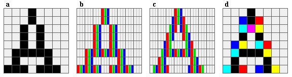
    <br>
    <b>{*@fig:img-subpx}</b>: Subpixel rendering.
    <b>a</b>: &lsquo;A&rsquo; on 8&times;8 grid.
    <b>b</b>: as left, in R,G,B sub-grid.
    <b>c</b>: shifting rows to distribute sub-pixels evenly.
    <b>d</b>: new color distribution in pixels (black/white inverted).
  </div>
</div>

Sub-pixel rendering isn't useful for everything. Because it muddles the concept of pixel and color a little, it's only useful for gray-scale images. This does make it great for text, of course. Secondly, the order in which the sub-pixels are ordered also matters. The process shown in **{@fig:img-subpx}** will work for RGB-ordered screens, but would fail quite spectacularly when the pixels are BGR-ordered. Going into all the gritty details it too much to do here, so I'll refer you to [http://www.grc.com/ctwhat.htm](https://www.grc.com/ctwhat.htm), which explains the concept in more detail and gives a few examples too.

<div class="cpt_fr" style="width:128px;">
  
  <br>
  <b>{*@fig:img-yesh}</b>: 4&times;8 subpixel font
</div>

JanoS ([http://www.haluz.org/yesh/](http://www.haluz.org/yesh/)) has created nice 4×8 sub-pixel font for use on GBA and NDS (see {@fig:img-yesh}). A width of 4 is really tiny; it's impossible to have glyphs of that size with normal rendering and still have readable text. With sub-pixel rendering, however, it still looks good and now you can have many more characters on the screen than usual.

The output of the demo can be seen in {@fig:img-test-bmp16}. Because sub-pixel rendering is so closely tied to the hardware you're viewing with, it will probably look crummy on most screens or paper. You really have to see it on a GBA screen for the full effect.

In this particular case, I've converted the font to work with `bmp16_drawg()`: a 16bpp font in bitmap layout. Creating an 8-bit version would not be very hard either. A 1-bpp bitpacked font would of course be impossible because the font has more than two colors. To make sub-pixel fonts look right, you'll actually need a lot of colors: one for each combination of R,G,B, and with difference shades of each. That said, JanoS has managed to reduce the amount of colors to 20 here without too much loss in quality. If anyone wants it, I also have a 15-color version to use with 4bpp fonts.

```c {#cd-tte-test-bmp16 .proglist}
//! Testing a bitmap renderer with JanoS' sub-pixel font.
void test_tte_bmp16()
{
    irq_init(NULL);
    irq_add(II_VBLANK, NULL);
    REG_DISPCNT= DCNT_MODE3 | DCNT_BG2;

    tte_init_bmp(3, &yesh1Font, bmp16_drawg);
    tte_init_con();

    const char *str=
    "https://en.wikipedia.org/wiki/Subpixel_rendering :\n"
    "Subpixel rendering is a way to increase the "
    "apparent \nresolution of a computer's liquid crystal "
    "display (LCD).\nIt takes advantage of the fact that "
    "each pixel on a color\nLCD is actually composed of "
    "individual red, green, and\nblue subpixel stripes to "
    "anti-alias text with greater\ndetail.\n\n"
    "  4x8 sub-pixel font by JanoS.\n"
    "  http://www.haluz.org/yesh/\n";

    tte_write(str);
    key_wait_till_hit(KEY_ANY);
}
```

<div class="lblock">
  <div class="cpt" style="width:240px;">
    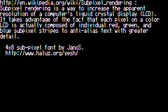
    <br>
    <b>{*@fig:img-test-bmp16}</b>: Sub-pixel rendering demo
  </div>
</div>

## Object text {#sec-obj}

Object text is useful if you want the characters to move around a bit, or if you simply don't have any room on a background. There are a few possibilities for object text. The most obvious one is to load all the characters into object VRAM and set the tile-indices of the objects to use the right tiles. This is what the TTE object system uses.

In many ways, this kind of object text is similar to tilemap text. The tiles are loaded up front and you change the relevant mapping entries (in this case `attr2` of the objects) to the right number. Of course, there are some notable differences as well.

For one thing, the positions of the characters must be written to the objects. But not only that, the objects also need to know how big they're supposed to be, and whether they have any other interesting qualities like rotation and palettes. For that reason, I've chosen to use the color attributes 0, 1 and 2 to store the object attributes 0, 1 and 2.

Another problem is which objects to use and how many. This last one could present a big problem, actually, because you may also want to use objects for normal sprites and it would be a really bad idea if they were suddenly overridden by the text system.

For the latter issue, I use (or perhaps abuse) the `dst` member of the context. Each glyph is represented by an object, so I'll need an object array, but I'm doing it with a little twist. I'm going to start at the _end_ of the array, so that the lower objects can still be used for sprites as normal. Essentially, I'm using OAM as an empty-descending stack. In this arrangement, `dst.data` points to the top of the stack (i.e., the last element in the array), `dst.pitch` is the index to the current object, and `dst.width` is the length of the stack.

The default plotter of objects is `obj_drawg`. Remember, `dst.pitch` is used as an index here and `dst.data` is the top of the stack, so a _negative_ index is used to get the current object. After that, the coordinates and the correct glyph index are merged with the color attributes to create the final object.

```c {#cd-obj-drawg .proglist}
//! Glyph-plotter using objects.
void obj_drawg(uint gid)
{
    TTC *tc= tte_get_context();
    TFont *font= tc->font;
    uint x0= tc->cursorX, y0= tc->cursorY;

    // (1) find the right object, and increment index.
    uint id= tc->dst.pitch;
    OBJ_ATTR *obj= &((OBJ_ATTR*)tc->dst.data)[-id];
    tc->dst.pitch= (id+1 < tc->dst.width ? id+1 : 0);

    // (2) Set object attributes.
    obj->attr0= tc->cattr[0] + (y0 & ATTR0_Y_MASK);
    obj->attr1= tc->cattr[1] + (x0 & ATTR1_X_MASK);
    obj->attr2= tc->cattr[2] + gid*font->cellW*font->cellH/64;
}
```

And, yes, I know that this use of the `dst` member is somewhat … unorthodox; but it wasn't used here anyway so why not. I am considering using something more proper, but not just yet. Also, remember that this system assumes that the font is already loaded into VRAM and that this can take up a _lot_ of the available tiles. Using the verdana 9 font, that'd be 2\*240 = 480 tiles. That's nearly half of object VRAM. A safer alternative would be to load the necessary tiles dynamically, but that would require more resource management.

<div class="note">

<div class="nhcare">

TTE object text is ugly

</div>

The way object text is handled in TTE works, but it the implementation is not exactly pretty. The way I'm using `TTC.dst` here is, well, bad. There is a good chance I'll clean it up a bit later, or at the very least hide the implementation better.

</div>

### Example: letters. Onna path {#ssec-obj-demo}

The defining characteristic of objects is that they're separate from backgrounds; they can move around the screen independently. Object text is most likely used for text that is dynamic or has to travel along some sort of path. In this case, I'll make them fly on a parameterized path called a [Lissajous curve](https://en.wikipedia.org/wiki/Lissajous_curve) (see {@fig:img-test-obj}).

<div class="cpt_fr" style="width:240px;">
  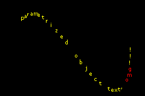
  <br>
  <b>{*@fig:img-test-obj}</b>: Object text on a path.
</div>

The code is given below. After initializing the usual suspects, `tte_init_obj()` is called. The object stack starts at the back of OAM, which is also what the system defaults to if `NULL` passed as the first parameter. The next three are the object attributes. Because I want to use the default variable width font, verdana 9, the attributes should be set to 8×16 objects. The bitdepth of the tiles will always be 4 to keep the number of used tiles within limits. The rest of the initialization should be easy to understand.

Making the string itself is done at step 2. Note that the string also set the paper color attribute (which corresponds to obj.attr2) to 0x1000 to make the “omg” red. After these few lines, the text handling itself is complete.

In step 3, the coordinates on the path are calculated. The `t` parameter indicates the how far along the path we are. It is used to calculate the coordinates of each letter – the first one using `t` itself, and the rest are essentially time-delayed. Don't be distracted by the magic numbers: the only reason for their values is to make the effect look alright. Try tweaking them a little to see what they do exactly.

```c {#cd-test-obj .proglist}
// Object text demo
void test_tte_obj()
{
    // Base inits
    irq_init(NULL);
    irq_add(II_VBLANK, NULL);
    REG_DISPCNT= DCNT_MODE0 | DCNT_OBJ | DCNT_OBJ_1D;
    oam_init(oam_mem, 128);
    VBlankIntrWait();

    // (1) Init object text, using verdana 9 (8x16 objects)
    OBJ_ATTR *objs= &oam_mem[127];
    tte_init_obj(
        objs,               // Start at back of OAM
        ATTR0_TALL,         // attr0: 8x16 objects
        ATTR1_SIZE_8,       // attr1: 8x16 objects
        0,                  // attr2: nothing special
        CLR_YELLOW,         // Yellow ink
        0x0E,               // ink pixel 14+1 = 15
        &vwf_default,          // Verdana 9 font
        NULL);              // Default renderer (obj_drawg)

    pal_obj_bank[1][15]= CLR_RED;

    // (2) Write something (and prep for path)
    const char *str= "Parametrized object text, omg!!!";
    const int len= strlen(str);
    tte_write("Parametrized object text, #{cp:0x1000}omg#{cp:0}!!!");

    // Play with the objects
    int ii, t= 0x9000;
    while(1)
    {
        VBlankIntrWait();
        key_poll();

        // (3) Make lissajous figure
        for(ii=0; ii<len; ii++)
        {
            int ti= t-0x380*ii;             // Get the path param for letter ii
            obj_set_pos(&objs[-ii],
                (96*lu_cos(  ti)>>12)+120,  // y= Ay*cos(  t) + y0
                (64*lu_sin(2*ti)>>12)+80);  // x= Ax*sin(2*t) + x0
        }
        t += 0x00A0;

        if(key_hit(KEY_START))
            break;
    }
}
```

## Rendering to tiles {#sec-chr}

Using tilemaps for text is nice, but will only work if the dimensions of the glyphs are multiples of 8. There are a few drawbacks in terms of readability: narrow characters such as ‘i’ will seem either overly wide, or be surrounded by many empty pixels. Also, you can't put many characters on a line because there are only so many tiles.

Variable-width fonts (<dfn>vwf</dfn>; also known as proportional fonts) solve this problem. Using variable-width fonts on bitmaps is quite easy, as shown in the ["Bitmapped text" section](#sec-bmp).. However, using it in tilemap modes is a little trickier: how do you draw on a tilemap where the tiles are 8×8 in size?

Well, you don't. Not exactly. The key is not to draw to the map, but to the tiles that the map shows.

### Basic tile rendering {#ssec-chr-base}

The usual way to work with tilemaps is that you load up a tileset, and then select the ones you want to show up on the screen by filling the tilemap. In those circumstances, the tileset is often static, with the map being updated for things like scrolling. Rendering to tiles reverses that procedure.

First, you need to set up a map where each entry points to a unique tile. This essentially forms a graphical surface out of the tiles, which you can then draw to like any other. The most obvious way to do this is to simply fill up the screenblock with consecutive numbers (see {@fig:img-chr4-map}a). However, a better way to map the tiles is by mapping tiles in column-major order (see {@fig:img-chr4-map}b) , for the same reason I chose it for the glyph format: the words in a column of tiles are consecutive.

<div class="cblock" id="fig:img-chr4-map">
  <table border=0 cellpadding=4 cellspacing=0 width=70%>
    <tr>
      <td>
        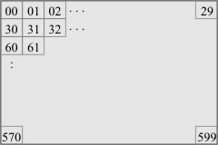
        <b>{*@fig:img-chr4-map}a</b>. Row-major tile indexing.
      </td>
      <td>
        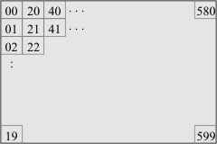
        <b>{*@fig:img-chr4-map}b</b>. Column-major tile indexing.
      </td>
    </tr>
  </table>
</div>

Preparing the map is the easy part; the problem is knowing which part of which tile to edit to plot a pixel. First, you need to split the coordinates into tile coordinates and pixel-in-tile coordinates. This comes down to division and modulo by 8, respectively. Note that in column-major mode you only need to do this for the _x_ coordinate. With this information, you can find the right word. The horizontal in-tile coordinate tells you which nybble in the word to update and at that point it's the usual bitfield insertion.

Tonclib has routines for drawing onto 4bpp, column-major tiles (referred to as <dfn>chr4c</dfn> mode). The plotter and the map preparation functions are given below, along with a demonstration routine to explain their use.

```c {#cd-chr4c-test .proglist}
//# From tonc_schr4c.c

//! Plot a pixel on a 4bpp tiled, column-major surface.
void schr4c_plot(const TSurface *dst, int x, int y, u32 clr)
{
    uint xx= x;     // fluff to make x unsigned.
    u32 *dstD= (u32*)(dst->data + xx/8*dst->pitch);
    uint shift= xx%8*4;

    dstD[y] = (dstD[y] &~ (15<<shift)) | (clr&15)<<shift;
}

//! Prepare a screen-entry map for use with chr4c mode.
void schr4c_prep_map(const TSurface *srf, u16 *map, u16 se0)
{
    uint ix, iy;
    uint mapW= srf->width/8, mapH= srf->height/8, mapP= srf->pitch/32;

    for(iy=0; iy<mapH; iy++)
        for(ix=0; ix<mapW; ix++)
            map[iy*32+ix]= ix*mapP + iy + se0;
}

//# --- Simple test ---------------------------------------------------

void test_chr4()
{
    // (1) The usual
    irq_init(NULL);
    irq_add(II_VBLANK, NULL);
    REG_DISPCNT= DCNT_MODE0 | DCNT_BG0;
    REG_BG0CNT= BG_CBB(0) | BG_SBB(31);

    pal_bg_mem[1]= CLR_RED;
    pal_bg_mem[2]= CLR_GREEN;
    pal_bg_mem[3]= CLR_BLUE;
    pal_bg_mem[4]= CLR_WHITE;

    // (2) Define a surface
    TSurface srf;
    srf_init(&srf,
        SRF_CHR4C,          // Surface type.
        tile_mem[0],        // Destination tiles.
        SCREEN_WIDTH,       // Surface width.
        SCREEN_HEIGHT,      // Surface height.
        4,                  // Bitdepth (ignored due to SRF_CHR4C).
        pal_bg_mem);        // Palette.

    // (3) Prepare the map
    schr4c_prep_map(&srf, se_mem[31], 0);

    // (4) Plot some things
    int ii, ix, iy;
    for(iy=0; iy<20; iy++)
        for(ix=0; ix<20; ix++)
            schr4c_plot(&srf, ix+3, iy+11, 4);

    for(ii=0; ii<20; ii++)
    {
        schr4c_plot(&srf, ii+4,    12, 1);  // Red line
        schr4c_plot(&srf, ii+4, ii+12, 2);  // Green line
        schr4c_plot(&srf,    4, ii+12, 3);  // Blue line
    }
}
```

The pixel plotter starts by finding the tile-column that the desired pixel is in. The column-index is simply _x_/8; this is multiplied by the pitch to get a pointer to the top of the column. Note that pitch is used a little different than usual. Normally, it denotes the number of bytes to the next scanline, but in this case it's used as the byte-offset to next tile-column. For a column-major mode, this comes down to the *height*×*bpp*\*8/8, but all that is done in `srf_init()`. Once you have the right tile, the pixel you want is in the _x_%8<sup>th</sup> nybble, meaning the required shift for the insertion is _x_%8\*4. After that, it's just a matter of inserting the color. <span class="mini">(For the curious: I'm casting _x_ to unsigned int first because division and modulo will then be optimized to shifts/masks properly.)</span>

The `schr4c_prep_map()` function just initializes the map in the order given in {@fig:img-chr4-map}b. Well, almost.I'm also adding a value to each screen-entry like I usually do for palettes and tile-offsets.

The output of `test_chr4()` can be seen in {@fig:img-chr4-test}a. It's a white rectangle with red, green and blue lines, as expected. {\*@fig:img-chr4-test}b is a picture taken from VBA's tile viewer, showing how the contents of the surface. Doesn't quite look what's on the screen, does it? Still, if you look closely, you can figure out how it works. Each set of 20 tiles forms one tile-column on the screen (indicated by yellow blocks). When you place these tiles on top of each other, you'll see the picture of {@fig:img-chr4-test}a emerge.

<div class="cblock">
  <table width=60% id="fig:img-chr4-test">
    <tr valign="top">
      <td>
	      <div class="cpt" style="width:80px;">
	        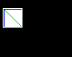
          <br>
	        <b>{*@fig:img-chr4-test}a</b>: chr4_test() output
	      </div>
      </td>
      <td>
	      <div class="cpt" style="width:289px;">
	        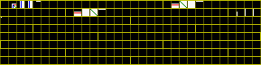
          <br>
	        <b>{*@fig:img-chr4-test}b</b>: chr4_test() tiles. The yellow blocks indicate tiles of a single column.
	      </div>
      </td>
    </tr>
  </table>
</div>

### Text rendering on tiles {#ssec-chr-drawg}

#### Version 1 : pixel by pixel

The easiest way to render glyphs to tiles is to follow the template from the ["Bitmapped text" section](#sec-bmp).. This is done in the function below.

```c {#cd-chr4-drawg-b1cts-a .proglist}
//! Simple version of chr4 renderer.
void chr4_drawg_b1cts_base(uint gid)
{
    TTE_BASE_VARS(tc, font);
    TTE_CHAR_VARS(font, gid, u8, srcD, srcL, charW, charH);
    uint x0= tc->cursorX, y0= tc->cursorY;
    uint srcP= font->cellH;

    u32 ink= tc->cattr[TTE_INK], raw;

    uint ix, iy, iw;
    for(iw=0; iw<charW; iw += 8)
    {
        for(iy=0; iy<charH; iy++)
        {
            raw= srcD[iy];
            for(ix=0; raw>0; raw>>=1, ix++)
                if(raw&1)
                    schr4c_plot(&tc->dst, x0+ix, y0+iy, ink);
        }
        srcD += srcP;
        x0 += 8;
    }
}
```

Now, you may think that this runs pretty slowly thanks to all the recalculations in `schr4c_plot()`. And you'd be right, but in truth, it's not as bad as I originally thought. It is possible to speed it up by simply inlining things, but the real gain comes from drawing pixels in parallel.

#### Version 2 : 8 pixels at once.

Instead of plotting pixel individually, you can also plot multiple pixels simultaneously. The `bmp8_drawg_b1cts()` renderer we saw earlier did this: it unpacked 2 pixels and drew together. In the case of 4bpp tiles, you can unpack the source byte into one (32bit) word and plot _eight_ pixels at once. The only downside is that you'll probably have to split it over two tiles.

The next function is TTE's main glyph renderer for tiles, and it is a doozy. There are two stages for the rendering in the inner loop: bit unpacking the source byte, `raw` and splitting the prepared pixel `px` into two adjacent tiles. These correspond to steps 3 and 4, respectively.

Normally, the bitunpack is done in a loop, but sometimes it's faster to do it in other ways. For details, see my document on [bit tricks](https://www.coranac.com/documents/bittrick/#sec-bup). The first five lines of step 3 do the unpacking. For example, it turns a binary `0001 1011` into a hexadecimal `0x00011011`. This is then multiplied by 15 and `ink` to give the pixel mask `pxmask` and the colored pixels `px`, respectively.

Step 4 distributes the word with the pixels over two tiles if necessary. In step 1, left and right shifts were prepared to supply the bit offsets for this procedure. Now, for larger glyphs this will mean that certain destination words are used twice, but this can't be helped (actually it can, but the procedure is ugly and possibly not worth it). An alternative to this is using the destination once and read (and unpack/color) the source twice; however, as VRAM is considerably faster than ROM I doubt this would be beneficial.

```c {#cd-chr4c-drawg-b1cts .proglist}
//! Render 1bpp fonts to 4bpp tiles; col-major order.
void chr4c_drawg_b1cts(uint gid)
{
    // Base variables.
    TTE_BASE_VARS(tc, font);
    TTE_CHAR_VARS(font, gid, u8, srcD, srcL, charW, charH);
    uint x= tc->cursorX, y= tc->cursorY, dstP= tc->dst.pitch/4;
    uint srcP= font->cellH;

    // (1) Prepare dst pointers and shifts.
    u32 *dstD= (u32*)(tc->dst.data + (y + x/8*dstP)*4), *dstL;
    x %= 8;
    uint lsl= 4*x, lsr= 32-4*x, right= x+charW;

    // Inner loop vars.
    u32 px, pxmask, raw;
    u32 ink= tc->cattr[TTE_INK];
    const u32 mask= 0x01010101;

    uint iy, iw;
    for(iw=0; iw<charW; iw += 8)    // Loop over strips
    {
        // (2) Update and increment main data pointers.
        srcL= srcD;     srcD += srcP;
        dstL= dstD;     dstD += dstP;

        for(iy=0; iy<charH; iy++)   // Loop over scanlines
        {
            raw= *srcL++;
            if(raw)
            {
                // (3) Unpack 8 bits into 8 nybbles and create the mask
                raw |= raw<<12;
                raw |= raw<< 6;
                px   = raw & mask<<1;
                raw &= mask;
                px   = raw | px<<3;

                pxmask= px*15;
                px   *= ink;

                // (4a) Write left tile:
                dstL[0] = (dstL[0] &~ (pxmask<<lsl) ) | (px<<lsl);

                // (4b) Write right tile (if any)
                if(right > 8)
                    dstL[dstP]= (dstL[dstP] &~ (pxmask>>lsr) ) | (px>>lsr);
            }
            dstL++;
        }
    }
}
```

`chr4c_drawg_b1cts()` is pretty fast. It certainly is faster than the earlier version by about 33%. It's actually even faster than the bmp8 renderer, but only by a slim margin.

Of course, you can always go one better. The various shifts and conditionals make it perfect for ARM code, rather than Thumb. And to make sure it goes exactly according to plan, I'm doing this in assembly.

#### Version 3: ARM asm

The next function is `chr4_drawg_b1cts_fast()`, the ARM assembly equivalent of version 2. There's an almost one-to-one correspondence between the C and asm loops, so just loop to the C version for the explanation.

Speed-wise, the asm version is _much_ better than the C version. Even in ROM, which is _very_ bad for ARM code, it is still faster than the Thumb version. There are one or two tiny details by which you can speed this thing up, but by and large this should be it for fonts of arbitrary dimensions. Of course, if you have fixed sizes for your font and do not require recoloring or transparency, things will be a little different.

```armasm {#cd-chr4c-drawg-b1cts-fast .proglist}
// Include TTC/TFont member offsets plz.
#include "tte_types.s"

/*
IWRAM_CODE void chr4c_drawg_b1cts_fast(int gid);
*/
    .section .iwram, "ax", %progbits
    .arm
    .align
    .global chr4c_drawg_b1cts_fast
chr4c_drawg_b1cts_fast:
    stmfd   sp!, {r4-r11, lr}

    ldr     r5,=gp_tte_context
    ldr     r5, [r5]

    @ Preload dstBase (r4), dstPitch (ip), yx (r6), font (r7)
    ldmia   r5, {r4, ip}
    add     r3, r5, #TTC_cursorX
    ldmia   r3, {r6, r7}

    @ Get srcD (r1), width (r11), charH (r2)
    ldmia   r7, {r1, r3}            @ Load data, widths
    cmp     r3, #0
    ldrneb  r11, [r3, r0]           @ Var charW
    ldreqb  r11, [r7, #TF_charW]    @ Fixed charW
    ldrh    r3, [r7, #TF_cellS]
    mla     r1, r3, r0, r1          @ srcL
    ldrb    r2, [r7, #TF_charH]     @ charH
    ldrb    r10, [r7, #TF_cellH]    @ cellH

    @ Positional issues: dstD(r0), lsl(r8), lsr(r9), right(lr), cursorX
    mov     r3, r6, lsr #16         @ y
    bic     r6, r6, r3, lsl #16     @ x

    add     r0, r4, r3, lsl #2      @ dstD= dstBase + y*4
    mov     r3, r6, lsr #3
    mla     r0, ip, r3, r0

    and     r6, r6, #7              @ x%7
    add     lr, r11, r6             @ right= width + x%8
    mov     r8, r6, lsl #2          @ lsl = x%8*4
    rsb     r9, r8, #32             @ lsr = 32-x%8*4

    ldr     r6,=0x01010101
    ldrh    r7, [r5, #TTC_ink]

    @ --- Reg-list for strip/render loop ---
    @ r0    dstL
    @ r1    srcL
    @ r2    scanline looper
    @ r3    raw
    @ r4    px / tmp
    @ r5    pxmask
    @ r6    bitmask
    @ r7    ink
    @ r8    left shift
    @ r9    right shift
    @ r10   dstD
    @ r11   charW
    @ ip    dstP
    @ lr    split indicator (right edge)
    @ sp00  charH
    @ sp04  deltaS = cellH-charH     (delta srcL)

    cmp     r11, #8
    @ Prep for single-strip render
    suble   sp, sp, #8
    ble     .Lyloop
    @ Prep for multi-strip render
    sub     r3, r10, r2
    mov     r10, r0
    stmfd   sp!, {r2, r3}           @ Store charH, deltaS
    b       .Lyloop

    @ --- Strip loop ---
.Lsloop:
        @ (2) Update and increment main data pointers.
        ldmia   sp, {r2, r3}        @ Reload charH and deltaS
        add     r10, r10, ip        @ (Re)set dstD/dstL
        mov     r0, r10
        add     r1, r1, r3
        sub     lr, lr, #8

        @ --- Render loop ---
.Lyloop:
            @ (3) Prep px and pxmask
            ldrb    r3, [r1], #1
            orrs    r3, r3, r3, lsl #12
            beq     .Lnopx              @ Skip if no pixels
            orr     r3, r3, r3, lsl #6
            and     r4, r3, r6, lsl #1
            and     r3, r3, r6
            orr     r3, r3, r4, lsl #3

            rsb     r5, r3, r3, lsl #4
            mul     r4, r3, r7

            @ (4a) Render to left tile
            ldr     r3, [r0]
            bic     r3, r3, r5, lsl r8
            orr     r3, r3, r4, lsl r8
            str     r3, [r0]

            @ (4b) Render to right tile
            cmp     lr, #8
            ldrgt   r3, [r0, ip]
            bicgt   r3, r3, r5, lsr r9
            orrgt   r3, r3, r4, lsr r9
            strgt   r3, [r0, ip]
.Lnopx:
            add     r0, r0, #4
            subs    r2, r2, #1
            bne     .Lyloop

        @ Test for strip loop
        subs    r11, r11, #8
        bgt     .Lsloop

    add     sp, sp, #8
    ldmfd   sp!, {r4-r11, lr}
    bx      lr

@ EOF
```

### Multi-color and shaded fonts. {#ssec-chr4-drawg-b4}

Bitpacked fonts will give you monochrome glyphs. If you want more colors – for shading or anti-aliasing – you'll need to use more bits. The code for this is nearly identical to the 1bpp bitpacked version; the most important differences being a different source datatype and an alternative method for finding the right mask. Oh, and you won't have to unpack the bits anymore, of course.

The following snippet shows how you can make a transparency mask out of a word of 4bit pixels. Essentially, you mask all the bits of a nybble together and mask out the other bits of that nybble. This gives 0 if the whole nybble was empty, or 1 is it wasn't. This can then again be multiplied by 15 to give the proper mask.

```c {.proglist}
// Create pixel mask from 8x 4 bits
u32 *srcL= ...;         // Source is now 32bit.

raw     = *srcL++;      // Source word: 8x 4 bits
pxmask  = raw;
pxmask |= pxmask>>2;    // bit0 = bit0 | bit2
pxmask |= pxmask>>1;    // bit0 = bit0 | bit1 | bit2 | bit3;
pxmask &= 0x11111111;   // bit0 is 0 only if bits 0-3 were all 0
pxmask *= 15;
```

<div class="cpt_fr" style="width:128px;">
  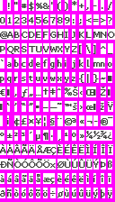
  <br>
  <b>{*@fig:img-verdana9-b4}</b>: Verdana 9, with shade.
</div>

#### Shaded characters

No, not shad*y* characters; shad*ed* characters. What you'll often see in games is that the text has either an outline or a bit of shading on one side. While it is possible to create shading with a 1bpp font, it's easier to simply build it into the font itself (see {@fig:img-verdana9-b4}). Because this means more colors than 1bpp can handle, you may be tempted to use a 2bpp font here. However, unless you are _really_ stressed for memory, it's more convenient to use 4bpp here as well.

At that point, you can follow the procedure described earlier. But by cleverly using the bits that make up the shading, you can allow the shadow color to be variable as well. For example, you can designate bit 0 as the 'ink' bit, bit 1 as the 'shadow' bit and if necessary bit 2 as the 'paper' bit. Then `raw&0x11111111` gives the 'ink' mask, and `(raw>>1)&0x11111111` gives the 'shadow' mask; these can then be used to apply colors and to create the full mask. The following is a demonstration of how this can be done. Note that each line here corresponds exactly to one ARM instruction, so this should be an efficient method. Well, in ARM code anyway.

```c {.proglist}
// Use bits 0 and 1 from each nybble to create masks and apply colors.
u32 *srcL= ...;

raw     = *srcL++;              // Source word: 8x 4 bits
px      = raw    & 0x11111111;  // Bit 0 for ink pixels
raw     = raw>>1 & 0x11111111;  // Bit 1 for shadow pixels
pxmask  = px | raw;             // Mask of ink and shadow bits
pxmask *= 15;

px      = px * ink;             // Color with ink
px     += raw* shadow;          // Add shadow pixels
```

The `chr4c_drawg_b4cts()` renderer uses this method to color both the ink and shadow pixels. It's essentially `chr4c_drawg_b4cts()` except for the things in bold and the removal of the bit unpacking. Also note the ‘no-pixel’ condition here. If `pxmask` is zero, there's nothing to do; and so we won't.

```c {.proglist}
//! 4bpp font, tilestrips with ink/shadow coloring.
void chr4c_drawg_b4cts(uint gid)
{
    TTE_BASE_VARS(tc, font);
    TTE_CHAR_VARS(font, gid, u32, srcD, srcL, charW, charH);
    uint x= tc->cursorX, y= tc->cursorY;
    uint srcP= font->cellH, dstP= tc->dst.pitch/4;

    // (1) Prepare dst pointers and shifts.
    u32 *dstD= (u32*)(tc->dst.data + (y+x/8*dstP)*4), *dstL;
    x %= 8;
    uint lsl= 4*x, lsr= 32-4*x, right= x+charW;

    // Inner loop vars
    u32 amask= 0x11111111;
    u32 px, pxmask, raw;
    u32 ink=   tc->cattr[TTE_INK];
    u32 shade= tc->cattr[TTE_SHADOW];

    uint iy, iw;
    for(iw=0; iw<charW; iw += 8)    // Loop over strips
    {
        srcL= srcD;     srcD += srcP;
        dstL= dstD;     dstD += dstP;

        for(iy=0; iy<charH; iy++)   // Loop over scanlines
        {
            raw= *srcL++;

            // (3a) Prepare pixel mask
            px    = (raw    & amask);
            raw   = (raw>>1 & amask);
            pxmask= px | raw;
            if(pxmask)
            {
                px *= ink;          // (3b) Color ink pixels
                px += raw*shade;    // (3c) Color shadow pixels
                pxmask *= 15;       // (3d) Create mask

                // (4a) Write left tile:
                dstL[0] = (dstL[0] &~ (pxmask<<lsl) ) | (px<<lsl);

                // (4b) Write right tile (if any)
                if(right > 8)
                    dstL[dstP]= (dstL[dstP] &~ (pxmask>>lsr) ) | (px>>lsr);
            }
            dstL++;
        }
    }
}
```

### Tips for fast tile rendering {#ssec-chr4-tips}

I've done a fair bit of profiling for these tile renderers and think I have a decent knowledge of which techniques will be efficient and which won't. These are some of my observations.

- **Profile**. Before conjuring up tricky routines, make sure the original simple version warrants optimizing _and_ that the clever routine is actually faster.
- **Render transparently**. Now, you'd think that this would be slower, but it may not be. The thing about transparent text is that there are much less foreground pixels then there are background pixels, so the number of pixels to render is lower as well.
- **Don't buffer**. My first trials had separate stages for unpacking/coloring and inserting into VRAM. It put the prepared pixels into an IWRAM buffer, then copied that to VRAM. If I recall correctly, combining the loops and tossing the buffer saved me 30%.
- **Parallelize**. The road to getting the right data is long. It helps if you don't have to travel it that much. That said, if you have many empty pixels, drawing 8 of them at once may be a waste of effort. This will depend on the font.
- **ARM code is teh r0xx0rz**. There are lots of shifts, masks and quantities in these routines. This makes them particularly apt for ARM code instead of Thumb. In fact, even in ROM with its 16-bit bus, the ARM versions beat out the Thumb-compiled ones. Having said that …
- **Do not let GCC use constant masks in ARM**. There is an unfortunate bug in the ARM optimizer concerning ANDing literals (like 0x11111111). Instead of emitting a simple `ldr`+`and` pair, it will get clever and avoid the load by splitting the mask out over multiple byte-size masks. So instead of one instruction in the inner-loop, you now have four. Perhaps even more, depending on how many extra registers this takes. Note, this _only_ happens for constants and only for ARM-compiled code. A work-around is to have the mask in a global variable to be loaded before the loops. This is in part why I've hand-assembled some of the routines.
- **Code for special case if you can**. If you only have one font and don't require things like coloring, you can code for that case only and potentially save much time. Using constants for source and destination dimensions instead of using the ones in memory will also help a little.
- **Use column-major accessing**. The routines presented above require extra code to move from one tile-row to another. If you use the tiles in a column-major layout, you won't have to do this.

Please apply the standard disclaimer to this list. I've found these techniques to work for my cases, but they won't apply to every case. For example, other systems (\*cough\* NDS) will have different CPU architectures and memory characteristics, and that would affect the speed.

### Colored text on a dialog window. {#ssec-chr4-demo}

<div class="cpt_fr" style="width:240px;">
  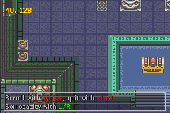
  <br>
  <b>{*@fig:img-test-chr4}</b>: Text on tiles.
</div>

The situation depicted in {@fig:img-test-chr4} should be familiar. The key point here is that there is a background map, and a dialog box with text in it. This text is static, but the position in the top-left corner is continually updated as you scroll along the map.

The core function for this demo is `test_tte_chr4()`. The first thing it does is call `tte_init_chr4c()` to initialize the text system for chr4c-mode. The third argument is the offset for map-entries: `0xF000` meaning it uses sub-palette 15. The fourth is a word for the color attributes: 13 for the ink, 15 for the shadow and 0 for the others. For this demonstration, I'm using the 4bpp version of verdana9 (see {@fig:img-verdana9-b4}) and the fast assembly version to render the glyphs.

Step 2 loads the background map and the dialog box. Note that the dialog box is copied to the tiles that the text is rendered to. When the text is printed, this will show that the glyphs indeed are rendered transparently. This does more or less mean that I can't use the standard eraser, because that'd wipe the box as well.

The dialog text is drawn in step 3. The `ci` and `cs` tags set the ink and shadow color attributes, respectively. This makes the string “arrows” use colors 1 and 2 (well, 0xF1 and 0xF2), and so forth.

```c {.proglist}
//! Set up a rectangle for text, with the non-text layers darkened for contrast.
void win_textbox(uint bgnr, int left, int top, int right, int bottom, uint bldy)
{
    REG_WIN0H= left<<8 | right;
    REG_WIN0V=  top<<8 | bottom;
    REG_WIN0CNT= WIN_ALL | WIN_BLD;
    REG_WINOUTCNT= WIN_ALL;

    REG_BLDCNT= (BLD_ALL&~BIT(bgnr)) | BLD_BLACK;
    REG_BLDY= bldy;

    REG_DISPCNT |= DCNT_WIN0;

    tte_set_margins(left, top, right, bottom);
}

//! Test chr4 shaded text renderer
void test_tte_chr4()
{
    irq_init(NULL);
    irq_add(II_VBLANK, NULL);
    REG_DISPCNT= DCNT_MODE0 | DCNT_BG0 | DCNT_BG2;

    // (1) Init for text
    tte_init_chr4c(
        0,                              // BG number.
        BG_CBB(0)|BG_SBB(10),           // BG control.
        0xF000,                         // Screen-entry base
        bytes2word(13,15,0,0),          // Color attributes.
        CLR_BLACK,                      // Ink color
        &verdana9_b4Font,               // Verdana 9, with shade.
        (fnDrawg)chr4c_drawg_b4cts_fast);    // b4cts renderer, asm version
    tte_init_con();                     // Initialize console I/O

    // (2) Load graphics
    LZ77UnCompVram(dungeon01Map, se_mem[12]);
    LZ77UnCompVram(dungeon01Tiles, tile_mem[2]);
    LZ77UnCompVram(dungeon01Pal, pal_bg_mem);

    GRIT_CPY(&tile_mem[0][16*30], dlgboxTiles);
    GRIT_CPY(pal_bg_bank[15], dlgboxPal);

    // (3) Create and print to a text box.
    win_textbox(0, 8, 160-32+4, 232, 160-4, 8);
    CSTR text=
        "#{P}Scroll with #{ci:1;cs:2}arrows#{ci:13;cs:15}, "
        "quit with #{ci:1;cs:2}start#{ci:13;cs:15}\n"
        "Box opacity with #{ci:3;cs:4}L/R#{ci:7;cs:9}";
    tte_write(text);

    // Reset margins for coord-printing
    tte_set_margins(8, 8, 232, 20);

    int x=128, y= 32, ey=8<<3;

    REG_BG2HOFS= x;
    REG_BG2VOFS= y;

    // Invisible map buildup!
    REG_BG2CNT= BG_CBB(2) | BG_SBB(12) | BG_REG_64x64;
    REG_DISPCNT= DCNT_MODE0 | DCNT_BG0 | DCNT_BG2 | DCNT_WIN0;

    while(1)
    {
        VBlankIntrWait();
        key_poll();

        // (4) Scroll and blend
        x = clamp(x + key_tri_horz(), 0, 512+1-SCREEN_WIDTH);
        y = clamp(y + key_tri_vert(), 0, 512+1-SCREEN_HEIGHT);
        ey= clamp(ey+ key_tri_shoulder(), 0, 0x81);

        REG_BG2HOFS= x;
        REG_BG2VOFS= y;
        REG_BLDY= ey>>3;

        // (5) Erase and print new position.
        tte_printf("#{es;P}%d, %d", x, y);

        if(key_hit(KEY_START))
            break;
    }
}
```

I'll close off this section with a word on the text box. If you look carefully, you'll see that it's semi-transparent. Or, to be precise, the text and the box itself are at normal intensity, but the background that it covers is darker than usual. Two things are necessary for this nice, little effect.

- An inside and outside window must be defined. Both windows should contain all layers, but the inner window must be set to use blending (WIN_BLD). This enables blending for the inside only.
- The blending mode should be set to fade-to-black (BLD_BLACK) for all layers except the background with the text box.

This is what `win_textbox()` is for. The function also sets the margins so that the text would wrap nicely inside the box.

## Scripting, console IO and other niceties {#sec-misc}

### TTE formatting commands {#ssec-misc-tags}

The TTE context contains members that control positioning, colors, fonts as well as a few other things. There are two approaches to changing these parameters. The first is to hard code changes in the state through direct member access or functions like `tte_set_ink()`. This works nice and fast, but isn't very flexible. The second is to use <dfn>formatting tags</dfn> in the strings themselves – the system parses the string for these tags and interprets them accordingly. This is basically a form of scripting.

The tags that TTE uses look like this:

```
#{`_`tag0`_`:`_`args`_`; `_`tag1`_`:`_`args`_`}
```

The code itself is starts with \``#{`' and ends with \``}`'. Each command consists of a tag, followed by a colon and comma-separated arguments when appropriate. Multiple commands can be separated by a semi-colon. For example, \``#{es; P:10,16}`' would clear the screen and set the cursor to (10, 16).

Now, I could show you how to parse this, but the parser currently in use for this is, well, let's just say it's long and very ugly. Essentially, it's a massive switch-block (sometimes a _double_ switch-block) with stuff like this:

```c {#cd-tte-cmd-default .proglist}
char *tte_cmd_default(const char *str)
{
    int ch, val;
    char *curr= (char*)str, *next;

    TTC *tc= tte_get_context();

    while(1)
    {
        ch= *curr;
        next= curr+1;

        // (1) Check first character
        switch(ch)
        {
        // (2) --- Absolute Positions ---
        case 'X':
            tc->cursorX= curr[1]==':'           // If there's an argument ...
                ? strtol(curr+2, &next, 0)     // set cursor X to arg
                : tc->marginLeft;               // else move to start of line.
            break;

        ... more cases ...

        // (3) Find EOS/EOC/token and act on it
        curr= tte_cmd_next(next);

        if(curr[0] == '\0')
            return curr;
        else if(curr[0] == '}')
            return curr+1;
    }
}
```

Like I said, ugly; but it'll have to do for now. The incoming pointer points to the first character past the '`#{`'. The command tags are all single or double-lettered; the switch looks for a recognized letter and acts accordingly.

One of the tags is '`X`', which sets the absolute X-coordinate of the cursor. The `tc->cursorX` will be set to the argument if it is present, or to the left margin if it is not. Note the use of [`strtol()`](https://en.cppreference.com/w/c/string/byte/strtol) here. This is a very interesting function. Not only does it work for both decimal and hex strings, but through the second argument you can retrieve a pointer to right after the number in the string. Alternatives would be `sscanf()` or `atoi()`, but `strtol()` is nicer.

After handling a tag, it'll look for more tags, or exit if the end delimiter or end of string is found.

{\*@tbl:tte-cmd} shows the available tags. Note that they are case-sensitive and some items can do more than one thing, depending on the number of parameters.

<div class="cblock">
  <table id="tbl:tte-cmd" border=1 cellpadding=2 cellspacing=0 width= 70%>
    <caption align="bottom">
      <b>{*@tbl:tte-cmd}</b>: Available TTE formatting tags.
    </caption>
    <tr>
      <th>Code</th>
      <th>Description</th>
    </tr>
    <tr>
      <td>P </td>
      <td>Reset position to top-left margin. </td>
    </tr>
    <tr>
      <td>Pr </td>
      <td>Restore cursor position (see also <code>Ps</code>). </td>
    </tr>
    <tr>
      <td>Ps </td>
      <td>Save cursor position. </td>
    </tr>
    <tr>
      <td>P: <i>x</i>,<i>y</i> </td>
      <td>Set cursor to coordinates (<i>x</i>,&nbsp;<i>y</i>). </td>
    </tr>
    <tr>
      <td>X </td>
      <td>Reset <code>cursorX</code> to left margin.</td>
    </tr>
    <tr>
      <td>X: <i>x</i> </td>
      <td>Set <code>cursorX</code> to <i>x</i>. </td>
    </tr>
    <tr>
      <td>Y </td>
      <td>Reset <code>cursorY</code> to top margin. </td>
    </tr>
    <tr>
      <td>Y: <i>y</i> </td>
      <td>Set <code>cursorY</code> to <i>y</i>. </td>
    </tr>
    <tr>
      <td>c[ispx]:&nbsp;<i>cattr</i> </td>
      <td>
        Set ink (<code>ci</code>), shadow (<code>cs</code>), paper (<code>cp</code>) or special (<code>cx</code>) color attribute to <i>cattr</i>.
      </td>
    </tr>
    <tr>
      <td>e[slbf] </td>
      <td>
        Erase the screen between margins (<code>es</code>), the current line (<code>el</code>), the current line up to the cursor (<code>eb</code>; backwards), the current line from the cursor (<code>ef</code>; forwards).
      </td>
    </tr>
    <tr>
      <td>er: <i>l</i>,<i>t</i>,<i>r</i>,<i>b</i> </td>
      <td>Erase a rectangle given by (<i>l</i>,<i>t</i>) to (<i>r</i>,<i>b</i>). </td>
    </tr>
    <tr>
      <td>f: <i>idx</i> </td>
      <td>Set <code>font</code> to <code>TTC.fontTable[<i>idx</i>]</code>. </td>
    </tr>
    <tr>
      <td>m[ltrb]:&nbsp;<i>value</i> </td>
      <td>
          Set left (<code>ml</code>), top (<code>mt</code>),right (<code>mr</code>) or bottom (<code>mb</code>) margin to <i>value</i>. 
      </td>
    </tr>
    <tr>
      <td>m: <i>l</i>,<i>t</i>,<i>r</i>,<i>b</i> </td>
      <td>Set margins to rectangle (<i>l</i>,<i>t</i>) - (<i>r</i>,<i>b</i>) </td>
    </tr>
    <tr>
      <td>p: <i>dx</i>, <i>dy</i> </td>
      <td>Move the cursor by (<i>dx</i>, <i>dy</i>). </td>
    </tr>
    <tr>
      <td>s: <i>idx</i> </td>
      <td>Print the <i>idx</i>'th string in <code>TTC.stringTable</code>. </td>
    </tr>
    <tr>
      <td>w: <i>count</i> </td>
      <td>Wait for <i>count</i> frames. </td>
    </tr>
    <tr>
      <td>x: <i>dx</i> </td>
      <td>Move the cursor to the right by <i>dx</i>. </td>
    </tr>
    <tr>
      <td>y: <i>dy</i> </td>
      <td>Move the cursor down by <i>dy</i>. </td>
    </tr>
  </table>
</div>

I should point out that at present the commands are still fragile, so be careful with this stuff. For example, the positioning commands will simply move the cursor, but not clip to the margins. Also take care with the font and string commands (`f` and `s`, respectively). `tte_cmd_default()` doesn't test whether the index is out of the bounds of the arrays, so you could end up with … odd things. At some point, I hope to fix these things, but it's not a priority right now. If anyone has something more robust that I can use, please speak up.

<div id="nt-tte-cmd" class="note">

<div class="nhcare">

TTE formatting commands : caveat emptor.

</div>

The current commands in TTE aren't exactly idiot-proof yet. If you stick to sensible things, it should work quite nicely. But it is still easy to shoot yourself in the foot if you're not careful.

</div>

### Using console I/O {#ssec-misc-conio}

Something like `tte_write()` is nice for pure strings, but what would really help is if you had something like `printf()`. In the old days (pre-2006), `printf()`, `putc` and other console output functions were unavailable, but Wintermute added a mechanism to devkitArm's standard C library that allows it on consoles as well.

The key to this is the `devoptab_t` struct, defined in `sys/iosupport.h`. This contains a table of function pointers to device operations. The pointer we're interested in here is `write_r`; this is the function that `printf()` et al. call for the final output.

```c {.proglist}
// Partial devoptab_t definition
typedef struct {
    const char *name;
    int structSize;
    int (*open_r)(struct _reent *r, void *fileStruct, const char *path,
        int flags,int mode);
    int (*close_r)(struct _reent *r,int fd);
    int (*write_r)(struct _reent *r,int fd,const char *ptr,int len);
    ...
} devoptab_t;
```

The key to making the standard console routines work on a GBA is to redirect the default `write_r` for console output to one of our own making. Before explaining how this works, I want you to understand that this comes very close to black magic. It involves descending to the roots of the library and there is next to no documentation about how this stuff works. This story is the closest thing I could find to a full description: [Embedding GNU: Newlib, Part 2](https://web.archive.org/web/20100209210107/https://www.embedded.com/story/OEG20020103S0073), but this isn't high on explanations either.

To put it in other way: you're in a cave; it's pitch black and there are [grues](<https://en.wikipedia.org/wiki/Grue_(monster)>) about.

Now that that's done, let's continue. The first step is creating our replacement writer. In TTE's case, this is `tte_con_write()`. It is almost identical to `tte_write()`, but has to fit in the format given by `devoptab_t.write_r`. It comes down to this:

```c {#cd-tte-con-write .proglist}
//! internal output routine used by printf.
/*! \param r    Reentrancy parameter.
    \param fd   File handle (?).
    \param text Text buffer containing the string prepared by printf.
    \param len  Length of string.
    \return     Number of output bytes (?)
    \note       \a text is NOT zero-terminated!!!!one!
*/
int tte_con_write(struct _reent *r, int fd, const char *text, int len)
{
    // (1) Safety checks
    if(!sConInitialized || !text || len<=0)
        return -1;

    int ch, gid, charW;
    const char *str= text, *end= text+len;

    // (2) check for end of text
    while( (ch= *str) != 0 && str < end)
    {
        str++;
        switch(ch)
        {

        // (3) --- VT100 sequence ( ESC[foo; ) ---
        case 0x1B:
            if(str[0] == '[')
                str += tte_cmd_vt100(str);
            break;

        //# (4) Other character cases. See tte_write()
        }
    }

    return str - text;
}
```

While I've added documentation for the arguments here, it's mostly based on guesswork. The `r` parameter contains [re-entrancy](https://en.wikipedia.org/wiki/Reentrancy_(computing)) information, useful if you have multiple threads. Since the GBA is a single-thread system, this should not concern us. I believe `fd` is a file handle of some sort, but since we're not writing to files this again does not concern us.

The real arguments of interest are `text` and `len`. The `text` argument points to the buffer with the string to render. In the case of `printf()`, it's the string _after_ formatting: all codes like `%d` are already done. And now for the most important part: `text` is **not** null-terminated. This is why there's a length variable as well.

As far as I can tell, `printf` uses a large buffer (approximately 1300 bytes) on the stack to which it writes the formatted numbers. This buffer isn't cleared you call it again, or terminated by ‘\\0’ when sent to the writer. This has the following consequences:

- 1300 bytes is a fair bit of IWRAM. Make sure you have enough room for it. Do _not_ call `printf()` from interrupts, as the routine is slow and the things can start to nest and clobber everything.
- Don't forget the `len` parameter. As the buffer isn't zeroed, remnants of old data may still be there, and you get crap.
- There's an additional potential danger with respect to parsing of formatting commands here. When strings exceed the buffer length, I imagine that it's broken up into smaller chunks. I don't know what will happen if the break occurs in the middle of a command, but I doubt it's good. Of course, you shouldn't have strings that long anyway, as the screen isn't big enough to fit them.

Aside from that, `tte_con_write()` is straightforward. As said, the contents of the loop are nearly identical to the one in `tte_write()`. The only real difference is point 3. This is a test for VT100 formatting strings, which will be covered in the next subsection.

To make use of the new writer, you have to hook it into the device list somehow. First, create a `devoptab_t` instance which the writer in the right place. There is a list of device operations called `devoptab_list`. The devices of interest are the streams `stdout` and `stderr`, which are entries `STD_OUT` and `STD_ERR` in the list. Simply point these entries to your own struct.

A second item is to set the buffers for these streams. I'm not sure this is really necessary, but that's how it's done in libgba and its author knows this system best so I'm not going to argue here. The function for this is `setvbuf()`. You find the required initialization steps below.

```c {#cd-tte-init-con .proglist}

static int sConInitialized= 0;

const devoptab_t tte_dotab_stdout=
{
    "ttecon",
    0,
    NULL,
    NULL,
    tte_con_write,
    NULL,
    NULL,
    NULL
};

//! Init stdio capabilities for TTE.
void tte_init_con()
{
    // attach our operations to stdout and stderr.
    devoptab_list[STD_OUT] = &tte_dotab_stdout;
    devoptab_list[STD_ERR] = &tte_dotab_stdout;

    // Set buffers.
    setvbuf(stderr, NULL , _IONBF, 0);
    setvbuf(stdout, NULL , _IONBF, 0);

    sConInitialized = 1;
}
```

Calling `tte_init_con()` activates stdio's functionality so you can use `printf()` and such. Note that the raw `printf()` is rather heavy and it also has floating point options, which are rarely used in a GBA environment, if ever. For that reason, you'll usually use its integer-only cousin, `iprintf()`. Also note that TTE's implementation is **different** from libgba's, and the two should not be confused. For that reason, I've hidden the `iprintf()` name behind a `tte_printf` macro.

The following is a short example of its use. I'm using `tte_printf()` here, but `printf()` or `iprintf()` would have worked just as well.

```c {#cd-hello .proglist}
#include <stdio.h>
#include <tonc.h>

int main()
{
    REG_DISPCNT= DCNT_MODE0 | DCNT_BG0;

    // Init BG 0 for text on screen entries.
    tte_init_se_default(0, BG_CBB(0)|BG_SBB(31));

    // Enable TTE's console functionality
    tte_init_con();

    tte_printf("#{P:72,64}");        // Goto (72, 64).
    tte_printf("Hello World!");      // Print "Hello world!"

    while(1);

    return 0;
}
```

<div id="nt-printf" class="note">

<div class="nhcare">

Printf bagage

</div>

As wonderful as `printf()` is, there are some downsides to it too. First, it's a very heavy function that calls quite a large amount of functions which all have to be linked in. Second, it is pretty damn slow. Because it can do so much, it has to check for all these different cases. Also, for the string to decimal conversion it uses divisions, which is really bad for the GBA.

Be aware of how much `printf()` costs. If it turns out to be a bottle-neck, try making your own slimmed down version. A decent `sprintf()` alternative is `posprintf()`, created by [Dan Posluns](https://www.danposluns.com/gbadev/).

</div>

### VT100 escape sequences {#ssec-misc-vt100}

Every book on C will tell you that you can place text on a console screen. What they usually don't tell you is that, in some environments, you can control formatting as well. One such environment is the [VT100](https://en.wikipedia.org/wiki/VT100), which used <dfn>escape sequences</dfn> to indicate formatting. The libraries that devkitPro distributes for various systems use these sequences, so it's a good idea to support them as well.

The general format for the codes is this:

```
CSI n1;n2 ... letter
```

_CSI_ here is the ASCII code for the <dfn>command sequence indicator</dfn>, which in this case is the escape character (27, 0x1B or 033) followed by '\['. The letter at the end denotes the kind of formatting code, and _n1_, _n2_ … are the formatting parameters. Wikipedia has a nice overview of the standard set [here](https://en.wikipedia.org/wiki/ANSI_escape_code) and there's another one here: [VT100 commands and control sequences](https://web.archive.org/web/20080813073220/http://local.wasp.uwa.edu.au/~pbourke/dataformats/vt100/). Note that not all of the codes are supported in the devkitPro libraries. The ones you'll encounter most are the following:

<div class="lblock">
  <table id="tbl:vt100" border=1 cellpadding=2 cellspacing=0>
    <caption align="bottom">
      <b>{*@tbl:vt100}</b>: Common VT100 sequences
    </caption>
    <tr>
      <td>ESC[<i>dy</i>A</td>
      <td>Move cursor up <i>dy</i> rows.</td>
    </tr>
    <tr>
      <td>ESC[<i>dy</i>B</td>
      <td>Move cursor down <i>dy</i> rows.</td>
    </tr>
    <tr>
      <td>ESC[<i>dx</i>C</td>
      <td>Move cursor right <i>dx</i> columns.</td>
    </tr>
    <tr>
      <td>ESC[<i>dx</i>D</td>
      <td>Move cursor left <i>dx</i> columns.</td>
    </tr>
    <tr>
      <td>ESC[<i>y</i>;<i>x</i>H</td>
      <td>Set cursor to column <i>x</i>, row <i>y</i>.</td>
    </tr>
    <tr>
      <td>ESC[2J</td>
      <td>Erase screen.</td>
    </tr>
    <tr>
      <td>ESC[<i>n</i>K</td>
      <td>
        <ol start=0>
	        <li>Erase to end of line.</li>
          <li>Erase to start of line.</li>
	        <li>Erase whole line.</li>
	      </ol>
      </td>
    </tr>
    <tr>
      <td>ESC[<i>y</i>;<i>x</i>f</td>
      <td>As ESC[<i>y</i>;<i>x</i>H</td>
    </tr>
    <tr>
      <td>ESC[s</td>
      <td>Save cursor position.</td>
    </tr>
    <tr>
      <td>ESC[u</td>
      <td>Restore cursor position.</td>
    </tr>
  </table>
</div>

If you compare this list to {@tbl:tte-cmd}, you'll see that most of these codes have corresponding TTE commands. You can use either, but if you plan to make something that's supposed to be cross-platform, use the VT100 codes.

<div class="note">

<div class="nhcare">

Deviations from the standard

</div>

I'm trying to keep my implementation as close to the standard as possible. This is mainly because TTE uses other things just 8x8 characters on a regular background. In particular, scrolling is absent here and there are no color codes. Yet.

</div>

### UTF-8 {#ssec-misc-utf}

You may have heard of a little thing called [ASCII](https://en.wikipedia.org/wiki/ASCII). This is (or was; I'm not sure) the standard encoding for character strings. Each character is 1 byte long, giving 256 numbers for letters, numbers et cetera. {\*@fig:img-verdana9} and {@fig:img-verdana9-b4} contain character 32 to 255, as they usually appear on Windows. ASCII works fine for Western languages but are completely inadequate for languages like Japanese, which have thousands of characters. To remedy this, they came up with Unicode, which has 16 bits per character.

An intermediate between this is [UTF-8](https://en.wikipedia.org/wiki/UTF-8). This still uses 8-bit characters for the lower 128 ASCII codes, but bytes over 0x80 denote the start of a multi-byte code, where it and a few of the following characters form a single, larger character of up to 21 bits.

UTF-8 is a nice way of having your cake and eating it too: you can still use normal characters for Latin characters, meaning it'll still work with ASCII programs, but you also have a method of representing bigger numbers.

<div class="cblock">
  <table id="tbl:utf8" border=1 cellpadding=4 cellspacing=0>
    <caption align="bottom">
      {*@tbl:utf8}. UTF-8 to u32 conversion table.
    </caption>
    <tr> 
      <th>String (binary)</th>
      <th>Number (binary)</th>
      <th>Range (hex)</th>
    </tr>
    <tbody style="font:85%, Courier New;">
      <tr>
        <td>0zzzzzzz		</td>
        <td>0zzzzzzz		</td>
        <td>0x000000 - 0x00007F (7 bit)	</td>
      </tr>
      <tr>
        <td>110yyyyy 10zzzzzz	</td>
        <td>00000yyy yyzzzzzz	</td>
        <td>0x000080 - 0x0007FF (11 bit)	</td>
      </tr>
      <tr>
        <td>1110xxxx 10yyyyyy 10zzzzzz	</td>
        <td>xxxxyyyy yyzzzzzz	</td>
        <td>0x000800 - 0x00FFFF (16 bit)	</td>
      </tr>
      <tr>
        <td>11110www 10xxxxxx 10yyyyyy 10zzzzzz	</td>
        <td>000wwwxx xxxxyyyy yyzzzzzz	</td>
        <td>0x010000 - 0x10FFFF (21 bit)	</td>
      </tr>
    </tbody>
  </table>
</div>

{\*@tbl:utf8} shows the conversion works. If a byte is lower than 128, it's a simple ASCII character. If it's higher, it can fall into three classes of multi-byte numbers. The range of the byte determines the number of bytes for the whole thing; once you know that, you need to grab the appropriate bit-patterns from these bytes and join them into a single number as the table indicates. For more details, I will refer you to the wikipedia page.

Below you can find a routine that reads and decodes a single utf-8 character from a string. Yes, it's a cluster-f\*\*k of conditions, but that's necessary to check whether all the characters really follow the format; and if it doesn't, it'll interpret the first byte of the range as an extended ASCII character. If you want, you can omit all the \``if((*src>>6)!=2) break;`' statements.

```c {#cd-utf8-decode .proglist}
//! Retrieve a single multibyte utf8 character.
uint utf8_decode_char(const char *ptr, char **endptr)
{
    uchar *src= (uchar*)ptr;
    uint ch8, ch32;

    // Poor man's try-catch.
    do
    {
        ch8= *src;
        if(ch8 < 0x80)                      // 7bit
        {
            ch32= ch8;
        }
        else if(0xC0<=ch8 && ch8<0xE0)      // 11bit
        {
            ch32  = (*src++&0x1F)<< 6;  if((*src>>6)!=2)    break;
            ch32 |= (*src++&0x3F)<< 0;
        }
        else if(0xE0<=ch8 && ch8<0xF0)      // 16bit
        {
            ch32  = (*src++&0x0F)<<12;  if((*src>>6)!=2)    break;
            ch32 |= (*src++&0x3F)<< 6;  if((*src>>6)!=2)    break;
            ch32 |= (*src++&0x3F)<< 0;
        }
        else if(0xF0<=ch8 && ch8<0xF8)      // 21bit
        {
            ch32  = (*src++&0x0F)<<18;  if((*src>>6)!=2)    break;
            ch32 |= (*src++&0x3F)<<12;  if((*src>>6)!=2)    break;
            ch32 |= (*src++&0x3F)<< 6;  if((*src>>6)!=2)    break;
            ch32 |= (*src++&0x3F)<< 0;
        }
        else
            break;

        // Proper UTF8 char: set endptr and return
        if(endptr)
            *endptr= (char*)src;

        return ch32;
    } while(0);

    // Not really UTF: interpret as single byte.
    src= (uchar*)ptr;
    ch32= *src++;
    if(endptr)
        *endptr= (char*)src;

    return ch32;
}
```

Both `tte_write()` and `tte_write_con()` use `utf_decode_char()` when the string requires it. The larger characters can be used to access larger font sheets. You could use the larger sheets for better language support, or perhaps to extend the standard set of characters with arrows, and other types of symbols.

There is, however, one catch to using UTF-8 with stdio. Internally, stdio is really picky about what's acceptable. For example, the copywrite symbol, © is extended number 0xA9. In non-UTF-8, you could use just 0xA9 in a string and it'd use the right symbol. However, 0xA9 alone wouldn't fit any of the formats from {\*@tbl:utf8}, so it's an invalid code in UTF-8. While `utf8_decode_char()` is forgiving in this case, stdio isn't, an will interpret it as a terminator. In other words, be careful with extended ASCII character; you _have_ to use the proper UTF-8 formats if you want to use the stdio functions.

<div id="nt-stdio-utf8" class="note">

<div class="nhcare">

Printf, UTF-8, and extended ASCII

</div>

As of devkitArm r22, `printf()` and the other stdio functions use the UTF-8 locale. This effectively means that you cannot use characters like ‘©’ and ‘è’ directly like you used to in older versions. You need to use the full multi-byte UTF-8 notations.

</div>

### Profiling the renderers {#ssec-misc-profile}

It's always a good idea to see how fast the things you make are. This is particularly true when the functions are complex, like most of the bitmap and tile renderers are.

{\*@tbl:tte-profile} lists the cycles per glyph for the majority of the available renderers. These have been measured with the string (and library code) in ROM with the default waitstates, under -O2 optimization. The font used was verdana 9, with has a cell size of 8x16, meaning it can be used for both fixed and variable widths with ease. The test string was a 194 character line from [Portal](<https://en.wikipedia.org/wiki/Portal_(video_game)>):

> “Please note that we have added a consequence for failure. Any contact with the chamber floor will result in an 'unsatisfactory' mark on your official testing record followed by death. Good luck!”

<div class="lblock">
  <table id="tbl:tte-profile" border=1 cellpadding=2 cellspacing=0>
    <caption align="bottom">
      <b>{*@tbl:tte-profile}</b>: Renderer times. Conditions: 194 chars, verdana 9, ROM code, default waits, -O2.
    </caption>
    <tr>
      <th>Renderer</th>
      <th>Cycles/char</th>
    </tr>
    <tr>
      <td>null</td>
      <td align="right"> 221</td>
    </tr>
    <tr>
      <td>se_drawg</td>
      <td align="right"> 595</td>
    </tr>
    <tr>
      <td>se_drawg_w8h16</td>
      <td align="right"> 370	</td>
    </tr>
    <tr>
      <td>ase_drawg_w8h16</td>
      <td align="right"> 458	</td>
    </tr>
    <tr>
      <td>chr4_drawg_b1cts_base</td>
      <td align="right">3049	</td>
    </tr>
    <tr>
      <td>chr4_drawg_b1cts</td>
      <td align="right">2044	</td>
    </tr>
    <tr>
      <td>chr4_drawg_b1cts_fast</td>
      <td align="right"> 631	</td>
    </tr>
    <tr>
      <td>bmp8_drawg_b1cts_base</td>
      <td align="right">2875	</td>
    </tr>
    <tr>
      <td>bmp8_drawg_b1cts</td>
      <td align="right">2078	</td>
    </tr>
    <tr>
      <td>bmp8_drawg_b1cts_fast</td>
      <td align="right"> 619	</td>
    </tr>
    <tr>
      <td>bmp16_drawg_b1cts_base</td>
      <td align="right">2456	</td>
    </tr>
    <tr>
      <td>bmp16_drawg_b1cts</td>
      <td align="right">1503</td>
    </tr>
    <tr>
      <td>obj_drawg</td>
      <td align="right"> 423</td>
    </tr>
  </table>
</div>

First, note the great differences in values: from hundreds for the tilemaps and objects to _thousands_ in the case of bitmaps and tile renderers. And this is per character, so writing large swats of text can lead to significant slowdown.

The `null()` renderer is a dummy renderer, used to find the overhead of the TTE system. 200 isn't actually that bad, all things considered (remember: ROM code). That said, now compare this number to the regular tilemap time: the overhead is takes up a significant fraction of the time here. Also note the difference between the standard and 8×16 versions of `se_drawg`: this is purely due the loops

Half of the TTE overhead actually comes from the wrapping code; cursor setting and checking can be relatively slow. And I'm not even considering clipping here.

For the bitmap and tile renderers, I've timed three versions. A ‘base’ version, using the template from `chr4_drawg_b1cts_base()` in the ["Text rendering on tiles" section](#ssec-chr-drawg).; C-optimized versions, which are the default renderers; and a fast asm version.

The `bmp16` variants are faster than the others because you don't have to mask items into the surface. What's interesting, though, is that the difference between `bmp8` and `chr4` is practically zero. This probably has something to do with the layout of the font itself.

Also note how the base, the normal and the fast versions compare. `chr4_drawg_b1cts()` is 33% faster than the base version, and `chr4_drawg_b1cts_fast` is three times faster still. And remember, 200 of that 631 is TTE overhead, so it's actually 4.5 times faster. This is not just from the IWRAM benefit: it also has to do with ARM vs Thumb, and hand-crafted assembly vs compiled code.

## Conclusions {#sec-conc}

As far as I'm concerned, this chapter is basically [the earlier text chapter](text.html) done right. It's covered all types of graphics:regular/affine tilemaps, 8bpp/16bpp bitmaps, 4bpp tiles and objects. Okay, so I left 8bpp tiles out, but that's an awful mode for tile-rendering anyway. The functions for glyph rendering given here are work for arbitrary sizes, fixed and variable width fonts and should be doing so efficiently as well.

Furthermore, it has presented Tonc's Text Engine, a system for handling all these different text families with relative ease. After the initial set-up, the surface-specific aspects are basically dealt with, making its functionality much more re-usable. I've also covered the most basic aspects of processing strings for printing: how to translate from a UTF-8 encoded character to a glyph-index in a font-sheet, and how you can implement formatting tags to change positions, colors and fonts dynamically. Lastly, I illustrated how you can build a callback that the stdio routines can call for output, making `printf()` and its friends available for general use.

This whole chapter has been a showcase for TTE and what it can do. Even though it's not in a fully finished state, I think that it can be a valuable asset for dealing with text. If nothing else, the concepts put forth here should help you design your own glyph renderers or text systems.
