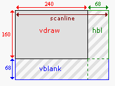

# 4. Introduction to GBA Graphics

<!-- toc -->

## General introduction {#sec-intro}

The GBA has an LCD screen that is 240 pixels wide, 160 pixels high and is capable of displaying 32768 (15 bit) colors. The refresh rate is just shy of 60 frames per second (59.73 Hz). The GBA has 5 independent layers that can contain graphics: 4 <dfn>backgrounds</dfn> and one <dfn>sprite</dfn> layer and is capable of some special effects that include blending two layers and mosaic and, of course, rotation and scaling.

Whereas sound and joypad functionality have to make do with only a few measly registers, the video system has a great deal of memory at its disposal (relatively speaking). Apart from a multitude of registers in I/O memory, there's the 96kb of video memory (starting at `0600:0000h`), palette memory (`0500:0000h`) and OAM memory (`0700:0000h`).

## Draw and blank periods {#sec-blanks}

As said, the entire GBA screen is refreshed every 60th of a second, but there's more to it than that. After a scanline has been drawn (the HDraw period, 240 pixels), there is a pause (HBlank, 68 pixels) before it starts drawing the next scanline. Likewise, after the 160 scanlines (VDraw) is a 68 scanline blank (VBlank) before it starts over again. To avoid tearing, positional data is usually updated at the VBlank. This is why most games run at 60 or 30 fps. (FYI, syncing at the VBlank is also why we in PAL countries often had slower games: PAL TVs run (ran) at 50Hz, hence only 50 fps instead of 60, hence a 17% slower game if nobody bothered to account for it. Few companies ever did <kbd>:(</kbd> ).

Both the [CowBite Spec](http://www.cs.rit.edu/~tjh8300/CowBite/CowBiteSpec.htm#Graphics%20Hardware%20Overview) and [GBATek](http://nocash.emubase.de/gbatek.htm#lcddimensionsandtimings) give you some interesting details about the timings of the display. A full screen refresh takes exactly 280896 cycles, divided by the clock speed gives a framerate of 59.73. From the Draw/Blank periods given above you can see that there are 4 cycles per pixel, and 1232 cycles per scanline. You can find a summary of timing details in table 4.1.

<br>  

<table width=80%>
<tr align="center">
  <td>
  <div class="cpt" style="width:192px;">
  <br>
  <b>{*@fig:gba-draw}</b>: vdraw, vblank and hblank periods.
  </div>

  <td>
	<table id="tbl:disp-timing" 
	  border=1 cellspacing=0 cellpadding=2>
	<caption align="bottom">
	  <b>{*@tbl:disp-timing}</b>: Display timing details
	</caption>
	<col>
	<col span=2 align="right">
	<tr align="center">
	  <th>subject	<th>length		<th>cycles
	<tr>
	  <td>pixel		<td>     1		<td>     4
	<tr>
	  <td>HDraw		<td>   240px	<td>   960
	<tr>
	  <td>HBlank	<td>    68px	<td>   272
	<tr>
	  <td>scanline	<td>Hdraw+Hbl	<td>  1232
	<tr>
	  <td>VDraw 	<td>160*scanline<td>197120
	<tr>
	  <td>VBlank	<td>68*scanline	<td> 83776
	<tr>
	  <td>refresh	<td>VDraw+Vbl	<td>280896
	</table>
</table>

## Colors and palettes {#sec-colors}

The GBA is capable of displaying 16bit colors in a 5.5.5 format. That means 5 bits for red, 5 for green and 5 for blue; the leftover bit is unused. Basically, the bit-pattern looks like this: “<code>x<font color=blue>bbbbb</font><font color= green>ggggg</font><font color= red>rrrrr</font></code>”. There are a number of defines and macros in `color.h` that will make dealing with color easier.
<br>  
Now, as for palettes...  
`<rant>`

Guys, the word here is **“palette”**! One ‘l’, two ‘t’s and an ‘e’ at the end. It is not a **“pallet”**, which is “a low, portable platform, usually double-faced, on which materials are stacked for storage or transportation, as in a warehouse”, nor is it a **“pallette”**, meaning “a plate protecting the armpit, in a suit of armor”. The word **“pallete”**, its most common variant, isn't even in the dictionary, thus not even worth considering. It's “palette”, people, “palette”.  
`</rant>`

Anyhoo, the GBA has two palettes, one for sprites (objects) and one for backgrounds. Both palettes contain 256 entries of 16bit colors (512 bytes, each). The background palette starts at `0500:0000h`, immediately followed by the sprite palette at `0500:0200h`. Sprites and backgrounds can use these palettes in two ways: as a single palette with 256 colors (8 bits per pixel); or as 16 sub-palettes or <dfn>palette banks</dfn> of 16 colors (4 bits per pixel).

One final thing about palettes: index 0 is the <dfn>transparency index</dfn>. In paletted modes, pixels with a value of 0 will be transparent.

## Bitmaps, backgrounds and sprites {#sec-vid-types}

All things considered, the GBA knows 3 types of graphics representations: <dfn>bitmaps</dfn>, <dfn>tiled backgrounds</dfn> and <dfn>sprites</dfn>. The bitmap and tiled background (also simply known as background) types affect how the whole screen is built up and as such cannot both be activated at the same time.  
In bitmap mode, video memory works just like a *w*×*h* bitmap. To plot a pixel at location (*x,y*), go to location *y\*w+x* and fill in the color. Note that you cannot build up a screen-full of individual pixels each frame on the GBA, there are simply too many of them.

Tiled backgrounds work completely different. First, you store 8x8 pixel <dfn>tile</dfn>s in one part of video memory. Then, in another part, you build up a tile-map, which contains indices that tells the GBA which tiles go into the image you see on the screen. To build a screen you'd only need a 30x20 map of numbers and the hardware takes care of drawing the tiles that these numbers point to. This way, you *can* update an entire screen each frame. There are very few games that do not rely on this graphics type.

Finally, we have sprites. Sprites are small (8x8 to 64x64 pixels) graphical objects that can be transformed independently from each other and can be used in conjunction with either bitmap or background types.

:::tip Prefer tile modes over bitmap modes

In almost all types of games, the tile modes will be more suitable. Most other tutorials focus on bitmap modes, but that's only because they are easier on beginners, not because of their practical value for games. The vast majority of commercial games use tile modes; that should tell you something.

:::

Those are the three basic graphical types, though other classifications also spring to mind. For example, the bitmap and tiled backgrounds types, since they're mutually exclusive and use the entire screen, constitute the <dfn>background</dfn>-types. Also, it so happens that the tiles of tiled backgrounds and the sprites have the same memory layout (namely, in groups of 8x8 pixel tiles). This makes tiled backgrounds and sprites the tiled-types.

## Display registers: REG_DISPCNT, REG_DISPSTAT and REG_VCOUNT {#sec-vid-regs}

There are three I/O registers that you will encounter when doing anything graphical: the display control `REG_DISPCNT (0400:0000h)`, the display status `REG_DISPSTAT (0400:0004h)` and the scanline counter `REG_VCOUNT (0400:0006h)`. Those names are simply defines to the memory locations and can, in principle, be chosen at will. However, we will use the names as they appear in the [Pern Project](http://www.thepernproject.com), which are the most common.
<br>  
The REG_DISPCNT register is the primary control of the screen. The bit-layout of this register and their meanings can be found in the following table. This is the general format I will use for registers or register-like sections. The details of the format have already been explained in the [preface](intro.html#ssec-note-reg).

<div class="reg">
<table class="reg" id="tbl:reg-dispcnt"
  border=1 frame=void cellPadding=4 cellSpacing=0>
<caption class="reg">
  REG_DISPCNT @ <code>0400:0000h</code>
</caption>
<tr class="bits">
	<td>F<td>E<td>D<td>C<td>B<td>A<td>9<td>8
	<td>7<td>6<td>5<td>4<td class="rof">3<td>2 1 0
<tr class="bf">
	<td class="rclr4">OW
	<td class="rclr4">W1
	<td class="rclr4">W0
	<td class="rclr1">Obj
	<td class="rclr1">BG3
	<td class="rclr1">BG2
	<td class="rclr1">BG1
	<td class="rclr1">BG0
	<td class="rclr6">FB
	<td class="rclr2">OM
	<td class="rclr5">HB
	<td class="rclr3">PS
	<td class="rclr7">GB
	<td class="rclr0">Mode
</table>

<table>
  <col class="bits" width=40>
  <col class="bf" width="8%">
  <col class="def" width="12%">
<tr align="left"><th>bits<th>name<th>define<th>description
<tbody valign="top">
<tr class="bg0">
  <td>0-2 <td class="rclr0">Mode
  <td>DCNT_MODEx. <i>DCNT_MODE#</i>
  <td>Sets video mode. 0, 1, 2 are tiled modes; 3, 4, 5 are bitmap modes.
<tr class="bg1">
  <td class="rof">3   <td class="rclr7">GB
  <td>DCNT_GB
  <td>Is set if cartridge is a GBC game. Read-only.
<tr class="bg0">
  <td>4   <td class="rclr3">PS
  <td>DCNT_PAGE
  <td>Page select. Modes 4 and 5 can use page flipping for smoother 
    animation. This bit selects the displayed page (and allowing the 
    other one to be drawn on without artifacts).
<tr class="bg1">
  <td>5   <td class="rclr5">HB
  <td>DCNT_OAM_HBL
  <td>Allows access to OAM in an HBlank. OAM is normally locked in VDraw.
    Will reduce the amount of sprite pixels rendered per line.
<tr class="bg0">
  <td>6   <td class="rclr2">OM
  <td>DCNT_OBJ_1D
  <td>Object mapping mode. Tile memory can be seen as a 32x32 
    matrix of tiles. When sprites are composed of multiple tiles 
    high, this bit tells whether the next row of tiles lies 
    beneath the previous, in correspondence with the matrix 
    structure (2D mapping, <code>OM</code>=0), or right next to 
    it, so that memory is arranged as an array of sprites (1D 
    mapping <code>OM</code>=1). More on this in the 
    <a href="regobj.html">sprite</a> chapter.
<tr class="bg1">
  <td>7   <td class="rclr6">FB
  <td>DCNT_BLANK
  <td>Force a screen blank.
<tr class="bg0">
  <td>8-B  <td class="rclr1">BG0-BG3, Obj
  <td>DCNT_BGx, DCNT_OBJ. <i>DCNT_LAYER#</i>
  <td>Enables rendering of the corresponding background and sprites.
<tr class="bg1">
  <td>D-F <td class="rclr4">W0-OW
  <td>DCNT_WINx, DCNT_WINOBJ
  <td>Enables the use of windows 0, 1 and Object window, respectively.
    Windows can be used to mask out certain areas (like the 
    lamp did in Zelda:LTTP).
</tbody>
</table>
</div>

Setting the display control is probably the first thing you'll be doing. For simple demos, you can just set it once and leave it at that, though switching between the video-modes can have some interesting results.
<br>  
Now the other two registers I mentioned, `REG_DISPSTAT` and `REG_VCOUNT`. The latter tells you the scanline that is currently being worked on. Note that this counter keeps going into the VBlank as well, so it counts to 227 before starting at 0 again. The former gives you information about the Draw/Blank status and is used to set display [interrupts](interrupts.html). You can also do some really cool stuff with the interrupts that you can enable here. For one thing, the HBlank interrupt is used in creating [Mode 7](mode7.html) graphics, and you want to know how that works, don't you?

<div class="reg">
<table class="reg" id="tbl:reg-dispstat"
  border=1 frame=void cellPadding=4 cellSpacing=0>
<caption class="reg">
  REG_DISPSTAT @ <code>0400:0004h</code>
</caption>
<tr class="bits">
  <td>F E D C B A 9 8
  <td>7 6<td>5<td>4<td>3<td class="rof">2<td class="rof">1<td class="rof">0
<tr class="bf">
  <td class="rclr3">VcT
  <td>-
  <td class="rclr2">VcI
  <td class="rclr1">HbI
  <td class="rclr0">VbI
  <td class="rclr2">VcS
  <td class="rclr1">HbS
  <td class="rclr0">VbS
</table>

<table>
  <col class="bits" width=40>
  <col class="bf" width="8%">
  <col class="def" width="15%">
<tr align="left"><th>bits<th>name<th>define<th>description
<tbody valign="top">
<tr class="bg0">
  <td>0<td class="rclr0">VbS
  <td>DSTAT_IN_VBL
  <td>VBlank status, read only. Will be set inside VBlank, clear in VDraw.
<tr class="bg1">
  <td>1 <td class="rclr1">HbS
  <td>DSTAT_IN_HBL
  <td>HBlank status, read only. Will be set inside HBlank.
<tr class="bg0">
  <td>2 <td class="rclr2">VcS
  <td>DSTAT_IN_VCT
  <td>VCount trigger status. Set if the current scanline matches the 
    scanline trigger ( <code>REG_VCOUNT</code> == 
    <code>REG_DISPSTAT</code>{8-F} )
<tr class="bg1">
  <td>3 <td class="rclr0">VbI
  <td>DSTAT_VBL_IRQ
  <td>VBlank interrupt request. If set, an interrupt will be fired at 
    VBlank.
<tr class="bg0">
  <td>4 <td class="rclr1">HbI
  <td>DSTAT_HBL_IRQ
  <td>HBlank interrupt request. 
<tr class="bg1">
  <td>5 <td class="rclr2">VcI
  <td>DSTAT_VCT_IRQ
  <td>VCount interrupt request. Fires interrupt if current scanline 
    matches trigger value.
<tr class="bg0">
  <td>8-F <td class="rclr3">VcT
  <td><i>DSTAT_VCT#</i>
  <td>VCount trigger value. If the current scanline is at this value, 
    bit 2 is set and an interrupt is fired if requested.
</tbody>
</table>
</div><br>

<div class="reg">
<table class="reg" id="tbl:reg-vcount" width="320"
  border=1 frame=void cellPadding=4 cellSpacing=0>
<caption class="reg">
  REG_VCOUNT @ <code>0400:0006h</code> (read-only)
</caption>
<tr class="bits">
	<td>F E D C B A 9 8
	<td class="rof">7 6 5 4 3 2 1 0
<tr class="bf">
  <td>-
  <td class="rclr0">Vc
</table>

<table>
  <col class="bits" width=40>
  <col class="bf" width="8%">
<tr align="left"><th>bits<th>name<th>description
<tbody valign="top">
<tr class="bg0">
  <td>0-7 <td class="rclr0">Vc
  <td>Vertical count. Range is [0,227]
</tbody>
</table>
</div>

## Vsyncing part I, the busy-wait loop {#sec-vsync1}

As said, use the VBlank as a timing mechanism and to update the game data. This is called <dfn>vsync</dfn> (**v**ertical **sync**ronisation). There are a number of ways to vsync. The two most common methods use a while loop and check `REG_VCOUNT` or `REG_DISPSTAT`. For example, since the VBlank starts at scanline 160, you could see when `REG_VCOUNT` goes beyond this value.

```c
#define REG_VCOUNT *(u16*)0x04000006

void vid_vsync()
{    while(REG_VCOUNT < 160);   }
```

Unfortunately, there are a few problems with this code. First of all, if you're simply doing an empty `while` loop to wait for 160, the compiler may try to get smart, notice that the loop doesn't change `REG_VCOUNT` and put its value in a register for easy reference. Since there is a good chance that that value will be below 160 at some point, you have a nice little infinite loop on your hand. To prevent this, use the keyword `volatile` (see `regs.h`). Second, in small demos simply waiting for the VBlank isn't enough; you may still be in that VBlank when you call `vid_sync()` again, which will be blazed through immediately. That does not sync to 60 fps. To do this, you first have to wait until the *next* VDraw. This makes our `vid_sync` look a little like this:

```c
#define REG_VCOUNT *(vu16*)0x04000006

void vid_vsync()
{
    while(REG_VCOUNT >= 160);   // wait till VDraw
    while(REG_VCOUNT < 160);    // wait till VBlank
}
```

This will always wait until the start of the next VBlank occurs. And `REG_VCOUNT` is now `volatile` (the “`vu16`” is `typedef`ed as a <u>v</u>olatile <u>u</u>nsigned (<u>16</u>bit) short. I'll be using a lot of this kind of shorthand, so get used to it). That's one way to do it. Another is checking the last bit in the display status register, `REG_DISPSTAT`\{0\}.
<br>  
So we're done here, right? Errm ... no, not exactly. While it's true that you now have an easy way to vsync, it's also a very poor one. While you're in the while loop, you're still burning CPU cycles. Which, of course, costs battery power. And since you're doing absolutely nothing inside that while-loop, you're not just using it, you're actually wasting battery power. Moreover, since you will probably make only small games at first, you'll be wasting a *LOT* of battery power. The recommended way to vsync is putting the CPU in low-power mode when you're done and then use interrupts to bring it back to life again. You can read about the procedure [here](swi.html#sec-vsync2), but since you have to know how to use [interrupts](interrupts.html) and [BIOS calls](swi.html), you might want to wait a while.
